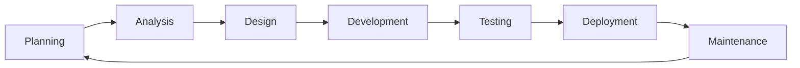
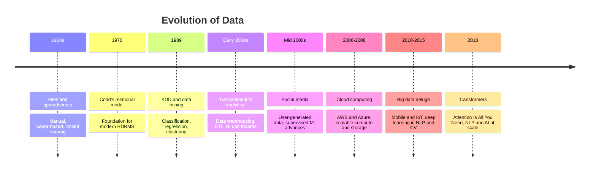
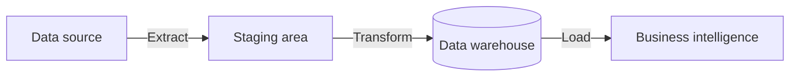
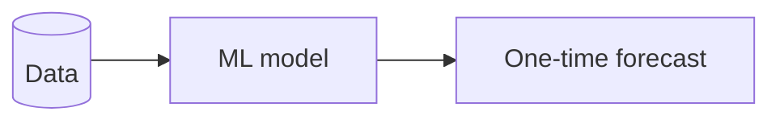
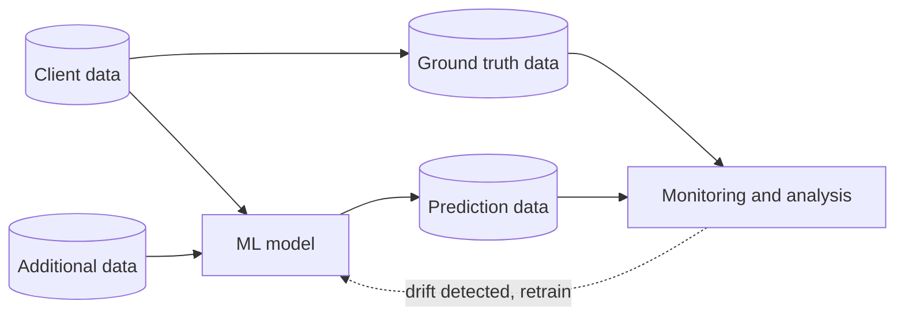
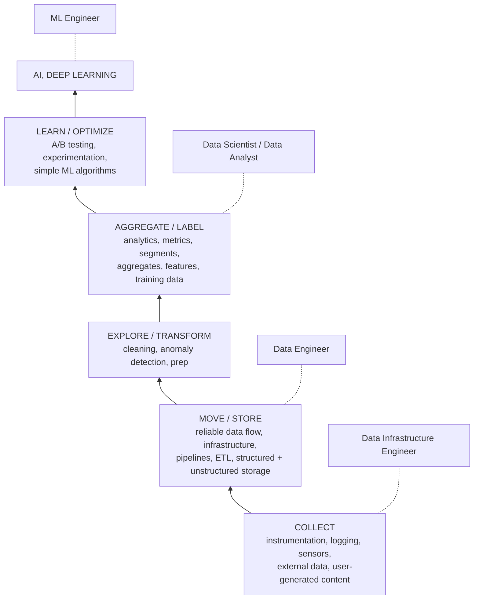

# 546 · Session 01 · Foundations of ML Systems Engineering

Source: Session 1 slides (Dr. Prashant Vaish, 28 slides) · T1 ch1,3 · R1 | Exam: **mid-sem (closed)** | Date learned: ____

## Concepts this session

SDLC & roles · Evolution of software development · SDLC → ADLC · Data evolution timeline · What data science is · DS/AI/ML convergence · The three data roles · Data science hierarchy of needs

> **Scope note.** The agenda slide promises ML terminology, ML pipeline, foundation models and ML domains, but the deck stops at the data science hierarchy of needs. That ML material either ran in class beyond the slides or carries into session 2 — check the recording.

---

## 1. Software Development Life Cycle (SDLC)

**Intuition** — A structured, repeating process for building software: plan it, understand it, design it, build it, check it, ship it, keep it alive. It's a cycle, not a line — maintenance feeds back into planning.

**Mechanism**



**Worked example** — A fraud-detection feature: *Planning* — is fraud loss worth a project? *Analysis* — what counts as fraud, what data exists. *Design* — where the scorer sits in the payment flow. *Development* — build it. *Testing* — does it catch known fraud without blocking good customers. *Deployment* — shadow mode, then live. *Maintenance* — fraud patterns shift, so retrain.

**Tradeoff / when NOT to use** — The phases are always present, but running them **once, in strict order** (Waterfall) only works when requirements are genuinely fixed and knowable up front. ML violates that assumption by construction: you cannot specify the accuracy target before you've seen whether the data supports it. This is precisely why the course exists.

> **Closed-book card**
> SDLC = Planning → Analysis → Design → Development → Testing → Deployment → Maintenance → back to Planning. Structured process to plan, build, test, deploy, maintain. Phases are universal; *sequencing them rigidly* is the Waterfall choice, and it breaks for ML because requirements aren't knowable up front.

---

## 2. Roles in the SDLC

**Intuition** — Software is a team sport, and the roles exist because different failures need different specialists watching for them.

| Role | One-line responsibility |
|---|---|
| Business Analyst | Translates business needs into clear technical requirements |
| Project Manager | Plans, coordinates and tracks execution against deadlines |
| Product Owner | Defines product vision, prioritises features for value |
| Team Lead | Guides the team technically, keeps tasks moving |
| Software Architect | Designs overall system structure and technical strategy |
| Developers | Build and implement functionality |
| QA Team | Validates quality through systematic testing (**shift-left testing**) |
| Testers | Find defects, verify requirements are met |
| Scrum Master | Facilitates Agile process, removes impediments |
| UX/UI Designers | Design intuitive, usable interfaces |

**Shift-left testing** — move testing earlier ("left" on the timeline) instead of treating it as a gate at the end. Defects found in design cost a fraction of defects found in production. Slide 17 calls this out explicitly, which usually means it's exam-worthy.

**Tradeoff** — This role list assumes an organisation big enough to staff it. In a small team one person wears four hats, and the risk flips from coordination overhead to blind spots — the person who wrote the code also decides whether it's tested enough.

> **Closed-book card**
> BA · PM · PO · Team Lead · Architect · Developers · QA (shift-left) · Testers · Scrum Master · UX/UI. Shift-left = test early, defects get cheaper the earlier you catch them.

---

## 3. Evolution of software development

**Intuition** — Four things evolved *together*, not separately: how you develop, how the app is structured, how you ship it, and what it runs on. Each era's four choices reinforce each other.

| Era | Development process | Application architecture | Deployment & packaging | Infrastructure |
|---|---|---|---|---|
| ~1980–1990 | Waterfall | Monolithic | Physical server | Datacenter |
| ~2000 | Agile | N-tier | Virtual servers | Hosted |
| ~2010 | **DevOps** | **Microservices** | **Containers** | **Cloud** |

**The equation on slide 18:**

```
Cloud Native App = Agile + DevOps + Microservices + Containers + Cloud
```

**Tradeoff / when NOT to use** — Microservices and containers buy independent deployment and scaling, and they cost you distributed-system problems you didn't have before: network failures between services, distributed tracing, eventual consistency, and far more operational surface. A monolith on one server is genuinely the right answer for a small team with modest load. "Cloud native" is not a maturity score.

Cross-link: → `_shared/docker-k8s.md` · overlaps **549 S2–S3**

---

## 4. SDLC → ADLC (AI-Driven Development Life Cycle)

**Intuition** — Process models have been climbing a ladder — Waterfall → Iterative → Agile → Scaled Agile → and now *Scaled Agile with AI infusion*, the "desired state" the Tech Mahindra report calls **ADLC**. Each rung fixed the previous rung's biggest pain and introduced a new one.

**Mechanism** — the progression, with what each stage gains and what it costs:

| Stage | Features | Challenges | Impact |
|---|---|---|---|
| **Waterfall** | Predictability, simplicity; works with well-defined requirements | Static docs in monolithic blocks; heavy up-front documentation is error-prone; **late discovery of defects** | Higher time to market; increased cost; customer dissatisfaction |
| **Iterative** | Evolving documentation; continuous testing for early issue detection | Document synchronisation; keeping test cases consistent across iterations | Higher operational overhead; inconsistent deliverable quality; unpredictable timelines |
| **Agile** | Just-enough documentation; continuous integration, testing, deployment | Balancing detail with agility; robust automation suite is hard; needs experienced team | Depends on human skill; higher initial investment; efficiency/quality tradeoffs |
| **Scaled Agile** | Consistency in documentation; systematic integrated approach with continuous delivery pipeline | Consistent artifacts across many teams; coordinating testing across teams is cumbersome | Impact on time-to-market; high dependence on human intervention; reduced cross-team efficiency |
| **ADLC** (desired) | AI-assisted automation of all SDLC activities — generating documents, design, code, test cases, test data, automation scripts, deployment scripts | *(the report doesn't list them — that's the open question)* | Faster time-to-market; reduced dependence on human expertise; consistent deliverable quality |

**Worked example** — Same fraud detector under Waterfall: you'd write a 60-page spec, discover in UAT that the label definition was wrong, and eat a six-month delay. Under ADLC: AI drafts the spec, generates test data covering fraud edge cases, and writes the deployment scripts — so the loop from "label definition is wrong" to "corrected and redeployed" is days.

**Tradeoff / when NOT to use** — Notice the pattern in the Impact column: every stage reduces *human dependence* and increases *tooling dependence*. ADLC's stated benefit — "reduced dependence on human expertise" — is also its risk. Generated code, tests and specs need a human who can tell correct from plausible, and that judgment is exactly what atrophies when generation is automated. The report lists no ADLC challenges, which should read as *unproven*, not *solved*.

> **Closed-book card**
> Waterfall → Iterative → Agile → Scaled Agile → **ADLC** (Scaled Agile + AI infusion). Each rung: better feedback speed, more coordination/tooling cost. ADLC = AI-assisted automation of *all* SDLC activities (docs, design, code, test cases, test data, scripts). Gains: faster TTM, consistent quality, less human dependence. Risk: that last "gain" is also the danger — someone must still tell correct from plausible.

Cross-link: → **546 S15** (ADLC phases in detail) · R1 Tech Mahindra white paper

---

## 5. Evolution of data

**Intuition** — Sixty years of one pressure: more data than the previous generation's tools could hold, forcing a new layer each time.



**The through-line** — storage capacity → computing power → algorithms → data volume. Each unlock enabled the next. Transformers didn't arrive because someone had a clever idea in 2018; they arrived because the 2010–2015 data deluge and cloud compute made them trainable.

Cross-link: → **536 S1–S2** (transformers, pre-training, scaling laws)

---

## 6. What data science is

**Intuition** — Data science is the study of data: turning it into a *story* that produces insight, and insight that produces a decision. If no decision changes, it wasn't data science — it was reporting.

**The convergence** — data science sits where three fields overlap, and each pairwise overlap has its own name:

| Overlap | What it produces |
|---|---|
| Math/Statistics ∩ Domain knowledge | **Research** |
| Math/Statistics ∩ CS/IT | **Software development** |
| Domain knowledge ∩ CS/IT | **Machine learning** |
| **All three** | **Data science** |

That middle row is a favourite exam question because it's counter-intuitive: ML sits in the *domain + CS* overlap, meaning ML without statistical grounding is still ML — just fragile.

**Scope** — collection → preprocessing → analysis → prediction → visualisation (storytelling) → insight.

> **Closed-book card**
> Data science = Math/Stats ∩ Domain knowledge ∩ CS/IT. Pairwise: stats+domain = research; stats+CS = software dev; domain+CS = machine learning. Covers collection → preprocessing → analysis → prediction → visualisation → insight. The deliverable is a *decision*, not a chart.

---

## 7. The three data roles — where SE4ML actually bites

**Intuition** — Data engineer, data scientist and ML engineer are distinguished by **what they hand over**, and the handovers get progressively harder to engineer.

**Data engineer** — moves and stores data reliably.



**Data scientist** — produces a model and an answer, typically once.



**ML engineer** — runs a model continuously in production, with feedback.



**Worked example** — Fraud detection. The *data engineer* guarantees last night's transactions land in the warehouse by 6am. The *data scientist* shows a model catches 82% of fraud on last year's data. The *ML engineer* runs it on live traffic, compares predictions against confirmed-fraud ground truth as it arrives, notices recall sliding from 82% to 61% as fraud tactics change, and retrains.

**Tradeoff / when NOT to use** — The data scientist's diagram is a *one-time forecast* and that's often correct: a pricing study, a feasibility check, a board question. Building the full ML-engineer loop for a question asked once is waste. The failure mode this course is about is the opposite one — a one-time-forecast notebook getting promoted into a production dependency without anyone adding the ground-truth loop, so it degrades silently.

> **Closed-book card**
> Data engineer → reliable data flow (ETL: source → staging → warehouse → BI). Data scientist → model + **one-time forecast**. ML engineer → **continuous loop**: client data + additional data → model → predictions → compared with ground truth → monitoring → retrain. The gap the course targets: notebook promoted to production without the ground-truth loop, degrading silently.

Cross-link: → `_shared/ml-lifecycle.md` · **549 S4**

---

## 8. Data science hierarchy of needs

**Intuition** — You cannot do the fun layer until the boring layers underneath work. AI sits at the apex of a pyramid whose base is instrumentation and logging.



**Worked example** — A team wants an LLM assistant over company documents. Apex layer. But if documents aren't collected in one place (COLLECT), or the pipeline that syncs them is unreliable (MOVE/STORE), or they're full of duplicates and dead links (EXPLORE/TRANSFORM), the assistant produces confident nonsense. The failure looks like a model problem and is a base-of-pyramid problem.

**Tradeoff / when NOT to use** — The pyramid is a *dependency* claim, not a *sequencing mandate*. Read too literally it says "spend two years on data infrastructure before touching ML," which kills projects. The honest reading: build a thin vertical slice through all six layers for one use case, then widen. Also note simple ML sits *below* deep learning — A/B tests and logistic regression solve a large fraction of problems that get pitched as AI.

> **Closed-book card**
> Bottom → top: Collect (instrumentation, logging) → Move/Store (pipelines, ETL) → Explore/Transform (cleaning, anomaly detection) → Aggregate/Label (metrics, features, training data) → Learn/Optimize (A/B tests, simple ML) → AI/Deep Learning. Roles map: infra engineer at base, data engineer at move/store, data scientist at aggregate/label, ML engineer at apex. Dependency claim, not a two-year sequencing plan — cut a thin vertical slice.

---

## ⚠️ Admin — conflicts with the handout

The evaluation slide **disagrees with the course handout**. Verify on Taxila before planning around either.

| Component | Handout says | Slide 11 says |
|---|---|---|
| Quiz 5% | 10–20 Aug 2026 | "Before mid-term" ✓ consistent |
| Situated Learning 5% | **27 Aug – 7 Sep** (before mid-term) | **"After mid-term"** ✗ conflict |
| Assignment I 10% | *(bundled as I & II, 29 Oct – 11 Nov)* | **"Before mid-term"** ✗ conflict |
| Assignment II 10% | 29 Oct – 11 Nov | "After mid-term" ✓ consistent |

If the slides are right, **Assignment I (10%) lands before 19 Sep** — inside the mid-sem run-up, which the study plan currently treats as clear. That would be the single biggest change to the semester plan. Resolve it in week 1.

Other admin from the deck:

- Sessions run on **MS Teams**, online.
- Assignments are administered on the **Taxila portal** — not Canvas, not eLearn. Course material goes to both Teams and Taxila.
- Announcements on Taxila cover: assignments released, class rescheduling/cancellation, mid-sem and comprehensive syllabus, and **scheme + solution documents after each exam** (worth collecting — past schemes show how marks are actually allocated).
- Instructor: prashant.vaish@pilani.bits-pilani.ac.in — put the course code in the subject line.
- Tools list adds a **RAG pipeline** stack not in the handout: LangChain, ChromaDB, OpenAI embeddings, OpenAI LLM. Confirms 546 S6 (RAG as an architectural pattern) is hands-on, not just conceptual.
- Environment: Virtual Lab + **AWS Console Lab**.

---

## Confusions to resolve

- [ ] Does the ML terminology / ML pipeline / foundation models content from the agenda appear in the recording, or does it move to session 2?
- [ ] Situated Learning and Assignment I timing — slides vs handout (see table above)
- [ ] Is the AWS Console Lab access provisioned, or self-provisioned?

## Lab / build

No lab this session. **546 Lab 1 is at session 3** — an end-to-end ML system blueprint for a real-world use case, with fraud detection named in the handout as the example.

**Action now:** commit to fraud detection as the running example for all sixteen sessions. Record it in `546-master.md`.
