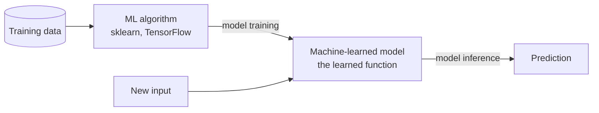
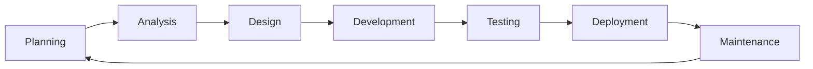
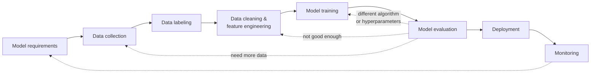
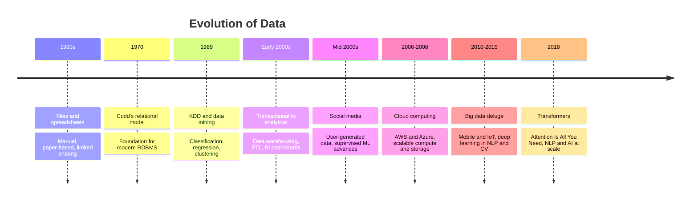
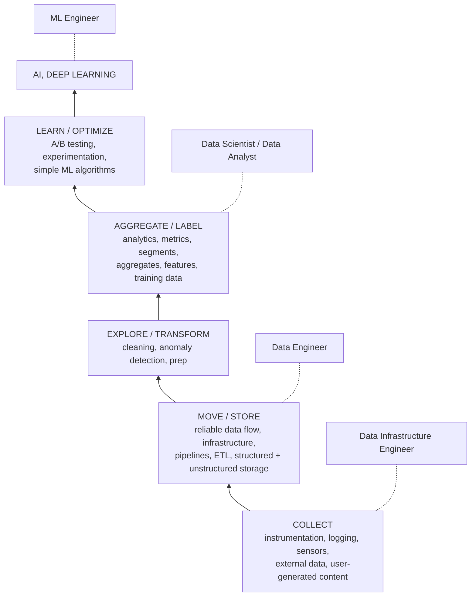
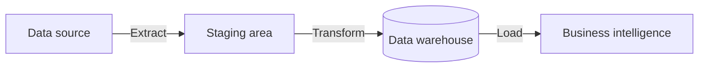
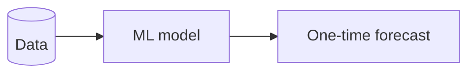
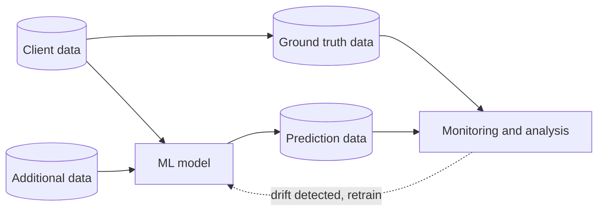

# 546 · Session 01 · Foundations of ML Systems Engineering

Exam: **mid-sem (closed book)** | Date learned: ____ | Running example: **fraud detection**
Assembled from: Session 1 slides (Dr. Prashant Vaish, 28 sl) · T1 Kästner ch1 & ch3 · R1 Tech Mahindra ADLC report

## Topics

1. Why this course exists · 2. ML vocabulary · 3. Two lifecycles: SDLC and the ML pipeline · 4. From Waterfall to ADLC · 5. How software and data got here · 6. What data science is · 7. Who builds these systems · 8. What ML changes about engineering · 9. The risk spectrum · 10. Foundation models and prompting · 11. MLOps and responsible ML

---

## 1. Why this course exists

*Sources: T1 ch1 · slide 5 (course description)*

**Intuition** — You can train a good model and still have no product. The gap between "the model works in my notebook" and "customers pay for this and it doesn't fall over" is the entire subject of this course, and it's an engineering gap, not an ML gap.

**The numbers** — consultants report **87% of ML projects fail**, and **53% never make it from prototype to production**.

**Worked example — T1's spine, the transcription start-up.** Sidney, a data scientist, publishes state-of-the-art domain-specific speech recognition and starts a company selling transcription to researchers and conference organisers. The models are genuinely excellent. The business struggles anyway:

| What went wrong | Which module fixes it |
|---|---|
| Customer audio far noisier than academic benchmarks | Requirements (M2), data quality (M5) |
| Customers want <15 min turnaround; live captioning needs to be instant — turned out **infeasible** without shipping specialised hardware to venues | Quality attributes (M2), architecture (M3) |
| Training and inference costs eat the margin; pricing took a lot of experimentation | Quality attributes, cost (M2–M3) |
| LLM features hit excessive API costs; self-hosting open models was brittle and consumed their few GPUs | Architecture (M3), deployment (M6) |
| Team had to build a website and payments they had no experience with or interest in; UX was an afterthought | From models to systems (M1) |
| Founders and hired front-end engineers **could not communicate effectively** | Interdisciplinary teams (M1) |
| Manual training scripts; nobody updated TensorFlow for a year out of fear; a model update caused a major outage and a long night reverting | Automation, versioning (M6) |
| Medical diagnoses mistranscribed **with high confidence**; African American vernacular barely intelligible | Fairness, responsible ML (M7) |
| No visibility into model performance unless a customer complained | Monitoring (M6), QA (M5) |

**The line to remember** — T1's own framing after that list: *most of these challenges are not surprising and most are not unique to ML.* The model was never the problem. Every failure was an engineering failure **around** a good model.

**Tradeoff / when NOT to worry about this** — Not every model needs a product around it. A one-off analysis answering a board question is finished when the answer is delivered; building requirements, monitoring and deployment infrastructure for it is waste. The engineering investment is justified by *continued operation*, not by the model's existence.

> **Closed-book card**
> Gap between working model and working product = engineering, not ML. **87% of ML projects fail; 53% never reach production.** T1's transcription start-up: great models, failing business — noisy real data, infeasible latency, inference cost vs margin, unwanted web/payments work, DS↔engineer communication breakdown, manual scripts and a botched model update, fairness failures *with high confidence*, no monitoring except complaints. Point: everything around the model failed, not the model.

---

## 2. Machine learning vocabulary

*Sources: T1 ch3 (the ML terminology the slide agenda promised; the deck stops before it)*

### 2.1 Algorithm vs model, training vs inference

**Intuition** — Two different things both get called "the ML", and keeping them apart is most of the clarity in this course. The **algorithm** is the procedure that *creates* the function. The **model** is the function that gets *used*. The algorithm runs once, at training. The model runs a billion times, in production.



The nesting, stated flatly in T1: **AI ⊃ machine learning ⊃ deep learning**, with **foundation models** a kind of large model typically produced by deep learning. Supervised ML learns from *(data, label)* pairs, where the label is the expected output.

**Worked example** — `sklearn.tree.DecisionTreeClassifier` is the *algorithm*. `.fit(transactions, is_fraud)` is *training*. The fitted tree — a specific set of if-then-else conditions — is the *model*. `.predict(new_transaction)` is *inference*. Only the model ships to production; sklearn's training code needn't be there at all.

**Tradeoff / when the distinction bites** — Software engineers routinely conflate the two and then reason wrongly about deployment: shipping the whole training environment to production "because we need sklearn", inflating the container and the attack surface. This distinction is what makes model serving a separate architectural concern (S12).

### 2.2 Parameters, hyperparameters, and the compiler analogy

**Intuition** — Inside a model there are numbers the algorithm *learned* and numbers you *chose*. Learned → **parameters**. Chosen → **hyperparameters**.

| | Set by | Example | Fixed when |
|---|---|---|---|
| Model architecture | You (T1 counts it as a hyperparameter) | 3-layer net; decision tree | Before training |
| **Hyperparameters** | You | Max depth = 2; learning rate; stopping criterion | Before training |
| **Parameters** | The algorithm, from data | Threshold `amount > 500`; matrix weights | During training |

**The analogy to remember**, in T1's words: *where a compiler takes source code to generate an executable function, an ML algorithm takes data to create a function (model). Just like the compiler, the ML algorithm is no longer used at runtime. Hyperparameters correspond to compiler options.*

| Traditional software | Machine learning |
|---|---|
| Source code | Training data |
| Compiler | ML algorithm |
| Compiler options (`-O2`) | **Hyperparameters** |
| Executable | Model |
| Running the executable | Inference |
| Bytecode + JVM | Serialized ("pickled") model + runtime |

**Worked example — T1's own, and it's fraud detection.** A decision tree for credit-card fraud, trained with a hyperparameter capping nesting at two levels. The learned function is two nested if-then-else statements (the *internal structure*), with specific decision boundaries on `terminalRisk` and `amount` (the *parameters*). You chose "depth ≤ 2"; the data chose the thresholds.

**Two consequences T1 draws out:**

- **Training is often non-deterministic** — retraining on identical data can produce a slightly different model. This breaks the reproducibility assumption engineers carry over from compilers, and is why S14 devotes a section to provenance and reproducibility.
- **Models are stored serialized, not as binaries** — an intermediate format of learned parameters, loaded by a runtime. Directly analogous to Java bytecode plus the JVM. Some infrastructure compiles models to native code for speed.

**Tradeoff / where the analogy breaks** — and this is exam-worthy precisely because it's so nearly right: a compiler is deterministic and its output is *specified*. An ML algorithm is neither. Push the analogy too far and you start expecting a "correct" model the way you expect a correct binary. T1's precise position: the **model** is a pure, deterministic, side-effect-free function; the **training** that produced it is not.

### 2.3 Terminology traps

T1 devotes a section to this, which signals it can be asked.

| Ambiguous word | Say instead |
|---|---|
| model | *machine-learned model* vs *software-architecture model* |
| performance | *prediction accuracy* vs *inference latency* |
| parameter | *model parameter* (learned) vs *hyperparameter* (chosen) |

> **Closed-book card**
> **Algorithm** (sklearn/TF) + training data → *training* → **model** (learned function); model + input → *inference* → prediction. AI ⊃ ML ⊃ deep learning; foundation models = large DL models. Supervised = (data, label) pairs.
> **Parameters** learned from data; **hyperparameters** chosen by you (depth, learning rate, stopping; architecture counts). Analogy: source→compiler→executable ≈ data→algorithm→model, **hyperparameters = compiler options**, algorithm absent at runtime, model stored *pickled* ≈ bytecode+JVM. Breaks because compiler output is deterministic and specified; ML training is neither — though the trained model itself is deterministic.
> Never say bare "performance" (accuracy vs latency), bare "model" (learned vs architecture), bare "parameter".

---

## 3. Two lifecycles: the SDLC and the ML pipeline

*Sources: slides 16–17 (SDLC, roles, shift-left) · T1 ch3 (ML pipeline) · T1 ch1 (why the SDLC assumption breaks)*

### 3.1 The Software Development Life Cycle

**Intuition** — A structured, repeating process for building software: plan it, understand it, design it, build it, check it, ship it, keep it alive. A cycle, not a line — maintenance feeds back into planning.



**Shift-left testing** — move testing earlier ("left" on the timeline) rather than treating it as a final gate. Defects found in design cost a fraction of defects found in production. Called out explicitly on the roles slide, which usually signals exam-worthy.

**Worked example** — Fraud detection. *Planning* — is fraud loss worth a project? *Analysis* — what counts as fraud, what data exists. *Design* — where the scorer sits in the payment flow. *Development* — build it. *Testing* — catches known fraud without blocking good customers. *Deployment* — shadow mode, then live. *Maintenance* — fraud patterns shift, retrain.

**Tradeoff / when the SDLC assumption fails** — The phases are always present; running them **once, in strict order** (Waterfall) only works when requirements are fixed and knowable up front. ML violates that by construction — you cannot specify the accuracy target before seeing whether the data supports it. That is the *lack of specifications* problem, developed in §8.1.

### 3.2 The machine-learning pipeline

**Intuition** — Training is one step of many. Everything before it is making data fit to learn from; everything after is deciding whether it's good enough and keeping it alive.



Two engineering-relevant properties, both from T1:

1. **It is highly iterative.** A bad evaluation sends you back to a different algorithm, different hyperparameters, more data, or different preparation. The dashed arrows are the normal path, not the exception.
2. **Most steps have surprisingly little code.** Preparation is programmed transformations (drop outlier rows, normalise a column). Training is "very few lines calling the library." **Deployment and monitoring are where the substantial infrastructure lives** — which is exactly why this is a software-engineering course.

**Worked example** — Fraud detection. *Requirements* — catch fraud above ₹5,000 within 200ms. *Collection* — 18 months of transactions. *Labeling* — confirmed chargebacks, which arrive 30–90 days late (a real problem, not a footnote). *Cleaning/features* — merchant risk score, velocity in last hour. *Training* — six lines. *Evaluation* — recall at a fixed false-positive rate. *Deployment* — behind the payment API. *Monitoring* — recall against chargebacks as they arrive.

### 3.3 How the two relate

Worth being able to state, because the exam can ask it either way round:

| | SDLC | ML pipeline |
|---|---|---|
| Scope | The whole system | One component of it |
| Driven by | Requirements | Requirements **and data** |
| Iterates because | Requirements change | Evaluation fails — routinely, by design |
| "Done" means | Meets the specification | Good enough on average; no specification exists |
| Output | Deployable system | A model that becomes *one part* of that system |

The ML pipeline sits **inside** the SDLC, roughly spanning its Design–Development–Testing phases, and adds a monitoring loop the SDLC's Maintenance phase never had to run continuously.

**Tradeoff / when NOT to automate the pipeline** — Full pipeline automation is the goal (S13), but automating *early*, before you know which steps you'll keep changing, builds infrastructure around a design you're about to throw away. Data scientists work notebook-cell-by-cell during exploration for good reason. The engineering judgment is knowing when exploration has stabilised enough to be worth automating.

> **Closed-book card**
> **SDLC**: Planning → Analysis → Design → Development → Testing → Deployment → Maintenance → loop. Phases universal; rigid *sequencing* is the Waterfall choice and breaks for ML (requirements unknowable up front). **Shift-left** = test early; defect cost rises the later you catch it.
> **ML pipeline**: model requirements → data collection → labeling → cleaning & feature engineering → training → evaluation → deployment → monitoring. **Highly iterative** — failed evaluation loops back to data, prep, algorithm or hyperparameters. Most steps are little code; **deployment and monitoring carry the infrastructure**.
> Relation: pipeline sits *inside* the SDLC (≈ design–development–testing), driven by requirements *and data*, "done" = good enough on average not spec-conformant, and adds a continuous monitoring loop.

Cross-link: → `_shared/ml-lifecycle.md` · **549 S4–S7** · **546 S13**

---

## 4. From Waterfall to ADLC

*Sources: slides 18–19 · R1 Tech Mahindra white paper*

**Intuition** — Process models climbing a ladder: Waterfall → Iterative → Agile → Scaled Agile → *Scaled Agile with AI infusion*, which the report calls **ADLC** (AI-Driven Development Life Cycle) and names as the desired state. Each rung fixed the previous rung's worst pain and introduced a new one.

| Stage | Features | Challenges | Impact |
|---|---|---|---|
| **Waterfall** | Predictability, simplicity; works with well-defined requirements | Static docs in monolithic blocks; heavy up-front documentation error-prone; **late defect discovery** | Higher time to market; increased cost; customer dissatisfaction |
| **Iterative** | Evolving documentation; continuous testing for early detection | Document synchronisation; keeping test cases consistent across iterations | Higher operational overhead; inconsistent quality; unpredictable timelines |
| **Agile** | Just-enough documentation; continuous integration, testing, deployment | Balancing detail with agility; robust automation suite is hard; needs experienced team | Depends on human skill; higher initial investment; efficiency/quality tradeoffs |
| **Scaled Agile** | Consistent documentation; systematic integrated approach with continuous delivery pipeline | Consistent artifacts across many teams; cross-team test coordination cumbersome | Impact on time-to-market; high human dependence; reduced cross-team efficiency |
| **ADLC** (desired) | AI-assisted automation of **all** SDLC activities — documents, design, code, test cases, test data, automation scripts, deployment scripts | *(the report lists none — that is itself the finding)* | Faster time-to-market; reduced dependence on human expertise; consistent quality |

**Worked example** — Fraud detector under Waterfall: a 60-page spec, then discovering in UAT that the label definition was wrong, then a six-month delay. Under ADLC: AI drafts the spec, generates test data covering fraud edge cases, writes the deployment scripts — so "the label definition is wrong" → corrected and redeployed takes days.

**Tradeoff / when NOT to use** — Read the Impact column downward: every stage reduces *human* dependence and increases *tooling* dependence. ADLC's stated benefit — "reduced dependence on human expertise" — is also its risk. Generated code, tests and specs need a human who can tell correct from plausible, and that judgment is exactly what atrophies when generation is automated. The report lists no ADLC challenges; read that as *unproven*, not *solved*.

> **Closed-book card**
> Waterfall → Iterative → Agile → Scaled Agile → **ADLC** (Scaled Agile + AI infusion). Each rung: faster feedback, more coordination/tooling cost. Waterfall's killer = late defect discovery. ADLC = AI-assisted automation of *all* SDLC activities (docs, design, code, test cases, test data, scripts). Gains: faster TTM, consistent quality, less human dependence. Risk: that last "gain" is the danger — someone must still tell correct from plausible; report lists no challenges = unproven, not solved.

Cross-link: → **546 S15** (ADLC phases in detail)

---

## 5. How software and data got here

*Sources: slides 18, 21*

### 5.1 Evolution of software development

**Intuition** — Four things evolved *together*, not separately: how you develop, how the app is structured, how you ship it, what it runs on. Each era's four choices reinforce each other.

| Era | Development process | Architecture | Deployment & packaging | Infrastructure |
|---|---|---|---|---|
| ~1980–1990 | Waterfall | Monolithic | Physical server | Datacenter |
| ~2000 | Agile | N-tier | Virtual servers | Hosted |
| ~2010 | **DevOps** | **Microservices** | **Containers** | **Cloud** |

```
Cloud Native App = Agile + DevOps + Microservices + Containers + Cloud
```

**Tradeoff / when NOT to go cloud-native** — Microservices and containers buy independent deployment and scaling, and cost you distributed-system problems you didn't previously have: network failures between services, distributed tracing, eventual consistency, far more operational surface. A monolith on one server is genuinely right for a small team with modest load. "Cloud native" is not a maturity score.

### 5.2 Evolution of data

**Intuition** — Sixty years of one pressure: more data than the previous generation's tools could hold, forcing a new layer each time.



**The through-line** — storage → compute → algorithms → data volume, each unlock enabling the next. Transformers didn't arrive because someone had a clever idea in 2018; they arrived because the 2010–2015 data deluge and cloud compute made them trainable.

> **Closed-book card**
> Software: ~1980–90 Waterfall/monolith/physical server/datacenter → ~2000 Agile/N-tier/virtual/hosted → ~2010 DevOps/microservices/containers/cloud. **Cloud native = Agile + DevOps + Microservices + Containers + Cloud.** Not a maturity score — a monolith is right for small teams.
> Data: 1960s files → 1970 Codd relational → 1989 KDD/data mining → early 2000s warehousing/ETL/BI → mid 2000s social media + supervised ML → 2006–08 cloud → 2010–15 big data + deep learning → 2018 transformers. Driver chain: storage → compute → algorithms → data volume.

Cross-link: → `_shared/docker-k8s.md` · **549 S2–S3** · **536 S1–S2**

---

## 6. What data science is

*Sources: slides 22–23, 28*

**Intuition** — The study of data: turning it into a *story* that produces insight, and insight that produces a decision. If no decision changes, it wasn't data science — it was reporting. Scope runs collection → preprocessing → analysis → prediction → visualisation (storytelling) → insight.

**The convergence** — three fields, and each pairwise overlap has its own name:

| Overlap | Produces |
|---|---|
| Math/Statistics ∩ Domain knowledge | **Research** |
| Math/Statistics ∩ CS/IT | **Software development** |
| Domain knowledge ∩ CS/IT | **Machine learning** |
| **All three** | **Data science** |

That third row is a favourite exam question because it's counter-intuitive: ML sits in the *domain + CS* overlap, meaning ML without statistical grounding is still ML — just fragile.

**The hierarchy of needs** — you cannot do the fun layer until the boring layers underneath work. AI sits at the apex of a pyramid whose base is instrumentation and logging.



**Worked example** — A team wants an LLM assistant over company documents. Apex layer. But if documents aren't collected in one place (COLLECT), or the sync pipeline is unreliable (MOVE/STORE), or they're full of duplicates and dead links (EXPLORE/TRANSFORM), the assistant produces confident nonsense. It looks like a model problem; it's a base-of-pyramid problem.

**Tradeoff / how NOT to read the pyramid** — It's a *dependency* claim, not a *sequencing mandate*. Read literally it says "spend two years on data infrastructure before touching ML," which kills projects. Honest reading: cut a thin vertical slice through all six layers for one use case, then widen. Note also that simple ML sits *below* deep learning — A/B tests and logistic regression solve a large share of problems pitched as AI.

> **Closed-book card**
> DS = Math/Stats ∩ Domain ∩ CS/IT. Pairwise: stats+domain = research; stats+CS = software dev; **domain+CS = machine learning**. Deliverable is a *decision*, not a chart. Scope: collection → preprocessing → analysis → prediction → visualisation → insight.
> Hierarchy of needs, bottom→top: Collect (instrumentation, logging) → Move/Store (pipelines, ETL) → Explore/Transform (cleaning, anomaly detection) → Aggregate/Label (metrics, features, training data) → Learn/Optimize (A/B tests, simple ML) → AI/Deep Learning. Dependency claim, not a two-year plan — cut a thin vertical slice.

---

## 7. Who builds these systems

*Sources: slide 17 (SDLC roles) · slides 25–28 (data roles, hierarchy role map) · T1 ch1 (data scientists vs software engineers, T-shaped, unicorns)*

**Intuition** — Roles exist because different failures need different specialists watching for them. In ML systems the roles come from two different traditions that were trained differently and mean different things by "done" — which is where the friction lives.

### 7.1 Roles in the SDLC

| Role | Responsibility |
|---|---|
| Business Analyst | Translates business needs into technical requirements |
| Project Manager | Plans, coordinates, tracks execution against deadlines |
| Product Owner | Defines vision, prioritises features for value |
| Team Lead | Guides technically, keeps tasks moving |
| Software Architect | Designs system structure and technical strategy |
| Developers | Build and implement functionality |
| QA Team | Validates quality systematically (shift-left testing) |
| Testers | Find defects, verify requirements met |
| Scrum Master | Facilitates Agile, removes impediments |
| UX/UI Designers | Design intuitive interfaces |

### 7.2 The three data roles

Distinguished by **what they hand over**, and the handovers get progressively harder to engineer.

**Data engineer** — moves and stores data reliably.



**Data scientist** — produces a model and an answer, typically once.



**ML engineer** — runs a model continuously in production, with feedback.



**Worked example** — Fraud detection. The *data engineer* guarantees last night's transactions land in the warehouse by 6am. The *data scientist* shows a model catches 82% of fraud on last year's data. The *ML engineer* runs it on live traffic, compares predictions against confirmed-fraud ground truth as it arrives, notices recall sliding from 82% to 61% as tactics change, and retrains.

**Tradeoff / when the one-time forecast is correct** — The data scientist's diagram genuinely is the right shape for a pricing study, a feasibility check, a board question. Building the full ML-engineer loop for a question asked once is waste. The failure this course targets is the opposite: a one-time-forecast notebook promoted into a production dependency without the ground-truth loop, degrading silently.

### 7.3 Data scientists vs software engineers — the actual friction

T1 states its own central theme outright: *how to get data scientists and software engineers to each contribute their distinct expertise while effectively working together.* The friction isn't skill, it's different notions of what "done" means.

| | Data scientists | Software engineers |
|---|---|---|
| Background | Statistics, ML algorithms (often PhD) | Requirements, design, QA, distributed systems, security |
| Prefer | Feature engineering, architecture, hyperparameter tuning; also much data gathering/cleaning | Delivering products meeting user needs, within budget and time |
| Workflow | Science-like, **exploratory**, computational notebooks | Design → implement → test → deploy → maintain |
| Evaluate by | **Accuracy on held-out test data**; maybe fairness, robustness | **Trade-offs** across usability, scalability, maintainability, security, cost, time |
| Rarely focus on | Inference latency, training cost | Feature engineering, testing for generalisation |

**Two terms that get asked:**

- **"Unicorns"** — people deeply skilled in both. Rare, "even considered mythical." Most people specialise. Don't staff a plan on unicorns.
- **T-shaped team members** — deep expertise in one area (the vertical) plus broad understanding of others (the horizontal). T1's stated goal is not to turn data scientists into engineers, but to give each enough breadth to *understand and appreciate* the other. T-shaped people are what make interdisciplinary teams work.

T1's evidence on the reverse direction is worth sitting with, since it describes most of this cohort: software engineers who pick up ML without formal training "approach machine learning rather naively with little focus on feature engineering, they rarely test models for generalization, and they think of more data and deep learning as the only next steps when stuck."

**Tradeoff / how NOT to use this contrast** — T1 calls it "oversimplified and overgeneralized" itself. As a lens on why a handover failed, useful. As a hiring stereotype, wrong — the point is complementarity, not superiority. And in a small team one person wears four hats, where the risk flips from coordination overhead to blind spots: whoever wrote the code also decides whether it's tested enough.

> **Closed-book card**
> SDLC roles: BA · PM · PO · Team Lead · Architect · Developers · QA (shift-left) · Testers · Scrum Master · UX/UI.
> Data roles by handover: **data engineer** → reliable data flow (ETL: source → staging → warehouse → BI); **data scientist** → model + *one-time forecast*; **ML engineer** → *continuous loop* (client + additional data → model → predictions → vs ground truth → monitoring → retrain).
> DS vs SE: DS = stats background, exploratory notebooks, evaluates by **accuracy on held-out test data**, ignores latency/cost. SE = delivers to budget/time, evaluates by **trade-offs**, rarely tests generalisation. **Unicorns** (deep in both) are rare — don't plan on them. Goal = **T-shaped**: deep in one, broad across others.
> Failure mode the course targets: notebook promoted to production without the ground-truth loop.

Cross-link: → `_shared/ml-lifecycle.md` · **546 M1 Interdisciplinary Teams** · **549 S4**

---

## 8. What ML changes about engineering

*Sources: T1 ch1*

**Intuition** — There's an open debate about whether ML fundamentally changes engineering or just demands that we finally apply existing practice rigorously. T1 gives three challenges, and for each argues the challenge is *harder* but *not new*. That two-part shape — challenge, then "but we've seen this before" — is what makes it exam-friendly, and you should reproduce both halves.

### 8.1 Lack of specifications

Traditional engineering relies on decomposition: specify each component, build and test separately, compose. T1's contrast:

```python
def compute_deductions(agi, expenses):
    """Compute deductions based on provided adjusted gross income
    and expenses in customer data. See tax code 26 U.S. Code A.1.B, PART VI.
    Adjusted gross income must be a positive value.
    Returns computed deduction value."""
```

```python
def transcribe(audio_file):
    """Return the text spoken within the audio file.
    ????"""
```

The first can be implemented by one developer and relied on by another without either seeing the other's code. The second cannot be specified — *we use ML precisely because we don't know how to specify the function.*

The deep shift: **deductive reasoning** (logic-based, applying rules) → **inductive reasoning** (generalising from observation). We can no longer ask whether a component is *correct*, only whether it works *well enough on average* on test data or in the system. And since some answers will be wrong, **the rest of the system must tolerate mistakes** — a design constraint, not an afterthought. This is the concrete reason the SDLC's "run the phases once in order" assumption (§3.1) fails.

*But not new:* software engineering has a long history of building safe systems from unreliable components, and comprehensive formal specifications were always rare. Engineers already cope with vague specs via agile methods, cross-team communication, and lots of testing.

### 8.2 Interacting with the real world

Models trained on observations of the world, then acting on that world:

- **Bias in, bias out** — skewed observation produces fairness failures (dialects; diseases affecting only women).
- **Feedback loops** — YouTube recommended conspiracy videos heavily because viewers of those videos watch a lot; recommending them more kept people on the platform, which strengthened the signal. **Fixed not with better ML but by hard-coding rules around the model.**
- **Adaptation and gaming** — speakers changing pronunciation to dodge mistranscription; adversarial attacks such as custom glasses defeating face recognition.
- **Drift** — user behaviour shifts, intentionally or naturally.

*But not new:* software has harmed people without ML — radiation overdoses, crashed planes and spacecraft. The established response is requirements engineering, hazard analysis, threat modelling. ML makes it *harder* because more components are poorly understood and the data isn't neutral — so requirements engineering matters *more*, not less.

### 8.3 Data-focused and scalable

Data that doesn't fit one machine; distributed training and serving; **the ML flywheel** — more users → more data → better models → more users. Large foundation models need expensive hardware even for inference, forcing dedicated machines accessed remotely.

*But not new:* cloud operation and large-scale data management (warehouses, batch, streaming) predate ML by a decade. The demands are simply higher.

> **Closed-book card**
> Three ML challenges, each "harder but not new":
> **(1) Lack of specifications** — can't spec `transcribe()`; **deductive → inductive** reasoning; no "correct", only "good enough on average"; **system must tolerate mistakes**. Not new: SE has always built safe systems from unreliable parts with vague specs.
> **(2) Interacting with the real world** — bias in/bias out; **feedback loops** (YouTube conspiracy videos, fixed by hard-coded rules not better ML); users adapt and game (adversarial attacks); drift. Not new: hazard analysis, threat modelling, requirements engineering — needed *more*.
> **(3) Data-focused and scalable** — data beyond one machine, distributed serving, **ML flywheel**, foundation models need expensive inference hardware. Not new: cloud and big data predate ML.

---

## 9. The risk spectrum

*Sources: T1 ch1*

**Intuition** — T1's actual thesis, and the sentence most likely to be quoted at you: it isn't that ML *is* riskier, it's that we *attempt riskier things* with ML.

| Risk | Example | Practice level |
|---|---|---|
| Low | Restaurant website, podcast hosting | Light |
| Medium | Medical records, payment software | Step up: requirements, risk analysis, QA, security |
| High | Aircraft control, nuclear plant control | Heavy, slow, expensive — and we know how |

> **The conjecture:** software products with ML components tend to fall toward the more complex and more risky end of the spectrum, compared to traditional products — calling for more investment in rigorous engineering practices.

**Worked example** — Fraud detection is not a restaurant website. False negatives cost money; false positives block legitimate customers and can be discriminatory; the system runs on live payment traffic at scale. Mid-to-high on the spectrum, and the practices should match — which is what modules 2–7 supply.

**Tradeoff / the symmetric error** — T1 is careful and so should you be: "It is not that machine learning automatically makes projects riskier — and there certainly are also many low-risk systems with machine-learning components." Applying nuclear-grade rigour to a low-stakes recommender is its own failure. The judgment is *locating your system on the spectrum first*, then matching practice to position. That judgment is what 546 teaches.

**The enduring principles** T1 says survive every technology shift — a ready-made exam answer:

1. Understanding customer priorities and tolerance for mistakes
2. Designing safe systems with unreliable components
3. Navigating conflicting qualities — accuracy, operating cost, latency, time to release
4. Planning a responsible testing strategy
5. Designing systems that can be updated rapidly and monitored in production

> **Closed-book card**
> Risk spectrum: low (restaurant site) → medium (medical records, payments) → high (aircraft, nuclear). Rigour is already calibrated to risk. **Conjecture: ML products skew toward the complex/risky end, so need more rigorous engineering** — not because ML is inherently riskier, but because we attempt more ambitious things with it. Symmetric error: don't over-engineer low-risk ML; locate the system first. Five enduring principles: (1) customer priorities & mistake tolerance, (2) safe systems from unreliable components, (3) navigate conflicting qualities, (4) responsible testing strategy, (5) rapid update + monitoring.

---

## 10. Foundation models and prompting

*Sources: T1 ch3 · slide 10 (the course's RAG tool stack)*

**Intuition** — Instead of training a model per task, a few organisations train one enormous general-purpose model and everyone else *instructs* it with a prompt. Customisation moves from training data to prompt text.

**Mechanism** — T1's toxicity example: rather than training a toxicity classifier on labelled examples, send `Answer only yes or no. Is the following sentence toxic: [input]`.

Two ways to customise:

| Strategy | What it is | Cost |
|---|---|---|
| **Fine-tuning** | Train a copy on custom data (internal email, forum messages) | Expensive; produces a model you must host and version |
| **In-context learning** | Put information or examples in the prompt itself | Cheap; costs context window and per-call tokens |

**Few-shot prompting** is in-context learning with examples:

```
Classify the sentence into toxic or non-toxic.
Text: We need to kill this process.
A: non-toxic
Text: RTFM
A: toxic
[more examples]
Text: [sentence to analyze]
A:
```

Providing *internal data* in the prompt is the case T1 flags forward to **retrieval-augmented generation** — which is 546 S6, and the same RAG you build in 521 and 536. The course's own tool list (LangChain, ChromaDB, OpenAI embeddings and LLM) confirms S6 is hands-on, not conceptual.

**Worked example** — Fraud detection with a foundation model: `"Given this transaction and the customer's last 10 transactions, is this likely fraudulent? Answer yes/no with one reason."` No training data needed, works immediately — and costs an API call per transaction, with latency you don't control, for a task a decision tree does in microseconds.

**Tradeoff / when NOT to use** — T1 is direct: foundation models "do not have access to proprietary or recent information that was not part of the training data," and "model size and inference costs can become a challenge." Use them where the task is language-shaped, varied, and hard to specify. Don't use them for a high-volume, low-latency, narrow, well-specified task with plenty of labelled data — fraud scoring at 10,000 transactions/second being exactly that. **A foundation model is the expensive general answer to a question you might be able to specify cheaply.**

> **Closed-book card**
> Foundation model = large general-purpose model (umbrella incl. LLMs), trained by a few orgs on huge data, usually via API. Customise two ways: **fine-tuning** (train a copy — expensive, must host) or **in-context learning** (info/examples in the prompt — cheap, costs tokens/context). Few-shot = in-context with examples. Internal data in the prompt → **RAG**. Limits: no proprietary or recent data; size and inference cost. Don't use for high-volume, low-latency, well-specified tasks with labelled data.

Cross-link: → `_shared/rag.md` · **546 S6** · **536 S10, S12** · **521 S7–8**

---

## 11. MLOps and responsible ML

*Sources: T1 ch1 · slide 10 (tool stack)*

**Intuition** — T1 treats both as *cross-cutting concerns*, not as chapters. That framing is itself examinable, because it's the argument against believing a tool can solve either.

**MLOps** — automating ML pipelines so models can be deployed, updated, monitored and operated reliably. Usually discussed as a tool market: Kubeflow (scalable workflows), Great Expectations (data quality testing), MLflow (experiment tracking), Evidently AI (model monitoring), Amazon SageMaker (end-to-end platform). T1 covers the *fundamentals* across the whole book, with the closest dedicated treatment in **Planning for Operations** (tooling landscape) and **Interdisciplinary Teams** (the collaboration culture — joint goals, joint vocabulary, joint tools).

That tool list matches your 546 lab stack almost exactly: MLflow, Evidently AI, SageMaker, plus DVC, Prefect, Docker/K8s, FastAPI, PyTest.

**Responsible ML** — T1's position is blunt: *there are no magic tools that can make a model secure or ensure fairness.* Responsible engineering requires a holistic view of the system, how the model interacts with other components, and how the system interacts with its environment. Attempted without that grounding, "attempts to tackle safety, security, or fairness are often narrow, naive, and ineffective."

**Tradeoff** — the practical implication of "cross-cutting" is that you cannot schedule either as a phase. A team that plans to "do the fairness work in sprint 12" has already lost, because the decisions that determine fairness — what data, what labels, what the system does with a low-confidence prediction — were made in sprints 1 through 11.

> **Closed-book card**
> **MLOps** = automating ML pipelines for reliable deploy/update/monitor/operate. Tools: Kubeflow, Great Expectations, MLflow, Evidently AI, SageMaker. **Cross-cutting, not a phase** — closest coverage: Planning for Operations (tooling) + Interdisciplinary Teams (culture: joint goals, vocabulary, tools).
> **Responsible ML** = safety, security, fairness, explainability. **No magic tool makes a model fair or secure** — requires holistic system + environment view. Without it, fairness/safety work is "narrow, naive, and ineffective." Can't be scheduled late: the decisions that determine it were made earlier.

---

## ⚠️ Admin — conflicts to resolve

Slide 11's evaluation table **disagrees with the course handout**. Verify on Taxila.

| Component | Handout says | Slide 11 says |
|---|---|---|
| Quiz 5% | 10–20 Aug 2026 | "Before mid-term" ✓ |
| Situated Learning 5% | **27 Aug – 7 Sep** (before mid-term) | **"After mid-term"** ✗ |
| Assignment I 10% | *(bundled I & II, 29 Oct – 11 Nov)* | **"Before mid-term"** ✗ |
| Assignment II 10% | 29 Oct – 11 Nov | "After mid-term" ✓ |

If the slides are right, **Assignment I (10%) lands before 19 Sep** — inside the mid-sem run-up the study plan treats as clear. Biggest single change to the semester plan. Resolve in week 1.

Other admin from the deck:

- Sessions on **MS Teams**, online. Assignments on the **Taxila portal** — not Canvas, not eLearn. Material on both Teams and Taxila.
- Taxila announcements cover assignments released, class rescheduling, exam syllabus, and **scheme + solution documents after each exam** — collect these; they show how marks are actually allocated.
- Instructor: prashant.vaish@pilani.bits-pilani.ac.in — course code in the subject line.
- Environment: Virtual Lab + **AWS Console Lab**.

## Confusions to resolve

- [ ] Situated Learning and Assignment I timing — slides vs handout
- [ ] Is the AWS Console Lab provisioned, or self-provisioned?
- [ ] Did class cover the ML vocabulary (§2) verbally? The deck's agenda promises it and the slides stop before it — but **T1 ch3 is cited for this session in the handout**, so §2 is in scope regardless of what was said aloud.

## Lab / build

No lab this session. **546 Lab 1 is at session 3** — end-to-end ML system blueprint, fraud detection.

**Locked in:** fraud detection is the running example for all sixteen sessions. T1 ch3 uses a credit-card fraud decision tree as its own worked example (§2.2), so the textbook and the running example line up from page one.
