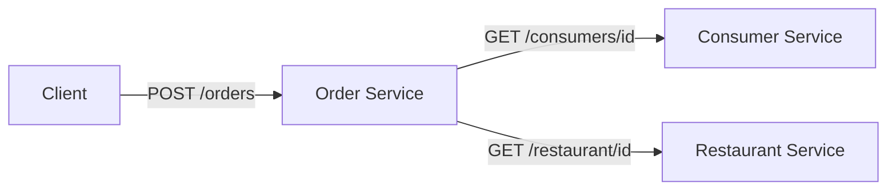
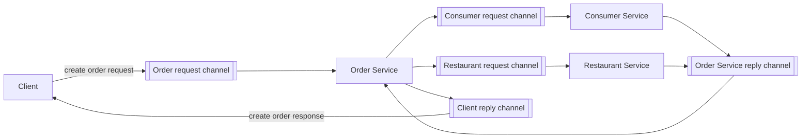
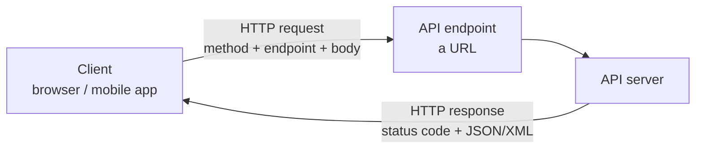
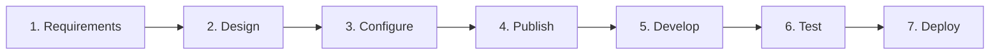
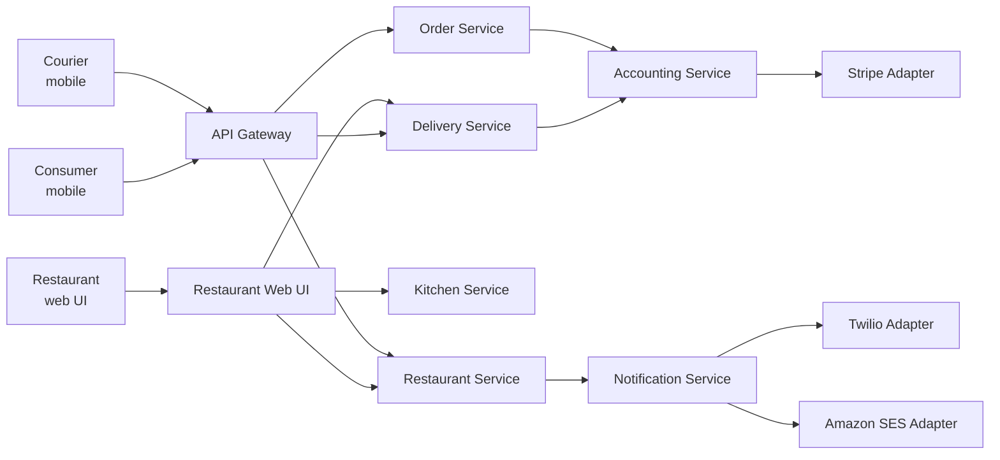
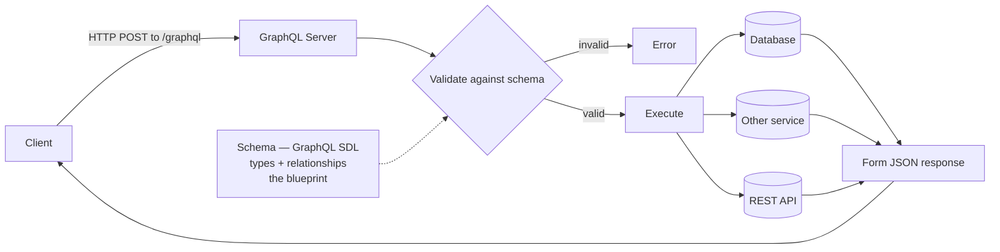
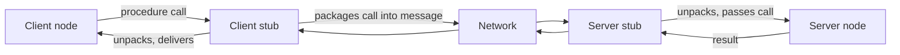
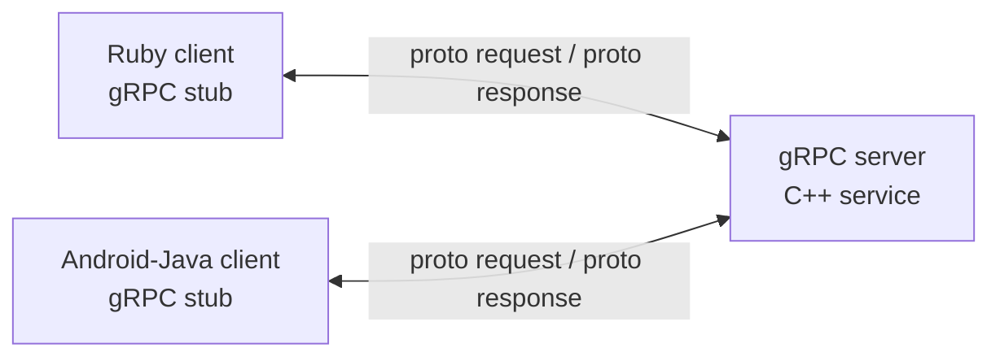

# 549 · Session 01 · API Basics

Exam: **mid-sem (closed book)** | Date learned: 25 Jul 2026 | Instructor: Nithya Ramachandran
Assembled from: `API driven_Lecture 1_25Jul.pptx` (72 sl) · R2 Gough et al. ch1 · web references

## Topics

1. What an API is · 2. Synchronous vs asynchronous · 3. HTTP APIs · 4. OpenAPI and the API lifecycle · 5. REST · 6. GraphQL · 7. gRPC · 8. Choosing between them · 9. API versioning

> ⚠️ **549 reference profile.** Only sessions 1–3 have a book behind them (this one is R2 ch1). From session 4 the handout lists "Web Resources, Lecture Notes" only. These decks are the syllabus — keep every one.

---

## 1. What an API is

*Sources: slides 13–14*

**Intuition** — An API is a **contract between a service and its clients**. It says: send me a request shaped like this, and I promise a response shaped like that. Neither side needs to know how the other is built. That's the whole point — the contract is the product.

**Three definitions from the deck, in increasing usefulness:**

1. "Application Programming Interface" — the acronym, tells you nothing.
2. **A contract between a service and its clients** — the one to remember.
3. A set of rules and protocols for building and interacting with software, enabling systems to exchange data and integrate function **without the end user understanding the underlying code**.

**API-first approach** — the application is *designed as* a set of APIs from the start, rather than having an API bolted on afterwards. The deck flags this term explicitly; it's the premise of the whole course, and it recurs in 546 S9 (designing APIs for ML services).

**Worked example** — Amazon Bedrock exposes `GET /models` to list models and `POST /models/{model-id}/invoke` to run inference. You never see the GPUs, the model weights, or the serving stack. You see a contract. Same for Hugging Face, LangChain and Prefect — which is exactly why this course is API-driven.

**Tradeoff / the cost of the contract** — Once published, the contract binds you. Clients build against it and break when it changes, which is why §9 (versioning) exists as a topic at all. An internal function can be refactored freely; a published API cannot. **Publishing an API is a commitment, not a feature.**

> **Closed-book card**
> API = **a contract between a service and its clients**. Rules and protocols letting systems exchange data and integrate function without the user knowing the underlying code. **API-first** = the app is designed as a set of APIs. Cost: a published contract binds you — hence versioning.

Cross-link: → `_shared/api-design.md` · **546 S9**

---

## 2. Synchronous vs asynchronous

*Sources: slides 15–17*

**Intuition** — Synchronous means the caller **waits**; the next task can't start until this one finishes (blocked). Asynchronous means the caller doesn't wait; a second task can begin in parallel (non-blocked).

| | Synchronous | Asynchronous |
|---|---|---|
| Caller | **Blocked** until reply | **Non-blocked**, continues immediately |
| Examples | **REST, gRPC, GraphQL** | Message brokers — **RabbitMQ, Apache Kafka, Amazon SQS** |
| Coupling | Caller needs the callee up *now* | Caller only needs the broker up |
| Shape | Request → response | Publish → channel → consume |

**Mechanism — the deck's own example, an order service, both ways.**

Synchronous (REST): the order service calls each downstream service directly and waits.



Asynchronous (message broker): every hop becomes a channel, and nothing blocks.



Note what the second diagram costs: **six channels instead of two direct calls**, plus a broker to run and monitor. That visual is the tradeoff.

**Tradeoff / when NOT to go async** — Asynchronous buys availability (the consumer service can be down and the message waits) and decoupling, and charges you a broker to operate, eventual consistency, harder debugging, and no simple "what did it return?" answer. Use sync when the caller genuinely needs the answer to proceed — a payment authorisation. Use async for work that can complete later — sending the confirmation email.

> **Closed-book card**
> **Synchronous** = caller blocked until the previous task finishes. Ex: **REST, gRPC, GraphQL**. **Asynchronous** = second task starts without waiting, non-blocking. Ex: message brokers — **RabbitMQ, Kafka, SQS**. Async buys availability + decoupling; costs a broker to operate, eventual consistency, harder debugging. Sync when the caller needs the answer to proceed.

---

## 3. HTTP APIs

*Sources: slides 18–24*

**Intuition** — HTTP APIs are the standard way applications talk over the web, typically browser → server. Three components: **endpoint**, **request**, **response**.



**Endpoints** — simple URLs representing a collection of objects or a single object. Resources live on the server; each endpoint is a URL designed to perform **a single function**. The deck's phrasing is worth keeping: endpoints are the **"doors" or "paths"** through which a client sends requests.

**Requests** — every request begins by choosing an HTTP **method** (verb):

| Method | Purpose |
|---|---|
| `GET` | Retrieve data |
| `POST` | Submit data to the server |
| `PUT` | Update existing data |
| `DELETE` | Delete data |

**Responses** — data sent back after processing, formatted as **JSON or XML**, with a status code:

| Code | Meaning |
|---|---|
| **200 OK** | Successful; server returning the requested data |
| **201 Created** | Request created a new resource |
| **400 Bad Request** | Client's request malformed or contains errors |
| **401 Unauthorized** | Authentication credentials missing or invalid |
| **403 Forbidden** | Client not allowed to access this resource |
| **404 Not Found** | Requested resource does not exist |
| **500 Internal Server Error** | Unexpected server error |

Learn the **401 vs 403** distinction — it's the classic exam pair. 401 = *we don't know who you are*. 403 = *we know who you are and you still can't*.

**Worked example — run this, it takes ten seconds:**

```bash
curl -X GET "https://jsonplaceholder.typicode.com/posts"
```

Method `GET` · endpoint `https://jsonplaceholder.typicode.com/posts` · response = posts in JSON. The deck also suggests trying it in **Postman**, which is worth installing now — you'll want it for labs 3 and 4.

**Tradeoff** — HTTP's ubiquity is its strength and its ceiling. It's text-based, request-per-resource, and carries header overhead on every call. That overhead is invisible for a browser fetching a page and very visible for two internal services exchanging millions of messages — which is the gap gRPC exists to fill (§7).

> **Closed-book card**
> HTTP API components: **endpoint** (URL, one function, the "door"), **request** (method + endpoint), **response** (JSON/XML + status). Methods: **GET** retrieve · **POST** submit · **PUT** update · **DELETE** delete. Status: 200 OK · 201 Created · 400 Bad Request · 401 Unauthorized (*who are you?*) · 403 Forbidden (*known, still denied*) · 404 Not Found · 500 Internal Server Error.

---

## 4. OpenAPI and the API lifecycle

*Sources: slides 25–31 · openapis.org*

**Intuition** — If an API is a contract, someone has to write the contract down in a form both humans and machines can read. That's **OpenAPI** — an *API description standard*, formerly called Swagger, providing a formal way to describe HTTP APIs, mainly RESTful ones.

**What a written spec buys you** — the deck lists four, and they're the exam answer:

1. People understand how the API works, and how a sequence of APIs work together
2. **Generate client code**
3. **Create tests**
4. **Apply design standards**

**Mechanism — the seven-step lifecycle the deck walks through**, built around a Books API:



**Worked example — the Books API, end to end:**

**1 · Requirements** — manage books via CRUD: add a book, retrieve details, update information, delete.

**2 · Design** — identify endpoints and the data model.

| Endpoint | Does |
|---|---|
| `GET /books` | List all books |
| `POST /books` | Add a new book |
| `GET /books/{id}` | Retrieve one book |
| `PUT /books/{id}` | Update one book |
| `DELETE /books/{id}` | Delete one book |

```json
{
  "id": integer,
  "title": "string",
  "author": "string",
  "isbn": "string",
  "publishedDate": "string",
  "price": integer
}
```

Note the shape: collection endpoint `/books` for list and create; item endpoint `/books/{id}` for read, update and delete. That pairing is the standard REST layout and is worth being able to reproduce cold.

**3 · Configure** — FastAPI (Python) for development, Uvicorn as the web server, JSON for storage.

**4 · Publish** — FastAPI **auto-generates documentation** at `/docs` — `localhost:8000/docs`. This is the payoff of a written spec: you didn't write the docs.

**5 · Develop** — implement all four methods.
**6 · Test** — `pytest` or `unittest`.
**7 · Deploy** — Heroku, AWS, Google Cloud.

**Tradeoff / the cost of spec-first** — Writing the spec before the code is deliberate friction, and it's wasted if the API is internal, single-consumer, and changing weekly. The value scales with the number of consumers who need to agree, and with how expensive it is to renegotiate later. For a public API it's essential; for a script's helper endpoint it's ceremony.

> **Closed-book card**
> **OpenAPI** (formerly **Swagger**) = formal standard for describing HTTP APIs, mainly REST. Buys: shared understanding · **client code generation** · **test creation** · design standards.
> Lifecycle: **Requirements → Design → Configure → Publish → Develop → Test → Deploy.**
> REST endpoint shape: collection `/books` (GET list, POST create) + item `/books/{id}` (GET, PUT, DELETE). Stack in the example: **FastAPI + Uvicorn**, docs auto-generated at `/docs`, tested with pytest.

Cross-link: → `_shared/api-design.md` · **546 S9** (designing APIs for ML services)

---

## 5. REST

*Sources: slides 32–39*

**Intuition** — REST is not a technology, it's an **architectural style** — Roy Fielding, 2000 — and it's the architecture of the web itself. Its single organising idea: **treat every piece of content as a resource**, give each resource a URI, and manipulate it with HTTP's existing verbs.

**Mechanism**

- Every content item is a **resource**: web pages, images, video, PDFs, dynamic business data.
- Each resource is identified by a **URI** (Uniform Resource Identifier).
- Representations are **JSON or XML**.
- HTTP methods map onto CRUD: `GET` read, `POST` create, `PUT` update, `DELETE` delete. POST/PUT/DELETE require suitable permissions.

Same resource, two representations:

```xml
<user>
  <id>1</id>
  <name>Shreyas</name>
  <profession>Teacher</profession>
</user>
```

```json
{ "id": 1, "name": "Shreyas", "profession": "Teacher" }
```

**Worked example — the deck's student API.** Note how the *URI* changes meaning by whether an ID is present, while the verb carries the operation:

| Method | URI | Operation |
|---|---|---|
| `GET` | `/institute/students` | Fetch all students |
| `GET` | `/institute/students/123` | Fetch student 123 |
| `POST` | `/institute/students` | Submit student information |
| `PUT` | `/institute/students/123` | Update student 123 |
| `DELETE` | `/institute/students/123` | Delete student 123 |

**A whole system built this way** — the deck's food-delivery architecture, and the best single diagram in the deck because it's a preview of microservices (S3):



Two captions on that slide carry the actual lesson: **"Services have APIs"** and **"A service's data is private."** Every service owns its own database; nothing reaches into another service's data. That constraint is what makes independent deployment possible, and it's the microservices idea in one line.

**Benefits and drawbacks — straight from the deck, and the likeliest exam question in this session:**

| Benefits | Drawbacks |
|---|---|
| **Mature and ubiquitous** — the de facto standard | **Reduced availability** — every synchronous dependency can fail |
| Testing a REST API is simple | **Fetching multiple resources** needs multiple calls |
| Supports synchronous request-response | |
| **No intermediate broker** | |
| Supported by most languages and frameworks | |

The "fetching multiple resources" drawback is the deck's setup for GraphQL: fetching a user's profile, their posts, and comments on those posts takes **three separate API calls**.

**Why this matters for the rest of the course** — most AI services from AWS, Azure and GCP are RESTful. Amazon Bedrock exposes `GET https://bedrock.us-west-2.amazonaws.com/models` and `POST .../models/{model-id}/invoke`, both with access tokens and JSON responses. Hugging Face, LangChain and Prefect are the same. **You will spend this semester calling REST APIs.**

**Tradeoff / when NOT to use REST** — When one screen needs data from many resources, REST's one-resource-per-call shape produces chatty clients and slow mobile screens (→ GraphQL). When two internal services exchange huge volumes and you control both ends, REST's text payloads and HTTP/1.1 overhead are pure waste (→ gRPC).

> **Closed-book card**
> **REST** = architectural style (**Roy Fielding, 2000**), the architecture of the web. Every content item is a **resource**, identified by a **URI**, represented as **JSON/XML**, manipulated by HTTP verbs = CRUD. Collection URI for list/create, item URI (`/x/123`) for read/update/delete.
> **Benefits**: mature & ubiquitous, simple to test, sync request-response, **no broker**, wide language support. **Drawbacks**: **reduced availability**; **fetching multiple resources needs multiple calls** (profile + posts + comments = 3 calls).
> Microservices rule: *services have APIs; a service's data is private.*

---

## 6. GraphQL

*Sources: slides 40–49 · graphql.org · AWS architecture blog*

**Intuition** — Built by **Facebook in 2015** specifically to fix REST's multiple-round-trips problem. Instead of the server deciding what each endpoint returns, **the client describes exactly the data it wants**, across multiple sources, in **one call**.

**Mechanism**



- The server defines a **schema** in **SDL** (Schema Definition Language) before serving anything — the types that can be queried and the relationships between them. It is the **blueprint both server and client understand**.
- A request arrives by **HTTP POST** to a single `/graphql` endpoint.
- The server **validates** it against the schema (you cannot ask for what the schema doesn't support), **executes** it against whatever databases or sources are needed, and **forms a JSON response**.
- Two operation types: **`query`** to fetch, **`mutation`** to insert, update or delete.

**Worked example — the deck's own REST-vs-GraphQL comparison.** Fetch a user's profile, their posts, and comments on those posts from a social media app.

REST — three round trips:

```
GET /users/{userId}
GET /users/{userId}/posts
GET /posts/{postId}/comments
```

GraphQL — one:

```graphql
query {
  user(id: "123") {
    id
    name
    posts {
      id
      title
      comments {
        id
        content
      }
    }
  }
}
```

And a simple query with its response, showing the shape-matching that is GraphQL's signature — the response mirrors the query:

```graphql
query {
  books { title author publishedDate }
}
```

```json
{ "data": { "books": [
  { "title": "To Kill a Mockingbird", "author": "Harper Lee", "publishedDate": "July 11, 1960" },
  { "title": "1984", "author": "George Orwell", "publishedDate": "June 8, 1949" }
]}}
```

**Two deployment options on AWS**, from the AWS architecture blog the deck cites:

| Option | What it is |
|---|---|
| **Fully managed — AWS AppSync** | A managed GraphQL server coordinating front-end requests with backend services |
| **Self-managed GraphQL** | You run the server yourself |

**Tradeoff / when NOT to use GraphQL** — The deck's own comparison table gives REST the win on **request caching**, and that's the big one: HTTP caching works on URLs, and GraphQL sends everything to one URL by POST, so standard caching layers stop helping. GraphQL also moves cost from round trips to server-side query planning, and a badly-shaped client query can be expensive in ways REST's fixed endpoints never allowed. Use it when clients need varied slices of connected data; don't use it for a simple resource CRUD API that caches well.

> **Closed-book card**
> **GraphQL** — **Facebook, 2015**, to fix REST's multiple-round-trips. Client specifies exactly what it wants across multiple sources in **one call**; single-request/all-inclusive-reply. **Schema in SDL** = blueprint, defined up front. Request = **HTTP POST** to `/graphql` → **validate against schema → execute → form JSON**. **`query`** to fetch, **`mutation`** to insert/update/delete. Response mirrors query shape. AWS: **AppSync** (managed) or self-managed.
> Loses to REST on **caching** (one URL, POST, so HTTP caching breaks).

---

## 7. gRPC

*Sources: slides 50–57*

**Intuition** — Start from **RPC** (Remote Procedure Call): make a call to a remote server *look like calling a local function*, for distributed client-server applications. gRPC is Google's 2015 open-source RPC framework, tuned for speed between services.

**Mechanism — how plain RPC works**, which you need before gRPC makes sense:



The **stub** is the whole trick: client and server each hold a local object that hides the packing, sending and unpacking, so the caller writes an ordinary function call.

**What gRPC changes:**

| | Plain HTTP APIs | gRPC |
|---|---|---|
| Data format | JSON | **Protocol Buffers** |
| Protocol | HTTP | **HTTP/2** |
| Contract | OpenAPI spec | **`.proto` file** |
| Tooling | — | **`protoc`** compiler |
| Languages | — | **10+** — C#/.NET, C++, Dart, Go, Java, Kotlin, Node, Objective-C, PHP, Python, Ruby |



That diagram is the point of gRPC in one picture: **a C++ service, a Ruby client and an Android/Java client, all generated from one `.proto` file.**

**Worked example — the deck's calculator `.proto`:**

```protobuf
syntax = "proto3";

package calculator;

service Calculator {
  rpc Add (AddRequest) returns (AddResponse) {}
  rpc Multiply (MultiplyRequest) returns (MultiplyResponse) {}
}

message AddRequest {
  int a = 1;
  int b = 2;
}

message AddResponse {
  int result = 1;
}
```

Run `protoc` on this and you get, in your language of choice: the message classes, the parsing code, and **both client and server stubs**. You define the API once, language- and platform-neutrally, and generate for many languages — which is the deck's stated reason for using proto files.

*(The numbers `= 1`, `= 2` are field tags identifying fields on the wire, not default values — a common first-read confusion. Note also the deck's own typo: `MultiplyResponse` is declared as `MultipleResponse`.)*

**Advantages and disadvantages — from the deck:**

| Advantages | Disadvantages |
|---|---|
| Simple, well-defined service interfaces and schema | **May not suit external-facing services** |
| **Polyglot** — many languages | **Browser and mobile support still primitive** (`grpc-Web` extension, limited browsers) |
| Lightweight and fast | |
| **Best for inter-service communication** | |

**Tradeoff / when NOT to use gRPC** — The disadvantages column is the answer, and it's sharp: gRPC is for **service-to-service** traffic where you control both ends. Put it on a public, browser-facing edge and you've chosen a protocol browsers can't natively speak, for consumers who can't debug it with `curl`. The usual architecture is REST or GraphQL at the edge, gRPC behind it.

> **Closed-book card**
> **RPC** = remote call made to look local, via **client stub → network → server stub**. **gRPC** — **Google, 2015**, open-source RPC framework: **Protocol Buffers** not JSON, **HTTP/2** not HTTP, **`.proto`** file as the API definition, **`protoc`** compiler generates message classes + client and server stubs for **10+ languages**.
> **Advantages**: well-defined schema, polyglot, lightweight and fast, **best for inter-service communication**. **Disadvantages**: **poor fit for external-facing services**; **browser/mobile support primitive** (grpc-Web, limited). Rule of thumb: REST/GraphQL at the edge, gRPC behind it.

---

## 8. Choosing between REST, GraphQL and gRPC

*Sources: slides 58–59*

The deck's comparison table, which is close to guaranteed exam material:

| Feature | Best API type |
|---|---|
| Ubiquitous standard for the web | **REST** |
| Data fetch | **GraphQL** |
| Browser support | **REST / GraphQL** |
| Request caching | **REST** |
| Code generation | **gRPC** — native, 10+ languages · GraphQL — GraphQL Code Generator (3rd party) · REST — Swagger (3rd party) |
| Payload data structure | GraphQL — JSON · REST — JSON & XML · gRPC — **Protocol Buffers** |

**The one-line summary worth carrying into the exam:** REST wins on ubiquity and caching, GraphQL wins on fetching connected data in one call, gRPC wins on speed and code generation between services. All three are **synchronous**; if you need asynchrony you're reaching for a broker (§2), not a different API style.

> **Closed-book card**
> REST → web standard, **caching**, browser support, JSON & XML, Swagger (3rd-party codegen). GraphQL → **data fetch** in one call, browser support, JSON, GraphQL Code Generator (3rd party). gRPC → **native code generation for 10+ languages**, **Protocol Buffers**, inter-service. All three synchronous.

---

## 9. API versioning

*Sources: slides 60–66 · HubSpot blog · semver*

**Intuition** — Versioning is managing change to an API **without disrupting clients**. A good strategy communicates what changed and lets consumers upgrade **at their own pace**.

**Why it matters** — when a third-party developer builds an integration against your API, they expect stability. Change it without considering them and you force them to change their software; if they don't, **their applications break**.

**When to version** — versioning is costly in effort for both consumers and developers, so don't do it casually. Version on a **breaking change** — a change that causes client applications to fail:

- Changing the **format** of request or response data (JSON → XML)
- Changing the **data type** of a resource (string → integer)
- Changing the **name** of a resource
- **Removing** resources, or removing/changing properties or methods
- **Adding a new required field** to client requests

That last one catches people — *adding* something can be a breaking change if clients must now supply it.

**Semantic versioning** — a scheme for meaningful version numbers. Form **`X.Y.Z`**, all non-negative integers, no leading zeroes, each element increasing numerically.

| Element | Name | Means | Backward compatible? |
|---|---|---|---|
| **X** | Major | **Incompatible API changes.** Requires creating a new API; the URI routes to the correct host | ❌ No |
| **Y** | Minor | New functionality or bug fixes, announced in change logs | ✅ Yes |
| **Z** | Patch | Bug fixes only | ✅ Yes |

**Worked example — the deck's movies API:**

| Version | What changed |
|---|---|
| 1.0.0 | Initial release — title, director, release year, plot summary |
| 1.1.0 | New feature — search by genre or actor |
| 1.1.1 | Patch — bug fixes in 1.1.0, no new features |
| **2.0.0** | **Major** — new data format, new endpoints; **may not be backward compatible**, clients must update |
| 2.1.0 | New features on 2.0.0, still backward compatible |
| 2.1.1 | Patch on 2.1.0 |

Each version reachable at its own endpoint:

```
/api/v1.0.0/movies
/api/v1.1.0/movies/search
/api/v2.0.0/movies
/api/v2.1.0/movies/search
```

**A real one** — Google Maps JavaScript API is at **3.63.10a** (13 Jan 2026): `3.63` is the major/minor series, `10` the patch within it, and `a`/`b`/`d` are sub-patch identifiers for minor updates and bug-fix builds. Worth noting that a real-world scheme extends semver rather than following it exactly.

**Tradeoff / when NOT to version** — Every live major version is a codebase you maintain, test and secure. Version too eagerly and you're running four APIs; version too late and you break your consumers. The deck's guidance — version only on breaking changes — is the balance point, and it implies the cheaper move is usually **designing the change to be non-breaking** (add an optional field rather than a required one).

> **Closed-book card**
> **Versioning** = managing API change without disrupting clients; lets consumers upgrade **at their own pace**. Costly — version only on a **breaking change**: format change (JSON→XML), data type change, resource rename, removing resources/properties/methods, **adding a new required field**.
> **Semantic versioning `X.Y.Z`**: **X major** = incompatible, new API, routed by URI · **Y minor** = new functionality, backward compatible · **Z patch** = bug fixes, backward compatible. Endpoints per version: `/api/v2.0.0/movies`. Real: Google Maps JS API 3.63.10a.

---

## Self-study — four APIs to explore

*Sources: slides 67–71*

| # | What | Where | Why |
|---|---|---|---|
| 1 | **Swagger Petstore** (OpenAPI 3.0) | https://editor.swagger.io/ | Observe the JSON-based API structure |
| 2 | **Rapid API** | https://rapidapi.com/ | World's largest public API marketplace |
| 3 | **Conference API** | R2 Gough et al., *Mastering API Architecture* | The textbook's running example |
| 4 | **AsyncAPI Specification** | https://www.asyncapi.com/en | The async counterpart to OpenAPI — **event-driven architectures** |

AsyncAPI is the one to actually look at: it closes the loop on §2 by showing that asynchronous APIs have their own description standard, exactly parallel to OpenAPI for synchronous ones.

---

## ⚠️ Admin — conflicts with the handout

**The 30% deliverable is actually two 15% deliverables.** Slide 9 splits what the handout calls a single "Project / Assignment 30%":

| | Handout | Slide 9 |
|---|---|---|
| Quiz | 5% | Quiz I, 5% |
| Project / Assignment | **30%, one component**, 27 Aug – 7 Sep | **Lab Assignment I [Mini Project I] 15%** + **Lab Assignment II [Mini Project II] 15%** |
| Mid-term | 30%, closed book, 20 Sep FN | 30%, closed book, 2h |
| End semester | 35%, open book, 6 Dec FN | 35%, open book, 2.5h |

Slide 9 gives **no dates** for the two mini-projects. If they're spread across the semester rather than both landing 27 Aug – 7 Sep, the crunch is lighter than planned; if they're both in that window, it's unchanged but is two submissions, not one. **Ask in class or check Taxila.**

**Session coverage differs slightly too** — slide 7 says **CS02 = "API Basics + Cloud Native Application"**, where the handout gives session 2 to Cloud Native alone. So API basics spill into next session. Slide 7 also splits CS14 (APIs for IoT) and CS15 (serverless + case study), where the handout merges 14 & 15.

**Lab tools, more specific than the handout:**

| Lab | Session | Tools named on slide 8 |
|---|---|---|
| 1 | 5 | **Prefect, Airflow** |
| 2 | 7 | **AWS SageMaker, MLflow** |
| 3 | 8 | HuggingFace APIs and/or AWS APIs or OpenAI APIs |
| 4 | 11 | **Flowise** (flowiseai.com), LangChain, OpenAI APIs, Python |
| 5 | **14 or 15** | **OpenRemote, ThingsBoard** |

**Logistics** — sessions on **MS Teams**; assignments on **Taxila**; course material on **MS Teams**. Instructor: nithyaramachandran@wilp.bits-pilani.ac.in, course code in the subject line. Taxila carries assignment releases, rescheduling, exam syllabus, and **scheme + solution documents after each exam**.

*(Same portal split as 546 — Teams for material, Taxila for assignments and announcements.)*

## Confusions to resolve

- [ ] Are Mini Project I and II both in the 27 Aug – 7 Sep window, or spread across the semester?
- [ ] Is Lab 5 at session 14 or 15?
- [ ] Does R2 (*Mastering API Architecture*) need buying, or is the Conference API example enough?

## Lab / build

No lab this session — **549 Lab 1 is at session 5**. But two things are worth doing tonight, both under ten minutes:

1. `curl -X GET "https://jsonplaceholder.typicode.com/posts"` — confirms you can read an API response.
2. Install **Postman**, repeat the same call. You'll need it from lab 3 onward.

Then, if the hour allows: build the Books API from §4 in FastAPI. It's ~30 lines, it produces auto-generated docs at `/docs`, and it makes every abstract term in this session concrete.
