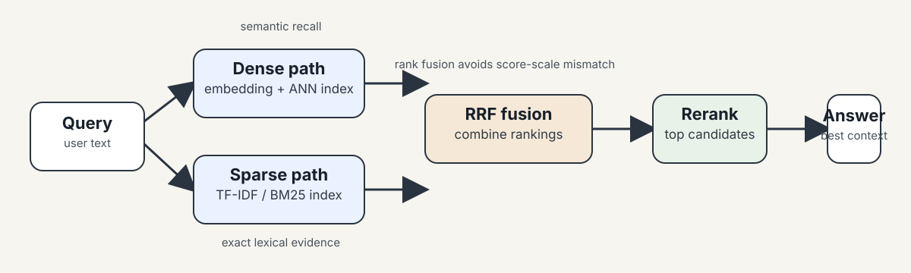

# 521 · Lab 3 — ANN, Sparse Retrieval, and Hybrid Search

*Supplemental note for the hybrid-search deck and notebook.*

This is intentionally separate from the handout's official L3 note. The uploaded deck and notebook are implementation-heavy extension material, so this writeup keeps the retrieval story in one place without confusing it with the model-landscape session.

## Why this matters

Dense retrieval is good at paraphrase. Sparse retrieval is good at exact terms, IDs, and rare names. Hybrid search is how production systems usually get both.

That matters because the query the user types is often not the wording stored in the document. A good retriever needs semantic recall, lexical precision, and a search method that is fast enough to serve.

## What to remember

| Topic | Core idea | Why it matters |
|---|---|---|
| Exact scan | compare the query against every vector | simple, exact, good for small corpora and recall checks |
| HNSW | graph-based ANN | fast and high-recall, but memory-heavy |
| IVF | cluster vectors, then search selected clusters | scalable and tunable with `nlist` and `nprobe` |
| PQ | compress vectors into codes | saves memory, but adds approximation |
| TF-IDF / BM25 | lexical scoring | strong for exact terms, codes, and rare phrases |
| RRF | fuse rankings rather than raw scores | lets dense and sparse systems combine cleanly |

## 1. Exact search vs ANN

**Intuition** — Exact search asks, "which stored vector is truly closest?" ANN asks, "which vectors are close enough to be worth checking?"

**Mechanism** — Exact search scores every vector. ANN uses structure so the system can skip most candidates.

**Tradeoff / when NOT to use** — Exact search is fine for small datasets and evaluation. It is not the serving strategy when the vector store is large enough that brute force becomes the bottleneck.

## 2. HNSW

**Intuition** — HNSW is a multi-layer graph. Top layers give long jumps; lower layers refine the search.

**Mechanism** — Search starts at a sparse layer, moves toward the query, then descends through denser layers until it reaches the base graph.

**Knobs to know** — `M` changes graph connectivity, `ef_construction` changes build quality, and `ef_search` changes query recall versus latency.

**Tradeoff / when NOT to use** — HNSW is a strong default when memory is available. It is not the best choice when the vector count is so large that graph overhead becomes too expensive.

## 3. IVF and PQ

**Intuition** — IVF narrows the search to a few clusters. PQ makes each vector cheaper to store.

**Mechanism** — IVF uses `nlist` to decide how many clusters exist, then `nprobe` to decide how many clusters to search at query time. PQ compresses each vector into a shorter code so the index uses less memory.

**Tradeoff / when NOT to use** — IVF+PQ helps when scale or memory is the real constraint. It is weaker when you need the strongest possible recall with the simplest tuning.

## 4. Sparse retrieval

**Intuition** — Keyword search is the safety net for exact evidence.

**Mechanism** — TF-IDF and BM25 score documents by term frequency, rarity, and document length. They prefer documents that contain the exact query terms, especially rare ones.

**Tradeoff / when NOT to use** — Sparse retrieval is not enough when the user phrases the question differently from the document. It is strong for IDs, product names, policy codes, and parameter names.

## 5. Hybrid fusion with RRF

**Intuition** — Dense retrieval and sparse retrieval solve different failure modes, so the best production answer often comes from combining them.

**Mechanism** — Reciprocal Rank Fusion combines rank positions instead of raw scores. That avoids the problem of comparing BM25 scores and embedding similarity scores directly.

**Tradeoff / when NOT to use** — RRF is robust, but it ignores score margins. If one retriever is clearly more reliable for the task, a simple rank fusion may still need a reranker afterward.

## Notebook map

The notebook reinforces the same story in code:

| Section | What it shows |
|---|---|
| Similarity computations | cosine, dot product, and basic score intuition |
| Batch computation for many vectors | how similarity scales beyond one pair |
| L2 distance relates to cosine | why distance and similarity are linked but not identical |
| Hybrid Search Implementation | a minimal dense + sparse retrieval pipeline |

## Build order

1. Build a dense embedding index.
2. Add a sparse/BM25 index.
3. Fuse the two result lists.
4. Rerank the shortlist if the task needs more precision.
5. Test on three query types: paraphrase, exact term, and mixed queries.

## Self-study / Lab / build

Try this on a small local corpus:

1. Split 10-20 short documents into chunks.
2. Embed the chunks and store the vectors.
3. Add a BM25 index over the same chunks.
4. Run three queries:
   - a paraphrase query,
   - an exact-code query,
   - a mixed query.
5. Compare dense-only, sparse-only, and hybrid results.

The main lesson is not the library call. It is seeing which query each retrieval method fails on.

