# Conversational AI · Session 01 · Foundations of Conversational AI

*Learned ____*

> ### In the instructor's own words
>
> **The definition, sharper than the slide's:** *"It is not a chatbot alone. In simple terms, **it is a reasoning system that happens to speak your language**."*
>
> **Intent vs entity, made concrete:** *"Intent is the **verb** of a sentence — what is the action. An entity is the **nouns** in the natural language."* So NLU = intent classification + entity extraction.
>
> **Why the field moves so fast:** *"Architectures that were cutting edge in 2022 and 2023 are already considered legacy now."* Everything here is deliberately state-of-the-art rather than settled — which is why the note leans on current tools and papers, not a fixed textbook.

## Why this matters

Conversational AI — agents — is one of the most employable specialisations in the field right now, and this session is the **map of the whole territory**. It's **not chatbots**: in the instructor's words, *"a reasoning system that happens to speak your language."* Here you get the sixty-year arc that explains why agents look the way they do, the **six components** every real system has, the **seven-stage agent lifecycle** that is the spine of the course, and the **protocol landscape** (MCP, A2A) being standardised as you read this. Get this and you can architect an agent, reason about its cost and failure modes, and talk fluently about where the field is heading — plus it covers tokenization and context windows deeply enough to build on.

## Topics

**Part 1 · What the field is** — *definitions and sixty years of history*

| # | Concept | In one line | Depth | Comes back in |
|---|---|---|---|---|
| 1 | **What conversational AI is** | The definition, the understand/reason/act frame, the bot ladder | 🗺️ | 546 S2 |
| 2 | **The evolution, 1960s → 2026** | Seven eras, each fixing the last one's limitation | 🗺️ | 536 S1 · `agents` |
| 3 | **Traditional vs agentic architecture** | Where the orchestration layer appeared, and why | 🗺️ | 536 S13 · 546 S15–16 |
| 3b | **Workflows vs agents** | Anthropic's distinction — and when not to build an agent at all | ⚖️ | 521 S9 · `agents` |

**Part 2 · What a system is made of** — *the component checklist you diagnose failures with*

| # | Concept | In one line | Depth | Comes back in |
|---|---|---|---|---|
| 4 | **The six components** | NLU, dialogue, knowledge, action, generation, memory | 🗺️ | 521 S6 · `rag` · `function-calling` |
| 5 | **Frameworks** | Rasa/Dialogflow vs LangChain/LlamaIndex/AutoGen | 🗺️ | 549 S9 · `agents` |

**Part 3 · The model layer** — *mechanism; shared with 536*

| # | Concept | In one line | Depth | Comes back in |
|---|---|---|---|---|
| 6 | **Tokenization** | BPE, the `[UNK]` failure, and what prices a conversation | 🔧 | `tokenization` · 536 S1 |
| 7 | **Context windows** | And the "lost in the middle" problem that motivates RAG | 🗺️ | 536 S1 s10 · `rag` |
| 8 | **LLMs as the brain** | What they do well, where they fail, and the fix for each failure | 🗺️ | 536 S1 s1,3 · `rag` |

**Part 4 · How an agent actually runs** — *the spine of the whole course*

| # | Concept | In one line | Depth | Comes back in |
|---|---|---|---|---|
| 9 | **The seven-stage lifecycle** | Request → Routing → Reasoning → Tool → Memory → Safety → Response | 🔧 | every session after this · `agents` |
| 10 | **Protocol landscape** | MCP, A2A, ANP, and why standards matter | 🗺️ | 521 S13–14 · `api-design` |
| 11 | **Production concerns** | Observability, cost, latency budgets, layered safety | ⚖️ | 521 S11–12 · 546 S11 · 549 S7 |
| 12 | **Open problems** | Where the field is stuck — and which walls are really workarounds | ⚖️ | 546 S8.1 · `agents` |

**Depth** — 🔧 *Mechanism*: reproduce it from a blank page · 🗺️ *Landscape*: recognise and compare, don't memorise · ⚖️ *Judgment*: form an opinion you can defend

---

## Part 1 · What the field is

### 1. What conversational AI is

*Reference: deck — the definition and the understand/reason/act frame are the instructor's own.*

**Intuition** — Her spoken version first, because it's the sharper one: *"It is not a chatbot alone. In simple terms, **it is a reasoning system that happens to speak your language**."*

The formal definition from the opening slide, worth memorising verbatim because it enumerates exactly what the course teaches:

> Any AI system that engages humans through **natural language** to **understand intent**, **retain context**, **retrieve knowledge**, and **deliver information or take real-world action**.

Note the four verbs — understand, retain, retrieve, act. Each becomes a module.

**The three-part frame** the deck uses throughout:

| | | |
|---|---|---|
| 💬 **Understand** | Interpret natural language intent, entities, sentiment | NLU — *"intent is the **verb**, the action; entity is the **nouns**"* |
| 🧠 **Reason** | Plan, chain thoughts, decompose multi-step problems | Planning |
| ⚡ **Act** | Call APIs, write code, retrieve docs, orchestrate agents | Tools |

**The bot ladder** — a progression of sophistication, from the same slide:

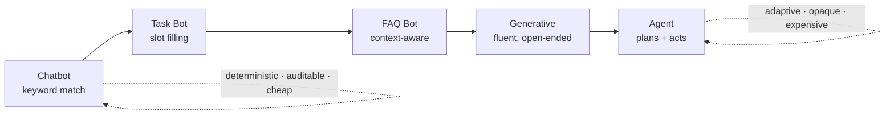

Every step rightward buys coverage of a wider query space and pays for it in predictability. Nothing on the ladder says further right is *better* — it says further right is *more general*. 

**Tradeoff / when NOT to build one** — a keyword-matching FAQ bot is cheap, deterministic, auditable and never hallucinates. An agentic system is none of those. If the query space is small and closed — "what are your opening hours" — the 1990s answer is still the right one. Sophistication is a cost you take on to buy coverage of an open query space.


Cross-link: → **546 S2** (models → systems: the same "it's not the model" argument, from the engineering side)

---

### 2. The evolution, 1960s → 2026

*Reference: deck; for the agent era, Masterman et al. 2024, [The Landscape of AI Agents](https://arxiv.org/abs/2404.11584).*

**Intuition** — Seven eras, each fixing the previous one's fatal limitation and introducing a new one. Learn it by the **Limitations** column: that's what drives the next row.

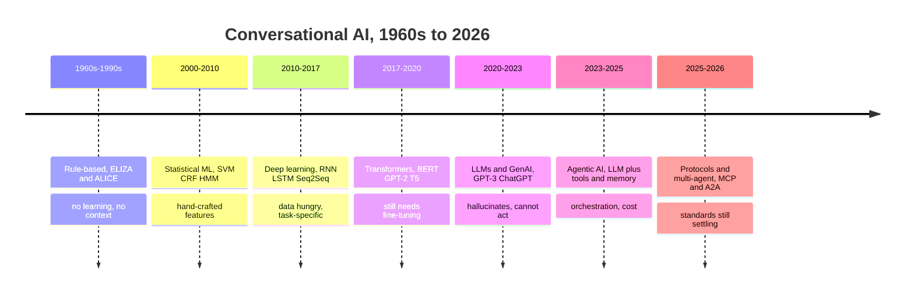

*Read the last clause of each row — the limitation is what causes the next era.*

| Era | Technology | Capabilities | Limitations |
|---|---|---|---|
| **1960s–1990s** | Rule-based (ELIZA, ALICE) | Pattern matching, keyword detection, scripted Q&A | **No learning, rigid, no context** |
| **2000–2010** | Statistical ML (SVMs, CRFs, HMMs) | Intent classification, entity extraction | **Limited context, hand-crafted features** |
| **2010–2017** | Deep learning (RNNs, LSTMs, Seq2Seq, attention) | End-to-end learning, better context | **Data hungry, task-specific training** |
| **2017–2020** | Transformers (BERT, GPT-2, T5) | Transfer learning, contextual embeddings | **Still needs task-specific fine-tuning** |
| **2020–2023** | LLMs & GenAI (GPT-3, ChatGPT, Claude, PaLM) | Few-shot learning, general-purpose, fluent | **Hallucinations, no real-time data, no actions** |
| **2023–2025** | **Agentic AI** (LLMs + Tools + Memory + Planning) | Execute actions, multi-step reasoning, autonomous workflows | **Complex orchestration, scaling, cost** |
| **2025–2026** | On-device & multi-modal (SLMs, native multimodality) | Real-time voice/video, privacy-first local processing | **Hardware constraints, fragmented ecosystems** |

**The key driver — quotable, and the likeliest short-answer question:**

> Three simultaneous breakthroughs made LLMs possible — **the Transformer architecture (2017), affordable GPU compute, and internet-scale training data.** Remove any one and we're still in the chatbot era.

**Detail worth holding from the deep-dive slides:**

- **ELIZA (1966)** — literally `IF user_input contains "mother": RESPOND "Tell me more about your family"`. Brittle, no real understanding.
- **Statistical era** — intent classification via SVM/Naive Bayes; NER via CRF/HMM; dialogue state tracking via **Markov models**. Frameworks: Microsoft LUIS, early IBM Watson.
- **Deep learning era** — frameworks Rasa (open source) and Google Dialogflow.
- **2025–early 2026** — multi-agent frameworks (agents spawning and supervising sub-agents), **extended thinking** (chain-of-thought at scale), **computer use** (browsing, running code, controlling desktop apps), **1M+ token contexts**, specialised models (coding agents, science models). The deck's framing: *AI moves from assistant to autonomous collaborator.*

**Tradeoff** — notice that each era's limitation is *architectural*, not a matter of effort. Rule-based systems didn't need more rules; they needed learning. LLMs don't need bigger models to take actions; they need tools. Recognising which kind of problem you have — "needs more of the same" vs "needs a different architecture" — is the judgment this table teaches.

Cross-link: → `_shared/agents.md` · **536 S1** (same landscape, model-side framing)

---

### 3. Architecture: traditional vs agentic

*Reference: deck; Anthropic, [Building Effective Agents](https://www.anthropic.com/research/building-effective-agents).*

**Intuition** — The old pipeline classified then responded. The new one plans then acts. Everything else follows from that.

**Traditional (pre-2020)**

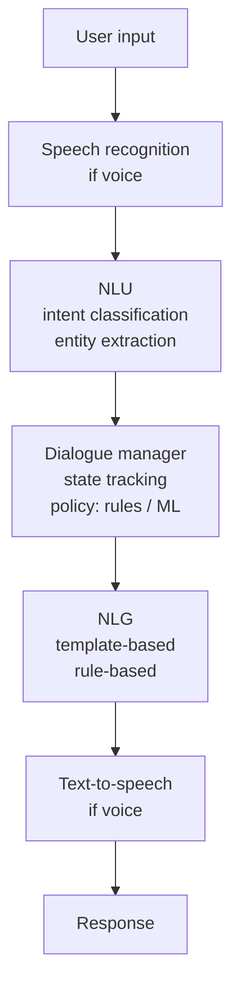

**Modern agentic (2023+)**

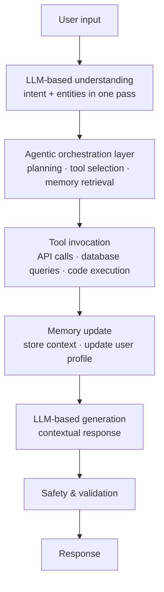

**Two structural differences to be able to name:**

1. **Intent and entities collapse into one LLM pass** — no separate classifier and extractor.
2. **A new orchestration layer appears** between understanding and generating, and it's where planning, tool selection and memory retrieval live. That layer is what makes it an agent.

**The agentic shift, point by point**:

| Traditional chatbot / LLM | Agentic conversational AI |
|---|---|
| Single-turn Q&A responses | **Multi-step planning & execution** |
| No access to external tools or data | **Tool calling: APIs, search, code, databases** |
| Fixed knowledge cutoff | **Real-time data via RAG and web search** |
| No memory across sessions | **Persistent memory (vector + SQL stores)** |
| One model, one task | **Multi-agent orchestration & delegation** |

> The LLM is the brain — but it needs **tools, memory, and planning** to become a truly autonomous conversational agent.

**Tradeoff / what the old architecture was better at** — the traditional pipeline is *inspectable*. When it misfires you can point at the intent classifier or the dialogue policy and see exactly what went wrong. The agentic version replaces those legible stages with an LLM making decisions you cannot fully audit, which is precisely why safety (stage 6) and observability become their own topics rather than afterthoughts. **You trade debuggability for capability.**


Cross-link: → `_shared/agents.md` · **536 S13** (agentic AI) · **546 S15–16** (SE for agentic systems)

---

### 3b. Workflows vs agents — and when not to build one

*Reference: Anthropic, [Building Effective Agents](https://www.anthropic.com/research/building-effective-agents) (Dec 2024) — the course's primary text.*

**Intuition** — The deck says "agentic AI" as though it were one thing. Anthropic's guide draws a sharper line inside it, and this distinction is the most useful single idea in the primary textbook:

| | Definition |
|---|---|
| **Agentic systems** | The umbrella term for all of it |
| **Workflows** | Systems where LLMs and tools are orchestrated through **predefined code paths** |
| **Agents** | Systems where LLMs **dynamically direct their own processes and tool usage**, maintaining control over how they accomplish tasks |

The dividing question: **who decides the sequence of steps — you, in code, or the model, at runtime?**

**The building block both are made of — the augmented LLM:**

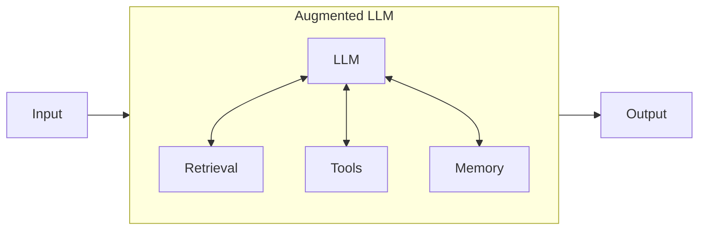

An LLM enhanced with **retrieval, tools and memory**, where the model actively uses them — generating its own search queries, selecting tools, deciding what to retain. This is the same claim as the deck's "LLM is the brain but needs tools, memory and planning," stated more precisely.

**Worked example — the same task, both ways.** Refunding a customer:

- *Workflow*: code says `classify intent → if refund: check eligibility → if eligible: issue refund → confirm`. The LLM classifies and writes text; **the path is fixed**.
- *Agent*: the model is given the tools `check_eligibility`, `issue_refund`, `lookup_order` and the goal "resolve this customer's refund request", and decides for itself which to call, in what order, and when it's done.

**Tradeoff / when NOT to build an agent** — this is the guide's central argument and it runs directly against the deck's enthusiasm, which makes it valuable:

> Find the **simplest solution possible**, and only increase complexity when needed. This might mean **not building agentic systems at all.** Agentic systems often trade **latency and cost** for better task performance.

The decision rule:

| Situation | Build |
|---|---|
| Well-defined task, known steps | **Workflow** — predictability and consistency |
| Flexibility and model-driven decisions needed at scale | **Agent** |
| **Many applications** | **Neither** — a single LLM call with retrieval and in-context examples is usually enough |

And on agents specifically: their autonomy means **higher costs and the potential for compounding errors** — which is exactly the "reliable long-horizon execution" open problem in section 12. Test in sandboxed environments with guardrails.

**On frameworks** — worth knowing, because section 5 lists eight of them approvingly:

> Frameworks make it easy to start by simplifying low-level tasks, but they **often create extra layers of abstraction that obscure the underlying prompts and responses, making them harder to debug.** They can also make it tempting to add complexity when a simpler setup would suffice.
>
> Start by using LLM APIs directly — many patterns are a few lines of code. If you use a framework, **understand the underlying code**; incorrect assumptions about what's under the hood are a common source of error.

That is a direct argument for the instructor's own advice ("code every lecture… run the demo code and change one thing") and for Lab 1 using the **native OpenAI API** rather than LangChain.

**The three core principles** — a ready-made exam answer to "what makes an agent effective?":

1. Maintain **simplicity** in the agent's design.
2. Prioritise **transparency** — explicitly show the agent's planning steps.
3. Carefully craft the **agent-computer interface (ACI)** through thorough tool documentation and testing.

On that third: the guide's rule of thumb is to invest as much effort in the **ACI** as teams normally invest in HCI. Building their SWE-bench agent, they *"spent more time optimising our tools than the overall prompt."*

Cross-link: → `_shared/agents.md` · patterns (prompt chaining, routing, parallelization, orchestrator-workers, evaluator-optimizer) come in **L9**

---

## Part 2 · What a system is made of

### 4. The six components of modern conversational AI

*Reference: deck — the six-component taxonomy is standard conversational-AI architecture.*

**Intuition** — Any conversational system, from a 2005 IVR to a 2026 agent, has to do the same six jobs: work out what you want, keep track of where the conversation is, look things up, do things, say something back, and remember. What changed over twenty years is not the list — it's that all six used to be separate hand-built modules, and now the LLM absorbs three of them (understanding, dialogue, generation) while the other three (knowledge, action, memory) became *harder* because we now expect them to work on open-ended input.

*The six, arranged by what the LLM absorbed and what it didn't (my own — the deck gives a flat table, and the split is the insight):*

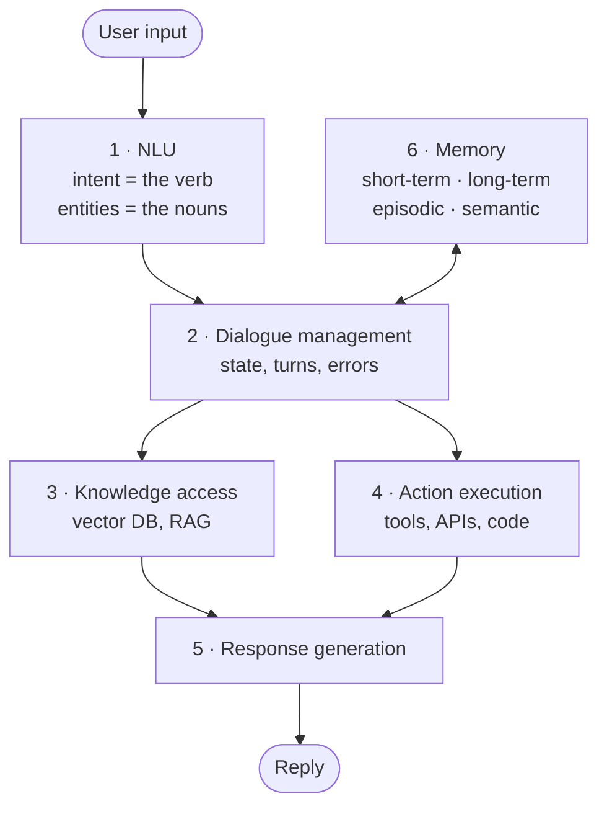

**The split that matters:** 1, 2 and 5 come almost free with the LLM — one model does all three in a single pass. **3, 4 and 6 do not.** They need a vector store, real API credentials, and somewhere to put user data. That is where the cost, the risk and the engineering live.

**Use this list as a checklist.** When a system misbehaves, the useful question is *which of the six failed?* "The bot gave a wrong answer" is not diagnosable; "knowledge access retrieved the wrong document" is.

| # | Component | Role | Contains | Modern approach |
|---|---|---|---|---|
| 1 | **Natural Language Understanding** | Understand what the user wants | Intent classification, entity extraction, sentiment analysis, context understanding | **LLM-based, single pass** |
| 2 | **Dialogue Management** | Manage conversation flow | State tracking, context maintenance, turn-taking, error handling | **LLM reasoning + memory systems** |
| 3 | **Knowledge Access** | Retrieve relevant information | Vector databases, semantic search, **RAG**, real-time data access | **Embeddings + hybrid retrieval** |
| 4 | **Action Execution** | Take actions for the user | Tool/function calling, API integrations, database operations, external service invocation | **Agentic tool use** |
| 5 | **Response Generation** | Generate natural responses | Contextual generation, personality/tone, multi-modal output, structured responses | **LLM generation with control** |
| 6 | **Memory Systems** | Remember user context | Short-term (conversation), long-term (user profile), **episodic**, **semantic** | **Vector + SQL hybrid** |

*The four kinds of memory in row 6 (my own — the table names them but doesn't define them; the human-memory analogy is the fastest way in):*

| Memory | What it holds | Analogy / where it lives |
|---|---|---|
| **Short-term (working)** | the current conversation | what you're holding in your head *right now* — the context window, free |
| **Long-term** | facts that persist across sessions — a user profile | your notebook: survives after you close it (SQL / key-value store) |
| **Episodic** | specific past events — "last time you ordered the large" | remembering *a particular occasion* |
| **Semantic** | general knowledge the agent draws on | facts you just *know* — usually a vector store / knowledge base |

Short-term is free (it *is* the prompt); the other three need real storage, which is why memory sits in the "expensive, touches the outside world" half below.

| Approach | User: "I lost my card" → Bot |
|---|---|
| **Rule-based (2000s)** | *"For lost card, press 1. For stolen, press 2."* — rigid, frustrating |
| **Intent-based (2015)** | *"I'll help you block your card. Which card — Credit or Debit?"* — better, but limited |
| **LLM-based (2023)** | *"I understand. Let me help you block it temporarily while you check…"* — natural, **but no action** |
| **Agentic (2025)** | *"I've immediately blocked your card ending in 1234. I see recent transactions at City Mall — last one was $45.20 at Starbucks 2 hours ago. Should I order a replacement to your home address?"* — proactive, action-oriented |

Business impact quoted: resolution time **15 minutes (human agent) → 2 minutes (agentic AI)**; customer satisfaction **+40%**.

**Tradeoff** — components 3, 4 and 6 are where the cost and risk live. Knowledge access needs a vector store to run and keep fresh; action execution means the agent can do real damage; memory means you're now storing user data with everything that implies. Components 1, 2 and 5 come almost free with the LLM. **The expensive half of the system is the half that touches the outside world.**

Cross-link: → `_shared/rag.md`, `_shared/function-calling.md` · **546 S6** (RAG as architecture pattern)

---

### 5. Frameworks

*Reference: deck; each framework's own docs (langchain.com, llamaindex.ai, microsoft.github.io/autogen).*

**Intuition** — A framework is glue, not capability. Nothing in the tables below does anything you couldn't do with the model's HTTP API and a few hundred lines of Python — the Tavily lab proves it. What you're buying is **the conventions**: a standard way to describe a tool, a retry policy, a place to put memory, a trace you can read. That's worth real money on a team and close to nothing when you're learning, which is why the labs deliberately make you see the loop before the framework hides it.

The generational split matters more than any individual row: the 2015 tools assume **you enumerate the intents in advance**; the 2023 tools assume **the model works out the intent at runtime**. Everything else follows from that one assumption change.

**Traditional (2015–2020)**

| Framework | Approach | Use case |
|---|---|---|
| **Rasa** | Intent + entity + dialogue policies | Custom chatbots, on-premise deployment |
| **Google Dialogflow** | Intent-based, ML-powered NLU | Voice assistants, Google integrations |
| **Microsoft Bot Framework** | Intent + entity + dialogue management | Enterprise bots, Azure integrations |
| **Amazon Lex** | Intent-based, Alexa-powered | Voice + text bots, AWS services |

**Modern agentic (2023–2025)**

| Framework | Approach | Use case |
|---|---|---|
| **LangChain / LangGraph** | LLM orchestration + tools + memory + workflows | Complex agents, RAG, multi-step reasoning, production |
| **LlamaIndex** | Data-centric, RAG-optimised pipelines | Document Q&A, knowledge bases, enterprise search |
| **Semantic Kernel** | Microsoft's SDK for AI orchestration | Enterprise, .NET/Azure ecosystem |
| **Haystack** | End-to-end NLP framework | Production RAG systems, search applications |
| **AutoGen** | Multi-agent conversation framework | Complex workflows with agent collaboration |

*What actually changed between the two generations (my own) — one assumption flipped, and the rest follows:*

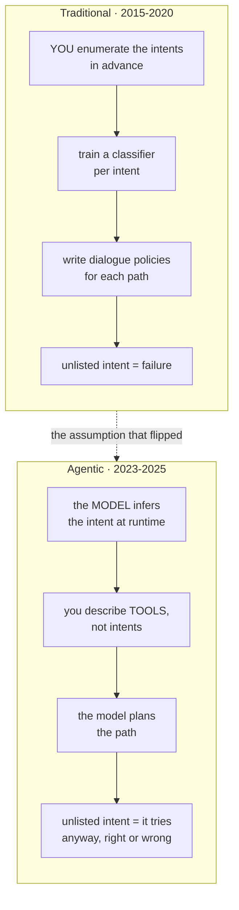

The bottom row is the honest trade: the old stack failed **loudly and predictably**; the new one fails **plausibly**. Rasa could not answer an unanticipated question. LangChain will answer it — correctly or not.

**The key shift**, in the deck's words: *from intent-based dialogue systems to LLM-powered agentic systems with tool use and planning capabilities.*

**Tradeoff / how to study this** — this is *landscape*, not mechanism. Learn the table, don't learn any framework's API. Frameworks in this space have a half-life of about eighteen months; the distinction that survives is **orchestration-first (LangChain) vs data-first (LlamaIndex) vs multi-agent-first (AutoGen)**.


Cross-link: → `_shared/agents.md` · **549 S9** (LangChain from the API-integration angle)

---

## Part 3 · The model layer

### 6. Tokenization

*Reference: [HuggingFace NLP course ch6](https://huggingface.co/learn/nlp-course/chapter6); BPE — Sennrich et al. 2016. Shared with 536 S1/S12 and `_shared/tokenization.md`.*

**Intuition** — Breaking text into subword units that LLMs process. BPE sits in the **"Goldilocks" zone** between character-based tokenization (sequences too long, little meaning per token) and word-based tokenization (huge vocabulary, fails on unknown words).

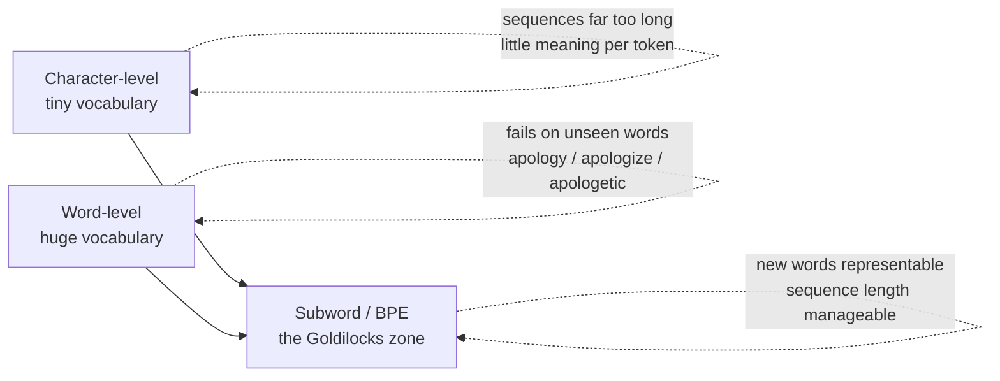

**Why it matters for conversational AI specifically** — four consequences, and this framing is what makes it a 521 topic rather than just a 536 one:

| | Why |
|---|---|
| 💰 **Cost** | API pricing is **per token** → directly sets conversation economics |
| 🪟 **Context window** | Limits conversation length (200K tokens ≈ 150K words) |
| ⚡ **Latency** | More tokens = slower response |
| 🎯 **Quality** | Tokenization affects understanding of domain-specific terms |

Token counts from the deck — note how unintuitive they are:

| Text | Tokens | Count |
|---|---|---|
| "Hello World" | Hello · World | 2 |
| "artificial intelligence" | art · ificial · intelligence | 3 |
| **"GPT-4"** | **G · PT · - · 4** | **4** |
| "Book a flight to NYC" | Book · a · flight · to · NYC | 5 |

**Worked example — the economics, which is the exam-worthy part:**

```
Customer support conversation (2025 typical):
  40–60 turns × 15–25 tokens/turn  ≈  800–1,200 tokens per conversation
  GPT-4o:        ~$0.01–0.03 per conversation
  GPT-3.5 Turbo: ~$0.002–0.005 per conversation
  At 10,000 conversations/day on GPT-4o:  $100–300/day
```

> **Key insight: model selection and prompt optimisation can cut token costs by 10–20×.** (Detail in L11.)

**Mechanism — BPE, three steps:** ① **Training** — read a massive corpus, count adjacent pairs of characters. ② **Merging** — take the most frequent pair, add it to the vocabulary as a new unit. ③ **Iterating** — repeat thousands of times until the target vocabulary size.

**Worked example — reproduce this by hand.** Corpus: `("hug", 10), ("pug", 5), ("pun", 12), ("bun", 4), ("hugs", 5)`
Base vocabulary: `["b", "g", "h", "n", "p", "s", "u"]`, words split into characters.

**Merge 1** — pair `("u","g")` appears in hug (10) + pug (5) + hugs (5) = **20 times**, the most frequent.
Rule: `("u","g") → "ug"`
Vocabulary: `[b, g, h, n, p, s, u, ug]`
Corpus: `("h","ug",10) ("p","ug",5) ("p","u","n",12) ("b","u","n",4) ("h","ug","s",5)`

**Merge 2** — now `("h","ug")` appears 15 times, but `("u","n")` appears **16 times** and wins.
Rule: `("u","n") → "un"`
Vocabulary: `[b, g, h, n, p, s, u, ug, un]`
Corpus: `("h","ug",10) ("p","ug",5) ("p","un",12) ("b","un",4) ("h","ug","s",5)`

**Merge 3** — now `("h","ug")` is most frequent. Rule: `("h","ug") → "hug"` — the first three-letter token.
Vocabulary: `[b, g, h, n, p, s, u, ug, un, hug]`

*The trap in merge 2:* `("h","ug")` at 15 looks like the obvious next merge because it just became available, but `("u","n")` at 16 beats it. **Count before you assume.**

**Segmenting new words with those three rules** — and this is where the deck goes further than 536's:

| Word | Tokenized as | Why |
|---|---|---|
| `bug` | `["b", "ug"]` | both in vocabulary |
| `mug` | `["[UNK]", "ug"]` | **"m" was never in the base vocabulary** |
| `thug` | `["[UNK]", "hug"]` | "t" not in base vocab; u+g merge, then h+ug merge |

**The deck's exercise: how is `unhug` tokenized?** Split to characters `u n h u g` → apply rules in learned order: `("u","g")→"ug"` gives `u n h ug`; `("u","n")→"un"` gives `un h ug`; `("h","ug")→"hug"` gives **`["un", "hug"]`**. Every character was in the base vocabulary, so no `[UNK]`.

**Tradeoff / where BPE fails** — the `mug` case is the whole limitation in one line: **character-level BPE has no fallback**. Any character absent from the base vocabulary becomes `[UNK]` and its meaning is lost entirely. That's what byte-level tokenizers fix, and it's why every frontier model after Llama-2 moved to byte-level (tiktoken). For conversational AI specifically, `[UNK]` on a customer's name or a product code is a silent failure that degrades the whole turn.

Cross-link: → `_shared/tokenization.md` · **536 S1** — ⚠️ *both subjects teach BPE on this same corpus, both closed-book scope. One note, two exams.*

---

### 7. Context windows

*Reference: "lost in the middle" — Liu et al. 2023, [arXiv:2307.03172](https://arxiv.org/abs/2307.03172).*

**Intuition** — The maximum tokens a model can hold, which for a conversation means how much history it can see at once.

| Model | Window | ≈ words | Positioning |
|---|---|---|---|
| GPT-4 Turbo | 128K | ~96K | Standard production |
| Claude 3.5 Sonnet | 200K | ~150K | Extended conversations |
| Gemini 1.5 Pro | 1M | ~750K | Entire codebases |
| Emerging models | 2M+ | — | Specialised use cases |

**⚠️ The challenge the deck flags — and it's the exam-worthy bit, not the numbers:**

> **"Lost in the middle"** — models struggle with information placed in the middle of long contexts. **Solution: RAG + memory systems** (Module 2).

*Why it happens (my clarity — the deck names the effect, not the cause): a model attends most reliably to the **start** and the **end** of its context and least to the **middle** — a U-shaped recall curve. So a fact buried mid-context is effectively half-ignored even though it's technically "in the window." This is also why the fix is retrieval, not a bigger window: doubling the window just makes the neglected middle bigger.*

*"Lost in the middle" drawn (my own) — recall accuracy against position in the context:*

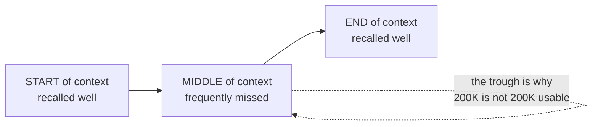

Accuracy is U-shaped, not flat. A fact placed halfway through a long context is the one the model is most likely to overlook — so **where** you put something in the prompt matters as much as whether you put it there at all.

**Tradeoff / why a bigger window isn't the answer** — "lost in the middle" means context length and *effective* context length diverge. Doubling the window doesn't double what the model reliably uses, while it does double cost and latency. This is the argument for retrieval: **fetch the right 4K tokens rather than stuffing 200K and hoping.**


Cross-link: → **536 S1 section 10** (why the window is capped — O(n²) and KV-cache) · `_shared/rag.md` — *"lost in the middle" is the argument for retrieval*

---

### 8. LLMs as the brain — capabilities and limits

*Reference: deck — the capability→consequence mapping is the deck's own.*

**Intuition** — The LLM is the reasoning engine, and its strengths and failures are *the same property seen twice*. It is a next-token predictor trained to produce plausible continuations — so it is fluent, flexible and good at intent, **and** it will produce a plausible continuation when it has no idea, which is what hallucination is. It is not a bug bolted onto a good system; it's the cost of the mechanism that makes the system work at all.

That's why the fixes below are all *architectural* rather than *model* fixes. You don't repair hallucination by finding a better model; you repair it by giving the model evidence (retrieval) or by not asking it questions it can't ground.

**The path from architecture to agent:**

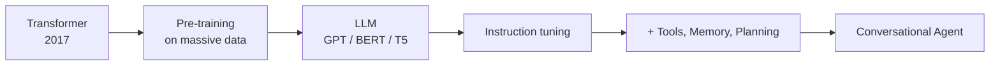

**Technical capability → conversational consequence** — the deck pairs them, and the pairing is the point:

| Technical capability | Impact on conversations |
|---|---|
| **Self-attention** — relationships between words across the full input | **Multi-turn coherence** — track earlier parts of a conversation |
| **Contextual understanding** — meaning depends on surroundings | **Intent understanding** — grasp goals from context |
| **Long-range dependencies** — connect ideas across long passages | **Natural responses** — fluent, human-like replies |
| **Parallel processing** — faster training than RNNs | **Ambiguity handling** — resolve underspecified requests |

**What LLMs do well vs where they fail:**

| ✅ Do well | ✗ Limitations |
|---|---|
| Natural conversation | **No real-time data** — training cutoff |
| Intent understanding | **Hallucinations** — plausible but false |
| Context retention (multi-turn) | **Can't take actions** — no external access |
| Response generation | **No memory** — forget after the context window |
| Summarization | **Calculation errors** |
| Entity extraction | **Consistency** — different answers to the same question |
| Sentiment analysis | **No verification** — can't check facts |

**Why agentic architecture exists** — every limitation maps to a fix, and this table *is* the course structure:

| LLM limitation | Agentic solution | Example |
|---|---|---|
| No real-time data | **Tool calling** (APIs, search) | Check current flight prices |
| Hallucinations | **RAG** | Ground answers in company docs |
| Can't take actions | **Function calling** | Book appointment, send email |
| No memory | **External memory systems** | Remember user preferences |
| Calculation errors | **Calculator tool, code execution** | Precise math |

**Tradeoff** — every row adds a component that can fail independently. Tool calling adds API downtime and auth; RAG adds a retrieval step that can return the wrong passage; memory adds staleness and privacy exposure. **You're trading one unreliable component for several reliable-ish ones plus orchestration** — which is a real improvement, and also why production concerns (section 11) become a topic.

> ***Going deeper*** *(my own knowledge, beyond the deck — RAG in one picture, since it's named as the fix all through this note but never drawn):*
> **RAG = Retrieval-Augmented Generation.** Instead of hoping the model *memorised* a fact, you **fetch** the relevant text and hand it to the model in the prompt:
>
> ```mermaid
> flowchart LR
>     Q[user question] --> EMB[embed the question]
>     EMB --> VS[(vector store —<br/>your docs, pre-embedded)]
>     VS -->|top-k similar chunks| CTX[relevant context]
>     Q --> P["prompt =<br/>question + retrieved context"]
>     CTX --> P
>     P --> LLM[LLM]
>     LLM --> A[grounded answer]
> ```
>
> Why it's the fix for **hallucination** (section 8) and dodges **"lost in the middle"** (section 7): the model answers from *retrieved, current, citable* text you control, and you send it the **right few thousand tokens** rather than stuffing the whole corpus. Two failure points to remember: retrieval can fetch the **wrong** chunk (garbage in → garbage out), and answers are only as fresh as the vector store. Full treatment in L7–L8 and `_shared/rag.md`.


Cross-link: → **536 S1 sections 1, 3** (the mechanism behind every capability in this table) · `_shared/rag.md` (the fix for the first limitation)

---

## Part 4 · How an agent actually runs

### 9. The seven-stage agent lifecycle

*Reference: deck — the seven-stage framing is the instructor's own (deck only).*

**Intuition** — The spine of the whole course. Every later lecture deepens one stage. **Learn this cold; it's the single most likely structured question on the mid-sem.**

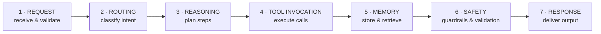

| # | Stage | What happens |
|---|---|---|
| 1 | 📥 **Request** | Receive & validate input · parse user intent · extract entities · **input sanitization (security)** |
| 2 | 🔀 **Routing** | Intent classification · classify intent type · determine required tools · route to sub-agent |
| 3 | 🧠 **Reasoning** | Planning & decision making · break into steps · **identify information gaps** · plan tool call sequence |
| 4 | ⚙️ **Tool invocation** | External API calls & actions · execute API calls · database queries · code execution |
| 5 | 💾 **Memory** | Context storage & retrieval · store conversation history · update user preferences · maintain session state |
| 6 | 🛡️ **Safety** | Guardrails & output validation · check toxic content · verify factual accuracy · **PII redaction** |
| 7 | 📤 **Response** | Final output delivered · NLG · format for channel (text/voice/UI) · send to user |

**Mechanism — it is a loop, not a pipeline.** The diagram draws seven boxes left to right, which is the one misleading thing about it. Stages 3 → 4 → 5 **cycle** until the agent decides it has enough to answer:

```
1 Request  ─→  2 Routing  ─→  ┌─→ 3 Reasoning ─→ 4 Tool ─→ 5 Memory ─┐
                              └────────── not done yet ──────────────┘
                                              │ done
                                              ▼
                                   6 Safety ─→ 7 Response
```

What actually passes between stages:

| Boundary | What crosses it |
|---|---|
| 1 → 2 | Sanitised text + extracted entities |
| 2 → 3 | An intent label and a **candidate tool list** — routing narrows what stage 3 may consider |
| 3 → 4 | A **structured tool call**: name + arguments (this is function calling, session 4) |
| 4 → 5 | The tool's raw return value, which becomes an **observation** |
| 5 → 3 | Observations + retrieved context, appended to the running scratchpad |
| 3 → 6 | A draft answer, once reasoning stops requesting tools |

**The loop is the agent.** Remove it — run each stage exactly once — and you have a *workflow* (section 3b): cheaper, predictable, and unable to recover from a tool returning something unexpected. The loop is what buys adaptability and what makes cost unpredictable, because nothing guarantees how many times it turns.

**Two exit conditions matter in production:** the model stops asking for tools (the good one), and a **step limit** fires (the guard). Without the second, a confused agent bills you indefinitely — which is the 100-step compounding-error problem from section 12.

**Worked example — banking agent.** User: *"What's my account balance and recent transactions?"*

| Stage | What the agent does |
|---|---|
| **1 Request** | Intent: `account_inquiry` · Entities: `{type: [balance, transactions]}` · Validate: user authenticated |
| **2 Routing** | Route to: Banking Agent · Required tools: `get_balance`, `get_transactions` · **Permission check: user has access** |
| **3 Reasoning** | Plan: ① fetch balance ② fetch recent transactions (last 5) ③ format response with both |
| **4 Tool invocation** | `get_balance(user_id)` → $5,432.10 · `get_transactions(user_id, limit=5)` → [Transaction1, …] |
| **5 Memory** | Store: user asked about balance at 2:30 PM · Update: preference for transaction details · Context: maintain for follow-ups |
| **6 Safety** | Validate balance & transactions belong to the **correct user** · check no PII in logs · verify only authorized info |
| **7 Response** | *"Your current balance is $5,432.10. Here are your recent transactions: … Would you like more details on any of these?"* |

Notice safety appears **twice** — sanitization at stage 1 (input) and validation at stage 6 (output). That bracketing is deliberate and worth stating in an exam answer.

**Exercise from the deck — do this, it's likely exam-shaped:**

> *"Find me a good Italian restaurant near my office that's open tonight and make a reservation for 2 at 7 PM"*
>
> Map to all seven stages: what entities are extracted? which tools/agents? what's the step-by-step plan? what specific API calls? what should be stored? what validations before acting? how should it communicate?

The interesting stage here is **6 (Safety)** — this request *takes an action in the world*. A booking is not reversible by the agent, so it needs confirmation before execution, not after. That's the human-in-the-loop principle from section 11.

**Tradeoff / when the full lifecycle is overkill** — a pure question ("what's the capital of France?") needs stages 1, 3 and 7. Running routing, tool invocation, memory and safety for it adds latency and cost for nothing. Production systems **short-circuit** simple requests — which is exactly what model routing (L11) is for.

> ***In practice*** *(beyond the deck — how you actually build these seven stages):*
> - In real code the lifecycle is a **state machine**, and **LangGraph** is the tool the course uses for exactly this: each stage is a **node**, edges are the transitions, and shared state (the conversation, retrieved context, tool results) flows through. Drawing the seven stages as a LangGraph is Lab-4-and-beyond work.
> - Stages 1 and 6 (**safety**) are usually not your own code — you wire in **guardrails libraries** (NeMo Guardrails, Guardrails AI, Llama Guard) for prompt-injection defence, PII redaction and output filtering. "Never rely on a single safety layer" (section 11) means both ends, plus these.
> - Stage 4 (**tool invocation**) is the one that acts on the world, so anything irreversible — a payment, a booking, a delete — gets a **human-in-the-loop** confirmation before execution, not after. This is the single most important production habit in the whole lifecycle.

Cross-link: → `_shared/agents.md`

---

### 10. Protocol landscape

*Reference: MCP — [modelcontextprotocol.io](https://modelcontextprotocol.io) (Anthropic 2024); A2A — Google's spec.*

**Intuition** — As agents proliferate they need standard ways to talk to tools, data, each other and UIs. The argument for standards, stated as a contrast:

| Without standards | With standards |
|---|---|
| Every vendor has a custom API | **Plug-and-play integrations** |
| Agents can't interoperate | **Multi-agent collaboration** |
| Vendor lock-in | **Vendor flexibility** |
| Duplicated integration effort | **Ecosystem growth** |

| Protocol | By | What it standardises | Use case |
|---|---|---|---|
| **MCP** (Model Context Protocol) | Anthropic, 2024 | How LLMs connect to **data sources and tools** | Agent accessing DBs, files, APIs consistently |
| **A2A** (Agent-to-Agent) | Google, emerging | Inter-agent communication | Multi-agent orchestration |
| **OpenAI Assistant API** | OpenAI | Built-in tools, file access, code interpreter | Rapid agent development on OpenAI infrastructure |
| **LangGraph** | LangChain | Graph-based agent workflows and state management | Complex multi-step reasoning, agent coordination |
| **ANP** (Agent Network Protocol) | emerging | Open standard for **peer-to-peer agent discovery** across heterogeneous networks | Decentralised agent ecosystems |
| **Custom REST / GraphQL** | — | Traditional service integration | Enterprise systems, legacy integrations |

*What each protocol standardises — they solve different edges of the same picture, which is why they are not competitors (my own):*

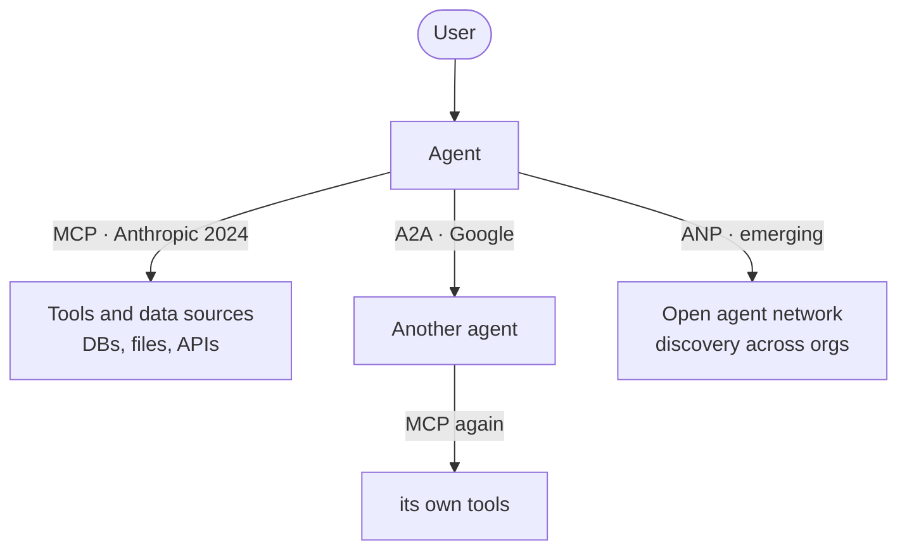

**The distinction to carry:** **MCP is vertical** (agent → tools), **A2A is horizontal** (agent → agent). A real agent speaks both, on different edges. USB-C is the analogy the deck reaches for, and it's a good one — before it, every device needed its own cable.

**The deck's own caveat, worth carrying into an exam answer:** *the protocol landscape is rapidly evolving. Standards like MCP are emerging, while **many production systems still use custom APIs**.* Detail comes in L13–L14 (the deck says 14–15).

**Tradeoff** — a standard is only worth adopting once enough of the ecosystem speaks it. Adopting MCP for a single internal tool is pure overhead versus a REST endpoint you already have. The value appears at the *N*th integration, not the first.

> ***In practice*** *(beyond the deck — MCP is the one to actually know right now):*
> **MCP** went from an Anthropic proposal (late 2024) to a de-facto industry standard adopted across major AI tools within a year — it's the most career-relevant item in this table today. Concretely, an **MCP server** is a small program that exposes *tools*, *resources* and *prompts* over a standard protocol, so **any** MCP-aware client (Claude, IDEs, agent frameworks) can use it without custom glue. Writing one is a few dozen lines with the official SDK. The mental model: **MCP is to agent-tool connections what REST was to web services** (549 S1) — the standard that lets things you didn't build talk to each other. If you learn one protocol from this section for your career, learn MCP.

Cross-link: → `_shared/agents.md`, `_shared/api-design.md` · **549 S1** (REST/GraphQL/gRPC)

---

### 11. Production concerns

*Reference: deck; the tools' own docs (LangSmith, Arize Phoenix, OpenTelemetry).*

**Intuition** — the deck's framing: *building conversational agents that work in development is one thing. Building them to work reliably at scale in production is another.* Four axes.

*The four axes are not independent — every fix on one pushes on another (my own):*

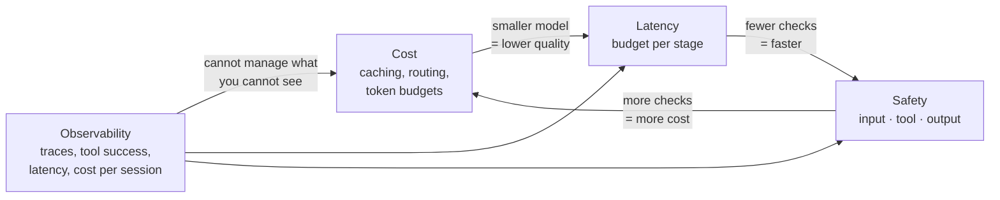

**Observability comes first** — not because it matters most, but because the other three are unmanageable without it. You cannot tune a latency budget you are not measuring.

**📊 Observability — what to track**
Conversation flows · tool invocations · **token usage per conversation** · response latencies & error traces.
Tools: **LangSmith, Arize Phoenix, OpenTelemetry**.

**💰 Cost management**
**Prompt caching (50–90% cost reduction)** · model routing (smaller models when appropriate) · token budgets per user/session · efficient retrieval (reduce context size).
Benchmark: customer support ≈ **$0.02–0.10 per conversation**.

**⚡ Latency budgets**

| Operation | Target |
|---|---|
| Chat responses | **< 2 seconds** |
| Tool execution | **< 5 seconds** |
| Complex reasoning | **< 30 seconds** |

Plus: set user expectations with progress indicators.

**🛡️ Safety & security — defence layers**
Input validation (prompt injection defence) · PII detection and redaction · output filtering (toxicity, hallucinations) · human-in-the-loop for critical actions.

> **Principle: never rely on a single safety layer.**

**Tradeoff** — these four pull against each other, and naming the tension is what a good exam answer does. Every safety layer adds latency. Cheaper model routing costs quality. Prompt caching saves 50–90% but constrains how you structure prompts. There is no configuration that maximises all four; production work is **choosing which to sacrifice for this particular product.**


Cross-link: → `_shared/evaluation.md` · **546 S11** (pipeline and system quality) · **549 S7** (deployment and tooling)

---

### 12. Open problems

*Reference: deck; each research direction is its own paper (MemGPT, Titans, GAIA, SWE-bench, Constitutional AI).*

**Intuition** — Every item below is a limitation of the *current* generation, not a law. It's worth knowing which is which: some of these are engineering problems that money and iteration will close, and some are open research questions that may not close at all. Reading them as a single list of "things AI can't do yet" is the mistake — the useful skill is telling a **workaround** from a **wall**.

Where research is active — useful for essay-style questions asking "what are the limitations of current systems?"

| Problem | Why it's hard | Active research |
|---|---|---|
| **Consistent multi-step reasoning** | LLMs still fail on novel logic outside the training distribution; CoT helps but doesn't solve it | Process reward models, tree-of-thought |
| **Persistent cross-session memory** | Every new conversation starts blank; external memory is a workaround — **lossy, expensive, fragile** | MemGPT, Titans (Google, 2024) |
| **Grounded factual accuracy** | Hallucination: confident, plausible falsehoods. **RAG reduces but doesn't eliminate** at scale | Attribution, RLHF, verification agents |
| **Reliable long-horizon execution** | Agents running 100-step tasks drift, get stuck, or make **compounding errors** | Agent benchmarks (GAIA, SWE-bench) |
| **Safety & alignment at scale** | More autonomy → harder to ensure agents follow human intent without side-effects | Constitutional AI, RLAIF, interpretability |
| **Compute & energy efficiency** | SOTA models need enormous infrastructure; efficient inference is an open engineering problem | Mamba, QLoRA, mixture-of-experts |

*Sorting them — my own, and the more useful half of this section:*

| | Problem | Why |
|---|---|---|
| ⚙️ **Engineering — will close** | Compute & energy efficiency | Quantisation, MoE and better kernels are already shipping; this is a cost curve, not a mystery |
| ⚙️ **Engineering — will close** | Persistent cross-session memory | External memory is ugly but it works; the remaining problems are retrieval quality and cost |
| 🧱 **Research — may not close** | Consistent multi-step reasoning | Next-token prediction has no mechanism that *guarantees* a valid inference chain, only one that makes valid chains likely |
| 🧱 **Research — may not close** | Grounded factual accuracy | A model has no internal notion of "I don't know this." RAG supplies evidence; it doesn't install doubt |
| 🧱 **Research — may not close** | Safety & alignment at scale | We can't fully specify what we want (**546 section 8.1** — the same specification problem, from the other end) |
| ⚠️ **Compounding** | Reliable long-horizon execution | 95% per-step accuracy over 100 steps is 0.6% end-to-end. Arithmetic, not capability — and it's why long agent runs need checkpoints rather than better models |

**Tradeoff / how to use this section** — the temptation is to treat these as reasons not to build. That's the wrong read. **Every one of them has a design response available today**, and knowing the response is what separates an architect from a commentator:

| Problem | What you actually do about it now |
|---|---|
| Multi-step reasoning fails | Decompose into a **workflow** with fixed steps (section 3b) rather than trusting an agent to plan |
| No cross-session memory | Explicit memory store, written and read at defined points (session 6) |
| Hallucination | Retrieval with **citations the user can check**, so the failure is visible rather than silent |
| Long-horizon drift | Checkpoints, step limits, and a human approval gate before anything irreversible |
| Alignment | Layered safety — input filter, tool allow-list, output check (section 11) |
| Cost | Route easy queries to a small model; cache aggressively (session 11) |

The honest summary: **none of these are solved, and all of them are survivable.** Production systems ship on top of every limitation in this table — by constraining the problem until the model's reliability is enough for it, which is the real design skill this course teaches.


Cross-link: → **546 S8.1** (the specification problem, reached from software engineering) · `_shared/agents.md`

---

## State of the art — 2026 (landscape, table only)

*Reference: deck; vendor model cards (these numbers date within months).*

| Model | Provider | Context | Strength | Best for |
|---|---|---|---|---|
| GPT-5.4 | OpenAI | 1M | Best all-rounder, computer use | Knowledge work, production APIs |
| Claude Opus | Anthropic | 1M | Coding, safety, long reasoning | Complex agents, coding editors |
| **Gemini 3.1 Pro** | Google | 1M | **Reasoning leader (94.3% GPQA Diamond)** | Research, multimodal, cost-efficient |
| Grok 4.20 | xAI | 128K | Real-time data, multi-agent | Live info, social/market signals |
| **Llama 4 Scout** (open) | Meta | **10M** | Open-weight, ultra-long context | On-prem / custom deployments |
| DeepSeek V3.2 (open) | DeepSeek | 128K | ~90% of GPT-5.4 at **1/50th cost** | Budget-conscious, high-volume API |

Market context: **$41.39B** Conv-AI market by 2030 (Grand View Research) · **100M** ChatGPT users in 2 months (fastest-growing app in history) · **80%** of Fortune 500 using AI agents (Microsoft Copilot Studio telemetry, Nov 2025). Industry: banking 70% of Tier-1 queries handled by AI, up to 60% cost reduction; e-commerce 15–26% conversion lift.

*Landscape material — comparison table only, per the subject's study rule. Specific model names date within months; the openness/context/cost axes don't.*

---

## Lab / build

**521 Lab 1 (session 1): tokenization and an AI bot with tool calling.** The deck runs two hands-on demos:

**Demo A — BPE with `tiktoken`:** text → tokens, token counting for a sample conversation, cost analysis, model comparison across tokenizers.

**Demo B — the weather agent.** ✅ **Notebooks received** → `labs/S01-tokenization-and-tool-calling/`

⚠️ **The notebook differs from the deck.** Slide 47 says "native OpenAI API"; the notebook she actually shared uses **Ollama running `llama3` locally + LangChain + Tavily search** — no paid API, nothing leaves your machine. **Follow the notebook.**

Agent type is **`AgentType.ZERO_SHOT_REACT_DESCRIPTION`** — so you are running the **ReAct loop in session 1**, four sessions before it's formally taught in L4. `verbose=True` prints the agent's thoughts and tool choices; that trace *is* the lesson.

> ***Going deeper*** *(my own — what the ReAct trace you're about to watch actually is; full treatment L4):*
> **ReAct = Reason + Act.** The agent doesn't answer in one shot — it runs a loop, thinking out loud between tool calls:
>
> ```mermaid
> flowchart LR
>     Q[user question] --> T["Thought:<br/>what do I need?"]
>     T --> A["Action:<br/>call a tool"]
>     A --> O["Observation:<br/>tool result"]
>     O --> D{enough<br/>to answer?}
>     D -->|no| T
>     D -->|yes| F[Final Answer]
> ```
>
> For "weather in Tokyo?", `verbose=True` prints exactly this cycle:
> ```
> Thought: I need the current weather in Tokyo. I'll search.
> Action: get_weather("Tokyo")
> Observation: 32°C, humid, partly cloudy
> Thought: I now have what I need.
> Final Answer: It's 32°C and humid in Tokyo right now.
> ```
> That interleaving — **reason, act, read the result, decide the next step** — is the core agent pattern the whole course builds on. It's also why stage 1 (no tools) matters: you watch the model *fail*, then *reach for a tool*.

One detail worth noticing in the code: the tool is declared as

```python
@tool
def get_weather(city: str) -> str:
    """Get the current weather for a given city by searching the web. Input should be a city name, e.g. 'Paris' or 'New York'."""
```

**The docstring is the tool description the model reads to decide when to call it.** That's Anthropic's agent-computer interface point from section 3b made concrete — the docstring is prompt engineering, not documentation.

Five stages, and the staging is the lesson:

1. **Baseline** — LLM without tools, so you *see* the limitation first
2. **Tool definition** — define the weather function schema
3. **Tool selection** — LLM decides when to use the tool
4. **Execution** — call the actual weather API
5. **Response generation** — LLM writes the natural answer

Target interaction in the deck: *"What's the weather like in Mumbai?"* — the notebook uses Tokyo, then a two-city comparison (Paris vs New York). → extracts location → calls API → receives 32°C, humid, partly cloudy → responds naturally.

**Do stage 1 before stage 2.** Watching the model fail without tools is what makes function calling land — skip it and you're just copying a schema.

> **Note:** 536's Lab 1 is *also* tokenization, also at session 1, also using `tiktoken`. Do them in one sitting — the token-counting script serves both.

---

*Exam: this session is in scope for the **closed-book mid-sem** (sessions 1–8). Full evaluation, weights, dates and course logistics live once in [`521-master.md`](../521-master.md) — not repeated per session.*
