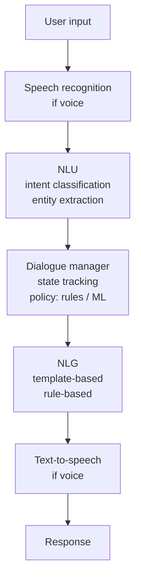
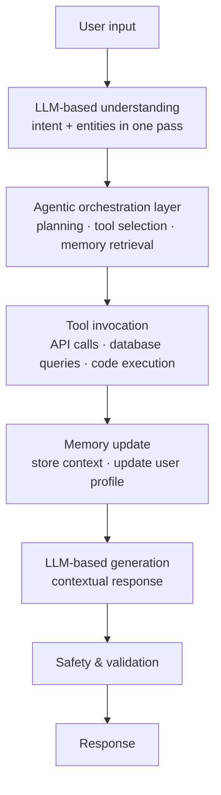
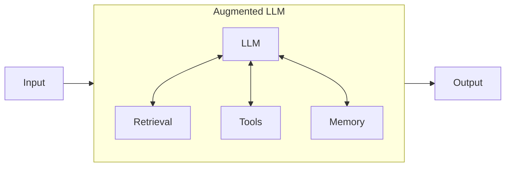
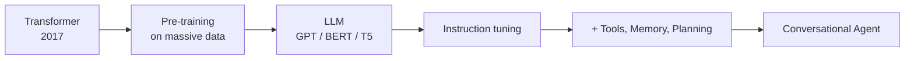
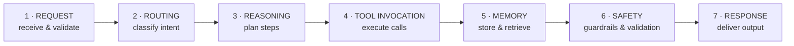

# Conversational AI · Session 01 · Foundations of Conversational AI

*Learned ____*

> ### What the instructor emphasised
> *From the session-1 recording, 26 Jul.*
>
> **Her one-line definition, better than the slide's:** *"Generally people assume Conversational AI is a chatbot. It is not a chatbot alone. In simple terms, **it is a reasoning system that happens to speak your language**."* Use this if asked to define the field.
>
> **Intent vs entity, made concrete** — not in the deck: *"Intent is the **verb** of a sentence — what is the action. An entity is the **nouns** in the natural language."* NLU = intent classification + entity extraction.
>
> **Why the field moves so fast**, her framing: *"Architectures that were cutting edge in 2022 and 2023 are already considered legacy now."* Everything in this course is deliberately state-of-the-art rather than settled.
>
> 🔴 **Session 8 is revision, not new material.** *"In the pre-mid sem we will complete 7 sessions, and session 8 is dedicated for revising the contents from session 1 to session 7."* The closed-book mid-sem therefore covers **seven** sessions of new content. **536 is identical** — so two of your four mid-sems have one less session than the handout implies.
>
> **Hands-on in every session** — she said it explicitly. 521 is the build-it subject and the labs are not optional extras.

## Why this matters

Conversational AI — agents — is one of the most employable specialisations in the field right now, and this session is the **map of the whole territory**. It's **not chatbots**: in the instructor's words, *"a reasoning system that happens to speak your language."* Here you get the sixty-year arc that explains why agents look the way they do, the **six components** every real system has, the **seven-stage agent lifecycle** that is the spine of the course, and the **protocol landscape** (MCP, A2A) being standardised as you read this. Get this and you can architect an agent, reason about its cost and failure modes, and talk fluently about where the field is heading — plus it covers tokenization and context windows deeply enough to build on.

## How to use this note

| Goal | Where to go |
|---|---|
| **Learn it end to end** | Top to bottom. Each concept runs **Intuition → Mechanism → Worked example → Tradeoff**, with ***In practice*** / ***Going deeper*** blocks where the real-world detail earns its place |
| **The one thing to master** | Section 9, the **seven-stage lifecycle** — the spine of the whole course. Then **run the lab** |
| **Look something up later** | The topic list below is the index; each concept is self-contained |
| **Revise for the exam** | Fold out the **Closed-book recall card** under each concept; exam scope, weights & dates live in the subject **master index** |

🔴 **521 is the build-it subject — ten labs, more than any other.** *"Don't just watch — run the demo code and change one thing."* Reading about an agent is not learning an agent; the concepts click when the loop prints its own reasoning. **Lab 1 already runs a ReAct loop** (`AgentType.ZERO_SHOT_REACT_DESCRIPTION`, `verbose=True`) — four sessions before it's formally taught. Watch that trace; it's the lesson. *(Setup this week: install Ollama, pull `llama3`, get a free Tavily key — the session-1 notebooks need them.)*

## Topics

**Part 1 — What the field is** *(definitions and history)*
1. **What conversational AI is** — the definition, the understand/reason/act frame, the bot ladder
2. **The evolution, 1960s → 2026** — seven eras, each fixing the last one's limitation
3. **Architecture: traditional vs agentic** — where the orchestration layer appeared
3b. **Workflows vs agents** — Anthropic's distinction, and **when not to build an agent at all**

**Part 2 — What a system is made of**
4. **The six components** — NLU, dialogue management, knowledge access, action execution, generation, memory
5. **Frameworks** — traditional (Rasa, Dialogflow) vs agentic (LangChain, LlamaIndex, AutoGen)

**Part 3 — The model layer** *(mechanism; shared with 536)*
6. **Tokenization** — BPE, the `[UNK]` failure, and the token economics that price a conversation
7. **Context windows** — and the "lost in the middle" problem that motivates RAG
8. **LLMs as the brain** — what they do well, where they fail, and how each failure maps to a fix

**Part 4 — How an agent actually runs** *(the spine of the course)*
9. **The seven-stage lifecycle** — Request → Routing → Reasoning → Tool → Memory → Safety → Response
10. **Protocol landscape** — MCP, A2A, ANP, and why standards matter
11. **Production concerns** — observability, cost, latency budgets, layered safety
12. **Open problems** — where the field is still stuck

---

## 1. What conversational AI is

*Reference: deck — the definition and the understand/reason/act frame are the instructor's own.*

**Intuition** — Her spoken version first, because it's the sharper one: *"It is not a chatbot alone. In simple terms, **it is a reasoning system that happens to speak your language**."*

The formal definition from the opening slide, worth memorising verbatim because it enumerates exactly what the course teaches:

> Any AI system that engages humans through **natural language** to **understand intent**, **retain context**, **retrieve knowledge**, and **deliver information or take real-world action**.

Note the four verbs — understand, retain, retrieve, act. Each becomes a module.

**The three-part frame** the deck uses throughout:

| | | |
|---|---|---|
| 💬 **Understand** | Interpret natural language intent, entities, sentiment | NLU — *"intent is the **verb**, the action; entity is the **nouns**"* |
| 🧠 **Reason** | Plan, chain thoughts, decompose multi-step problems | Planning |
| ⚡ **Act** | Call APIs, write code, retrieve docs, orchestrate agents | Tools |

**The bot ladder** — a progression of sophistication, from the same slide:

`Chatbot (keyword match) → Task Bot (slot filling) → FAQ Bot (context-aware) → generative → plans + acts`

**Tradeoff / when NOT to build one** — a keyword-matching FAQ bot is cheap, deterministic, auditable and never hallucinates. An agentic system is none of those. If the query space is small and closed — "what are your opening hours" — the 1990s answer is still the right one. Sophistication is a cost you take on to buy coverage of an open query space.

<details>
<summary>📄 <b>Closed-book recall card</b> — fold out for exam revision</summary>

> **Closed-book card**
> **Conversational AI** = any AI system engaging humans through **natural language** to **understand intent, retain context, retrieve knowledge, and deliver information or take real-world action**. Frame: **Understand** (NLU: intent, entities, sentiment) · **Reason** (plan, chain thoughts, decompose) · **Act** (APIs, code, docs, orchestrate). Ladder: chatbot (keyword) → task bot (slot filling) → FAQ bot (context-aware) → generative → plans+acts.

</details>

---

## 2. The evolution, 1960s → 2026

*Reference: deck; for the agent era, Masterman et al. 2024, [The Landscape of AI Agents](https://arxiv.org/abs/2404.11584).*

**Intuition** — Seven eras, each fixing the previous one's fatal limitation and introducing a new one. Learn it by the **Limitations** column: that's what drives the next row.

| Era | Technology | Capabilities | Limitations |
|---|---|---|---|
| **1960s–1990s** | Rule-based (ELIZA, ALICE) | Pattern matching, keyword detection, scripted Q&A | **No learning, rigid, no context** |
| **2000–2010** | Statistical ML (SVMs, CRFs, HMMs) | Intent classification, entity extraction | **Limited context, hand-crafted features** |
| **2010–2017** | Deep learning (RNNs, LSTMs, Seq2Seq, attention) | End-to-end learning, better context | **Data hungry, task-specific training** |
| **2017–2020** | Transformers (BERT, GPT-2, T5) | Transfer learning, contextual embeddings | **Still needs task-specific fine-tuning** |
| **2020–2023** | LLMs & GenAI (GPT-3, ChatGPT, Claude, PaLM) | Few-shot learning, general-purpose, fluent | **Hallucinations, no real-time data, no actions** |
| **2023–2025** | **Agentic AI** (LLMs + Tools + Memory + Planning) | Execute actions, multi-step reasoning, autonomous workflows | **Complex orchestration, scaling, cost** |
| **2025–2026** | On-device & multi-modal (SLMs, native multimodality) | Real-time voice/video, privacy-first local processing | **Hardware constraints, fragmented ecosystems** |

**The key driver — quotable, and the likeliest short-answer question:**

> Three simultaneous breakthroughs made LLMs possible — **the Transformer architecture (2017), affordable GPU compute, and internet-scale training data.** Remove any one and we're still in the chatbot era.

**Detail worth holding from the deep-dive slides:**

- **ELIZA (1966)** — literally `IF user_input contains "mother": RESPOND "Tell me more about your family"`. Brittle, no real understanding.
- **Statistical era** — intent classification via SVM/Naive Bayes; NER via CRF/HMM; dialogue state tracking via **Markov models**. Frameworks: Microsoft LUIS, early IBM Watson.
- **Deep learning era** — frameworks Rasa (open source) and Google Dialogflow.
- **2025–early 2026** — multi-agent frameworks (agents spawning and supervising sub-agents), **extended thinking** (chain-of-thought at scale), **computer use** (browsing, running code, controlling desktop apps), **1M+ token contexts**, specialised models (coding agents, science models). The deck's framing: *AI moves from assistant to autonomous collaborator.*

**Tradeoff** — notice that each era's limitation is *architectural*, not a matter of effort. Rule-based systems didn't need more rules; they needed learning. LLMs don't need bigger models to take actions; they need tools. Recognising which kind of problem you have — "needs more of the same" vs "needs a different architecture" — is the judgment this table teaches.

<details>
<summary>📄 <b>Closed-book recall card</b> — fold out for exam revision</summary>

> **Closed-book card**
> Seven eras: **rule-based** (1960s–90s, ELIZA — no learning/context) → **statistical ML** (2000–10, SVM/CRF/HMM — hand-crafted features) → **deep learning** (2010–17, RNN/LSTM/Seq2Seq/attention — data hungry, task-specific) → **transformers** (2017–20, BERT/GPT-2/T5 — still needs fine-tuning) → **LLMs** (2020–23, GPT-3/ChatGPT — hallucinations, no real-time data, no actions) → **agentic** (2023–25, LLM+tools+memory+planning — orchestration, scaling, cost) → **on-device & multimodal** (2025–26, SLMs — hardware limits, fragmented).
> **Key driver: Transformer (2017) + affordable GPU compute + internet-scale data. Remove any one and we're still in the chatbot era.**

</details>

Cross-link: → `_shared/agents.md` · **536 S1** (same landscape, model-side framing)

---

## 3. Architecture: traditional vs agentic

*Reference: deck; Anthropic, [Building Effective Agents](https://www.anthropic.com/research/building-effective-agents).*

**Intuition** — The old pipeline classified then responded. The new one plans then acts. Everything else follows from that.

**Traditional (pre-2020)**



**Modern agentic (2023+)**



**Two structural differences to be able to name:**

1. **Intent and entities collapse into one LLM pass** — no separate classifier and extractor.
2. **A new orchestration layer appears** between understanding and generating, and it's where planning, tool selection and memory retrieval live. That layer is what makes it an agent.

**The agentic shift, point by point**:

| Traditional chatbot / LLM | Agentic conversational AI |
|---|---|
| Single-turn Q&A responses | **Multi-step planning & execution** |
| No access to external tools or data | **Tool calling: APIs, search, code, databases** |
| Fixed knowledge cutoff | **Real-time data via RAG and web search** |
| No memory across sessions | **Persistent memory (vector + SQL stores)** |
| One model, one task | **Multi-agent orchestration & delegation** |

> The LLM is the brain — but it needs **tools, memory, and planning** to become a truly autonomous conversational agent.

**Tradeoff / what the old architecture was better at** — the traditional pipeline is *inspectable*. When it misfires you can point at the intent classifier or the dialogue policy and see exactly what went wrong. The agentic version replaces those legible stages with an LLM making decisions you cannot fully audit, which is precisely why safety (stage 6) and observability become their own topics rather than afterthoughts. **You trade debuggability for capability.**

<details>
<summary>📄 <b>Closed-book recall card</b> — fold out for exam revision</summary>

> **Closed-book card**
> **Traditional (pre-2020)**: input → speech recognition → NLU (intent classification + entity extraction) → dialogue manager (state tracking + policy) → NLG (templates/rules) → TTS → response. Frameworks: Rasa, Dialogflow, MS Bot Framework, Amazon Lex.
> **Modern agentic (2023+)**: input → LLM understanding (intent+entities **one pass**) → **agentic orchestration** (planning · tool selection · memory retrieval) → tool invocation → memory update → LLM generation → safety/validation → response. Frameworks: LangChain, LlamaIndex, AutoGPT, CrewAI.
> Shift: single-turn→multi-step planning · no tools→tool calling · fixed cutoff→real-time RAG · no memory→persistent (vector+SQL) · one task→multi-agent. **LLM is the brain; needs tools, memory, planning.** Cost: you lose inspectability.

</details>

---

## 3b. Workflows vs agents — and when not to build one

*Reference: Anthropic, [Building Effective Agents](https://www.anthropic.com/research/building-effective-agents) (Dec 2024) — the course's primary text.*

**Intuition** — The deck says "agentic AI" as though it were one thing. Anthropic's guide draws a sharper line inside it, and this distinction is the most useful single idea in the primary textbook:

| | Definition |
|---|---|
| **Agentic systems** | The umbrella term for all of it |
| **Workflows** | Systems where LLMs and tools are orchestrated through **predefined code paths** |
| **Agents** | Systems where LLMs **dynamically direct their own processes and tool usage**, maintaining control over how they accomplish tasks |

The dividing question: **who decides the sequence of steps — you, in code, or the model, at runtime?**

**The building block both are made of — the augmented LLM:**



An LLM enhanced with **retrieval, tools and memory**, where the model actively uses them — generating its own search queries, selecting tools, deciding what to retain. This is the same claim as the deck's "LLM is the brain but needs tools, memory and planning," stated more precisely.

**Worked example — the same task, both ways.** Refunding a customer:

- *Workflow*: code says `classify intent → if refund: check eligibility → if eligible: issue refund → confirm`. The LLM classifies and writes text; **the path is fixed**.
- *Agent*: the model is given the tools `check_eligibility`, `issue_refund`, `lookup_order` and the goal "resolve this customer's refund request", and decides for itself which to call, in what order, and when it's done.

**Tradeoff / when NOT to build an agent** — this is the guide's central argument and it runs directly against the deck's enthusiasm, which makes it valuable:

> Find the **simplest solution possible**, and only increase complexity when needed. This might mean **not building agentic systems at all.** Agentic systems often trade **latency and cost** for better task performance.

The decision rule:

| Situation | Build |
|---|---|
| Well-defined task, known steps | **Workflow** — predictability and consistency |
| Flexibility and model-driven decisions needed at scale | **Agent** |
| **Many applications** | **Neither** — a single LLM call with retrieval and in-context examples is usually enough |

And on agents specifically: their autonomy means **higher costs and the potential for compounding errors** — which is exactly the "reliable long-horizon execution" open problem in section 12. Test in sandboxed environments with guardrails.

**On frameworks** — worth knowing, because section 5 lists eight of them approvingly:

> Frameworks make it easy to start by simplifying low-level tasks, but they **often create extra layers of abstraction that obscure the underlying prompts and responses, making them harder to debug.** They can also make it tempting to add complexity when a simpler setup would suffice.
>
> Start by using LLM APIs directly — many patterns are a few lines of code. If you use a framework, **understand the underlying code**; incorrect assumptions about what's under the hood are a common source of error.

That is a direct argument for the instructor's own advice ("code every lecture… run the demo code and change one thing") and for Lab 1 using the **native OpenAI API** rather than LangChain.

**The three core principles** — a ready-made exam answer to "what makes an agent effective?":

1. Maintain **simplicity** in the agent's design.
2. Prioritise **transparency** — explicitly show the agent's planning steps.
3. Carefully craft the **agent-computer interface (ACI)** through thorough tool documentation and testing.

On that third: the guide's rule of thumb is to invest as much effort in the **ACI** as teams normally invest in HCI. Building their SWE-bench agent, they *"spent more time optimising our tools than the overall prompt."*

<details>
<summary>📄 <b>Closed-book recall card</b> — fold out for exam revision</summary>

> **Closed-book card**
> **Agentic systems** = umbrella. **Workflows** = LLMs + tools orchestrated through **predefined code paths**. **Agents** = LLM **dynamically directs its own process and tool use**. Dividing question: who decides the step sequence — code, or the model at runtime?
> Building block = **augmented LLM** (LLM + retrieval + tools + memory, model-driven).
> **When not to**: find the simplest solution; agentic systems trade **latency and cost** for performance. Well-defined task → **workflow**; flexibility at scale → **agent**; **many applications → neither**, just one LLM call with retrieval + in-context examples. Agents bring **higher cost + compounding errors**.
> Frameworks: obscure prompts, harder to debug, tempt complexity — **start with LLM APIs directly**.
> **Three principles: simplicity · transparency (show planning steps) · well-crafted agent-computer interface (ACI).** Invest in ACI as much as in HCI.

</details>

Cross-link: → `_shared/agents.md` · patterns (prompt chaining, routing, parallelization, orchestrator-workers, evaluator-optimizer) come in **L9**

---

## 4. The six components of modern conversational AI

*Reference: deck — the six-component taxonomy is standard conversational-AI architecture.*

| # | Component | Role | Contains | Modern approach |
|---|---|---|---|---|
| 1 | **Natural Language Understanding** | Understand what the user wants | Intent classification, entity extraction, sentiment analysis, context understanding | **LLM-based, single pass** |
| 2 | **Dialogue Management** | Manage conversation flow | State tracking, context maintenance, turn-taking, error handling | **LLM reasoning + memory systems** |
| 3 | **Knowledge Access** | Retrieve relevant information | Vector databases, semantic search, **RAG**, real-time data access | **Embeddings + hybrid retrieval** |
| 4 | **Action Execution** | Take actions for the user | Tool/function calling, API integrations, database operations, external service invocation | **Agentic tool use** |
| 5 | **Response Generation** | Generate natural responses | Contextual generation, personality/tone, multi-modal output, structured responses | **LLM generation with control** |
| 6 | **Memory Systems** | Remember user context | Short-term (conversation), long-term (user profile), **episodic**, **semantic** | **Vector + SQL hybrid** |

**Worked example — banking customer support across four generations**, same user problem each time:

| Approach | User: "I lost my card" → Bot |
|---|---|
| **Rule-based (2000s)** | *"For lost card, press 1. For stolen, press 2."* — rigid, frustrating |
| **Intent-based (2015)** | *"I'll help you block your card. Which card — Credit or Debit?"* — better, but limited |
| **LLM-based (2023)** | *"I understand. Let me help you block it temporarily while you check…"* — natural, **but no action** |
| **Agentic (2025)** | *"I've immediately blocked your card ending in 1234. I see recent transactions at City Mall — last one was $45.20 at Starbucks 2 hours ago. Should I order a replacement to your home address?"* — proactive, action-oriented |

Business impact quoted: resolution time **15 minutes (human agent) → 2 minutes (agentic AI)**; customer satisfaction **+40%**.

**Tradeoff** — components 3, 4 and 6 are where the cost and risk live. Knowledge access needs a vector store to run and keep fresh; action execution means the agent can do real damage; memory means you're now storing user data with everything that implies. Components 1, 2 and 5 come almost free with the LLM. **The expensive half of the system is the half that touches the outside world.**

<details>
<summary>📄 <b>Closed-book recall card</b> — fold out for exam revision</summary>

> **Closed-book card**
> Six components: **1 NLU** (intent, entities, sentiment — LLM single pass) · **2 Dialogue management** (state tracking, context, turn-taking, error handling — LLM + memory) · **3 Knowledge access** (vector DBs, semantic search, RAG — embeddings + hybrid retrieval) · **4 Action execution** (tool/function calling, APIs, DB ops — agentic tool use) · **5 Response generation** (contextual, tone, multi-modal — LLM with control) · **6 Memory** (short-term, long-term, episodic, semantic — vector + SQL hybrid).
> Banking evolution: rule-based "press 1" → intent-based "which card?" → LLM "let me help you block it" (no action) → **agentic: actually blocks it, cites transactions, offers replacement.** 15 min → 2 min; CSAT +40%.

</details>

Cross-link: → `_shared/rag.md`, `_shared/function-calling.md` · **546 S6** (RAG as architecture pattern)

---

## 5. Frameworks

*Reference: deck; each framework's own docs (langchain.com, llamaindex.ai, microsoft.github.io/autogen).*

**Traditional (2015–2020)**

| Framework | Approach | Use case |
|---|---|---|
| **Rasa** | Intent + entity + dialogue policies | Custom chatbots, on-premise deployment |
| **Google Dialogflow** | Intent-based, ML-powered NLU | Voice assistants, Google integrations |
| **Microsoft Bot Framework** | Intent + entity + dialogue management | Enterprise bots, Azure integrations |
| **Amazon Lex** | Intent-based, Alexa-powered | Voice + text bots, AWS services |

**Modern agentic (2023–2025)**

| Framework | Approach | Use case |
|---|---|---|
| **LangChain / LangGraph** | LLM orchestration + tools + memory + workflows | Complex agents, RAG, multi-step reasoning, production |
| **LlamaIndex** | Data-centric, RAG-optimised pipelines | Document Q&A, knowledge bases, enterprise search |
| **Semantic Kernel** | Microsoft's SDK for AI orchestration | Enterprise, .NET/Azure ecosystem |
| **Haystack** | End-to-end NLP framework | Production RAG systems, search applications |
| **AutoGen** | Multi-agent conversation framework | Complex workflows with agent collaboration |

**The key shift**, in the deck's words: *from intent-based dialogue systems to LLM-powered agentic systems with tool use and planning capabilities.*

**Tradeoff / how to study this** — this is *landscape*, not mechanism. Learn the table, don't learn any framework's API. Frameworks in this space have a half-life of about eighteen months; the distinction that survives is **orchestration-first (LangChain) vs data-first (LlamaIndex) vs multi-agent-first (AutoGen)**.

<details>
<summary>📄 <b>Closed-book recall card</b> — fold out for exam revision</summary>

> **Closed-book card**
> **Traditional**: Rasa (intent+entity+policies, on-prem) · Dialogflow (intent, ML NLU, Google) · MS Bot Framework (enterprise, Azure) · Amazon Lex (Alexa, AWS).
> **Modern agentic**: **LangChain/LangGraph** (orchestration + tools + memory + workflows) · **LlamaIndex** (data-centric, RAG) · **Semantic Kernel** (Microsoft SDK) · **Haystack** (end-to-end NLP, production RAG) · **AutoGen** (multi-agent conversation).
> Shift: intent-based dialogue → LLM-powered agentic with tool use and planning.

</details>

---

## 6. Tokenization

*Reference: [HuggingFace NLP course ch6](https://huggingface.co/learn/nlp-course/chapter6); BPE — Sennrich et al. 2016. Shared with 536 S1/S12 and `_shared/tokenization.md`.*

**Intuition** — Breaking text into subword units that LLMs process. BPE sits in the **"Goldilocks" zone** between character-based tokenization (sequences too long, little meaning per token) and word-based tokenization (huge vocabulary, fails on unknown words).

**Why it matters for conversational AI specifically** — four consequences, and this framing is what makes it a 521 topic rather than just a 536 one:

| | Why |
|---|---|
| 💰 **Cost** | API pricing is **per token** → directly sets conversation economics |
| 🪟 **Context window** | Limits conversation length (200K tokens ≈ 150K words) |
| ⚡ **Latency** | More tokens = slower response |
| 🎯 **Quality** | Tokenization affects understanding of domain-specific terms |

Token counts from the deck — note how unintuitive they are:

| Text | Tokens | Count |
|---|---|---|
| "Hello World" | Hello · World | 2 |
| "artificial intelligence" | art · ificial · intelligence | 3 |
| **"GPT-4"** | **G · PT · - · 4** | **4** |
| "Book a flight to NYC" | Book · a · flight · to · NYC | 5 |

**Worked example — the economics, which is the exam-worthy part:**

```
Customer support conversation (2025 typical):
  40–60 turns × 15–25 tokens/turn  ≈  800–1,200 tokens per conversation
  GPT-4o:        ~$0.01–0.03 per conversation
  GPT-3.5 Turbo: ~$0.002–0.005 per conversation
  At 10,000 conversations/day on GPT-4o:  $100–300/day
```

> **Key insight: model selection and prompt optimisation can cut token costs by 10–20×.** (Detail in L11.)

**Mechanism — BPE, three steps:** ① **Training** — read a massive corpus, count adjacent pairs of characters. ② **Merging** — take the most frequent pair, add it to the vocabulary as a new unit. ③ **Iterating** — repeat thousands of times until the target vocabulary size.

**Worked example — reproduce this by hand.** Corpus: `("hug", 10), ("pug", 5), ("pun", 12), ("bun", 4), ("hugs", 5)`
Base vocabulary: `["b", "g", "h", "n", "p", "s", "u"]`, words split into characters.

**Merge 1** — pair `("u","g")` appears in hug (10) + pug (5) + hugs (5) = **20 times**, the most frequent.
Rule: `("u","g") → "ug"`
Vocabulary: `[b, g, h, n, p, s, u, ug]`
Corpus: `("h","ug",10) ("p","ug",5) ("p","u","n",12) ("b","u","n",4) ("h","ug","s",5)`

**Merge 2** — now `("h","ug")` appears 15 times, but `("u","n")` appears **16 times** and wins.
Rule: `("u","n") → "un"`
Vocabulary: `[b, g, h, n, p, s, u, ug, un]`
Corpus: `("h","ug",10) ("p","ug",5) ("p","un",12) ("b","un",4) ("h","ug","s",5)`

**Merge 3** — now `("h","ug")` is most frequent. Rule: `("h","ug") → "hug"` — the first three-letter token.
Vocabulary: `[b, g, h, n, p, s, u, ug, un, hug]`

*The trap in merge 2:* `("h","ug")` at 15 looks like the obvious next merge because it just became available, but `("u","n")` at 16 beats it. **Count before you assume.**

**Segmenting new words with those three rules** — and this is where the deck goes further than 536's:

| Word | Tokenized as | Why |
|---|---|---|
| `bug` | `["b", "ug"]` | both in vocabulary |
| `mug` | `["[UNK]", "ug"]` | **"m" was never in the base vocabulary** |
| `thug` | `["[UNK]", "hug"]` | "t" not in base vocab; u+g merge, then h+ug merge |

**The deck's exercise: how is `unhug` tokenized?** Split to characters `u n h u g` → apply rules in learned order: `("u","g")→"ug"` gives `u n h ug`; `("u","n")→"un"` gives `un h ug`; `("h","ug")→"hug"` gives **`["un", "hug"]`**. Every character was in the base vocabulary, so no `[UNK]`.

**Tradeoff / where BPE fails** — the `mug` case is the whole limitation in one line: **character-level BPE has no fallback**. Any character absent from the base vocabulary becomes `[UNK]` and its meaning is lost entirely. That's what byte-level tokenizers fix, and it's why every frontier model after Llama-2 moved to byte-level (tiktoken). For conversational AI specifically, `[UNK]` on a customer's name or a product code is a silent failure that degrades the whole turn.

<details>
<summary>📄 <b>Closed-book recall card</b> — fold out for exam revision</summary>

> **Closed-book card**
> **Tokenization** = breaking text into subword units. BPE = **"Goldilocks" zone** between character-based (too long) and word-based (huge vocab, fails on unknown words).
> Matters for ConvAI: **cost** (priced per token) · **context window** (200K ≈ 150K words) · **latency** · **quality**. "GPT-4" = **4 tokens** (G·PT·-·4). Conversation ≈ 800–1,200 tokens; GPT-4o ~$0.01–0.03; 10K/day = $100–300/day. **Model selection + prompt optimisation cuts cost 10–20×.**
> **BPE**: ① train (count adjacent pairs) ② merge most frequent ③ iterate. Corpus hug10/pug5/pun12/bun4/hugs5 → merge1 **("u","g")=20** → merge2 **("u","n")=16** (beats ("h","ug")=15) → merge3 **("h","ug")**.
> Segmenting: `bug`→[b,ug] · `mug`→**[UNK],ug** ("m" not in base vocab) · `thug`→[UNK],hug · `unhug`→**[un, hug]**.
> Limitation: no byte fallback ⇒ unknown characters become `[UNK]` and their meaning is lost.

</details>

Cross-link: → `_shared/tokenization.md` · **536 S1** — ⚠️ *both subjects teach BPE on this same corpus, both closed-book scope. One note, two exams.*

---

## 7. Context windows

*Reference: "lost in the middle" — Liu et al. 2023, [arXiv:2307.03172](https://arxiv.org/abs/2307.03172).*

**Intuition** — The maximum tokens a model can hold, which for a conversation means how much history it can see at once.

| Model | Window | ≈ words | Positioning |
|---|---|---|---|
| GPT-4 Turbo | 128K | ~96K | Standard production |
| Claude 3.5 Sonnet | 200K | ~150K | Extended conversations |
| Gemini 1.5 Pro | 1M | ~750K | Entire codebases |
| Emerging models | 2M+ | — | Specialised use cases |

**⚠️ The challenge the deck flags — and it's the exam-worthy bit, not the numbers:**

> **"Lost in the middle"** — models struggle with information placed in the middle of long contexts. **Solution: RAG + memory systems** (Module 2).

*Why it happens (my clarity — the deck names the effect, not the cause): a model attends most reliably to the **start** and the **end** of its context and least to the **middle** — a U-shaped recall curve. So a fact buried mid-context is effectively half-ignored even though it's technically "in the window." This is also why the fix is retrieval, not a bigger window: doubling the window just makes the neglected middle bigger.*

**Tradeoff / why a bigger window isn't the answer** — "lost in the middle" means context length and *effective* context length diverge. Doubling the window doesn't double what the model reliably uses, while it does double cost and latency. This is the argument for retrieval: **fetch the right 4K tokens rather than stuffing 200K and hoping.**

<details>
<summary>📄 <b>Closed-book recall card</b> — fold out for exam revision</summary>

> **Closed-book card**
> Context window = max tokens processed. GPT-4 Turbo **128K** (~96K words) · Claude 3.5 Sonnet **200K** (~150K) · Gemini 1.5 Pro **1M** (~750K) · emerging 2M+. **Problem: "lost in the middle"** — models struggle with info in the middle of long contexts, so effective ≠ nominal context. **Fix: RAG + memory systems**, i.e. retrieve the right 4K rather than stuffing 200K.

</details>

---

## 8. LLMs as the brain — capabilities and limits

*Reference: deck — the capability→consequence mapping is the deck's own.*

**The path from architecture to agent:**



**Technical capability → conversational consequence** — the deck pairs them, and the pairing is the point:

| Technical capability | Impact on conversations |
|---|---|
| **Self-attention** — relationships between words across the full input | **Multi-turn coherence** — track earlier parts of a conversation |
| **Contextual understanding** — meaning depends on surroundings | **Intent understanding** — grasp goals from context |
| **Long-range dependencies** — connect ideas across long passages | **Natural responses** — fluent, human-like replies |
| **Parallel processing** — faster training than RNNs | **Ambiguity handling** — resolve underspecified requests |

**What LLMs do well vs where they fail:**

| ✅ Do well | ✗ Limitations |
|---|---|
| Natural conversation | **No real-time data** — training cutoff |
| Intent understanding | **Hallucinations** — plausible but false |
| Context retention (multi-turn) | **Can't take actions** — no external access |
| Response generation | **No memory** — forget after the context window |
| Summarization | **Calculation errors** |
| Entity extraction | **Consistency** — different answers to the same question |
| Sentiment analysis | **No verification** — can't check facts |

**Why agentic architecture exists** — every limitation maps to a fix, and this table *is* the course structure:

| LLM limitation | Agentic solution | Example |
|---|---|---|
| No real-time data | **Tool calling** (APIs, search) | Check current flight prices |
| Hallucinations | **RAG** | Ground answers in company docs |
| Can't take actions | **Function calling** | Book appointment, send email |
| No memory | **External memory systems** | Remember user preferences |
| Calculation errors | **Calculator tool, code execution** | Precise math |

**Tradeoff** — every row adds a component that can fail independently. Tool calling adds API downtime and auth; RAG adds a retrieval step that can return the wrong passage; memory adds staleness and privacy exposure. **You're trading one unreliable component for several reliable-ish ones plus orchestration** — which is a real improvement, and also why production concerns (section 11) become a topic.

<details>
<summary>📄 <b>Closed-book recall card</b> — fold out for exam revision</summary>

> **Closed-book card**
> Path: **Transformer (2017) → pre-training → LLM → instruction tuning → + tools/memory/planning → conversational agent.**
> Capability → consequence: self-attention → multi-turn coherence · contextual understanding → intent understanding · long-range dependencies → natural responses · parallel processing → ambiguity handling.
> **Limits**: no real-time data · hallucinations · can't act · no memory past context window · calculation errors · inconsistency · no verification.
> **Fixes (= the course)**: real-time → **tool calling** · hallucination → **RAG** · can't act → **function calling** · no memory → **external memory** · math → **calculator/code execution**.

</details>

---

## 9. The seven-stage agent lifecycle

*Reference: deck — the seven-stage framing is the instructor's own (deck only).*

**Intuition** — The spine of the whole course. Every later lecture deepens one stage. **Learn this cold; it's the single most likely structured question on the mid-sem.**



| # | Stage | What happens |
|---|---|---|
| 1 | 📥 **Request** | Receive & validate input · parse user intent · extract entities · **input sanitization (security)** |
| 2 | 🔀 **Routing** | Intent classification · classify intent type · determine required tools · route to sub-agent |
| 3 | 🧠 **Reasoning** | Planning & decision making · break into steps · **identify information gaps** · plan tool call sequence |
| 4 | ⚙️ **Tool invocation** | External API calls & actions · execute API calls · database queries · code execution |
| 5 | 💾 **Memory** | Context storage & retrieval · store conversation history · update user preferences · maintain session state |
| 6 | 🛡️ **Safety** | Guardrails & output validation · check toxic content · verify factual accuracy · **PII redaction** |
| 7 | 📤 **Response** | Final output delivered · NLG · format for channel (text/voice/UI) · send to user |

**Worked example — banking agent.** User: *"What's my account balance and recent transactions?"*

| Stage | What the agent does |
|---|---|
| **1 Request** | Intent: `account_inquiry` · Entities: `{type: [balance, transactions]}` · Validate: user authenticated |
| **2 Routing** | Route to: Banking Agent · Required tools: `get_balance`, `get_transactions` · **Permission check: user has access** |
| **3 Reasoning** | Plan: ① fetch balance ② fetch recent transactions (last 5) ③ format response with both |
| **4 Tool invocation** | `get_balance(user_id)` → $5,432.10 · `get_transactions(user_id, limit=5)` → [Transaction1, …] |
| **5 Memory** | Store: user asked about balance at 2:30 PM · Update: preference for transaction details · Context: maintain for follow-ups |
| **6 Safety** | Validate balance & transactions belong to the **correct user** · check no PII in logs · verify only authorized info |
| **7 Response** | *"Your current balance is $5,432.10. Here are your recent transactions: … Would you like more details on any of these?"* |

Notice safety appears **twice** — sanitization at stage 1 (input) and validation at stage 6 (output). That bracketing is deliberate and worth stating in an exam answer.

**Exercise from the deck — do this, it's likely exam-shaped:**

> *"Find me a good Italian restaurant near my office that's open tonight and make a reservation for 2 at 7 PM"*
>
> Map to all seven stages: what entities are extracted? which tools/agents? what's the step-by-step plan? what specific API calls? what should be stored? what validations before acting? how should it communicate?

The interesting stage here is **6 (Safety)** — this request *takes an action in the world*. A booking is not reversible by the agent, so it needs confirmation before execution, not after. That's the human-in-the-loop principle from section 11.

**Tradeoff / when the full lifecycle is overkill** — a pure question ("what's the capital of France?") needs stages 1, 3 and 7. Running routing, tool invocation, memory and safety for it adds latency and cost for nothing. Production systems **short-circuit** simple requests — which is exactly what model routing (L11) is for.

> ***In practice*** *(beyond the deck — how you actually build these seven stages):*
> - In real code the lifecycle is a **state machine**, and **LangGraph** is the tool the course uses for exactly this: each stage is a **node**, edges are the transitions, and shared state (the conversation, retrieved context, tool results) flows through. Drawing the seven stages as a LangGraph is Lab-4-and-beyond work.
> - Stages 1 and 6 (**safety**) are usually not your own code — you wire in **guardrails libraries** (NeMo Guardrails, Guardrails AI, Llama Guard) for prompt-injection defence, PII redaction and output filtering. "Never rely on a single safety layer" (section 11) means both ends, plus these.
> - Stage 4 (**tool invocation**) is the one that acts on the world, so anything irreversible — a payment, a booking, a delete — gets a **human-in-the-loop** confirmation before execution, not after. This is the single most important production habit in the whole lifecycle.

<details>
<summary>📄 <b>Closed-book recall card</b> — fold out for exam revision</summary>

> **Closed-book card**
> **7 stages: Request → Routing → Reasoning → Tool Invocation → Memory → Safety → Response.**
> ① Request: receive/validate, parse intent, extract entities, **input sanitization** ② Routing: classify intent, determine tools, route to sub-agent ③ Reasoning: break into steps, **identify information gaps**, plan tool sequence ④ Tool invocation: API calls, DB queries, code execution ⑤ Memory: store history, update preferences, session state ⑥ Safety: toxicity check, factual verification, **PII redaction** ⑦ Response: NLG, format for channel, deliver.
> **Safety brackets the pipeline** — sanitization at 1, validation at 6. Simple requests short-circuit stages 2, 4, 5.

</details>

Cross-link: → `_shared/agents.md`

---

## 10. Protocol landscape

*Reference: MCP — [modelcontextprotocol.io](https://modelcontextprotocol.io) (Anthropic 2024); A2A — Google's spec.*

**Intuition** — As agents proliferate they need standard ways to talk to tools, data, each other and UIs. The argument for standards, stated as a contrast:

| Without standards | With standards |
|---|---|
| Every vendor has a custom API | **Plug-and-play integrations** |
| Agents can't interoperate | **Multi-agent collaboration** |
| Vendor lock-in | **Vendor flexibility** |
| Duplicated integration effort | **Ecosystem growth** |

| Protocol | By | What it standardises | Use case |
|---|---|---|---|
| **MCP** (Model Context Protocol) | Anthropic, 2024 | How LLMs connect to **data sources and tools** | Agent accessing DBs, files, APIs consistently |
| **A2A** (Agent-to-Agent) | Google, emerging | Inter-agent communication | Multi-agent orchestration |
| **OpenAI Assistant API** | OpenAI | Built-in tools, file access, code interpreter | Rapid agent development on OpenAI infrastructure |
| **LangGraph** | LangChain | Graph-based agent workflows and state management | Complex multi-step reasoning, agent coordination |
| **ANP** (Agent Network Protocol) | emerging | Open standard for **peer-to-peer agent discovery** across heterogeneous networks | Decentralised agent ecosystems |
| **Custom REST / GraphQL** | — | Traditional service integration | Enterprise systems, legacy integrations |

**The deck's own caveat, worth carrying into an exam answer:** *the protocol landscape is rapidly evolving. Standards like MCP are emerging, while **many production systems still use custom APIs**.* Detail comes in L13–L14 (the deck says 14–15).

**Tradeoff** — a standard is only worth adopting once enough of the ecosystem speaks it. Adopting MCP for a single internal tool is pure overhead versus a REST endpoint you already have. The value appears at the *N*th integration, not the first.

> ***In practice*** *(beyond the deck — MCP is the one to actually know right now):*
> **MCP** went from an Anthropic proposal (late 2024) to a de-facto industry standard adopted across major AI tools within a year — it's the most career-relevant item in this table today. Concretely, an **MCP server** is a small program that exposes *tools*, *resources* and *prompts* over a standard protocol, so **any** MCP-aware client (Claude, IDEs, agent frameworks) can use it without custom glue. Writing one is a few dozen lines with the official SDK. The mental model: **MCP is to agent-tool connections what REST was to web services** (549 S1) — the standard that lets things you didn't build talk to each other. If you learn one protocol from this section for your career, learn MCP.

<details>
<summary>📄 <b>Closed-book recall card</b> — fold out for exam revision</summary>

> **Closed-book card**
> Why protocols: without → custom APIs per vendor, no interoperability, lock-in, duplicated effort. With → plug-and-play, multi-agent collaboration, vendor flexibility, ecosystem growth.
> **MCP** (Anthropic 2024) — LLM ↔ **data sources and tools** · **A2A** (Google) — **inter-agent** communication · **OpenAI Assistant API** — built-in tools, files, code interpreter · **LangGraph** — graph-based workflows + state · **ANP** — peer-to-peer agent **discovery**, decentralised · **custom REST/GraphQL** — legacy/enterprise.
> Caveat: **many production systems still use custom APIs.** Detail in L13–L14.

</details>

Cross-link: → `_shared/agents.md`, `_shared/api-design.md` · **549 S1** (REST/GraphQL/gRPC)

---

## 11. Production concerns

*Reference: deck; the tools' own docs (LangSmith, Arize Phoenix, OpenTelemetry).*

**Intuition** — the deck's framing: *building conversational agents that work in development is one thing. Building them to work reliably at scale in production is another.* Four axes.

**📊 Observability — what to track**
Conversation flows · tool invocations · **token usage per conversation** · response latencies & error traces.
Tools: **LangSmith, Arize Phoenix, OpenTelemetry**.

**💰 Cost management**
**Prompt caching (50–90% cost reduction)** · model routing (smaller models when appropriate) · token budgets per user/session · efficient retrieval (reduce context size).
Benchmark: customer support ≈ **$0.02–0.10 per conversation**.

**⚡ Latency budgets**

| Operation | Target |
|---|---|
| Chat responses | **< 2 seconds** |
| Tool execution | **< 5 seconds** |
| Complex reasoning | **< 30 seconds** |

Plus: set user expectations with progress indicators.

**🛡️ Safety & security — defence layers**
Input validation (prompt injection defence) · PII detection and redaction · output filtering (toxicity, hallucinations) · human-in-the-loop for critical actions.

> **Principle: never rely on a single safety layer.**

**Tradeoff** — these four pull against each other, and naming the tension is what a good exam answer does. Every safety layer adds latency. Cheaper model routing costs quality. Prompt caching saves 50–90% but constrains how you structure prompts. There is no configuration that maximises all four; production work is **choosing which to sacrifice for this particular product.**

<details>
<summary>📄 <b>Closed-book recall card</b> — fold out for exam revision</summary>

> **Closed-book card**
> **Observability**: conversation flows, tool invocations, **token usage per conversation**, latencies, error traces. Tools: LangSmith, Arize Phoenix, OpenTelemetry.
> **Cost**: **prompt caching (50–90% reduction)**, model routing, token budgets, efficient retrieval. ≈$0.02–0.10 per support conversation.
> **Latency budgets: chat <2s · tool execution <5s · complex reasoning <30s**; use progress indicators.
> **Safety layers**: input validation (prompt injection), PII detection/redaction, output filtering (toxicity, hallucination), human-in-the-loop for critical actions. **Never rely on a single safety layer.**
> The four trade against each other — safety costs latency, routing costs quality, caching constrains prompt structure.

</details>

---

## 12. Open problems

*Reference: deck; each research direction is its own paper (MemGPT, Titans, GAIA, SWE-bench, Constitutional AI).*

Where research is active — useful for essay-style questions asking "what are the limitations of current systems?"

| Problem | Why it's hard | Active research |
|---|---|---|
| **Consistent multi-step reasoning** | LLMs still fail on novel logic outside the training distribution; CoT helps but doesn't solve it | Process reward models, tree-of-thought |
| **Persistent cross-session memory** | Every new conversation starts blank; external memory is a workaround — **lossy, expensive, fragile** | MemGPT, Titans (Google, 2024) |
| **Grounded factual accuracy** | Hallucination: confident, plausible falsehoods. **RAG reduces but doesn't eliminate** at scale | Attribution, RLHF, verification agents |
| **Reliable long-horizon execution** | Agents running 100-step tasks drift, get stuck, or make **compounding errors** | Agent benchmarks (GAIA, SWE-bench) |
| **Safety & alignment at scale** | More autonomy → harder to ensure agents follow human intent without side-effects | Constitutional AI, RLAIF, interpretability |
| **Compute & energy efficiency** | SOTA models need enormous infrastructure; efficient inference is an open engineering problem | Mamba, QLoRA, mixture-of-experts |

<details>
<summary>📄 <b>Closed-book recall card</b> — fold out for exam revision</summary>

> **Closed-book card**
> Six open problems: **multi-step reasoning** (fails outside training distribution; CoT partial) · **cross-session memory** (starts blank; external memory lossy/expensive/fragile — MemGPT, Titans) · **grounded accuracy** (hallucination; RAG reduces, doesn't eliminate) · **long-horizon execution** (drift, stuck, **compounding errors** — GAIA, SWE-bench) · **safety/alignment at scale** (Constitutional AI, RLAIF) · **compute efficiency** (Mamba, QLoRA, MoE).

</details>

---

## State of the art — 2026 (landscape, table only)

*Reference: deck; vendor model cards (these numbers date within months).*

| Model | Provider | Context | Strength | Best for |
|---|---|---|---|---|
| GPT-5.4 | OpenAI | 1M | Best all-rounder, computer use | Knowledge work, production APIs |
| Claude Opus | Anthropic | 1M | Coding, safety, long reasoning | Complex agents, coding editors |
| **Gemini 3.1 Pro** | Google | 1M | **Reasoning leader (94.3% GPQA Diamond)** | Research, multimodal, cost-efficient |
| Grok 4.20 | xAI | 128K | Real-time data, multi-agent | Live info, social/market signals |
| **Llama 4 Scout** (open) | Meta | **10M** | Open-weight, ultra-long context | On-prem / custom deployments |
| DeepSeek V3.2 (open) | DeepSeek | 128K | ~90% of GPT-5.4 at **1/50th cost** | Budget-conscious, high-volume API |

Market context: **$41.39B** Conv-AI market by 2030 (Grand View Research) · **100M** ChatGPT users in 2 months (fastest-growing app in history) · **80%** of Fortune 500 using AI agents (Microsoft Copilot Studio telemetry, Nov 2025). Industry: banking 70% of Tier-1 queries handled by AI, up to 60% cost reduction; e-commerce 15–26% conversion lift.

*Landscape material — comparison table only, per the subject's study rule. Specific model names date within months; the openness/context/cost axes don't.*

---

## Lab / build

**521 Lab 1 (session 1): tokenization and an AI bot with tool calling.** The deck runs two hands-on demos:

**Demo A — BPE with `tiktoken`:** text → tokens, token counting for a sample conversation, cost analysis, model comparison across tokenizers.

**Demo B — the weather agent.** ✅ **Notebooks received** → `labs/S01-tokenization-and-tool-calling/`

⚠️ **The notebook differs from the deck.** Slide 47 says "native OpenAI API"; the notebook she actually shared uses **Ollama running `llama3` locally + LangChain + Tavily search** — no paid API, nothing leaves your machine. **Follow the notebook.**

Agent type is **`AgentType.ZERO_SHOT_REACT_DESCRIPTION`** — so you are running the **ReAct loop in session 1**, four sessions before it's formally taught in S4. `verbose=True` prints the agent's thoughts and tool choices; that trace *is* the lesson.

One detail worth noticing in the code: the tool is declared as

```python
@tool
def get_weather(city: str) -> str:
    """Get the current weather for a given city by searching the web. Input should be a city name, e.g. 'Paris' or 'New York'."""
```

**The docstring is the tool description the model reads to decide when to call it.** That's Anthropic's agent-computer interface point from section 3b made concrete — the docstring is prompt engineering, not documentation.

Five stages, and the staging is the lesson:

1. **Baseline** — LLM without tools, so you *see* the limitation first
2. **Tool definition** — define the weather function schema
3. **Tool selection** — LLM decides when to use the tool
4. **Execution** — call the actual weather API
5. **Response generation** — LLM writes the natural answer

Target interaction in the deck: *"What's the weather like in Mumbai?"* — the notebook uses Tokyo, then a two-city comparison (Paris vs New York). → extracts location → calls API → receives 32°C, humid, partly cloudy → responds naturally.

**Do stage 1 before stage 2.** Watching the model fail without tools is what makes function calling land — skip it and you're just copying a schema.

> **Note:** 536's Lab 1 is *also* tokenization, also at session 1, also using `tiktoken`. Do them in one sitting — the token-counting script serves both.

---

*Exam: this session is in scope for the **closed-book mid-sem** (sessions 1–8). Full evaluation, weights, dates and course logistics live once in [`521-master.md`](../521-master.md) — not repeated per session.*
