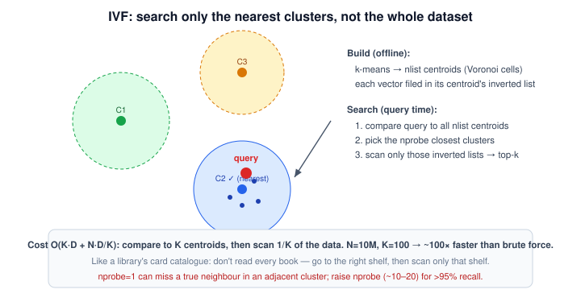
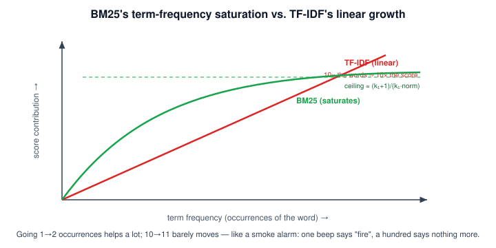

# Conversational AI · Session 02 · Embeddings, Vector Search & Hybrid Retrieval

*Learned 1 Aug 2026*

## Why this matters

Conversational systems need a way to find the right knowledge before the LLM answers. This session teaches that retrieval chain: represent text as embeddings, compare vectors, index them efficiently, and combine dense search with keyword search. After reading it, you should be able to explain why "just use embeddings" is not enough for production RAG.

## Part 1 · Semantic vs Keyword Search

*The core retrieval tradeoff is simple: semantic search retrieves by meaning, keyword search retrieves by exact lexical evidence, and real systems usually need both.*

**Prerequisites recap** — this session assumes basic transformer architecture, self-attention, feedforward layers, and matrix operations.

> - **Transformer architecture**: token IDs become token embeddings, position information is added, transformer layers rewrite the token vectors, and a pooling step can turn many token vectors into one sentence vector. Spelled out block by block: **Embeddings + Positional Encoding** turn token IDs into dense vectors carrying position info; **Multi-Head Self-Attention** runs parallel attention over different learned subspaces; **LayerNorm + Residual** adds and normalizes after each sub-layer; the **Feed-Forward Network (FFN)** is two linear layers with a ReLU in between, applied per position; this whole block repeats for **Nx layers**; a decoder finishes with **Linear + Softmax**, projecting to vocabulary size for a probability distribution.
> - **Self-attention vs cross-attention**: self-attention compares tokens inside the same sequence; cross-attention lets a decoder attend to an encoded source sequence, as in translation. Concretely: in `"The bank was closed because the river overflowed its banks"`, self-attention lets the model reach the first `bank`, look at the rest of the *same* sentence, see `river` and `overflowed`, and realize `bank` means a landform, not a financial institution — query and result both come from one sequence. Translating `"I love Mangoes"` into `"Mujhe Aam pasand hain"` is different: the decoder's query comes from the Hindi word it is generating, but the key/value data it attends to comes from the English input — that is cross-attention, query and data from two different sequences.
>
>   | Mechanism | Where it runs | Query (Q) source | Key/Value (K, V) source |
>   |---|---|---|---|
>   | Self-attention | Encoder and decoder | Current layer's input | Current layer's input (same sequence) |
>   | Cross-attention | Decoder only | Decoder's current state | Encoder's final output (different sequence) |
> - **Multi-headed attention**: several attention heads learn different projections of `Q`, `K`, and `V`, then concatenate their outputs and project through a learned matrix `W^O` back to the model's embedding dimension — so the final representation can carry several relationship patterns (syntax, coreference, topic) at once instead of averaging them into one.
> - **Matrix operations**: dot product scores similarity, softmax turns scores into weights, and weighted sums blend vectors.

### 1. Semantic search vs keyword search

**Intuition** — Keyword search asks, "which documents contain these words?" Semantic search asks, "which documents mean the same thing?" They fail in opposite ways, which is why hybrid retrieval exists.


**Mechanism** —

| Retrieval type | Representation | Best for | Failure mode |
|---|---|---|---|
| Keyword / sparse | term counts, inverted indexes, BM25-style weighting | names, IDs, exact phrases, rare terms | misses paraphrases |
| Dense / semantic | neural embeddings | synonyms, concepts, natural-language questions | can blur exact facts |
| Hybrid | sparse + dense + fusion | production RAG | more components to tune and monitor |

**Worked example** — Query: `"laptop reimbursement policy"`.

| Document | Keyword behavior | Dense behavior |
|---|---|---|
| `"employee device expense rules"` | may miss: no exact laptop/reimbursement words | likely match |
| `"laptop serial number inventory"` | may match: exact laptop word | likely demote |
| `"reimbursement form LAP-2026"` | likely match exact term/code | likely match if context is enough |

**Tradeoff / when NOT to use** — Dense-only search is risky for compliance, support, and ticketing systems where exact product names, IDs, SKUs, policy clauses, and version numbers matter. Keyword-only search is risky when users describe the same idea with different words from the document.

---

### 2. What an embedding is

**Intuition** — An embedding is a numeric representation of meaning. Texts with similar meanings should land near each other in vector space, even when they use different words.

Imagine a library map arranged by meaning instead of alphabetically: credit cards, accounts, and loans sit near each other; river-bank erosion sits far away even though it shares the word `bank`.

**Mechanism** — An embedding model maps text to a fixed-length vector:

```text
"refund my cancelled flight" -> [0.12, -0.44, 0.87, ..., 0.09]
```

For retrieval, stored chunks and incoming queries are embedded into the same vector space. Search then becomes nearest-neighbor search: find the stored vectors closest to the query vector.


**Worked example** — Query: `"reset my password"`.

| Candidate text | Match | Why |
|---|---:|---|
| `"change forgotten password"` | high | different words, same intent |
| `"delete account"` | medium | account-related but different action |
| `"weather in Hyderabad"` | low | unrelated |

**Tradeoff / when NOT to use** — Embeddings are weak when the important signal is an exact token. If a user searches `INC-48291`, `v2.3.7`, or `Section 14.2(b)`, keyword search or metadata filtering should lead and semantic search can follow.

---

### 3. What are Encoder Models?

**Intuition** — Encoder models are good embedding machines because they see the whole input at once. That bidirectional view lets them represent meaning in context rather than treating each word as one fixed object.

**Why Encoders for Embeddings?** The important word is **contextual**: the vector for `bank` should change depending on whether the sentence mentions a river or an account.

Older methods such as word2vec and GloVe assign one learned vector to each word. That breaks on polysemy: one `bank` vector has to serve both finance and geography. A contextual encoder computes the vector at inference time, using surrounding words to decide the meaning.

**Mechanism** — Encoder self-attention lets every token attend to every other token in the input. The final token vectors are not just word meanings; they are word-in-this-sentence meanings.


For token matrix `X`, one attention layer computes:

```text
Q = X W_Q
K = X W_K
V = X W_V
Attention(Q,K,V) = softmax(QK^T / sqrt(d_k)) V
```

Plain language: `QK^T` asks which tokens matter to each token, softmax converts those scores into weights, and multiplying by `V` blends the useful information.

**Worked example** — In `"the bank was closed because the river overflowed"`, `bank` attends to `river` and `overflowed`, so its vector moves toward geography. In `"the bank account was closed"`, `bank` attends to `account`, so its vector moves toward finance.

**Tradeoff / when NOT to use** — Encoder embeddings are ideal for understanding and search, but they are not the natural architecture for open-ended generation. If the task is to write an answer token by token, a decoder-only LLM is the standard choice.

---

### 4. Encoder vs Decoder vs Encoder-Decoder

**Intuition** — These sound like three different machines. They are the **same machine with one setting changed: how much of the text each word is allowed to look at.** And that setting isn't a design preference — it follows from whether the text already exists.

- **Encoder — reading a letter someone already wrote.** The whole text is in front of you, so every word may look at **every other word, in both directions**. Natural when you need to *understand* something complete: classify it, or squeeze it into one embedding vector.
- **Decoder — writing a letter, one word at a time.** You may only look at what you have **already written**, because the rest doesn't exist yet. That restriction isn't a weakness of the design; the task forces it. Natural when you need to *produce* text.
- **Encoder-decoder — translating.** Two jobs, so two parts: **read** the whole source sentence first (encoder, looking both ways), then **write** the translation word by word (decoder, looking back at what it wrote) while glancing at the encoded source.

So "encoders understand, decoders generate" is the **consequence**, not the rule. The rule is: *can this word see ahead or not* — and it can only see ahead if the text is already there.


**Mechanism** —

| Architecture | Context view | Best use cases | Weak fit |
|---|---|---|---|
| Encoder-only | bidirectional: sees the whole input | embeddings, classification, sentiment, NER, semantic search | free-form generation |
| Decoder-only | causal: sees previous tokens only | chat, code, instruction following, text generation | pure embedding quality unless specially trained |
| Encoder-decoder | encoder sees source; decoder generates target | translation, summarization, text-to-text conversion | heavier when one side is enough |

**Per-task decision table** — the same three-way choice, task by task, with the reasoning that drives each verdict:

| Task | Encoder-only | Decoder-only | Encoder-Decoder | Why |
|---|---|---|---|---|
| Sentiment analysis | ✓ Best | ○ Possible | ✗ Overkill | needs bidirectional context, no generation required |
| Text generation | ✗ No | ✓ Best | ○ Possible | requires autoregressive generation capability |
| Machine translation | ✗ No | ○ Suboptimal | ✓ Best | cross-attention optimally aligns source-target pairs |
| Named entity recognition | ✓ Best | ✗ Inefficient | ✗ Overkill | token-level classification needs bidirectional context |
| Conversational AI | ✗ No | ✓ Best | ○ Outdated | decoder-only scales better for dialogue and instruction following |
| Summarization | ✗ No | ✓ Modern | ✓ Traditional | both work; decoder-only now preferred for a unified architecture |
| Semantic search | ✓ Best | ○ Possible | ✗ Overkill | encoder creates optimal dense representations for similarity |
| Code generation | ✗ No | ✓ Best | ○ Rare | sequential generation with context — decoder-only excels |

Read this as a lookup table for "which architecture for this task," not a ranking of architectures in general — semantic search and text generation land on opposite ends on purpose.

**Popular models by architecture (2025 snapshot)** — concrete anchors for each category, and the give-away that tells you which family a new model belongs to:

| Architecture | Models you'll meet | Products built on them | Tell-tale sign |
|---|---|---|---|
| **Encoder-only** | BERT, RoBERTa, DeBERTa, ALBERT, DistilBERT | search backends, classifiers, embedding APIs | name usually ends in **-BERT**; ships as an *embedding* or *classification* model, has no chat interface |
| **Decoder-only** | GPT-3, GPT-4, Claude, Llama 3, Mistral | ChatGPT, GitHub Copilot | you can **chat** with it; it streams output word by word |
| **Encoder-decoder** | T5, FLAN-T5, BART, PEGASUS, mT5, mBART | translation and summarization services | described as **text-to-text** or **seq2seq**; takes one sequence in, gives a different one out |

Like any specific model list this dates quickly — but the **tell-tale sign** column doesn't. Categories and per-task fit are the durable part; the names are just today's examples.

Concrete products behind those categories, to ground the abstractions: **ChatGPT and Claude** are decoder-only conversational AI; **GitHub Copilot** is decoder-only code synthesis; encoder-decoder machine translation is the classic "English to French" framing; encoder-decoder summarization means encoding a document and decoding a summary.

**Worked example — one sentence, all three architectures.** Take `"The food was slow but excellent"`. This sentence is chosen deliberately: **the word that decides the meaning arrives last.**

*① Encoder — classify the sentiment.* Read it strictly left to right and you would commit too early: after `The food was slow` every signal says **negative**. But an encoder never reads left to right. While it processes `slow`, the words `but excellent` are already visible to its right, so it can treat `slow` as the concession and `excellent` as the verdict. Output: one vector → **positive**.

> This is the whole case for bidirectional attention in one line: **the deciding word came after the misleading one.** Hide the right-hand side and you get the answer wrong.

*② Decoder — continue the sentence.* Give it `The food was slow but ___`. It predicts the next word from those five words alone, because `excellent` **has not been written yet** — there is literally nothing to its right to look at. It outputs a distribution over the vocabulary: `excellent 0.31 · tasty 0.18 · worth 0.09 · …`, samples one, appends it, and repeats. Same sentence, but the restriction is forced by the task, not chosen.

*③ Encoder-decoder — translate it.* The encoder reads all six words both ways (as in ①) and hands over an encoded source. The decoder then writes the translation one word at a time (as in ②), and for each target word it looks at **two** things: what it has written so far, and the whole encoded source. That second link — cross-attention — is why the target can reorder freely: target word 1 may draw on source word 6.

**The pattern:** same sentence, three architectures, and the only thing that changed each time was **what was visible.**

**Tradeoff / when NOT to use** — Do not force one architecture onto every problem. A decoder-only model can perform understanding tasks after suitable fine-tuning, but for embeddings a purpose-built encoder is usually cheaper, faster, and easier to index.

**Tradeoff note carried into the next section** — "encoders understand, decoders generate" is a practical default, not a law. The slide that follows is the evidence.

---

### 5. Decoders Laugh as Loud as Encoders

**Intuition** — For years the rule of thumb was that **encoders win at understanding tasks** and decoders are for generation. This study tested that head-on, on a task that is genuinely hard to fake — recognising *what kind of joke* a text is — and found the gap had closed. The twist is *why* it closed, and it is not the reason people assume.

**Mechanism — the study.** Borodach et al. (2025) compared three architecture families on one six-way humor-classification dataset (five joke types plus "no joke", **1,392 human-authored jokes**):

| Family | Models compared |
|---|---|
| **Encoders** (17 tested) | BERT, RoBERTa, DeBERTa, XLNet, ALBERT, ModernBERT, NeoBERT |
| **Encoder-decoders** | BART-large-mnli, Flan-T5-base |
| **Decoders** | GPT-4, GPT-4o, Llama 3.2, Gemma 2, Qwen2, Mistral |

**Worked example — read the result, then read the catch:**

| Model | Setup | F1 |
|---|---|---|
| RoBERTa-base | fine-tuned — the **prior** state of the art | **0.86** |
| GPT-4o | fine-tuned | **0.85** — statistically equal |
| Decoders | zero/few-shot, **not** fine-tuned | **≈0.18** |

The headline looks like "decoders caught up." The real finding is the third row: **fine-tuning, not architecture, is what closed the gap.** An un-tuned decoder is nowhere near — it collapses from 0.85 to 0.18 on the identical task.


**Tradeoff / what this does *not* license** — it does not mean "use a decoder for embeddings now." Matching quality is only half the decision; the other half is cost. If an encoder reaches the same retrieval or classification quality with **smaller vectors, faster inference and simpler indexing**, it is still the better production tool. What changed is the *reason* to choose an encoder: economics, not capability.


### 6. How Encoder Transformers Create Embeddings

**Intuition** — A sentence embedding is not produced in one magic step. It is built through tokenization, embedding lookup, positional addition, transformer layers, and pooling.


**Mechanism** — BERT Pipeline. For `"Machine learning is fascinating"` in a BERT-like encoder:

| Step | What happens | Output shape idea |
|---|---|---|
| 1. Tokenization | add `[CLS]` at the start and `[SEP]` at the end | 6 tokens |
| 2. Token embeddings | each token ID looks up one row in a learned table | 6 vectors, each 768-dim |
| 3. Positional embeddings | add a learned position vector elementwise | 6 position-aware input vectors |
| 4. Transformer layers | 12 BERT-base layers mix information with self-attention and FFNs | 6 contextual vectors |
| 5. Pooling strategy | compress token vectors into one sentence/chunk vector | 1 vector |

Token embeddings are static at lookup time: the same token ID selects the same row. Context appears only after transformer layers rewrite the vectors.

**Worked example** — Position addition is elementwise:

```text
token embedding      [0.23, -0.15, 0.89]
position embedding   [0.02,  0.03, 0.01]
input embedding      [0.25, -0.12, 0.90]
```

Without position information, `"the dog bit the man"` and `"the man bit the dog"` contain the same token vectors in a different order, and the lookup table alone has no way to tell the difference.

**Tradeoff / when NOT to use** — BERT-style encoders are excellent for medium-length text, but their context window can be short for long documents. If a document exceeds the model's context window, chunk it carefully instead of truncating silently.

---

### 7. Pooling strategies

**Intuition** — The encoder returns one vector per token, but search needs one vector for the whole sentence or chunk. Pooling compresses many contextual token vectors into one vector.


**Mechanism** —

| Pooling | Formula | Best fit |
|---|---|---|
| CLS pooling | `v = h_[CLS]` | classification, sentiment, NLI |
| Mean pooling | `v = (1/n) sum_i h_i` | semantic similarity, search, RAG |
| Max pooling | `v_j = max(h_1j, ..., h_nj)` | some retrieval/classification setups |

Many BERT-family checkpoints expose `[CLS]` conveniently, but sentence-embedding models often prefer mean pooling because it uses signal from every token. **Sentence-BERT** (Reimers & Gurevych, 2019) is the model that established this pattern — a siamese/triplet network fine-tuned specifically to make mean-pooled sentence vectors directly comparable by cosine similarity — and it's why mean pooling is the default for BGE, GTE, and most modern sentence-embedding models, not just an arbitrary alternative to CLS pooling.

**Worked example** — Three 2D token vectors:

```text
h1 = [1, 4]
h2 = [3, 2]
h3 = [5, 0]

mean pooling = [(1+3+5)/3, (4+2+0)/3] = [3, 2]
max pooling  = [max(1,3,5), max(4,2,0)] = [5, 4]
```

**Tradeoff / when NOT to use** — CLS pooling is convenient but not automatically best for retrieval. If a search system returns near-random FAQ matches from a general BERT checkpoint, the issue may be pooling rather than the whole model; mean pooling or a sentence-embedding model may be the simpler fix.

---

### 8. Embedding Models: Key Players

**Intuition** — An embedding model is a production component, not a generic utility. Dimension, context window, training objective, language coverage, latency, deployment type, and cost decide whether retrieval works well.


**Mechanism** — Read model specifications as a selection checklist, not as a leaderboard.

| Model | Provider | Output dim | Context | Type | Cost | Best fit |
|---|---|---:|---:|---|---|---|
| `bge-large-en-v1.5` | BAAI | 1024 | 512 | open | self-hosted (compute only) | strong general English baseline |
| `gte-large-en-v1.5` | Alibaba | 1024 | 8192 | open | self-hosted (compute only) | longer documents |
| `e5-mistral-7b-instruct` | Microsoft | 4096 | 32768 | open | self-hosted (compute only) | instruction-following, very long context |
| `jina-embeddings-v2` | Jina AI | 768 | 8192 | open | self-hosted (compute only) | multilingual, faster inference |
| `text-embedding-3-large` | OpenAI | 3072 | 8191 | API | **$0.13 / 1M tokens** | highest quality, production |
| `embed-english-v3.0` | Cohere | 1024 | 512 | API | **$0.10 / 1M tokens** | compression support, production |

The cost column is why "just use the best API model" is not automatically the right call: at high query volume, the per-token API charge compounds, while an open model's cost is the (roughly fixed) compute to host it — the crossover point is a real production sizing decision, not a footnote.

**Full spec reference** — architecture, layer count, and training objective for the same six models, for when the summary table above isn't enough to explain a quality difference:

| Model | Provider | Architecture | Layers | Hidden size | Training | Type |
|---|---|---|---:|---:|---|---|
| `text-embedding-3-large` | OpenAI | Transformer | N/A | N/A | Contrastive | API |
| `embed-v3` | Cohere | Transformer | N/A | N/A | Multi-task | API |
| `bge-large-en-v1.5` | BAAI | BERT | 24 | 1,024 | RetroMAE + Contrastive | Open |
| `gte-large-en-v1.5` | Alibaba | BERT | 24 | 1,024 | Contrastive | Open |
| `e5-mistral-7b-instruct` | Microsoft | Mistral 7B | 32 | 4,096 | Contrastive pre-training | Open |
| `jina-embeddings-v2` | Jina AI | BERT | 12 | 768 | Contrastive | Open |

`bge-large-en-v1.5` combining RetroMAE pretraining *and* contrastive fine-tuning (rather than one or the other) is why it's the recommended general-purpose open default in the selection guide above — it gets both the compact-representation benefit of RetroMAE (section 8) and the direct similarity-training benefit of contrastive learning.

**Worked example** — For a small English FAQ, start with a 768- or 1024-dimensional open model. For policy documents where sections exceed 1000 tokens, choose a longer-context model or chunk by headings. For sensitive customer data, local/open deployment may beat a higher-scoring API model because privacy and batch economics dominate.

**Tradeoff / when NOT to use** — Do not chase the largest dimension blindly. A 4096-dimensional vector can improve quality, but if it doubles RAM and slows index traversal without measurable recall gain on your data, a smaller model wins.

---

### 9. Embedding Models: Training Objectives

**Intuition** — Embedding quality comes from the training objective. The model must learn that related texts should be close and unrelated texts should be far.


**Mechanism** —

| Training objective | Core idea | Strength | Main risk |
|---|---|---|---|
| Training Objective - Contrastive Learning | pull positive pairs close; push negatives far | directly trains semantic similarity | needs good negatives and careful batches |
| Training Objective - Masked Language Modeling (MLM) | hide tokens and predict them from context | strong bidirectional understanding | not optimized for retrieval by itself |
| Training Objective - RetroMAE | reconstruct heavily masked input through an encoder-decoder setup | compact retrieval-oriented representations | more complex training and mask-ratio tuning |

Contrastive loss for an anchor `a`, positive `p`, and negatives `n_i`:

```text
loss = -log( exp(sim(a,p)) / sum_i exp(sim(a,n_i)) )
```

Plain language: reward the positive pair for scoring high, and punish it if negatives score nearly as high.

**Worked example** — Anchor: `"The cat sat on the mat"`. Positive: `"A feline rested on the rug"`. Negative: `"How to bake chocolate cookies"`. A good embedding model raises anchor-positive similarity and lowers anchor-negative similarity.

Models built on each objective, as concrete anchors: **contrastive learning** — SimCSE, DPR, SBERT, E5, GTE, mE5, NV-Embed; **MLM** — BERT, RoBERTa, SpanBERT; **RetroMAE** — RetroMAE, RetroMAE v2, RetroMAE-BEIR.

For MLM, `"The [MASK] brown fox [MASK] over the lazy dog"` teaches the encoder to predict `quick` and `jumps` from both sides. For RetroMAE, a more heavily masked sentence forces the encoder to compress the surviving context well enough for the decoder to reconstruct the original.

**Tradeoff / when NOT to use** — Contrastive training is powerful but sensitive to negative sampling. If a "negative" is actually relevant, the model learns the wrong boundary. MLM is a strong pretraining task for understanding, but search quality usually needs retrieval-oriented training or fine-tuning.

## Part 2 · Vector Database Architecture (HNSW, ANN)

*Once vectors exist, the system must search them fast enough for conversational latency.*

### 10. Vector Similarity: Mathematical Foundations

**Intuition** — Similarity metrics define what "near" means, and the mathematics behind them is short. Cosine cares about direction, Euclidean distance cares about physical distance, and dot product combines direction with magnitude unless vectors are normalized.


**Mechanism** —

| Metric | Formula | How to read it |
|---|---|---|
| Cosine similarity | `cos(A,B) = (A dot B) / (||A|| ||B||)` | high value means similar direction |
| Euclidean / L2 distance | `d(A,B) = sqrt(sum_i (A_i - B_i)^2)` | low value means close points |
| Dot product | `A dot B = sum_i A_i B_i` | high value means alignment and/or larger magnitude |

If vectors are normalized so `||A|| = ||B|| = 1`, dot product equals cosine similarity. This is why many vector systems normalize text embeddings before using inner-product search.

**Worked example** — Let `A = [3,4]`, `B = [4,3]`, and `C = [-4,3]`.

```text
A dot B = 3*4 + 4*3 = 24
||A|| = 5, ||B|| = 5
cos(A,B) = 24 / 25 = 0.96
L2(A,B) = sqrt((3-4)^2 + (4-3)^2) = sqrt(2) = 1.414

A dot C = 3*(-4) + 4*3 = 0
cos(A,C) = 0 / 25 = 0
L2(A,C) = sqrt((3+4)^2 + (4-3)^2) = sqrt(50) = 7.071
```

`B` is close to `A`; `C` is much farther and orthogonal by cosine.

**Tradeoff / when NOT to use** — Cosine is usually safer for text because it ignores vector length. Dot product is fast, but it only behaves like cosine when vectors are normalized or the model was trained for dot-product scoring. L2 can be useful for geometric/image-style spaces but is often too magnitude-sensitive for text.

---

### 11. The Computational Challenge

**Intuition** — Exact nearest-neighbor search is simple: compare the query with every stored vector. It also becomes impossible at production scale.


**Mechanism** — Linear scan cost is:

```text
operations per query = number_of_vectors * vector_dimension
```

For 10 million vectors of dimension 768:

```text
10,000,000 * 768 = 7,680,000,000 multiply-add operations
```

At 1 billion operations per second, that is about 7.68 seconds per query. At 100 queries per second, it implies 768 CPU-core seconds per second of traffic.

**Worked example** — If one query over 10M vectors takes 7.68 seconds on one CPU core, then serving 100 queries per second requires:

```text
7.68 seconds/query * 100 queries/second = 768 cores
```

That is before network overhead, filters, reranking, and the LLM call.

**Tradeoff / when NOT to use** — Linear scan is fine for tiny collections, offline evaluation, and verifying ANN recall. It is not the serving strategy for millions of vectors unless specialized hardware and workload economics justify brute force.

---

### 12. Linear Scan vs ANN Solution

**Intuition** — Approximate Nearest Neighbor search avoids checking every vector. It accepts "close enough" top-k results in exchange for large speedups.


**Mechanism** — ANN uses index structure to skip most candidates. The contrast is the point:

| Search style | Example latency at 10M vectors | How it works |
|---|---:|---|
| Linear scan | about 7.68 seconds/query | brute-force comparison against all vectors |
| ANN index such as HNSW | about 10 milliseconds/query | navigates an index and avoids unnecessary comparisons |

Scale intuition:

| Documents | Linear scan | HNSW-style ANN |
|---:|---:|---:|
| 10K | ~8 ms | ~2 ms |
| 100K | ~77 ms | ~3 ms |
| 1M | ~770 ms | ~5 ms |
| 10M | ~7.7 s | ~10 ms |

**The cost engineering angle** — latency is only half the production picture; the same scale table, priced monthly, is the other half:

| Documents | Linear scan latency | Linear scan cost/month | HNSW latency | HNSW cost/month |
|---:|---:|---:|---:|---:|
| 10K | 8 ms | $50 | 2 ms | $50 |
| 100K | 77 ms | $50 | 3 ms | $50 |
| 1M | 770 ms | $200 | 5 ms | $120 |
| 10M | 7.7 s | **$5,000** | 10 ms | **$250** |

At small scale, linear scan and HNSW cost about the same — the indexing overhead isn't worth it yet. The gap only opens up at scale: by 10M documents, linear scan is both too slow to serve *and* 20× more expensive to run, because "too slow" in production means throwing more CPU cores at the problem, and CPU cores are what you're paying for. ANN indexing isn't just a speed trick; past a certain scale it's the cheaper option too.

**Worked example** — A support RAG system with 10M chunks does not need the mathematically exact top-10 every time. If ANN returns 9 of the true top-10 in milliseconds, a reranker can often recover the final ordering while keeping end-to-end latency acceptable.

**Tradeoff / when NOT to use** — ANN is a latency-recall tradeoff. If the collection is tiny or the top-1 result must be mathematically exact, brute force may be safer. In RAG, 95-99% approximate recall is usually acceptable because retrieval is followed by reranking, answer generation, and citation checks.

---

### 13. ANN Indexing Strategies

**Intuition** — "ANN" is not one algorithm. It is a family of indexing strategies that trade memory, build cost, query speed, and recall differently.


**Mechanism** —

| Strategy | Example | How it works | Strength | Weakness |
|---|---|---|---|---|
| Graph-based | HNSW | connect nearby vectors in a navigable graph | high recall, fast search, no training | high memory, slower inserts |
| Partition-based | IVF | cluster vectors; search selected partitions | scalable, works with compression | needs training; sensitive to `nprobe` |
| Compression-based | PQ | compress vectors into compact codes | 8-32x memory reduction, billion-scale search | lower recall, needs training |

PQ — the compression-based strategy in the table above — comes from Jégou et al. (2011).

**Worked example** — For 10M vectors and enough RAM, HNSW is a strong default because it gives high recall and simple tuning. For hundreds of millions of vectors where RAM is the binding constraint, IVF+PQ can be the better engineering choice even if recall is lower.

**Tradeoff / when NOT to use** — Graph indexes are not automatically best. If memory cost dominates, compression can beat HNSW. If insertion rate is very high, a partitioned or disk-backed design may be easier to operate.

---

### 14. IVF: Inverted File Index

**Intuition** — Instead of comparing the query to every vector, IVF first sorts the whole dataset into neighbourhoods, then searches only the few neighbourhoods nearest the query. It is the library card-catalogue trick: don't read every book — go to the right shelf and scan only that shelf.

**Mechanism** — Two phases:

- *Build (offline).* Run k-means over a training sample to learn `nlist` coarse centroids; these carve vector space into Voronoi cells. Every vector is filed into an **inverted list** attached to its nearest centroid.
- *Search (query time).* Compare the query to all `nlist` centroids, pick the `nprobe` closest clusters, and scan only the vectors in those inverted lists, then return top-k.



**Worked example** — `nlist=3`, `nprobe=1`, 2-D vectors. Query `q=(5.0, 5.0)`; centroids C1(1.25, 1.00), C2(4.90, 5.25), C3(8.85, 1.15). Euclidean distances: C1 ≈ 5.48, **C2 ≈ 0.26**, C3 ≈ 5.44, so C2 is nearest. Scan only C2's list — v3 = (5.0, 5.1) at dist 0.10, v4 = (4.8, 5.4) at dist 0.45 — and return **v3**, having touched **2 of 6** vectors.

**Algorithm motivation** — *The problem:* brute force compares the query against all N vectors. *The fix:* pre-cluster once so a query visits only a handful of clusters. Complexity drops from O(N·D) to **O(K·D + N·D/K)** — rank K centroids, then scan one cluster of N/K vectors. For N=10M, K=100: 100 + 100,000 = 100,100 comparisons vs 10,000,000, about **100× faster**. *Everyday analogy:* a supermarket groups items into aisles; you walk to "dairy" instead of scanning every shelf in the store.

***In practice*** — Tuning knobs: `nlist` ≈ √N to N/1000 (sweet spot ~4√N; 1M vectors → ~1,000–4,000 clusters), and `nprobe` chosen at query time (1–5 → ~70–85% recall, very fast; 50–100 → ~95%+ recall, slower; typical 10–20). A k-means training phase over a 10K–100K sample precedes indexing.

**Tradeoff / when NOT to use** — A true nearest neighbour can sit just across a cluster boundary; with `nprobe=1` that cluster is never scanned and recall drops. Raising `nprobe` fixes it at more cost (exact search needs `nprobe=nlist`). IVF also needs training and is sensitive to cluster quality, so for small or highly dynamic datasets HNSW's no-training graph is easier to operate.

---

### 15. Product Quantization (PQ)

**Intuition** — PQ shrinks each vector by *divide and conquer*: chop it into a few short pieces and replace each piece with the ID of the closest entry in a small "codebook." A 512-byte vector becomes 4 bytes, so billions of vectors now fit in RAM.

**Mechanism** — Three steps:

1. *Train codebooks.* Split each D-dimensional vector into M subvectors; for each subvector position, run k-means to learn a codebook of k centroids (k=256 fits in one byte).
2. *Encode.* Replace each subvector with the ID (0–255) of its nearest centroid, so a vector becomes M one-byte codes.
3. *Fast distance (ADC — Asymmetric Distance Computation).* At query time, split the query, precompute a distance table from each query subvector to all 256 centroids, then a database vector's distance is just `table1[ID1] + table2[ID2] + ...` — a few lookups and adds, never decompressing anything.


**Worked example** — 5 vectors × 8 dims, M=2 (two 4-dim subspaces), k=2. Storage: original 5×8×4 = **160 B**; PQ codes 5×2×1 = 10 B plus codebooks 2×2×4×4 = 64 B, total **74 B**. The codebook is a fixed one-time cost, so at millions of vectors the compression approaches **32×** (float32 → 1 byte per code). An ADC query precomputes two small distance tables and sums lookups per vector, so vectors with codes `[0,0]` score ≈ 0.05 (closest) without any reconstruction.

**Algorithm motivation** — *The problem:* storing raw float32 vectors at billion scale needs terabytes of RAM, and a full distance is 128 multiplications per vector. *The fix:* quantize sub-pieces to bytes and replace multiplications with table lookups. *Everyday analogy:* grading exams with a pre-filled answer key — score each paper by looking up its answers, not re-solving every question.

***In practice*** — Parameters: M (8/16/32/64 — more subvectors give better accuracy but more bytes; M must divide D; 768-dim → M=96) and k (256 → 1 byte). M=8 → 8 bytes/vector (32× compression); M=64 → 64 bytes (4×, higher accuracy). PQ is usually paired with IVF (**IVF+PQ**): IVF narrows to a cluster, PQ makes each stored vector tiny.

**Tradeoff / when NOT to use** — Compression is lossy, so PQ alone lands at ~70–85% recall, too low when exact ordering matters and RAM is not the constraint. Use it when billions of vectors must fit in memory and ~90–95% recall (with IVF and re-ranking) is acceptable.

**ANN algorithms at a glance** — the strategies on the axes that decide a production choice:

| Algorithm | Search time | Memory | Build time | Recall |
|---|---|---|---|---|
| Linear scan | O(n·d) | O(n·d) | O(1) | 100% |
| HNSW | O(log n) | O(n·d) | O(n log n) | 95–99% |
| IVF | O((n/k)·d) | O(n·d) | O(n·d·i) | 90–95% |
| PQ | O(n·m) | O(n·m) | O(n·d·i) | 70–85% |
| IVF+PQ | O((n/k)·m) | O(n·m) | O(n·d·i) | 85–92% |
| HNSW+PQ | O(log n) | O(n·m) | O(n log n) | 90–96% |

HNSW trades memory for speed; IVF+PQ trades accuracy for compression; **HNSW+PQ** is a common production sweet spot. Widely used libraries: FAISS, ScaNN, ANNOY.

---

### 16. HNSW: Hierarchical Navigable Small World

HNSW was introduced by Malkov & Yashunin (2018).

**Intuition** — HNSW's core structure is a **multi-layer skip list for vectors** (the deck's framing): sparse long-range shortcuts at the top, all points with dense connections at the bottom. Search jumps across the dataset on the top layers, then descends into local detail — the same "sparse shortcuts on top, dense detail below" idea skip lists use for ordered data, generalized to a graph over vector similarity.


**Mechanism** — HNSW stores vectors as graph nodes. Edges connect nearby nodes. Search starts at a sparse high layer, greedily moves closer to the query, then descends layer by layer until the dense base layer. A final beam-style search expands candidates at layer 0.

Key ideas:

| Idea | Meaning |
|---|---|
| hierarchical structure | top layers skip across the dataset quickly |
| small-world property | average path length stays short, often near logarithmic |
| navigable graph | greedy movement usually finds a near-optimal path |
| robustness | multiple possible routes reduce local-minimum risk |

This is the complexity payoff, stated plainly: brute-force search is **O(N)** — every query compares against every stored vector. HNSW's layered structure turns that into **O(log N)** — each layer eliminates most of the remaining candidates before the next layer even starts, which is the same "skip across, then narrow down" shape as the CPU-core math in concept 11.

**Worked example — one concrete run, step by step.** Say the graph has 8 stored vectors, numbered 1-8, and a query vector arrives (drawn as the target point).

1. **Enter at the top layer** at a random entry point, node 1. Node 1 connects to node 2 at this sparse top layer; comparing both to the query, node 2 is closer. Current best: **node 2**.
2. **Drop down** to the middle layer at node 2. This layer has more nodes and edges: 1, 5, 4, 2, 3. A greedy search from node 2 checks its neighbors and finds node 4 is closer to the query than node 2 was. Current best: **node 4**.
3. **Drop down** to the dense bottom layer (layer 0), which holds all 8 vectors and their full connections. A final expanded (beam) search around node 4 checks its neighbors — including node 7 — and finds **node 7 is the closest point to the query**. Search stops here and returns node 7 (plus its nearest neighbors, for top-k).

Three comparisons at the top, a handful at the middle, and one expanded search at the bottom found the true nearest neighbor without ever comparing the query against all 8 points directly — and the saving gets more dramatic as the dataset grows from 8 points to 10 million.

**Tradeoff / when NOT to use** — HNSW is a strong default up to large but memory-manageable datasets. If the dataset reaches hundreds of millions or billions of vectors and RAM is the main constraint, IVF+PQ or another compressed setup may beat HNSW despite lower recall.

---

### 17. HNSW: Memory Layout

**Intuition** — HNSW speed is not free: the graph needs extra memory for its connections on top of the raw vectors.


**Mechanism** — Per vector, the rough storage components are:

```text
vector bytes      = dimension * 4 bytes for float32
connection bytes  = M * 4 bytes * layer factor
```

For 768-dimensional float32 vectors and `M = 16`:

```text
raw vector bytes        = 768 * 4 = 3,072 bytes
connection bytes approx = 16 * 4 = 64 bytes
rough storage           = about 3,136 bytes before broader graph/metadata overhead
```

Planning table:

| Scale | Raw vector data | Graph overhead | Production memory budget |
|---:|---:|---:|---:|
| 1M vectors | ~3.1 GB | ~0.5-1 GB | ~3.6-4.1 GB |
| 10M vectors | ~31 GB | ~10-20 GB | ~41-51 GB |
| 100M vectors | ~310 GB | ~200-300 GB | ~510-610 GB |

---

### 18. Parameter Tuning: HNSW

**Intuition** — HNSW's tuning parameters decide the latency–recall–memory balance. Three knobs matter:

| Parameter | Typical range | Raising it does |
|---|---:|---|
| `M` | 16-64 | better recall, more memory, slower inserts |
| `ef_construction` | 100-200+ | better index quality, slower build |
| `ef_search` | 50-500 | better query recall, slower query |

**Worked example** — Start with `M=16`, `ef_construction=200`, and `ef_search=100`. If recall is weak but latency has room, raise `ef_search` first because it affects query-time search without rebuilding the index.

**Tradeoff / when NOT to use** — Do not maximize every knob. `M=64` and high `ef_search` may improve recall, but if the product has strict latency or memory limits, a smaller index plus reranking can be better.

---

### 19. Vector database architecture

**Intuition** — A vector database is not just a table with vectors. It is a retrieval system around embeddings, indexes, metadata filters, update pipelines, sparse search, fusion, reranking, and observability.


**Mechanism** —

| Component | Job |
|---|---|
| chunker | splits documents into retrievable passages |
| embedding service | converts chunks and queries to vectors |
| vector index | serves fast ANN search |
| metadata filters | restrict by tenant, date, access control, document type |
| sparse index | BM25 / keyword retrieval |
| fusion / reranker | combines and improves candidate ordering |
| monitoring | tracks recall, latency, cost, freshness, and failed searches |

Chunking is separate because one vector for a whole document often becomes a blurry average of many topics. Smaller, topically coherent chunks keep each vector specific enough for targeted retrieval.

**Worked example** — In an HR assistant, `"Can I claim a monitor for work from home?"` should search only documents the employee is allowed to see, retrieve semantically related policy chunks, preserve exact policy-code matches, and pass the top few chunks to the LLM with citations or source IDs.

**Tradeoff / when NOT to use** — A vector database does not automatically fix bad retrieval. If chunks are too large, metadata is missing, embeddings are mismatched, or access filters are bolted on after search, the system can return plausible but unsafe context. For a small stable FAQ, a curated keyword index plus approved answers may be easier to audit.

## Part 3 · BM25 + Dense Retrieval + RRF

*Dense and keyword retrieval become useful when they are combined into one production retrieval layer.*

### 20. TF-IDF: the foundation of sparse retrieval

**Intuition** — Before dense embeddings, keyword search scored a document by two commonsense signals: how *often* a query word appears in it (term frequency), and how *rare* that word is across the whole collection (inverse document frequency). A word that is frequent *here* but rare *everywhere* — a product code, say — is a strong signal; a word like "the" is worthless because it is everywhere.

Dense embeddings, for all their semantic power, fail exactly where sparse scoring shines, three ways: **exact keyword matching** ("ERROR code 500" — dense smooths over numbers and codes), **rare/unique terms** (a part ID like `XR55-QW7`, unseen in training, gets a meaningless embedding), and **out-of-vocabulary words** (a token like `VijayawadaExpress123` is split into sub-tokens and blurred). Sparse retrieval matches the exact string, so none of these hurt it — which is *why* sparse and dense are combined into hybrid search.

**Mechanism** —

```text
TF(t,d)  = f / |d|          term count, normalized by document length
IDF(t)   = log(N / df)      N = total docs, df = docs containing t
TF-IDF   = TF(t,d) × IDF(t)
```


**Worked example** — Corpus of 1,000 docs; document "machine learning is a subset of machine learning" (8 terms); query "machine learning". "machine": TF = 2/8 = 0.25, IDF = ln(1000/400) = 0.916 → 0.229. "learning": TF = 2/8 = 0.25, IDF = ln(1000/300) = 1.204 → 0.301. Document score = 0.229 + 0.301 = **0.530**.

**Tradeoff / when NOT to use** — TF-IDF has four gaps: term frequency grows **linearly** (10 occurrences score 10×, no diminishing returns), **no length normalization** (long documents win just by being long), **bag-of-words** ("dog bites man" = "man bites dog"), and **no saturation**. These are exactly what BM25 fixes, so in practice BM25 replaces raw TF-IDF as the sparse baseline.

---

### 21. BM25

**Intuition** — BM25 is the strong classical baseline for keyword search. It rewards documents that contain query terms, especially rare terms, while avoiding unlimited reward for repeated words.


**Mechanism** — BM25 combines:

| Component | Plain meaning |
|---|---|
| term frequency | a query term appearing more often helps, but the gain saturates |
| inverse document frequency | rare terms matter more than common terms |
| length normalization | long documents should not win only because they contain more words |

**Worked example** — Query: `"HNSW ef_search"`. BM25 strongly rewards a document containing the exact rare term `ef_search`. A dense retriever may understand the general HNSW tuning topic, but exact-match evidence is important because `ef_search` is a parameter name.

**Tradeoff / when NOT to use** — BM25 struggles with vocabulary mismatch. A user asking `"how do I make vector lookup faster?"` may need a document titled `"ANN indexing and HNSW tuning"`; semantic retrieval is more likely to bridge that wording gap.

**The BM25 formula** — BM25 keeps TF-IDF's two ideas and adds *saturation* and *length normalization*:

```text
score(Q,D) = Σᵢ IDF(qᵢ) · [ f(qᵢ,D)·(k₁+1) ] / [ f(qᵢ,D) + k₁·(1 − b + b·|D|/avgdl) ]
```

with a smoothed IDF = `log[(N − df + 0.5)/(df + 0.5) + 1]`. Two knobs: **k₁** (default 1.5, range 1.2–2.0) sets how fast term frequency saturates; **b** (default 0.75) sets the length penalty (0 = none, 1 = full). `avgdl` is the average document length in the collection.



**Saturation, in one line** — each extra occurrence of a term adds *less* than the previous one; the contribution flattens toward a ceiling of `(k₁+1)/(k₁·norm)`. Going from 1→2 occurrences helps a lot; 10→11 barely moves the score — like a smoke alarm, one beep already means "fire." This is the single biggest fix over TF-IDF, whose score just keeps climbing.

**Worked example — full BM25.** Same query "machine learning"; document of 12 terms with avgdl = 50; "machine" appears in 300 docs, "learning" in 400. IDF(machine) = ln(3.331) = 1.203, IDF(learning) = ln(2.499) = 0.916. norm = 1 − 0.75 + 0.75·(12/50) = 0.43. TF(machine, f=2) = 2·2.5 / (2 + 1.5·0.43) = 5.0/2.645 = 1.890; TF(learning, f=3) = 7.5/3.645 = 2.058. **BM25 = 1.203·1.890 + 0.916·2.058 = 4.159.**

**BM25 vs TF-IDF** — on the same document TF-IDF totals ≈ 0.57 while BM25 totals 4.159. The two scores live on different scales, so the number itself is not the point — the point is *why* BM25 ranks this short, focused document higher: length normalization rewards it for being shorter than average (12 vs 50 tokens), saturation stops the repeated "learning" from dominating, and the probabilistic foundation gives better ordering.

---

### 22. Dense Passage Retrieval

Dense Passage Retrieval was introduced by Karpukhin et al. (2020) and is the foundation modern dense retrieval builds on.

**Intuition** — Dense Passage Retrieval uses a dual encoder: one encoder embeds the question, another embeds passages. Retrieval is maximum similarity between the query vector and passage vectors.


**Mechanism** —

```text
q = Encoder_question(question)
p = Encoder_passage(passage)
score(question, passage) = q dot p
```

Passage vectors can be precomputed and indexed. At query time, only the question is embedded, then the vector index retrieves high-scoring passages.

Why not use one model that reads the question and passage together? A cross-encoder is usually more accurate, but it must rerun the full model for every candidate passage. That is too slow over millions of passages. The dual encoder trades away cross-attention accuracy so passage vectors can be embedded once and searched quickly.

**Worked example** — Question: `"Who wrote Pride and Prejudice?"`. The positive passage says `"Pride and Prejudice is a novel by Jane Austen..."`; a hard negative might discuss the 2005 film. Training pushes the question vector closer to the answer-bearing passage and farther from negatives.

**Tradeoff / when NOT to use** — DPR-style dense retrieval is excellent for semantic question answering, but it can underperform on exact lexical constraints and fresh domain terminology unless adapted for the domain. Hybrid retrieval is the safer production default.

---

### 23. Reciprocal Rank Fusion

**Intuition** — RRF combines rankings, not raw scores. That matters because BM25 scores and dense similarity scores live on different scales.


**Mechanism** —

```text
RRF(doc) = sum_over_rankers 1 / (k + rank(doc))
```

`k` is often around 60. A document appearing reasonably high in both lists can beat a document that appears high in only one.

**Worked example** — Use `k = 60`.

| Document | BM25 rank | Dense rank | RRF score |
|---|---:|---:|---:|
| A | 1 | 10 | `1/61 + 1/70 = 0.0307` |
| B | 5 | 3 | `1/65 + 1/63 = 0.0313` |
| C | 2 | not in top list | `1/62 = 0.0161` |

Document B wins because it is strong in both systems.

**Tradeoff / when NOT to use** — RRF is robust and simple, but it ignores score margins. If dense retrieval is overwhelmingly confident and BM25 is only weakly matching, rank-only fusion can over-promote the keyword result. Production systems often follow hybrid retrieval with reranking.

**Why fuse ranks, not scores** — dense similarity is cosine in [0, 1]; BM25 is unbounded in [0, ∞). You cannot just add them, and normalizing is fragile (min-max is outlier-sensitive; z-score assumes a normal distribution). RRF sidesteps the whole problem by fusing **rank positions**, which make no assumption about score distributions.

**Why k ≈ 60** — an empirical finding from TREC evaluations. Without k the top rank dominates (1/1 = 1.0 vs 1/2 = 0.5, too steep a drop); k=60 gentles the curve (1/61 vs 1/62) so a document strong across *both* lists beats one that merely tops a single list. Smaller k emphasizes top ranks more aggressively; larger k gives more weight to lower ranks.

**Properties** — RRF is *score-agnostic* (uses only rank order), *bounded* (score ∈ [0, #rankings/k]), *symmetric* (all rankings weighted equally), *robust* (a poor ranking is outweighed by the others), and needs *no training* (only k). Documents ranking high in multiple systems get a natural consensus bonus.

---

### 24. Hybrid retrieval end-to-end

**Intuition** — Hybrid retrieval is the practical answer to the whole session: use semantic search for meaning, keyword search for exact evidence, ANN for speed, and fusion/reranking for final quality.


**Mechanism** — A typical flow:

```text
user query
  -> dense embedding -> ANN vector search
  -> keyword terms   -> BM25 sparse search
  -> RRF fusion
  -> optional reranker
  -> top passages to the LLM
```

**Worked example** — Query: `"policy for monitor reimbursement LAP-2026"`. Dense search can find `"work-from-home equipment expenses"` even without the exact wording. BM25 preserves `LAP-2026`. RRF promotes documents that satisfy both meaning and exact evidence.

**Tradeoff / when NOT to use** — Hybrid retrieval is overkill for tiny, stable, curated FAQ sets where exact approved answers already exist. For live document corpora with paraphrases, product codes, policy clauses, and changing terminology, hybrid is usually worth the extra moving parts.

**Performance, typically** — the extra fusion stage earns its keep:

| Pipeline | Latency | Recall | Precision |
|---|---|---|---|
| BM25 only | ~20 ms | 70% | 60% |
| Vector only | ~50 ms | 75% | 65% |
| Hybrid (BM25 + Vector + RRF) | ~70 ms | 90% | 75% |

Hybrid buys a large recall and precision jump for about 20 ms: BM25 alone misses semantic matches, vector alone misses exact keywords, and RRF fuses them with no tuning.

## Self-study / Lab / build

**521 Lab 2 material now held:** `labs/S02-embeddings-vector-search/Embedding-distilbert.ipynb`.

Run the DistilBERT notebook before building the retriever. It makes sections 3, 6, and 9 concrete: the same token `bank` receives different final vectors depending on context, mean pooling turns those token vectors into sentence vectors, and cosine similarity gives a quick way to compare all of it.

⚠️ **One spec detail worth noticing.** Section 5's pipeline walkthrough uses BERT-base numbers (12 layers) because that is the canonical teaching example. The notebook actually loads `distilbert-base-uncased` — a **6-layer, ~66M-parameter distilled version of BERT**, same 768 hidden size and 12 attention heads, trained so a small "student" model imitates the larger BERT "teacher" (knowledge distillation). Fewer layers means faster, cheaper inference at a small quality cost — a real production tradeoff, not a mismatch to worry about. The pipeline mechanics (tokenize → embed → position → transformer layers → pool) are identical; only the layer count differs.

**Note → code map** — reading a concept and want to see it run? Jump to the exact cell:

| This note's concept | Notebook cell | What you run / see |
|---|---|---|
| **How Encoder Transformers Create Embeddings** — BERT pipeline, but on DistilBERT's 6 layers instead of BERT-base's 12 | cell 3 | a spec table: 6 layers, 768 hidden, 12 heads, ~66M params, 512 max tokens |
| Setup — loading an encoder model | cell 5 | `AutoModel.from_pretrained("distilbert-base-uncased")` |
| **What are Encoder Models?** — contextual embeddings, the mechanism itself | cell 6 | `get_token_embedding()` — runs the model, finds the target word's token(s), averages sub-word pieces into one vector |
| **What are Encoder Models?** — worked example: `bank` in a river sentence vs a finance sentence | cell 7 | the two `bank` embeddings computed side by side, with their token positions printed |
| **What are Encoder Models?** + **Vector Similarity: Mathematical Foundations** — contextual embeddings compared with cosine similarity | cell 8 | `cosine_similarity(bank_river_vec, bank_finance_vec)` — a number well below 1.0, proving the two vectors genuinely differ |
| **Vector Similarity: Mathematical Foundations** — reading a cosine similarity number | cell 9 (markdown) | the scale this note's Mechanism table describes: ~1.0 identical, 0.8-0.95 very similar, 0.5-0.75 related, ~0.0 unrelated |
| **What are Encoder Models?** — same-context vs cross-context comparisons (does `bank` move *toward* the right neighbor?) | cell 10 | `bank` (river) scored against `river`, and `bank` (finance) scored against `money`/`account` — same-context scores come out higher than cross-context ones |
| **Pooling strategies** — mean pooling, applied to whole sentences | cell 11 | `mean_pool_sentence_embedding()` over 4 sentences, then a full pairwise similarity matrix — the two river sentences and the two finance sentences cluster together |

*(Cell 12 is the notebook's own one-line takeaway: `bank` has no single fixed vector — self-attention keeps rewriting it based on whatever words happen to be nearby.)*

Build a tiny hybrid retriever on 10-20 short documents:

1. Create document chunks and metadata.
2. Compute simple embeddings with any local/API embedding model.
3. Implement cosine similarity in Python.
4. Implement a minimal BM25 search or use a small library.
5. Combine dense and BM25 rankings with RRF.
6. Print the top-5 results for queries that test paraphrase, exact ID, and mixed cases.

The lab lesson is not the library call; it is seeing which query fails under dense-only or keyword-only retrieval.

⚠️ The held S02 notebook covers embeddings, contextual vectors, and cosine similarity. The rest of the expected Lab 2 package also includes text-to-speech, rule-based systems, and sentiment analysis; keep those open until their files arrive or the instructor confirms they are not part of this offering's Lab 2.

---

*Exam: this session is in scope for the **closed-book mid-sem** (L1-L8). Full evaluation, weights, dates and course logistics live once in [`521-master.md`](../521-master.md) — not repeated per session.*
