# Conversational AI · Session 02 · Embeddings, Vector Search & Hybrid Retrieval

*Learned 1 Aug 2026*

## Why this matters

Retrieval is the part of conversational AI that lets an agent answer from current, private, or domain-specific knowledge instead of relying only on model memory. This session teaches the full path: turn text into embeddings, compare vectors, index them fast enough for production, and combine semantic retrieval with keyword search when each alone is brittle. If you can explain this session, you can design the knowledge-access layer of a RAG chatbot, choose a vector database, tune latency vs recall, and defend why "just use embeddings" is not enough.

> **Prerequisites recap** *— this session assumes self-attention, feedforward layers, and basic matrix operations (full depth in AIMLZG536-LLMForGenerativeAI/notes/S01-foundations.md, sections 4–6). The five-second version:*
> - **Matrix ops**: a *dot product* (multiply matching numbers, add them up) is the similarity score behind attention; *softmax* turns a row of scores into weights that sum to 1; a *weighted sum* (matrix multiply) blends vectors using those weights.
> - **Self-attention**: every token makes a Query ("what am I looking for"), Key ("what do I contain"), and Value ("what do I contribute"). Dot-product every Query against every Key → scale → softmax → weighted sum of Values. The output is each token's *context-aware* vector — this is exactly what section 2 below relies on for contextual embeddings.
> - **Feedforward layer**: after attention mixes information *between* tokens, each token's vector is individually expanded then shrunk by a small 2-layer network — no cross-token mixing here.

---

## Part 1 · Embeddings for understanding

*An embedding is a numeric representation of meaning. The important shift is from static word vectors to contextual sentence/document vectors that can be searched.*

### 1. What an embedding is

**Intuition** — An embedding is a list of numbers that places a word, sentence, document, image, or user query in a meaning space. Nearby vectors should mean similar things, even when the surface words differ.

An everyday analogy: imagine a library map where books are not arranged alphabetically, but by meaning. Books on "credit cards", "bank accounts", and "loans" sit near each other; "river bank erosion" sits far away even though it shares the word "bank".

**Mechanism** — An embedding model receives text and returns a fixed-length vector:

```text
"refund my cancelled flight" -> [0.12, -0.44, 0.87, ..., 0.09]
```

For retrieval, both stored documents and incoming queries are embedded into the same vector space. Search then becomes nearest-neighbor search: find document vectors closest to the query vector.

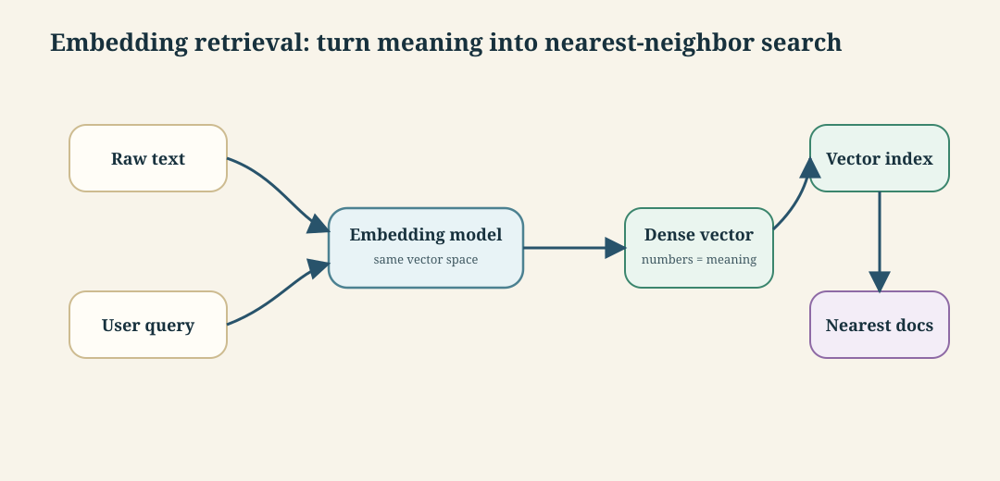

**Worked example** — Suppose the query is `"reset my password"` and the store contains three snippets:

| Text | Meaning match | Why |
|---|---:|---|
| `"change forgotten password"` | high | different words, same intent |
| `"delete account"` | medium | account-related but different action |
| `"weather in Hyderabad"` | low | unrelated |

Keyword search may miss `"change forgotten password"` if it expects the exact word `"reset"`. Embeddings can still retrieve it because the semantic intent is close.

**Tradeoff / when NOT to use** — Embeddings are weak for exact identifiers, codes, invoice numbers, legal clauses, and rare proper nouns. If the user searches `"INC-48291"` or `"Section 14.2(b)"`, keyword or metadata filtering should lead; semantic similarity can follow.

---

### 2. Encoder models and contextual embeddings

**Intuition** — Encoder models are good embedding machines because they read the entire input at once. That bidirectional view lets them represent meaning in context.

The key word is **contextual**: the vector for `"bank"` should change depending on whether the sentence mentions a river or an account.

**Mechanism** — An encoder transformer uses self-attention so every token can look at every other token in the input. The final token vectors are not just word meanings; they are word-in-sentence meanings.

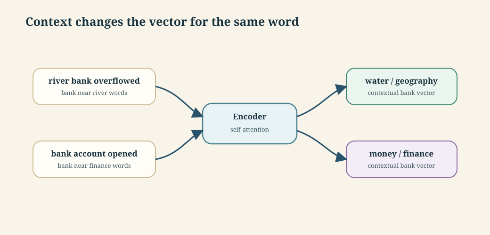

For a token sequence `X`, an attention layer computes:

```text
Q = X W_Q
K = X W_K
V = X W_V
Attention(Q,K,V) = softmax(QK^T / sqrt(d_k)) V
```

Plain language first: `QK^T` asks "which other tokens matter to this token?", softmax turns those scores into attention weights, and multiplying by `V` blends useful information from the other tokens.

**Worked example** — In `"the bank was closed because the river overflowed"`, self-attention lets `"bank"` attend to `"river"` and `"overflowed"`, pulling its representation toward geography. In `"the bank account was closed"`, `"bank"` attends to `"account"`, pulling the representation toward finance.

**Tradeoff / when NOT to use** — Encoder embeddings are ideal for understanding and search, but they are not the natural architecture for open-ended generation. If the task is "write the answer token by token", decoder-only LLMs are the standard choice.

---

### 3. Encoder vs decoder vs encoder-decoder

**Intuition** — The architecture decides what kind of task feels natural. Encoders understand, decoders generate, and encoder-decoders translate or transform one sequence into another.

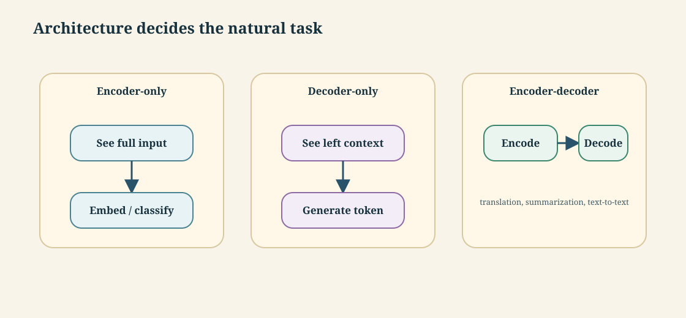

**Mechanism** — The masking pattern is the difference:

| Architecture | Context view | Best at | Weak at |
|---|---|---|---|
| Encoder-only | Bidirectional: sees the whole input | embeddings, classification, NER, semantic search | free-form generation |
| Decoder-only | Causal: sees previous tokens only | chat, code, instruction following, generation | pure embedding quality unless specially trained |
| Encoder-decoder | encoder sees source; decoder generates target | translation, summarization, text-to-text conversion | heavier architecture when one side is enough |

**Worked example** — For sentiment analysis on `"The food was slow but excellent"`, an encoder can see both `"slow"` and `"excellent"` before deciding. For chatbot response generation, a decoder predicts one token at a time. For translation, an encoder reads the English sentence and a decoder writes the Hindi sentence while attending to the encoded source.

**Tradeoff / when NOT to use** — Do not force one architecture onto every problem. Using a decoder-only chat model as an embedding model can work if it is trained for embeddings, but a purpose-built encoder embedding model is usually cheaper, faster, and easier to index.

> ***Going deeper*** *— is "decoder-only is weaker at understanding tasks" still true once you fine-tune it? A 2025 study puts a number on it. Borodach et al., "Decoders Laugh as Loud as Encoders" (2025) — outside this course's reading list, included as direct evidence for the tradeoff above — fine-tuned a decoder (GPT-4o) and several encoders on the same task: classifying text into six categories (five humor types plus "not a joke").*
>
> 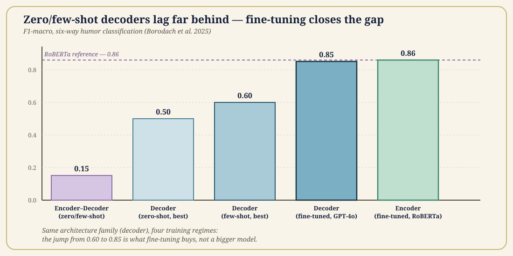
>
> *The chart is the whole finding: every decoder tested **without** fine-tuning — zero-shot or with a few examples in the prompt — scored far below the best encoder, topping out around 0.60 F1-macro even for GPT-4. The same architecture, fine-tuned, jumped to **0.852** — statistically indistinguishable (Welch's t-test) from the best fine-tuned encoder, RoBERTa, at **0.857**. Worth noticing too: the encoder-**decoder** models tested (BART, Flan-T5, zero/few-shot only) did *worse* than the decoder-only models at the same shot count — a third data point, not just two, and the weakest of the three families here.*
>
> *This sharpens rather than overturns the tradeoff above: a decoder-only model's weakness at understanding-style tasks reads as a **cost** — it needs fine-tuning, and fine-tuning a large decoder is heavier than fine-tuning a purpose-built encoder — not a **final-accuracy ceiling**. "Purpose-built encoder is cheaper, faster, easier to index" still holds; "decoder-only can't match it" does not, once fine-tuning is on the table. ⚠️ One caveat the paper is upfront about: this is a small dataset (1,392 examples), so treat the specific numbers as directional, not definitive.*

---

### 4. BERT-style embedding pipeline

**Intuition** — A sentence embedding is not produced in one magic step. It is built through tokenization, lookup, positional addition, transformer layers, and pooling.

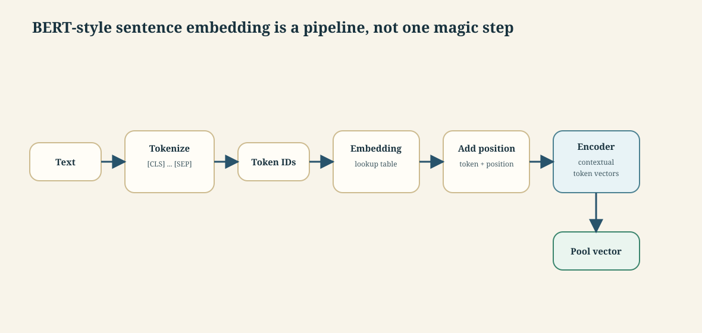

**Mechanism** — For `"Machine learning is fascinating"` in a BERT-like encoder:

| Step | What happens | Output shape idea |
|---|---|---|
| 1 | Add `[CLS]` at the start and `[SEP]` at the end | 6 tokens |
| 2 | Convert tokens to IDs | `[101, 8394, 4083, 2003, 17117, 102]` |
| 3 | Look up token embeddings | 6 vectors, each 768-dim |
| 4 | Add positional embeddings | 6 input vectors, each 768-dim |
| 5 | Run 12 transformer layers | 6 contextual vectors |
| 6 | Pool token vectors | 1 sentence vector |

Token embeddings are static at lookup time: the same token ID selects the same row. Context appears only after self-attention layers rewrite the vectors.

**Worked example** — Position addition is elementwise:

```text
token embedding      [0.23, -0.15, 0.89]
position embedding   [0.02,  0.03, 0.01]
input embedding      [0.25, -0.12, 0.90]
```

That input vector now carries both token identity and position.

**Tradeoff / when NOT to use** — BERT-style encoders are excellent for medium-length text, but context length can be short for long documents. If a document exceeds the embedding model's context window, chunk it carefully instead of truncating silently.

---

### 5. Pooling strategies

**Intuition** — The encoder outputs one vector per token, but search needs one vector for the whole sentence or chunk. Pooling compresses many token vectors into one vector.

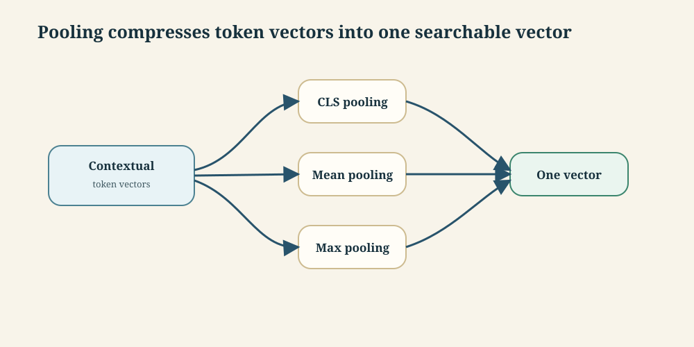

**Mechanism** —

| Pooling | Formula | Best fit |
|---|---|---|
| CLS pooling | `v = h_[CLS]` | classification, sentiment, NLI |
| Mean pooling | `v = (1/n) sum_i h_i` | semantic similarity, search, RAG |
| Max pooling | `v_j = max(h_1j, ..., h_nj)` | some retrieval/classification setups |

**Worked example** — Three 2D token vectors:

```text
h1 = [1, 4]
h2 = [3, 2]
h3 = [5, 0]

mean pooling = [(1+3+5)/3, (4+2+0)/3] = [3, 2]
max pooling  = [max(1,3,5), max(4,2,0)] = [5, 4]
```

**Tradeoff / when NOT to use** — CLS pooling is convenient but not automatically best for retrieval. For sentence search and RAG, mean pooling often performs better because it uses all token outputs instead of trusting one summary token.

**Use case — a ranking bug traced to pooling.** A team dropped a general-purpose BERT checkpoint into a FAQ search box and got near-random results: obviously related questions didn't rank near each other. The checkpoint's default output was the `[CLS]` vector, trained for next-sentence prediction, not similarity — so the embedding model wasn't bad, the pooling choice was wrong. Switching the same checkpoint to mean pooling over all token vectors fixed the ranking with no retraining.

---

### 6. Embedding model selection

**Intuition** — An embedding model is a production component, not a generic utility. Dimension, context window, language coverage, cost, and latency decide whether search works well.

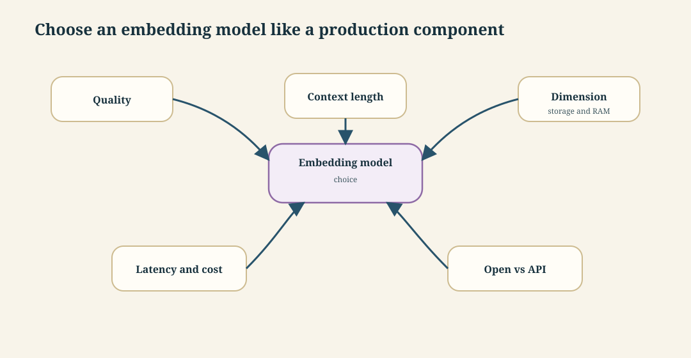

**Mechanism** — Common decision factors:

| Factor | Why it matters |
|---|---|
| Dimension | Larger vectors can carry more signal but cost more storage, RAM, and compute |
| Context window | Long documents need either long-context embedding models or careful chunking |
| Training objective | Contrastive/retrieval training is better for search than generic language modeling |
| Deployment type | API is simpler; open model gives control, privacy, and batch economics |
| Domain/language | General English models may underperform on legal, medical, code, or multilingual corpora |

**Worked example** — For a small internal FAQ, a 768- or 1024-dim open embedding model is enough. For long policy documents with sections over 1000 tokens, choose a longer-context model or chunk by headings. For sensitive customer data, local/open deployment may be preferable even if an API model scores slightly higher.

**Tradeoff / when NOT to use** — Do not chase the largest dimension blindly. A 4096-dim vector can improve quality, but if it doubles RAM and slows HNSW traversal without measurable recall gain on your data, a smaller model wins.

---

### 7. How embedding models are trained

**Intuition** — Embedding quality comes from the training objective. The model must learn that related texts should be close and unrelated texts should be far.

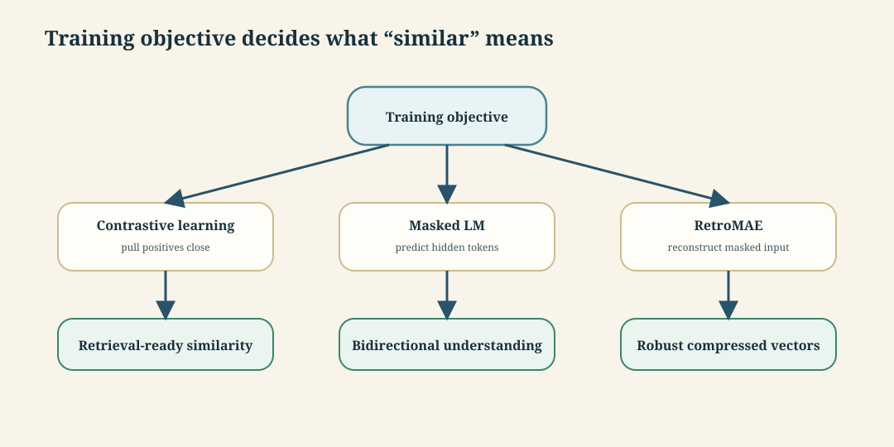

**Mechanism** —

| Objective | Core idea | Strength | Main risk |
|---|---|---|---|
| Contrastive learning | Pull positive pairs close; push negatives far | directly trains semantic similarity | needs good negatives |
| Masked language modeling | Hide tokens and predict them from context | strong bidirectional understanding | not optimized for retrieval by itself |
| RetroMAE | reconstruct heavily masked input through encoder/decoder | compact retrieval-oriented representations | more complex training |

Contrastive loss for an anchor `a`, positive `p`, and negatives `n`:

```text
loss = -log( exp(sim(a,p)) / sum exp(sim(a,n_i)) )
```

Plain language: reward the positive pair for scoring high, and punish it if negatives score nearly as high.

**Worked example** — Anchor: `"The cat sat on the mat"`. Positive: `"A feline rested on the rug"`. Negative: `"How to bake chocolate cookies"`. A good embedding model makes the anchor-positive similarity high and the anchor-negative similarity low.

**Tradeoff / when NOT to use** — Contrastive training is powerful but sensitive to negative sampling. If the "negative" is actually relevant, the model learns the wrong boundary. That is why retrieval datasets need careful construction and why hard-negative mining must be checked, not blindly trusted.

---

## Part 2 · Similarity search

*Once text becomes vectors, retrieval becomes a measurement problem: how close is the query vector to each candidate vector?*

### 8. Vector similarity metrics

**Intuition** — Similarity metrics define what "near" means. Cosine cares about direction, Euclidean distance cares about physical distance, and dot product combines direction with magnitude unless vectors are normalized.

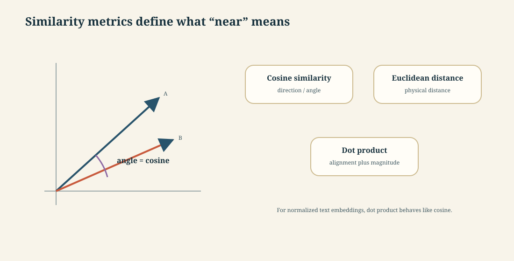

**Mechanism** —

| Metric | Formula | High value means |
|---|---|---|
| Cosine similarity | `cos(A,B) = (A dot B) / (||A|| ||B||)` | more similar direction |
| Euclidean distance | `d(A,B) = sqrt(sum_i (A_i - B_i)^2)` | more different, because distance is larger |
| Dot product | `A dot B = sum_i A_i B_i` | stronger alignment and/or larger magnitude |

If vectors are normalized so `||A|| = ||B|| = 1`, dot product equals cosine similarity.

**Worked example** — Let `A = [3,4]`, `B = [4,3]`, and `C = [-4,3]`.

```text
A dot B = 3*4 + 4*3 = 24
||A|| = 5, ||B|| = 5
cos(A,B) = 24 / 25 = 0.96
L2(A,B) = sqrt((3-4)^2 + (4-3)^2) = sqrt(2) = 1.414

A dot C = 3*(-4) + 4*3 = 0
cos(A,C) = 0 / 25 = 0
L2(A,C) = sqrt((3+4)^2 + (4-3)^2) = sqrt(50) = 7.071
```

So `B` is very close to `A`; `C` is much farther and orthogonal by cosine.

**Tradeoff / when NOT to use** — Cosine is usually safer for text because it ignores vector length. Dot product is fast and common in vector DBs, but only behaves like cosine if embeddings are normalized or the model was trained for dot-product scoring.

---

### 9. Linear scan and the computational wall

**Intuition** — Exact nearest-neighbor search is simple: compare the query with every stored vector. It also becomes impossible at production scale.

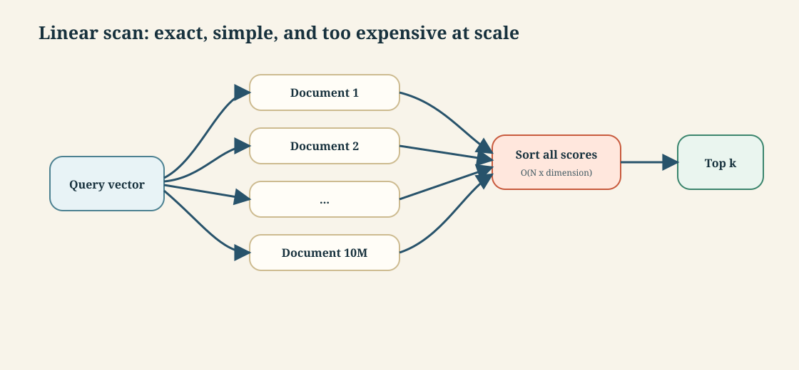

**Mechanism** — Linear scan cost is:

```text
operations per query = number_of_vectors * vector_dimension
```

For 10 million vectors of dimension 768:

```text
10,000,000 * 768 = 7,680,000,000 multiply-add operations
```

At 1 billion operations per second, that is about 7.68 seconds per query. At 100 queries per second, that implies about 768 CPU-core seconds per second of traffic.

**Worked example** — If one query over 10M vectors takes 7.68 seconds on one CPU core, then serving 100 simultaneous queries per second requires:

```text
7.68 seconds/query * 100 queries/second = 768 cores
```

That is before network overhead, filters, reranking (reordering the top candidates with a slower, more precise model), and the LLM call.

**Tradeoff / when NOT to use** — Linear scan is fine for tiny collections, offline evaluation, and verifying ANN recall. It is not the serving strategy for millions of vectors unless the hardware is specialized and the workload justifies brute force.

---

### 10. ANN and vector indexing

**Intuition** — Approximate Nearest Neighbor search avoids checking every vector. It accepts "close enough" top-k results in exchange for large speedups.

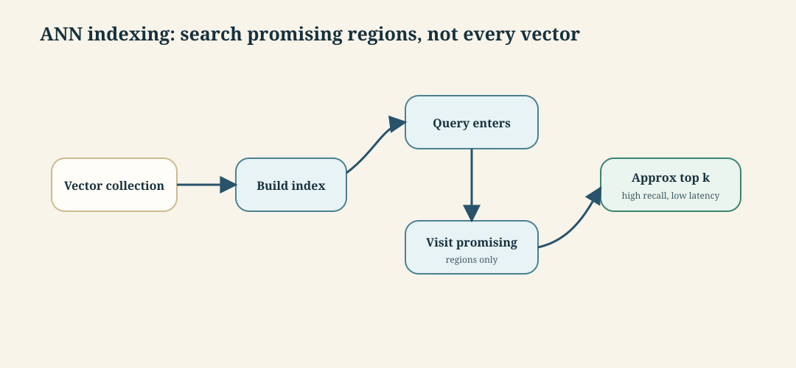

**Mechanism** — ANN indexes structure the vector space so the query can skip most candidates. Three common strategies:

| Strategy | Example | How it works | Strength | Weakness |
|---|---|---|---|---|
| Graph-based | HNSW | connect nearby vectors in a navigable graph | high recall, fast search, no training | memory-heavy |
| Partition-based | IVF | cluster vectors; search selected clusters | scalable and tunable | needs training; sensitive to cluster count |
| Compression-based | PQ | compress vectors into compact codes | huge memory savings | lower recall; more approximation |

**Worked example** — For a RAG FAQ with 10M chunks, exact scan might take seconds. HNSW can return a high-quality approximate top-10 in milliseconds because it walks through graph links instead of scoring all 10M vectors.

**Tradeoff / when NOT to use** — ANN is a latency-recall tradeoff (recall here means the fraction of the true nearest neighbors the approximate search actually returns). If the collection is small or the top-1 result must be mathematically exact, brute force may be safer. In RAG, approximate recall of 95-99% is usually acceptable because the LLM answer is already probabilistic and a reranker can clean up the candidate set.

---

### 11. HNSW: Hierarchical Navigable Small World

**Intuition** — HNSW is like a multi-level road network for vectors. Top layers are highways with long jumps; bottom layers are local streets containing all points.

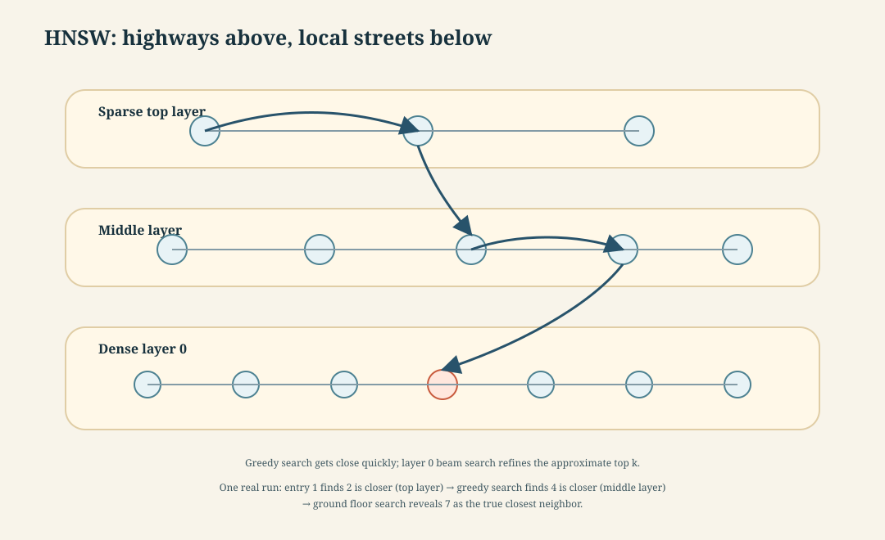

**Mechanism** — HNSW stores vectors as graph nodes. Edges connect nearby nodes. Search starts at a high sparse layer, greedily moves closer to the query, then descends layer by layer until the dense base layer.

Important knobs:

| Parameter | Meaning | Raising it does |
|---|---|---|
| `M` | max connections per node/layer | improves recall, increases memory and insert cost |
| `ef_construction` | candidate list during index build | better index quality, slower build |
| `ef_search` | candidate list during query | better recall, slower query |

**Worked example** — With 768-dim float32 vectors and `M=16`:

```text
raw vector bytes = 768 * 4 = 3,072 bytes
connection bytes approx = 16 * 4 = 64 bytes per layer-like average
rough per-vector storage = about 3,136 bytes before broader graph overhead
```

At 1M vectors, raw vectors alone are about 3.07 GB decimal. Production HNSW often needs roughly 1.5-2.0x raw vector memory once graph overhead and metadata are included.

**Tradeoff / when NOT to use** — HNSW is a strong default up to large but memory-manageable datasets. If memory is the binding constraint at hundreds of millions or billions of vectors, IVF+PQ or another compressed/partitioned setup may beat HNSW even with lower recall.

---

## Part 3 · Keyword, dense and hybrid retrieval

*Dense vectors retrieve by meaning. Keyword retrieval retrieves by exact lexical evidence. Production systems usually need both.*

### 12. Semantic search vs keyword search

**Intuition** — Semantic search answers "what means the same thing?" Keyword search answers "what contains the words or terms?" They fail differently, so hybrid retrieval combines them.

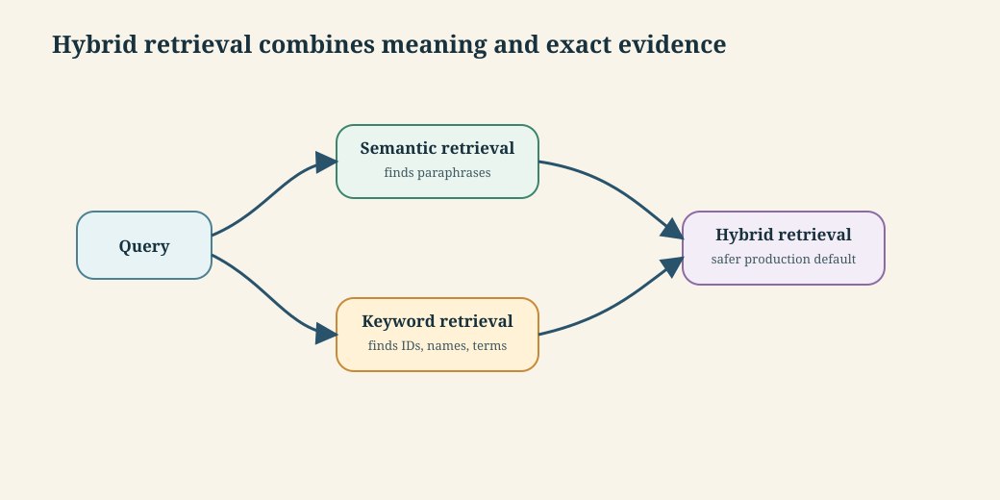

**Mechanism** —

| Retrieval type | Representation | Best for | Failure mode |
|---|---|---|---|
| Keyword / sparse | term counts, BM25-style weighting | names, IDs, exact phrases, rare terms | misses paraphrases |
| Dense / semantic | neural embeddings | synonyms, concepts, natural-language questions | can blur exact facts |
| Hybrid | sparse + dense + fusion | production RAG | more moving parts |

**Worked example** — Query: `"laptop reimbursement policy"`.

| Document | Keyword result | Dense result |
|---|---|---|
| `"employee device expense rules"` | may miss: no laptop/reimbursement words | likely match |
| `"laptop serial number inventory"` | may match: laptop keyword | likely demote |
| `"reimbursement form LAP-2026"` | likely match exact term/code | likely match if context is enough |

**Tradeoff / when NOT to use** — Dense-only search is risky for compliance and support systems where exact product names, ticket IDs, SKUs, or policy clauses matter. Keyword-only search is risky when users describe the idea with different words from the document.

---

### 13. BM25

**Intuition** — BM25 is the strong classical baseline for keyword search. It rewards documents that contain query terms, especially rare terms, while avoiding unlimited reward for repeated words.


**Mechanism** — BM25 combines:

| Component | Plain meaning |
|---|---|
| term frequency | a term appearing more often is useful, but saturates |
| inverse document frequency | rare terms matter more than common terms |
| length normalization | long documents should not win just because they contain more words |

**Worked example** — Query: `"HNSW ef_search"`.

BM25 strongly rewards a document containing the exact rare term `"ef_search"`. A dense retriever may understand the general HNSW tuning topic, but exact-match evidence is important here because `ef_search` is a parameter name.

**Tradeoff / when NOT to use** — BM25 struggles with vocabulary mismatch. A user asking `"how do I make vector lookup faster?"` may need a document titled `"ANN indexing and HNSW tuning"`; semantic retrieval is more likely to bridge that wording gap.

---

### 14. Dense Passage Retrieval

**Intuition** — Dense Passage Retrieval uses two encoders: one embeds the question, one embeds passages. Retrieval is then maximum similarity between the query vector and passage vectors.

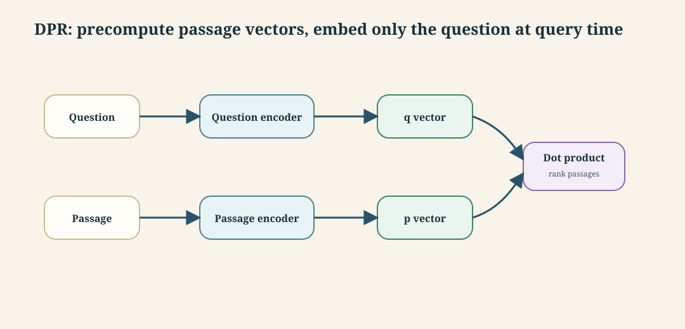

**Mechanism** — DPR is a dual-encoder architecture:

```text
q = Encoder_question(question)
p = Encoder_passage(passage)
score(question, passage) = q dot p
```

The passage vectors can be precomputed and indexed. At query time, only the question is embedded; the index retrieves high-scoring passage vectors.

**Worked example** — Question: `"Who wrote Pride and Prejudice?"`.

Positive passage: `"Pride and Prejudice is a novel by Jane Austen..."`.

Negative passage: `"Pride and Prejudice is a 2005 romantic drama film..."`.

Training pushes the question vector closer to the answer-bearing passage and farther from negatives. At inference, the nearest passage becomes the context for the answer generator.

**Tradeoff / when NOT to use** — DPR-style dense retrieval is excellent for semantic question answering, but it can underperform on exact lexical constraints and fresh domain terminology unless the embedding model is trained or adapted for that domain. Hybrid retrieval is the safer production default.

---

### 15. Reciprocal Rank Fusion

**Intuition** — RRF combines rankings, not raw scores. That matters because BM25 scores and dense similarity scores live on different scales.

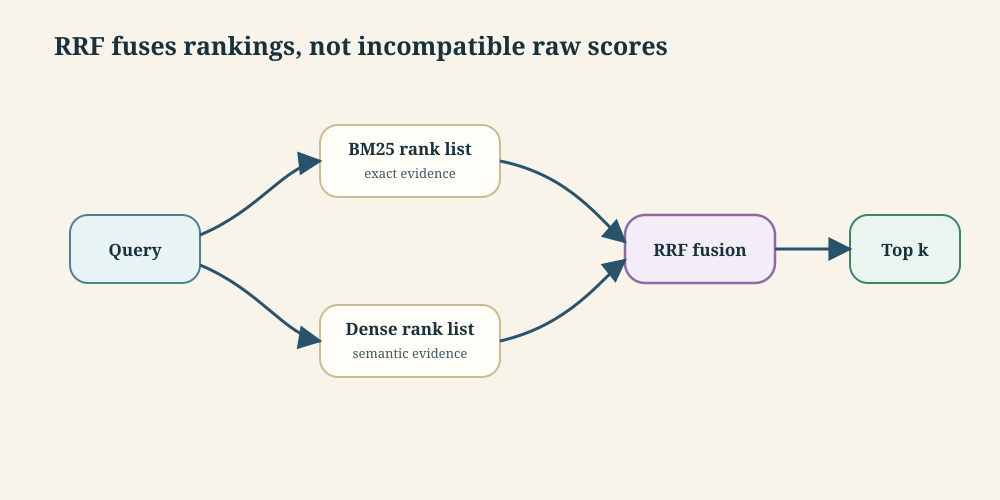

**Mechanism** — RRF gives each document a score based on where it appears in each ranking:

```text
RRF(doc) = sum_over_rankers 1 / (k + rank(doc))
```

`k` is a constant, often around 60, that softens the effect of rank position. A document appearing reasonably high in both lists often beats a document that appears high in only one.

**Worked example** — Use `k = 60`.

| Document | BM25 rank | Dense rank | RRF score |
|---|---:|---:|---:|
| A | 1 | 10 | `1/61 + 1/70 = 0.0307` |
| B | 5 | 3 | `1/65 + 1/63 = 0.0313` |
| C | 2 | not in top list | `1/62 = 0.0161` |

Document B wins because it is strong in both systems.

**Tradeoff / when NOT to use** — RRF is robust and simple, but it ignores score margins. If a dense retriever is overwhelmingly confident and BM25 is only weakly matching, rank-only fusion can over-promote the keyword result. Production systems often follow hybrid retrieval with reranking.

---

### 16. Vector database architecture

**Intuition** — A vector database is not just a table with vectors. It is a retrieval system around embeddings, indexes, metadata filters, update pipelines, and observability.

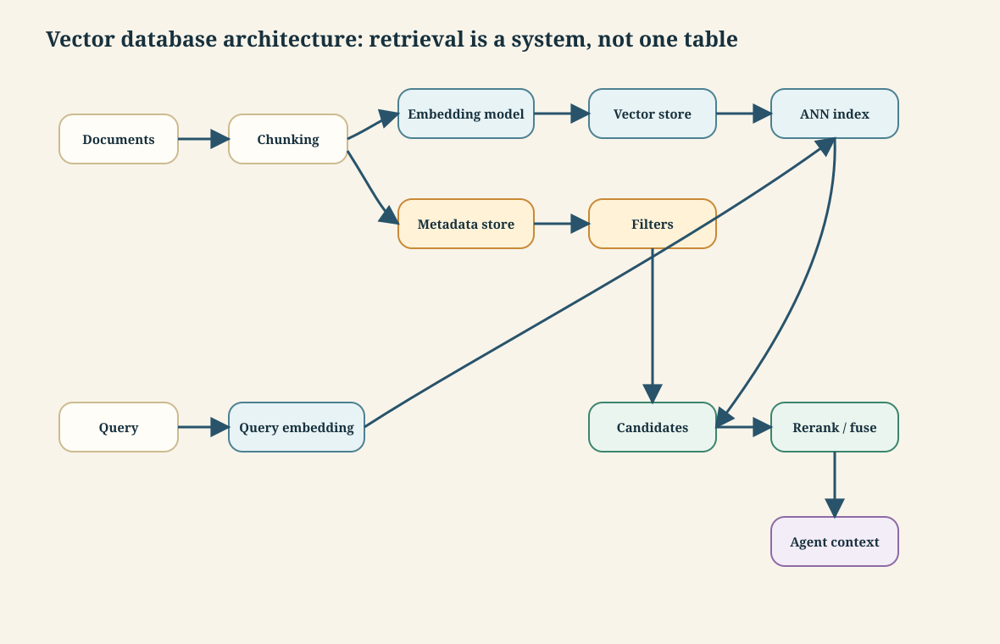

**Mechanism** — A production retrieval layer usually includes:

| Component | Job |
|---|---|
| chunker | splits documents into retrievable passages |
| embedding service | converts chunks and queries to vectors |
| vector index | serves fast ANN search |
| metadata filters | restrict by tenant, date, access control, document type |
| sparse index | BM25/keyword retrieval |
| fusion/reranker | combines and improves candidate ordering |
| monitoring | tracks recall, latency, cost, freshness, and failed searches |

**Worked example** — In an HR assistant, a query `"Can I claim a monitor for work from home?"` should search only documents the employee is allowed to see, retrieve semantically related policy chunks, preserve exact policy-code matches, and pass the top few chunks to the LLM with citations or source IDs.

**Tradeoff / when NOT to use** — A vector database does not automatically fix bad retrieval. If chunks are too large, metadata is missing, embeddings are mismatched, or access filters are bolted on after search, the system can return plausible but unsafe context. For small, stable FAQ data, a simple keyword index plus curated answers may be easier to audit.

---

## Self-study / Lab / build

Build a tiny hybrid retriever on 10-20 short documents:

1. Create document chunks and metadata.
2. Compute simple embeddings with any local/API embedding model.
3. Implement cosine similarity in Python.
4. Implement a minimal BM25 search or use a small library.
5. Combine dense and BM25 rankings with RRF.
6. Print the top-5 results for queries that test paraphrase, exact ID, and mixed cases.

The lab lesson is not the library call; it is seeing which query fails under dense-only or keyword-only retrieval.

---

*Exam: this session is in scope for the **closed-book mid-sem** (L1-L8). Full evaluation, weights, dates and course logistics live once in [`521-master.md`](../521-master.md) — not repeated per session.*
