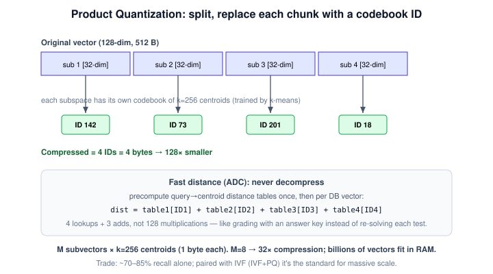
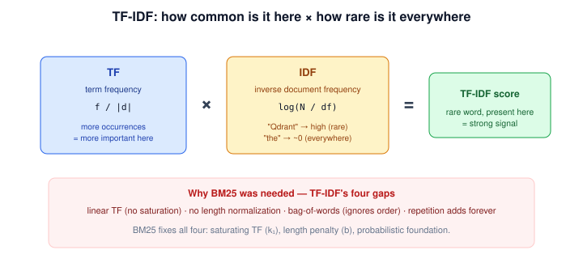
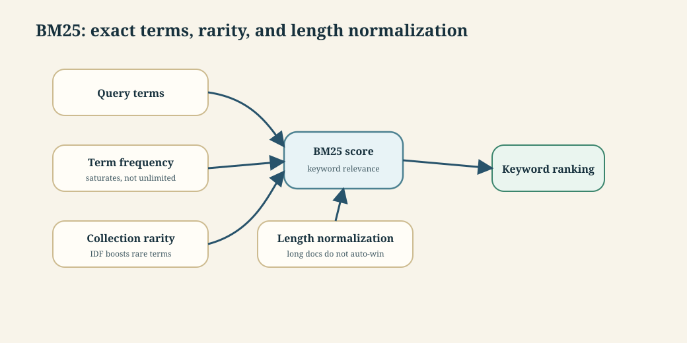
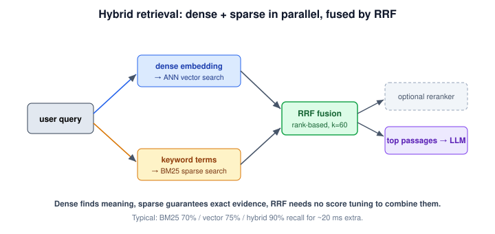

# Conversational AI · Session 03 · ANN Search & Hybrid Retrieval

*Learned 16 Aug 2026*

## Why this matters

Embeddings and an index give you *fast approximate* vector search — but two gaps remain before retrieval is production-ready: at billion scale even an index must be compressed to fit in memory, and pure vector search silently misses exact strings (IDs, codes, rare terms). This session closes both: the ANN compression family (IVF, Product Quantization) that shrinks the index, the sparse retrieval family (TF-IDF, BM25) that nails exact matches, and Reciprocal Rank Fusion that combines dense and sparse into one ranking. After it you should be able to size an IVF/PQ index, compute a BM25 score by hand, and explain why every serious RAG system is hybrid.

## Part 1 · ANN Indexing at Scale

*Graph indexes like HNSW are fast but memory-hungry; at billion scale, partition-based (IVF) and compression-based (PQ) indexes are what keep vectors in RAM.*

---

### 1. IVF: Inverted File Index

**Intuition** — Instead of comparing the query to every vector, IVF first sorts the whole dataset into neighbourhoods, then searches only the few neighbourhoods nearest the query. It is the library card-catalogue trick: don't read every book — go to the right shelf and scan only that shelf.

**Mechanism** — Two phases:

- *Build (offline).* Run k-means over a training sample to learn `nlist` coarse centroids; these carve vector space into Voronoi cells. Every vector is filed into an **inverted list** attached to its nearest centroid.
- *Search (query time).* Compare the query to all `nlist` centroids, pick the `nprobe` closest clusters, and scan only the vectors in those inverted lists, then return top-k.


**Worked example** — `nlist=3`, `nprobe=1`, 2-D vectors. Query `q=(5.0, 5.0)`; centroids C1(1.25, 1.00), C2(4.90, 5.25), C3(8.85, 1.15). Euclidean distances: C1 ≈ 5.48, **C2 ≈ 0.26**, C3 ≈ 5.44, so C2 is nearest. Scan only C2's list — v3 = (5.0, 5.1) at dist 0.10, v4 = (4.8, 5.4) at dist 0.45 — and return **v3**, having touched **2 of 6** vectors.

**Algorithm motivation** — *The problem:* brute force compares the query against all N vectors. *The fix:* pre-cluster once so a query visits only a handful of clusters. Complexity drops from O(N·D) to **O(K·D + N·D/K)** — rank K centroids, then scan one cluster of N/K vectors. For N=10M, K=100: 100 + 100,000 = 100,100 comparisons vs 10,000,000, about **100× faster**. *Everyday analogy:* a supermarket groups items into aisles; you walk to "dairy" instead of scanning every shelf in the store.

***In practice*** — Tuning knobs: `nlist` ≈ √N to N/1000 (sweet spot ~4√N; 1M vectors → ~1,000–4,000 clusters), and `nprobe` chosen at query time (1–5 → ~70–85% recall, very fast; 50–100 → ~95%+ recall, slower; typical 10–20). A k-means training phase over a 10K–100K sample precedes indexing.

**Tradeoff / when NOT to use** — A true nearest neighbour can sit just across a cluster boundary; with `nprobe=1` that cluster is never scanned and recall drops. Raising `nprobe` fixes it at more cost (exact search needs `nprobe=nlist`). IVF also needs training and is sensitive to cluster quality, so for small or highly dynamic datasets HNSW's no-training graph is easier to operate.

---

### 2. Product Quantization (PQ)

**Intuition** — PQ shrinks each vector by *divide and conquer*: chop it into a few short pieces and replace each piece with the ID of the closest entry in a small "codebook." A 512-byte vector becomes 4 bytes, so billions of vectors now fit in RAM.

**Mechanism** — Three steps:

1. *Train codebooks.* Split each D-dimensional vector into M subvectors; for each subvector position, run k-means to learn a codebook of k centroids (k=256 fits in one byte).
2. *Encode.* Replace each subvector with the ID (0–255) of its nearest centroid, so a vector becomes M one-byte codes.
3. *Fast distance (ADC — Asymmetric Distance Computation).* At query time, split the query, precompute a distance table from each query subvector to all 256 centroids, then a database vector's distance is just `table1[ID1] + table2[ID2] + ...` — a few lookups and adds, never decompressing anything.



**Worked example** — 5 vectors × 8 dims, M=2 (two 4-dim subspaces), k=2. Storage: original 5×8×4 = **160 B**; PQ codes 5×2×1 = 10 B plus codebooks 2×2×4×4 = 64 B, total **74 B**. The codebook is a fixed one-time cost, so at millions of vectors the compression approaches **32×** (float32 → 1 byte per code). An ADC query precomputes two small distance tables and sums lookups per vector, so vectors with codes `[0,0]` score ≈ 0.05 (closest) without any reconstruction.

**Algorithm motivation** — *The problem:* storing raw float32 vectors at billion scale needs terabytes of RAM, and a full distance is 128 multiplications per vector. *The fix:* quantize sub-pieces to bytes and replace multiplications with table lookups. *Everyday analogy:* grading exams with a pre-filled answer key — score each paper by looking up its answers, not re-solving every question.

***In practice*** — Parameters: M (8/16/32/64 — more subvectors give better accuracy but more bytes; M must divide D; 768-dim → M=96) and k (256 → 1 byte). M=8 → 8 bytes/vector (32× compression); M=64 → 64 bytes (4×, higher accuracy). PQ is usually paired with IVF (**IVF+PQ**): IVF narrows to a cluster, PQ makes each stored vector tiny.

**Tradeoff / when NOT to use** — Compression is lossy, so PQ alone lands at ~70–85% recall, too low when exact ordering matters and RAM is not the constraint. Use it when billions of vectors must fit in memory and ~90–95% recall (with IVF and re-ranking) is acceptable.

**ANN algorithms at a glance** — the strategies on the axes that decide a production choice:

| Algorithm | Search time | Memory | Build time | Recall |
|---|---|---|---|---|
| Linear scan | O(n·d) | O(n·d) | O(1) | 100% |
| HNSW | O(log n) | O(n·d) | O(n log n) | 95–99% |
| IVF | O((n/k)·d) | O(n·d) | O(n·d·i) | 90–95% |
| PQ | O(n·m) | O(n·m) | O(n·d·i) | 70–85% |
| IVF+PQ | O((n/k)·m) | O(n·m) | O(n·d·i) | 85–92% |
| HNSW+PQ | O(log n) | O(n·m) | O(n log n) | 90–96% |

HNSW trades memory for speed; IVF+PQ trades accuracy for compression; **HNSW+PQ** is a common production sweet spot. Widely used libraries: FAISS, ScaNN, ANNOY.

---

## Part 2 · Sparse Retrieval

*Dense search finds meaning; sparse search finds exact strings. This part builds the sparse half, from TF-IDF to BM25.*

### 3. Why sparse retrieval: where dense search fails

**Intuition** — Dense embeddings capture *meaning*, which is exactly why they stumble on *exact* things. Three failure modes recur in production, all cases where the surface string matters more than the semantics.

**Mechanism** —

- **Exact keyword matching.** "ERROR code 500" is smoothed by a dense model into "server error / something went wrong"; the document "Fix for error 500 in nginx" may not rank first because "error", "500", "nginx" are not semantically close in embedding space.
- **Rare / unique terms.** A part ID like `XR55-QW7`, unseen in training, gets a near-meaningless embedding, so vector search cannot match the exact string even when a document contains it.
- **Out-of-vocabulary words.** A token like `VijayawadaExpress123` is broken into sub-tokens (`Vijay`, `##aw`, `##ada`, `Express`, `123`) and blurred, wrecking the ranking.

| Aspect | Dense (embeddings) | Sparse (BM25) |
|---|---|---|
| Semantic understanding | ✓ excellent | ✗ none |
| Synonyms / paraphrases | ✓ handles well | ✗ misses |
| Exact keyword match | ✗ can miss | ✓ perfect |
| Rare / unique terms | ✗ out-of-vocabulary | ✓ high IDF captures |
| Numbers, codes, IDs | ✗ not in training | ✓ works perfectly |

**Worked example** — Query "AIMLCZG521 schedule". Dense retrieval ranks a generic "Course schedule for AI/ML" doc *above* "AIMLCZG521 timing" because it never learned the course code; BM25 scores the exact-ID match far higher and ranks it correctly.

**Tradeoff / when NOT to use** — This is not an argument against dense search, but for *both*. Sparse matches exact strings (IDs, codes, log lines, rare terms) that dense misses; dense matches paraphrases and concepts that sparse misses. The rest of this session builds the sparse half (TF-IDF, BM25) and then fuses the two with RRF.

---

### 4. TF-IDF: the foundation of sparse retrieval

**Intuition** — Before dense embeddings, keyword search scored a document by two commonsense signals: how *often* a query word appears in it (term frequency), and how *rare* that word is across the whole collection (inverse document frequency). A word that is frequent *here* but rare *everywhere* — a product code, say — is a strong signal; a word like "the" is worthless because it is everywhere.

**Mechanism** —

```text
TF(t,d)  = f / |d|          term count, normalized by document length
IDF(t)   = log(N / df)      N = total docs, df = docs containing t
TF-IDF   = TF(t,d) × IDF(t)
```



**Worked example** — Corpus of 1,000 docs; document "machine learning is a subset of machine learning" (8 terms); query "machine learning". "machine": TF = 2/8 = 0.25, IDF = ln(1000/400) = 0.916 → 0.229. "learning": TF = 2/8 = 0.25, IDF = ln(1000/300) = 1.204 → 0.301. Document score = 0.229 + 0.301 = **0.530**.

**Tradeoff / when NOT to use** — TF-IDF has four gaps: term frequency grows **linearly** (10 occurrences score 10×, no diminishing returns), **no length normalization** (long documents win just by being long), **bag-of-words** ("dog bites man" = "man bites dog"), and **no saturation**. These are exactly what BM25 fixes, so in practice BM25 replaces raw TF-IDF as the sparse baseline.

---

### 5. BM25

**Intuition** — BM25 is the strong classical baseline for keyword search. It rewards documents that contain query terms, especially rare terms, while avoiding unlimited reward for repeated words.



**Mechanism** — BM25 combines:

| Component | Plain meaning |
|---|---|
| term frequency | a query term appearing more often helps, but the gain saturates |
| inverse document frequency | rare terms matter more than common terms |
| length normalization | long documents should not win only because they contain more words |

**Worked example** — Query: `"HNSW ef_search"`. BM25 strongly rewards a document containing the exact rare term `ef_search`. A dense retriever may understand the general HNSW tuning topic, but exact-match evidence is important because `ef_search` is a parameter name.

**The BM25 formula** — BM25 keeps TF-IDF's two ideas and adds *saturation* and *length normalization*:

```text
score(Q,D) = Σᵢ IDF(qᵢ) · [ f(qᵢ,D)·(k₁+1) ] / [ f(qᵢ,D) + k₁·(1 − b + b·|D|/avgdl) ]
```

with a smoothed IDF = `log[(N − df + 0.5)/(df + 0.5) + 1]`. Two knobs: **k₁** (default 1.5, range 1.2–2.0) sets how fast term frequency saturates; **b** (default 0.75) sets the length penalty (0 = none, 1 = full). `avgdl` is the average document length in the collection.


**Saturation, in one line** — each extra occurrence of a term adds *less* than the previous one; the contribution flattens toward a ceiling of `(k₁+1)/(k₁·norm)`. Going from 1→2 occurrences helps a lot; 10→11 barely moves the score — like a smoke alarm, one beep already means "fire." This is the single biggest fix over TF-IDF, whose score just keeps climbing.

**Worked example — full BM25.** Same query "machine learning"; document of 12 terms with avgdl = 50; "machine" appears in 300 docs, "learning" in 400. IDF(machine) = ln(3.331) = 1.203, IDF(learning) = ln(2.499) = 0.916. norm = 1 − 0.75 + 0.75·(12/50) = 0.43. TF(machine, f=2) = 2·2.5 / (2 + 1.5·0.43) = 5.0/2.645 = 1.890; TF(learning, f=3) = 7.5/3.645 = 2.058. **BM25 = 1.203·1.890 + 0.916·2.058 = 4.159.**

**BM25 vs TF-IDF** — on the same document TF-IDF totals ≈ 0.57 while BM25 totals 4.159. The two scores live on different scales, so the number itself is not the point — the point is *why* BM25 ranks this short, focused document higher: length normalization rewards it for being shorter than average (12 vs 50 tokens), saturation stops the repeated "learning" from dominating, and the probabilistic foundation gives better ordering.

**Tradeoff / when NOT to use** — BM25 struggles with vocabulary mismatch. A user asking `"how do I make vector lookup faster?"` may need a document titled `"ANN indexing and HNSW tuning"`; semantic retrieval is more likely to bridge that wording gap.

---

## Part 3 · Hybrid Systems

*Hybrid search runs dense and sparse in parallel and fuses their rankings — the practical answer to the whole session.*

### 6. Reciprocal Rank Fusion

**Intuition** — RRF combines rankings, not raw scores. That matters because BM25 scores and dense similarity scores live on different scales.


**Mechanism** —

```text
RRF(doc) = sum_over_rankers 1 / (k + rank(doc))
```

`k` is often around 60. A document appearing reasonably high in both lists can beat a document that appears high in only one.

**Worked example** — Use `k = 60`.

| Document | BM25 rank | Dense rank | RRF score |
|---|---:|---:|---:|
| A | 1 | 10 | `1/61 + 1/70 = 0.0307` |
| B | 5 | 3 | `1/65 + 1/63 = 0.0313` |
| C | 2 | not in top list | `1/62 = 0.0161` |

Document B wins because it is strong in both systems.

**Tradeoff / when NOT to use** — RRF is robust and simple, but it ignores score margins. If dense retrieval is overwhelmingly confident and BM25 is only weakly matching, rank-only fusion can over-promote the keyword result. Production systems often follow hybrid retrieval with reranking.

**Why fuse ranks, not scores** — dense similarity is cosine in [0, 1]; BM25 is unbounded in [0, ∞). You cannot just add them, and normalizing is fragile (min-max is outlier-sensitive; z-score assumes a normal distribution). RRF sidesteps the whole problem by fusing **rank positions**, which make no assumption about score distributions.

**Why k ≈ 60** — an empirical finding from TREC evaluations. Without k the top rank dominates (1/1 = 1.0 vs 1/2 = 0.5, too steep a drop); k=60 gentles the curve (1/61 vs 1/62) so a document strong across *both* lists beats one that merely tops a single list. Smaller k emphasizes top ranks more aggressively; larger k gives more weight to lower ranks.

**Properties** — RRF is *score-agnostic* (uses only rank order), *bounded* (score ∈ [0, #rankings/k]), *symmetric* (all rankings weighted equally), *robust* (a poor ranking is outweighed by the others), and needs *no training* (only k). Documents ranking high in multiple systems get a natural consensus bonus.

---

### 7. Hybrid retrieval end-to-end

**Intuition** — Hybrid retrieval is the practical answer to the whole session: use semantic search for meaning, keyword search for exact evidence, ANN for speed, and fusion/reranking for final quality.



**Mechanism** — A typical flow:

```text
user query
  -> dense embedding -> ANN vector search
  -> keyword terms   -> BM25 sparse search
  -> RRF fusion
  -> optional reranker
  -> top passages to the LLM
```

**Worked example** — Query: `"policy for monitor reimbursement LAP-2026"`. Dense search can find `"work-from-home equipment expenses"` even without the exact wording. BM25 preserves `LAP-2026`. RRF promotes documents that satisfy both meaning and exact evidence.

**Tradeoff / when NOT to use** — Hybrid retrieval is overkill for tiny, stable, curated FAQ sets where exact approved answers already exist. For live document corpora with paraphrases, product codes, policy clauses, and changing terminology, hybrid is usually worth the extra moving parts.

**Performance, typically** — the extra fusion stage earns its keep:

| Pipeline | Latency | Recall | Precision |
|---|---|---|---|
| BM25 only | ~20 ms | 70% | 60% |
| Vector only | ~50 ms | 75% | 65% |
| Hybrid (BM25 + Vector + RRF) | ~70 ms | 90% | 75% |

Hybrid buys a large recall and precision jump for about 20 ms: BM25 alone misses semantic matches, vector alone misses exact keywords, and RRF fuses them with no tuning.

---

## Self-study / Lab / build

This session maps directly to **Lab 3: Hybrid Search Implementation**. Build a tiny hybrid retriever on 10–20 short documents and watch where single-method retrieval fails:

1. Create document chunks and metadata.
2. Compute dense embeddings with any local/API embedding model; implement cosine similarity.
3. Implement a minimal BM25 (or a small library) for sparse scoring.
4. Fuse the dense and BM25 rankings with RRF (k=60).
5. Print the top-5 for queries that test paraphrase (dense wins), exact ID / error code (sparse wins), and mixed cases (hybrid wins).

The lesson is not the library call; it is seeing which query fails under dense-only or keyword-only retrieval, and how RRF recovers it. Reproduce the worked numbers by hand: IVF (2 of 6 vectors scanned), PQ (160 B → 74 B), BM25 (4.159), RRF (Doc B 0.0313 edges Doc A 0.0307).

---

*Exam: this session is in scope for the **closed-book mid-sem** (contact sessions 1–8) and the **open-book comprehensive**. Full evaluation, weights, dates and course logistics live once in [`521-master.md`](../521-master.md) — not repeated per session.*