# Conversational AI · Session 04 · Model Landscape & Cost Engineering

*Learned 23 Aug 2026*

## Why this matters

Every production agent starts with two decisions that set its cost and its ceiling: *which model* answers each request, and *how* that model is served. This session maps the 2025/2026 model landscape — Dense Transformers, Mixture-of-Experts, Small Language Models, and State Space Models — then quantifies the levers that move cost by 10–100×: quantization, GPU-memory budgeting (weights + KV-cache + activations), prompt caching, model routing, and the self-host-vs-API break-even. After it you should be able to size the VRAM for any model configuration, pick a precision that trades memory for quality knowingly, and design a routing + caching stack that cuts a bill by 70–90% without dropping answer quality.

**Running example:** an enterprise customer-support bot serving ~1M requests/month, whose flat GPT-4o bill we drive down step by step.

---

## Part 1 · Model Landscape: LLMs, MoE, SLMs, SSMs Comparison

### 1. The production landscape at a glance

**Intuition** — Four model *families* now share the production floor, and they differ less in "how smart" than in *what you pay per unit of smart*. Picture a vehicle fleet: a Dense Transformer is the long-haul truck (carries anything, burns the most fuel), a Mixture-of-Experts is a truck that only fires the cylinders it needs, a Small Language Model is a scooter (cheap, nimble, limited load), and a State Space Model is a freight train (unbeatable over very long distances, clumsy for quick errands).

**Mechanism** — The families are separated by four axes: how many parameters are *active* per token (which sets FLOP cost), the context window, benchmark quality (MMLU is the common yardstick), and price per million tokens.

| Architecture | Key models (2025) | Context | MMLU | Cost / 1M tok | Best use |
|---|---|---|---|---|---|
| Dense Transformer | GPT-4o, Claude 3.7 Sonnet, Llama 3.3 70B, Gemini 2.0 | 128K–1M | 86–90% | $3–$30 | Complex reasoning, multimodal |
| Mixture-of-Experts | DeepSeek-V3, Mixtral 8×22B, Qwen2-57B-A14B, Jamba-1.5 | 32K–256K | 80–88% | $0.3–$2 | Cost-effective at scale |
| Small LMs (1–14B) | Phi-4, Gemma 3, Qwen2.5-7B, Llama 3.2-3B | 4K–128K | 72–85% | $0.05–$0.3 | Routing, edge, classification |
| State Space Models | Mamba-2, RWKV-6, Jamba-1.5 (hybrid) | 1M+ | 68–75% | Variable | Ultra-long-context tasks |

The 2026 projection keeps the same four rows and shifts every number in one direction: context windows stretch (Dense 256K–2M), MMLU climbs into the 90s, Small-LM pricing collapses toward $0.001–$0.05, and hybrids (Jamba 2.0, Liquid-2) push linear-scaling context past 1M. The projected 2026 line-up: GPT-5, Claude 4, Llama 4, Gemini 3 (Dense); DeepSeek-V4, Qwen3-MoE, Grok-2, Mixtral 8×70B (MoE); Phi-5, Gemma 4 (SLM); Mamba-3, RWKV-7, Jamba 2.0, Liquid-2 (SSM/hybrid). The *shape* of the tradeoff is stable; the absolute numbers drift cheaper and longer each year.

**Worked example** — Route by row, not by habit. A support bot getting "reset my password" (trivial) down a Small-LM lane at ~$0.1/1M and "reconcile these three conflicting invoices" (hard) down a Dense lane at ~$10/1M pays the truck price only for the ~5% of traffic that needs a truck.

**Tradeoff / when NOT to use** — Do not read the table top-to-bottom as "best to worst." A Dense Transformer on high-volume intent-classification is pure waste; a State Space Model on multi-hop retrieval underperforms a same-size Dense model by 5–10 MMLU points. The right row is the *cheapest* one that clears the task's quality bar — which is why the landscape ends in a router, not a single winner.

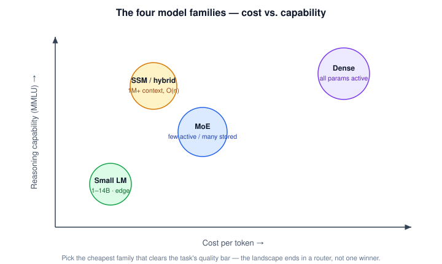

---

### 2. Dense Transformer Models

**Intuition** — "Dense" means *every* parameter fires for *every* token. Nothing is skipped, so quality is consistent and predictable — and you pay the full FLOP bill on every token, cheap or hard.

**Mechanism** — A stack of transformer blocks (attention + feed-forward), all weights active per forward pass. Quality tracks parameter count; cost tracks it too. The four flagships each stake a different corner:

| Model | Context | MMLU | What it's for |
|---|---|---|---|
| GPT-4o (OpenAI) | 128K | 88.7% | Multimodal (text+vision+audio), native tool-use; Batch API cuts cost 50% |
| Claude 3.7 Sonnet (Anthropic) | 200K | 90.1% | Extended Thinking mode (+32K chain-of-thought tokens); best-in-class coding/analysis |
| Llama 3.3 70B (Meta) | 128K | 86.0% | Open-weights; self-hostable on vLLM at ~$0.10–0.30/1M tokens |
| Gemini 2.0 Flash (Google) | 1M | 87.0% | Cheapest input at $0.075/1M; native grounding via Search |

**Worked example** — Sizing Llama 3.3 70B for self-hosting: at BF16 (2 bytes/param), weights alone are 70B × 2 = **140 GB**, which does not fit one 80 GB H100 — so single-model inference typically needs **2× H100 80GB**. That one number is why quantization (Part 2) is not optional at 70B.

**Tradeoff / when NOT to use** — All-parameters-active is exactly the wrong shape for high request volumes of easy work. When 80% of traffic is classification and slot-filling, a Dense flagship burns 10–20× the necessary compute per token; that traffic belongs on a Small LM.

---

### 3. Mixture of Experts

**Intuition** — Keep the truck's total capacity, but only fire the two cylinders each token needs. An MoE swaps the dense feed-forward sublayer in each transformer block for a *bank of expert networks* plus a *router* that picks a few experts per token. Total knowledge stays huge; compute per token stays small.

**Mechanism** — Inside each block the router scores the token against every expert and keeps the top-k (usually k=2); only those experts run, and their outputs are blended:

```
router_logits = W_router · x
top_k         = TopK(router_logits, k=2)
weights       = softmax(top_k_logits)
output        = Σ wᵢ · Expertᵢ(x)
```

Everything else in the block — multi-head attention, the add-&-norm layers, residuals — is unchanged; the experts replace only the feed-forward network.

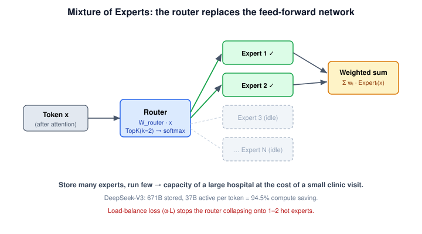

**Worked example** — DeepSeek-V3 holds **671B** total parameters (256 experts) but the router activates only **37B** per token. Compute saving = 1 − 37/671 = **94.5%**, and its API lands near ~5% of a GPT-4o-equivalent bill.

| Model | Total | Active | Saving = 1 − Active/Total |
|---|---|---|---|
| DeepSeek-V3 | 671B | 37B | 94.5% |
| Mixtral 8×22B | 141B | 39B | 72.3% |
| Qwen2-57B-A14B | 57B | 14B | 75.4% |
| Jamba-1.5 Large | 398B | 52B | 86.9% |

**Algorithm motivation** — *The problem:* scaling a Dense model means every extra parameter fires on every token, so cost scales with capacity. *The fix:* decouple *stored* capacity from *active* capacity — store many experts, run few. *Everyday analogy:* a hospital keeps 30 specialists on staff but sends each patient to just the two whose expertise fits; you get the depth of a large hospital at the cost of a small clinic visit.

**The load-balancing catch** — Left alone, the router plays favourites: in ~15% of naive training runs it collapses onto 1–2 "hot" experts and the rest never learn — a failure mode called **expert collapse**. The fix is an auxiliary load-balance loss added to the training objective, `L_aux = α · load_balance_loss`, which rewards spreading tokens evenly across experts (DeepSeek-V3 uses α = 0.001). This idea traces to Shazeer et al.'s sparsely-gated MoE (2017).

**Tradeoff / when NOT to use** — MoE saves *compute*, not *memory*: all 671B parameters must sit in VRAM simultaneously (~8× H100 for DeepSeek-V3), so it's wrong for memory-constrained or edge deployment. The router also adds ~5–15% latency per token, and α needs careful tuning. Choose MoE when you have the VRAM and want scale economically; choose a Small LM when memory, not compute, is the binding constraint.

---

### 4. Small Language Models (SLMs)

**Intuition** — A 1–14B model won't out-reason a flagship, but it doesn't need to. Most production traffic is easy — intent detection, entity extraction, slot-filling — and an SLM handles that slice at a rounding-error price, freeing the expensive model for the hard 20%.

**Mechanism** — Same transformer architecture, one to two orders of magnitude fewer parameters, so it fits on modest GPUs, edge devices, even CPUs.

| Model | Params | Context | MMLU | Deployment target |
|---|---|---|---|---|
| Phi-4 (Microsoft) | 14B | 16K | 84.8% | Azure AI, Copilot+, on-device GPU |
| Gemma 3 (Google) | 4B / 27B | 128K | 73 / 81% | Android, Vertex AI, edge TPU |
| Qwen2.5 (Alibaba) | 7B | 128K | 79.9% | Local inference, HF self-host (Apache-2.0) |
| Llama 3.2 (Meta) | 1B / 3B | 128K | 60 / 75% | Edge, IoT, mobile |
| SmolLM2 (HF) | 135M–1.7B | 8K | ~55% | CPU, browser, microcontroller |

**Worked example** — Use an SLM as an *intelligent router*: a Phi-4-mini front-end classifies intent and answers ~80% of queries, handing only the hard cases to a Claude 3.7 backend. One enterprise chatbot cut its bill **78%** this way with no drop in customer satisfaction.

**Tradeoff / when NOT to use** — An SLM's quality ceiling is real: push multi-step reasoning, long-context synthesis, or nuanced code onto a 3B model and accuracy falls off a cliff. Use SLMs for the high-volume easy slice and as routers — never as the sole backend for open-ended reasoning.

---

### 5. Attention Mechanism Fundamentals

**Intuition** — Self-attention is how a transformer lets every token *look at* every other token and decide what's relevant. Each token asks a question (Query), every token advertises what it holds (Key) and what it carries (Value); the match between question and advertisement decides how much of each Value flows into the answer.

**Mechanism** — Scaled dot-product attention, in four steps:

```
Attention(Q, K, V) = softmax( QKᵀ / √d_k ) · V
```

1. **Score** — `QKᵀ` gives every token-pair a raw relevance score → an [n×n] matrix.
2. **Scale** — divide by `√d_k` so large dimensions don't push softmax into vanishing gradients.
3. **Normalise** — softmax each row into a [0,1] weight distribution.
4. **Aggregate** — weighted sum of Values → a context-aware output per token.

This is the Vaswani et al. (2017) mechanism; the piece that matters for cost is Step 1.

**Worked example** — For a 512-token input, `QKᵀ` is 512×512 = 262,144 scores — one matrix, one layer. Hold that number; the next section shows what it does at scale.

**Tradeoff / when NOT to use** — Full attention is exact but pays for *every* pair. When sequences run to tens of thousands of tokens, the pairwise matrix is the bottleneck — which motivates both the KV-cache (Part 2) and the linear-time alternative below.

---

### 6. The Transformer's Quadratic Complexity Problem

**Intuition** — "Every token attends to every other token" sounds harmless until you count the pairs. Double the sequence and you *quadruple* the work — attention cost grows with the *square* of length.

**Mechanism** — Attention is **O(n² · d)** in sequence length `n` and model dimension `d`, because `QKᵀ` is an [n×n] matrix, and there are `L` layers stacking that cost:

| Sequence length | Attention scores (n²) |
|---|---|
| 512 | 262K |
| 2K | 4.2M |
| 8K | 67M |
| 128K | 16.4B |

For GPT-4-class depth (L=96) at 128K tokens, that's ≈ 1.57 **trillion** score operations — impractical without mitigation.

**Worked example** — Going from 8K to 128K context is a 16× length increase but a **256×** blow-up in attention scores (67M → 16.4B). Long-document RAG that naively concatenates 100K-token contexts hits this wall directly.

**Tradeoff / when NOT to use** — Naive full attention stops being viable past ~128K tokens. The production mitigations are FlashAttention-3 and sparse attention (they cut the *constant*, not the O(n²) *order*), and — for a genuinely linear order — State Space Models.

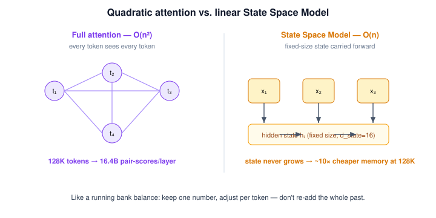

---

### 7. State Space Models (SSMs)

**Intuition** — Instead of letting every token see every other token, an SSM reads the sequence like a person reading a page: left to right, carrying a fixed-size mental summary and updating it at each word. The summary never grows, so cost per token is constant no matter how long the document.

**Mechanism** — Mamba-2 / S4 maintain a hidden state `hₜ` updated by a linear recurrence:

```
hₜ = A · h_{t-1} + B · xₜ
yₜ = C · hₜ + D · xₜ
```

`hₜ` is a fixed-size compressed history (d_state = 16 in Mamba-2); `xₜ` is the current token; `A, B, C, D` are learned projections. Mamba-2's "selective" twist (the **Selective SSM**) makes `A, B, C` input-dependent, letting the model choose what to remember. The result is **O(n · d)** time and **O(1)** memory per step — linear, not quadratic.

**Algorithm motivation** — *The problem:* attention re-examines the whole past for every new token, so long contexts are quadratically expensive. *The fix:* summarise the past into a fixed-size state and update it incrementally, so each step costs the same. *Everyday analogy:* a running bank balance. You don't re-add every past transaction to know your balance — you keep one number and adjust it per transaction.

**Worked example** — At 128K context, a Dense transformer holds a ~16 GB attention map *per layer*; Mamba-2 processes the same context at O(n), roughly **10× cheaper in memory**, which is what makes 1M+ token context (whole codebases, long legal documents, long-form RAG without chunking) practical.

**Tradeoff / when NOT to use** — Compressing history is lossy, so SSMs have *weaker in-context learning* on random-access tasks — multi-hop QA and precise retrieval, where you must jump back to an exact earlier token. They trail same-size Dense models by 5–10 MMLU points on reasoning-heavy work, and framework support (vLLM, TRT-LLM SSM backends) is still early. The winning answer in 2025 is **hybrid**: Jamba-1.5 interleaves ~50% Mamba and ~50% attention, keeping linear-scaling efficiency *and* sharp retrieval. Reach for pure SSM only when documents exceed ~128K tokens and the task is streaming/scanning, not needle-in-haystack lookup.

---

## Part 2 · Quantization Techniques & KV-Cache

### 8. Quantization: making models efficient

**Intuition** — A model's weights are stored as numbers with some precision. Quantization keeps the *same* weights but writes them in fewer bits — like storing a photo as a smaller JPEG. Drop from 32-bit to 4-bit and the file (VRAM footprint) shrinks ~8×, while the picture still looks almost the same.

**Mechanism** — Fewer bits per parameter means proportionally less memory and, on supported hardware, faster matrix math. The production ladder in 2025:

| Precision | Bits | Mem (7B) | Mem (70B) | Quality | Speed | Best use |
|---|---|---|---|---|---|---|
| FP32 | 32 | 28 GB | 280 GB | 100% | 1× | Training from scratch |
| BF16 | 16 | 14 GB | 140 GB | ~99.9% | 1.5–2× | Inference standard (H100, A100) |
| FP8 (E4M3/E5M2) | 8 | 7 GB | 70 GB | ~99.5% | 2–3× | H100-native (Transformer Engine) — 2025 default |
| INT8 (LLM.int8) | 8 | 7 GB | 70 GB | ~99% | 2–4× | Production inference on A10G, V100, A100 |
| NF4 / GPTQ-4bit | 4 | 3.5 GB | 35 GB | ~98% | 3–6× | QLoRA fine-tuning & edge |
| INT4 / AWQ | 4 | 3.5 GB | 35 GB | ~98.5% | 4–6× | Mobile/edge; best quality at 4-bit |

**Worked example** — A 70B model: 280 GB at FP32, 140 GB at BF16, **35 GB at 4-bit** — the difference between "needs a multi-GPU node" and "fits one 48 GB card," for ~2% quality loss.

**Tradeoff / when NOT to use** — Precision buys quality; below 4-bit, error grows fast and reasoning tasks feel it first. Production rule of thumb: INT8 is the safe balance (4× memory cut, <1% quality loss); 4-bit (GPTQ/AWQ) for most cost-sensitive serving; keep BF16/FP8 only where maximum quality is required and VRAM permits.

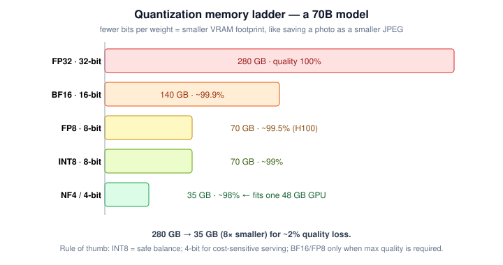

---

### 9. Floating point formats

**Intuition** — Not all "16-bit" is equal. A floating-point number splits its bits between *range* (the exponent — how big/small it can go) and *precision* (the mantissa — how finely it resolves). LLM training cares more about range than fine precision, which is why BF16 beat FP16 for the LLM era.

**Mechanism** — The bit split defines the format:

| Format | Bits | Exponent | Mantissa | Character |
|---|---|---|---|---|
| FP32 | 32 | 8 | 23 | Full range + precision; pre-training standard |
| BF16 | 16 | 8 | 7 | **Same range as FP32**, less precision — no overflow risk → inference standard |
| FP16 | 16 | 5 | 10 | More precision, narrower range → overflow risk, needs loss scaling |
| FP8 E4M3 | 8 | 4 | 3 | Max value 448; better for the forward pass (training) |
| FP8 E5M2 | 8 | 5 | 2 | Max value 57,344; wider range, suits attention/output layers (inference) |

BF16 wins because it keeps FP32's exponent (±3.4×10³⁸ range) at half the bytes, so activations never overflow during training. FP8 on the H100 Transformer Engine doubles throughput versus BF16.

**Worked example** — FP16's max value is ±65,504. A large activation in a deep network can exceed that and overflow to infinity; BF16, with the same 8-bit exponent as FP32, simply doesn't hit that ceiling — the reason it became the default.

**Tradeoff / when NOT to use** — FP16 is not a safe drop-in for BF16 in LLM training: its narrow range forces fiddly loss-scaling. Use BF16 for modern GPU inference, FP8 where an H100 Tensor Core is present, and NF4 for QLoRA / consumer-GPU work.

---

### 10. Post-Training Quantization (PTQ)

**Intuition** — PTQ compresses an *already-trained* model without retraining it — you take the finished weights and re-encode them in fewer bits, spending minutes of calibration instead of days of training.

**Mechanism** — Three production algorithms, each protecting quality differently:

| Method | How it works | Sweet spot |
|---|---|---|
| **GPTQ** (Frantar 2022) | Hessian-based, layer-wise reconstruction; minimises per-layer quantization error | 4-bit with ~1% loss on Llama-2 70B; broadest GPU compatibility; fastest to quantize |
| **AWQ** (Lin 2023) | Activation-aware: protects the top ~1% *salient* weights (found via calibration data) from quantization | 0.5–1% better perplexity than GPTQ at 4-bit; highest 4-bit quality |
| **FP8 Native** | Hardware-native on H100 Transformer Engine; zero dequantization overhead | Near-lossless (<0.5% perplexity delta); 2× throughput vs BF16 |

**Algorithm motivation** — *The problem:* naive rounding treats all weights equally, but a few weights matter far more than the rest, and crushing them wrecks quality. *The fix:* AWQ identifies those salient weights from real activation statistics and preserves them; GPTQ minimises reconstruction error layer by layer. *Everyday analogy:* packing a suitcase by weight limit — you don't shrink everything equally; you protect the few fragile items and compress the bulk.

**Worked example** — Quantizing Llama-2 70B to 4-bit with GPTQ drops accuracy ~1% while cutting weights from 140 GB (BF16) to 35 GB, and delivers 2–3× throughput vs BF16 on an A100.

Tooling: GPTQ ships via exllama v2, AWQ via Hugging Face AutoAWQ (`pip install`); FP8 is supported in vLLM, TRT-LLM, SGLang, and Ollama, and Meta serves Llama 3 70B in FP8.

**Tradeoff / when NOT to use** — PTQ has a quality floor: below 4-bit, even salient-weight protection can't save reasoning accuracy. Decision guide: **FP8** if serving on H100+; **AWQ** for highest 4-bit quality on A10G/A100; **GPTQ** for broad GPU compatibility and fastest quantization.

---

### 11. Low-Rank Adaptation (LoRA)

**Intuition** — Fine-tuning normally rewrites all of a model's billions of weights — huge and expensive. LoRA freezes the original model and learns a *small correction* alongside it, factored into two skinny matrices. You adapt behaviour by training megabytes, not gigabytes.

**Mechanism** — The weight update `ΔW` is decomposed into a low-rank product:

```
W_new = W_frozen + ΔW,   where  ΔW = B · A
```

`A` is d×r and `B` is r×d, with rank `r ≪ d`. The frozen path and the LoRA path run in parallel and their outputs add. Two hyperparameters govern the adapter: rank `r` (capacity) and a scaling factor **α**; adapters are usually attached to the attention projections (Q, K, V) and the MLP layers.

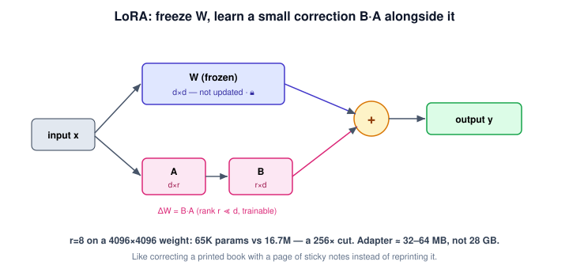

**Worked example** — For a 4096×4096 weight, full `ΔW` is 16.7M parameters. LoRA at r=8 uses A (4096×8) + B (8×4096) = 65,536 params — a **256× reduction**. A whole adapter is 32–64 MB instead of ~28 GB for a full 7B copy.

**Algorithm motivation** — *The problem:* full fine-tuning stores and updates a complete second copy of the model per task — unaffordable to train or to keep many of. *The fix:* the useful change from fine-tuning is low-rank, so learn only that thin slice and leave the base frozen. *Everyday analogy:* editing a printed book with a page of sticky-note corrections instead of reprinting the whole book for every edit.

**Tradeoff / when NOT to use** — Rank `r` caps the adapter's capacity; too low and it can't absorb a large behavioural shift. For adapting a model to a genuinely new domain (not just a new task/style), you may need higher rank or true fine-tuning. LoRA shines when you want many cheap, swappable task adapters over one frozen base.

---

### 12. QLoRA: Quantization + Fine-Tuning

**Intuition** — LoRA already shrinks *what you train*; QLoRA also shrinks *what you hold frozen*. It keeps the base model in 4-bit while training BF16 LoRA adapters on top — so a 70B model becomes fine-tunable on a single 48 GB GPU.

**Mechanism** — Dettmers et al. (2023) combine four ideas: (1) the frozen base is quantized to **4-bit NF4** (NormalFloat — a datatype whose 16 levels are information-theoretically optimal for the roughly-normal distribution of model weights); (2) **double quantization** compresses the quantization constants themselves, saving ~0.4 GB per 7B; (3) only the small **LoRA adapters** (in BF16) receive gradients; (4) **paged optimizers** page optimizer state to CPU to survive memory spikes. Quality matches full BF16 fine-tuning — <1% delta on MMLU and MT-Bench.

**Worked example** — Fine-tuning 70B, memory budget:

```
Full fine-tuning: 70B × 4 bytes × 4 (weights + grads + 2 Adam states) ≈ 1,120 GB
QLoRA:            70B × 0.5 bytes (NF4) + LoRA adapters (~1 GB)        ≈ 36 GB
→ 31× memory reduction (1,120 GB → 36 GB), 70B now trains on one 48 GB A6000/A40.
```

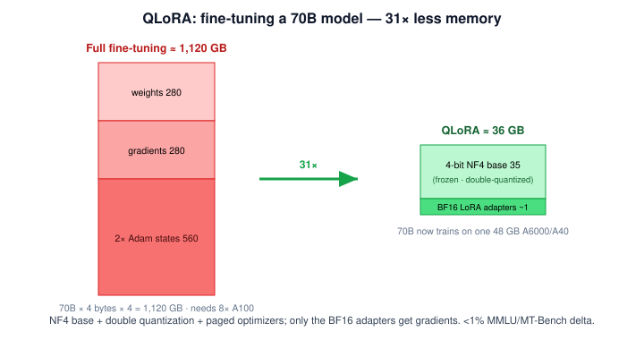

**Tradeoff / when NOT to use** — The base is frozen at 4-bit, so QLoRA inherits 4-bit's small quality floor and can't move the base model's raw knowledge — it adapts behaviour, it doesn't re-teach facts. When you need maximum-fidelity full fine-tuning and have the VRAM, full BF16 tuning still edges it; for almost everything else, QLoRA is the default.

**Decision guide** — pick precision by scenario:

| Scenario | Precision | Why |
|---|---|---|
| Training from scratch | FP32 / BF16 | Gradient stability; BF16 faster on H100 |
| Fine-tuning large models | QLoRA (NF4 + LoRA) | 31× memory cut; 70B on one 48 GB GPU |
| Production inference (cloud) | BF16 / FP8 | BF16 on A100; FP8 on H100 for 2× throughput |
| Edge / on-device | INT8 / NF4 | Minimal memory; NF4 for ARM/mobile |
| Real-time low-latency | INT8 / AWQ-4bit | Fastest time-to-first-token (TTFT) |

---

### 13. GPU Memory Estimation

**Intuition** — Before renting a GPU you need to know if the model fits. Three things occupy VRAM, and only one of them is fixed: the weights sit still, but the KV-cache and activations *grow with how much text you process at once*.

**Mechanism** — Total inference memory is a sum of three terms:

```
M_total = M_weights + M_KV-cache + M_activation
```

- **M_weights** — fixed: parameters × bytes/param (7B BF16 = 14 GB; 70B NF4 = 35 GB).
- **M_KV-cache** — dynamic: grows with sequence length and batch (full formula in *KV-Cache: the hidden memory consumer*).
- **M_activation** — temporary, during the forward pass only: ≈ batch × seq × hidden × layers × 2 bytes, roughly 10–20% of weights.

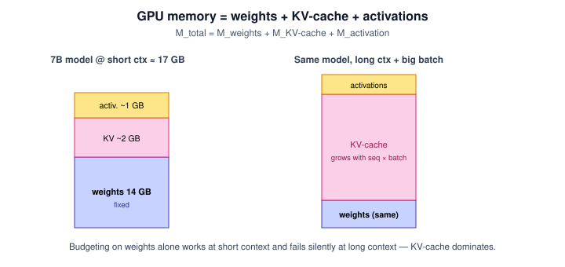

**Worked example** — A 7B model in BF16: weights 14 GB + KV-cache ~2 GB + activations ~1 GB → needs **~17 GB VRAM**. That's why a 7B "fits a 24 GB card" with headroom, but the same card chokes once you push long contexts and large batches (the KV term explodes — next section).

**Tradeoff / when NOT to use** — Budgeting on weights alone is the classic mistake: it works for short prompts and fails silently at long context or high batch, where KV-cache dominates. Always size all three terms for your *actual* max sequence length and batch, not the model card's parameter count.

---

### 14. Why we need the KV-Cache

**Intuition** — A transformer generates one token at a time, and each new token must attend to *all* previous tokens. Recomputing every previous token's Key and Value from scratch each step is the same work over and over. The KV-cache saves those Keys and Values so each step only computes the *new* token's — turning O(n²) total work into O(n).

**Mechanism** — Without a cache, generating token *t* recomputes K,V for tokens 1…t every step. With a cache, K and V for past tokens are stored once and reused; only the new token's K,V are computed and appended:

```
K_all = concat(K_cached, K_new)
V_all = concat(V_cached, V_new)
attention = softmax(Q_new · K_allᵀ / √d_k) · V_all
```

Only **K and V** are cached, never Q: the Query changes with each new position (must be recomputed), while Keys and Values represent fixed past context — compute once, reuse forever. In the **prefill** phase the whole prompt is processed in parallel to build the initial cache; in the **generation** phase tokens are added one at a time. Only the key/value projections (W_K, W_V) are cached; the query projection (W_Q) is recomputed each step.

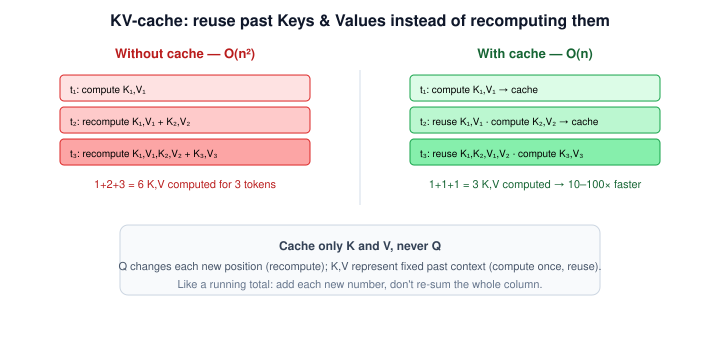

**Worked example** — Generating a 3-token continuation "The / cat / is": naive recomputes 1+2+3 = 6 K,V pairs; cached computes 1+1+1 = 3 and reuses the rest. Over hundreds of output tokens the saving compounds to a **10–100× faster** generation.

**Algorithm motivation** — *The problem:* autoregressive decoding re-derives the entire past at every step — quadratic redundant work. *The fix:* memoise the parts that don't change (K, V). *Everyday analogy:* adding numbers to a running total instead of re-summing the whole column each time you add one.

**Tradeoff / when NOT to use** — The cache trades memory for speed, and at long context that memory is not small — it can exceed the model's own weights (next section). There's nothing to skip here (you always want the cache during generation); the real question is how to *bound* its memory, which is what GQA and PagedAttention address.

---

### 15. KV-Cache: the hidden memory consumer

**Intuition** — The KV-cache feels free until the context gets long, then it quietly becomes the *largest* thing in VRAM — bigger than the model. This is the number that surprises teams in production.

**Mechanism** — Cache size grows linearly in every dimension:

```
M_KV = 2 × layers × heads × d_head × seq_len × batch_size × bytes_per_element
```

The leading `2` is for storing both K and V.

**Worked example** — Llama-3.3 8B (layers 32, heads 32, d_head 128, BF16), at 2K context, batch 1:

```
M_KV = 2 × 32 × 32 × 128 × 2048 × 1 × 2 ≈ 1.07 GB  (~1 GB)
```

Now the same model at **128K context, batch 8**: the cache scales to **well over 100 GB** (the standard figure is ~137 GB) — far more than the model's own 16 GB of weights. ⚠️ The exact figure depends on per-term rounding; the point that survives is the *order*: at long context, KV-cache dwarfs weights.

**Tradeoff / when NOT to use** — Because M_KV scales with `heads`, the fix is to share Keys/Values across heads: **Grouped-Query Attention (GQA)** cuts the `heads` factor, and **PagedAttention** (vLLM) manages the cache like virtual memory so it isn't over-allocated. Skipping these is fine at short context; at 8K+ or high batch they're essential, or you run out of VRAM.

---

### 16. Hands-on: sizing a 175B model

**Intuition** — Put the three-term formula to work on a genuinely large model to see which term hurts.

**Worked example** — 175B params, BF16, seq 4,096, batch 4, layers/heads/d_head = 96/96/128:

```
1. Weights     : 175B × 2 bytes                        = 350 GB
2. KV-cache     : 2 × 96 × 96 × 128 × 4096 × 4 × 2      ≈ 96 GB   ⚠️ (dimensions as written recompute to ~77 GB; deck rounds to ~96 GB)
3. Activations  : 4 × 4096 × 12,288 × 96 × 2            ≈ 38 GB
------------------------------------------------------------------
   Total VRAM                                          ≈ 484 GB
```

Practical hardware: ~6–7× A100 40GB with tensor parallelism, or 2× H100 80GB recommended. **With FP8 quantization**, weights shrink to ~175 GB → total ≈ 309 GB → feasible on **4× H100 80GB**. Quantization is what turns "needs seven GPUs" into "needs four."

**Tradeoff / when NOT to use** — This back-of-envelope assumes a single replica; real serving adds framework overhead, multiple replicas, and fragmentation, so treat the number as a floor, not a quote. But it's the right first cut for any capacity decision.

---

### 17. Memory-efficient inference at scale

**Intuition** — Once weights and KV-cache are budgeted, a set of serving techniques squeeze more context and throughput out of the same GPUs. These are the production baseline in 2025, named here at the weight they deserve — you *use* them, you rarely re-implement them.

**Mechanism** — The main levers:

| Technique | What it does | Payoff |
|---|---|---|
| **FlashAttention-3** | Tiles attention to fit GPU SRAM blocks | 3–5× faster than FA-2 on H100; enables 8K+ and 1M context; native FP8 |
| **PagedAttention** (vLLM) | Virtual-memory paging for the KV-cache | Cuts wasted KV memory 60% → <10%; continuous batching (no padding waste) |
| **CPU/NVMe offloading** | Spills KV-cache to cheaper memory (FlexGen fits a 100B model on one consumer GPU) | 10× longer contexts; trade-off: 2–3× slower generation |
| **Tensor Parallelism (TP)** | Splits weight matrices across GPUs (Megatron-LM style) | Lower latency; best for 2–8 GPUs (~5% comm overhead) |
| **Pipeline Parallelism (PP)** | Splits layers across GPUs (depth-wise) | Higher throughput via micro-batching |

**Worked example** — A recommended 70B serving baseline: FlashAttention-3 + PagedAttention, with Tensor Parallelism TP=4 across 4× H100. PagedAttention alone reclaims most of the KV memory that naive allocation wastes, and continuous batching keeps the GPUs full.

**Tradeoff / when NOT to use** — Offloading buys context length at the cost of latency, so it's for research or low-throughput jobs, not real-time serving. Pipeline parallelism adds a scheduling "bubble" (~15% without care). Reach for TP first (2–8 GPUs), add PP only when you've outgrown a single node.

---

## Part 3 · Prompt Caching & Model Routing

### 18. Token economics: understanding API costs

**Intuition** — API bills are counted in tokens, and the two directions are not priced the same: models charge far more for tokens they *generate* than tokens they *read*. Where your cost lives tells you which lever to pull.

**Mechanism** — Per-million-token pricing, 2025 (indicative):

| Model | Input | Output | Cached input | Context |
|---|---|---|---|---|
| GPT-4o | $5 | $15 | $2.50 | 128K |
| GPT-4 Turbo | $10 | $30 | $5.00 | 128K |
| Claude 3.7 Sonnet | $3 | $15 | $0.30 | 200K |
| Claude 3.5 Haiku | $0.80 | $4 | $0.08 | 200K |
| Gemini 2.0 Flash | $0.075 | $0.30 | $0.019 | 1M |
| DeepSeek-V3 | $0.27 | $1.10 | $0.014 | 128K |
| Self-hosted vLLM | $0.10–0.30* | $0.10–0.30* | — | model-dependent |

Output tokens cost **3–10× more** than input.

**Worked example** — A summariser that reads 4,000 tokens and writes 1,000 on GPT-4o pays 4,000 × $5/1M (input) = $0.02 + 1,000 × $15/1M (output) = $0.015 → $0.035/call. Cutting the *summary* length from 1,000 to 300 tokens saves more per call than trimming 700 tokens of input would.

**Tradeoff / when NOT to use** — Optimising input while ignoring output is the common error. Minimise generation length, use structured outputs (which are shorter and more predictable), and — for repeated input context — cache it (next section).

---

### 19. Prompt caching

**Intuition** — Most agent requests resend the *same* big preamble every time — a long system prompt, few-shot examples, a reference document — followed by a short unique question. Prompt caching stores that repeated preamble server-side so you're billed the cheap cached rate for it instead of full input price on every call.

**Mechanism** — Mark the static prefix as cacheable; the provider keeps it warm for a TTL (Anthropic ~5 min, OpenAI ~1 hour, refreshed on each hit). Cached input is discounted **90% (Anthropic) / 50% (OpenAI)**. Minimum cacheable size: 1,024 tokens (Claude), 512 (GPT-4o). The rule for the prompt layout: **static content first, dynamic query last** — any change before the cache breakpoint invalidates the whole cache.

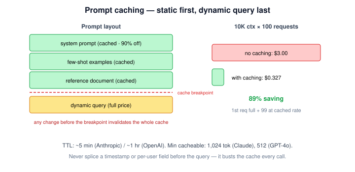

**Worked example** — A 10,000-token context reused across 100 requests on Claude 3.7:

```
Without caching : 100 × 10K × $3/1M                          = $3.00
With caching    : 1 × 10K × $3/1M  +  99 × 10K × $0.30/1M
                = $0.030          +  $0.297                  = $0.327
→ 89% saving
```

**Tradeoff / when NOT to use** — Caching only pays when the prefix is genuinely reused and stable. Any dynamic injection *before* the query — a timestamp, a per-user field spliced into the system prompt — busts the cache on every call (a **cache invalidation**) and you pay full price. Version your system prompts; keep everything volatile after the breakpoint.

---

### 20. Intelligent Model Routing

**Intuition** — Don't send every question to your smartest, priciest model. A router reads each request, judges its difficulty, and sends it to the cheapest model that can handle it — most traffic is easy, so most traffic goes cheap.

**Mechanism** — A cheap classifier (often a Small LM) tiers each request and dispatches it:

| Task tier | Route to | Example models | ~Cost/1K req |
|---|---|---|---|
| Simple (classification, NER, intent, slot-filling) | SLM 1–3B | Phi-4-mini, Qwen2.5-1.5B | ~$0.01 |
| Medium (summarisation, QA, RAG, structured output) | MoE mid | Mixtral 8×22B, DeepSeek-V3 | ~$0.08 |
| Complex (multi-step reasoning, code-gen, planning) | Dense LLM | Claude 3.7, GPT-4o | ~$0.80 |

This is the RouteLLM (Ong et al., 2024) pattern — learn a routing policy from preference data.

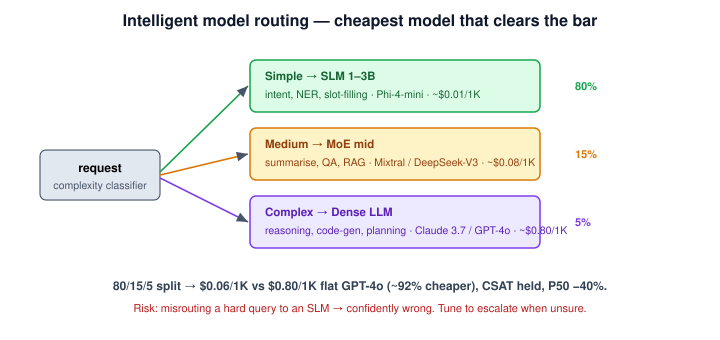

**Worked example** — The support bot, split 80% SLM / 15% MoE / 5% Dense: effective cost = 0.80×$0.01 + 0.15×$0.08 + 0.05×$0.80 = $0.008 + $0.012 + $0.040 = **$0.06/1K req** versus $0.80/1K flat GPT-4o — a **~92% cost reduction** (a marginally cheaper SLM tier reaches ~95%), with CSAT maintained and P50 latency improved 40% (small models answer the easy majority faster).

**Tradeoff / when NOT to use** — A router is only as good as its difficulty judgement: misroute a hard query to an SLM and you get a confidently wrong answer, which is worse than a slow correct one. Tune the classifier conservatively (when unsure, escalate), and skip routing entirely for low-volume or uniformly-hard workloads where the routing overhead and misroute risk outweigh the savings.

---

### 21. Production cost-optimization playbook

**Intuition** — The levers combine into a sequence: quick wins first (caching, routing, output caps), deeper structural changes later (self-hosting, speculative decoding, leaner RAG).

**Mechanism** —

*Week 1 (immediate):* enable prompt caching on every endpoint with a >1K-token repeated prefix; route simple tasks to SLMs; set `max_tokens` deliberately (an open-ended ceiling bills generation at the ceiling); batch non-urgent requests (OpenAI Batch API = 50% off).

*Month 1 (advanced):* model routing by complexity (target 80/15/5 SLM/MoE/Dense); self-host quantized models (vLLM + AWQ) for high-volume slices (>5B tokens/month); speculative decoding (a small draft model proposes, the target model verifies → ~2× speed at same cost); leaner RAG (top-3 not top-10 chunks cuts context 60–70%; add a re-ranker to keep quality).

**Worked example** — A production RAG system taken from **$12K/month → $2K/month**: 50% prompt-caching reduction + a Gemma-2B router sending 80/20 to Claude + 4K max context instead of 16K + AWQ-4bit self-hosted Mixtral for medium tasks. No single lever did it; the stack did.

**Tradeoff / when NOT to use** — Don't start with the hard levers. Self-hosting and speculative decoding add engineering burden that only pays at volume; caching and routing are almost free and come first. Trimming RAG context too aggressively (top-1) trades cost for answer quality — measure recall before cutting.

---

### 22. Self-hosting vs API: break-even analysis

**Intuition** — A managed API charges per token with zero ops; self-hosting pays a big fixed GPU + DevOps cost but a tiny marginal token cost. Below some monthly volume the API is cheaper; above it, self-hosting wins. The whole decision is *where you sit on that crossover*.

**Mechanism** — Compare fixed vs marginal cost across the two models:

| Factor | Managed API | Self-hosted (vLLM + H100) |
|---|---|---|
| Upfront | $0 | $5K–50K GPU + $10K–30K setup |
| Monthly @ 1B tokens | ~$3,000 (Claude) / ~$300 (DeepSeek API) | ~$800–1,200 (H100 spot) + $8K–12K DevOps |
| Maintenance | Zero — SLAs, scaling included | $8K–12K/month DevOps + on-call |
| Scalability | Instant auto-scale (seconds) | Hours–days (provisioning) |
| Data privacy | Data sent to vendor | Full control (on-prem / VPC) |
| Latency | Variable (P50 200–500ms, 7B) | Predictable (P50 50–150ms, 7B on H100) |

**Worked example** — The dominant term at low volume is DevOps, not GPUs: self-hosting's ~$8–12K/month fixed ops cost swamps a ~$3K API bill until token volume is large enough that the API's per-token charge crosses it. Rule of thumb: **< 5B tokens/month → API wins; ≥ 10B tokens/month → self-hosting saves 60–70%**; 5–10B is the "consider it, with quantized Llama/Qwen" zone.

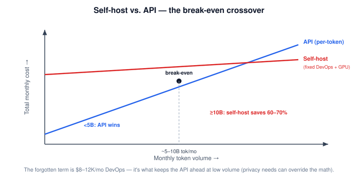

**Tradeoff / when NOT to use** — Self-hosting is not just a GPU lease — the $8–12K/month DevOps and on-call burden is the line teams forget, and it's what makes the API win below ~5B tokens/month. Self-host for scale, data-residency, or predictable latency; stay on the API for everything else. (Data-privacy or on-prem requirements can override the pure cost math and justify self-hosting earlier.)

> ***Going deeper*** — Beyond course depth, the 2025–26 efficiency frontier: **1-bit LLMs** (BitNet b1.58, ternary weights {−1, 0, +1}, ~2–5× energy efficiency, MMLU parity at 8B+); **Mixture-of-Depths v2** (dynamic per-token compute, 60–70% FLOP cut, composes with LoRA and SSMs); **FlashAttention-4** (kernels for H200/B200, ring attention for >1M context); and **hardware-aware quantization 2.0** (per-hardware format selection, INT4 on Apple Neural Engine). Direction of travel: less precision, dynamic compute, and hardware co-design converging.

---

## Self-study / Lab / build

No new notebook ships with this session. The natural build is a **cost-and-memory calculator** that turns this session into a tool:

- **VRAM sizer** — implement `M_total = M_weights + M_KV + M_activation` (from *GPU Memory Estimation* and the KV formula) and reproduce the 7B → ~17 GB and 175B → ~484 GB worked examples in <30 lines.
- **Routing simulator** — given a traffic split (e.g. 80/15/5) and the per-tier costs from *Intelligent Model Routing*, compute effective cost/1K and verify the ~$0.06 vs $0.80 result.
- **Caching calculator** — reproduce the 10K-token × 100-request prompt-caching example ($3.00 → $0.327, 89%).

The Session-3 hybrid-search lab remains the active runnable lab for this stretch of the course (see the Lab 3 material under this subject); this session's practice is arithmetic, not a new framework.

---

*Exam: this session is in scope for the **closed-book mid-sem** (Contact Sessions 1–8) and the **open-book comprehensive** (Contact Sessions 1–16). Full evaluation, weights, dates and course logistics live once in [`521-master.md`](../521-master.md) — not repeated per session.*
