# API-driven Cloud Native Solutions · Session 01 · API Basics

*Learned 25 Jul 2026*

## Why this matters

An API is a **promise between a service and its clients**: send a request shaped like *this*, get a response shaped like *that* — and neither side needs to know how the other is built. Get the promise right and other teams build on you for years without ever reading your code; get it wrong and every change breaks someone.

This is career-load-bearing, not just coursework. **Every backend, every cloud service, every ML model you deploy is reached through an API** — Hugging Face, OpenAI, LangChain, Prefect and Amazon Bedrock are all REST. The design calls in this note — REST vs gRPC, how to version without breaking clients, sync vs async — are ones you will actually make on the job. The note builds the vocabulary (contract, sync/async, HTTP), then the three shapes the promise can take, then how you evolve it over time.

## Part 1 · What an API is

*The promise itself: what a contract between a service and its clients actually is, and the two ways it can be called — the caller waits (synchronous) or it doesn't (asynchronous).*

### 1. What an API is

**Intuition** — An API is a **contract between a service and its clients**. It says: send me a request shaped like this, and I promise a response shaped like that. Neither side needs to know how the other is built. That's the whole point — the contract is the product.

*A restaurant analogy carries this whole section:* the **menu** is the API. It promises "ask for dish 12 and you'll get *this* meal" without telling you a thing about the kitchen. You order *from the menu* — you don't walk in and instruct the chef — and the restaurant is free to swap chefs, ovens, or suppliers; as long as the menu still delivers dish 12, you never notice and never care. The **menu is the contract; the kitchen is the implementation.** Keep this picture: almost everything below is a detail of how the menu is written or how it changes over time.

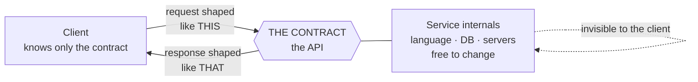

**Everything to the right of the contract can be rewritten** — new language, new database, new hardware — and no client notices. That independence *is* the product. It's also why a breaking change is such a big deal (section 9): it's the one thing that reaches across the line.

**Three definitions, in increasing usefulness:**

1. "Application Programming Interface" — the acronym, tells you nothing.
2. **A contract between a service and its clients** — the one to remember.
3. A set of rules and protocols for building and interacting with software, enabling systems to exchange data and integrate function **without the end user understanding the underlying code**.

**API-first approach** — the application is *designed as* a set of APIs from the start, rather than having an API bolted on afterwards. It's an explicitly-named term, and the premise of the whole course.

**Worked example** — Amazon Bedrock exposes `GET /models` to list models and `POST /models/{model-id}/invoke` to run inference. You never see the GPUs, the model weights, or the serving stack. You see a contract. Same for Hugging Face, LangChain and Prefect — which is exactly why this course is API-driven.

**Tradeoff / the cost of the contract** — Once published, the contract binds you. Clients build against it and break when it changes, which is why section 9 (versioning) exists as a topic at all. An internal function can be refactored freely; a published API cannot. **Publishing an API is a commitment, not a feature.**

> ***In practice*** *— what calling an API actually looks like on the job:*
> - You almost never write raw HTTP. You call an **SDK** — `openai`, `boto3`, `huggingface_hub` — and every one of those is a thin wrapper that builds the HTTP request for you. Knowing the contract underneath is exactly what lets you debug when the SDK does something surprising (a 400 you didn't expect, a field it won't send).
> - Real APIs are gated by an **API key or token** in a header (`Authorization: Bearer sk-…`). The contract includes *who's allowed*, not just *what's allowed* — authentication (section 3, `401`) and authorization (`403`) are part of the promise.
> - Providers enforce **rate limits** (e.g. "60 requests/min"). Exceed one and you get `429 Too Many Requests`, so production code wraps calls in **retry-with-backoff**. This is the "contract binds *you*" cost made concrete: the provider can throttle, version, or deprecate, and your system has to absorb it.

---

### 2. Synchronous vs asynchronous

**Intuition** — Synchronous means the caller **waits**; the next task can't start until this one finishes (blocked). Asynchronous means the caller doesn't wait; a second task can begin in parallel (non-blocked).

| | Synchronous | Asynchronous |
|---|---|---|
| Caller | **Blocked** until reply | **Non-blocked**, continues immediately |
| Examples | **REST, gRPC, GraphQL** | Message brokers — **RabbitMQ, Apache Kafka, Amazon SQS** |
| Coupling | Caller needs the callee up *now* | Caller only needs the broker up |
| Shape | Request → response | Publish → channel → consume |

**Worked example — the same order, timed both ways.** Placing an order needs three downstream calls: verify the consumer (200 ms), check the restaurant is open (150 ms), reserve payment (400 ms).

| | Synchronous (REST) | Asynchronous (broker) |
|---|---|---|
| **Wall time the user waits** | 200 + 150 + 400 = **750 ms** | Publish to the channel = **~5 ms** |
| **What the user sees** | The finished order, confirmed | `202 Accepted` — *"order received"*, with an ID to poll |
| **If payment is down** | The whole request fails; user sees an error | Message sits in the queue; processed when payment recovers |
| **If traffic spikes 10×** | Every caller waits 750 ms; threads exhaust; cascading failure | Queue depth grows; consumers drain it at their own rate |
| **Can the user be told "confirmed"?** | ✅ Yes, immediately and truthfully | ❌ Not yet — confirmation arrives later, by push or polling |

**The trade in one line:** synchronous buys you a **truthful immediate answer**; asynchronous buys you **survival under load and partial failure**, and pays for it with a more complicated client that must handle "not done yet."

That last row is why real systems are usually both. The user-facing read (`GET /orders/123`) stays synchronous because the user needs an answer now; the fulfilment pipeline behind it goes async because nothing there benefits from making anyone wait.

**Mechanism — the example, an order service, both ways.**

Synchronous (REST): the order service calls each downstream service directly and waits.

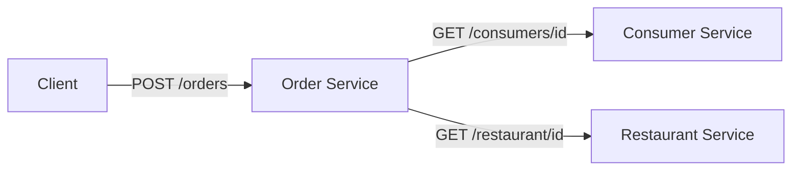

Asynchronous (message broker): every hop becomes a channel, and nothing blocks.

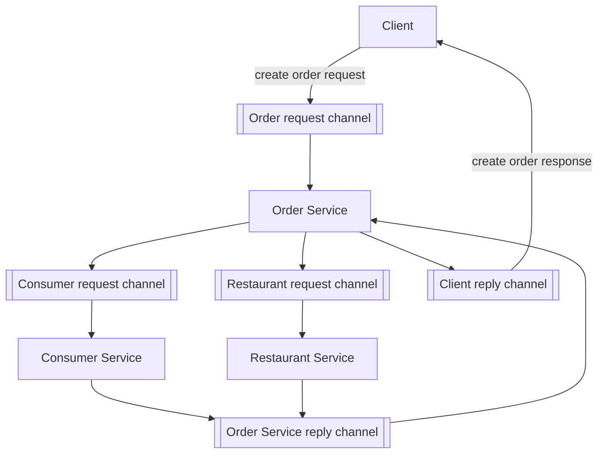

Note what the second diagram costs: **six channels instead of two direct calls**, plus a broker to run and monitor. That visual is the tradeoff.

**Tradeoff / when NOT to go async** — Asynchronous buys availability (the consumer service can be down and the message waits) and decoupling, and charges you a broker to operate, eventual consistency, harder debugging, and no simple "what did it return?" answer. Use sync when the caller genuinely needs the answer to proceed — a payment authorisation. Use async for work that can complete later — sending the confirmation email.

---

## Part 2 · HTTP and specification

*The wire format every API style sits on: the anatomy of one request/response, what the status codes mean, and how you write the contract down so humans and machines agree (OpenAPI).*

### 3. HTTP APIs

**Intuition** — HTTP APIs are the standard way applications talk over the web, typically browser → server. Three components: **endpoint**, **request**, **response**.

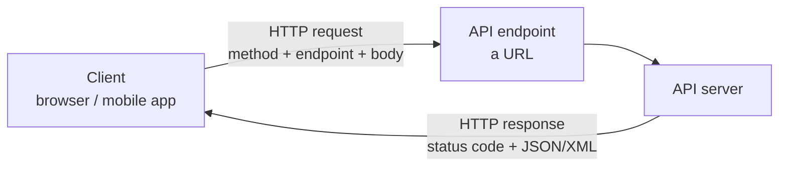

**Mechanism — what one HTTP exchange actually contains.** Four parts on the way out, three on the way back:

| | Part | Example | Purpose |
|---|---|---|---|
| **Request** | Method | `GET` | The verb — what you want done |
| | Endpoint | `https://api.amazon.com/products/101` | The noun — what you want it done to |
| | Headers | `Authorization: Bearer …`<br/>`Accept: application/json` | Metadata: who you are, what format you'll take |
| | Body | `{"name": "Widget"}` | The payload — **only for POST/PUT/PATCH**; GET and DELETE carry none |
| **Response** | Status code | `200`, `404`, `500` | Did it work, and whose fault if not |
| | Headers | `Content-Type: application/json`<br/>`Cache-Control: max-age=3600` | How to interpret and cache the body |
| | Body | `{"id": 101, "name": "Widget"}` | The result |

**The method carries meaning the URL doesn't.** `GET /products/101` and `DELETE /products/101` are the same endpoint and opposite intentions. Two properties follow, and both get examined:

| Property | Means | Which methods |
|---|---|---|
| **Safe** | Doesn't change server state | `GET`, `HEAD`, `OPTIONS` |
| **Idempotent** | Calling it five times = calling it once | `GET`, `PUT`, `DELETE` — **but not `POST`** |

*The everyday picture of **idempotent**: an **elevator call button**. Press it once or press it five times — the same one elevator arrives; the extra presses change nothing. Setting a light switch to "on" is idempotent the same way (flip it to on however many times, the light is just on). `POST` is the opposite — it's like **adding an item to your cart**: click twice and you've got two in the basket.*

That `POST` exception is the practical one: a retried `POST` can create two orders, which is why payment APIs make you send an idempotency key. `PUT /products/101` with the same body is harmless to repeat; `POST /products` is not.

**Endpoints** — simple URLs representing a collection of objects or a single object. Resources live on the server; each endpoint is a URL designed to perform **a single function**. Endpoints are the **"doors" or "paths"** through which a client sends requests.

*A student got this wrong in class: an endpoint is **not** just the resource path — it's **host + resource path together**.* Split `https://api.amazon.com/products/101`:

| Part | Example | What it is |
|---|---|---|
| Protocol | `https://` | HTTPS = the secure form |
| Host | `api.amazon.com` | Which server to reach |
| Resource | `/products` | What kind of thing |
| Id | `/101` | Which specific one — present **only** for a single item |

That last part carries the collection-vs-item split (section 4): `/products` = the collection, `/products/101` = one item. Only the id changes what you're addressing.

**Requests** — every request begins by choosing an HTTP **method** (verb). The four map one-to-one onto **CRUD** (Create, Read, Update, Delete) — the same mapping comes back in REST (section 5), so it's worth locking in here:

| Method | Purpose | CRUD |
|---|---|---|
| `GET` | Retrieve data | **R**ead |
| `POST` | Submit data to the server | **C**reate |
| `PUT` | Update existing data | **U**pdate |
| `DELETE` | Delete data | **D**elete |

**Responses** — data sent back after processing, formatted as **JSON or XML**, with a status code.

**Read the first digit first** — it puts every code in one of **five classes**. The instructor drilled this: learn the classes, not just the codes. The quickest way to remember them is to hear what the server is *saying* in each:

| Class | Meaning | What the server is saying | You'll meet |
|---|---|---|---|
| **1xx** | **Informational** — request received, still working | *"Got it, hold on — keep going."* | `100 Continue`, `102 Processing` |
| **2xx** | **Success** | *"Here you go."* | `200 OK`, `201 Created` |
| **3xx** | **Redirection** — resource is elsewhere; go there | *"It's moved — look over there."* | `301`, `302`, `303` |
| **4xx** | **Client error** — the request is wrong | *"You did something wrong."* | `400`, `401`, `403`, `404` |
| **5xx** | **Server error** — the server broke | *"I broke — not your fault."* | `500` |

Memory hook: **4xx is your fault, 5xx is the server's** — the two error classes get mixed up constantly, and that one line settles it.

The codes worth knowing by name:

| Code | Meaning |
|---|---|
| **100 Continue** | Server got the headers, asks the client to send the request body |
| **200 OK** | Successful; server returning the requested data |
| **201 Created** | Request created a new resource |
| **301 Moved Permanently** | Resource has a new URL for good (e.g. an old HTTP URL redirected to HTTPS) |
| **302 Found** | Temporary redirect — resource is elsewhere *for now* |
| **303 See Other** | After a POST, fetch the result with a `GET` at another URL (the "payment successful / order confirmed" page you land on after checkout) |
| **400 Bad Request** | Client's request malformed or contains errors |
| **401 Unauthorized** | Authentication credentials missing or invalid |
| **403 Forbidden** | Client not allowed to access this resource |
| **404 Not Found** | Requested resource does not exist |
| **500 Internal Server Error** | Unexpected server error |

*Which success code when:* a `GET` that returns data → **200 OK**; a `POST` that creates a resource → **201 Created**. Both mean "it worked" — 201 adds "…and I made something new," which is why it's the natural reply to POST.

Learn the **401 vs 403** distinction — it's the classic exam pair. 401 = *we don't know who you are*. 403 = *we know who you are and you still can't*.

> ***Going deeper*** *— how a request actually proves who it is; `401`/`403` are where you meet this:*
> Three auth schemes you'll use constantly:
>
> | Scheme | How it works | Where you'll see it |
> |---|---|---|
> | **API key** | A long secret string in a header (`Authorization: Bearer sk-…` or `X-API-Key`). Simple; identifies the *app*, not a user. | OpenAI, most cloud APIs |
> | **OAuth 2.0** | The user authorises your app **without handing over their password**; your app receives a short-lived **access token**. | "Sign in with Google", any API acting *on a user's behalf* |
> | **JWT** (JSON Web Token) | A signed, self-contained token carrying claims (who · scope · expiry). The server verifies the *signature* — no database lookup. | Stateless microservice auth — ties straight back to REST being stateless (section 5) |
>
> The OAuth flow in one picture — the pattern behind every "Sign in with…" button:
>
> ```mermaid
> sequenceDiagram
>     participant U as User
>     participant A as Your App
>     participant Auth as Auth Server
>     participant API as Resource API
>     U->>A: click "Sign in with Google"
>     A->>Auth: redirect to authorise
>     Auth->>U: "Allow this app to access X?"
>     U->>Auth: approve
>     Auth->>A: authorisation code
>     A->>Auth: code + app secret
>     Auth->>A: short-lived access token
>     A->>API: request + Bearer token
>     API->>A: data (200) — or 401 if token bad/expired
> ```
>
> The line that connects it all: **authentication (*who are you?*) → `401`; authorization (*are you allowed?*) → `403`.** OAuth **scopes** are exactly how a `403` gets decided — the token says *what* the app may do, not just *who* it is.

The **3xx family** is invisible — the browser follows the redirect silently — but constant: type `http://` and land on `https://` (**301**); finish a checkout and get bounced to a confirmation page (**303**). A redirect is not an error — *"the work doesn't stop, it just looks for another URL."*

**Worked example — run this, it takes ten seconds:**

```bash
curl -X GET "https://jsonplaceholder.typicode.com/posts"
```

Method `GET` · endpoint `https://jsonplaceholder.typicode.com/posts` · response = posts in JSON. Also worth trying it in **Postman**, which is worth installing now — you'll want it for labs 3 and 4.

> ***Going deeper*** *— what that `curl` actually sends and receives on the wire; an SDK hides it, but it's all HTTP really is:*
> The **request** your client sends is plain text:
> ```http
> GET /posts/1 HTTP/1.1
> Host: jsonplaceholder.typicode.com
> Authorization: Bearer sk-abc123
> Accept: application/json
> ```
> Three parts: a **request line** (method + path + version), **headers** (`key: value` — who you are, what you accept), and an optional **body** (empty for `GET`; the JSON payload for `POST`/`PUT`).
>
> The **response** mirrors it:
> ```http
> HTTP/1.1 200 OK
> Content-Type: application/json
> Content-Length: 83
>
> {"userId": 1, "id": 1, "title": "…", "body": "…"}
> ```
> A **status line** (version + code + reason), **headers**, a **blank line**, then the **body**. That blank line is the whole framing rule — headers above it, data below. Everything else — REST, an SDK, Postman — is a convenience layer over these messages. When an API "doesn't work," this is the level you drop to: `curl -v` prints exactly these bytes.

**Tradeoff** — HTTP's ubiquity is its strength and its ceiling. It's text-based, request-per-resource, and carries header overhead on every call. That overhead is invisible for a browser fetching a page and very visible for two internal services exchanging millions of messages — which is the gap gRPC exists to fill (section 7).

> ***Going deeper*** *— safe vs idempotent methods, the property that makes retries safe:*
> The four verbs are usually listed by purpose. In practice the property that matters is what happens when you **repeat** a call — because networks drop responses and clients retry.
>
> | Method | **Safe?** (no change) | **Idempotent?** (same result if repeated) |
> |---|---|---|
> | `GET` | ✅ yes | ✅ yes |
> | `PUT` | ❌ no | ✅ yes — "set resource 5 to *this*" lands the same however many times it runs |
> | `DELETE` | ❌ no | ✅ yes — deleting twice leaves it deleted |
> | `POST` | ❌ no | ❌ **no** — "create a new order" twice makes **two orders** |
>
> This is why a failed `PUT` is safe to blindly retry but a failed `POST` isn't — retrying a charge could double-bill. Real payment APIs (Stripe) solve it with an **idempotency key**: you send a unique key with the `POST`, and the server dedupes repeats. This is also the deeper reason `POST`→`201` and `PUT`→`200` (section 3, *which success code when*): `POST` makes something new each time; `PUT` converges on one state.

---

### 4. OpenAPI and the API lifecycle

**Intuition** — If an API is a contract, someone has to write the contract down in a form both humans and machines can read. That's **OpenAPI** — an *API description standard*, formerly called Swagger, providing a formal way to describe HTTP APIs, mainly RESTful ones.

**What a written spec buys you** — four things, and they're the exam answer:

1. People understand how the API works, and how a sequence of APIs work together
2. **Generate client code**
3. **Create tests**
4. **Apply design standards**

#### 4.1 Mocking — building against a contract that has no implementation yet

⚠️ ***Mocking*** *is listed as a topic for this session ("OpenAPI spec, mocking, semantic versioning, tools") but wasn't covered in depth. Filled in here from the OpenAPI toolchain, because it is a named syllabus item and is the practical payoff of writing the spec first.*

**Intuition** — Once the contract exists, it can be *served* before anyone writes the code behind it. A **mock server** reads the OpenAPI document and returns responses that match the schema — right shape, right status codes, fake data. The front-end team starts immediately instead of waiting for the back-end.

**Mechanism** — the spec is the single input; three things get generated from it:

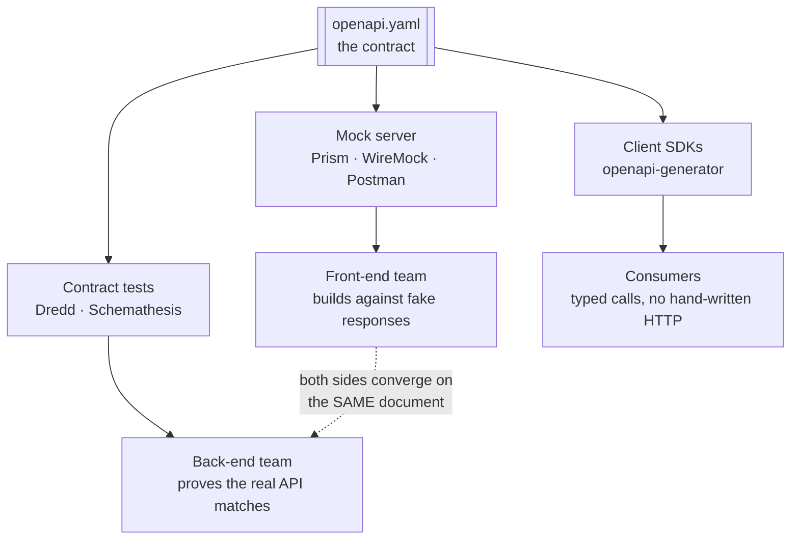

**Worked example** — `openapi.yaml` declares `GET /books/{id}` returning `{id, title, author}`. Run a mock:

```bash
npx @stoplight/prism-cli mock openapi.yaml     # serves on :4010
curl http://localhost:4010/books/1             # → {"id":1,"title":"string","author":"string"}
```

The front-end now builds real screens. When the back-end ships, the URL changes and nothing else does — *if* it honours the contract, which is what the contract tests check.

**Tradeoff / where mocking misleads** — a mock is **schema-shaped, not behaviour-shaped**. It returns the right *fields*; it does not reproduce latency, pagination limits, rate limiting, partial failures, or the awkward real data (empty strings, nulls, 40-character titles). Teams that build entirely against mocks discover all of that on integration day. Use mocks to unblock, then test against something real as early as you can.

**This is what "API-first" actually means in practice.** Design-first isn't a philosophical preference — it's the thing that lets three teams work in parallel off one document instead of serially off each other.

**Mechanism — the seven-step lifecycle**, built around a Books API:

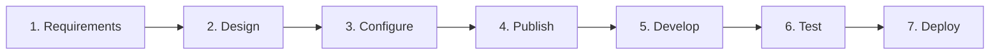

**Worked example — the Books API, end to end:**

**1 · Requirements** — manage books via CRUD: add a book, retrieve details, update information, delete.

**2 · Design** — identify endpoints and the data model.

| Endpoint | Does |
|---|---|
| `GET /books` | List all books |
| `POST /books` | Add a new book |
| `GET /books/{id}` | Retrieve one book |
| `PUT /books/{id}` | Update one book |
| `DELETE /books/{id}` | Delete one book |

```json
{
  "id": integer,
  "title": "string",
  "author": "string",
  "isbn": "string",
  "publishedDate": "string",
  "price": integer
}
```

Note the shape: collection endpoint `/books` for list and create; item endpoint `/books/{id}` for read, update and delete. That pairing is the standard REST layout and is worth being able to reproduce cold.

**3 · Configure** — FastAPI (Python) for development, Uvicorn as the web server, JSON for storage.

**4 · Publish** — FastAPI **auto-generates documentation** at `/docs` — `localhost:8000/docs`. This is the payoff of a written spec: you didn't write the docs.

**5 · Develop** — implement all four methods.
**6 · Test** — `pytest` or `unittest`.
**7 · Deploy** — Heroku, AWS, Google Cloud.

**Tradeoff / the cost of spec-first** — Writing the spec before the code is deliberate friction, and it's wasted if the API is internal, single-consumer, and changing weekly. The value scales with the number of consumers who need to agree, and with how expensive it is to renegotiate later. For a public API it's essential; for a script's helper endpoint it's ceremony.

---

## Part 3 · The three API styles

*The three ways to shape the promise — REST, GraphQL and gRPC — what each is best at, and, more importantly, how to choose between them for a given caller.*

### 5. REST

**Intuition** — REST is not a technology, it's an **architectural style** — Roy Fielding, 2000 — and it's the architecture of the web itself. Its single organising idea: **treat every piece of content as a resource**, give each resource a URI, and manipulate it with HTTP's existing verbs.

**Mechanism**

- Every content item is a **resource**: web pages, images, video, PDFs, dynamic business data.
- Each resource is identified by a **URI** (Uniform Resource Identifier).
- Representations are **JSON or XML**.
- HTTP methods map onto CRUD: `GET` read, `POST` create, `PUT` update, `DELETE` delete. POST/PUT/DELETE require suitable permissions.

*REST is called "stateless", and section 7 leans on the word again, so it's worth pinning down.* **Stateless** means every request carries everything the server needs to handle it — auth token, resource id, body — and the server keeps **no memory of the client between calls**. There is no server-side "session" that request 2 silently depends on from request 1; if the client needs continuity, the client resends the context. Why this earns REST its "mature and ubiquitous" benefit: if the server remembers nothing, **any server instance can answer any request**, so ten identical servers behind a load balancer just work — that's what lets REST scale horizontally. It's also the exact property RPC gives up (see section 7: *"REST is by definition stateless; with RPC state depends on the implementation"*), which is why RPC can be faster but more coupled.

Same resource, two representations:

```xml
<user>
  <id>1</id>
  <name>Shreyas</name>
  <profession>Teacher</profession>
</user>
```

```json
{ "id": 1, "name": "Shreyas", "profession": "Teacher" }
```

**Worked example — the student API.** Note how the *URI* changes meaning by whether an ID is present, while the verb carries the operation:

| Method | URI | Operation |
|---|---|---|
| `GET` | `/institute/students` | Fetch all students |
| `GET` | `/institute/students/123` | Fetch student 123 |
| `POST` | `/institute/students` | Submit student information |
| `PUT` | `/institute/students/123` | Update student 123 |
| `DELETE` | `/institute/students/123` | Delete student 123 |

#### How RESTful is it? The Richardson Maturity Model

*The standard way to grade a REST API — teams adopt REST in levels, not all-or-nothing.*

**Intuition** — Leonard Richardson (QCon 2008) reviewed many REST APIs and found teams adopt REST in **levels**, not all-or-nothing. Martin Fowler popularised them. Most real APIs sit at level 2.

| Level | Name | What it means | Example |
|---|---|---|---|
| **0** | — | Built on HTTP with a **single URI**, no verb conveying intent. Essentially **RPC over the REST protocol** | one `/attendees` endpoint for everything |
| **1** | **Resources** | Introduces resources and models them in the URI — Fowler's analogy: adding **identity** | `GET /attendees/1` |
| **2** | **Verbs (Methods)** | Multiple resource URIs accessed by **different request methods**, chosen by their effect on the server. Guarantees `GET` doesn't change state | adding `PUT /attendees/1`, `DELETE /attendees/1` |
| **3** | **Hypermedia Controls** | **HATEOAS** — Hypertext As The Engine Of Application State. The response carries the actions now possible on the returned object | `GET /attendees/1` returns the update/delete links |

**Tradeoff / why level 3 is rare** — in practical terms, **level 3 is rarely used in modern RESTful HTTP services**. HATEOAS helps flexible UI-style systems but **doesn't suit interservice calls** — it's a chatty experience, and it's usually short-circuited by having the full specification up front. **Aim for level 2**: it projects an understandable resource model with appropriate actions, which reduces coupling and hides the backing service's detail.

**A whole system built this way** — the food-delivery architecture, and the best single diagram here — a preview of microservices (S3):

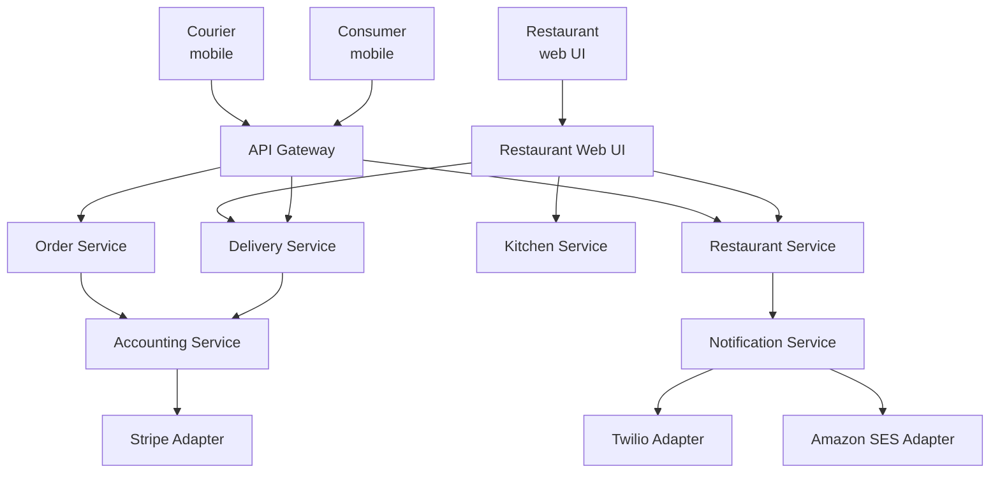

Two points carry the actual lesson: **"Services have APIs"** and **"A service's data is private."** Every service owns its own database; nothing reaches into another service's data. That constraint is what makes independent deployment possible, and it's the microservices idea in one line.

**Benefits and drawbacks — the likeliest exam question in this session:**

| Benefits | Drawbacks |
|---|---|
| **Mature and ubiquitous** — the de facto standard | **Reduced availability** — every synchronous dependency can fail |
| Testing a REST API is simple | **Fetching multiple resources** needs multiple calls |
| Supports synchronous request-response | |
| **No intermediate broker** | |
| Supported by most languages and frameworks | |

The "fetching multiple resources" drawback is the setup for GraphQL: fetching a user's profile, their posts, and comments on those posts takes **three separate API calls**.

**Why this matters for the rest of the course** — most AI services from AWS, Azure and GCP are RESTful. Amazon Bedrock exposes `GET https://bedrock.us-west-2.amazonaws.com/models` and `POST .../models/{model-id}/invoke`, both with access tokens and JSON responses. Hugging Face, LangChain and Prefect are the same. **You will spend this semester calling REST APIs.**

**Tradeoff / when NOT to use REST** — When one screen needs data from many resources, REST's one-resource-per-call shape produces chatty clients and slow mobile screens (→ GraphQL). When two internal services exchange huge volumes and you control both ends, REST's text payloads and HTTP/1.1 overhead are pure waste (→ gRPC).

> ***In practice*** *— what a real REST endpoint has that `GET /students` doesn't show:*
> A production collection endpoint is never just "return everything." Four things you'll build every time:
> - **Pagination** — `GET /students?page=2&limit=50` (or cursor-based `?after=<id>`). Returning 10,000 rows in one response is how you take down your own service.
> - **Filtering & sorting** — `GET /students?branch=CS&sort=-gpa`. The query string is where "which subset" lives.
> - **A consistent error envelope** — not just a `400`, but a JSON body like `{"error": {"code": "invalid_branch", "message": "…"}}` so clients can handle failures programmatically. Consistency across every endpoint is what makes an API pleasant to build against.
> - **Auth on every mutating call** — `Authorization` header checked before `POST`/`PUT`/`DELETE`; the "requires suitable permissions" is this.
>
> Naming conventions that mark a REST API as well-designed: **plural nouns** (`/students` not `/getStudent`), **no verbs in the path** (the HTTP method *is* the verb), and **nesting for relationships** (`/students/123/courses`). Get these right and the API is self-explanatory; get them wrong and every consumer needs the docs open constantly.

---

### 6. GraphQL

**Intuition** — Built by **Facebook in 2015** specifically to fix REST's multiple-round-trips problem. Instead of the server deciding what each endpoint returns, **the client describes exactly the data it wants**, across multiple sources, in **one call**.

**Mechanism**

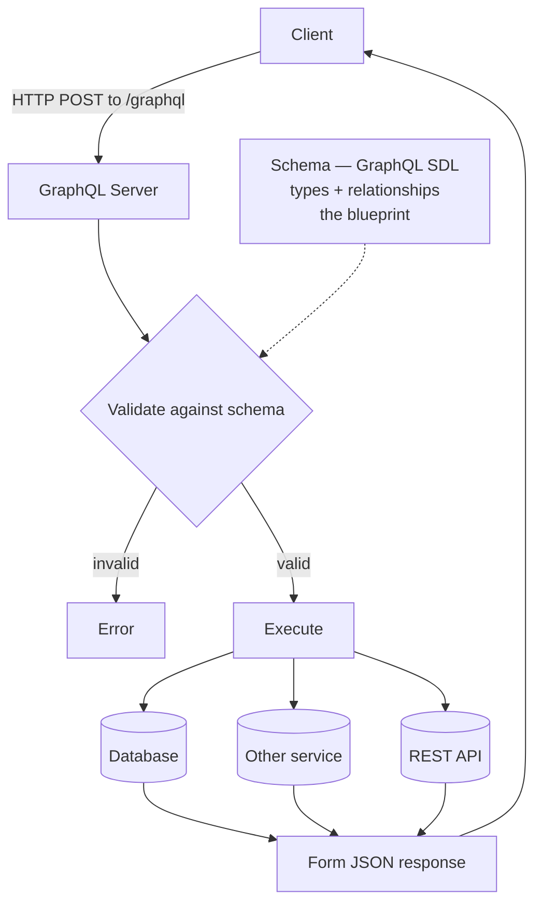

- The server defines a **schema** in **SDL** (Schema Definition Language) before serving anything — the types that can be queried and the relationships between them. It is the **blueprint both server and client understand**.
- A request arrives by **HTTP POST** to a single `/graphql` endpoint.
- The server **validates** it against the schema (you cannot ask for what the schema doesn't support), **executes** it against whatever databases or sources are needed, and **forms a JSON response**.
- Two operation types: **`query`** to fetch, **`mutation`** to insert, update or delete.

**Worked example — the REST-vs-GraphQL comparison.** Fetch a user's profile, their posts, and comments on those posts from a social media app.

REST — three round trips:

```
GET /users/{userId}
GET /users/{userId}/posts
GET /posts/{postId}/comments
```

GraphQL — one:

```graphql
query {
  user(id: "123") {
    id
    name
    posts {
      id
      title
      comments {
        id
        content
      }
    }
  }
}
```

And a simple query with its response, showing the shape-matching that is GraphQL's signature — the response mirrors the query:

```graphql
query {
  books { title author publishedDate }
}
```

```json
{ "data": { "books": [
  { "title": "To Kill a Mockingbird", "author": "Harper Lee", "publishedDate": "July 11, 1960" },
  { "title": "1984", "author": "George Orwell", "publishedDate": "June 8, 1949" }
]}}
```

**Two deployment options on AWS**, from AWS's architecture guidance:

| Option | What it is |
|---|---|
| **Fully managed — AWS AppSync** | A managed GraphQL server coordinating front-end requests with backend services |
| **Self-managed GraphQL** | You run the server yourself |

**Tradeoff / when NOT to use GraphQL** — The comparison table gives REST the win on **request caching**, and that's the big one: HTTP caching works on URLs, and GraphQL sends everything to one URL by POST, so standard caching layers stop helping. GraphQL also moves cost from round trips to server-side query planning, and a badly-shaped client query can be expensive in ways REST's fixed endpoints never allowed. Use it when clients need varied slices of connected data; don't use it for a simple resource CRUD API that caches well.

---

### 7. gRPC

**Intuition** — Start from **RPC** (Remote Procedure Call): make a call to a remote server *look like calling a local function*, for distributed client-server applications. gRPC is Google's 2015 open-source RPC framework, tuned for speed between services.

**Mechanism — how plain RPC works**, which you need before gRPC makes sense:

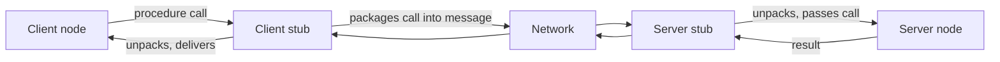

The **stub** is the whole trick: client and server each hold a local object that hides the packing, sending and unpacking, so the caller writes an ordinary function call.

**What gRPC changes:**

| | Plain HTTP APIs | gRPC |
|---|---|---|
| Data format | JSON | **Protocol Buffers** |
| Protocol | HTTP | **HTTP/2** |
| Contract | OpenAPI spec | **`.proto` file** |
| Tooling | — | **`protoc`** compiler |
| Languages | — | **10+** — C#/.NET, C++, Dart, Go, Java, Kotlin, Node, Objective-C, PHP, Python, Ruby |

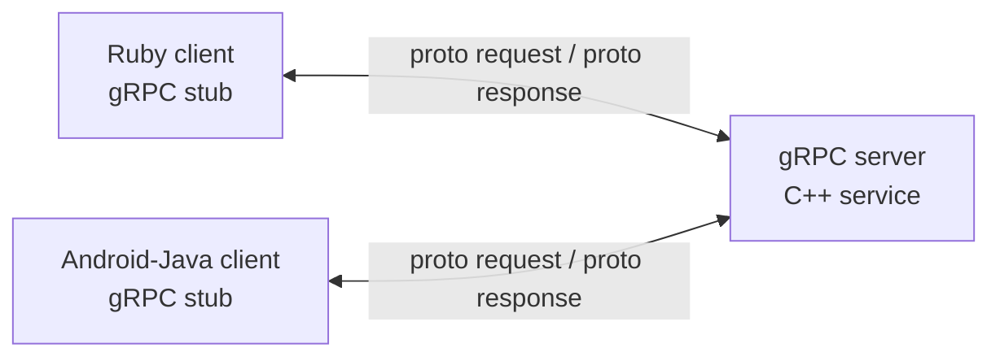

That diagram is the point of gRPC in one picture: **a C++ service, a Ruby client and an Android/Java client, all generated from one `.proto` file.**

**Worked example — the calculator `.proto`:**

```protobuf
syntax = "proto3";

package calculator;

service Calculator {
  rpc Add (AddRequest) returns (AddResponse) {}
  rpc Multiply (MultiplyRequest) returns (MultiplyResponse) {}
}

message AddRequest {
  int32 a = 1;
  int32 b = 2;
}

message AddResponse {
  int32 result = 1;
}
```

Run `protoc` on this and you get, in your language of choice: the message classes, the parsing code, and **both client and server stubs**. You define the API once, language- and platform-neutrally, and generate for many languages — which is the stated reason for using proto files.

*(The numbers `= 1`, `= 2` are field tags identifying fields on the wire, not default values — a common first-read confusion.)*

**The difference that matters most — state:**

> *"A key difference between REST and RPC is state. **REST is by definition stateless** — with RPC **state depends on the implementation**."*

RPC exchanges can accumulate state, which buys **high performance at the potential cost of reliability and routing complexity**. RPC also conveys **exact functionality at a method level**, so producer and consumer end up **more coupled**. And coupling is not always a bad thing — **especially in east–west services where performance is a key consideration**.

**Why HTTP/2 actually helps** — it's often listed as a feature; here's why. HTTP/2 adds **binary compression and framing**: a transparent binary framing layer splits and compresses messages into chunks, enabling **full request/response multiplexing over a single connection**. Fetching 20 attendees over HTTP/1 needs **20 new TCP connections**; over HTTP/2 it's **20 requests on one connection**. gRPC uses HTTP/2 by default and shrinks payloads with a binary protocol.

*(HTTP/3 is coming, built on **QUIC** over UDP.)*

> ***Going deeper*** *— the four call types HTTP/2 multiplexing unlocks; the calculator shows only the first:*
> Because gRPC rides on HTTP/2, a call isn't limited to one-request-one-response. There are **four kinds**, and knowing they exist is most of what the topic is about:
>
> | Type | Shape | Example |
> |---|---|---|
> | **Unary** | 1 request → 1 response (like REST) | `Add(a, b) → sum` — the calculator |
> | **Server streaming** | 1 request → *stream* of responses | "subscribe to stock prices" — one ask, many updates |
> | **Client streaming** | *stream* of requests → 1 response | "upload 10,000 sensor readings" → one ack |
> | **Bidirectional** | both stream at once | live chat, real-time translation |
>
> In the `.proto` you mark it with the `stream` keyword — `rpc Prices(Req) returns (stream Price)`. Streaming is the concrete payoff of HTTP/2 multiplexing, and it's something REST cannot do cleanly — a real reason to reach for gRPC beyond raw speed.

**Advantages and disadvantages:**

| Advantages | Disadvantages |
|---|---|
| Simple, well-defined service interfaces and schema | **May not suit external-facing services** |
| **Polyglot** — many languages | **Browser and mobile support still primitive** (`grpc-Web` extension, limited browsers) |
| Lightweight and fast | |
| **Best for inter-service communication** | |

**Tradeoff / when NOT to use gRPC** — The disadvantages column is the answer, and it's sharp: gRPC is for **service-to-service** traffic where you control both ends. Put it on a public, browser-facing edge and you've chosen a protocol browsers can't natively speak, for consumers who can't debug it with `curl`. The usual architecture is REST or GraphQL at the edge, gRPC behind it.

---

### 7b. North–south vs east–west — how to actually choose

**Intuition** — Which API format is right depends less on the format's features than on **where the traffic comes from**:

| | **North–south** | **East–west** |
|---|---|---|
| Origin | Outside the ecosystem, over the internet | Inside, service-to-service |
| Latency | High, and **compounding** across services | Low, controllable |
| Control | You don't control the consumer | You control **both ends** |
| Implication | Prioritise ubiquity, caching, stability | Can trade readability for **efficiency** |

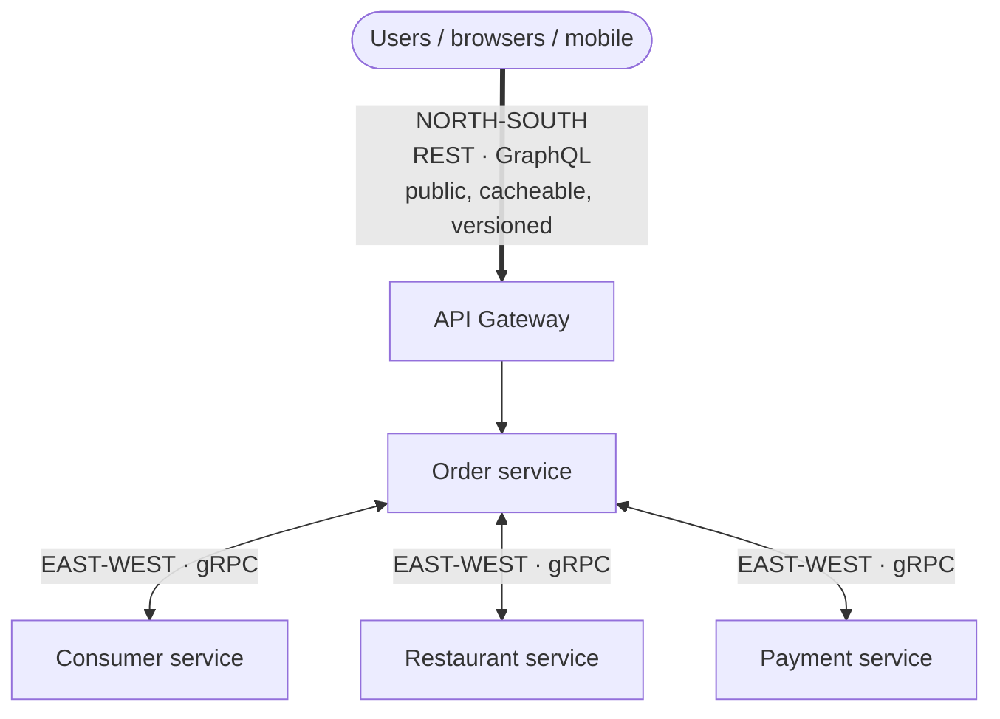

**The axis decides the style.** North–south crosses a trust and control boundary: you don't own the caller, so you need ubiquity, caching and stable versions → REST or GraphQL. East–west stays inside: you own both ends, deploy them together, and care only about speed → gRPC.

**The multiplier that makes this matter:** *"In a microservices-based architecture it is likely that **one north–south request will involve multiple east–west exchanges**."* So east–west inefficiency doesn't stay local — it cascades back to the user.

**Three factors to weigh:**

**High-traffic services** — if exchange frequency is high, payload size and protocol overhead compound, showing up as either transfer cost or total latency.

**Large payloads** — JSON over REST is verbose compared with a fixed or binary representation. And the usual defence is worth attacking directly:

> A common misconception is that **"human readability" is quoted as a primary reason to use JSON**. The number of times a developer will need to read a message, versus the performance consideration, is not a strong case with modern tracing tools… Better logging and error handling can mitigate the human-readable argument.

Also weigh **parsing cost** — turning payloads into language-level objects varies vastly by language, and many traditional server-side languages struggle with JSON versus a binary format.

**Vintage formats** — not every service is modern; older components are an active consideration when evolving an architecture.

**Tradeoff / the decision rule** — **gRPC beats REST when payload bandwidth is a cumulative concern or the service exchanges large volumes of data**, especially east–west where you own both ends. REST wins north–south where ubiquity, caching and consumer independence dominate. This is the same conclusion as the "REST/GraphQL at the edge, gRPC behind it" — but now with the reasoning attached.

---

### 8. Choosing between REST, GraphQL and gRPC

**Intuition** — There is no best API style, only a best fit. The choice falls out of three questions asked in order: **who calls it** (a browser you don't control, or a service you do), **what shape is the data** (a flat resource, or a graph you'd otherwise fetch in five round-trips), and **what does a mistake cost** (a slow page, or a blown latency budget). Answer those and the style picks itself.

The comparison table, close to guaranteed exam material:

| Feature | Best API type |
|---|---|
| Ubiquitous standard for the web | **REST** |
| Data fetch | **GraphQL** |
| Browser support | **REST / GraphQL** |
| Request caching | **REST** |
| Code generation | **gRPC** — native, 10+ languages · GraphQL — GraphQL Code Generator (3rd party) · REST — Swagger (3rd party) |
| Payload data structure | GraphQL — JSON · REST — JSON & XML · gRPC — **Protocol Buffers** |

*The three questions as a decision tree — ask them in this order and the style picks itself:*

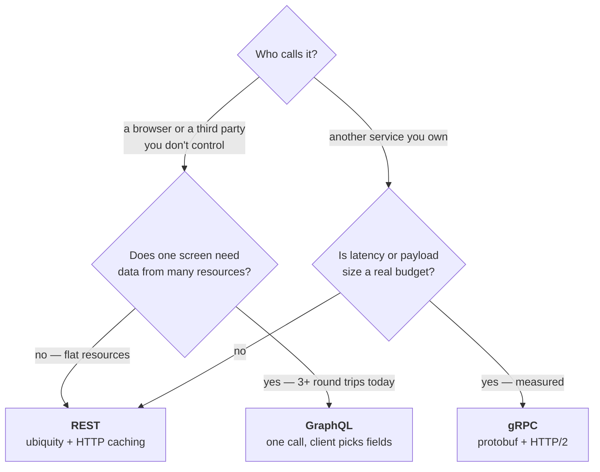

Notice **REST is the destination of two branches**. That's not an accident — it's the default, and the other two need a *measured* reason to win.

**The one-line summary worth carrying:** REST wins on ubiquity and caching, GraphQL wins on fetching connected data in one call, gRPC wins on speed and code generation between services. All three are **synchronous**; if you need asynchrony you're reaching for a broker (section 2), not a different API style.

**Worked example — the same product catalogue, three ways.** A retailer needs product data reaching (a) a public website, (b) a mobile app on poor connections, (c) an internal pricing service called on every page render.

| Consumer | Constraint that decides it | Style | Why the others lose |
|---|---|---|---|
| Public website | Must be cacheable at the CDN; called by code you don't control | **REST** | GraphQL POSTs bypass HTTP caching; gRPC needs a proxy to reach a browser |
| Mobile app | One screen needs product + reviews + stock + related items; four REST calls on 3G is a visible delay | **GraphQL** | REST over-fetches and round-trips; gRPC can't easily do client-driven field selection |
| Internal pricing service | 50 ms budget, called on every render, both sides are your code | **gRPC** | JSON parsing and HTTP/1 overhead eat the budget for no benefit |

The lesson: **one system, three correct answers.** Anyone who says "we're a GraphQL shop" has stopped asking the question.

**Tradeoff / when NOT to choose** — the real cost is rarely the style; it's **running more than one**. Each adds a schema to keep in sync, a toolchain, an auth integration, a monitoring story, and a thing your team must know. A single slightly-wrong style is usually cheaper than two right ones. Default to **REST until a specific pain justifies moving** — measured over-fetching for GraphQL, a measured latency budget for gRPC. Choosing on novelty is how teams acquire three API styles and expertise in none.

**The trap in the table above:** it compares styles on *features*, which invites picking the one with the most ticks. Features don't decide this — consumers do. gRPC's superior speed is worth nothing if the caller is a browser.

---

## Part 4 · Evolution

*How a published contract changes over time without breaking the people who depend on it: what counts as a breaking change, when to version, and how to roll it out.*

### 9. API versioning

**Intuition** — Versioning is managing change to an API **without disrupting clients**. A good strategy communicates what changed and lets consumers upgrade **at their own pace**.

**Why it matters** — when a third-party developer builds an integration against your API, they expect stability. Change it without considering them and you force them to change their software; if they don't, **their applications break**.

**When to version** — versioning is costly in effort for both consumers and developers, so don't do it casually. Version on a **breaking change** — a change that causes client applications to fail:

- Changing the **format** of request or response data (JSON → XML)
- Changing the **data type** of a resource (string → integer)
- Changing the **name** of a resource
- **Removing** resources, or removing/changing properties or methods
- **Adding a new required field** to client requests

That last one catches people — *adding* something can be a breaking change if clients must now supply it.

**Mechanism — where the version actually goes.** Four schemes, and the choice is visible in every request:

| Scheme | Looks like | Trade |
|---|---|---|
| **URI path** | `GET /v2/products/101` | Most common, most visible, easiest to route and cache. But the version is now baked into every client URL, and strictly the resource didn't change — only its representation |
| **Query parameter** | `GET /products/101?version=2` | Easy to default (omit = latest). Clutters the query string and complicates caching |
| **Custom header** | `X-API-Version: 2` | Keeps URLs clean and versions the *representation*, which is more correct. Invisible in a browser address bar and easy to forget |
| **Date-based** | `Stripe-Version: 2024-06-20` | Pins a client to the API as it behaved on a date; the server maintains compatibility shims. Powerful, and the most work to run |

**The rollout sequence** — versioning is a *process*, not a number:

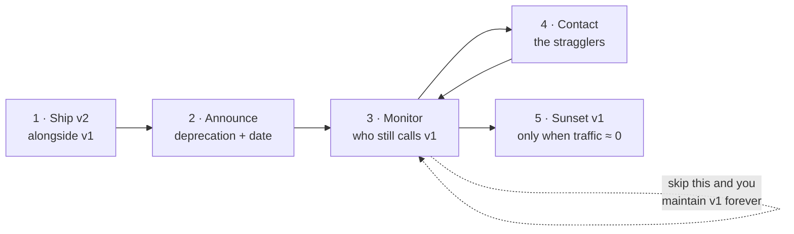

```
1  Ship v2 alongside v1        both live, clients unchanged
2  Announce deprecation        with a date, in docs and response headers
3  Monitor v1 traffic          who is still calling, and how much
4  Contact the stragglers      this is why API keys are per-consumer
5  Sunset v1                   only when traffic is near zero
```

Step 3 is the one teams skip and then regret. If you cannot answer *"who is still on v1?"* you can never safely turn it off, and you maintain both forever.

**Semantic versioning** — a scheme for meaningful version numbers. Form **`X.Y.Z`**, all non-negative integers, no leading zeroes, each element increasing numerically.

| Element | Name | Means | Backward compatible? |
|---|---|---|---|
| **X** | Major | **Incompatible API changes.** Requires creating a new API; the URI routes to the correct host | ❌ No |
| **Y** | Minor | New functionality or bug fixes, announced in change logs | ✅ Yes |
| **Z** | Patch | Bug fixes only | ✅ Yes |

**Worked example — the movies API:**

| Version | What changed |
|---|---|
| 1.0.0 | Initial release — title, director, release year, plot summary |
| 1.1.0 | New feature — search by genre or actor |
| 1.1.1 | Patch — bug fixes in 1.1.0, no new features |
| **2.0.0** | **Major** — new data format, new endpoints; **may not be backward compatible**, clients must update |
| 2.1.0 | New features on 2.0.0, still backward compatible |
| 2.1.1 | Patch on 2.1.0 |

Each version reachable at its own endpoint:

```
/api/v1.0.0/movies
/api/v1.1.0/movies/search
/api/v2.0.0/movies
/api/v2.1.0/movies/search
```

**A real one** — Google Maps JavaScript API is at **3.63.10a** (13 Jan 2026): `3.63` is the major/minor series, `10` the patch within it, and `a`/`b`/`d` are sub-patch identifiers for minor updates and bug-fix builds. Worth noting that a real-world scheme extends semver rather than following it exactly.

**Tradeoff / when NOT to version** — Every live major version is a codebase you maintain, test and secure. Version too eagerly and you're running four APIs; version too late and you break your consumers. The guidance — version only on breaking changes — is the balance point, and it implies the cheaper move is usually **designing the change to be non-breaking** (add an optional field rather than a required one).

> ***In practice*** *— where the version actually goes, and how big APIs handle it:*
> The classic style puts the version in the **URL path** (`/api/v2.0.0/movies`). That's the most common style — visible, easy to route, easy to test in a browser — but real APIs use two other schemes you'll meet:
>
> | Where the version lives | Example | Trade |
> |---|---|---|
> | **URL path** | `GET /v2/movies` | Simplest, most visible; but the URL for "the same resource" changes, which purists dislike |
> | **Header** | `Accept: application/vnd.api+json; version=2` | URL stays clean; but invisible in a browser and easy to forget |
> | **Date-based** (Stripe) | `Stripe-Version: 2024-06-20` | Each account pins a date; Stripe transforms old-shaped responses so you upgrade on your own schedule |
>
> Two career habits the exam won't test but the job will: **deprecation policy** — announce, give a window (6–12 months), monitor who's still on the old version, then sunset — and **most changes should be non-breaking by design**, so you add far fewer major versions than the semver table suggests. In modern practice, teams version **`v1`/`v2`** at the *major* level only and ship minor/patch changes silently — full `X.Y.Z` in the path is rarer than the semver table implies.

---

## Self-study — four APIs to explore

*Self-study picks; each links to its source below.*

| # | What | Where | Why |
|---|---|---|---|
| 1 | **Swagger Petstore** (OpenAPI 3.0) | https://editor.swagger.io/ | Observe the JSON-based API structure |
| 2 | **Rapid API** | https://rapidapi.com/ | World's largest public API marketplace |
| 3 | **Conference API** | *Mastering API Architecture* (O'Reilly) | A book's running example |
| 4 | **AsyncAPI Specification** | https://www.asyncapi.com/en | The async counterpart to OpenAPI — **event-driven architectures** |

AsyncAPI is the one to actually look at: it closes the loop on section 2 by showing that asynchronous APIs have their own description standard, exactly parallel to OpenAPI for synchronous ones.

---

## Lab / build

No lab this session — **549 Lab 1 is at session 5**. But two things are worth doing tonight, both under ten minutes:

1. `curl -X GET "https://jsonplaceholder.typicode.com/posts"` — confirms you can read an API response.
2. Install **Postman**, repeat the same call. You'll need it from lab 3 onward.

Then, if the hour allows: build the Books API from section 4 in FastAPI. It's ~30 lines, it produces auto-generated docs at `/docs`, and it makes every abstract term in this session concrete.

---

*Exam: this session is in scope for the **closed-book mid-sem** (sessions 1–8). Full evaluation, weights, dates and course logistics live once in [`549-master.md`](../549-master.md) — not repeated per session.*
