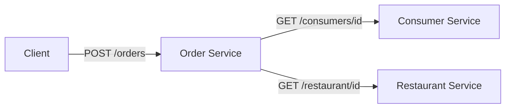
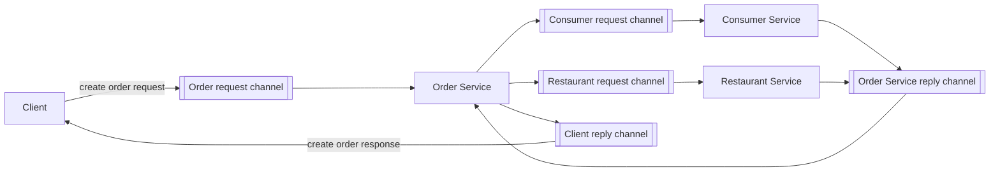
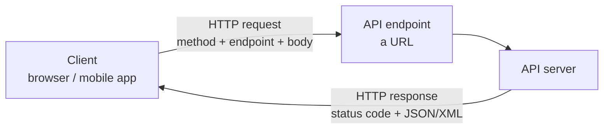
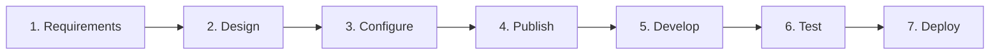
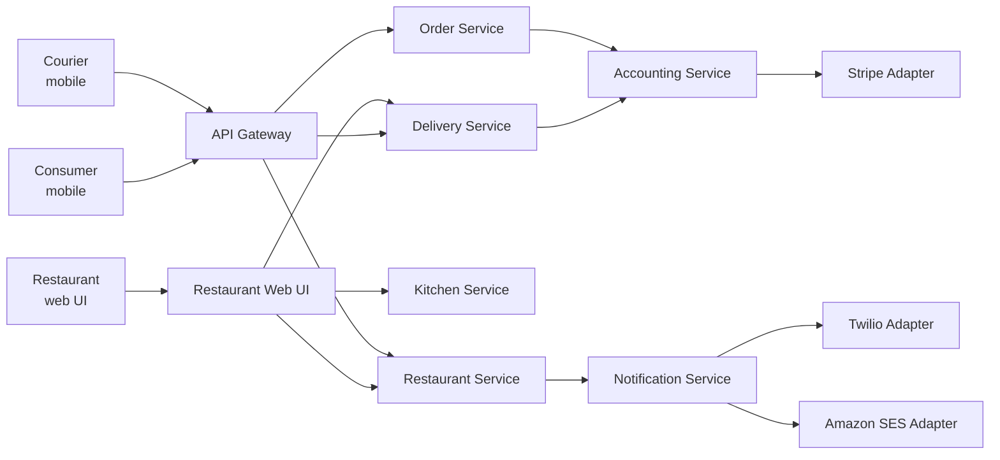
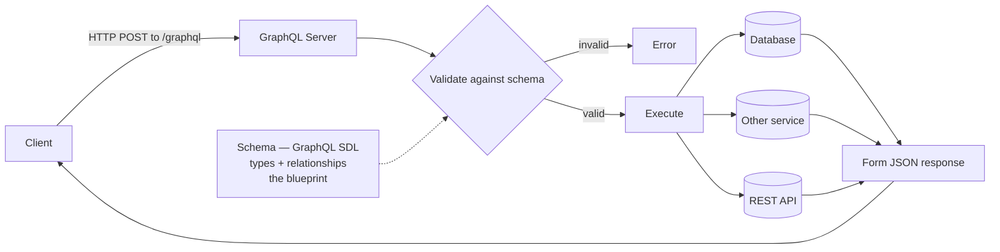
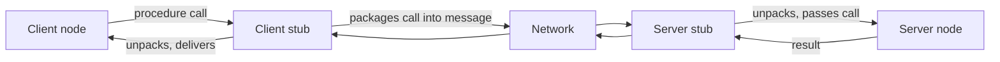
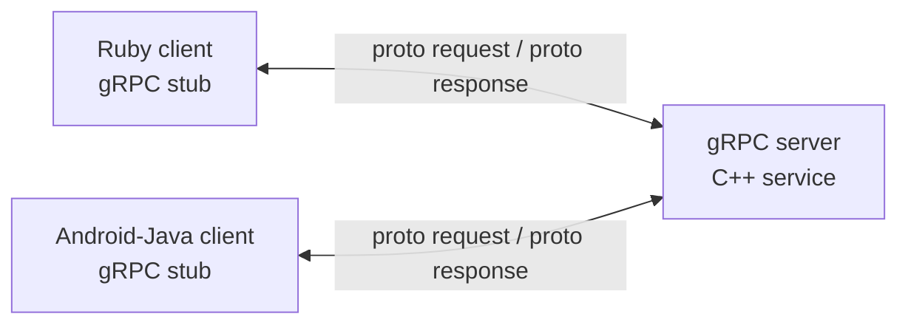

# 549 · Session 01 · API Basics

Exam: **mid-sem (closed book)** | Date learned: 25 Jul 2026 | Instructor: Nithya Ramachandran
Assembled from: `API driven_Lecture 1_25Jul.pptx` (72 sl, 21 images read) · **R2 Gough, Bryant & Auburn ch1** · web references

## What this session is

The **contract** session. An API is a promise between a service and its clients, and this session covers how that promise is written down (OpenAPI), what shapes it can take (REST, GraphQL, gRPC), and how it changes without breaking people (versioning).

It matters beyond 549: **you will spend this entire semester calling REST APIs** — Hugging Face, OpenAI, LangChain, Prefect, Amazon Bedrock. This is the session that makes the rest of the degree's tooling legible.

## How to use this note

| If you have… | Read |
|---|---|
| **10 minutes** | The closed-book cards — the `>` blockquotes |
| **1 hour** (your Tuesday slot) | section 5 REST and section 8 the comparison table. Then run the two `curl` commands in section 3 and section 9 |
| **Before the mid-sem** | All of it. Section 7b (north–south vs east–west) is the framing that makes section 8 answerable |
| **Tonight, 10 minutes** | `curl -X GET "https://jsonplaceholder.typicode.com/posts"` and install Postman |

🔴 **549 has no textbook from session 4 onward.** Sessions 1–3 have R2 and R3 behind them; sessions 4–16 list only *"Web Resources, Lecture Notes."* **Collect every deck and recording, every weekend, without exception** — for this subject they are the syllabus, and a deck you didn't download may be gone.

**How to study 549 generally:** breadth, not depth. Build **one layer-map** — containers → orchestration → serverless → observability — and hang each new tool on a layer with one line about what it does. Never study internals. The CNCF landscape has hundreds of logos; you need the layers, not the logos.

## Topics

**Part 1 — What an API is** *(the contract)*
1. **What an API is** — a contract between a service and its clients; the API-first premise
2. **Synchronous vs asynchronous** — blocked vs non-blocked; REST/gRPC/GraphQL vs message brokers

**Part 2 — HTTP and specification**
3. **HTTP APIs** — endpoints, methods, status codes; the 401-vs-403 distinction
4. **OpenAPI and the API lifecycle** — the seven steps, worked through a Books API in FastAPI

**Part 3 — The three API styles** *(the heart of the session)*
5. **REST** — architectural style, resources and URIs, the **Richardson Maturity Model**, benefits and drawbacks
6. **GraphQL** — Facebook 2015, one call instead of three, schema-first, and where it loses (caching)
7. **gRPC** — RPC, stubs, Protocol Buffers, HTTP/2 multiplexing, `.proto` files
7b. **North–south vs east–west** — the framing that decides which style to use, and why
8. **Choosing between them** — the comparison table, close to guaranteed exam material

**Part 4 — Evolution**
9. **API versioning** — when to version, what counts as a breaking change, semantic versioning `X.Y.Z`

---

## 1. What an API is

*Sources: slides 13–14*

**Intuition** — An API is a **contract between a service and its clients**. It says: send me a request shaped like this, and I promise a response shaped like that. Neither side needs to know how the other is built. That's the whole point — the contract is the product.

**Three definitions from the deck, in increasing usefulness:**

1. "Application Programming Interface" — the acronym, tells you nothing.
2. **A contract between a service and its clients** — the one to remember.
3. A set of rules and protocols for building and interacting with software, enabling systems to exchange data and integrate function **without the end user understanding the underlying code**.

**API-first approach** — the application is *designed as* a set of APIs from the start, rather than having an API bolted on afterwards. The deck flags this term explicitly; it's the premise of the whole course, and it recurs in 546 S9 (designing APIs for ML services).

**Worked example** — Amazon Bedrock exposes `GET /models` to list models and `POST /models/{model-id}/invoke` to run inference. You never see the GPUs, the model weights, or the serving stack. You see a contract. Same for Hugging Face, LangChain and Prefect — which is exactly why this course is API-driven.

**Tradeoff / the cost of the contract** — Once published, the contract binds you. Clients build against it and break when it changes, which is why section 9 (versioning) exists as a topic at all. An internal function can be refactored freely; a published API cannot. **Publishing an API is a commitment, not a feature.**

> **Closed-book card**
> API = **a contract between a service and its clients**. Rules and protocols letting systems exchange data and integrate function without the user knowing the underlying code. **API-first** = the app is designed as a set of APIs. Cost: a published contract binds you — hence versioning.

Cross-link: → `_shared/api-design.md` · **546 S9**

---

## 2. Synchronous vs asynchronous

*Sources: slides 15–17*

**Intuition** — Synchronous means the caller **waits**; the next task can't start until this one finishes (blocked). Asynchronous means the caller doesn't wait; a second task can begin in parallel (non-blocked).

| | Synchronous | Asynchronous |
|---|---|---|
| Caller | **Blocked** until reply | **Non-blocked**, continues immediately |
| Examples | **REST, gRPC, GraphQL** | Message brokers — **RabbitMQ, Apache Kafka, Amazon SQS** |
| Coupling | Caller needs the callee up *now* | Caller only needs the broker up |
| Shape | Request → response | Publish → channel → consume |

**Mechanism — the deck's own example, an order service, both ways.**

Synchronous (REST): the order service calls each downstream service directly and waits.



Asynchronous (message broker): every hop becomes a channel, and nothing blocks.



Note what the second diagram costs: **six channels instead of two direct calls**, plus a broker to run and monitor. That visual is the tradeoff.

**Tradeoff / when NOT to go async** — Asynchronous buys availability (the consumer service can be down and the message waits) and decoupling, and charges you a broker to operate, eventual consistency, harder debugging, and no simple "what did it return?" answer. Use sync when the caller genuinely needs the answer to proceed — a payment authorisation. Use async for work that can complete later — sending the confirmation email.

> **Closed-book card**
> **Synchronous** = caller blocked until the previous task finishes. Ex: **REST, gRPC, GraphQL**. **Asynchronous** = second task starts without waiting, non-blocking. Ex: message brokers — **RabbitMQ, Kafka, SQS**. Async buys availability + decoupling; costs a broker to operate, eventual consistency, harder debugging. Sync when the caller needs the answer to proceed.

---

## 3. HTTP APIs

*Sources: slides 18–24 · transcript Q&A (status-code classes, endpoint anatomy)*

**Intuition** — HTTP APIs are the standard way applications talk over the web, typically browser → server. Three components: **endpoint**, **request**, **response**.



**Endpoints** — simple URLs representing a collection of objects or a single object. Resources live on the server; each endpoint is a URL designed to perform **a single function**. The deck's phrasing is worth keeping: endpoints are the **"doors" or "paths"** through which a client sends requests.

*A student got this wrong in class: an endpoint is **not** just the resource path — it's **host + resource path together**.* Split `https://api.amazon.com/products/101`:

| Part | Example | What it is |
|---|---|---|
| Protocol | `https://` | HTTPS = the secure form |
| Host | `api.amazon.com` | Which server to reach |
| Resource | `/products` | What kind of thing |
| Id | `/101` | Which specific one — present **only** for a single item |

That last part carries the collection-vs-item split (section 4): `/products` = the collection, `/products/101` = one item. Only the id changes what you're addressing.

**Requests** — every request begins by choosing an HTTP **method** (verb). The four map one-to-one onto **CRUD** (Create, Read, Update, Delete) — the same mapping comes back in REST (section 5), so it's worth locking in here:

| Method | Purpose | CRUD |
|---|---|---|
| `GET` | Retrieve data | **R**ead |
| `POST` | Submit data to the server | **C**reate |
| `PUT` | Update existing data | **U**pdate |
| `DELETE` | Delete data | **D**elete |

**Responses** — data sent back after processing, formatted as **JSON or XML**, with a status code.

**Read the first digit first** — it puts every code in one of **five classes**. The instructor drilled this: learn the classes, not just the codes. The quickest way to remember them is to hear what the server is *saying* in each:

| Class | Meaning | What the server is saying | You'll meet |
|---|---|---|---|
| **1xx** | **Informational** — request received, still working | *"Got it, hold on — keep going."* | `100 Continue`, `102 Processing` |
| **2xx** | **Success** | *"Here you go."* | `200 OK`, `201 Created` |
| **3xx** | **Redirection** — resource is elsewhere; go there | *"It's moved — look over there."* | `301`, `302`, `303` |
| **4xx** | **Client error** — the request is wrong | *"You did something wrong."* | `400`, `401`, `403`, `404` |
| **5xx** | **Server error** — the server broke | *"I broke — not your fault."* | `500` |

Memory hook: **4xx is your fault, 5xx is the server's** — the two error classes get mixed up constantly, and that one line settles it.

The codes worth knowing by name:

| Code | Meaning |
|---|---|
| **100 Continue** | Server got the headers, asks the client to send the request body |
| **200 OK** | Successful; server returning the requested data |
| **201 Created** | Request created a new resource |
| **301 Moved Permanently** | Resource has a new URL for good (e.g. an old HTTP URL redirected to HTTPS) |
| **302 Found** | Temporary redirect — resource is elsewhere *for now* |
| **303 See Other** | After a POST, fetch the result with a `GET` at another URL (the "payment successful / order confirmed" page you land on after checkout) |
| **400 Bad Request** | Client's request malformed or contains errors |
| **401 Unauthorized** | Authentication credentials missing or invalid |
| **403 Forbidden** | Client not allowed to access this resource |
| **404 Not Found** | Requested resource does not exist |
| **500 Internal Server Error** | Unexpected server error |

*Which success code when (my clarity — the deck lists both but doesn't pair them to the method):* a `GET` that returns data → **200 OK**; a `POST` that creates a resource → **201 Created**. Both mean "it worked" — 201 adds "…and I made something new," which is why it's the natural reply to POST.

Learn the **401 vs 403** distinction — it's the classic exam pair. 401 = *we don't know who you are*. 403 = *we know who you are and you still can't*.

The **3xx family** is invisible — the browser follows the redirect silently — but constant: type `http://` and land on `https://` (**301**); finish a checkout and get bounced to a confirmation page (**303**). A redirect is not an error — *"the work doesn't stop, it just looks for another URL."*

**Worked example — run this, it takes ten seconds:**

```bash
curl -X GET "https://jsonplaceholder.typicode.com/posts"
```

Method `GET` · endpoint `https://jsonplaceholder.typicode.com/posts` · response = posts in JSON. The deck also suggests trying it in **Postman**, which is worth installing now — you'll want it for labs 3 and 4.

**Tradeoff** — HTTP's ubiquity is its strength and its ceiling. It's text-based, request-per-resource, and carries header overhead on every call. That overhead is invisible for a browser fetching a page and very visible for two internal services exchanging millions of messages — which is the gap gRPC exists to fill (section 7).

> **Closed-book card**
> HTTP API components: **endpoint** (URL = **host + resource path**, one function, the "door"), **request** (method + endpoint), **response** (JSON/XML + status). Methods: **GET** retrieve · **POST** submit · **PUT** update · **DELETE** delete.
> Status **classes by first digit**: **1xx** informational · **2xx** success · **3xx** redirection · **4xx** client error · **5xx** server error. Codes: 200 OK · 201 Created · **301 Moved Permanently** (HTTP→HTTPS) · **303 See Other** (post-checkout confirmation) · 400 Bad Request · 401 Unauthorized (*who are you?*) · 403 Forbidden (*known, still denied*) · 404 Not Found · 500 Internal Server Error.

---

## 4. OpenAPI and the API lifecycle

*Sources: slides 25–31 · openapis.org*

**Intuition** — If an API is a contract, someone has to write the contract down in a form both humans and machines can read. That's **OpenAPI** — an *API description standard*, formerly called Swagger, providing a formal way to describe HTTP APIs, mainly RESTful ones.

**What a written spec buys you** — the deck lists four, and they're the exam answer:

1. People understand how the API works, and how a sequence of APIs work together
2. **Generate client code**
3. **Create tests**
4. **Apply design standards**

**Mechanism — the seven-step lifecycle the deck walks through**, built around a Books API:



**Worked example — the Books API, end to end:**

**1 · Requirements** — manage books via CRUD: add a book, retrieve details, update information, delete.

**2 · Design** — identify endpoints and the data model.

| Endpoint | Does |
|---|---|
| `GET /books` | List all books |
| `POST /books` | Add a new book |
| `GET /books/{id}` | Retrieve one book |
| `PUT /books/{id}` | Update one book |
| `DELETE /books/{id}` | Delete one book |

```json
{
  "id": integer,
  "title": "string",
  "author": "string",
  "isbn": "string",
  "publishedDate": "string",
  "price": integer
}
```

Note the shape: collection endpoint `/books` for list and create; item endpoint `/books/{id}` for read, update and delete. That pairing is the standard REST layout and is worth being able to reproduce cold.

**3 · Configure** — FastAPI (Python) for development, Uvicorn as the web server, JSON for storage.

**4 · Publish** — FastAPI **auto-generates documentation** at `/docs` — `localhost:8000/docs`. This is the payoff of a written spec: you didn't write the docs.

**5 · Develop** — implement all four methods.
**6 · Test** — `pytest` or `unittest`.
**7 · Deploy** — Heroku, AWS, Google Cloud.

**Tradeoff / the cost of spec-first** — Writing the spec before the code is deliberate friction, and it's wasted if the API is internal, single-consumer, and changing weekly. The value scales with the number of consumers who need to agree, and with how expensive it is to renegotiate later. For a public API it's essential; for a script's helper endpoint it's ceremony.

> **Closed-book card**
> **OpenAPI** (formerly **Swagger**) = formal standard for describing HTTP APIs, mainly REST. Buys: shared understanding · **client code generation** · **test creation** · design standards.
> Lifecycle: **Requirements → Design → Configure → Publish → Develop → Test → Deploy.**
> REST endpoint shape: collection `/books` (GET list, POST create) + item `/books/{id}` (GET, PUT, DELETE). Stack in the example: **FastAPI + Uvicorn**, docs auto-generated at `/docs`, tested with pytest.

Cross-link: → `_shared/api-design.md` · **546 S9** (designing APIs for ML services)

---

## 5. REST

*Sources: slides 32–39*

**Intuition** — REST is not a technology, it's an **architectural style** — Roy Fielding, 2000 — and it's the architecture of the web itself. Its single organising idea: **treat every piece of content as a resource**, give each resource a URI, and manipulate it with HTTP's existing verbs.

**Mechanism**

- Every content item is a **resource**: web pages, images, video, PDFs, dynamic business data.
- Each resource is identified by a **URI** (Uniform Resource Identifier).
- Representations are **JSON or XML**.
- HTTP methods map onto CRUD: `GET` read, `POST` create, `PUT` update, `DELETE` delete. POST/PUT/DELETE require suitable permissions.

*The deck names REST as "stateless" but never unpacks it — and section 7 leans on the word again, so it's worth pinning down here (my clarity, drawn from R2's REST-vs-RPC point).* **Stateless** means every request carries everything the server needs to handle it — auth token, resource id, body — and the server keeps **no memory of the client between calls**. There is no server-side "session" that request 2 silently depends on from request 1; if the client needs continuity, the client resends the context. Why this earns REST its "mature and ubiquitous" benefit: if the server remembers nothing, **any server instance can answer any request**, so ten identical servers behind a load balancer just work — that's what lets REST scale horizontally. It's also the exact property RPC gives up (see section 7: *"REST is by definition stateless; with RPC state depends on the implementation"*), which is why RPC can be faster but more coupled.

Same resource, two representations:

```xml
<user>
  <id>1</id>
  <name>Shreyas</name>
  <profession>Teacher</profession>
</user>
```

```json
{ "id": 1, "name": "Shreyas", "profession": "Teacher" }
```

**Worked example — the deck's student API.** Note how the *URI* changes meaning by whether an ID is present, while the verb carries the operation:

| Method | URI | Operation |
|---|---|---|
| `GET` | `/institute/students` | Fetch all students |
| `GET` | `/institute/students/123` | Fetch student 123 |
| `POST` | `/institute/students` | Submit student information |
| `PUT` | `/institute/students/123` | Update student 123 |
| `DELETE` | `/institute/students/123` | Delete student 123 |

### How RESTful is it? The Richardson Maturity Model

*Not in the deck — this is R2 ch1, and it's the standard way to grade a REST API.*

**Intuition** — Leonard Richardson (QCon 2008) reviewed many REST APIs and found teams adopt REST in **levels**, not all-or-nothing. Martin Fowler popularised them. Most real APIs sit at level 2.

| Level | Name | What it means | Example |
|---|---|---|---|
| **0** | — | Built on HTTP with a **single URI**, no verb conveying intent. Essentially **RPC over the REST protocol** | one `/attendees` endpoint for everything |
| **1** | **Resources** | Introduces resources and models them in the URI — Fowler's analogy: adding **identity** | `GET /attendees/1` |
| **2** | **Verbs (Methods)** | Multiple resource URIs accessed by **different request methods**, chosen by their effect on the server. Guarantees `GET` doesn't change state | adding `PUT /attendees/1`, `DELETE /attendees/1` |
| **3** | **Hypermedia Controls** | **HATEOAS** — Hypertext As The Engine Of Application State. The response carries the actions now possible on the returned object | `GET /attendees/1` returns the update/delete links |

**Tradeoff / why level 3 is rare** — R2 is blunt: *"in practical terms level 3 is rarely used in modern RESTful HTTP services."* HATEOAS helps flexible UI-style systems but **doesn't suit interservice calls** — it's a chatty experience, and it's usually short-circuited by having the full specification up front. **Aim for level 2**: it projects an understandable resource model with appropriate actions, which reduces coupling and hides the backing service's detail.

> **Closed-book card**
> **Richardson Maturity Model** (Richardson, QCon 2008; popularised by Fowler): **L0** HTTP + single URI, no verbs = *RPC over REST* · **L1 Resources** — resource URIs, adds *identity* (`GET /attendees/1`) · **L2 Verbs** — multiple methods per URI by effect on server, `GET` guaranteed side-effect-free · **L3 Hypermedia Controls = HATEOAS**, response carries available actions. **Target level 2**; L3 rare — chatty, poor fit for interservice calls.

**A whole system built this way** — the deck's food-delivery architecture, and the best single diagram in the deck because it's a preview of microservices (S3):



Two captions on that slide carry the actual lesson: **"Services have APIs"** and **"A service's data is private."** Every service owns its own database; nothing reaches into another service's data. That constraint is what makes independent deployment possible, and it's the microservices idea in one line.

**Benefits and drawbacks — straight from the deck, and the likeliest exam question in this session:**

| Benefits | Drawbacks |
|---|---|
| **Mature and ubiquitous** — the de facto standard | **Reduced availability** — every synchronous dependency can fail |
| Testing a REST API is simple | **Fetching multiple resources** needs multiple calls |
| Supports synchronous request-response | |
| **No intermediate broker** | |
| Supported by most languages and frameworks | |

The "fetching multiple resources" drawback is the deck's setup for GraphQL: fetching a user's profile, their posts, and comments on those posts takes **three separate API calls**.

**Why this matters for the rest of the course** — most AI services from AWS, Azure and GCP are RESTful. Amazon Bedrock exposes `GET https://bedrock.us-west-2.amazonaws.com/models` and `POST .../models/{model-id}/invoke`, both with access tokens and JSON responses. Hugging Face, LangChain and Prefect are the same. **You will spend this semester calling REST APIs.**

**Tradeoff / when NOT to use REST** — When one screen needs data from many resources, REST's one-resource-per-call shape produces chatty clients and slow mobile screens (→ GraphQL). When two internal services exchange huge volumes and you control both ends, REST's text payloads and HTTP/1.1 overhead are pure waste (→ gRPC).

> **Closed-book card**
> **REST** = architectural style (**Roy Fielding, 2000**), the architecture of the web. Every content item is a **resource**, identified by a **URI**, represented as **JSON/XML**, manipulated by HTTP verbs = CRUD. Collection URI for list/create, item URI (`/x/123`) for read/update/delete.
> **Benefits**: mature & ubiquitous, simple to test, sync request-response, **no broker**, wide language support. **Drawbacks**: **reduced availability**; **fetching multiple resources needs multiple calls** (profile + posts + comments = 3 calls).
> Microservices rule: *services have APIs; a service's data is private.*

---

## 6. GraphQL

*Sources: slides 40–49 · graphql.org · AWS architecture blog*

**Intuition** — Built by **Facebook in 2015** specifically to fix REST's multiple-round-trips problem. Instead of the server deciding what each endpoint returns, **the client describes exactly the data it wants**, across multiple sources, in **one call**.

**Mechanism**



- The server defines a **schema** in **SDL** (Schema Definition Language) before serving anything — the types that can be queried and the relationships between them. It is the **blueprint both server and client understand**.
- A request arrives by **HTTP POST** to a single `/graphql` endpoint.
- The server **validates** it against the schema (you cannot ask for what the schema doesn't support), **executes** it against whatever databases or sources are needed, and **forms a JSON response**.
- Two operation types: **`query`** to fetch, **`mutation`** to insert, update or delete.

**Worked example — the deck's own REST-vs-GraphQL comparison.** Fetch a user's profile, their posts, and comments on those posts from a social media app.

REST — three round trips:

```
GET /users/{userId}
GET /users/{userId}/posts
GET /posts/{postId}/comments
```

GraphQL — one:

```graphql
query {
  user(id: "123") {
    id
    name
    posts {
      id
      title
      comments {
        id
        content
      }
    }
  }
}
```

And a simple query with its response, showing the shape-matching that is GraphQL's signature — the response mirrors the query:

```graphql
query {
  books { title author publishedDate }
}
```

```json
{ "data": { "books": [
  { "title": "To Kill a Mockingbird", "author": "Harper Lee", "publishedDate": "July 11, 1960" },
  { "title": "1984", "author": "George Orwell", "publishedDate": "June 8, 1949" }
]}}
```

**Two deployment options on AWS**, from the AWS architecture blog the deck cites:

| Option | What it is |
|---|---|
| **Fully managed — AWS AppSync** | A managed GraphQL server coordinating front-end requests with backend services |
| **Self-managed GraphQL** | You run the server yourself |

**Tradeoff / when NOT to use GraphQL** — The deck's own comparison table gives REST the win on **request caching**, and that's the big one: HTTP caching works on URLs, and GraphQL sends everything to one URL by POST, so standard caching layers stop helping. GraphQL also moves cost from round trips to server-side query planning, and a badly-shaped client query can be expensive in ways REST's fixed endpoints never allowed. Use it when clients need varied slices of connected data; don't use it for a simple resource CRUD API that caches well.

> **Closed-book card**
> **GraphQL** — **Facebook, 2015**, to fix REST's multiple-round-trips. Client specifies exactly what it wants across multiple sources in **one call**; single-request/all-inclusive-reply. **Schema in SDL** = blueprint, defined up front. Request = **HTTP POST** to `/graphql` → **validate against schema → execute → form JSON**. **`query`** to fetch, **`mutation`** to insert/update/delete. Response mirrors query shape. AWS: **AppSync** (managed) or self-managed.
> Loses to REST on **caching** (one URL, POST, so HTTP caching breaks).

---

## 7. gRPC

*Sources: slides 50–57*

**Intuition** — Start from **RPC** (Remote Procedure Call): make a call to a remote server *look like calling a local function*, for distributed client-server applications. gRPC is Google's 2015 open-source RPC framework, tuned for speed between services.

**Mechanism — how plain RPC works**, which you need before gRPC makes sense:



The **stub** is the whole trick: client and server each hold a local object that hides the packing, sending and unpacking, so the caller writes an ordinary function call.

**What gRPC changes:**

| | Plain HTTP APIs | gRPC |
|---|---|---|
| Data format | JSON | **Protocol Buffers** |
| Protocol | HTTP | **HTTP/2** |
| Contract | OpenAPI spec | **`.proto` file** |
| Tooling | — | **`protoc`** compiler |
| Languages | — | **10+** — C#/.NET, C++, Dart, Go, Java, Kotlin, Node, Objective-C, PHP, Python, Ruby |



That diagram is the point of gRPC in one picture: **a C++ service, a Ruby client and an Android/Java client, all generated from one `.proto` file.**

**Worked example — the deck's calculator `.proto`:**

```protobuf
syntax = "proto3";

package calculator;

service Calculator {
  rpc Add (AddRequest) returns (AddResponse) {}
  rpc Multiply (MultiplyRequest) returns (MultiplyResponse) {}
}

message AddRequest {
  int a = 1;
  int b = 2;
}

message AddResponse {
  int result = 1;
}
```

Run `protoc` on this and you get, in your language of choice: the message classes, the parsing code, and **both client and server stubs**. You define the API once, language- and platform-neutrally, and generate for many languages — which is the deck's stated reason for using proto files.

*(The numbers `= 1`, `= 2` are field tags identifying fields on the wire, not default values — a common first-read confusion. Note also the deck's own typo: `MultiplyResponse` is declared as `MultipleResponse`.)*

**The difference that matters most, from R2 — state:**

> *"A key difference between REST and RPC is state. **REST is by definition stateless** — with RPC **state depends on the implementation**."*

RPC exchanges can accumulate state, which buys **high performance at the potential cost of reliability and routing complexity**. RPC also conveys **exact functionality at a method level**, so producer and consumer end up **more coupled**. R2's judgement is worth quoting: *"Coupling is not always a bad thing, especially in east–west services where performance is a key consideration."*

**Why HTTP/2 actually helps** — the deck lists it as a feature; R2 says why. HTTP/2 adds **binary compression and framing**: a transparent binary framing layer splits and compresses messages into chunks, enabling **full request/response multiplexing over a single connection**. Fetching 20 attendees over HTTP/1 needs **20 new TCP connections**; over HTTP/2 it's **20 requests on one connection**. gRPC uses HTTP/2 by default and shrinks payloads with a binary protocol.

*(R2 also notes HTTP/3 is coming, built on **QUIC** over UDP.)*

**Advantages and disadvantages — from the deck:**

| Advantages | Disadvantages |
|---|---|
| Simple, well-defined service interfaces and schema | **May not suit external-facing services** |
| **Polyglot** — many languages | **Browser and mobile support still primitive** (`grpc-Web` extension, limited browsers) |
| Lightweight and fast | |
| **Best for inter-service communication** | |

**Tradeoff / when NOT to use gRPC** — The disadvantages column is the answer, and it's sharp: gRPC is for **service-to-service** traffic where you control both ends. Put it on a public, browser-facing edge and you've chosen a protocol browsers can't natively speak, for consumers who can't debug it with `curl`. The usual architecture is REST or GraphQL at the edge, gRPC behind it.

> **Closed-book card**
> **RPC** = remote call made to look local, via **client stub → network → server stub**. **gRPC** — **Google, 2015**, open-source RPC framework: **Protocol Buffers** not JSON, **HTTP/2** not HTTP, **`.proto`** file as the API definition, **`protoc`** compiler generates message classes + client and server stubs for **10+ languages**.
> **Advantages**: well-defined schema, polyglot, lightweight and fast, **best for inter-service communication**. **Disadvantages**: **poor fit for external-facing services**; **browser/mobile support primitive** (grpc-Web, limited). Rule of thumb: REST/GraphQL at the edge, gRPC behind it.

---

## 7b. North–south vs east–west — how to actually choose

*Sources: R2 ch1 (absent from the deck, and it's the framing that makes the comparison table usable)*

**Intuition** — Which API format is right depends less on the format's features than on **where the traffic comes from**:

| | **North–south** | **East–west** |
|---|---|---|
| Origin | Outside the ecosystem, over the internet | Inside, service-to-service |
| Latency | High, and **compounding** across services | Low, controllable |
| Control | You don't control the consumer | You control **both ends** |
| Implication | Prioritise ubiquity, caching, stability | Can trade readability for **efficiency** |

**The multiplier that makes this matter:** *"In a microservices-based architecture it is likely that **one north–south request will involve multiple east–west exchanges**."* So east–west inefficiency doesn't stay local — it cascades back to the user.

**Three factors R2 says to weigh:**

**High-traffic services** — if exchange frequency is high, payload size and protocol overhead compound, showing up as either transfer cost or total latency.

**Large payloads** — JSON over REST is verbose compared with a fixed or binary representation. And R2 attacks the usual defence directly:

> A common misconception is that **"human readability" is quoted as a primary reason to use JSON**. The number of times a developer will need to read a message, versus the performance consideration, is not a strong case with modern tracing tools… Better logging and error handling can mitigate the human-readable argument.

Also weigh **parsing cost** — turning payloads into language-level objects varies vastly by language, and many traditional server-side languages struggle with JSON versus a binary format.

**Vintage formats** — not every service is modern; older components are an active consideration when evolving an architecture.

**Tradeoff / the decision rule** — **gRPC beats REST when payload bandwidth is a cumulative concern or the service exchanges large volumes of data**, especially east–west where you own both ends. REST wins north–south where ubiquity, caching and consumer independence dominate. This is the same conclusion as the deck's "REST/GraphQL at the edge, gRPC behind it" — but now with the reasoning attached.

> **Closed-book card**
> **North–south** = traffic from outside, over the internet: high, **compounding** latency; you don't control the consumer → favour REST/GraphQL (ubiquity, caching, stability). **East–west** = service-to-service, you control both ends → can trade readability for efficiency → gRPC.
> Multiplier: **one north–south request usually triggers multiple east–west exchanges**, so east–west inefficiency cascades.
> Weigh: **high-traffic services** (payload size and protocol overhead compound), **large payloads** (JSON verbose; *"human readability" is a weak argument given modern tracing*; parsing cost varies by language), **vintage formats**.
> Rule: **gRPC when bandwidth is a cumulative concern or volumes are large**; REST at the edge.

## 8. Choosing between REST, GraphQL and gRPC

*Sources: slides 58–59*

The deck's comparison table, which is close to guaranteed exam material:

| Feature | Best API type |
|---|---|
| Ubiquitous standard for the web | **REST** |
| Data fetch | **GraphQL** |
| Browser support | **REST / GraphQL** |
| Request caching | **REST** |
| Code generation | **gRPC** — native, 10+ languages · GraphQL — GraphQL Code Generator (3rd party) · REST — Swagger (3rd party) |
| Payload data structure | GraphQL — JSON · REST — JSON & XML · gRPC — **Protocol Buffers** |

**The one-line summary worth carrying into the exam:** REST wins on ubiquity and caching, GraphQL wins on fetching connected data in one call, gRPC wins on speed and code generation between services. All three are **synchronous**; if you need asynchrony you're reaching for a broker (section 2), not a different API style.

> **Closed-book card**
> REST → web standard, **caching**, browser support, JSON & XML, Swagger (3rd-party codegen). GraphQL → **data fetch** in one call, browser support, JSON, GraphQL Code Generator (3rd party). gRPC → **native code generation for 10+ languages**, **Protocol Buffers**, inter-service. All three synchronous.

---

## 9. API versioning

*Sources: slides 60–66 · HubSpot blog · semver*

**Intuition** — Versioning is managing change to an API **without disrupting clients**. A good strategy communicates what changed and lets consumers upgrade **at their own pace**.

**Why it matters** — when a third-party developer builds an integration against your API, they expect stability. Change it without considering them and you force them to change their software; if they don't, **their applications break**.

**When to version** — versioning is costly in effort for both consumers and developers, so don't do it casually. Version on a **breaking change** — a change that causes client applications to fail:

- Changing the **format** of request or response data (JSON → XML)
- Changing the **data type** of a resource (string → integer)
- Changing the **name** of a resource
- **Removing** resources, or removing/changing properties or methods
- **Adding a new required field** to client requests

That last one catches people — *adding* something can be a breaking change if clients must now supply it.

**Semantic versioning** — a scheme for meaningful version numbers. Form **`X.Y.Z`**, all non-negative integers, no leading zeroes, each element increasing numerically.

| Element | Name | Means | Backward compatible? |
|---|---|---|---|
| **X** | Major | **Incompatible API changes.** Requires creating a new API; the URI routes to the correct host | ❌ No |
| **Y** | Minor | New functionality or bug fixes, announced in change logs | ✅ Yes |
| **Z** | Patch | Bug fixes only | ✅ Yes |

**Worked example — the deck's movies API:**

| Version | What changed |
|---|---|
| 1.0.0 | Initial release — title, director, release year, plot summary |
| 1.1.0 | New feature — search by genre or actor |
| 1.1.1 | Patch — bug fixes in 1.1.0, no new features |
| **2.0.0** | **Major** — new data format, new endpoints; **may not be backward compatible**, clients must update |
| 2.1.0 | New features on 2.0.0, still backward compatible |
| 2.1.1 | Patch on 2.1.0 |

Each version reachable at its own endpoint:

```
/api/v1.0.0/movies
/api/v1.1.0/movies/search
/api/v2.0.0/movies
/api/v2.1.0/movies/search
```

**A real one** — Google Maps JavaScript API is at **3.63.10a** (13 Jan 2026): `3.63` is the major/minor series, `10` the patch within it, and `a`/`b`/`d` are sub-patch identifiers for minor updates and bug-fix builds. Worth noting that a real-world scheme extends semver rather than following it exactly.

**Tradeoff / when NOT to version** — Every live major version is a codebase you maintain, test and secure. Version too eagerly and you're running four APIs; version too late and you break your consumers. The deck's guidance — version only on breaking changes — is the balance point, and it implies the cheaper move is usually **designing the change to be non-breaking** (add an optional field rather than a required one).

> **Closed-book card**
> **Versioning** = managing API change without disrupting clients; lets consumers upgrade **at their own pace**. Costly — version only on a **breaking change**: format change (JSON→XML), data type change, resource rename, removing resources/properties/methods, **adding a new required field**.
> **Semantic versioning `X.Y.Z`**: **X major** = incompatible, new API, routed by URI · **Y minor** = new functionality, backward compatible · **Z patch** = bug fixes, backward compatible. Endpoints per version: `/api/v2.0.0/movies`. Real: Google Maps JS API 3.63.10a.

---

## Self-study — four APIs to explore

*Sources: slides 67–71*

| # | What | Where | Why |
|---|---|---|---|
| 1 | **Swagger Petstore** (OpenAPI 3.0) | https://editor.swagger.io/ | Observe the JSON-based API structure |
| 2 | **Rapid API** | https://rapidapi.com/ | World's largest public API marketplace |
| 3 | **Conference API** | R2 Gough et al., *Mastering API Architecture* | The textbook's running example |
| 4 | **AsyncAPI Specification** | https://www.asyncapi.com/en | The async counterpart to OpenAPI — **event-driven architectures** |

AsyncAPI is the one to actually look at: it closes the loop on section 2 by showing that asynchronous APIs have their own description standard, exactly parallel to OpenAPI for synchronous ones.

---

## Admin — ✅ resolved from the recording

| Component | Weight | Detail |
|---|---|---|
| Quiz ×1 | **5%** | ⚠️ date not announced |
| **Assignment / Mini-Project I** | **15%** | ⚠️ date not announced |
| **Assignment / Mini-Project II** | **15%** | ⚠️ date not announced |
| **EC-1 total** | **35%** | |
| Mid-semester test | **30%** | Closed book, 2h, **20 Sep FN** · scope contact sessions **1–8** |
| Comprehensive | **35%** | Open book, 2½h, **6 Dec FN** · scope **1–16** |

The handout's single *"Project/Assignment 30%"* is actually **two 15% assignments plus a 5% quiz**. Her framing: *"It's a bit different from other courses — EC-1 covers a big portion compared to EC-2 and EC-3. EC-2 is 30 and EC-3 open book is 35%, **instead of 40**."*

🔴 **Everything lives in MS Teams** — *"I upload everything in MS Teams. I'll create a folder, and in the course materials everything will be uploaded — the handout, the deck for that particular session, and **whatever code will be used for that session**."* Check the shared folder after every session; the code is there and appears nowhere else.

**Lab tools per the deck (slide 8):** L1 Prefect/Airflow · L2 AWS SageMaker, MLflow · L3 HuggingFace/AWS/OpenAI APIs · L4 Flowise, LangChain, OpenAI · L5 OpenRemote, ThingsBoard.

## Confusions to resolve

- [x] ~~One 30% project or two mini-projects?~~ ✅ **Resolved from the recording — quiz 5% + two assignments at 15% each = 35%.**
- [x] ~~Does R2 need buying?~~ ✅ **Held in `/_library/549-R2-Gough-MasteringAPIArchitecture.pdf`.** Ch1 read; ch2–10 out of scope.
- [ ] **EC-1 dates — not yet announced.** *"Duration, date, session — will let you know before itself."* Watch MS Teams.
- [ ] Is Lab 5 at session 14 or 15?

## Lab / build

No lab this session — **549 Lab 1 is at session 5**. But two things are worth doing tonight, both under ten minutes:

1. `curl -X GET "https://jsonplaceholder.typicode.com/posts"` — confirms you can read an API response.
2. Install **Postman**, repeat the same call. You'll need it from lab 3 onward.

Then, if the hour allows: build the Books API from section 4 in FastAPI. It's ~30 lines, it produces auto-generated docs at `/docs`, and it makes every abstract term in this session concrete.
