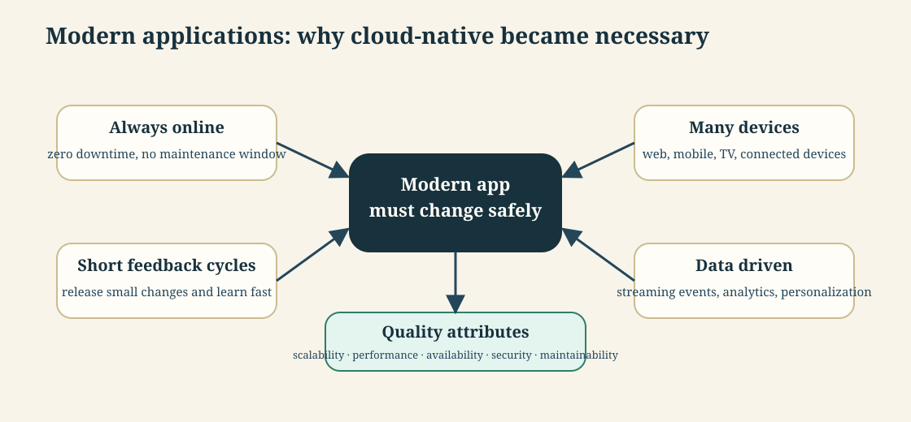
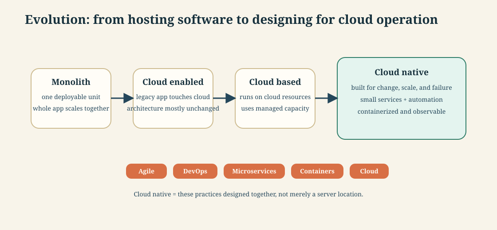
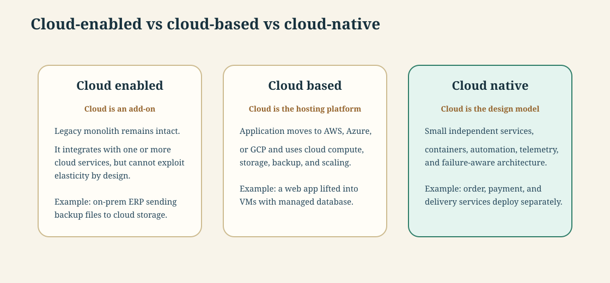
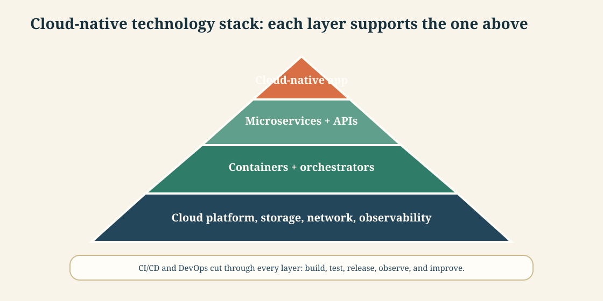
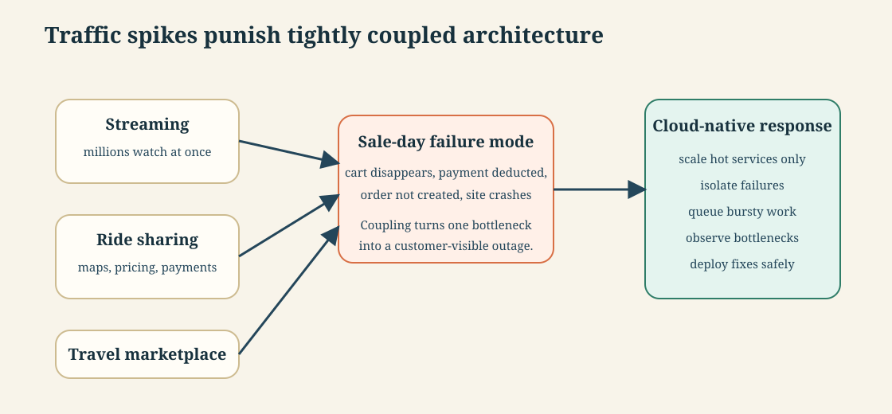

# API-driven Cloud Native Solutions · Session 02 · Cloud Native Application

*Learned 1 Aug 2026*

## Why this matters

Cloud-native is the design style behind systems that must stay available, scale under changing load, deploy frequently, and recover cleanly from failure. This session explains where those pressures come from, how cloud-native architecture responds to them, and how to distinguish cloud-enabled, cloud-based, and cloud-native systems. By the end, you should be able to explain the cloud-native stack and judge when its extra complexity is worth taking on.

## Part 1 · Why modern applications changed

*Modern applications are pressured by always-online users, many devices, high data volume, and fast product feedback. Cloud-native architecture is a response to those pressures.*

### 1. Modern application requirements

**Intuition** — A modern application is not judged only by whether its code runs. It is judged by whether it stays available during traffic spikes, supports many devices, releases improvements quickly, and produces data that can improve the product.

An everyday analogy: a popular restaurant cannot say "kitchen closed for two hours" during dinner rush, cannot serve only people sitting inside, and cannot wait months to improve a disliked item. Modern software faces the same pressure, but at internet scale.



**Mechanism** — The requirements fall into two groups:

| Requirement group | What it means | Architecture pressure |
|---|---|---|
| Zero downtime | users expect the service to stay online even during upgrades or failures | redundancy, rolling deployment, health checks |
| Short feedback cycles | features are released early, measured, and improved | CI/CD, small deployable units, observability |
| Mobile and multi-device support | the same service must support web, phone, TV, and connected devices | API-first design and independent front ends |
| Data driven | application events feed analytics, personalization, and operations | streaming, storage, monitoring, and traceability |
| Quality attributes | scalability, performance, availability, security, maintainability, portability | design constraints, not afterthoughts |

**Worked example** — A streaming app launches a live sports event. Viewers join from phones, TVs, and browsers at the same time. The login service, catalog service, video playback service, recommendation service, and billing service do not have the same load pattern. If the whole application scales as one block, cost rises and one weak component can hurt everything. If each capability can scale and fail independently, the platform can absorb the event.

**Tradeoff / when NOT to use** — Do not over-engineer a small internal tool with full cloud-native machinery. If a ten-person team uses a simple admin app during office hours, one well-managed monolith with backups and basic monitoring may beat microservices, Kubernetes, and complex release automation.

---

### 2. Cloud-native evolution

**Intuition** — Cloud-native is not just "move the application to the cloud." It is the shift from large, slow-changing deployments to systems designed around small services, automation, containers, DevOps, and cloud elasticity.



**Mechanism** — The evolution has several linked shifts:

| Shift | Older model | Cloud-native direction |
|---|---|---|
| Architecture | monolith | microservices around business capabilities |
| Hosting | on-premises hardware | cloud platforms such as AWS, Azure, and GCP |
| Packaging | VM-based deployment | container images |
| Release | traditional CI/CD around one application | pipeline per service, frequent small releases |
| Operation | manual provisioning and recovery | automated scaling, health checks, and observability |

The key formula-like memory hook is:

```text
cloud native = agile + DevOps + microservices + containers + cloud
```

This is not a mathematical equation; it is a design recipe. Leave out one ingredient and the result is weaker: containers without DevOps still release slowly; microservices without observability become hard to debug; cloud hosting without redesign remains mostly cloud-based, not cloud-native.

**Worked example** — Suppose an ecommerce app has catalog, cart, payment, order, and notification capabilities. In the older monolith, a cart bug can delay release of payment fixes because everything deploys together. In a cloud-native design, the cart service can be fixed and redeployed without rebuilding the payment service, as long as the API contracts remain stable.

**Tradeoff / when NOT to use** — Cloud-native evolution adds operational responsibility. If the team cannot monitor services, operate pipelines, or manage incident response, moving from one monolith to many services may reduce reliability instead of improving it.

---

## Part 2 · What cloud-native means

*Cloud-enabled, cloud-based, and cloud-native sound similar but mean different levels of redesign.*

### 3. Cloud-enabled vs cloud-based vs cloud-native

**Intuition** — The difference is whether cloud is an add-on, a place to run, or the way the application is designed. Cloud-enabled uses cloud services around a mostly old application; cloud-based runs on cloud infrastructure; cloud-native is designed from the ground up to take advantage of how the cloud actually delivers compute and services.



**Mechanism** —

| Type | Core idea | What changes | What does not automatically change |
|---|---|---|---|
| Cloud-enabled | a legacy application integrates with cloud services | backup, email, storage, analytics, or one external service | the monolithic architecture and scaling model |
| Cloud-based | the application is hosted on cloud infrastructure | compute, storage, backup, availability options | the application may still be a large coupled unit |
| Cloud-native | the application is built for cloud operation | services, containers, automation, resilience, observability | complexity does not disappear; it moves into platform operation |

One sentence to remember: **cloud is where the application runs; cloud-native is how the application is built and operated.**

Cloud-native and cloud-based also diverge on three practical fronts:

| Focus area | Cloud-based | Cloud-native |
|---|---|---|
| Design | designed mainly for availability | designed assuming failure will happen; microservices contain it |
| Implementation | slower — hardware or software still needs provisioning/setup | faster — deploys as container images, nothing to provision |
| Pricing | more expensive — you own the whole stack (compute, storage, monitoring) | consumption-based — pay only for what runs |

**Worked example** — A payroll system that stores nightly backups in cloud storage is cloud-enabled. The same payroll system moved to an EC2 VM with a managed database is cloud-based. A payroll platform split into employee, tax, approval, notification, and audit services with independent deployments, API contracts, monitoring, and automated rollback is cloud-native.

**Tradeoff / when NOT to use** — Cloud-native redesign is not automatically worth it for stable workloads. If the application changes rarely, has predictable load, and does not need independent team ownership, cloud-based hosting may give enough availability with much lower design cost.

---

### 4. Cloud-native software and technology stack

**Intuition** — Cloud-native software is a set of small, independent, loosely coupled services built and operated with cloud-oriented technologies. The stack matters because each layer supports one operational promise: package, deploy, scale, observe, and change safely.



**Mechanism** — The stack can be read bottom-up:

| Layer | Job | Examples |
|---|---|---|
| Cloud platform | elastic compute, storage, networking, managed services | AWS, Azure, GCP |
| Containers | package code with runtime, libraries, and settings | Docker images |
| Orchestrator | place containers, restart failures, scale replicas | Kubernetes |
| CI/CD and DevOps | build, test, release, and learn quickly | Git, pipelines, automated tests |
| Microservices and APIs | split capabilities and keep contracts stable | order, payment, inventory APIs |
| Observability | prove health and diagnose failures | metrics, logs, traces, alerts |

Cloud-native design also has a failure mindset. Instead of assuming machines, networks, and dependencies always work, the system expects partial failure and contains it.

**Worked example** — A food-delivery platform might package the order service as a Docker image, deploy three replicas on Kubernetes, expose it through an API gateway, monitor latency and error rate, and use a CI/CD pipeline to roll out a fix to only that service. If payment is slow, the order service should degrade or queue safely instead of crashing the whole platform.

**Tradeoff / when NOT to use** — Do not treat the technology pyramid as a shopping list. Adding Kubernetes, service mesh, GitOps, and multiple databases before the application has the scale, team boundaries, or release cadence to justify them creates platform work without business value.

---

## Part 3 · Examples and architecture judgement

*Cloud-native examples are not logo memorization. They teach what happens when traffic, teams, and failure grow faster than a single coupled application can handle.*

### 5. Cloud-native application examples

**Intuition** — Netflix, Uber, Airbnb, ecommerce sale events, and large streaming events all point to the same architectural lesson: high-scale products need independent change, independent scaling, and clear failure boundaries.

**The named cases, with numbers** — Netflix went cloud-native in 2016, rebuilding its streaming platform around microservices. Uber runs over 4,000 independent microservices, monitored through Prometheus, so one team can update or scale a single slice of the app (say, pricing) without touching unrelated ones. Airbnb, live in roughly 65,000 cities, ships about 3,500 microservices a week — a release rate that's only possible because each service deploys on its own, not as part of one shared build.



**Mechanism** — A cloud-native example should be analysed through five questions:

| Question | Why it matters |
|---|---|
| Which capability receives the spike? | Scale only the hot service instead of the whole application |
| Which failure must be isolated? | Prevent payment, cart, or login failures from taking down unrelated flows |
| Which data must stay consistent? | Avoid money deducted without order creation |
| Which work can be queued? | Absorb bursts without making users wait |
| Which metric proves health? | Detect bottlenecks before users report them |

**Worked example** — During a festival sale, a cart service may receive a huge burst while product browsing and payment have different load profiles. If cart, payment, order, inventory, and user sessions are tightly coupled, a cart overload can cause vanished items, failed orders, and payment confusion. A better architecture separates those capabilities, uses queues for bursty order creation, applies idempotency to payment/order creation, and monitors each service separately.

**Tradeoff / when NOT to use** — Do not copy a Netflix-scale architecture for a small product. The useful lesson is not "use thousands of microservices"; it is "choose boundaries where scale, failure, and team ownership differ."

---

## Self-study / Lab / build

Take one application you know, such as food delivery or appointment booking, and classify it three ways:

1. Identify whether it is cloud-enabled, cloud-based, or cloud-native.
2. List the five hottest capabilities during a traffic spike.
3. Decide which one should scale independently first.
4. Name one failure that must not spread to the rest of the system.
5. Sketch the smallest architecture improvement that would reduce that failure.

The useful outcome is not a perfect diagram; it is the ability to justify where cloud-native design earns its complexity.

---

*Exam: this session is in scope for the **closed-book mid-sem** (S1-S8). Full evaluation, weights, dates and course logistics live once in [`549-master.md`](../549-master.md) — not repeated per session.*
