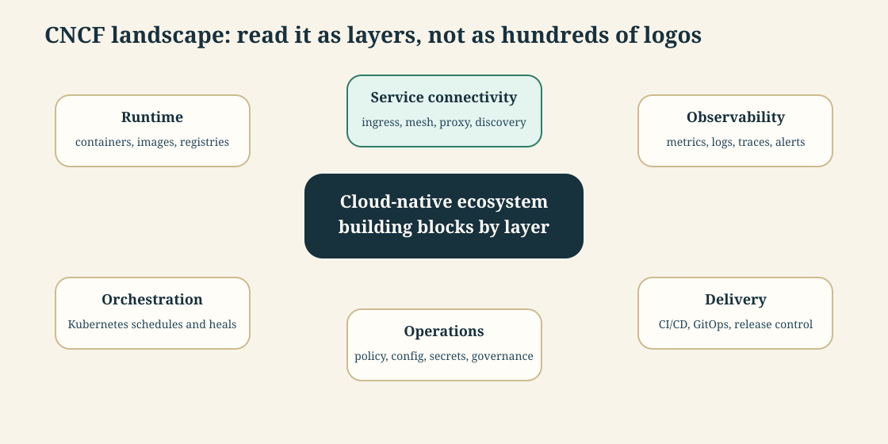
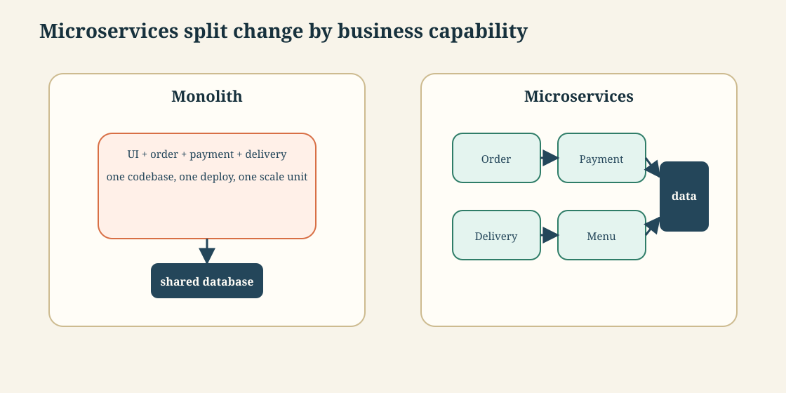
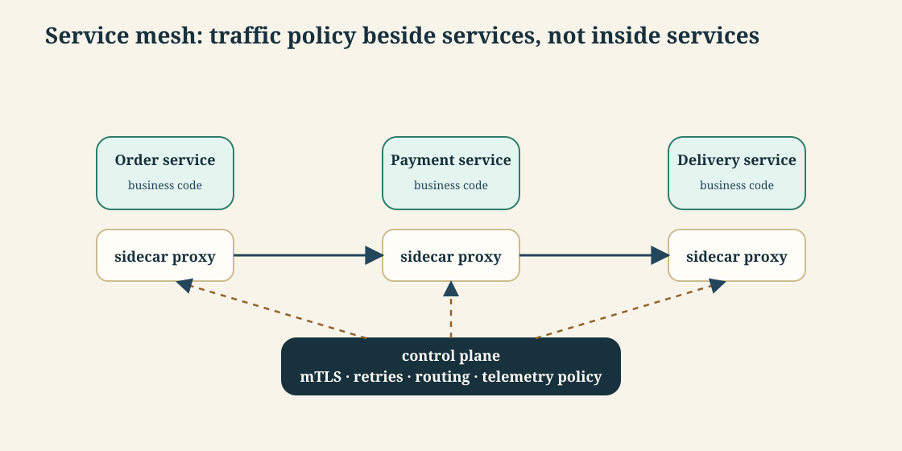
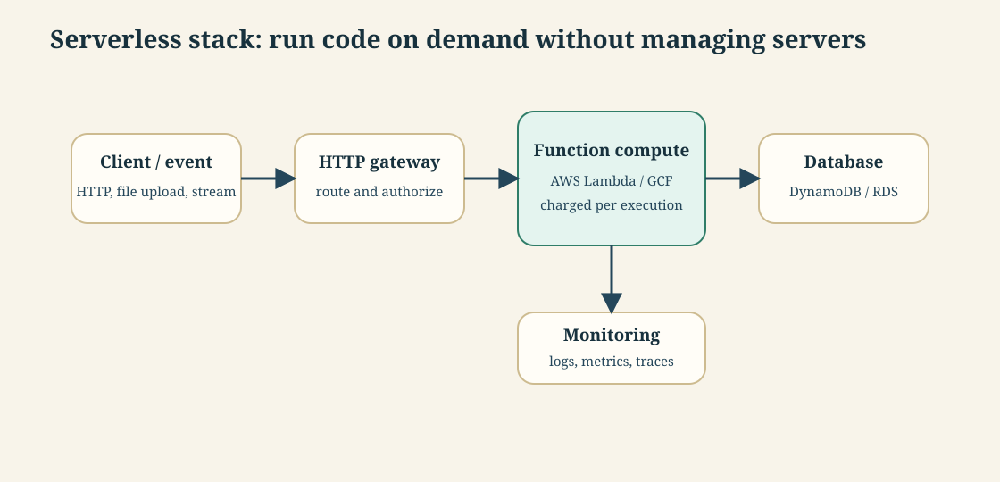
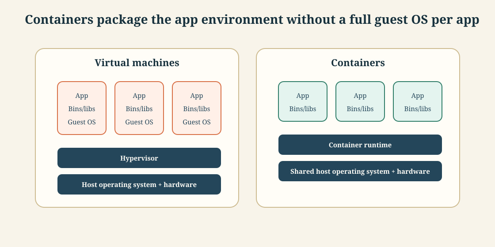
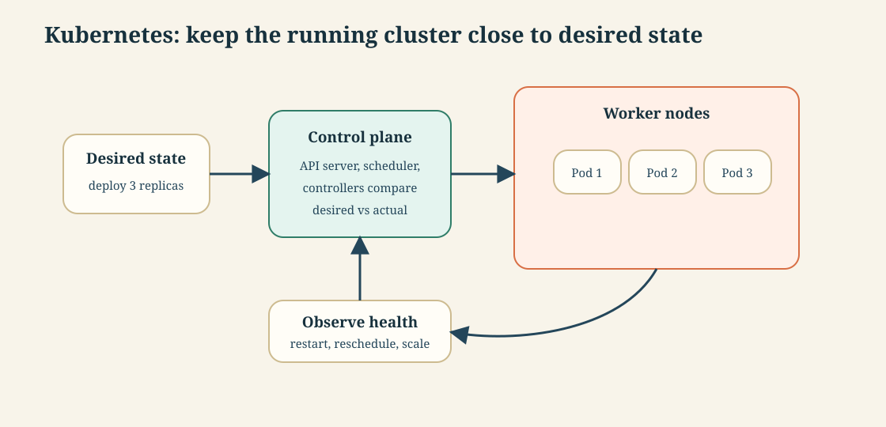
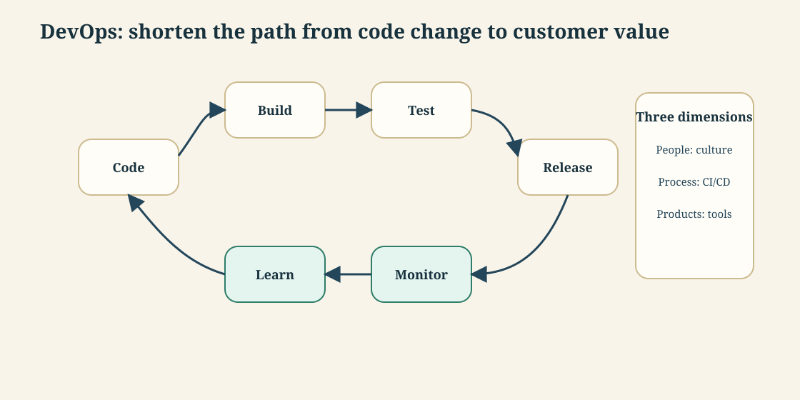
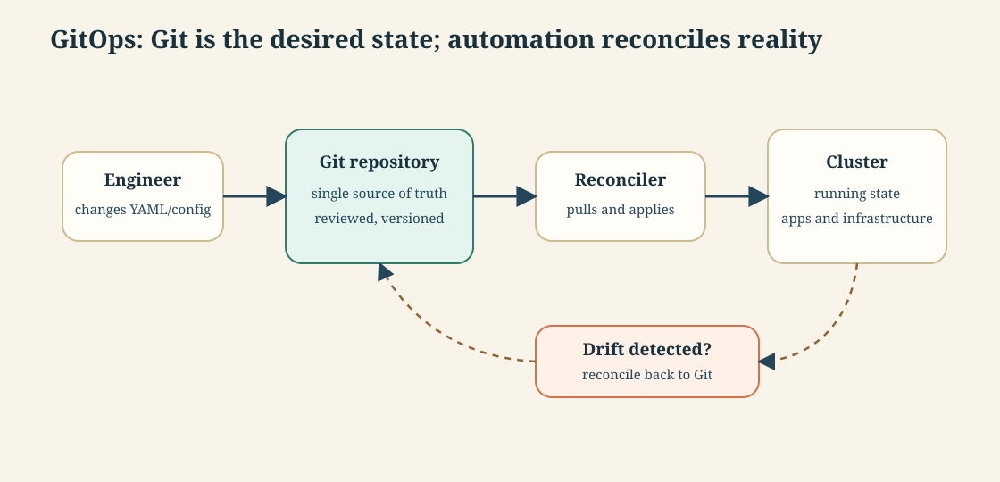
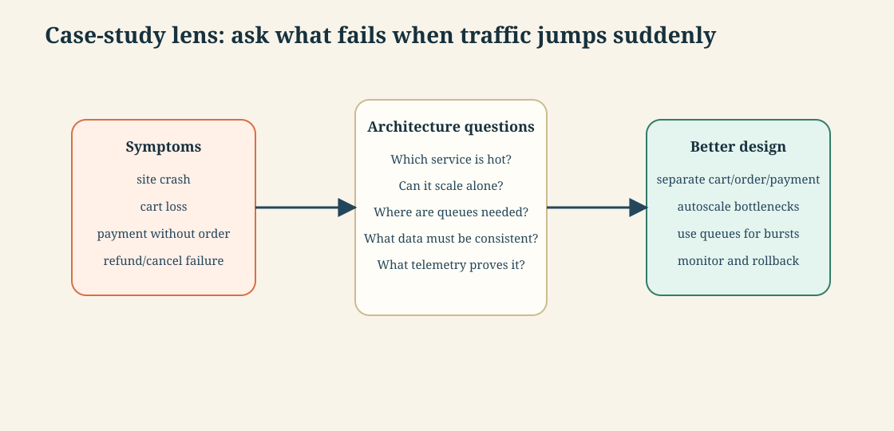

# API-driven Cloud Native Solutions · Session 03 · Cloud Native Application

*Learned 1 Aug 2026*

## Why this matters

Cloud-native work is mostly ecosystem work: choosing the right layer and knowing which tool category solves which operational problem. This session gives the map: CNCF, microservices, service mesh, serverless, DevOps, GitOps, containers, Kubernetes, and architecture case studies. The practical payoff is avoiding tool confusion: you can explain whether a problem is about packaging, orchestration, service-to-service traffic, release automation, or runtime scaling.

---

## Part 1 · Ecosystem map

*The CNCF landscape is easiest to understand as a layered toolbox rather than a page of logos.*

### 1. CNCF landscape and cloud-native ecosystem

**Intuition** — The Cloud Native Computing Foundation is a vendor-neutral home for many open-source cloud-native projects. For study, do not memorize every logo; learn the job each layer performs.

**Mechanism** — The ecosystem groups around recurring operational jobs:

| Layer | Problem it solves | Typical tools or concepts |
|---|---|---|
| Runtime | package and run application processes consistently | containers, images, registries |
| Orchestration | place containers, restart failures, scale replicas | Kubernetes |
| Service connectivity | route requests between services safely | ingress, proxies, service mesh |
| Observability | understand health and diagnose failures | Prometheus, OpenTelemetry-style metrics/traces |
| Delivery | release changes safely and repeatedly | CI/CD, GitOps |
| Operations | manage config, policy, secrets, and governance | Helm-like packaging, policy tools |

**Worked example** — A chatbot backend deployed as a cloud-native service needs a runtime image, an orchestrator to run replicas, an ingress path for user requests, monitoring for latency and errors, a delivery pipeline for new versions, and configuration management for environment-specific settings.

**Tradeoff / when NOT to use** — Do not start tool selection from the CNCF landscape poster. Start from the failure or workflow you need to improve. If the problem is slow releases, a service mesh is not the first fix; CI/CD and tests are.

---

## Part 2 · Application structure

*Microservices split systems by capability; service mesh manages the traffic between those services when the network becomes a product concern.*

### 2. Microservices vs monolith

**Intuition** — A monolith packages many capabilities into one deployable unit. Microservices split capabilities into autonomous, loosely coupled, independently deployable services around business domains.

An everyday analogy: a monolith is one large department where every approval goes through the same desk. Microservices are specialized counters: payment, delivery, menu, support. Each counter can improve its own process, but customers still need the counters to coordinate.

**Mechanism** —

| Aspect | Monolith | Microservices |
|---|---|---|
| Deployment | whole application deploys together | each service can deploy independently |
| Scaling | scale the entire application | scale hot services only |
| Technology choice | one dominant stack | service teams may choose fit-for-purpose stacks |
| Failure boundary | one bug can affect the whole app | failures can be isolated if contracts and timeouts are designed well |
| Operational cost | simpler to run at small scale | more networking, monitoring, CI/CD, and ownership discipline |

Microservices work best when service boundaries follow business capabilities and reasons to change. If payment rules change for different reasons than delivery assignment, those are candidates for different services.

**Worked example** — In a food-delivery system, restaurant search, cart, order, payment, delivery assignment, notification, and support are different capabilities. During dinner peak, search and cart may need more replicas than support. Independent services let those parts scale and release separately.

**Tradeoff / when NOT to use** — A monolith is often better for a small team or early product because local function calls, one deployment, and one database are easier to reason about. Premature microservices create distributed-system failures before the product has enough scale to justify them.

---

### 3. Service mesh

*filled-in reasoning for this syllabus item*

**Intuition** — A service mesh is infrastructure for service-to-service communication. It handles cross-cutting traffic concerns such as retries, timeouts, mutual TLS, routing policy, and telemetry without forcing every service team to write the same networking code.

**Mechanism** — A common service-mesh pattern puts a small proxy beside each service instance. The service talks through its local proxy; proxies talk to other proxies. A control plane distributes traffic policy.

| Concern | Without service mesh | With service mesh |
|---|---|---|
| Retry and timeout | each service implements its own logic | central policy applied consistently |
| mTLS | each service team manages certificates | mesh automates service identity and encryption |
| Traffic shifting | custom deployment or gateway logic | route 5%/50%/100% to a new version |
| Telemetry | each service emits different signals | uniform request metrics and traces |

**Worked example** — Suppose `order-service` calls `payment-service`. Without a mesh, the order code must implement timeout, retry, TLS, and metrics. With a mesh, the order code calls payment normally, while the sidecar proxy enforces retry policy, records latency, and encrypts traffic to the payment proxy.

**Tradeoff / when NOT to use** — Do not add service mesh when there are only a few services and the main problem is still unclear boundaries or missing tests. A mesh improves traffic control; it does not fix bad service design, bad data ownership, or missing observability discipline.

---

## Part 3 · Compute and deployment models

*Serverless, containers, and Kubernetes are three different answers to "how does code run in production?"*

### 4. Serverless computing and serverless stack

**Intuition** — Serverless means developers deploy code or configuration without managing servers directly. The provider runs the infrastructure, scales on demand, and charges mainly when code executes.

**Mechanism** — A typical serverless application combines:

| Component | Job | AWS-style example |
|---|---|---|
| HTTP gateway | receive and route web/API requests | API Gateway |
| Function compute | execute application code on demand | Lambda |
| Database service | persist application state | DynamoDB or RDS |
| Event source | trigger work without a user request | S3 upload, stream, queue, scheduler |
| Monitoring | track executions, failures, and latency | logs and metrics |

Cold start is the key mechanism cost: if no warm function instance exists, the platform creates one before executing the request, adding latency.

**Worked example** — A document-upload API can use an HTTP gateway for `POST /documents`, a function to validate metadata, object storage for the file, a database row for status, and another event-triggered function for asynchronous processing.

**Tradeoff / when NOT to use** — Serverless is weak for long-running tasks, workloads needing deep environment control, and systems where vendor lock-in is unacceptable. Containers or VMs may be better when runtime control and predictable long execution matter more than pay-per-use scaling.

---

### 5. Containers and Docker

**Intuition** — A container is a standardized package containing the application code, runtime, system tools, libraries, and settings needed to run consistently across environments.

The singer analogy is useful: if the venue's microphone or speaker may fail, the singer carries their own. A container carries the software's runtime environment so the deployment venue matters less.

**Mechanism** — Docker popularized container packaging. A container image is built once and run many times. Unlike a virtual machine, a container does not include a full guest operating system per application; containers share the host OS through a container runtime.

| Packaging model | Includes | Strength | Cost |
|---|---|---|---|
| Virtual machine | app, libraries, guest OS | strong isolation, familiar server model | heavier image, slower start, more resource use |
| Container | app, libraries, runtime settings | lightweight, portable, fast start | weaker isolation than VM; needs image and runtime discipline |

**Worked example** — A FastAPI service can be packaged with Python, dependencies, model files, and startup command in one Docker image. The same image can run on a laptop, test server, or Kubernetes cluster, reducing "works on my machine" failures.

**Tradeoff / when NOT to use** — Containers do not remove the need for good configuration, secrets management, vulnerability scanning, or deployment strategy. For a one-off script run locally by one person, a virtual environment may be simpler than building and maintaining an image.

---

### 6. Kubernetes

**Intuition** — Kubernetes is a container orchestration system: it manages the deployment, scaling, and operation of containerized applications. Its core idea is desired state: declare what should be running, and Kubernetes keeps trying to make reality match.

**Mechanism** — Kubernetes has a control plane and worker nodes. The control plane accepts desired state through the API, schedules workloads, and runs controllers. Worker nodes run pods, which are the smallest deployable units Kubernetes manages.

Important ideas:

| Concept | Plain meaning |
|---|---|
| Pod | one or more containers deployed together |
| Deployment | desired replica count and rollout strategy for pods |
| Service | stable network identity for a set of pods |
| Control loop | compare desired state with actual state and correct drift |
| Scaling | change replica count based on demand or policy |

**Worked example** — If the desired state says "run three replicas of order-service" and one pod crashes, Kubernetes detects that actual state is two healthy replicas and starts another pod to return to three.

**Tradeoff / when NOT to use** — Kubernetes has a steep operational cost. If one container on one VM is enough, Kubernetes may add more moving parts than value. It becomes worthwhile when you need repeated deployments, scaling, healing, and many services across environments.

---

## Part 4 · Delivery operating model

*DevOps and GitOps are not runtime technologies; they are ways of making change safer and faster.*

### 7. DevOps and CI/CD

**Intuition** — DevOps aligns development and operations so software can move from idea to production in small, safe, frequent changes. CI/CD is the automation spine of that movement.

**Mechanism** —

| Practice | Meaning | Human gate |
|---|---|---|
| Continuous Integration | developers merge frequently; every change is built and tested | before merge through review/tests |
| Continuous Delivery | build artifact is always ready and may deploy after approval | manual production approval |
| Continuous Deployment | every passing change deploys automatically | no manual production approval |

The difference between delivery and deployment is the production gate. Delivery prepares the release automatically but waits for approval; deployment removes that gate.

**Worked example** — A microservice team pushes a change. The pipeline builds the container image, runs unit tests, runs integration tests, scans dependencies, deploys to staging, runs smoke tests, and either waits for approval or automatically deploys to production depending on the CD model.

**Tradeoff / when NOT to use** — Continuous deployment is risky when tests are weak, observability is poor, or rollback is slow. In regulated systems, continuous delivery with human approval may be the better tradeoff.

---

### 8. GitOps

**Intuition** — GitOps applies DevOps practices to infrastructure and operations. Git becomes the single source of truth for declarative desired state, and automation reconciles the running system to match it.

**Mechanism** — GitOps has four core moves:

| Step | What happens |
|---|---|
| Declare | desired application and infrastructure state is written as code/config |
| Review | changes go through Git review, history, and approval |
| Reconcile | an agent compares Git desired state with cluster actual state |
| Correct drift | if reality differs, automation applies or alerts |

GitOps is especially natural with Kubernetes because Kubernetes resources are already declarative.

**Worked example** — To change `order-service` from version `1.4` to `1.5`, a developer changes the image tag in Git. After review and merge, the GitOps controller detects the change and applies it to the cluster. If someone manually changes the cluster later, the controller notices drift and restores the Git-declared state or alerts.

**Tradeoff / when NOT to use** — GitOps is less useful when infrastructure is small, mostly manual, or not declarative. It also requires discipline: emergency manual fixes must be reconciled back to Git or they will be overwritten or become invisible.

---

## Part 5 · Case-study thinking

*A cloud-native case study is an architecture diagnosis exercise: what failed, why it spread, and which cloud-native capability would contain it.*

### 9. Analysis of a cloud-native application architecture

**Intuition** — A sale-day or streaming-scale case study is not mainly about the brand name. It is about diagnosing bottlenecks, coupling, state consistency, scaling boundaries, and observability.

**Mechanism** — Use this checklist:

| Question | What to look for |
|---|---|
| Traffic pattern | sudden spike, steady growth, or regional concentration |
| Hot capability | login, search, cart, payment, video, recommendation |
| Coupling | whether one overloaded service blocks unrelated flows |
| State risk | cart loss, duplicate payment, inconsistent order status |
| Scaling boundary | whether the hot capability can scale independently |
| Resilience | queues, retries, timeouts, **circuit breakers** (stop calling a dependency that's already failing, instead of retrying into a failure and making it worse — the caller "trips the breaker" and fails fast until the dependency recovers), graceful degradation |
| Observability | metrics and traces that reveal where latency or errors begin |

**Worked example** — If users report that selected products vanish from carts and money is deducted without orders, the likely architecture risks are state inconsistency between cart/order/payment, missing idempotency, overloaded synchronous calls, and weak failure compensation. A cloud-native redesign would isolate cart, order, inventory, and payment; add idempotency keys; queue bursty order creation; and monitor each step.

**Tradeoff / when NOT to use** — Do not answer every case study with "use microservices." Sometimes the best fix is caching, database indexing, queueing, rate limiting, or a rollback strategy. Microservices help only when the failure follows service boundaries that can be separated and operated independently.

---

## Self-study / Lab / build

Draw a one-page architecture diagnosis for an ecommerce flash sale:

1. Mark the hot path: browse -> cart -> order -> payment -> confirmation.
2. Circle the two places where data consistency matters most.
3. Decide which part should be synchronous and which part can be queued.
4. Add one monitoring metric for each service.
5. Name the simplest non-cloud-native solution that might still work for a small sale.

The goal is not a perfect architecture diagram. The goal is to explain why each cloud-native tool belongs to a specific operational problem.

---

*Exam: this session is in scope for the **closed-book mid-sem** (S1-S8). Full evaluation, weights, dates and course logistics live once in [`549-master.md`](../549-master.md) — not repeated per session.*
