# API-driven Cloud Native Solutions · Session 04 · Data Science and Machine Learning

*Learned 3 Sep 2026*

## Why this matters

This session is the hinge between the cloud-native infrastructure of sessions 1-3 and the data/ML pipelines that follow in sessions 5-7. It sets up the vocabulary — Big Data's five V's, what Data Science actually is, who does which job on a data team, and the standard process models — that every later session assumes you already have. After this session you should be able to name what makes data "big," place a role (data engineer, data scientist, ML engineer, ...) on the data-science hierarchy of needs, walk a real dataset through the Big Data Analytics Life Cycle, and describe the six stages a model moves through from an idea to a monitored production system.

**Running example:** a hospital wants to predict which cardiac-surgery patients are at risk in the 30 days after their operation — used throughout this note as the worked case study for the process models.

---

## Big Data and Characteristics

### Data Deluge

**Intuition** — "Big" is not just "more rows in a spreadsheet." It is data arriving continuously, from everywhere, faster than a person could ever read it — the everyday internet already runs at a scale no manual process can keep up with.

**Mechanism** — A snapshot of a single minute of global online activity makes the scale concrete: in 60 seconds, WhatsApp users send 41.6 million messages, Google fields 6.3 million searches, Instagram users send 694K reels via DM, Venmo users send $463K in payments, Twitch viewers watch 48K hours of content, and cyber-criminals launch 30 DDoS attacks — alongside Amazon shoppers spending $455K, DoorDash diners placing $122K in orders, LinkedIn users submitting 6,060 resumes, Airbnb guests logging 747 stays, Facebook users liking 4M posts, ChatGPT users sending 6,944 prompts, fans streaming a Taylor Swift song 69.4K times, and households worldwide streaming 43 years of video content while producing 102 MB of data per average person. None of that is a controlled batch job; it is continuous, overlapping, high-velocity traffic from billions of independent sources.

**Worked example** — Take just three of those numbers and turn them into a daily figure: 41.6M WhatsApp messages/minute × 1,440 minutes/day ≈ 60 billion messages a day; 6.3M Google searches/minute × 1,440 ≈ 9.1 billion searches a day. A single company's infrastructure has to absorb figures like that continuously, not in a nightly batch window.

**Tradeoff / when NOT to use** — Not every organization needs Big-Data-scale infrastructure. A team with a few million rows in a well-indexed relational database does not need a distributed processing stack; adopting one anyway adds operational cost (cluster management, distributed debugging) without a matching benefit. The "data deluge" framing applies once a single machine genuinely cannot store, move, or process the data in the time available — not as a default starting assumption.

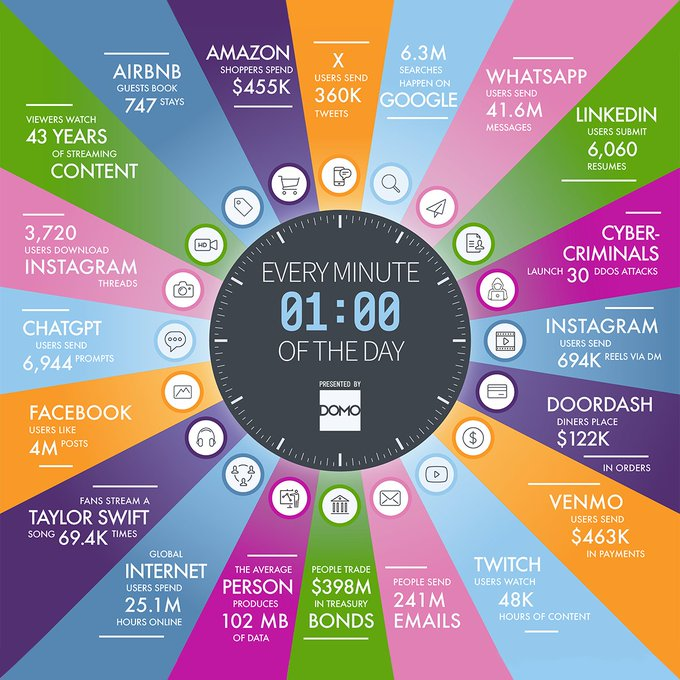

> ***In practice*** — This kind of "internet minute" infographic (this one credited to Domo) is republished yearly precisely because the absolute numbers keep climbing; treat the shape of the picture (many independent high-velocity sources) as the durable lesson, not the specific figures.

### Big Data — the five V's

**Intuition** — Big Data analytics is the discipline of collecting, storing, processing, and analyzing data at a scale where the size, speed, and variety of the data are themselves the engineering problem — not just the analysis that follows.

**Mechanism** — Five properties, known together as Big Data's 5 V's, all in play at once, define whether data counts as "big":

| V | Meaning |
|---|---|
| **Volume** | The amount of data is too large to store, process, and analyze on a single machine. Volumes from IT and IoT systems grow exponentially, but falling cloud storage and processing costs make handling that volume increasingly feasible. |
| **Velocity** | How fast the data is generated. High velocity is what turns a moderate volume into a very large one in a short span of time — it is the *rate*, not just the *count*. |
| **Variety** | The forms the data takes: structured (tables), unstructured (text, image, audio, video), and semi-structured (sensor feeds, logs) data, often all describing the same underlying event. |
| **Veracity** | How accurate and trustworthy the data is. Veracity requires attention to data provenance (where did this reading come from, and can it be trusted) and to cleaning the data to remove noise before any value can be extracted from it. |
| **Value** | The usefulness of the data for its intended purpose. Value is downstream of both veracity (inaccurate data cannot produce trustworthy value) and, for some applications, of speed (a fraud signal has little value if it arrives after the fraudulent transaction clears). |

**Worked example** — IoT air-quality sensors illustrate Value directly: a single pollutant reading from one sensor has almost no value on its own — sensor noise and momentary spikes make any one number unreliable (a veracity problem). The value only appears once many readings are aggregated over a time window into a trend, which raises a genuine design question the slide poses directly: should this data be aggregated before it is processed, and if so, over what window?

**Tradeoff / when NOT to use** — The five V's are a checklist for scoping a problem, not a scorecard to maximize. A dataset can be enormous (high Volume) and still be low-Value if it is not veracious — collecting more low-quality data does not fix a trust problem, and often makes it more expensive to clean. When Volume is the only V present (a large but slow-changing, single-format, well-audited dataset), ordinary database tooling is often still the right choice.

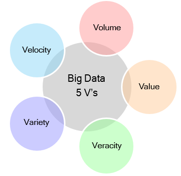

---

## Introduction to Data Science and Machine Learning

### Data Science — definitions

**Intuition** — Data Science is the discipline of turning raw data into a story that leads to a decision. The "science" part is uncovering the insight; the "story" part is what actually persuades a stakeholder to act on it.

**Mechanism** — Several angles on the same idea, all pointing the same direction:
- Data Science is the *study of data* — a systematic discipline, not an ad hoc set of tricks.
- It is the art of uncovering insights and trends hiding *behind* the data — the useful conclusion is rarely sitting on the surface of a raw table.
- It translates data into a story; storytelling is what surfaces the insight, and the insight is what supports a decision or a strategic choice.
- It spans the *whole* lifecycle of "data" — collection, preprocessing, analysis, prediction, visualization (storytelling), and gaining insights — not just the modeling step in the middle.

**Worked example** — In the cardiac-surgery case study used throughout this session, the raw data is a set of electronic health records. Data Science is the full path from those records to the sentence a clinician actually acts on: "this patient's 30-day survival risk is elevated; increase monitoring." The records alone do not say that; the process of collecting, cleaning, aggregating, analyzing and visualizing them is what produces it.

**Tradeoff / when NOT to use** — Not every data task is a Data Science task. A fixed report that answers one already-known question by summing a column does not need the full Data Science process (see the **one-time forecast** discussion under *Key Takeaways*, below) — the label is worth reserving for work that is genuinely uncovering a new insight, not just producing a static report from known logic.

### Data Science — an interdisciplinary field

**Intuition** — No single skill makes someone a data scientist. The role sits at the intersection of three separate skill sets, and different data-science jobs live at different points inside that overlap.

**Mechanism** — Three circles overlap into Data Science: Math and Statistics, Software Development / CS-IT, and Domain or Business Knowledge. The two-way overlaps have their own names — Math/Statistics ∩ CS-IT is Machine Learning; Math/Statistics ∩ Domain Knowledge is Research; CS-IT ∩ Domain Knowledge is Software Engineering applied to a domain — and Data Science sits in the three-way center, where all three are needed at once.

**Worked example** — In the cardiac-surgery study: Math/Statistics supplies the classification techniques (SVM, Random Forest, ANN) and the evaluation metrics (Accuracy, Precision, Recall); CS-IT supplies the pipeline that moves EHR data through extraction, storage and modeling; Domain Knowledge — cardiology, what "30-day survival" clinically means, which pre-operative indicators actually matter — is what turns a statistically valid model into a clinically useful one. Missing any one corner produces a model that is technically correct but practically wrong (statistically sound but clinically meaningless, or clinically plausible but never actually validated).

**Tradeoff / when NOT to use** — Treating Data Science as "the ML corner" alone (Math/Statistics ∩ CS-IT) is the most common mis-scoping: a model built with no domain input can optimise a metric that does not correspond to anything a clinician, or any other domain expert, actually cares about.

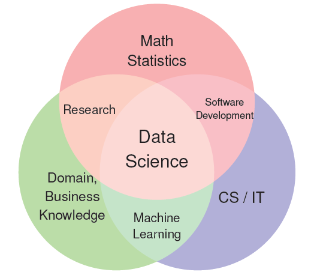

### Supportive technologies for Data Science

**Intuition** — Data Science became practical at today's scale only because four supporting layers matured together; take any one away and the field reverts to a slow, expensive, academic exercise.

**Mechanism** — Four enabling layers:
- **Powerful algorithms** for computation — for example transformer models such as Google's BERT and OpenAI's GPT-4, which made large-scale language and pattern modeling tractable.
- **Open-source software and tools**, principally Python, which removed the licensing and tooling barrier to entry.
- **Computational speed, accuracy, and cost**, driven by cloud computing platforms (Azure, AWS, GCP) that rent compute by the hour instead of requiring capital purchase of hardware.
- **Data storage** that keeps growing in capacity while falling in cost, which is what makes retaining Big-Data-scale history affordable in the first place.

**Worked example** — Running the cardiac-surgery classification models (SVM, Random Forest, ANN) at hospital scale would have been a multi-week batch job on on-premise hardware a decade ago; today the same models can be trained on cloud compute rented for the duration of the job, using open-source libraries, at a small fraction of the cost.

**Tradeoff / when NOT to use** — Cloud compute cost is usage-based, not free: renting GPU-hours for a large transformer workload can exceed the cost of a smaller on-premise setup if the workload runs continuously rather than in short bursts. The "cloud makes ML cheap" argument holds for bursty, exploratory work; it needs re-checking for sustained, always-on training.

### Data Science, AI, and ML convergence

**Intuition** — Artificial Intelligence, Machine Learning and Data Science are not three separate fields lined up side by side — they are nested and overlapping, and in current practice the boundaries between them are dissolving.

**Mechanism** — Artificial Intelligence is the broadest circle (linguistics, vision, robotics, planning, language synthesis, sensor processing). Machine Learning sits mostly inside AI, and covers the specific techniques used to learn patterns from data: decision trees, k-nearest-neighbours (kNN), Bayesian learning, support vector machines, and deep learning. Data Science is a separate but overlapping circle — its distinctive activities are statistics, experimentation, data preparation, process mining, and processing paradigms — and it shares a middle ground with Machine Learning that includes text mining, time series forecasting, and recommendation engines: techniques that are simultaneously "ML methods" and "Data Science deliverables."

**Worked example** — A recommendation engine is a clean illustration of the overlap: building it is Machine Learning work (the underlying algorithm), but deciding *what to recommend, to whom, and why* — and validating that the recommendations actually help the business — is Data Science work layered on top of the same model.

**Tradeoff / when NOT to use** — Treating the three labels as interchangeable causes real confusion in job postings and team design: a "Data Scientist" role that is actually pure ML-engineering work (training and shipping models with no storytelling or business-facing analysis) will frustrate a candidate who expected the broader Data Science remit, and vice versa. Knowing which part of the diagram a role actually sits in avoids that mismatch.

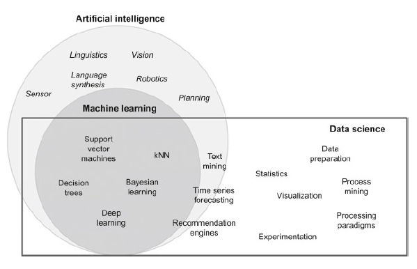

### Roles in a Data Science project

**Intuition** — A Data Science project is not one job; it is a relay, and the case study later in this session walks through exactly which specialist owns which leg.

**Mechanism** — The roles that recur across the rest of this session are: **Data Architect** (designs how data sources map to the pipeline), **Data Engineer** (builds the pipes that move and shape data), **Data Analyst** (validates and cleans data for analysis), **Data Scientist** (builds and evaluates the models), **Data Visualization Engineer** (turns results into something stakeholders can read), and **Machine Learning Engineer** (deploys and operates a model in production). These same six roles reappear, stage by stage, in the case study and in the Big Data Analytics Life Cycle.

**Worked example** — See the *Case Study* section below — each of its nine stages is annotated with the specific role that owns it, which is the fullest worked example of how these roles divide the work in practice.

**Tradeoff / when NOT to use** — In a small team, one person often plays three or four of these roles at once, and forcing a rigid role split before the team is large enough to need it just adds hand-off overhead. The role list is most useful as a checklist of *responsibilities that must be covered*, not as a mandate to hire six separate specialists from day one.

### Key takeaways — from a static report to a monitored production system

**Intuition** — Four short pictures, read in order, tell the story of why "build a model" is the easy 10% of shipping Data Science work, and why a model that never gets monitored is a liability, not an asset.

**Mechanism** — Four stages of maturity:

**I. The ETL foundation.** Before any modeling happens, a Data Engineer builds the plumbing: Extract data from a source, Transform it in a staging area, Load it into a data warehouse, from which Business Intelligence tools read. Nothing "smart" happens here — it is the reliable pipe that everything else depends on.

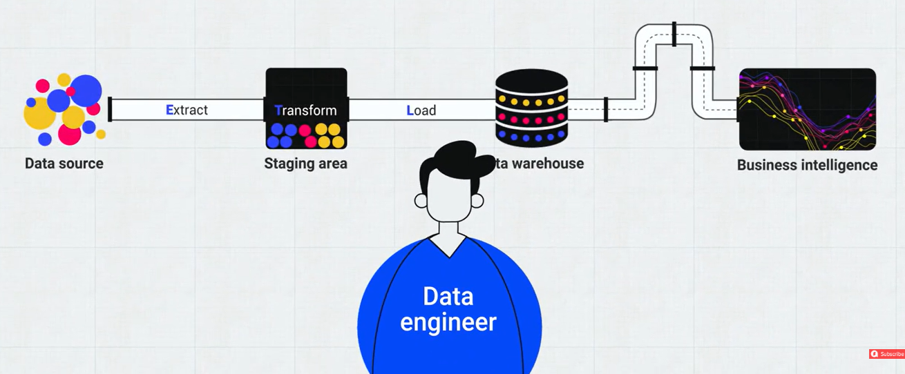

**II. The one-time forecast.** A Data Scientist takes an ML model and runs it once to produce a static answer — for example a one-time forecast across a few future quarters. This is a legitimate, common Data Science deliverable, but it runs once, answers one question, and stops. There is no monitoring loop: if the world changes tomorrow, this forecast does not notice.

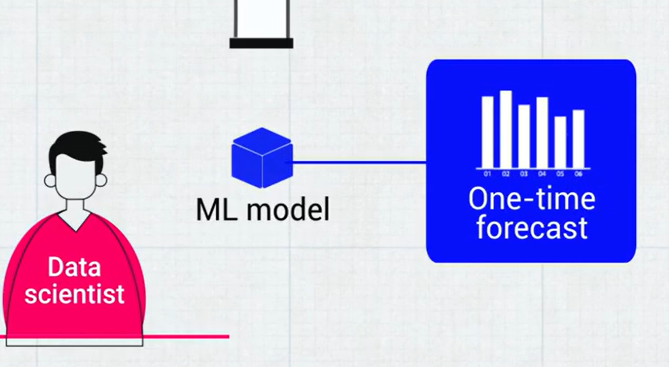

**III. Hidden technical debt.** The widely cited paper *"Hidden Technical Debt in Machine Learning Systems"* (Google, NeurIPS 2015) makes the uncomfortable point concrete with a figure: in a real production ML system, the actual ML code is a small black box surrounded by a much larger set of required infrastructure — configuration, data collection, feature extraction, data verification, machine resource management, analysis tools, process management tools, serving infrastructure, and monitoring. The lesson: budgeting a project as "mostly modeling work" under-counts the engineering effort by a wide margin.

**IV. The production loop.** The full picture an ML Engineer is responsible for: client data and additional data feed an ML model; the model's predictions become prediction data; ground-truth data (what actually happened) is compared against those predictions inside a monitoring-and-analysis step; and that monitoring step feeds back into maintaining and retraining the model. Unlike stage II, this system does not stop after one answer — it keeps checking itself against reality.

**Worked example** — Map the cardiac-surgery model onto stage IV directly: client data = the hospital's EHR extract; ground-truth data = actual 30-day outcomes recorded after surgery; prediction data = the model's risk scores issued before surgery; monitoring and analysis = periodically comparing predicted risk against actual outcomes to check the model has not drifted (e.g., because surgical technique or patient population changed) — the same loop, applied to a hospital rather than a generic diagram.

**Tradeoff / when NOT to use** — Stage II (one-time forecast) is not a lesser version of stage IV that should always be upgraded — building and operating a full monitoring loop (stage IV) costs ongoing engineering effort. A question that will genuinely only be asked once (a one-off board report, a single historical analysis) is correctly served by stage II; the loop in stage IV is worth the investment only when the underlying question will keep being asked as new data arrives.

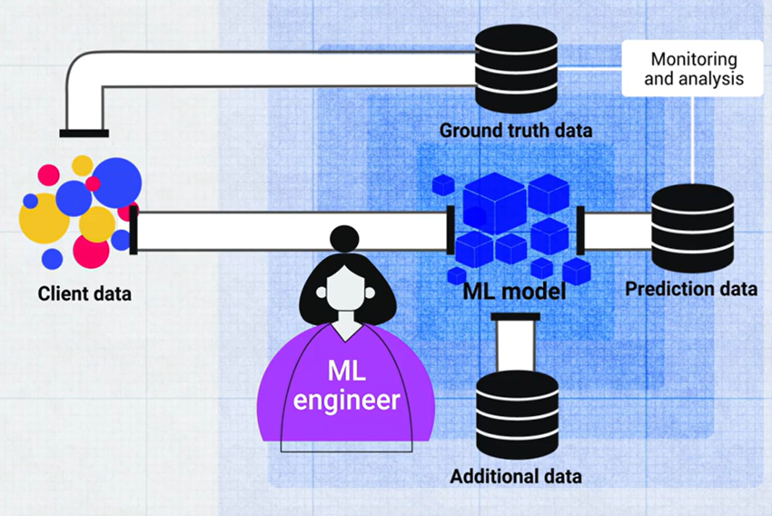

### Data Science — hierarchy of needs

**Intuition** — Before an organization can do AI, it needs analytics; before analytics, it needs clean data; before clean data, it needs reliable pipelines; before pipelines, it needs to actually be collecting the data in the first place. Skipping straight to the top of that stack without the base underneath is why so many "AI initiatives" quietly stall.

**Mechanism** — A six-layer pyramid, bottom to top, each layer a prerequisite for the one above:

| Layer (bottom → top) | What it covers | Primary owner |
|---|---|---|
| Collect | Instrumentation, logging, sensors, external data, user-generated content | Data / Infrastructure Engineer |
| Move / Store | Reliable data flow, pipelines, ETL, structured and unstructured storage | Data Engineer |
| Explore / Transform | Cleaning, anomaly detection, data prep | — |
| Aggregate / Label | Analytics, metrics, segments, aggregates, training data | Data Scientist / Data Analyst |
| Learn / Optimize | A/B testing, experimentation, simple ML algorithms | — |
| AI, Deep Learning | The advanced modeling everyone wants to talk about first | Machine Learning Engineer |

**Worked example** — A hospital that wants an AI system for surgical risk prediction but has no reliable pipeline pulling EHR data into a warehouse is trying to build the top of the pyramid on air. The cardiac-surgery case study's Stages 2-5 (Data Identification through Validation & Cleansing) are exactly the "Collect" and "Move/Store" and "Explore/Transform" layers of this pyramid, done *before* Stage 7's modeling work is possible at all.

**Tradeoff / when NOT to use** — This is a maturity model, not a strict gate — a team can prototype a small model on a clean sample dataset without first building enterprise-grade collection infrastructure for every metric. The pyramid's real warning is about *scaling* an AI initiative organization-wide without the base layers scaling with it, not about banning early experimentation.

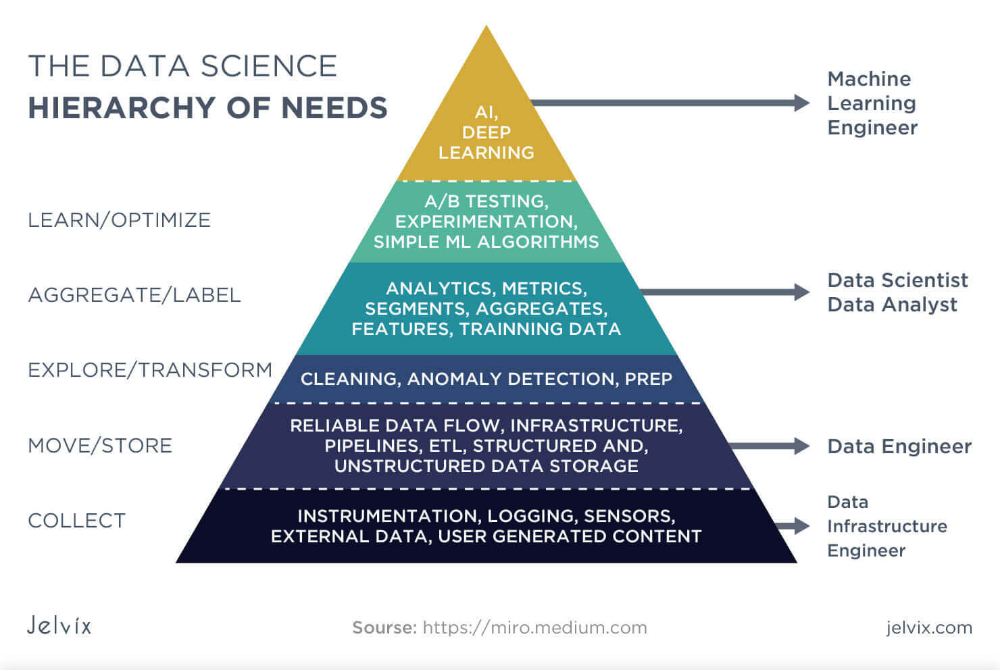

---

## Data Science Process

### Data Science Process / Methodology

**Intuition** — "Do Data Science" is not a repeatable instruction on its own; a *methodology* is what turns it into a repeatable, auditable sequence of steps a team can actually follow and improve.

**Mechanism** — The Data Science process (methodology) is a structured, iterative approach used to extract valuable insight from data, and is widely adopted across industries to tackle complex data-driven problems and build predictive models. Several named methodologies formalise it:

| Methodology | Focus |
|---|---|
| **CRISP-DM** (Cross Industry Standard Process for Data Mining) | General-purpose data-mining process, industry-agnostic |
| **DASC-PM** (Data Science Process Model) | A data-science-specific process model |
| **Big Data Analytics Life Cycle** | Purpose-built for large-scale Big Data analytics projects (detailed next) |
| **SEMMA** (Sample, Explore, Modify, Model, Assess) | Applied specifically to ML projects |

**Worked example** — The case study later in this session follows the Big Data Analytics Life Cycle end to end, from Business Case Evaluation to Utilization of Analysis Results — see that section for the fully worked instance.

**Tradeoff / when NOT to use** — Adopting a heavyweight, nine-stage methodology like the Big Data Analytics Life Cycle for a small, single-analyst exploratory task adds process overhead without benefit; a lighter method (or no formal methodology at all) is appropriate when the data volume and stakeholder count are both small.

### Big Data Analytics Life Cycle

**Intuition** — Nine stages, in a loop, that take a business question all the way to a deployed answer and then back to the next business question — the loop is the point: this is not a one-shot linear project plan.

**Mechanism** — Business Case Evaluation → Data Identification → Data Acquisition & Filtering → Data Extraction → Data Validation & Cleansing → Data Aggregation & Representation → Data Analysis → Data Visualization → Utilization of Analysis Results, which feeds back into a new Business Case Evaluation.

**Worked example** — See the fully worked *Case Study* below — every stage of this cycle is instantiated there against the cardiac-surgery dataset, including which role owns each stage.

**Tradeoff / when NOT to use** — Not every analytics project needs all nine stages as separate, formal gates; a small internal dashboard refresh might collapse stages 2-4 (Identification, Acquisition, Extraction) into a single afternoon's work. The nine-stage breakdown earns its keep when the data sources, stakeholders, or regulatory requirements (as in healthcare data) are complex enough that skipping a stage creates real risk.

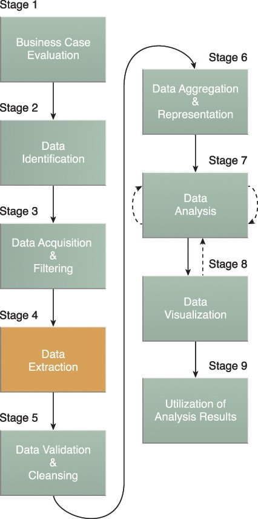

### Case study — predicting patient survival after cardiac surgery

**Intuition** — This is the Big Data Analytics Life Cycle applied for real, under the name *"Predicting Patient Survival After Cardiac Surgery Using Classification Models"*: a hospital wants to predict which patients are at elevated risk of not surviving the 30 days after cardiac surgery, so care teams can add monitoring and preventive measures for the patients who need it most.

**Mechanism** — Nine stages, each with its own objective, activities, and owning role:

| Stage | Objective | Key activities | Owning role |
|---|---|---|---|
| 1. Business Case Evaluation | Define the business goal: predict 30-day post-surgery survival to flag high-risk patients | Cardiologists, surgeons and hospital administrators define the clinical and operational benefit; key performance indicators (KPIs) include reduced post-operative mortality and improved patient management | Stakeholders |
| 2. Data Identification | Identify the data sources needed | Electronic Health Records (EHRs): demographics, pre-operative data (blood pressure, cholesterol), intra-operative data (surgery duration, anesthesia type), post-operative data (complications, ICU stay), plus history and lifestyle factors | Data Architect |
| 3. Data Acquisition & Filtering | Gather and filter the data | Collected from the hospital's EHR system and related databases; filtering at this stage is optional, aimed at removing incomplete records and standardizing date formats | Data Engineer |
| 4. Data Extraction | Pull the specific fields needed | Age, gender, comorbidities, surgery details, recovery indicators — only what is relevant to the use case | Data Engineer |
| 5. Data Validation & Cleansing | Ensure accuracy and reliability | Impute missing values, identify and treat outliers, standardize data types; numeric fields like age and surgery duration are normalized, categorical fields like surgery type are encoded | Data Analyst |
| 6. Data Aggregation & Representation | Represent the data for analysis | Combine pre-, intra- and post-operative data per patient; engineer features such as composite risk scores from multiple health indicators | Data Architect, Data Scientist |
| 7. Data Analysis | Build the predictive classification model | Exploratory Data Analysis (univariate, bivariate, multivariate); train classification algorithms — SVM, Random Forest, ANN; evaluate with Accuracy, Precision, Recall | Data Scientist |
| 8. Data Visualization | Communicate the results | Charts, graphs and dashboards (e.g. Python, Tableau, Power BI) show model performance and which factors are most strongly associated with survival | Data Scientist, Data Visualization Engineer |
| 9. Utilization of Analysis Results | Put the model to work | The predictive model is deployed inside the hospital's clinical decision support system, giving real-time risk predictions for scheduled surgeries so care teams can add monitoring or preventive interventions | Machine Learning Engineer, Business Team, Intervention Team / Program Director, Clinical Staff, IT Team |

**Worked example** — Stage 5 makes the abstraction concrete: a raw EHR extract might have a patient's `surgery_duration` recorded in three different formats across three source systems, several `cholesterol` values missing outright, and a handful of physically impossible ages (e.g. a recorded age of 180). Data Validation & Cleansing is the stage where those get fixed — imputing the missing cholesterol values, correcting or dropping the impossible ages, and normalizing `surgery_duration` to one unit — *before* Stage 6 tries to build a composite risk score out of them, because a risk score built on unvalidated inputs is worse than no risk score at all.

**Tradeoff / when NOT to use** — This nine-stage rigor is proportionate to the stakes: a clinical model whose false negatives mean a preventable death justifies the full pipeline, including hand-offs to a Data Architect and a dedicated Data Analyst. A low-stakes internal exploration (e.g. "does surgery duration correlate with cost?") does not need nine formally staffed stages with a dedicated Data Architect and Analyst — a single analyst working through the same *ideas* informally is proportionate there.

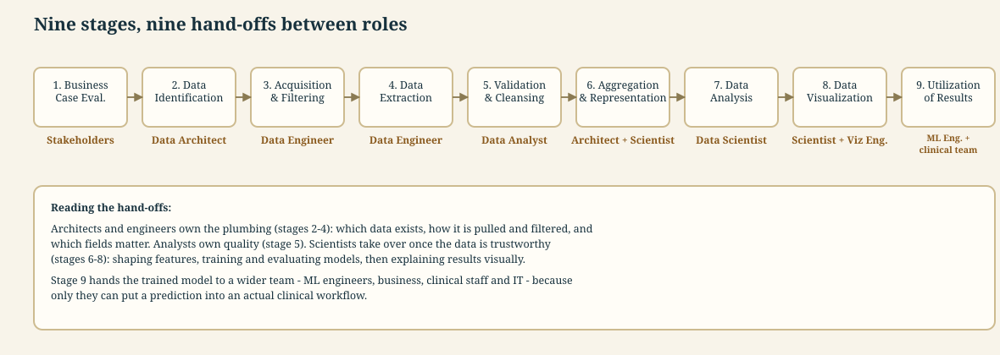

---

## Machine Learning Lifecycle

### The Machine Learning lifecycle

**Intuition** — Training a model is one stage out of six. A model that is trained but never planned against a real business metric, never evaluated against a held-out test set, or never monitored after deployment is not actually finished — it is just started.

**Mechanism** — Six stages, run as a loop:

1. **Planning** — assess project scope, define success metrics, and check feasibility: is the data available, is the approach legally and ethically sound, and are the needed resources realistic?
2. **Data Preparation** — collect and label data, clean it (impute missing values, handle mislabeled records, remove outliers), process it (feature selection, feature engineering, normalisation), and manage it (storage, versioning, metadata).
3. **Model Engineering** — build and train the model: choose an architecture, define training metrics, train and validate, track experiments, and where needed compress or ensemble models.
4. **Model Evaluation** — test the finalised model on held-out data, check it meets the success metrics defined during Planning, and validate its robustness on realistic, not just clean, data.
5. **Model Deployment** — ship the model to where it needs to run (cloud, local server, browser, edge device), matching inference-hardware requirements, often using a staged rollout such as A/B testing.
6. **Monitoring & Maintenance** — continuously track the model's prediction quality and the surrounding system's health; alert on anomalies or degraded performance; trigger retraining when needed, feeding back into Planning for the next iteration.

*⚠️ This lifecycle is not shown as a single named diagram in this session's material — the six-stage breakdown above follows the widely used CRISP-ML(Q) framing, kept here because the handout requires this sub-topic and it teaches cleanly alongside the Big Data Analytics Life Cycle and the *Key takeaways* production loop above.*

**Worked example** — Applied to the cardiac-surgery model: Planning defines success as "flag high-risk patients with acceptable precision/recall before surgery"; Data Preparation is Stages 2-6 of the case study; Model Engineering and Evaluation are Stage 7; Deployment is Stage 9's clinical decision-support integration; Monitoring & Maintenance is the ongoing check (from the *Key takeaways* production loop) that predicted risk still tracks actual 30-day outcomes as surgical practice and patient mix change over time.

**Tradeoff / when NOT to use** — Running the full six-stage loop for every small model change is wasteful; a minor retraining on a fixed feature set with an already-validated pipeline can skip straight from Data Preparation to Model Engineering without re-running the full Planning and Evaluation ceremony. The loop earns its cost when the model, the data, or the deployment target has changed enough that the old success criteria may no longer hold.

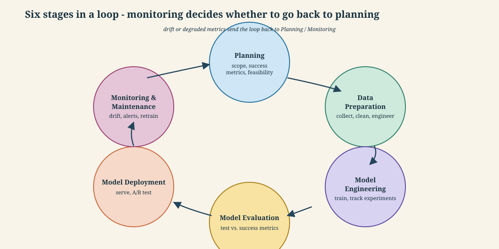

---

## Self-study / Lab / build

No lab is assigned to this session — Lab 1 (the API-driven data pipeline) lands in Session 05, which is where hands-on Prefect work starts. For self-study here: sketch your own organization (or this course's project) against the *Data Science hierarchy of needs* — which layers are solid, which are missing — and identify which of the six named roles are actually covered today versus assumed to happen automatically.

---

*Exam: this session is in scope for the **closed-book mid-sem** (contact sessions 1-8) and the **open-book comprehensive** (all sessions). Full evaluation weights, dates and course logistics live once in [`549-master.md`](../549-master.md) — not repeated per session.*
