# API-driven Cloud Native Solutions · Session 05 · Building an API-driven Cloud-native Data Pipeline

*Learned 3 Sep 2026*

## Why this matters

Session 04 gave you the vocabulary for what Big Data and Data Science are; this session gives you the operating discipline for actually running a data pipeline in production. DataOps is DevOps re-applied to a harder problem — data keeps changing shape and source, not just behavior — and this session works through the full stack of that discipline: why it exists, how to architect and orchestrate a pipeline (with Prefect), how to wire in CI/CD (with GitHub Actions), and the two dozen concrete reliability practices that separate a pipeline that runs once from one that survives production for years. Every practice below is something you will use directly in Lab 1.

**Running example:** a daily pipeline that ingests customer data and feeds a downstream reporting model — the same scenario this session's own capstone and production-readiness review use, reused throughout this note to keep every practice grounded in one concrete pipeline.

---

## Part 1 · Why DataOps

### DataOps: DevOps meets Data Science

**Intuition** — DevOps assumes that once code passes its tests, it behaves the same way every time it runs. Data does not behave that way: sources appear and disappear, schemas drift, and exploratory analysis is inherently less predictable than writing application code. Applying DevOps practices to data work unmodified does not work — DataOps is what DevOps looks like once you take that difference seriously. Adoption of DevOps into the data-science discipline has been slow and gradual precisely because of this: Data Science, and Data Exploration in particular, is a more exploratory process than software development, and it runs into real bottlenecks that application development does not — constantly changing Data Collection sources, effortful Data Cleansing, open-ended Data Exploration (univariate, bivariate, and multivariate analysis), and pipeline environments that are simply more difficult to reproduce than application environments.

**Mechanism** — DataOps is a way to streamline, manage, and automate data flow within an organization: it implements DevOps strategies over data ingestion, transformation, processing, and analysis, reducing the time and resources needed to manage the infrastructure around them. DataKitchen's definition makes the ingredients explicit:

> DataOps = Agile Practices + Lean Thinking + Data Analytics + DevOps

Agile Practices keep the team working on the right things for the right people. Lean Thinking targets waste and bottlenecks, improves quality, monitors data flow, and makes data cheaper for consumers. DevOps practices build a culture of collaboration between teams that used to be siloed. Data Analytics spans descriptive, diagnostic, predictive, and prescriptive work. Gartner independently defines DataOps in similar terms, as a collaborative data-management practice aimed at improving the communication, integration, and automation of data flows across an organization. Put together, DataOps brings self-contained teams of Data Analysts, Data Scientists, Data Engineers, Machine Learning Engineers, and DevOps Engineers around one pipeline, borrowing concrete practices straight from DevOps: source code management (Git), Continuous Integration, Continuous Delivery, Continuous Deployment, Operations (monitoring and logging — observability), and a culture of collaboration and communication.

DataOps is a team sport, not one role's job: data producers clarify meaning, freshness, and ownership; data engineers build reliable ingestion and transformation paths; data scientists develop features, experiments, and models; analytics engineers shape trusted analytical datasets; platform and DevOps engineers provide automation and runtime reliability; governance and security teams define controls without blocking delivery.

**Worked example** — For the running example (a daily customer-data pipeline feeding a reporting model): the source system's owner is the data producer; a data engineer builds and operates the ingestion and transformation; a data scientist owns the reporting model's features; an analytics engineer curates the trusted dataset the model reads from; a platform engineer keeps the orchestration and infrastructure running; and a governance contact defines who may access customer data and how long it is retained.

**Tradeoff / when NOT to use** — Applying full DataOps rigor (contracts, quality gates, versioned everything) to an exploratory, throwaway analysis slows discovery down for no benefit — not every notebook needs a deployment pipeline. The rigor earns its cost once a pipeline's output is depended on by someone other than the person who built it.

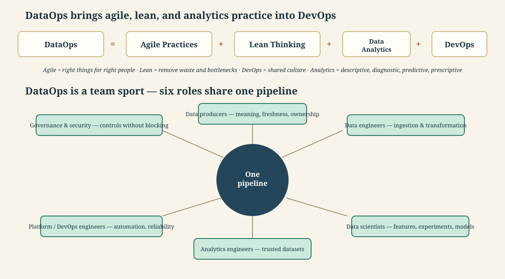

---

### The DataOps lifecycle and operating principles

**Intuition** — DevOps has a well-known loop (plan, build, release, operate, monitor). DataOps needs its own version of that loop, because "release" for a pipeline means promoting a data transformation, not shipping an app binary, and "operate" means watching data quality, not just uptime.

**Mechanism** — The DataOps lifecycle runs as six stages in a loop: **Plan** (define the business question, data contract, and success criteria), **Develop** (build modular transformations and tests), **Integrate** (version code, configuration, and schemas), **Release** (deploy pipelines through controlled environments), **Operate** (schedule, observe, alert, and recover), and **Improve** (use metrics and retrospectives to shorten feedback loops). Five operating principles run across every stage of that loop: Collaboration (data producers, engineers, analysts, and operations share ownership), Automation (repeatable ingestion, testing, deployment, and monitoring), Quality built in (validate data and code continuously, not as an afterthought), Fast feedback (surface failures and anomalies early), and Continuous improvement (measure flow, remove bottlenecks, and learn from incidents).

**Worked example** — For the running example: Plan fixes the business question ("which customers are worth a retention offer") and the data contract with the source system; Develop builds and tests the transformation logic; Integrate versions that logic alongside the schema it expects; Release promotes it through test and production environments; Operate runs it on a daily schedule with alerting; Improve reviews a month of run metrics to find the slowest or flakiest step and fix it.

**Tradeoff / when NOT to use** — Treating the six stages as a rigid, one-way gate (rather than a loop you re-enter) reintroduces the slow, siloed handoffs DataOps exists to remove. Skipping Improve entirely turns DataOps into a one-time project instead of an operating model — the lifecycle only pays off if the loop actually closes.

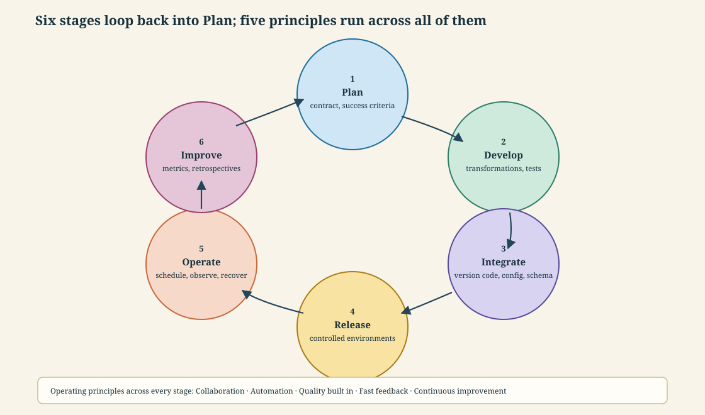

---

## Part 2 · Data pipeline architecture

### Canonical data architecture: from source to consumer

**Intuition** — Before automating anything, a pipeline needs a map of where data physically lives at each stage, so "raw" and "trusted" never get confused with each other.

**Mechanism** — DataKitchen's canonical data architecture (`datakitchen.io/dataops-data-architecture`) lays the pipeline out as a chain of zones: **Source Data** (produced Cloud/On-Prem, in a Production Environment) flows into a **Raw Lake** through **Data Engineering**, which produces **Refined Data**. Refined data feeds both **Data Science** and **Data Viz** work, and the whole chain is wrapped end to end by **Data Governance**, before finally reaching **Data Customers**.

**Worked example** — The running example's customer data lands in the raw lake exactly as the source system produced it; a data engineering job refines it into a clean, deduplicated customer table; the reporting model (data science) and a dashboard (data viz) both read from that refined table, never from the raw lake directly; governance controls who can query either layer; and the data customers are the business stakeholders who read the final report.

**Tradeoff / when NOT to use** — Writing straight to a refined layer and skipping the raw lake saves storage cost today, but removes the ability to reprocess history when the refinement logic changes or a bug is found — you can only refine what you kept. Conversely, keeping everything in raw form forever and refining on every read pushes the same transformation cost onto every consumer, repeatedly.

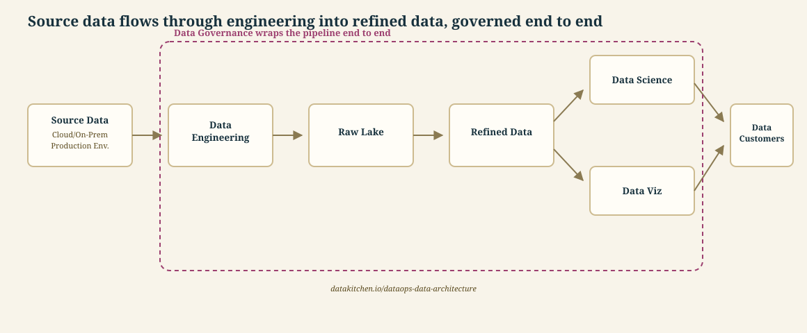

---

### DataOps functional architecture and automation

**Intuition** — "Automate the pipeline" is vague until you name the specific functions that automation needs to cover — deployment, environment management, storage, secrets, and reporting are each a separate concern.

**Mechanism** — The DataOps functional architecture groups automation into named blocks: an **Orchestrate Monitor Test** core sits at the center, driven by **Automated Deployment** and **Environment Creation and Management**, running on a **DataOps Platform** that provides **Storage and Version Control**, **History and Metadata**, **Auth and Permissions**, and **Environment Secrets**, all reported back through **DataOps Metrics and Reports** to the **DataOps Team**, across **Dev** and **Test** environments. In practice, automation orchestrates, tests, and monitors the data pipeline: data flows in from hundreds or thousands of sources and is integrated, cleaned, processed, and published for analytics; the automation checks data for anomalies, notifies test results when errors occur, and exposes a dashboard of metrics based on that monitoring.

**Worked example** — The running example's automated deployment provisions a test environment identical to production; the platform stores versioned transformation code and keeps a metadata history of every run; environment secrets hold the source system's API credentials; and a dashboard shows the DataOps team the pipeline's daily success rate.

**Tradeoff / when NOT to use** — Automating monitoring and testing without also automating the response (auto-quarantine bad data, auto-notify the right owner) just produces more alerts that nobody acts on — automation earns its value only when it's connected all the way through to a decision or an action.

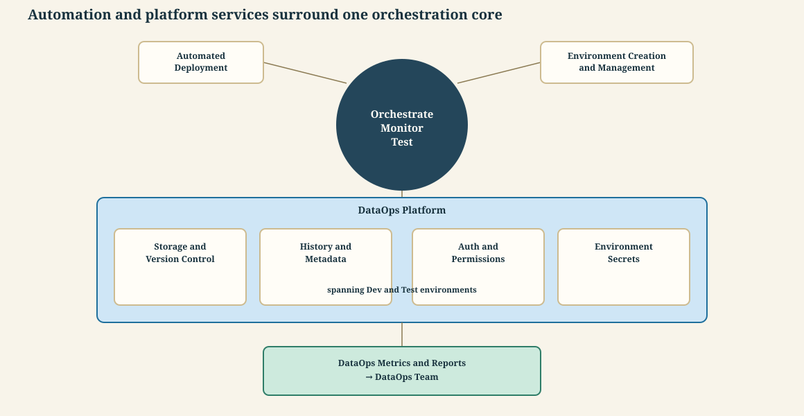

---

### Quality gates for data pipelines

**Intuition** — A pipeline that only checks data quality after publishing has already let bad data reach its consumers — quality gates move that check to before publication.

**Mechanism** — Five checks form the standard set of quality gates: **Schema checks** (required fields, types, and allowed values), **Completeness checks** (missing records and null thresholds), **Validity checks** (ranges, formats, and business rules), **Uniqueness checks** (duplicate keys and repeated events), and **Reconciliation checks** (source-to-target counts and totals). The release rule attached to every gate is the same: fail fast, quarantine bad data, and notify the owner — never publish data that failed a gate.

**Worked example** — The running example's customer table is checked for a valid email format (validity), no duplicate customer IDs (uniqueness), a row count within 5% of yesterday's (reconciliation), and no more than 1% null values in required fields (completeness) before it is allowed to reach the reporting model.

**Tradeoff / when NOT to use** — Gates set too strictly block legitimate edge-case data and create a backlog of manual overrides that erodes trust in the gate itself. Gates set too loosely let bad data through, which is worse: once consumers stop trusting a dataset's quality, they stop using it even after the problem is fixed.

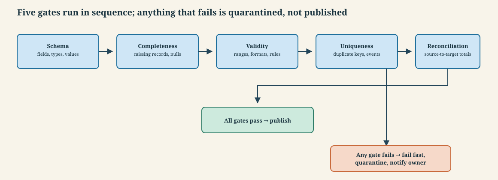

---

### Choosing DataOps tools

**Intuition** — "Which DataOps tool should we use" is the wrong first question — the right first question is which of five separate jobs a tool needs to do, because most tools are strong at one or two of them and weak at the rest.

**Mechanism** — Tools are chosen by need across five categories: **Orchestration** (scheduling, dependencies, retries, and backfills), **Transformation** (modular data models and reusable SQL or Python), **Quality** (automated validation and data contracts), **Observability** (freshness, lineage, anomalies, and incident context), and **Platform** (execution environments, secrets, and scaling). Selection criteria beyond the category itself: team skills, integration fit, operating cost, and support model. Open-source orchestration options include Apache Airflow, Prefect (with Prefect Cloud), and Dagster, alongside a curated community list (the `awesome-dataops` collection on GitHub); commercial options include DataKitchen (a DataOps platform) and Unravel (a data-observability tool).

**Worked example** — For the running example, a small Python-fluent team picks Prefect for orchestration (matches team skills), a dbt-style transformation layer for modular SQL, and a lightweight observability tool for freshness and volume checks — rather than one all-in-one commercial platform that would cover all five categories at a higher cost and with more lock-in.

**Tradeoff / when NOT to use** — A commercial, all-in-one platform trades cost and vendor lock-in for less integration work; assembling best-of-breed open-source tools per category trades more integration effort for flexibility and lower direct cost. Neither choice is universally right — it depends on the selection criteria above, not just on which tool is most popular.

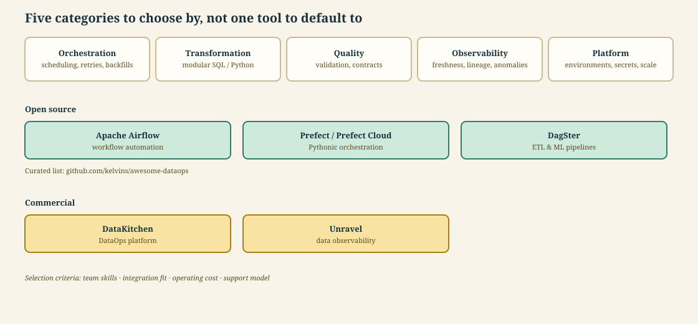

---

## Part 3 · Orchestrating pipelines with Prefect

### Prefect: a Pythonic workflow orchestration tool

**Intuition** — Most orchestration tools ask you to learn a new configuration language or a rigid DAG format before you can run anything. Prefect's core idea is that ordinary Python functions, lightly decorated, already are the workflow — orchestration is layered on top of code you would have written anyway.

**Mechanism** — Prefect (`prefect.io`) is a workflow orchestration tool built for data scientists and ML engineers: it requires only knowledge of Python (it is Pythonic and easy to learn), is open source, and transforms Python code into production-ready data pipelines with tools to build, monitor, and scale critical data workflows. Prefect Cloud is its cloud-native workflow engine, reachable through the Prefect Cloud REST API for programmatic data management. Six core concepts describe every Prefect pipeline: a **Flow** is the complete workflow and its orchestration boundary; a **Task** is a unit of work with its own state, retries, and caching; a **Deployment** is a flow configuration that can be scheduled or triggered; a **Work pool** is the bridge between orchestration and execution infrastructure; a **Worker** polls for scheduled work and starts flow runs; and **State** is the observable lifecycle a run moves through — Scheduled, Running, Completed, or Failed.

**Worked example** — The running example is one Flow (`daily_customer_report`) made of Tasks (`ingest`, `clean`, `aggregate`, `publish`), each independently retryable and cacheable; a Deployment schedules that flow to run every morning; a Worker in a Work pool actually executes it; and its State (Completed or Failed) is what the team checks each day.

**Tradeoff / when NOT to use** — Prefect's Pythonic simplicity is a poor fit for a team that needs heavy visual DAG authoring, enterprise-scale multi-tenant scheduling, or execution in a language other than Python — a tool like Airflow, purpose-built for those needs, is a better fit there.

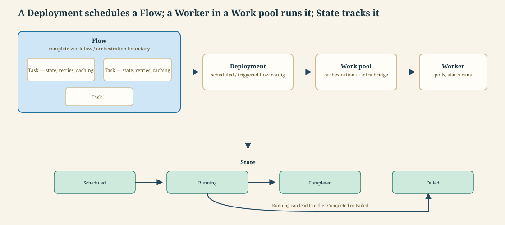

---

### Building and deploying a Prefect flow

**Intuition** — Prefect draws a clean line between writing a flow (ordinary Python, run locally) and operating a flow (scheduled, remote, monitored) — you only cross that line once the flow actually needs to run unattended.

**Mechanism** — Building a flow follows six steps: write ordinary Python functions for loading, cleaning, and training; decorate reusable units as tasks (`@task`); compose the tasks inside a flow (`@flow`); pass parameters rather than hard-coding environment values; run locally and inspect task states; and add a deployment only when scheduling or remote execution is actually needed. Deploying that flow follows a parallel six steps: confirm the flow runs locally with explicit parameters; package dependencies in a repeatable environment; create a deployment with a schedule, tags, and runtime settings; select a work pool that matches the execution platform; start a worker with access to the code, data, and required secrets; and monitor the first runs to validate alerts and recovery behavior. Tasks should be designed for safe recovery from the start: retries handle transient failures such as temporary API or network errors, caching avoids repeating expensive work when inputs have not changed, timeouts prevent stalled work from consuming resources indefinitely, and idempotency makes repeated execution produce the same intended result; small task boundaries improve diagnosis, reuse, and selective reruns, and permanent data-quality failures should never be retried without intervention (the fuller mechanics of each of these four properties are worked out later, under *Designing safe, idempotent tasks*). Setting up Prefect itself starts with `pip install prefect`, then either `prefect cloud login` to run on Prefect Cloud (`app.prefect.cloud`) or `prefect server start` to run locally, with the full tutorial documented at `docs.prefect.io`. Architecturally, an Account ID, Workspace ID, and Prefect API Key identify a Workspace inside Prefect Cloud; a schedule or trigger fires a Deployment; each Deployment produces Run(s) of a Flow, defined as Python functions carrying the `@flow` and `@task` annotators, made up of Task(s).

**Worked example** — The running example's flow is written and run locally first, with parameters for the report date; once it works, it is packaged, given a daily schedule, assigned to a work pool sized for the source system's rate limits, and started by a worker with the source system's credentials — only at that point does it become a Deployment rather than a script.

**Tradeoff / when NOT to use** — Adding a deployment, schedule, and worker for a flow that only ever runs once, ad hoc, is pure overhead — deployments earn their cost only once a flow needs to run unattended or repeatedly.

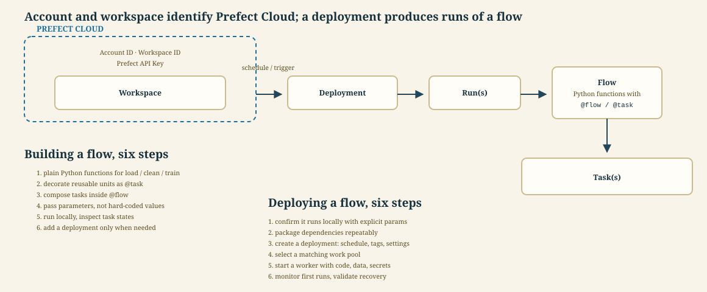

---

### Demo: a Prefect-orchestrated data science pipeline

**Intuition** — The clearest way to see Prefect's ideas land is one concrete data science project turned into one flow, task by task.

**Mechanism** — The session's demo builds a full workflow for a data science project out of five steps — Data Ingestion (get data from the data source), Data Pre-processing or Cleaning, Data Exploration (EDA — exploratory data analysis), Data Analysis (the ML code), and Data Visualization — implemented as one Main Flow with one Task per activity, wrapped in one Deployment, run on scheduled runs. The demo executes the project from a VS Code terminal and runs it on Prefect Cloud, so the deployment, runs, flows, and tasks can be observed live in the Prefect Cloud Dashboard, from a public reference repository (`github.com/shreyassureshrao/dsp.git`). The project's own folder structure keeps each concern separate, rooted at one `project_directory`: a `data/` folder (holding, for example, `Covid_data.csv`), a `flows/` folder (`workflow_covidex.py`, the main flow), a `tasks/` folder (one file per task — `BasicStats.py`, `Binning.py`, `ChiSquareCovidExample.py`, `CorrelationCoeffecient.py`, `Encoding.py`, `FeatureImportanceMLAlgorithms.py`, `Normalization.py`, `PearsonCorrelation.py`, `Visualization.py`), and an `output/` folder holding results such as `scatter_plot.png`.

**Worked example** — This demo *is* the worked example: `workflow_covidex.py` composes five tasks — ingest the COVID dataset, clean and encode it, run exploratory statistics (correlation, chi-square, binning), compute feature importance, and visualize the result — into one flow, deployed once and observed run by run in the Prefect Cloud Dashboard.

**Tradeoff / when NOT to use** — One task per activity keeps the flow readable and lets any single step be retried or cached independently, which is why the demo uses it. But splitting tasks too finely (one task per column, say) makes orchestration overhead swamp the actual work — task boundaries should match the places you would genuinely want an independent retry or cache, not every possible sub-step.

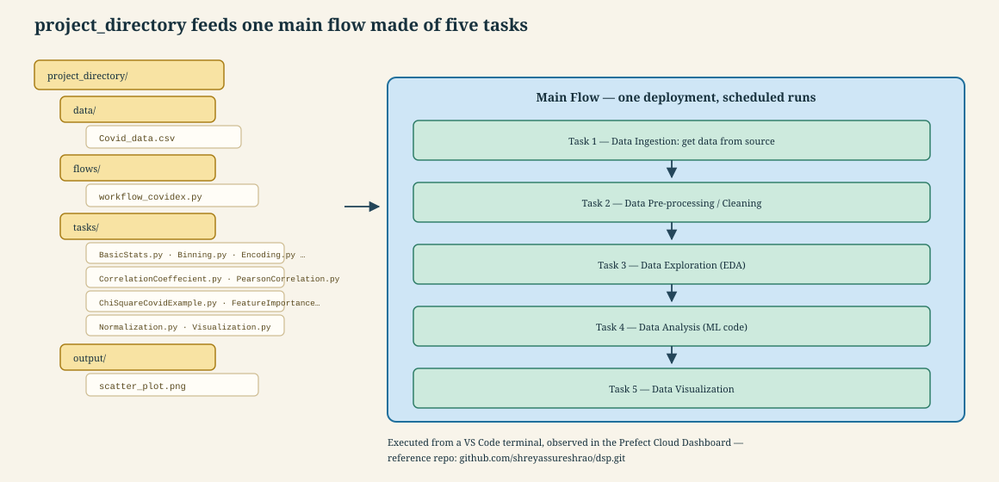

---

### Automating with the Prefect REST API

**Intuition** — Once a pipeline is running on a schedule, the next question is how other systems — a dashboard, an incident tool, a maintenance script — find out what it's doing, without someone opening the Prefect UI by hand.

**Mechanism** — The Prefect Cloud REST API lets you interact programmatically with entities such as deployments, flow runs, and task runs. Using it starts with getting a Prefect Cloud API key, then calling the REST API for deployment details and flow details. Common automation uses: query deployments and recent flow runs; build daily reliability reports from run states and durations; trigger parameterized runs from another service; pause or resume schedules during maintenance windows; connect incident tooling to failed-run metadata; and always use scoped credentials, never exposing API keys in notebooks or logs.

**Worked example** — The running example's daily reliability report is built by calling the REST API each morning for the previous day's flow runs, summarizing their states and durations into one line an on-call engineer can scan in seconds.

**Tradeoff / when NOT to use** — Giving an automation service one broad, unscoped API key is the fastest way to get something working, but it violates least privilege — a key scoped to only the read (or trigger) operations that automation actually needs limits the blast radius if that key ever leaks.

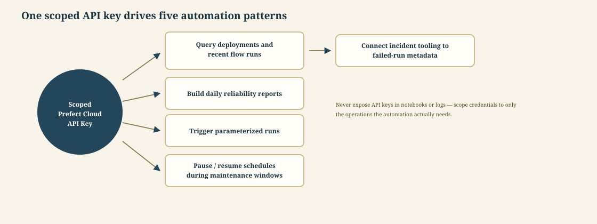

---

## Part 4 · CI/CD for data pipelines

### GitHub Actions fundamentals

**Intuition** — CI/CD for a data pipeline needs the same automation backbone as CI/CD for an application — GitHub Actions is that backbone, and its vocabulary (workflow, job, runner, step, action) is worth knowing precisely before building anything on top of it.

**Mechanism** — GitHub Actions is GitHub's native CI/CD and automation system, introduced by GitHub in 2018, integrated directly into GitHub and enabled by default in every repository. A **workflow** is triggered by one or more events, which can be internal (a push or a pull request) or external (a webhook call); a **job** contains a set of commands that run when the workflow is triggered; a **runner** is a virtual machine hosted by GitHub with an operating system, and each job runs inside a container on that runner; a **step** is either a shell command or an action; and an **action** is a reusable unit of code that can be included as a step of a job, with its own inputs and outputs. A typical GitHub Actions workflow structure lives at `.github/workflows/python-app.yml`, alongside application code (`app/main.py`), its tests (`tests/test_main.py`), its dependency list (`requirements.txt`), a `Dockerfile`, and a `README.md`.

**Worked example** — The session's own `main.yaml` defines a "Prefect CI/CD Pipeline with Prefect Cloud": triggered on a push or pull request to `main`, it checks out the repository, sets up Python 3.10, installs dependencies, authenticates with Prefect Cloud using the `PREFECT_API_KEY` and `WORKSPACE_KEY` secrets (`prefect cloud login --key $PREFECT_API_KEY --workspace 'shreyas-rao/default'`), and finally runs the deployment (`prefect deployment run 'main-flow/covid-ds-workflow' --workspace-key $WORKSPACE_KEY`).

**Tradeoff / when NOT to use** — Putting real credentials directly into workflow YAML instead of encrypted repository secrets is the single most common way a pipeline leaks credentials. But over-restricting a workflow's permissions can just as easily break legitimate automation (a bot that needs to comment on a pull request, say) — the fix in both directions is to scope permissions to exactly what the job needs, not to avoid using secrets or permissions at all.

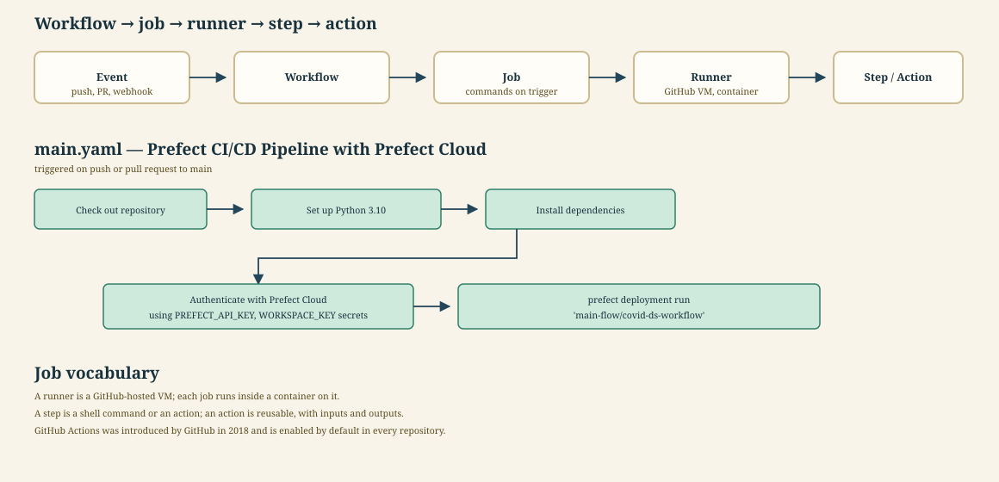

---

### CI/CD stages for a data pipeline

**Intuition** — A data pipeline's CI/CD path mirrors an application's, stage for stage, but each stage is checking data-specific things — schemas and contracts, not just code correctness.

**Mechanism** — On a pull request: lint the code, run unit tests, validate schemas, and scan dependencies and container images for vulnerabilities. On merge: build a versioned artifact or container image. Before deployment: run integration tests with representative test data. At deploy time: register or update the workflow deployment. After deployment: execute a smoke run and verify observability. The rule throughout: promote only when code, data contracts, and operational checks all pass. Four testing types back this up: **Unit tests** verify transformations and business rules quickly; **Contract tests** detect unexpected schema or interface changes; **Integration tests** validate storage, APIs, and orchestration boundaries; and **End-to-end tests** cover one representative workflow path start to finish. Secure automation practices run alongside all of this: store credentials as encrypted secrets — either repository or environment secrets — restrict workflow permissions, and pin trusted third-party actions to a known version.

**Worked example** — A pull request that changes the running example's cleaning logic triggers unit tests on that logic and a contract test against the source schema; merging it builds a new container image; before deployment, an integration test runs the full flow against a test copy of the source data; after deployment, a smoke run confirms the first scheduled run completes and the dashboard shows fresh data.

**Tradeoff / when NOT to use** — Skipping integration tests to save CI time is the most common shortcut taken under deadline pressure, and the most expensive one to skip — unit tests alone cannot catch schema drift between real systems, which is exactly the failure integration tests exist to catch.

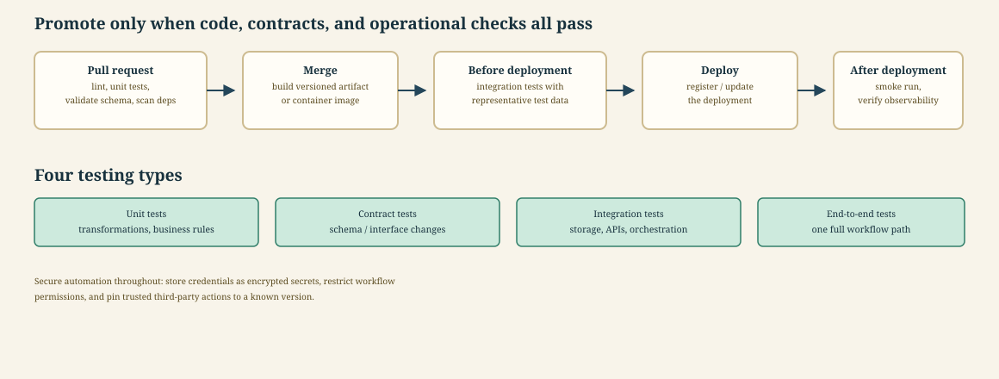

---

### Data contracts and schema evolution

**Intuition** — A data contract is what makes a schema change a visible, negotiated event instead of a silent breakage discovered downstream days later.

**Mechanism** — A data contract defines expected fields, types, constraints, and semantic meaning; names the producer and every critical consumer; is validated at ingestion and before publication; version contracts whenever compatibility changes; alerts both sides when an expectation fails; and is treated like an API change — never edited silently. Schema evolution is how a contract changes safely over time: add optional fields without breaking existing consumers; never change the meaning of an existing field silently; deprecate fields before removing them; maintain compatibility rules for both readers and writers; test historical and future schema versions; and record the schema version with every published dataset.

**Worked example** — The running example's customer-data contract names the source system as producer and the reporting model as consumer; when the source team adds a new `loyalty_tier` field, it is added as optional, tested against both the old and new schema, and only removed from "deprecated" status once every consumer has migrated.

**Tradeoff / when NOT to use** — Formally versioning every contract change is overhead that a single-consumer, internal-only pipeline may not need. But the moment more than one team consumes the same dataset, the coordination cost of a silent breaking change is far higher than the cost of a version bump — contracts earn their overhead exactly at that point.

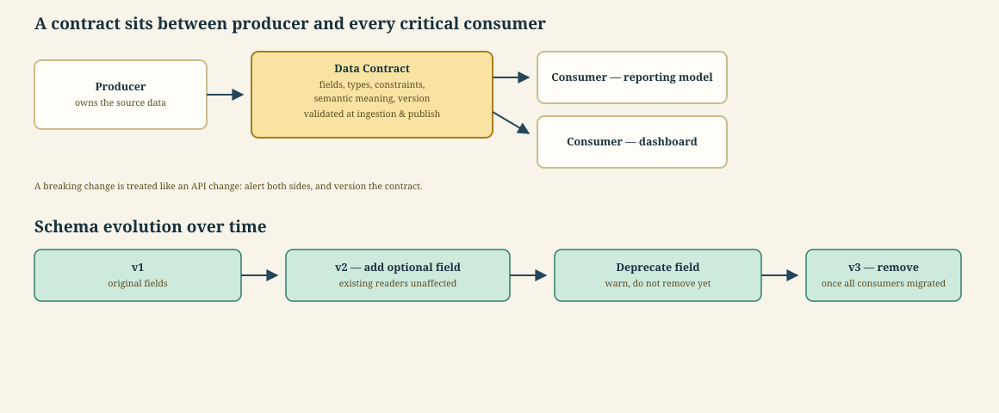

---

## Part 5 · Scalability and reliability practices

This part works through the concrete practices that separate a pipeline that runs once from one that survives production for years: how the platform is layered, how data is processed and partitioned, how tasks fail safely, how the pipeline is observed, secured, released, and recovered. Each practice below is small on its own; production reliability is what you get from applying all of them together, as the capstone and production-readiness review at the end of this session show.

### Layering the data platform

**Intuition** — "The pipeline" is really several distinct layers stacked on top of each other, and naming them separately is what lets you reason about where a problem actually is.

**Mechanism** — Sources generate files, events, database changes, and API responses. Ingestion captures that data reliably and records arrival metadata. Storage separates raw, validated, and curated zones. Transformation applies reusable business logic. Serving layers expose trusted datasets, features, or APIs to consumers. Orchestration connects every layer and observes every run across all of them. This is a general-purpose way to think about *any* pipeline's structure — distinct from the *canonical data architecture* in Part 2, which is one specific named reference architecture (source, raw lake, data engineering, refined data, governance) that this same layering maps onto.

**Worked example** — The running example's source is the customer database; ingestion pulls a daily extract and timestamps it; storage keeps a raw copy, a validated copy (post quality-gates), and a curated copy (post business logic); transformation computes the reporting aggregates; serving exposes the final table to the reporting model; and orchestration (Prefect) schedules and watches every one of those steps.

**Tradeoff / when NOT to use** — Collapsing raw, validated, and curated into a single zone saves storage cost today, but removes the ability to replay or reprocess history when transformation logic changes or a data-quality bug is discovered upstream — you can only reprocess what you kept separately.

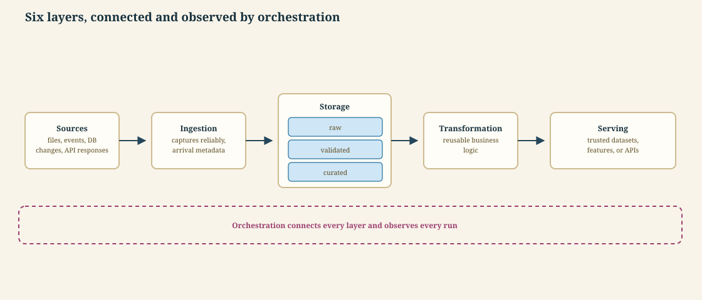

---

### Batch, streaming, and micro-batching

**Intuition** — The choice between batch and streaming is really a choice about how much latency the business need actually requires — everything else follows from that.

**Mechanism** — Batch processing fits periodic reports, large scans, and simpler operations. Streaming fits low-latency decisions and continuous events, but adds state, ordering, replay, and monitoring complexity that batch does not need. Micro-batching offers a practical middle ground between the two. The rule of thumb: let latency requirements drive the architecture, and choose the simplest model that meets the business need — do not default to streaming because it sounds more advanced.

**Worked example** — The running example's daily reporting model only needs numbers refreshed once a day, so it runs as a simple batch job; if the business need changed to "flag a risky customer within five minutes of their action," the pipeline would need to move to streaming or, at minimum, frequent micro-batches.

**Tradeoff / when NOT to use** — Over-engineering a streaming pipeline for a report read once a day wastes the state, ordering, and replay complexity streaming requires. Under-engineering with batch for a use case that needs sub-minute freshness fails the business need outright — this is a case where the "simplest option" is not always batch.

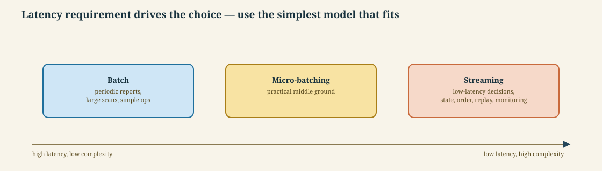

---

### Incremental processing

**Intuition** — Reprocessing an entire dataset from scratch every run is simple to reason about but wasteful; incremental processing reads only what changed, at the cost of needing to track exactly what "changed" means.

**Mechanism** — Track a watermark, timestamp, or version for processed data. Read only new or changed records. Use stable keys to merge updates safely. Record checkpoints only after successful publication — never before. Plan explicitly for late-arriving and corrected data, rather than assuming every record arrives once, on time. Test restart behavior before production deployment, since restart is where incremental logic most often breaks.

**Worked example** — The running example tracks a `last_updated` watermark on the customer table; each run reads only rows changed since the last successful checkpoint, merges them by stable customer ID, and only advances the watermark after the merge is confirmed published.

**Tradeoff / when NOT to use** — Incremental processing is more complex to build, test, and reason about (especially its restart and late-arrival handling) than a full reload. For a small dataset, a full daily reload can be simpler and safer than incremental logic, despite the extra compute it costs.

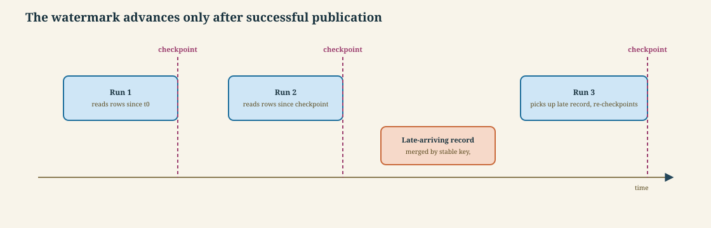

---

### Partitioning for safer backfills

**Intuition** — When something goes wrong with one day (or one region, or one product line) of data, you want to be able to fix just that slice — partitioning is what makes that possible without touching everything else.

**Mechanism** — Partition data by a meaningful time key or business key. Keep partition boundaries consistent across every pipeline stage, so a partition means the same thing everywhere. Run independent partitions in parallel when it is safe to do so. Backfill only the affected range, never the whole dataset. Validate totals before replacing published outputs. Avoid tiny partitions — partitioning too finely creates excessive file and metadata overhead relative to the data each partition actually holds.

**Worked example** — The running example is partitioned by date; when a bad source extract corrupts one day's data, only that day's partition is backfilled — reprocessed, validated, and swapped in — while every other day's published output is untouched.

**Tradeoff / when NOT to use** — Partitioning too finely (by hour, say, when every consumer only ever queries by month) multiplies overhead without a matching benefit. Partitioning too coarsely makes every backfill touch far more data than the actual problem requires — the right partition key matches how the data is actually queried and how failures actually happen.

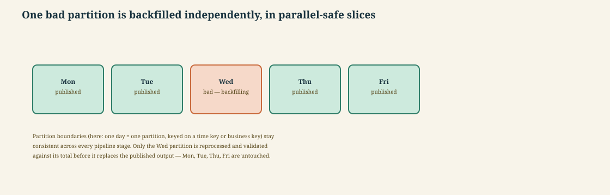

---

### Designing safe, idempotent tasks: retries, caching, and timeouts

**Intuition** — Tasks fail for different reasons, and treating every failure the same way (retry blindly, or escalate everything) is wrong in both directions — the right response depends on *why* the task failed.

**Mechanism** — Five failure types call for different responses: **Transient** failures (network, rate limit, or a temporary service outage) should be retried. **Data quality** failures (invalid schema, nulls, or a broken business rule) should be escalated, not retried — retrying does not fix bad data. **Code defect** failures (a deterministic exception or an incorrect transformation) should also be escalated, since retrying deterministic code just reproduces the same bug. **Capacity** failures (a memory, storage, or concurrency limit) may be retried after backing off or scaling. **Dependency** failures (missing upstream data or unavailable credentials) should be escalated until the dependency resolves. For retries specifically: use exponential backoff and a maximum retry count, set timeouts so stalled work cannot run indefinitely, capture the final error with useful run context, and escalate permanent failures to the responsible owner rather than retrying forever. Caching avoids repeating expensive work when inputs have not changed: build cache keys from code, parameters, and input versions; set an expiry that reflects data-freshness needs; invalidate when logic or upstream inputs change; avoid caching operations that have uncontrolled side effects; and measure whether caching is actually reducing time and cost, rather than assuming it does. Idempotency makes repeated execution produce the same intended result: use deterministic keys for inserts and updates, write outputs to temporary locations before an atomic publication step, separate side effects from pure transformations, record external requests to avoid duplicate actions, and verify safe reruns during failure testing, not just during normal operation. Small task boundaries, throughout, improve diagnosis, reuse, and selective reruns.

**Worked example** — The running example's ingestion task retries with exponential backoff on a transient API timeout; its aggregation step is cached, keyed on the input data's version, so an unrelated rerun does not recompute it; and its publish step is idempotent — it upserts by customer ID into a temporary table, then atomically swaps it into place, so a retried publish never double-writes.

**Tradeoff / when NOT to use** — Idempotent design (deterministic keys, atomic publish) adds real engineering effort up front. That effort is optional for a purely read-only reporting task, but not for anything that writes, charges, or sends — a non-idempotent retry on those can double-charge or double-send, which is a far worse failure than the original transient error.

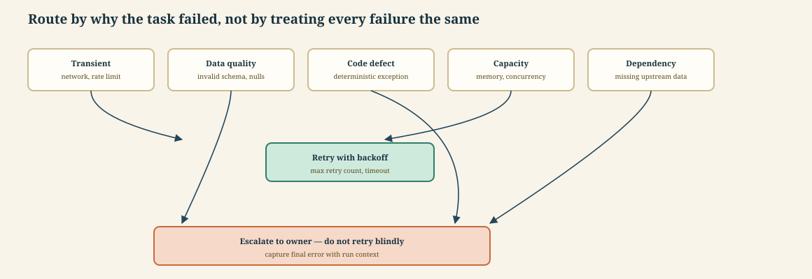

---

### Observability, SLOs, and lineage

**Intuition** — You cannot operate what you cannot see, and "see" here means five specific signals, a way to turn them into a target, and a way to trace a bad output back to its cause.

**Mechanism** — Reproducible runs need versioning across five dimensions: Code (transformations, models, and workflow definitions), Data (immutable snapshots or traceable dataset versions), Environment (pinned packages, containers, and infrastructure configuration), Parameters (runtime inputs, feature flags, and schedules), and Metadata (run ID, timestamps, lineage, and model or artifact versions) — a reproducible run can be explained, rerun, and audited. Observability itself rests on five signals: **Freshness** (did the dataset arrive on time?), **Volume** (are row counts within an expected range?), **Distribution** (did values or categories shift unexpectedly?), **Lineage** (which upstream change affected this output?), and **Reliability** (how often do flows succeed and recover?) — surfaced through dashboards for trends and alerts for conditions that require action, plus run metrics such as success rate, duration, retries, and queue time. Service Level Objectives (SLOs) turn those signals into targets: choose indicators such as success rate, freshness, and duration; set targets that reflect consumer expectations; measure over a clearly defined time window; define an error budget for acceptable unreliability; prioritize reliability work when that budget is exhausted; and review targets as workloads and business needs change. Lineage is what makes an incident traceable: record which sources produce each dataset and model, capture the transformations between upstream and downstream assets, use lineage to identify consumers before making a change, trace an incident from a bad output back to its origin, prioritize recovery for high-impact downstream products, and keep technical lineage connected to business ownership so "who does this affect" has an answer.

**Worked example** — The running example's SLO is "99% of days, the report is fresh by 6am"; when that target is missed, lineage traces the late report back through the pipeline to a source system that changed its extract format overnight, and the incident is triaged from there.

**Tradeoff / when NOT to use** — Tracking every possible signal, with a formal SLO, for every dataset is expensive and produces alert noise nobody reads. Observability and SLO investment should scale with how consumer-critical a dataset actually is — a scratch or exploratory dataset does not need the same rigor as the daily reporting feed the business depends on.

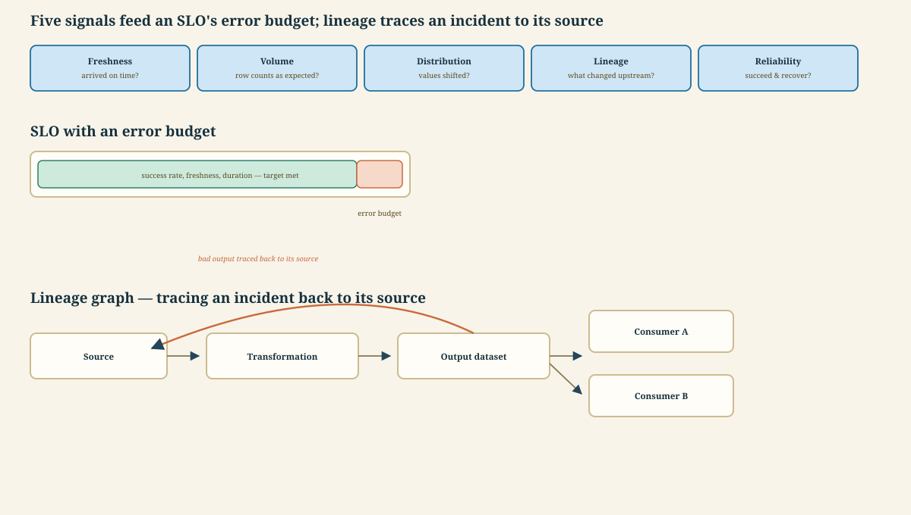

---

### Governance, secrets, and identity

**Intuition** — Governance that only exists as a policy document does nothing; governance has to travel *with* the pipeline, enforced at the same points where data and credentials actually move.

**Mechanism** — Governance travels with the pipeline: classify sensitive data before processing it, apply least-privilege access to storage, APIs, and orchestration, keep credentials in a secret manager rather than in code or workflow files, encrypt data in transit and at rest, record lineage, approvals, and access for auditability, and define retention and deletion policies for outputs and logs. Protecting secrets and identity specifically means storing credentials in an approved secret manager, using short-lived workload identity where it is available (rather than long-lived static credentials), applying least privilege everywhere, choosing to rotate credentials and remove unused access on a schedule, preventing secrets from ever appearing in logs or artifacts, and auditing access to production data and deployments.

**Worked example** — The running example's Prefect API key and the source system's credentials are both stored as encrypted GitHub Actions secrets (the same mechanism the CI/CD workflow in Part 4 uses), scoped to only the workflow that needs them, never printed to a log, and rotated on a schedule.

**Tradeoff / when NOT to use** — Centralizing every secret in one shared vault entry is operationally simpler than scoping credentials per environment or per pipeline, but it means one leaked credential exposes every pipeline that shares it — the operational convenience of one shared secret trades directly against the blast radius of a single leak.

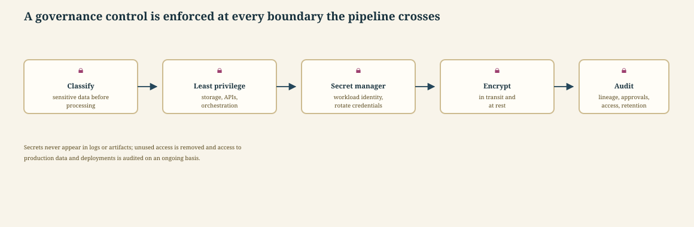

---

### Consistent, promotable artifacts: containers and one tested build

**Intuition** — If test and production ever run different code because each was built separately, "it passed in test" stops meaning anything — the fix is to build exactly once and move that one artifact forward unchanged.

**Mechanism** — Promote one tested artifact: build one versioned artifact after tests pass, use configuration — not a rebuild — to separate development, test, and production, promote that same tested artifact instead of rebuilding it for each environment, apply approvals where risk requires human review, record who promoted which version and when, and support rollback to a known-good release. Containers are what make this practical: package code, runtime, and dependencies together; pin base images and package versions; keep environment-specific settings outside the image, in configuration; run containers with least privilege; scan images for vulnerable dependencies; and use the same image locally, in CI, and in production. Protecting production environments is what makes promotion safe rather than risky: use separate environments for test, staging, and production; restrict production deployment permissions; require reviewers for high-risk releases; scope secrets to the environment that needs them; prevent concurrent deployments when ordering matters; and keep an auditable deployment history throughout.

**Worked example** — The running example's pipeline is built into a container image once in CI, after its tests pass; that exact image — not a rebuild — is promoted from test to production, with only its externalized configuration (database URL, log level) changing between the two.

**Tradeoff / when NOT to use** — "Build once, promote everywhere" only works if configuration is fully externalized from the artifact. Any team that lets an environment-specific value leak into the build itself (instead of into runtime configuration) breaks the guarantee that what was tested is exactly what ships.

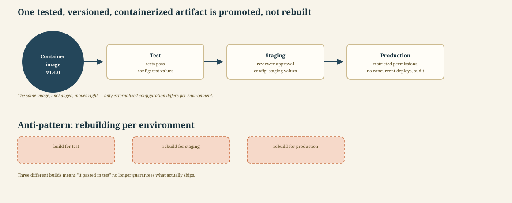

---

### Work pools and worker concurrency

**Intuition** — Orchestration decides *what* runs and *when*; work pools and workers decide *where* it actually executes and how much of it can run at once — mixing those concerns up is how one noisy pipeline starves every other pipeline of capacity.

**Mechanism** — Choosing the right work pool means matching it to the execution target — local, container, VM, or Kubernetes — separating workload classes that have different security or capacity needs, defining infrastructure defaults centrally, overriding resources only when a specific deployment requires it, restricting access to sensitive pools, and measuring queue time and worker utilization to know whether the pool is sized correctly. Controlling worker concurrency means matching the worker type to CPU, memory, and network demand; limiting concurrency to protect downstream databases and APIs from being overwhelmed; using queues or pools to isolate workload classes from each other; scaling out independent tasks when their dependencies allow it; applying backpressure when downstream systems slow down; and testing scale-up and scale-down behavior under load before relying on it in production.

**Worked example** — The running example's ingestion task hits a rate-limited source API, so its work pool is sized to a low concurrency limit that respects that rate limit, kept separate from the pool running the unrelated, high-concurrency aggregation tasks.

**Tradeoff / when NOT to use** — One shared, unconstrained work pool for every pipeline is the simplest thing to operate, but it lets one noisy or misbehaving pipeline starve every other pipeline's workers of capacity. Separate pools trade that operational simplicity for real isolation — worth it once more than one pipeline shares infrastructure.

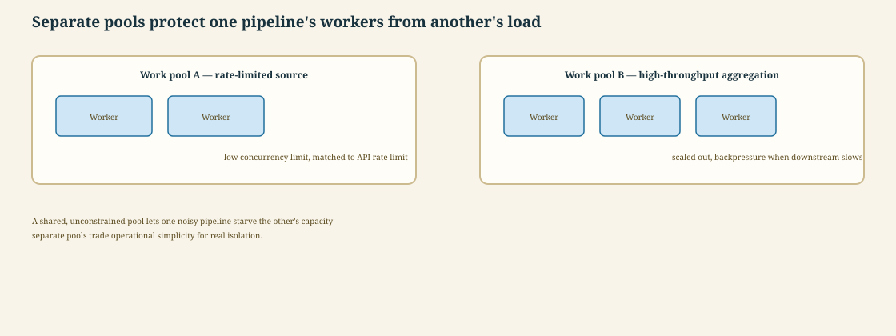

---

### Event-driven triggers and parameters

**Intuition** — A schedule assumes data arrives on a predictable clock; an event trigger reacts to data arriving whenever it actually does — the tradeoff is that "whenever it actually does" includes late, duplicate, and out-of-order arrivals a schedule never has to think about.

**Mechanism** — Workflows can be triggered on file arrival, message publication, or an API request. Incoming events must be validated and deduplicated, with their metadata passed through as flow parameters. Designs must handle events that arrive late or out of order, and keep replay safe through idempotent processing (the same idempotency covered under task design above). Schedules remain the right choice when event infrastructure adds no real value over a fixed clock. Separately, parameters and configuration should stay distinct: parameters describe values that change per run, while configuration describes environment and deployment behavior; parameter types and acceptable ranges should be validated, safe defaults provided for local development, secrets stored separately from both, and effective values recorded with run metadata for reproducibility.

**Worked example** — The running example could be re-triggered by a file-arrival event instead of a fixed schedule, passing the arrived file's path and its arrival timestamp as parameters, while the destination database and credentials stay in configuration, not in the event payload.

**Tradeoff / when NOT to use** — Event-driven triggers reduce latency compared to a fixed schedule, but add deduplication and ordering complexity a scheduled run never has to handle. That complexity is not worth taking on for a pipeline that does not actually need faster-than-daily results — a schedule is simpler and just as correct there.

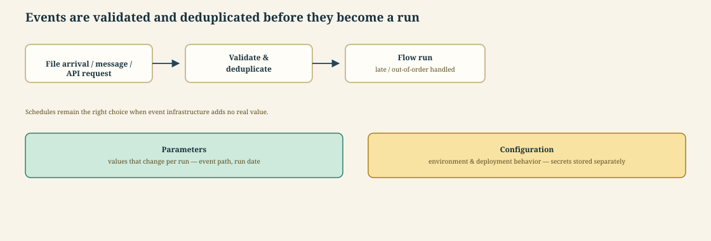

---

### Incident response and disaster recovery

**Intuition** — Incidents and disasters are the same underlying problem at two different scales: something broke, someone has to notice, and someone has to fix it — disaster recovery is just incident response for the case where the fix requires restoring from a backup.

**Mechanism** — Incident response needs named owners at every stage: **Detect** the issue through an actionable alert, **Triage** its impact, urgency, and affected consumers, **Contain** the problem by pausing or isolating bad outputs, **Recover** through a rerun, rollback, or controlled backfill, **Communicate** status and expected resolution to affected consumers, and complete a **blameless review** afterward to track improvements. Disaster recovery extends this to catastrophic failure: define a recovery time objective and a recovery point objective, back up code, configuration, metadata, and critical data, keep restoration procedures documented and automated (not tribal knowledge), test recovery in an isolated environment rather than assuming it works, verify credentials, network access, and dependencies as part of that test, and record lessons to close recovery gaps after every exercise.

**Worked example** — When a bad source column silently corrupts a day of the running example's output, the on-call engineer detects it via an alert, triages it as affecting only the reporting model (not other consumers), contains it by pausing the downstream report, recovers by backfilling that one day's partition, communicates the fix to stakeholders, and a blameless review afterward adds a validity check that would have caught the bad column earlier.

**Tradeoff / when NOT to use** — Running a full disaster-recovery test — an isolated-environment restore — for every pipeline on a tight cadence is expensive. Recovery time and recovery point objectives, and how often DR is actually tested, should scale with how costly downtime genuinely is for that pipeline's consumers, not be applied uniformly everywhere.

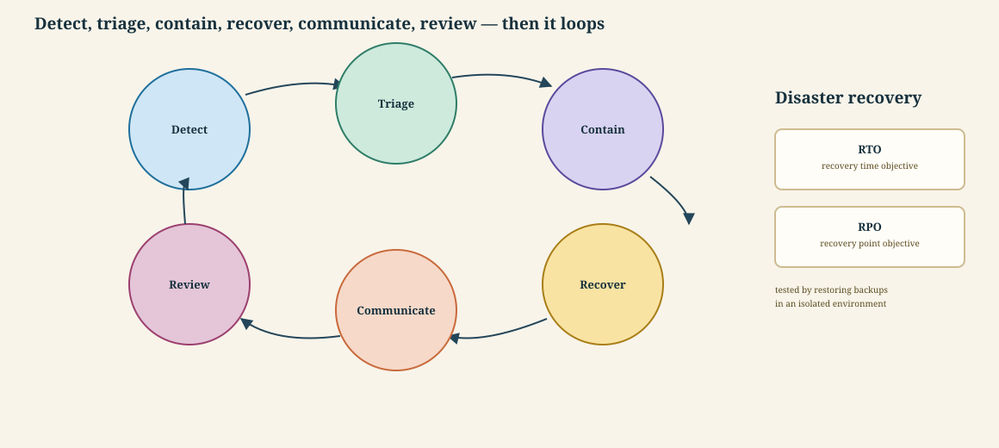

---

### Release strategies

**Intuition** — Deploying a change and turning it on for everyone at once is the riskiest possible release strategy — every alternative here trades some deployment simplicity for a smaller blast radius if the change is bad.

**Mechanism** — A **Rolling release** updates capacity gradually. **Blue-green** keeps the previous environment fully ready for immediate rollback while the new one takes traffic. **Canary** sends a limited amount of traffic or workload to the new version first, before a full rollout. **Shadow** runs compare the new version's outputs against the old one without affecting real consumers at all. **Feature flags** separate deployment (the code is live) from activation (the feature is actually turned on for users). The strategy is chosen based on how reversible the change is and how much impact a bad version could have.

**Worked example** — Updating the running example's reporting model could ship via canary — a small percentage of scheduled runs use the new model, compared against the old model's output — before the new model fully replaces the old one.

**Tradeoff / when NOT to use** — Canary and shadow strategies need enough run volume to produce a meaningful signal quickly. For a low-volume daily batch pipeline, a "canary of one run out of one" is not meaningful — blue-green, or simply a proven rollback plan, often fits a data pipeline better than release techniques borrowed from high-traffic web services.

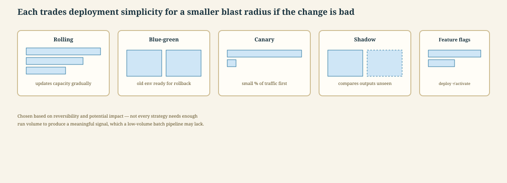

---

### Cost and performance optimization

**Intuition** — Cost optimization for a pipeline is not "spend less" in the abstract — it is a specific set of levers, each of which trades against latency or recovery in a way that has to be made explicit, not assumed away.

**Mechanism** — Measure runtime, resource use, queue time, and data scanned before optimizing anything. Right-size workers using observed demand, not a guess. Cache deterministic, expensive results (the same caching covered under task design above). Prefer incremental processing over full refreshes wherever the incremental logic is already justified. Schedule flexible, non-urgent workloads during lower-cost periods. Throughout, balance savings against latency and recovery goals — a cheaper pipeline that misses its SLO or its recovery objective is not actually an improvement.

**Worked example** — The running example's cost was cut by switching its daily reload to incremental processing (reading only changed rows) and moving its non-urgent backfill jobs to an off-peak schedule window — without changing its SLO or its recovery plan.

**Tradeoff / when NOT to use** — Aggressively right-sizing workers to the median observed load causes failures or slowdowns the moment demand spikes above that median. Cost optimization should never be allowed to trade away the reliability and recovery objectives set elsewhere in this session — cost is one more thing to balance, not the thing that overrides everything else.

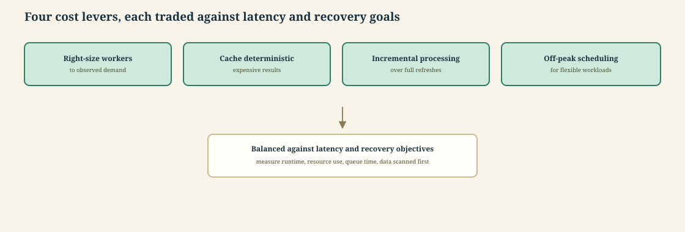

---

### Tracking artifacts and monitoring models in production

**Intuition** — A model that is deployed and never checked again is a model you have already lost track of — tracking artifacts and monitoring production are what keep "deployed" from silently drifting into "wrong."

**Mechanism** — Tracking artifacts with runs means storing metrics, reports, datasets, and model outputs as versioned artifacts; attaching a version, timestamp, and producing run ID to each; recording the training data and feature definitions behind every model; comparing candidate models against an approved baseline before promoting them; promoting only artifacts that pass quality criteria; and retaining enough metadata to reproduce and audit any decision later. Monitoring models in production means tracking prediction quality once ground-truth labels become available, monitoring input drift and feature distribution changes, watching latency, throughput, and error rates, comparing performance across important data segments (not just in aggregate), defining thresholds for investigation and retraining, and never automating retraining without validation and human approval.

**Worked example** — The running example's reporting model is stored as a versioned artifact with its training data and feature definitions recorded; a month after deployment, production monitoring flags input drift in one feature, which triggers an investigation before any retraining is approved.

**Tradeoff / when NOT to use** — Comparing every candidate model against a baseline that is never itself reviewed gives a false sense of safety — "beats the baseline" stops meaning "good enough for production" once the baseline itself has quietly gone stale. The baseline needs the same periodic review as the model being compared against it.

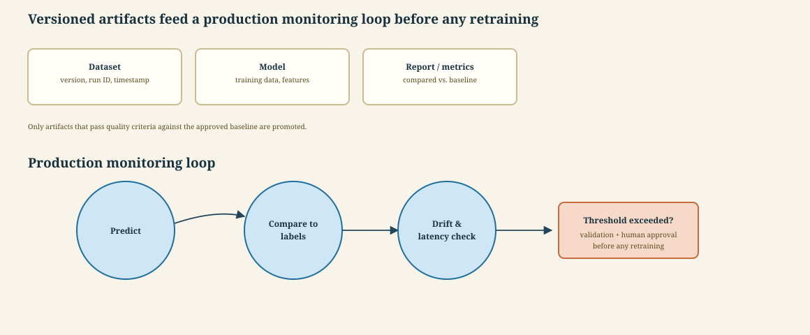

---

## Part 6 · Bringing it together

### Capstone: designing a reliable pipeline, and the production-readiness review

**Intuition** — Every practice in Part 5 is easy to nod along to individually; the capstone scenario and the production-readiness review are what force you to apply all of them, together, to one pipeline at once — which is the only way to find out which ones you actually skipped.

**Mechanism** — The capstone scenario is exactly the running example used throughout this note: daily customer data feeds a reporting model. Designing it end to end means: define the data contract and quality gates; split the workflow into flows and tasks; choose retries, caching, and backfill behavior; design the CI/CD path, security, production controls, and deployment controls; and present monitoring signals and an incident response plan. The production-readiness review (PRR) is the checklist that confirms all of it is actually in place before — and periodically after — launch: ownership and consumer expectations are documented; code, data contracts, environments, and parameters are versioned; tests cover transformations and integration boundaries; deployment, rollback, and backfill procedures are proven, not just planned; dashboards and actionable alerts are active; and security, cost, retention, and audit requirements are satisfied.

**Worked example** — Walking the running example through the PRR: ownership is documented (the data engineer who owns ingestion, the data scientist who owns the model); the contract, the container image, and the flow's configuration are all versioned; unit, contract, and integration tests all pass in CI; a real backfill has been tested on last month's data, not just described; the freshness SLO has a live dashboard and an alert; and the retention policy for customer data has been reviewed against governance requirements. Every checked box here traces back to a named practice earlier in this session.

**Tradeoff / when NOT to use** — Treating the PRR as a one-time gate passed before first launch — rather than a periodic re-check — lets a pipeline drift out of compliance as its data, team, dependencies, and business requirements change silently over time. A pipeline that passed its PRR a year ago is not necessarily production-ready today.

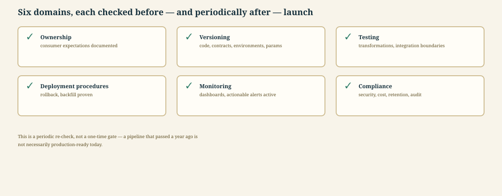

---

## Self-study / Lab / build

Lab 1 is the hands-on companion to this session: design and build an API-based data pipeline that covers data ingestion, pre-processing, analysis, and monitoring — the same shape as the running example used throughout this note. Start from the demo's reference repository (`github.com/shreyassureshrao/dsp.git`) to see one working example of the folder structure (`flows/`, `tasks/`, `data/`, `output/`) before writing your own. Build your own small Prefect flow with at least two tasks, give one of them a retry with backoff and one of them a cache, and make your publish step idempotent (write to a temporary location, then swap it in atomically) — then deliberately break something (kill the process mid-run, feed it a malformed record) and confirm your recovery behavior actually works before you trust it. Finally, self-audit your flow against the production-readiness review checklist above: which boxes are genuinely checked, and which are just planned?

---

*Exam: this session is in scope for the **closed-book mid-sem** (contact sessions 1-8) and the **open-book comprehensive** (all sessions). Full evaluation weights, dates and course logistics live once in [`549-master.md`](../549-master.md) — not repeated per session.*

