# AIMLC ZG549 · API-driven Cloud Native Solutions · Session 06 · Data Pipeline Reliability, Continued

*Learned 3 Sep 2026*

> **Scope note.** The only material received for this session is the second half of the "Lectures No. 5 and No. 6" deck (slides 62–90) — a second, deeper pass through the same DataOps/pipeline-reliability practices as Session 05, not the handout's listed Session 06 topic (*API-driven ML Pipelines*: model development & training, deployment, monitoring, scalability, MLOps practices). That ML-pipeline content has not been taught yet and stays an open gap — see `549-master.md` and `source/MATERIAL-LOG.md`. This note teaches exactly what the deck's second pass actually covers: a deeper look at the same reliability practices from Session 05, each revisited with more mechanism detail than the first pass gave.

## Why this matters

This session takes every reliability practice from Session 05 and goes one level deeper: idempotency, retries, and caching split into three distinct disciplines instead of one; disaster recovery, schema evolution, and work-pool selection get their own treatment for the first time; and the capstone repeats with sharper detail. After this session you should be able to explain not just *that* a pipeline needs these practices, but the specific mechanism each one relies on — the difference between "cache results" and "build a cache key from code, parameters, and input versions."

## Part 1 · The platform and its contracts, revisited

### Layering the data platform

**Intuition** — "The pipeline" is really several distinct layers stacked on top of each other, and naming them separately is what lets you reason about where a problem actually is.

**Mechanism** — Sources generate files, events, database changes, and API responses. Ingestion captures that data reliably and records arrival metadata. Storage separates raw, validated, and curated zones. Transformation applies reusable business logic. Serving layers expose trusted datasets, features, or APIs to consumers. Orchestration connects every layer and observes every run across all of them.

**Worked example** — The running example's source is the customer database; ingestion pulls a daily extract and timestamps it; storage keeps a raw copy, a validated copy (post quality-gates), and a curated copy (post business logic); transformation computes the reporting aggregates; serving exposes the final table to the reporting model; and orchestration (Prefect) schedules and watches every one of those steps.

**Tradeoff / when NOT to use** — Collapsing raw, validated, and curated into a single zone saves storage cost today, but removes the ability to replay or reprocess history when transformation logic changes or a data-quality bug is discovered upstream — you can only reprocess what you kept separately.

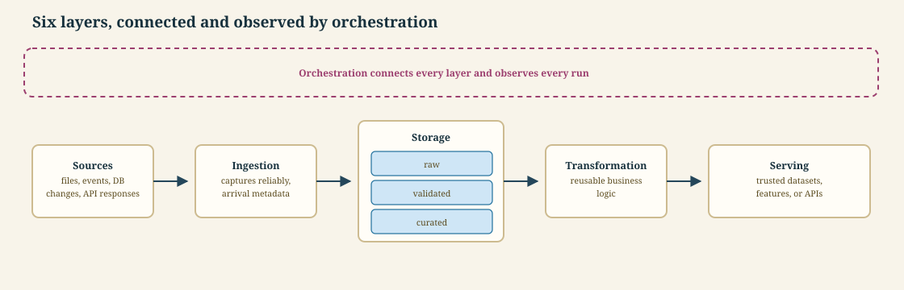

---

### Data contracts and schema evolution

**Intuition** — A data contract is what makes a schema change a visible, negotiated event instead of a silent breakage discovered downstream days later — and schema evolution is the discipline that lets the contract actually change over time without breaking anyone.

**Mechanism** — A data contract defines expected fields, types, constraints, freshness, and semantic meaning; names the producer and every critical consumer; is validated at ingestion and publication boundaries; version contracts whenever compatibility changes; notifies both producers and consumers when validation fails; and is treated like an API change — never edited silently. Schema evolution is how a contract changes safely over time: add optional fields without breaking existing consumers; never change the meaning of an existing field silently; deprecate fields before removing them; maintain compatibility rules for both readers and writers; test historical and future schema versions; and record the schema version with every published dataset.

**Worked example** — The running example's customer-data contract names the source system as producer and the reporting model as consumer; when the source team adds a new `loyalty_tier` field, it is added as optional, tested against both the old and new schema, and only removed from "deprecated" status once every consumer has migrated.

**Tradeoff / when NOT to use** — Formally versioning every contract change and running a full deprecation cycle is overhead a single-consumer, internal-only pipeline may not need. But the moment more than one team consumes the same dataset, the coordination cost of a silent breaking change is far higher than the cost of a version bump and a deprecation window.

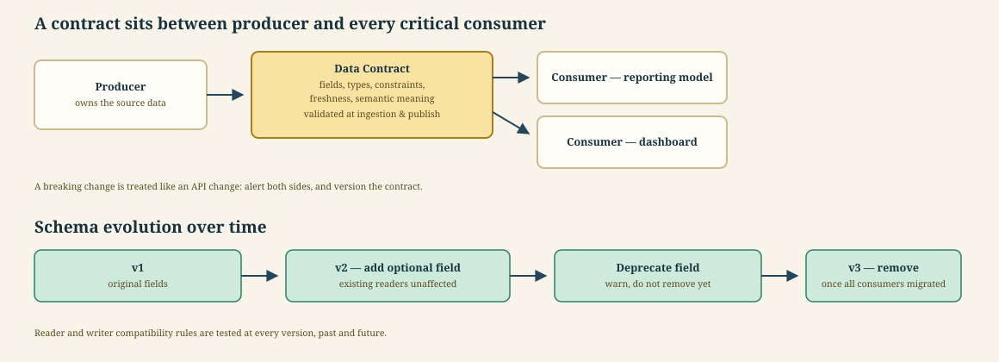

---

## Part 2 · Processing practices, revisited

### Batch, streaming, and micro-batching

**Intuition** — The choice between batch and streaming is really a choice about how much latency the business need actually requires — everything else follows from that.

**Mechanism** — Batch processing fits periodic reports, large scans, and simpler operations. Streaming fits low-latency decisions and continuous events, but adds state, ordering, replay, and monitoring complexity that batch does not need. Micro-batching offers a practical middle ground between the two. The rule of thumb: let latency requirements drive the architecture, and choose the simplest model that meets the business need — do not default to streaming because it sounds more advanced.

**Worked example** — The running example's daily reporting model only needs numbers refreshed once a day, so it runs as a simple batch job; if the business need changed to "flag a risky customer within five minutes of their action," the pipeline would need to move to streaming or, at minimum, frequent micro-batches.

**Tradeoff / when NOT to use** — Over-engineering a streaming pipeline for a report read once a day wastes the state, ordering, and replay complexity streaming requires. Under-engineering with batch for a use case that needs sub-minute freshness fails the business need outright.

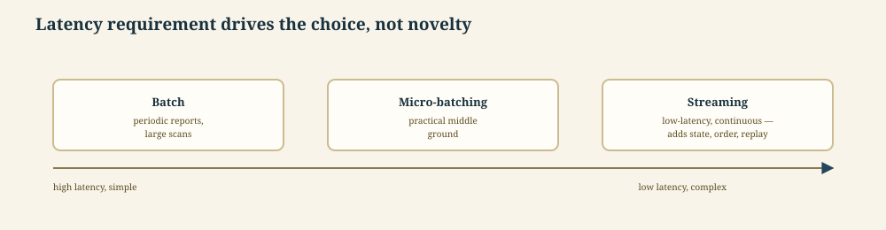

---

### Process data incrementally

**Intuition** — Reprocessing an entire dataset from scratch every run is simple to reason about but wasteful; incremental processing reads only what changed, at the cost of needing to track exactly what "changed" means.

**Mechanism** — Track a timestamp, watermark, or version for processed data. Read only new or changed records. Use stable keys to merge updates safely. Record checkpoints only after successful publication — never before. Handle late-arriving and corrected records explicitly, rather than assuming every record arrives once, on time. Test restart behavior before production deployment, since restart is where incremental logic most often breaks.

**Worked example** — The running example tracks a `last_updated` watermark on the customer table; each run reads only rows changed since the last successful checkpoint, merges them by stable customer ID, and only advances the watermark after the merge is confirmed published.

**Tradeoff / when NOT to use** — Incremental processing is more complex to build, test, and reason about (especially its restart and late-arrival handling) than a full reload. For a small dataset, a full daily reload can be simpler and safer than incremental logic, despite the extra compute it costs.

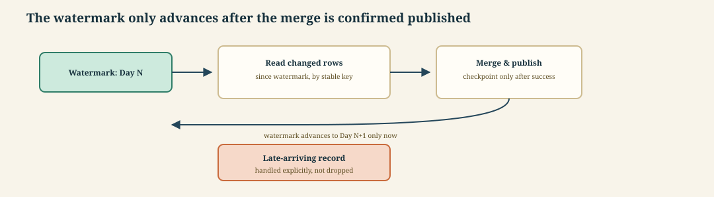

---

### Partition for safer backfills

**Intuition** — When something goes wrong with one day (or one region, or one product line) of data, you want to be able to fix just that slice — partitioning is what makes that possible without touching everything else.

**Mechanism** — Partition data by a meaningful time key or business key. Keep partition boundaries consistent across every pipeline stage, so a partition means the same thing everywhere. Run independent partitions in parallel when it is safe to do so. Backfill only the affected range, never the whole dataset. Validate totals before replacing published outputs. Avoid tiny partitions — partitioning too finely creates excessive file and metadata overhead relative to the data each partition actually holds.

**Worked example** — The running example is partitioned by date; when a bad source extract corrupts one day's data, only that day's partition is backfilled — reprocessed, validated, and swapped in — while every other day's published output is untouched.

**Tradeoff / when NOT to use** — Partitioning too finely (by hour, say, when every consumer only ever queries by month) multiplies overhead without a matching benefit. Partitioning too coarsely makes every backfill touch far more data than the actual problem requires.

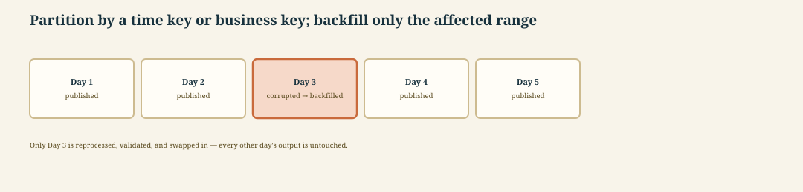

---

## Part 3 · Designing tasks that fail safely

This part is where Session 06 goes noticeably deeper than Session 05: idempotency, retries, and caching were introduced together as one basic property earlier in the course, and get split into three separate disciplines here, each with its own mechanism.

### Making every task idempotent

**Intuition** — A task is idempotent when running it twice by accident produces the same result as running it once — which is the only property that makes a retry, a rerun, or a replay actually safe.

**Mechanism** — Repeated execution should produce the same intended result. Use deterministic keys for inserts and updates, so a repeated write lands on the same row instead of creating a duplicate. Write outputs to temporary locations before an atomic publication step, so a failure mid-write never leaves a half-published result visible. Separate side effects (sending an email, charging a card) from pure transformations, since side effects are exactly what idempotency cannot make safe by itself. Record external requests to avoid duplicate actions when a call to another system cannot itself be made idempotent. Verify safe reruns during failure testing, not just during normal operation — an idempotency guarantee that was never actually tested under failure is not a guarantee.

**Worked example** — The running example's publish step upserts rows by customer ID into a temporary table, keyed deterministically, then atomically swaps that table into place — so if the publish step is retried after a mid-run crash, the retry produces the exact same published table, never a duplicate row.

**Tradeoff / when NOT to use** — Idempotent design (deterministic keys, temporary-location writes, atomic publish) adds real engineering effort up front. That effort is optional for a purely read-only reporting task, but not for anything that writes, charges, or sends — a non-idempotent retry on those can double-charge or double-send, which is a far worse failure than the original error that triggered the retry.

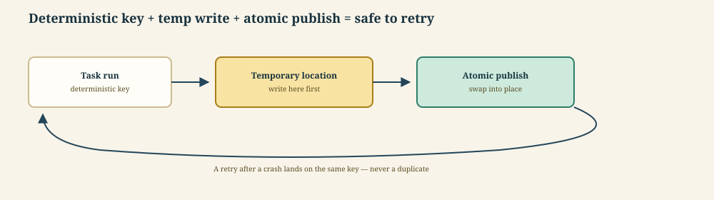

---

### Retrying with backoff and a retry budget

**Intuition** — Retrying immediately, in a tight loop, is often what turns one transient failure into an outage — backoff and a retry budget are what keep a retry from making the problem worse.

**Mechanism** — Retry temporary network, rate-limit, and service failures. Use exponential backoff — each retry waits longer than the last — and a maximum retry count, so a persistently failing call eventually stops retrying instead of looping forever. Set timeouts so stalled work cannot run indefinitely, independent of whether it ever actually fails. Do not retry deterministic code or data-quality failures blindly — retrying a deterministic bug just reproduces the same bug, and retrying bad data does not fix the data. Capture the final error with useful run context so whoever investigates does not have to reproduce the failure from scratch. Escalate permanent failures to the responsible owner rather than retrying forever.

**Worked example** — The running example's ingestion task hits a rate-limited source API; it retries with exponential backoff (1s, 2s, 4s, 8s) up to a maximum of five attempts, and if the fifth attempt still fails, the task stops retrying and escalates to the on-call engineer with the last error and the run's parameters attached.

**Tradeoff / when NOT to use** — A retry count and backoff schedule tuned for a flaky network call is wrong for a data-quality failure — retrying five times with backoff just delays the escalation that would actually fix a malformed record by several minutes for no benefit.

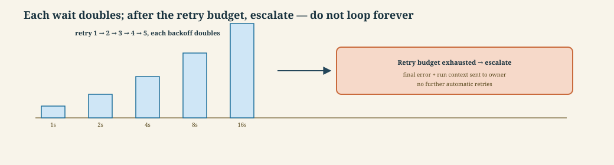

---

### Caching with clear invalidation

**Intuition** — Caching only pays off when it is easy to answer "is this cached result still valid right now?" — a cache with no clear invalidation rule just quietly serves stale results.

**Mechanism** — Cache expensive deterministic task results — results that depend only on their inputs, never on external state that changes between calls. Build cache keys from code, parameters, and input versions, so a change to any one of those three correctly produces a cache miss. Set an expiry that reflects data-freshness needs, not an arbitrary default. Invalidate when logic or upstream inputs change, rather than waiting for expiry alone. Avoid caching operations that have uncontrolled side effects, since a cached side effect (a sent notification, say) can silently fail to happen on a cache hit. Measure whether caching is actually reducing time and cost, rather than assuming it does.

**Worked example** — The running example's aggregation step is cached, keyed on a hash of its code version, its parameters, and the input data's version; an unrelated rerun with the same inputs hits the cache and skips recomputation, but a change to the aggregation logic itself changes the code-version component of the key and correctly forces a fresh computation.

**Tradeoff / when NOT to use** — Caching a task with hidden non-determinism (a call to a model API without a fixed seed, say) produces a cache that looks correct but silently serves a stale answer whenever the underlying computation would have changed. Caching is only safe once every input that affects the output is actually part of the cache key.

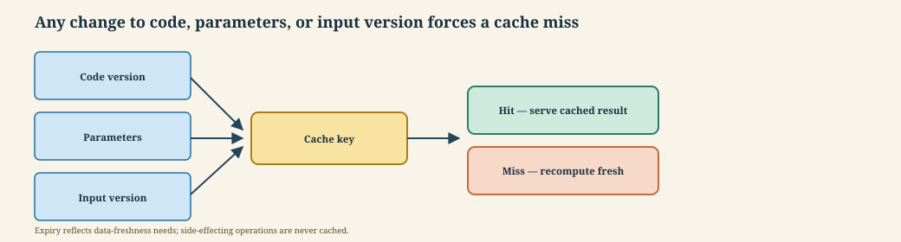

---

## Part 4 · Observability and incident readiness, deepened

### Observing data and operations

**Intuition** — You cannot operate what you cannot see, and this session adds a sixth thing to watch — the pipeline's own run behavior — to the five data-quality signals from Session 05.

**Mechanism** — Freshness shows whether expected data arrived on time. Volume reveals missing or duplicated records. Distribution detects unexpected shifts in values. Lineage identifies upstream causes and downstream impact. Run metrics — success rate, duration, retries, and queue time — track the pipeline's own operational health, separate from the data quality signals. Alerts should identify a condition that requires action, not simply report a number; an alert nobody needs to act on is noise, not observability.

**Worked example** — The running example's dashboard shows the usual five data signals plus a run-metrics panel: yesterday's run succeeded on the second retry, took 40% longer than its typical duration, and spent extra time queued waiting for a worker — none of which a purely data-quality view would have surfaced, but all of which point at the same worker-pool sizing problem.

**Tradeoff / when NOT to use** — Alerting on every run-metric fluctuation (duration, retries, queue time) for every pipeline produces alert fatigue fast. Run-metric alerting should be reserved for genuinely actionable thresholds — a duration alert only fires when a run is slow enough to actually risk missing its freshness SLO, not on every run that is a few seconds slower than average.

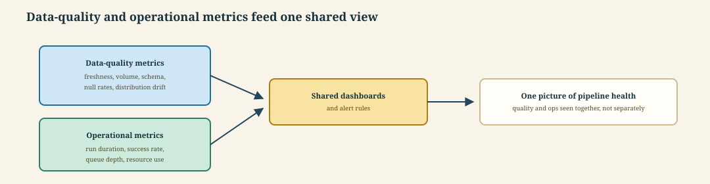

---

### Defining reliability with SLOs, revisited

**Intuition** — An SLO turns "the pipeline should be reliable" from a vague aspiration into a specific, measurable target with a defined tolerance for failure.

**Mechanism** — Choose indicators such as success rate, freshness, and duration. Set targets that reflect consumer expectations, not what is merely easy to hit. Measure over a clearly defined time window. Use an error budget for acceptable unreliability — the gap between 100% and the target is spending room for the incidents that will inevitably happen. Prioritize reliability work when the budget is exhausted, ahead of new feature work. Review targets as workloads and business needs change, since a target set a year ago may no longer reflect what consumers actually need today.

**Worked example** — The running example's SLO ("99% of days, the report is fresh by 6am") gives it a 1%-of-days error budget — roughly three days a month it can miss without breaching the SLO; once that budget is spent in a given month, further pipeline changes are paused in favor of a reliability investigation.

**Tradeoff / when NOT to use** — Setting an aggressive SLO (99.9%, say) for a dataset nobody urgently needs by a fixed time forces reliability investment that does not match what consumers actually require. The target should come from consumer expectations, not from picking an impressive-sounding number.

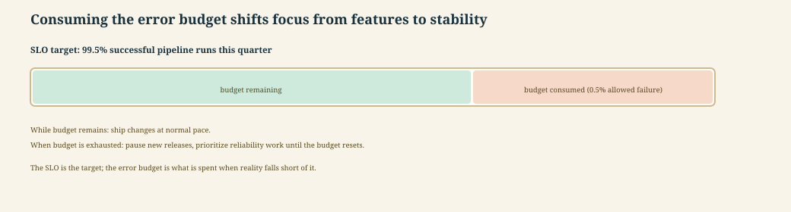

---

### Lineage speeds impact analysis, revisited

**Intuition** — When something breaks, the question is never just "what broke" — it's "what else does this affect," and lineage is the only thing that can answer that quickly.

**Mechanism** — Record which sources produce each dataset and model. Capture the transformations between upstream and downstream assets. Identify consumers before changing a schema or a schedule, not after. Trace a bad output back to its origin when an incident occurs. Prioritize recovery for high-impact data products over low-impact ones. Connect technical lineage to business ownership, so "who does this affect" always has a named answer, not just a technical one.

**Worked example** — When the running example's report looks wrong, lineage traces it back through the aggregation step to the raw extract, and forward to its two downstream consumers (the reporting model and a compliance dashboard) — both get notified before the fix ships, not after someone happens to notice.

**Tradeoff / when NOT to use** — Building and maintaining full lineage for every internal, single-consumer dataset is overhead that does not pay for itself. Lineage investment should scale with how many consumers a dataset has and how costly a missed notification would be.

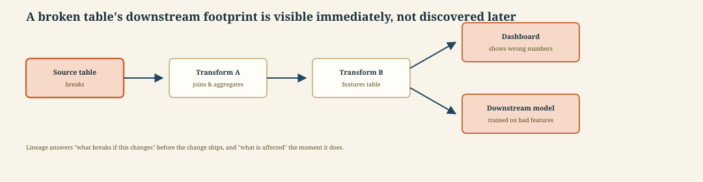

---

### Responding to pipeline incidents

**Intuition** — An incident with no named owner at each stage is how a five-minute problem becomes a five-hour one — everyone assumes someone else is handling it.

**Mechanism** — Detect the problem with an actionable alert. Triage its urgency, scope, and affected consumers. Contain the issue by pausing or isolating bad outputs. Recover through a rerun, rollback, or controlled backfill. Communicate status and expected resolution to affected consumers. Complete a blameless review and track improvements afterward — the review is what turns one incident into a permanent fix rather than a repeat.

**Worked example** — When a bad source column silently corrupts a day of the running example's output, the on-call engineer detects it via an alert, triages it as affecting the reporting model and the compliance dashboard, contains it by pausing both downstream feeds, recovers by backfilling that one day's partition, communicates the fix to both consumer teams, and a blameless review afterward adds a validity check that would have caught the bad column earlier.

**Tradeoff / when NOT to use** — Skipping the blameless review once the immediate fix is live is the most common shortcut — it feels done once data is flowing again. But without the review, the same root cause resurfaces on a different day with a different symptom.

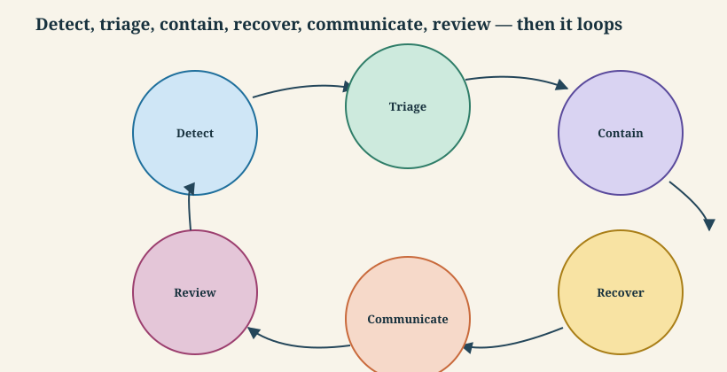

---

### Designing for disaster recovery

**Intuition** — Disaster recovery is incident response for the case where the fix requires restoring from a backup rather than a rerun — and the only way to know it actually works is to test the restore, not just write the plan.

**Mechanism** — Define a recovery time objective (how long recovery is allowed to take) and a recovery point objective (how much data loss is acceptable) before a disaster happens, not during one. Back up code, configuration, metadata, and critical data. Keep restoration procedures documented and automated — not tribal knowledge that lives only in one engineer's memory. Test recovery in an isolated environment rather than assuming it works. Verify credentials, network access, and dependencies as part of that test, since a restore that only recovers data but not the access needed to use it is not a complete recovery. Record lessons and close recovery gaps after every exercise.

**Worked example** — The running example's disaster-recovery test restores yesterday's backup into an isolated environment, confirms the restored pipeline can authenticate to the source system and publish to a test table within the recovery time objective, and logs one gap found: the restored environment's credentials had expired and needed manual renewal, which becomes this quarter's fix.

**Tradeoff / when NOT to use** — Running a full isolated-environment restore test for every pipeline on a tight cadence is expensive in engineering time. Recovery objectives, and how often DR is actually tested, should scale with how costly downtime genuinely is for that pipeline's consumers, not be applied uniformly everywhere.

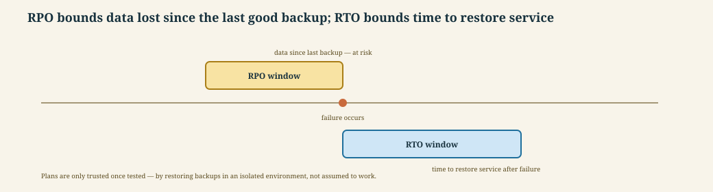

---

## Part 5 · Shipping safely, revisited

### Promoting one tested artifact, and containers

**Intuition** — If test and production ever run different code because each was built separately, "it passed in test" stops meaning anything — the fix is to build exactly once and move that one artifact forward unchanged.

**Mechanism** — Build one versioned artifact after tests pass. Separate development, test, and production using configuration — not a rebuild. Promote that same tested artifact instead of rebuilding it for each environment. Apply approvals where risk requires human review. Record who promoted which version and when. Support rollback to a known-good release. Containers are what make this practical: package code, runtime, and dependencies together; pin base images and package versions; keep environment-specific settings outside the image, in configuration; run containers with least privilege; scan images for vulnerable dependencies; and use the same image locally, in CI, and in production.

**Worked example** — The running example's pipeline is built into a container image once in CI, after its tests pass; that exact image — not a rebuild — is promoted from test to production, with only its externalized configuration (database URL, log level) changing between the two, and the promotion record shows who approved it and when.

**Tradeoff / when NOT to use** — "Build once, promote everywhere" only works if configuration is fully externalized from the artifact. Any team that lets an environment-specific value leak into the build itself breaks the guarantee that what was tested is exactly what ships.

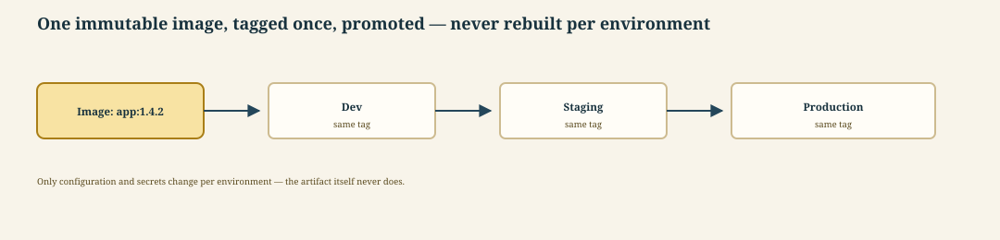

---

### Choosing the right work pool and controlling concurrency

**Intuition** — A work pool decides *where* a task executes and *how much* of it can run at once — this session adds explicit execution-target selection to the concurrency control Session 05 already covered.

**Mechanism** — Match the work pool to the execution target — local, container, VM, or Kubernetes. Separate workload classes that have different security or capacity needs into different pools. Define infrastructure defaults centrally, and override resources only when a specific deployment requires it. Restrict access to sensitive pools. Measure queue time and worker utilization to know whether a pool is sized correctly. Within a pool, control worker concurrency: match worker resources to CPU, memory, and network demand; limit concurrency to protect downstream databases and APIs; use queues to isolate workload classes further; scale out independent tasks when dependencies allow; apply backpressure when downstream systems slow down; and test scale-up and scale-down behavior under load.

**Worked example** — The running example's ingestion task, which calls a rate-limited external API, runs in a lightweight container-based work pool sized to a low concurrency limit that respects that rate limit; its unrelated, CPU-heavy aggregation task runs in a separate Kubernetes-based pool sized for high concurrency, so scaling one never affects the other's capacity.

**Tradeoff / when NOT to use** — Running every workload in the same Kubernetes-based pool "because it can handle anything" wastes the isolation a lighter-weight pool would have given a low-risk, low-resource task, and complicates access control for pools that don't actually need Kubernetes' capabilities.

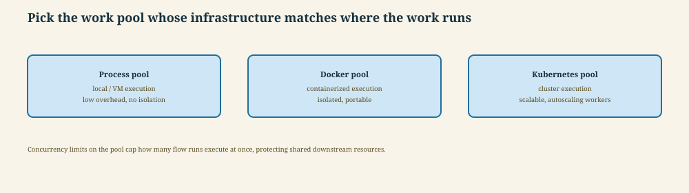

---

## Part 6 · Automating and gating the pipeline

### Event-driven triggers and parameters, revisited

**Intuition** — A schedule assumes data arrives on a predictable clock; an event trigger reacts to data arriving whenever it actually does — the tradeoff is that "whenever it actually does" includes late, duplicate, and out-of-order arrivals a schedule never has to think about.

**Mechanism** — Workflows can be triggered on file arrival, message publication, or an API request. Incoming events must be validated and deduplicated, with their metadata passed through as flow parameters. Designs must handle events that arrive late or out of order, and keep replay safe through idempotent processing. Schedules remain the right choice when event infrastructure adds no real value over a fixed clock. Parameters and configuration stay distinct: parameters describe values that change per run, while configuration defines environment and deployment behavior; parameter types and acceptable ranges should be validated, safe defaults provided for local development, secrets stored separately from both, and effective values recorded with run metadata for reproducibility.

**Worked example** — The running example could be re-triggered by a file-arrival event instead of a fixed schedule, passing the arrived file's path and its arrival timestamp as parameters, while the destination database and credentials stay in configuration, not in the event payload.

**Tradeoff / when NOT to use** — Event-driven triggers reduce latency compared to a fixed schedule, but add deduplication and ordering complexity a scheduled run never has to handle. That complexity is not worth taking on for a pipeline that does not actually need faster-than-daily results.

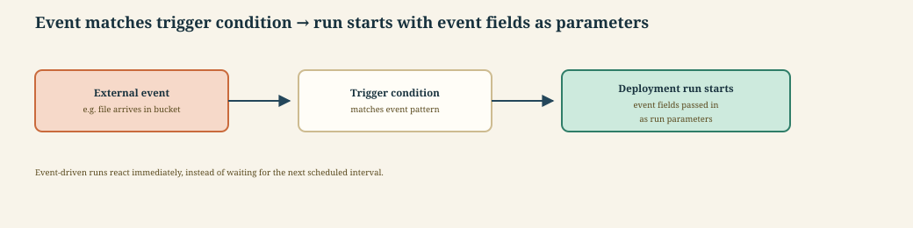

---

### Protecting secrets and identity

**Intuition** — A secret manager only helps if credentials never had to be long-lived static strings in the first place — workload identity removes the credential entirely for the systems that support it.

**Mechanism** — Store credentials in an approved secret manager, never in code or workflow files. Use short-lived workload identity where it is available, rather than long-lived static credentials — a short-lived, automatically-rotated identity limits how long a leaked credential stays useful to an attacker. Apply least privilege to storage, APIs, and orchestration throughout. Rotate credentials and remove unused access on a schedule, for the credentials that cannot use workload identity. Prevent secrets from ever appearing in logs or artifacts. Audit access to production data and deployments.

**Worked example** — The running example's cloud storage access uses the orchestration platform's workload identity — no long-lived key exists to leak — while its one remaining static credential (the source system's API key, which does not support workload identity) is stored in a secret manager, scoped to only the workflow that needs it, and rotated quarterly.

**Tradeoff / when NOT to use** — Not every system supports workload identity, so a pipeline that depends on legacy systems will always have some static credentials to manage — the goal is to minimize that set, not to eliminate it entirely where it genuinely cannot be eliminated.

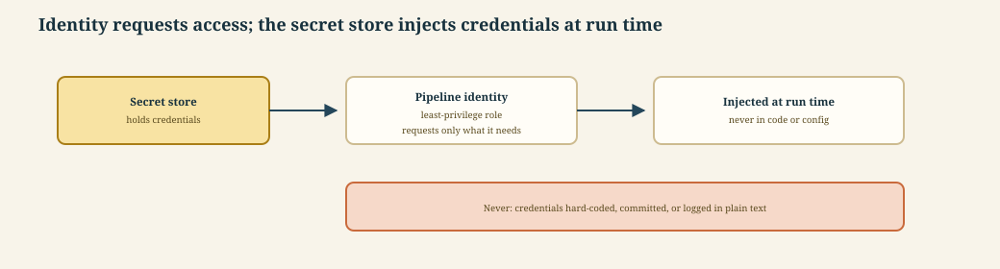

---

### Automating with the Prefect API, revisited

**Intuition** — Once a pipeline is running on a schedule, the next question is how other systems — a dashboard, an incident tool, a maintenance script — find out what it's doing, without someone opening the Prefect UI by hand.

**Mechanism** — Query deployments, flow runs, states, and durations programmatically. Trigger parameterized runs from another service. Pause schedules during maintenance windows. Build daily reliability reports and capacity reports from run states and durations. Connect failed-run metadata to incident tooling automatically. Use scoped API credentials, and protect them from ever appearing in logs.

**Worked example** — The running example's on-call rotation gets a daily reliability and capacity report, generated by querying the previous day's flow runs and durations through the API, and any failed run automatically opens a ticket in the incident tool with the run's error and parameters attached.

**Tradeoff / when NOT to use** — Building a custom reporting or incident-tooling integration against the API is worth the engineering time once a team is on-call for a pipeline. For a pipeline with no on-call rotation and no downstream dependents, the Prefect UI alone is enough, and the integration is effort spent for no one who will use it.

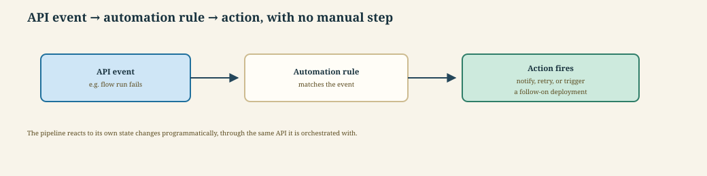

---

### Building CI quality gates

**Intuition** — A CI pipeline for data code needs to check more than "does it run" — it needs to check the same schema and contract correctness a human reviewer would, automatically, on every change.

**Mechanism** — Lint and format workflow code on every pull request. Run unit tests for transformations and business rules. Validate schemas and data contracts with test fixtures. Scan dependencies and container images for vulnerabilities. Run integration tests against controlled services. Block deployment until every required check passes — a quality gate that can be overridden is not actually a gate.

**Worked example** — A pull request that changes the running example's cleaning logic triggers linting, a unit test on the cleaning logic, and a contract test against a fixed test schema; the pull request cannot merge until all three pass, and a separate integration test against a controlled test copy of the source system runs before the change reaches production.

**Tradeoff / when NOT to use** — Requiring every check (lint, unit, contract, dependency scan, integration) to pass before every merge slows down iteration speed on a low-risk, early-stage pipeline. The right response is usually to keep the gates but make the fast ones (lint, unit tests) mandatory on every push and reserve the slower ones (integration tests) for merge or deploy time — not to drop gates altogether.

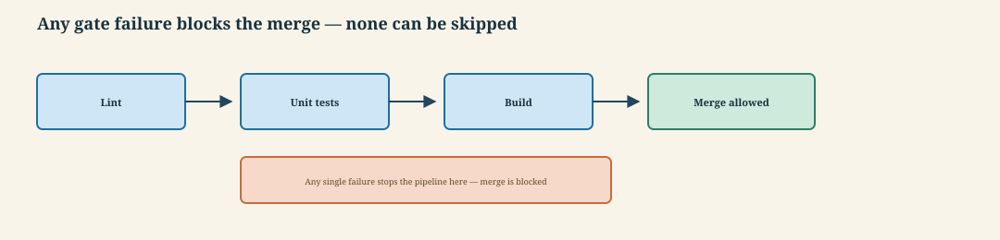

---

## Part 7 · Releasing and tracking in production, revisited

### Choosing a release strategy, revisited

**Intuition** — Deploying a change and turning it on for everyone at once is the riskiest possible release strategy — every alternative here trades some deployment simplicity for a smaller blast radius if the change is bad.

**Mechanism** — A **Rolling** release updates capacity gradually. **Blue-green** keeps the previous environment fully ready for immediate rollback while the new one takes traffic. **Canary** exposes a limited amount of traffic or workload to the new version first, before a full rollout. **Shadow** runs compare the new version's outputs against the old one without affecting real consumers at all. **Feature flags** separate deployment (the code is live) from activation (the feature is actually turned on). The strategy is chosen based on how reversible the change is and how much impact a bad version could have.

**Worked example** — Updating the running example's reporting model ships via shadow run first — the new model computes results alongside the old one, invisibly, so its output can be compared before it ever affects a real consumer — and only moves to canary once the shadow comparison looks right.

**Tradeoff / when NOT to use** — Canary and shadow strategies need enough run volume to produce a meaningful signal quickly. For a low-volume daily batch pipeline, blue-green, or simply a proven rollback plan, often fits better than release techniques borrowed from high-traffic web services.

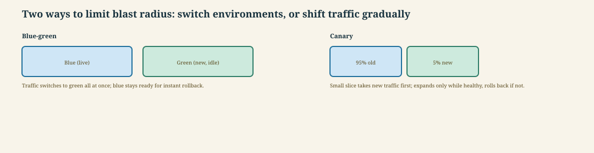

---

### Optimizing cost and performance, revisited

**Intuition** — Cost optimization for a pipeline is not "spend less" in the abstract — it is a specific set of levers, each of which trades against latency or recovery in a way that has to be made explicit, not assumed away.

**Mechanism** — Measure runtime, resource use, queue time, and data scanned before optimizing anything. Right-size workers using observed demand, not a guess. Cache deterministic, expensive results. Prefer incremental processing over full refreshes wherever the incremental logic is already justified. Schedule flexible, non-urgent workloads during lower-cost periods. Throughout, balance savings against latency and recovery goals — a cheaper pipeline that misses its SLO or its recovery objective is not actually an improvement.

**Worked example** — The running example's cost was cut by switching its daily reload to incremental processing and moving its non-urgent backfill jobs to an off-peak schedule window — without changing its SLO or its recovery plan.

**Tradeoff / when NOT to use** — Aggressively right-sizing workers to the median observed load causes failures or slowdowns the moment demand spikes above that median. Cost optimization should never be allowed to trade away the reliability and recovery objectives set elsewhere in this session.

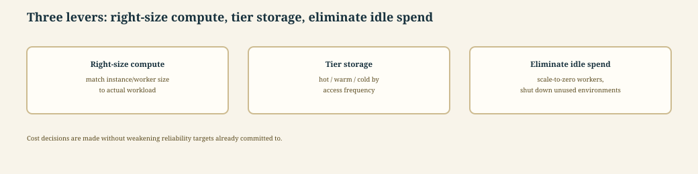

---

### Tracking models and artifacts in production

**Intuition** — A model that is deployed and never checked again is a model you have already lost track of — tracking artifacts is what keeps "deployed" from silently drifting into "unaccountable."

**Mechanism** — Store datasets, metrics, reports, and models as versioned artifacts. Attach the producing run ID and timestamp to each. Record the training data and feature definitions behind every model. Compare candidate models with an approved baseline before promoting them. Promote only artifacts that pass quality criteria. Retain the metadata required for reproduction and audit.

**Worked example** — The running example's reporting model is stored as a versioned artifact with its training data and feature definitions recorded; a new candidate model is compared against the current approved baseline on the same held-out data before it is allowed to replace it.

**Tradeoff / when NOT to use** — Comparing every candidate model against a baseline that is never itself reviewed gives a false sense of safety — "beats the baseline" stops meaning "good enough for production" once the baseline itself has quietly gone stale.

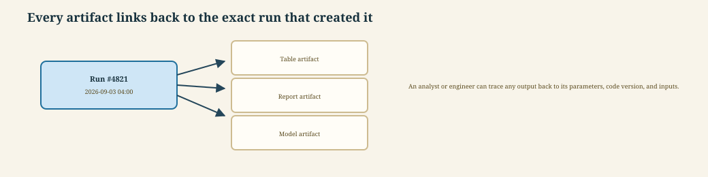

---

## Part 8 · Bringing it together, again

### Capstone: designing a reliable pipeline, and the production-readiness review

**Intuition** — Every practice in this session is easy to nod along to individually; the capstone scenario and the production-readiness review are what force you to apply all of them, together, to one pipeline at once — for the second time this course, with sharper detail than the first pass required.

**Mechanism** — The capstone scenario is the same running example used throughout both sessions: daily customer data feeds a reporting model. Designing it end to end means: define contracts, quality gates, and ownership; split the workflow into flows and tasks; choose retries, caching, and backfill behavior; design CI/CD, security, and deployment controls; and present monitoring signals and an incident response plan. The production-readiness review (PRR) confirms all of it is actually in place: consumer expectations and ownership are documented; code, contracts, environments, and parameters are versioned; tests cover transformations and integration boundaries; deployment, rollback, and backfill procedures are proven, not just planned; dashboards and actionable alerts are active; and security, cost, retention, and audit requirements are satisfied.

**Worked example** — Walking the running example through this session's PRR: consumer expectations are documented for both downstream consumers (the reporting model and the compliance dashboard); the contract, container image, and deployment configuration are all versioned; unit, contract, and integration tests all pass in CI; a real backfill and a real disaster-recovery restore have both been tested, not just described; and the freshness SLO has a live dashboard with an actionable alert.

**Tradeoff / when NOT to use** — Treating the PRR as a one-time gate passed before first launch — rather than a periodic re-check — lets a pipeline drift out of compliance as its data, team, dependencies, and business requirements change silently over time.

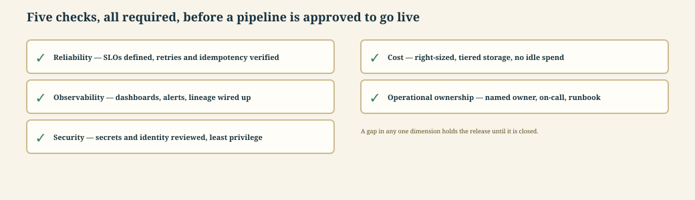

---

## Self-study / Lab / build

This session has no separate lab of its own — it deepens Lab 1's practices rather than introducing a new build. Revisit your Session 05 Prefect flow and extend it: split its retry, cache, and idempotency handling into three distinct, clearly labeled pieces instead of one combined "safe task" treatment; add a disaster-recovery test by deliberately deleting your flow's local state and restoring it from your data's source of truth; and run your flow's changes through a small CI quality gate (lint plus one unit test) before you consider the extension done. Finally, write a one-paragraph note on which of this session's practices (schema evolution, work-pool selection, secrets/identity, disaster recovery) your Session 05 flow was still missing — that gap list is the actual takeaway from revisiting the same pipeline twice.

*Exam: this session is in scope for the **closed-book mid-sem** (contact sessions 1-8) and the **open-book comprehensive** (all sessions). Full evaluation weights, dates and course logistics live once in [`549-master.md`](../549-master.md) — not repeated per session.*
