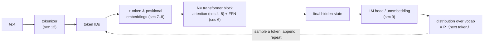
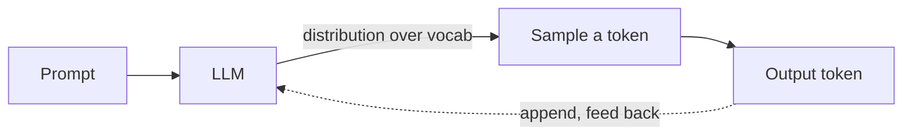
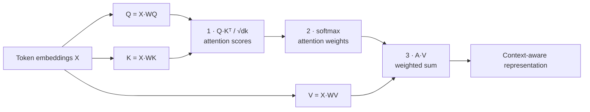
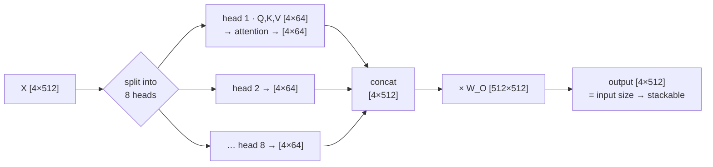
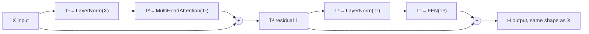
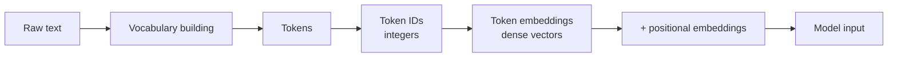
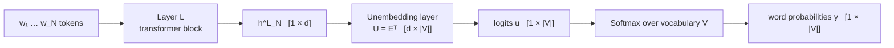
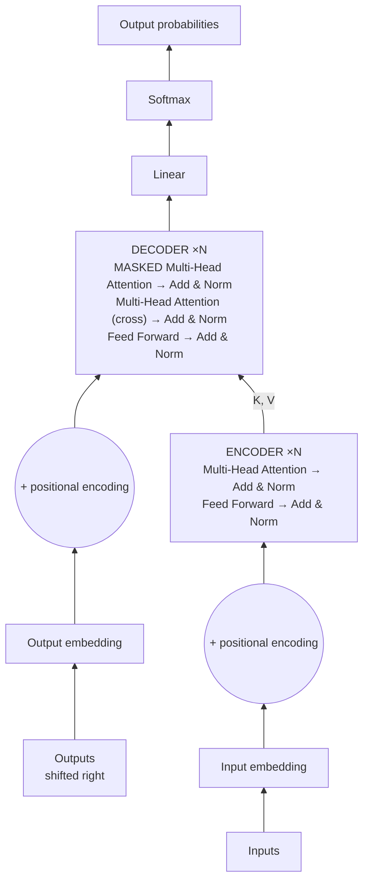

# Large Language Models for Generative AI · Session 01 · Foundations of Large Language Models

*Learned ____*

## Why this matters

This is the session that makes you fluent in how modern AI actually works under the hood. **Every LLM you'll use, fine-tune, or deploy in your career is a transformer doing next-token prediction** — and this is where *attention*, *embeddings*, *context window*, *tokenization* and *decoder-only* stop being buzzwords and become things you can compute and reason about. Get this and you can read any model card, debug a tokenizer surprise, size a context window against its cost, or answer the interview question about how attention scales. It's the vocabulary and machinery the whole field is written in.

**Running example throughout:** **Llama-3 8B** (d = 4096, 32 heads, d_k = 128). Anchor every new number to it.

## Topics

**Part 1 · What a language model is** — *the conceptual base, and the longest stretch of her class time*

| # | Concept | In one line | Depth | Comes back in |
|---|---|---|---|---|
| 1 | **What a language model is** | P(W) and P(next word); why word order emerges from counting | 🔧 | 521 S1 |
| 2 | **What makes it "large"** | Three different things, each with its own cost | 🗺️ | 536 S5–6 · `quantization` |
| 3 | **Generation as prediction** | Why any NLP task can be recast as next-word prediction | 🔧 | 521 S1 · `rag` |

**Part 2 · How the machinery works** — *worked by hand; ~17 minutes on attention alone*

| # | Concept | In one line | Depth | Comes back in |
|---|---|---|---|---|
| 4 | **Self-attention** | Q/K/V, the three-step computation, and the shape table | 🔧 | 536 S4, S5 · 521 S1 |
| 5 | **Multi-head attention** | Why h heads cost the same as one; the N=4, d=512 example | 🔧 | 536 S3, S4 |
| 6 | **The transformer block** | The equations, two residuals, pre-norm | 🔧 | 536 S3 |
| 7 | **Positional encoding** | Attention has no sense of order; learned vs sinusoidal vs RoPE | 🔧 | 536 S3, S5 |

**Part 3 · Text in, text out** — *the pipeline wrapped around the model*

| # | Concept | In one line | Depth | Comes back in |
|---|---|---|---|---|
| 8 | **Text → tokens → embeddings** | Special tokens, the lookup with real numbers, positional addition | 🔧 | `tokenization` · 521 S1 |
| 9 | **LM head and weight tying** | Three shapes, and a 13%-of-parameters decision | 🔧 | 536 S5, S6 |
| 10 | **Context length** | Why it's capped by O(n²) and KV-cache, not ambition | 🗺️ | 521 S1 · `quantization` · `rag` |

**Part 4 · The landscape** — *comparison tables; recognise, don't over-invest*

| # | Concept | In one line | Depth | Comes back in |
|---|---|---|---|---|
| 11 | **Architectures** | Encoder-only vs decoder-only vs encoder-decoder, and why decoder-only won | 🗺️ | 536 S3 · 521 S1 |
| 12 | **Tokenization** | The full treatment lives in `_shared/`; **Lab 1 is here** | 🔧 | `tokenization` · 521 S1 |
| 13 | **The LLM landscape** | The causal chain, and the three levels of openness | 🗺️ | 521 S3 · 546 S10 |

**Depth** — 🔧 *Mechanism*: reproduce it from a blank page · 🗺️ *Landscape*: recognise and compare, don't memorise · ⚖️ *Judgment*: form an opinion you can defend

---

## The whole thing in one picture

*My own synthesis (not from one slide) — how the numbered sections below snap together into a single forward pass. Every decoder-only LLM is this loop:*



One pass turns the whole prompt into **one** probability distribution over the next token; the dashed arrow — append the sampled token and run it again — is what makes generation **autoregressive** (section 3). Hold this picture and every section below is "what happens at this one box." The **context length** (section 10) is just how long the `token IDs` list is allowed to get, and the **O(n²)** cost lives entirely in the attention inside the block.

---

## Part 1 · What a language model is

### 1. What a language model is

*Reference: T1 Jurafsky & Martin, *Speech and Language Processing* ch3 (N-gram language models) — the P(W) framing.*

**Intuition** — A language model answers one question: *given what came before, what comes next?* Everything else in this course is built on that.

**Mechanism** — formally, a model that computes either:

- the probability of a sentence, **P(W)**, or
- the probability of an upcoming word, **P(wₙ | w₁, w₂, …, wₙ₋₁)**

Equivalently: it assigns a probability to each possible next word — **a probability distribution over the vocabulary**.

**Worked example — the deck's own:**

```
P(all of a sudden I notice three guys standing on the sidewalk)
    >
P(on guys all I of notice sidewalk three a sudden standing the)
```

Same words, different order. A language model that has learned English assigns far more probability to the first. That's the entire signal — no grammar rules were written down; word order emerged from counting.

**Tradeoff / what this framing costs** — Defining a model purely by next-word probability means there is **no notion of truth in the objective**. A fluent falsehood scores well; that's not a bug in the training, it's what the objective asked for. Hallucination is downstream of this definition, which is why S14 needs separate faithfulness metrics.


Cross-link: → **521 S1 section 8** (the same object seen from the application side — what it lets an agent do, and how each capability has a matching failure)

---

### 2. What makes a language model "large"

*Reference: R1 Raschka, *Build a Large Language Model (From Scratch)* ch1.*

**Intuition** — "Large" is not one thing. The deck names three, and the exam can ask for all three:

1. **Model size** — number of parameters
2. **Dataset size** — trained on massive text, "large portions of the entire publicly available text on the internet"
3. **Context** — a larger context of words

LLMs are **deep neural networks** trained on that data.

**Tradeoff** — all three scale cost. Parameters cost memory and inference compute; data costs collection, cleaning and training time; context costs attention compute that grows **quadratically** with sequence length (section 4). Each of the three has its own optimisation topic later: quantization for parameters (S6), scaling laws for data (S2), and efficient attention for context (S4).


Cross-link: → `_shared/quantization.md` · **536 S5–6** — *every one of the three "large" axes becomes a serving cost later; scale is the thing compression exists to undo*

---

### 3. Generation as prediction

*Reference: T2 Alammar & Grootendorst, *Hands-On Large Language Models* ch1.*

**Intuition** — This is the session's key idea, and the deck calls it *the fundamental intuition of language models*: **a model that can predict text can also generate text, by sampling from the distribution it predicts.** Prediction and generation are the same machine used in two directions.

A model used this way is an **autoregressive language model** — each generated token is fed back in to predict the next.



**Mechanism — the chain rule, then a loop.** A language model scores a whole sequence by factorising it into next-token predictions:

```
P(w₁ … w_n) = ∏  P(w_i | w₁ … w_{i−1})
              i=1..n
```

Generation runs that factorisation *forward*. Four steps, repeated until a stop condition:

| Step | What happens | Shape |
|---|---|---|
| 1 | Feed the context through the model → **logits**, one raw score per vocabulary entry | `[1 × \|V\|]` |
| 2 | **softmax** turns logits into a probability distribution: `p_i = e^{z_i} / Σ_j e^{z_j}` | `[1 × \|V\|]` |
| 3 | **Select** a token — `argmax` (greedy) or sample from `p` | one ID |
| 4 | **Append** it to the context and return to step 1 | context grows by 1 |

The loop stops at an end-of-sequence token or a length cap. Step 3 is the only place randomness enters — which is why the *same* model gives different answers on different runs, and why `temperature=0` makes it deterministic.

**Worked example — generate two tokens by hand.** Vocabulary of five: `the, cat, sat, mat, <eos>`. Prompt: `"The"`.

*Step 1 — the model emits logits, softmax converts them:*

| Token | logit z | e^z | p = e^z / 13.345 |
|---|---|---|---|
| the | 2.0 | 7.389 | **0.554** |
| cat | 1.0 | 2.718 | **0.204** |
| sat | 0.5 | 1.649 | 0.124 |
| mat | 0.2 | 1.221 | 0.092 |
| `<eos>` | −1.0 | 0.368 | 0.028 |
| | | Σ = 13.345 | Σ = 1.000 |

Greedy decoding would pick `the` (0.554) and loop forever. **Sampling** picks `cat` often enough that the sentence goes somewhere — the first concrete reason decoding strategy matters, which is the whole of S5.

Say we sample **`cat`**. Context is now `"The cat"`.

*Step 2 — feed the longer context back in:*

| Token | p |
|---|---|
| the | 0.064 |
| cat | 0.078 |
| **sat** | **0.702** |
| mat | 0.086 |
| `<eos>` | 0.070 |

The distribution **sharpened** — 0.204 → 0.702 for the winner. More context means less uncertainty. That is the entire mechanism behind "prompting works": you are not instructing the model, you are conditioning the distribution.

⚠️ **The reframe that matters:** nothing in these two steps knows what a sentence *is*. There is no grammar module and no plan. Fluency is what a good conditional distribution looks like from the outside.

**The consequence that makes LLMs general** — *almost any NLP task can be modelled as word prediction.* The deck's two examples:

**Sentiment classification** becomes a comparison of two probabilities:

```
P("positive" | "The sentiment of the sentence 'I like Jackie Chan' is:")
P("negative" | "The sentiment of the sentence 'I like Jackie Chan' is:")
```

**Question answering** becomes next-word prediction:

```
P(w | Q: Who wrote the book "The Origin of Species"? A:)
```

**Generative AI** is the broader area: using computational models to generate text, code, speech, images, video and audio. LLMs are the text branch. And LLMs are **(mostly) natural language generation (NLG) systems** — the process of generating text with them is called **decoding** (the whole of S5).

**Tradeoff / when NOT to reframe a task as generation** — You *can* express classification as generation, and it's often worse: a fine-tuned classifier is smaller, faster, cheaper and gives calibrated probabilities, where an LLM gives you a token that happens to read "positive". Reframing buys generality and zero-shot capability; it costs efficiency and calibration. This is the same tradeoff 546 draws in its foundation-models section — the expensive general answer versus the cheap specific one.


Cross-link: → **521 S1 section 8** · `_shared/rag.md` — *"plausible continuation" is the mechanism; hallucination is that mechanism running without evidence*

---

## Part 2 · How the machinery works

### 4. Self-attention

*Reference: T2 ch3; the original ["Attention Is All You Need"](https://arxiv.org/abs/1706.03762) (Vaswani et al. 2017); [Alammar, "The Illustrated Transformer"](https://jalammar.github.io/illustrated-transformer/).*

**Intuition** — Self-attention lets every token look at every earlier token and decide how much each one matters to it. The deck's framing: it gives **an uncompressed view of the entire sequence with fast training**. "Uncompressed" is the key word — unlike an RNN, nothing is squeezed through a fixed-size hidden state; every position stays individually addressable.

It builds a matrix comparing each token with every token before it, weighted by **how relevant the token pairs are to one another**. During training the whole matrix is computed **in one go**, which is what enables **parallelisation** — and that, not accuracy alone, is why transformers won.

**Mechanism — the three vectors.** Every token produces three projections, and the deck's phrasing for each is worth memorising verbatim:

| | Name | The question it asks |
|---|---|---|
| **Q** | Query | *"What am I looking for?"* — the current token asking a question of every previous token |
| **K** | Key | *"What do I contain?"* — each past token advertising its relevance to the query |
| **V** | Value | *"What do I contribute?"* — the actual content pulled in once relevance is decided |

**The computation, in three steps:**



1. **Q · Kᵀ** — dot product: how similar is the query to each key? Higher = more relevant.
2. **÷ √d_k** — scaling: keeps scores from blowing up and destabilising the softmax. *Why √d_k specifically (my clarity — the deck states the effect, not the reason): each score is a dot product of two d_k-dimensional vectors, so its size grows with the dimension — variance ≈ d_k, typical magnitude ≈ √d_k. Dividing by √d_k renormalises scores back to unit scale. Skip it and, at d_k = 128, scores run into the tens; softmax of widely-spread inputs saturates to almost one-hot, its gradient collapses toward 0, and the layer stops learning. √d_k is exactly the factor that cancels the dimension's inflation.*
3. **softmax → × V** — blend the values by how much attention each token deserves.

As the original paper's block, which is the form to reproduce in an exam:

```
MatMul(Q, Kᵀ) → Scale (÷√d_k) → Mask (optional) → SoftMax → MatMul(·, V)
```

The **Mask** step is optional in the general figure and **mandatory in a decoder** — it's what enforces causality (section 11).

Then an **output projection** maps the result from (n × d_v) back to (n × d), the model dimension, so layers can stack.

**Worked example — the shapes, which you must be able to write from memory.** Notation: **n** sequence length · **d** model/embedding dim · **d_k** key/query dim · **d_v** value dim · **h** heads.

| Tensor | Shape |
|---|---|
| X | n × d |
| W_Q, W_K | d × d_k |
| W_V | d × d_v |
| Q, K | n × d_k |
| V | n × d_v |
| QKᵀ ÷ √d_k | **n × n** |
| A = softmax(...) | **n × n** |
| Z = A · V | n × d_v |

| Model | d | h | d_k = d_v |
|---|---|---|---|
| Vaswani et al. 2017 (original) | 512 | 8 | 64 |
| Llama-3-8B | 4096 | 32 | 128 |

**Worked example — attention by hand, with actual numbers** *(my own — the deck gives only shapes, but you don't *have* attention until you've pushed numbers through it).* Two tokens, `d = d_k = d_v = 2`, and take `W_Q = W_K = W_V = I` so `Q = K = V = X` (keeps the arithmetic visible). Tokens: `x₁ = [1, 0]`, `x₂ = [1, 1]`.

**① Scores `QKᵀ`** — every query dotted with every key:

| | K(x₁) | K(x₂) |
|---|---|---|
| **Q(x₁)** | 1·1+0·0 = **1** | 1·1+0·1 = **1** |
| **Q(x₂)** | 1·1+1·0 = **1** | 1·1+1·1 = **2** |

**② Scale `÷√d_k = ÷√2`** → x₂'s row becomes `[0.71, 1.41]`.

**③ Causal mask** (decoder — a token cannot see the future): x₁'s score against x₂ is set to `−∞`, so x₁ may attend only to itself.

**④ Softmax each row → attention weights** (a probability distribution over the allowed tokens):

| | on x₁ | on x₂ |
|---|---|---|
| **x₁** | **1.00** | — (masked) |
| **x₂** | **0.33** | **0.67** |

*(x₂'s row: `e^0.71 / (e^0.71 + e^1.41) = 2.03 / 6.14 = 0.33`; the rest is 0.67.)*

**⑤ Weighted sum `Z = A·V`:**
- `z₁ = 1.00·[1,0] = ` **`[1, 0]`** — with the mask, token 1's new vector is just itself.
- `z₂ = 0.33·[1,0] + 0.67·[1,1] = ` **`[1, 0.67]`** — a blend, leaning 67% on itself and 33% on token 1.

That last line **is** attention: each token's output is a **weighted average of value vectors**, and the weights are *learned relevance*. Notice the weight table is `2 × 2` (n × n) — that's the whole cost story, and it grows with every token added. This is the O(n²) the tradeoff below is about.

**Tradeoff / the cost that defines the field** — the attention matrix is **n × n**. Double the context and you quadruple the attention compute and memory. Every efficiency topic in S4 — FlashAttention, Ring Attention, sliding-window, sparse and linear attention — exists to attack that single quadratic term. Self-attention buys an uncompressed view and parallel training; it charges O(n²).

> ***In practice*** *(beyond the deck — what this O(n²) means when you actually use LLMs):*
> - You **never implement attention yourself** in a real job — you call an optimised kernel (**FlashAttention**) inside a serving stack (**vLLM**, **TGI**, TensorRT-LLM). Knowing the maths is what lets you reason about *why* a 100K-token prompt is slow and expensive, not code the softmax.
> - At **inference** the trick that makes generation fast is the **KV-cache**: keys and values for past tokens are cached so each new token is O(n) not O(n²). This is why the *first* token of a long prompt is slow ("prefill") and later tokens are fast ("decode") — a distinction you'll meet the moment you look at latency metrics.
> - Practical consequence: **long prompts cost real money and time.** "Just paste the whole document in" runs straight into this quadratic. It's the reason retrieval (RAG) exists — fetch the relevant 4K tokens instead of paying for 100K.


Cross-link: → **521 S1 section 8** (self-attention → multi-turn coherence) · **536 S4** (attention efficiency) · **536 S5** (KV-cache — caching exactly the K and V computed here)

---

### 5. Multi-head attention

*Reference: "Attention Is All You Need" sec. 3.2.2; Alammar's *Illustrated Transformer*.*

**Intuition** — One attention head learns one notion of relevance. Run several in parallel with **their own K, Q, V weight matrices** and each can specialise — syntax, coreference, topic. Concatenate, project back down, and the output is the same size as the input, **so layers can be stacked**.

**Mechanism — four steps.** For h heads on an input `X [N × d]`:

| Step | Operation | Result |
|---|---|---|
| 1 · **Project** | For each head i, compute `Q_i = X·W_Qi`, `K_i = X·W_Ki`, `V_i = X·W_Vi`, where each `W ∈ ℝ^{d × d_k}` | h sets of `[N × d_k]` |
| 2 · **Attend** | Run the section-4 computation independently in each head: `softmax(Q_iK_iᵀ / √d_k)·V_i` | h outputs of `[N × d_k]` |
| 3 · **Concatenate** | Stack the h head outputs side by side along the feature axis | `[N × h·d_k] = [N × d]` |
| 4 · **Project out** | One final multiply by `W_O ∈ ℝ^{h·d_v × d}` to mix what the heads found | `[N × d]` |

Step 4 is the one people skip. Without `W_O` the heads never talk to each other — the concatenation would just be h separate results parked next to one another. **`W_O` is what makes it multi-*head* attention rather than h independent attentions.**

**The key economy** — because each head works in a *reduced* dimension d_k = d_v = d/h, **the total computational cost is similar to single-head attention at full dimensionality.** You get multiple views for roughly the price of one. That sentence is a likely exam question.

**Worked example — reproduce this by hand.** Input length N = 4, d = 512, heads A = 8, so d_k = d_v = 512/8 = **64**.

| Tensor | Shape | Why |
|---|---|---|
| Input X | **4 × 512** | 4 tokens, 512-dim embeddings |
| Projection matrices W | **512 × 64** | project d down to d_k per head |
| Q | **4 × 64** | per head |
| K | **4 × 64** | per head |
| V | **4 × 64** | per head |
| One head's output | **4 × 64** | |
| Concatenated 8 heads | **4 × (8×64) = 4 × 512** | back to model width |
| W_O | **(8×64) × 512 = 512 × 512** | output projection |
| **Final MHA output** | **4 × 512** | same shape as input → stackable |

Weight-matrix notation from the slide: W_Qi ∈ ℝ^(d×d_k), W_Ki ∈ ℝ^(d×d_k), W_Vi ∈ ℝ^(d×d_v), W_O ∈ ℝ^(h·d_v × d).

*The same worked example as a picture (my own) — split the model width into h heads, attend in each, concatenate back, project once:*



Each head runs the exact five-step computation from section 4, just in 64 dimensions instead of 512 — that's why h heads cost about the same as one full-width head.

**Tradeoff** — More heads means more specialised views but a smaller dimension each, so beyond some point each head is too narrow to represent anything useful. And note what multi-head does *not* fix: the n × n matrix exists **per head**, so KV-cache memory scales with head count — which is precisely the problem MQA, GQA and MLA solve in S5.


Cross-link: → **536 S3** (grouped-query attention shrinks the heads' KV footprint) · **536 S4**

---

### 6. The transformer block

*Reference: T2 ch3; "Attention Is All You Need" sec. 3. On pre-norm specifically, Xiong et al. 2020, "On Layer Normalization in the Transformer Architecture".*

**Intuition** — Attention alone only *mixes* information between tokens. The block adds the parts that *process* it: a feed-forward network to do computation, layer normalisation to keep training stable, and residual connections so gradients survive depth.

**Mechanism — the block, as equations.** The deck gives these twice, and they were images not text, so they are easy to miss. **Learn the two-line form; be able to expand it to the six-line form.**

Compact (pre-norm, which is what modern LLMs use):

```
O = X + MultiHeadAttention(LayerNorm(X))
H = O + FFN(LayerNorm(O))
```

Expanded step by step, with **T** marking each intermediate ([N × d]):

```
T¹ = LayerNorm(X)
T² = MultiHeadAttention(T¹)
T³ = T² + X            ← residual 1
T⁴ = LayerNorm(T³)
T⁵ = FFN(T⁴)
H  = T⁵ + T³           ← residual 2
```



Three things to read off it, all examinable:

1. **Two residual connections**, one around attention and one around the FFN. `X` and `T³` both reappear as addends — that's what lets gradients reach the bottom of a deep stack.
2. **LayerNorm comes *before* each sublayer, not after** — `LayerNorm(X)` feeds attention, and the residual adds the *un*-normalised `X`. This is **pre-norm**, and it's why deep transformers train stably.
3. **H has the same shape as X**, which is what makes blocks stackable.

**Worked example — one token through the block.** Take `d = 4`, `d_ff = 16`, and follow a single token's vector. Every step below is `[1 × 4]` unless stated.

Suppose the token's incoming vector is `X = [2, 4, 4, 6]`.

*T¹ = LayerNorm(X)* — normalise **across the 4 features of this one token**:

```
mean μ = (2+4+4+6)/4                = 4.0
var  σ² = ((−2)²+0²+0²+2²)/4        = 2.0
std  σ  = √2                        ≈ 1.414

T¹ = (X − μ)/σ = [−1.414, 0, 0, +1.414]
```

(then scaled by the learnable `γ` and shifted by `β`, both `[1 × 4]`, initialised to 1 and 0)

*The rest of the block, by shape:*

| Step | Operation | Shape | Note |
|---|---|---|---|
| T¹ | LayerNorm(X) | `[1 × 4]` | computed above |
| T² | MultiHeadAttention(T¹) | `[1 × 4]` | mixes across tokens — the only step that looks sideways |
| T³ | T² **+ X** | `[1 × 4]` | residual adds the **un-normalised** input |
| T⁴ | LayerNorm(T³) | `[1 × 4]` | |
| T⁵ | FFN(T⁴): `[1×4]·[4×16] → [1×16]` then `[1×16]·[16×4]` | `[1 × 4]` | **expand 4× then contract** |
| H | T⁵ **+ T³** | `[1 × 4]` | residual 2 — same shape as X ✅ |

**Two things to notice, both examinable:**

1. **The residual adds `X`, not `T¹`.** If it added the normalised version, the block would have no clean gradient path back to the original input — that's the whole point of pre-norm.
2. **Only step T² looks at other tokens.** LayerNorm is per-token, the FFN is per-token. A transformer block is *one* mixing operation wrapped in a lot of per-token processing — which is why the FFN can be sharded across devices trivially and attention cannot.

**Parameter count for this toy block:** attention `4 × (4×4) = 64` (W_Q, W_K, W_V, W_O) · FFN `4×16 + 16×4 = 128` · LayerNorm `2 × 2 × 4 = 16`. **The FFN is 2× the attention** — at real scale it stays roughly 2:1, which is the arithmetic behind the tradeoff below.

**The components:**

**Layer normalisation** — applied **independently to each token's hidden vector**, normalising **across the feature dimension** (not across the batch or the sequence — that's the distinction that gets examined). Has **two learnable parameters, γ and β**.

**Feed-forward network (FFNN)** — uses the contextual information created by the attention layer to capture complex relationships. A fully-connected **2-layer** network: one hidden layer, one output layer, **two weight matrices**. The hidden dimension **d_ff is larger than the model dimension d** — in the original transformer, **d = 512 and d_ff = 2048** (4×).

Notation from the slides: **X** is the input to the layer; **T** (shape [N × d]) marks the transformer computation, with superscripts demarcating each step inside the block.

**The critical architectural line** — *we use transformers to create generative models by using only decoders.* That's the bridge to section 11.

**Tradeoff** — the FFNN's 4× expansion is where most of a transformer's parameters live, not in attention. That's why quantization and pruning (S6) target it, and why Mixture-of-Experts (S3) replaces the dense FFNN with sparsely-activated ones: it's the biggest block of weights to attack.


Cross-link: → **536 S3** (architecture advances — what modern blocks change about this one)

---

### 7. Positional encoding

*Reference: T2 ch3; RoPE — Su et al. 2021, ["RoFormer"](https://arxiv.org/abs/2104.09864).*

**Intuition** — **Attention has no inherent sense of order.** Shuffle the tokens and the attention maths gives the same answer, because a dot product doesn't know which token came first. Position has to be *added* to the embeddings so the model can infer sequence structure.

**Three approaches:**

| Approach | How it works | Property |
|---|---|---|
| **Learned positional embeddings** | Position is a **trainable lookup** — the network discovers optimal encodings for the dataset | Fits the data; doesn't extrapolate past trained length |
| **Sinusoidal encodings** | **Fixed sine/cosine functions at multiple frequencies** | Preserves **relative distance**; no parameters |
| **RoPE** (Rotary Positional Embeddings) | Encodes position by **rotating Q and K in ℂ space** | Embeds **relative phase relationships**; **scales better for long and sliding-window contexts** |

**Mechanism — the sinusoidal formula.** *(The deck says "sine/cosine at multiple frequencies" and never writes it down.)* For position `pos` and dimension index `i`:

```
PE(pos, 2i)   = sin( pos / 10000^(2i/d) )     ← even dimensions
PE(pos, 2i+1) = cos( pos / 10000^(2i/d) )     ← odd dimensions
```

Read the denominator as a **wavelength dial**. At `i = 0` it is `10000⁰ = 1`, so the sine completes a cycle every ~6 positions. As `i` climbs toward `d/2` the denominator grows to 10000, so the wave stretches until it barely moves across the whole sequence. The vector at each position is therefore a stack of clock hands turning at geometrically-spaced speeds.

The result is **added elementwise** to the token embedding — position is not concatenated, it is summed into the same `d` dimensions the meaning lives in.

**Worked example — compute it by hand.** With `d = 4` there are two frequency bands:

```
i = 0  →  10000^(0/4)  = 1        → fast:  sin(pos/1),   cos(pos/1)
i = 1  →  10000^(2/4)  = 100      → slow:  sin(pos/100), cos(pos/100)
```

`PE(pos, 0..3)`:

| pos | dim0 = sin(pos·1) | dim1 = cos(pos·1) | dim2 = sin(pos·0.01) | dim3 = cos(pos·0.01) |
|---|---|---|---|---|
| 0 | 0.00 | 1.00 | 0.00 | 1.00 |
| 1 | 0.84 | 0.54 | 0.01 | 1.00 |
| 2 | 0.91 | −0.42 | 0.02 | 1.00 |

**Tradeoff / where sinusoidal breaks** — it preserves *relative* distance beautifully but the model has to infer that relationship from a sum; nothing enforces it. Adding position into the same dimensions as meaning also means the two compete for representational space. RoPE's answer is to **rotate** Q and K instead — position then acts on the *angle* between vectors, which is exactly what the dot product measures, so relative distance falls out of the maths instead of being learned from it.

Read it column-wise: the **low dimensions swing fast** (dim0: 0 → 0.84 → 0.91), the **high dimensions barely move** (dim2 crawls 0 → 0.01 → 0.02). Each position gets a unique multi-frequency "fingerprint" — like clock hands turning at different speeds — and because it's the *same fixed function at every position*, the model can encode a position it never saw in training, which learned embeddings cannot. RoPE keeps this multi-frequency idea but **rotates** Q and K rather than **adding** to the embedding.

**Tradeoff** — learned embeddings are simplest and fail hardest outside the trained length; sinusoidal costs nothing and generalises modestly; RoPE is the current default precisely because long context is the pressure point, and it's the only one of the three that rotates rather than adds. RoPE gets full treatment in S3 — this is the preview.


Cross-link: → **536 S3** (RoPE in depth) · **536 S5** (why RoPE extrapolates and learned embeddings don't)

---

## Part 3 · Text in, text out

### 8. From text to tokens to embeddings

*Reference: R1 Raschka ch2 (working with text data) — the embedding lookup and special tokens.*

**Intuition** — A model can only do arithmetic, so text has to become numbers. Four steps, each with its own name, and the exam can ask for the order:



**Special context tokens** are added at this stage — end-of-text, unknown, padding and similar markers the model needs but the raw text doesn't contain.

**Mechanism — the four stages, in order.** The exam can ask for this sequence:

| # | Stage | In → out |
|---|---|---|
| 1 | **Vocabulary building** | corpus → a fixed set of tokens (done once, before training) |
| 2 | **Tokenization** | raw text → token strings, plus any special tokens |
| 3 | **ID lookup** | token strings → integers, via the vocabulary dictionary |
| 4 | **Embedding lookup** | integers → dense vectors, by selecting **rows** of `E ∈ ℝ^{\|V\| × d}` |
| 5 | **Positional addition** | token embedding **+** positional embedding, elementwise, same `d` |

Stage 4 is a *lookup, not a matrix multiply* — mathematically it's one-hot × E, but no implementation does that; it's an indexing operation, which is why it costs nothing at inference.

**The embedding layer**, precisely as the deck describes it:

- The weight matrix starts as **small random values**.
- Those values are **optimised during LLM training as part of the LLM optimisation itself** — embeddings are *learned*, not looked up from somewhere else.
- Shape: **rows = vocabulary size, columns = embedding dimension**.

So the embedding matrix is **E ∈ ℝ^(|V| × d)** — remember this shape; section 9 reuses it.

**Special context tokens — the concrete case.** Raschka's example extends a vocabulary of `brown→0, dog→1, fox→2, …` with two extras at the end:

| Token | ID | Purpose |
|---|---|---|
| `<|unk|>` | 783 | New/unknown words not in the training data, so absent from the vocabulary |
| `<|endoftext|>` | 784 | Separates two **unrelated** text sources |

**Worked example — the embedding lookup, with numbers.** Input `fox jumps over dog` → token IDs `[2, 3, 5, 1]`. The embedding matrix is `|V| × d`; each ID selects a **row**:

```
Embedding weight matrix (|V| × 3 shown)
row 0:   0.3374  -0.1778  -0.1690
row 1:   0.9178   1.5810   1.3010
row 2:   1.2753  -0.2010  -0.1606   ← token ID 2 ("fox")
row 3:  -0.4015   0.9666  -1.1481
row 4:  -1.1589   0.3255  -0.6315
row 5:  -2.8400  -0.7849  -1.4096   ← token ID 5 ("over")
```

⚠️ **The trap Raschka calls out explicitly:** the embedding for token ID 5 is the **sixth** row, not the fifth — Python counts from 0. Easy marks lost if you index by one.

**Then positional embeddings are added elementwise**, and they have **the same dimension** as the token embeddings:

```
token embedding      [1.0, 1.0, 1.0]     (shown as 1s for simplicity)
positional embedding [1.1, 1.2, 1.3]   ← position 1
                   + ─────────────────
input embedding      [2.1, 2.2, 2.3]

position 2:  + [2.1, 2.2, 2.3]  →  [3.1, 3.2, 3.3]
position 3:  + [3.1, 3.2, 3.3]  →  [4.1, 4.2, 4.3]
```

Note it is **addition, not concatenation** — the vector doesn't grow. That's why positional information has to share capacity with semantic information, and it's the reason RoPE's rotation approach (section 7) is considered cleaner.

**Tradeoff** — vocabulary size is a direct dial on the embedding matrix's size. A bigger vocabulary means shorter sequences (good — attention is O(n²)) but a much larger embedding matrix (bad — parameters and memory). That tension is exactly what section 12's tokenizer choices are negotiating.


Cross-link: → `_shared/tokenization.md` · **521 S1 section 6** — *one note, both subjects*

---

### 9. The language modelling head, and weight tying

*Reference: weight tying — Press & Wolf 2017, ["Using the Output Embedding to Tie Word Vectors"](https://arxiv.org/abs/1608.05859).*

**Intuition** — After the last transformer block you have a hidden vector per position. The **LM head** turns that vector back into a guess over the vocabulary. It's the mirror image of the embedding layer: embeddings map IDs → vectors, the LM head maps vectors → IDs.

**Mechanism**



- **h_LN** = output token embedding at position N from the final block L, shape **[1 × d]**
- **Unembedding layer U = Eᵀ**, shape **[d × |V|]**
- Product → **u**, the **logit vector**, shape **[1 × |V|]** — one score per vocabulary item
- **Softmax** turns logits u into probabilities **y**, shape **[1 × |V|]**

Carry the three shapes — `[1 × d] → [d × |V|] → [1 × |V|]`. The whole head is one matrix multiply plus a softmax.

Softmax probabilities y can then be used to **assign a probability to a given text**, or to **generate text by sampling a word from them** — the two directions of section 3, now concrete.

Training vs inference differ in *which position* is used: during training **every position predicts its next token** (that's the parallelism paying off); during inference **only the last position** is used to generate. At training the logits go to cross-entropy against the next token; at inference they're sampled with **temperature, top-k or top-p** — all of S5.

**Weight tying** — the same matrix **E [|V| × d]** maps token IDs ↔ hidden vectors in both directions. Weight tying means the LM head **reuses Eᵀ** instead of learning a fresh output projection. Introduced by **Press & Wolf (2017)**; standard through GPT-2, BERT and RoBERTa.

An implementation detail worth knowing: on the input side **no matrix multiplication actually happens** — the one-hot picks out row *t* of E, an **O(1) row lookup (gather)** per token.

**Worked example — the parameter arithmetic, Llama-3-8B:**

```
|V| = 128,256    d = 4,096
E = 128,256 × 4,096 ≈ 525 M parameters

Tied:    one E                    ≈ 525 M
Untied:  E + separate lm_head     ≈ 1.05 B
         1.05 B / 8 B ≈ 13% of an 8B model
```

**Who ties in 2026** — a **size-dependent design choice**:

| | Models |
|---|---|
| **Tied** (small models) | Gemma-3 · Llama-3.2-1B/3B · Qwen3-0.6B/4B · SmolLM2 |
| **Untied** (frontier scale) | Llama-3/4 · DeepSeek-V3 · OLMo 2 · Qwen3-8B+ |

**Tradeoff / when NOT to tie** — the deck states it cleanly: untying costs ~13% of an 8B model's parameters, and **large models happily pay it for the perplexity gain**. For a 1B model that same matrix is a much larger fraction of the budget, so small models tie. The decision is *ratio of vocabulary matrix to total parameters*, not a universal best practice — which makes it a good tradeoff question.


Cross-link: → **536 S5** (inference — this matrix runs once per generated token) · **536 S6** (compression: the LM head is a compression target precisely because it's 13% of parameters)

---

### 10. Context length

*Reference: follows from section 4's O(n²) attention cost and KV-cache growth — no single canonical text; the framing is the deck's.*

**Intuition** — The maximum number of tokens the model can process. And because generation is autoregressive, **the current context length grows as new tokens are generated** — your prompt plus everything produced so far both count against the limit.

**Tradeoff** — context length is capped not by ambition but by the O(n²) attention cost from section 4 and by KV-cache memory, which grows linearly with context and is the actual constraint in production serving (S5–S6). "Why not just use a million tokens?" is answered by memory and money, not by capability.


Cross-link: → **521 S1 section 7** (context windows and "lost in the middle") · `_shared/quantization.md` (KV-cache) · `_shared/rag.md` — *retrieval exists because this number is finite*

---

## Part 4 · The landscape

### 11. LLM architectures

*Reference: the source papers — BERT (Devlin et al. 2018), GPT, T5 (Raffel et al. 2020); "Attention Is All You Need" for the original encoder–decoder figure.*

**Intuition** — Three shapes, distinguished by **what each token is allowed to see**. That one question determines the training objective, the strengths and the weaknesses — so learn the table by the *context* column and derive the rest.

| | **Encoder-only** (BERT, RoBERTa) | **Decoder-only** (GPT, Llama) | **Encoder-decoder** (T5, BART) |
|---|---|---|---|
| **Architecture** | Transformer encoder stacks, **bidirectional self-attention** | Transformer decoder stacks, **causal masking** blocking future tokens | Encoder → contextual representations; decoder generates via **cross-attention** |
| **Objective** | **MLM** — mask random tokens, predict from left *and* right context | **CLM** — minimise cross-entropy over next-token predictions | **Seq2seq** — translation/summarisation; T5 uses a **span-corruption** variant of MLM |
| **Context** | **Bidirectional** | **Unidirectional (left-to-right)**, preserving causal structure | Both |
| **Strengths** | Comprehension — classification, **NER**, sentiment — builds dense semantic representations | Open-ended generation, dialogue, code completion, story synthesis | Translation, summarisation, **multimodal pipelines where input and output domains differ** |
| **Weaknesses** | **Not naturally generative** — needs adapter heads or fine-tuning for sequence output | Less efficient for classification or bidirectional reasoning | **Dual stacks increase training complexity and inference latency** |

**The original Vaswani figure, which all three descend from** — worth being able to sketch:



Three details the figure encodes that the prose doesn't:

- The decoder's **first** attention is **masked** (no peeking ahead); its **second** is cross-attention taking **K and V from the encoder** and Q from the decoder. That's the only place the two stacks touch.
- Outputs are **shifted right** so position *i* predicts token *i*, never seeing it.
- **Add & Norm** appears after every sublayer — the residual-plus-normalisation pattern from section 6, repeated six times in this diagram.

And the zoom-ins, which are section 4 and section 5 in picture form: **scaled dot-product attention** = `MatMul(Q,K) → Scale → Mask (opt.) → SoftMax → MatMul(·,V)`; **multi-head attention** = `Linear ×3 (V,K,Q) → h parallel scaled-dot-product heads → Concat → Linear`.

**Worked example** — sentiment classification. BERT: one forward pass, a classification head, done — efficient because it never needed to generate. GPT: prompt it and sample a token, hoping for "positive" — general, but you burned a generation step to get a label.

**Tradeoff / why decoder-only won anyway** — encoder-only is strictly better at classification, and encoder-decoder is cleaner for translation. Decoder-only won because **section 3 holds**: if every task can be cast as next-word prediction, one architecture covers all of them, and generality beat per-task efficiency once models got large enough. Note the deck's own line from section 6 — *we use transformers to create generative models by using only decoders*. Multimodal systems (speech-text, vision-language) still extend the encoder-decoder blueprint.


Cross-link: → **521 S1 section 2** (the same history told as conversational-AI eras) · **536 S3**

---

### 12. Tokenization

*Reference: [HuggingFace NLP course ch6](https://huggingface.co/learn/nlp-course/chapter6) (tokenizers); BPE — Sennrich et al. 2016.*

#### 12.1 Why subwords

**Intuition** — the deck's framing: **common words end up in the subword vocabulary; rarer words are split into components** (sometimes intuitive, sometimes not). Worst case, a word is split into as many subwords as it has characters.

```
hat, learn          →  common words, one token each
taa##aaa##sty       →  variations
la##ern##           →  misspellings
Transformer##ify    →  novel items
```

#### 12.2 Three types of token

| Type | How | Problem it solves / creates |
|---|---|---|
| **Word tokens** (e.g. word2vec) | One token per word | **Cannot handle new words** entering after the tokenizer was trained; and **many tokens with minimal differences** — apology, apologize, apologetic, apologist |
| **Subword tokens** | Break unknown words into smaller pieces already in the vocabulary | **Can represent new words**; the standard choice |
| **Byte tokens** | Vocabulary of **UTF-8 bytes (256)**; **one token = one byte** | No OOV ever; very long sequences. "Apple" → `[65][112][112][108][101]` = 5 tokens. Used by **tokenizer-free models — ByT5, CANINE** |

#### 12.3 Subword algorithms

Three, all sharing the same two-part structure:

| Algorithm | Origin |
|---|---|
| **Byte-Pair Encoding (BPE)** | Sennrich et al., 2016 |
| **Unigram language modelling** | Kudo, 2018 |
| **WordPiece** | Schuster and Nakajima, 2012 |

Every one has **two parts** — this is the definitional split, and it's examinable:

1. A **token learner** — takes a raw training corpus and induces a vocabulary
2. A **token segmenter** — takes a raw test sentence and tokenizes it according to that vocabulary

The vocabulary is built **dynamically**: frequent words get their own tokens, rare words get split.

#### 12.4 BPE — the algorithm and a worked example

**Mechanism — the token learner, in four steps:**

| # | Step |
|---|---|
| 1 | **Pre-tokenize** the corpus into words with a rule-based splitter (whitespace and punctuation) |
| 2 | Build a **word dictionary with frequency counts** |
| 3 | Start from a **uni-character vocabulary** — every character that appears |
| 4 | **Merge the most frequent adjacent pair**, record the merge, repeat until the target vocabulary size is reached |

The matching **token segmenter** replays the recorded merges **greedily, in the learned order**, on new text. Test-set frequencies never matter — only the order learned at training time.

**Worked example — reproduce this by hand.**

Corpus: `("hug", 10), ("pug", 5), ("pun", 12), ("bun", 4), ("hugs", 5)`

**Finding the first merge — count each adjacent pair across the whole corpus:**

| Pair | Where it appears | Total |
|---|---|---|
| **("u","g")** | hug (10) + pug (5) + hugs (5) | **20** ✅ most frequent |
| ("u","n") | pun (12) + bun (4) | 16 |
| ("h","u") | hug (10) + hugs (5) | 15 |

So `"u"` and `"g"` merge into the new token **`"ug"`**, which is added to the vocabulary.

**The iterations:**

| Iter | Vocabulary | Tokenization |
|---|---|---|
| 1 | `b, g, h, n, p, s, u` | `("h","u","g",10) ("p","u","g",5) ("p","u","n",12) ("b","u","n",4) ("h","u","g","s",5)` |
| 2 | `+ ug` | `("h","ug",10) ("p","ug",5) ("p","u","n",12) ("b","u","n",4) ("h","ug","s",5)` |
| 3 | `+ un` | `("h","ug",10) ("p","ug",5) ("p","un",12) ("b","un",4) ("h","ug","s",5)` |
| 4 | `+ hug` | `("hug",10) ("p","ug",5) ("p","un",12) ("b","un",4) ("hug","s",5)` |

⚠️ **The trap, at merge 2 (my clarity — 521 teaches this same corpus and flags it; this deck doesn't):** once `ug` exists, the pair `("h","ug")` = 15 is sitting right there and *looks* like the obvious next merge. But `("u","n")` = pun(12) + bun(4) = **16** still beats it, so **`un` merges second, not `hug`.** Re-count every adjacent pair each round — never assume the pair you just created wins the next one.

**Advantages** — efficient handling of rare words and subword units; reduces vocabulary size, making the model more efficient; better generalisation by breaking words into subword units.

**Limitations** — can produce **fragmented tokens for languages with complex morphology**; **may not capture semantic meaning** as effectively as other methods.

#### 12.5 SentencePiece

**Language-independent** subword tokenizer that learns **directly from raw Unicode text** with a fixed vocabulary size — **no whitespace pre-tokenizer required**, which is what makes it language-independent.

- **Supports multiple algorithms** — BPE and unigram LM are the two used in practice
- **Preserves whitespace with `▁`** — detokenization is **lossless**: join the pieces, replace `▁` with a space
- **Byte fallback** — anything outside the vocabulary is emitted as raw UTF-8 bytes, so **no true OOV**; arbitrary Unicode works (emoji, rare scripts)

`Tokenization matters` → `▁Tokenization▁matters` → pieces.

**Unigram picks the best split** — it enumerates candidate segmentations and runs **Viterbi** to pick the most probable one under its learned piece probabilities:

```
"lowering"   chosen:    [lower, ing]
             alternate: [low, er, ing]
```

The first wins if its learned piece probabilities score higher.

#### 12.6 SentencePiece vs tiktoken

The distinction, stated precisely: they differ in **what unit they merge over (characters vs bytes)** and **whether they pre-split the text (no vs regex-yes)**.

```
SentencePiece BPE (Llama-2):
  Whitespace-marked:  ▁Hello,▁world!
  Tokens:             [▁Hello, ,, ▁world, !]

tiktoken BPE (Llama-3):
  Regex chunks:       [Hello, ,,  world, !]
  Tokens:             [Hello, ,, ' world', !]    ← space is inside " world"
```

**tiktoken's byte-level + regex-pretokenized design gives better compression, no OOV, and byte-exact reversibility — which is why every frontier model released after Llama-2 uses it or something like it.**

**Who uses what in 2026:**

| Tokenizer | Vocab | Models |
|---|---|---|
| SentencePiece unigram | 32K–250K | T5, mT5 |
| SentencePiece BPE | 32K | Llama-2, Mistral-7B |
| SentencePiece BPE | 256K | Gemma-2, Gemma-3 |
| **tiktoken BPE** | 128K | Llama-3, Llama-4 |
| tiktoken (o200k) | ~200K | GPT-4o, GPT-5 |

⚠️ **Llama-3 switched from SentencePiece → tiktoken** for a better compression ratio — fewer tokens per byte of English and code.

**Tradeoff / the whole tokenizer decision in one line** — bigger vocabulary means fewer tokens per document, which means shorter sequences and cheaper O(n²) attention — but a bigger embedding matrix and more rarely-seen tokens. That's why vocabulary sizes cluster between 32K and 256K rather than at either extreme, and why compression ratio (tokens per byte) is the metric people actually optimise.

> ***In practice*** *(beyond the deck — tokenization is where your API bill comes from):*
> - **You pay per token**, in and out. Tokenization is the invisible layer that decides how many tokens a document costs. `tiktoken.encoding_for_model("gpt-4o").encode(text)` counts them before you send — do this to estimate cost and to stay under the context window.
> - **Non-English text costs more.** The same sentence in Hindi, Arabic or code can take 2–3× the tokens of English, because the tokenizer's merges were learned mostly on English. A multilingual product's cost and latency are silently worse for exactly the users who aren't in the training-data majority — a real fairness-and-cost issue you'll meet on the job.
> - **Prompt engineering is partly token engineering:** the "model selection + prompt optimisation cuts cost 10–20×" figure you'll see in 521 is mostly about tokens — fewer, cheaper tokens per call at the same quality.


Cross-link: → `_shared/tokenization.md` — *the full treatment, written once for both subjects* · **521 S1 section 6**

---

### 13. The LLM landscape

*Reference: T2 ch1 for the history; scaling laws — Kaplan et al. 2020 and Hoffmann et al. 2022 (Chinchilla).*

**Intuition** — Worth learning as a *causal chain*, not a list of names: each item made the next possible.

**Pre-neural (before 2010s)** — Shannon 1950 uses a language model to measure the **entropy of English**; then decades of **n-gram** language models for machine translation and speech recognition.

**Neural ingredients (2010s)** — each a component the transformer needed:

| Year | Contribution |
|---|---|
| 2003 | First **neural language model** — Bengio+ |
| 2014 | **Sequence-to-sequence** modelling (for MT) — Sutskever+ |
| 2014 | **Adam** optimizer — Kingma+ |
| 2014 | **Attention** mechanism (for MT) — Bahdanau+ |
| **2017** | **Transformer** architecture (for MT) — Vaswani+ |
| 2017 | **Mixture of experts** — Shazeer+ |
| 2018–19 | **Model parallelism** — Huang+, Rajbhandari+, Shoeybi+ |

Note that attention, seq2seq and the transformer all arrived **for machine translation**. None of them were built to make chatbots.

**Early foundation models (late 2010s)** — **ELMo** (pretraining with LSTMs, fine-tuning helps tasks) → **BERT** (pretraining with a Transformer) → **T5, 11B** (cast everything as text-to-text).

**Embracing scaling, becoming more closed:**

| Model | Size | Significance |
|---|---|---|
| GPT-2 | 1.5B | Fluent text, **first signs of zero-shot**, staged release |
| — | — | **Scaling laws** — hope/predictability for scaling (**Kaplan** law) |
| GPT-3 | 175B | **In-context learning**; closed |
| PaLM | 540B | Massive scale, **undertrained** |
| **Chinchilla** | 70B | **Compute-optimal scaling laws** — smaller and better, correcting PaLM |

PaLM "undertrained" followed by Chinchilla "compute-optimal" is the story of S2 in two rows: bigger stopped being automatically better.

**Open models** — EleutherAI (The Pile dataset, GPT-J) · Meta's OPT 175B (GPT-3 replication, lots of hardware issues) · HuggingFace/BigScience BLOOM (focused on data sourcing) · Meta Llama · Alibaba Qwen · DeepSeek · AI2 OLMo 2.

**Three levels of openness** — a favourite exam question because the middle case is counter-intuitive:

| Level | Example | What you get |
|---|---|---|
| **Closed** | GPT-4o | **API access only** |
| **Open-weight** | DeepSeek | **Weights available**, paper with architecture and some training details, **no data details** |
| **Open-source** | OLMo | **Weights and data available**, paper with most details — though not necessarily rationale or failed experiments |

"Open-weight ≠ open-source" is the point: you can run the model but cannot reproduce it, because the data isn't there.

**Frontier models named in the deck** — OpenAI o3 · Anthropic Claude Sonnet 3.7 · xAI Grok 3, with a more recent table listing GPT-5.4 Thinking (deep reasoning, tool use, long-horizon research), Gemini 3.1 Pro (complex problem-solving, multimodal, tool workflows), Gemma 4 (open-weight reasoning, agentic), Claude Opus 4.6 (long-context reasoning, coding, sustained agentic work), Mistral Large 3 (open-weight multimodal, **sparse MoE**), Grok 4.20 (parallel multi-agent research), DeepSeek-R1 (**RL-driven** math, logic, reasoning).

**Tradeoff / how to study this section** — this is *landscape*, not *mechanism*. Per the subject's study rule: build the comparison table, learn the causal chain and the three openness levels, and do **not** try to memorise every model and parameter count. Specific frontier model names date within months; the openness taxonomy and the Kaplan → Chinchilla correction don't.


Cross-link: → **521 S3** (model landscape and cost — the same table, used to make a build decision) · **546 S10** (when the general answer is the wrong one)

---

## Extra depth — WordPiece & byte-level BPE

*Reference: WordPiece — Schuster & Nakajima 2012; byte-level BPE — GPT-2 paper (Radford et al. 2019). The deck flags these as "Extra slides (Not for exams)."*

Deeper tokenization knowledge and the reference for **Lab 1**. The deck marks it out of exam scope, so it won't be on the closed-book mid-sem — but it's genuinely useful for the lab and the field, which is why it's kept.

**Byte tokens vs BPE** — byte tokens never merge anything, so they're extremely inefficient (long sequences) but can read **any file or character**. BPE is efficient for what it knows and **"blind" to what it doesn't**. On `"Café 🚀"`: byte tokens give 10 tokens (`[67][97][102][195][169][32][240][159][154][128]` — note `é` takes two bytes and the rocket takes four); BPE gives 3, **one of which is `[UNK]` — the failure**.

**Byte-level BPE (GPT-2)** — UTF-8 encodes each Unicode character into 1–4 bytes, so a sentence is modelled as a **sequence of bytes rather than characters**. Starts with 256 bytes and learns to "glue" them into useful words. **Zero unknown words**, because it can always fall back to individual bytes. GPT-2's vocabulary is **50,257 = 256 byte tokens + 50,000 merges + 1 special end-of-text token** — worth knowing where that odd number comes from. `"Café 🚀"` → 2 tokens.

Example, `The sun is ☀️`:

| Word | Raw bytes | Token ID | Why |
|---|---|---|---|
| `The` | 54 68 65 | 464 | Very common English word, merged into one token |
| ` sun` | 20 73 75 6e | 6035 | **The space is "glued" to the word** |
| ` is` | 20 69 73 | 374 | Another space+word merge |
| ` ` | 20 | 220 | A single space before the emoji |
| `☀️` | E2 98 80 … | 99321 | **One token** — common emoji, all bytes merged into one entry |

**WordPiece** — Google's tokenizer, developed to pretrain **BERT**. Very similar to BPE in training; **the actual tokenization is done differently**.

*Token learner:* start from a small vocabulary (special tokens + initial alphabet), split words with a **`##` prefix** for non-initial pieces — `word` → `w ##o ##r ##d`. Instead of merging the most frequent pair, WordPiece **computes a score** and merges by score, **prioritising pairs whose individual parts are less frequent**:

```
score(a,b) = freq(a,b) / (freq(a) × freq(b))
```

Same corpus as BPE — `hug 10, pug 5, pun 12, bun 4, hugs 5`, split as `("h","##u","##g",10)` etc. Initial vocabulary `[b, h, p, ##g, ##n, ##s, ##u]`:

| Pair | Score | Value |
|---|---|---|
| `("##u","##g")` | 20 / (36 × 20) | **1/36** |
| `("##g","##s")` | 5 / (20 × 5) | **1/20** ✅ higher |

So the **first merge is `##gs`**, not `##ug` — the opposite of BPE's answer on the same corpus, which is exactly the point of the example.

*Token segmenter:* pre-tokenize, split, then for each word **find the biggest subword starting at the beginning**, split it off, and repeat on the remainder. With final vocabulary `[b, h, p, ##g, ##n, ##s, ##u, ##gs, hu, hug]`, the test word `hugs` tokenizes as **`["hug", "##s"]`**.

*Advantages* — efficient handling of rare words, reduced vocabulary size, better generalisation. *Limitations* — the scoring mechanism **adds complexity** over BPE; still fragments morphologically complex languages. WordPiece's **likelihood-based scoring** distinguishes it from BPE's **frequency-based** approach, often producing a vocabulary that better captures linguistic structure.

---

## Lab / build

**536 Lab 1 is at session 1 (module M1): construct and analyse tokenization techniques.** Everything you need is in section 12 plus the extra material.

Minimum useful version, ~15 lines:

```python
from transformers import AutoTokenizer

for name in ["gpt2", "meta-llama/Llama-2-7b-hf", "meta-llama/Meta-Llama-3-8B"]:
    tok = AutoTokenizer.from_pretrained(name)
    for text in ["Tokenization matters", "Café 🚀", "Transformerify", "The sun is ☀️"]:
        ids = tok.encode(text)
        print(f"{name:35} {text:20} {len(ids):3} tokens  {tok.convert_ids_to_tokens(ids)}")
```

That single script makes concrete: SentencePiece vs tiktoken (section 12.6), why Llama-3 switched, byte fallback on the emoji, and subword splitting on the novel word. **Run it before session 2** — the compression-ratio argument only lands once you've seen the token counts differ.

---

*Exam: this session is in scope for the **closed-book mid-sem** (sessions 1–8). Full evaluation, weights, dates and course logistics live once in [`536-master.md`](../536-master.md) — not repeated per session.*
