# Large Language Models for Generative AI · Session 02 · LLM Pre-Training

*Learned 2 Aug 2026*

## Why this matters

Pre-training is where an LLM's raw capability comes from — everything downstream (finetuning, alignment, prompting) builds on whatever pre-training already put into the weights. This session covers the training objective, the data pipeline, and the scaling laws behind it, so you can estimate training cost, reason about model behavior, and read a frontier lab's technical report as engineering decisions, not marketing copy — for example, understanding why Llama 3 trains an 8B model on 15T tokens, or why Chinchilla changed the industry's mind about model size vs. data.

**Running example:** three architecturally distinct paths a model can take through pretraining — regular pretraining from scratch, continued pretraining (CPT) on top of an existing checkpoint, and domain-specific pretraining from scratch — reused throughout Part 3 via the FinLLaMA / BloombergGPT case studies.

---

## Part 1 · How pretraining actually works

### 1. Self-supervised learning and the three-stage training pipeline

**Intuition** — An LLM's raw capability doesn't come from human-labeled examples; it comes from reading enormous amounts of text and being forced to predict a missing piece of it, over and over. The text itself supplies the "correct answer" — nobody labels a single example by hand. This is why it's called **self-supervised**: the dataset's own structure creates the training signal. These self-supervised prediction problems are also called **pretext tasks**.

**Mechanism** — Modern LLM development runs through three distinct stages, each with different data and (often) a different loss:

| Stage | What happens | Data | Loss |
|---|---|---|---|
| 1. Pre-training | Predict a missing/next word over a huge, unlabeled corpus | Web text, books, code — trillions of tokens | Cross-entropy over the vocabulary |
| 2. Instruction tuning / SFT | Same cross-entropy objective, now on instruction→response pairs | Curated instruction datasets | Cross-entropy (same form, narrower data) |
| 3. Alignment | Learn from a human preference signal, not just next-token accuracy | Preference/comparison data | RL or preference-based loss |

Stage 1 is this session's subject; stages 2–3 belong to session 9 (RLHF/DPO). Framing pretraining this way matters: it is **the same self-supervised idea used by simpler models like word2vec**, just scaled up enormously — there is no separate "understanding" mechanism bolted on, only next-token (or masked-token) prediction repeated at web scale.

**Worked example** — the concrete numeric instance of stage 1's loss is worked by hand in concept 3.

**Tradeoff / when NOT to use** — self-supervised pretraining from scratch is only worth its enormous cost when you have web-scale unlabeled text and need a general-purpose base model. If you have a narrow task and a modest labeled dataset, don't pretrain a new model — finetune an existing pretrained one (session 7). Reproducing a GPT-3-scale pretraining run to solve one narrow classification task throws away the entire benefit self-supervision was meant to buy you: paying pretraining's cost without needing its generality.

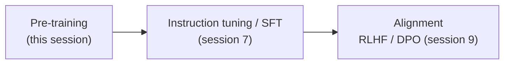

---

### 2. Pre-training objectives: causal vs masked language modeling

**Intuition** — A model can be trained on one of two prediction tasks, and the choice determines whether it becomes a generator (GPT-style) or an understander (BERT-style).

**Mechanism** —

| | Causal Language Modeling (CLM) | Masked Language Modeling (MLM) |
|---|---|---|
| Task | Predict the *next* token, given only the tokens before it | Predict *masked-out* tokens, given tokens on both sides |
| Attention direction | Left-to-right only (causal mask) | Bidirectional |
| Used by | GPT, Llama, Claude — decoder-only | BERT — encoder-only |
| Good at | Free-form generation | Understanding / classification (via finetuning) |

CLM is the objective every decoder-only LLM in this subject uses (session 1's architecture families). MLM is BERT's objective; its full masking mechanism (masking ratio, the 80/10/10 replace/keep/random rule) is outside this session's scope — what matters here is the contrast in what each objective optimizes for, since it explains why decoder-only models generate token-by-token while encoder models cannot generate free text at all in their native form.

**Worked example** — the numeric loss calculation in concept 3 is the CLM case, since that is what this subject's LLMs actually train on.

**Tradeoff / when NOT to use** — a CLM model cannot see future context during training or inference, which is precisely why it must generate one token at a time instead of filling gaps in parallel; an MLM model can't generate free-form text in its native form at all — there is no "predict the next token" once every position was trained bidirectionally. That is why encoder embeddings need a decoder (or a task-specific head) attached to produce output text — see 521's retrieval note for the encoder side of this tradeoff.

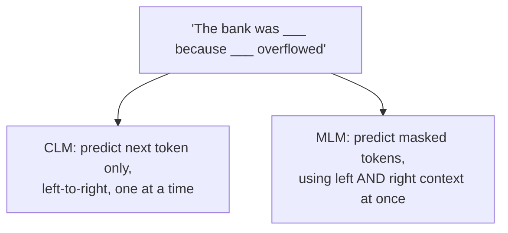

---

### 3. The pretraining loss and perplexity, worked by hand

**Intuition** — Training a language model means measuring, at every position in a sequence, how much probability the model assigned to the word that *actually* came next — then nudging the weights so that probability goes up. Cross-entropy loss is exactly "negative log of the probability you assigned to the right answer," averaged over a batch. Perplexity is the same quantity dressed up to be more interpretable: roughly, "how many equally-likely options was the model choosing between, on average."

**Mechanism** — For a token sequence, at each position `t` the model outputs a probability distribution `ŷₜ` over the whole vocabulary. Since the true next word is a single token (one-hot), the general cross-entropy formula collapses to the negative log-probability of just that one correct token:

```
L_CE (one sequence of length T) = (1/T) · Σ_{t=1..T}  −log ŷₜ[w_{t+1}]
```

Training uses **teacher forcing**: at every position, the model is fed the *true* preceding tokens — never its own previous guesses — to predict the next one. This stops errors made earlier in a training batch from compounding into the loss for later positions.

Perplexity restates the same average, exponentiated: `Perplexity = P(w_{1:n})^{-1/n}`, i.e. the *n*-th root of the product of `1/P(wᵢ | w_{<i})` across the sequence. One caveat worth keeping: perplexity is **tokenizer-dependent** — a lower perplexity from a model with a different tokenizer is not directly comparable to another model's, because the "per-token" unit itself differs.

**Worked example — reproduce this by hand.** Two 3-token sequences pass through a model that has *not yet been trained*:

- `"every effort moves"` → target `"effort moves you"`
- `"I really like"` → target `"really like chocolate"`

The model assigns these probabilities to the *correct* target token at each of the 6 positions across both sequences:

| Sequence | Position | Probability assigned to the correct token | log(probability) |
|---|---|---|---|
| 1 | 1 | 2.3466 × 10⁻⁵ | −10.6600 |
| 1 | 2 | 2.0531 × 10⁻⁵ | −10.7936 |
| 1 | 3 | 1.1733 × 10⁻⁵ | −11.3531 |
| 2 | 1 | 4.2794 × 10⁻⁵ | −10.0591 |
| 2 | 2 | 1.6248 × 10⁻⁵ | −11.0275 |
| 2 | 3 | 1.1586 × 10⁻⁵ | −11.3657 |

Average log-probability = −10.8765. **Cross-entropy loss = −(−10.8765) = 10.8765.**

Every probability here is tiny (~10⁻⁵, roughly 1-in-100,000) because the untrained model is guessing almost uniformly across its ~50,000-word vocabulary — it hasn't yet learned to favor the correct token. That's what a loss around 10–11 nats means in plain terms. As training proceeds, this number falls; a well-trained small model on a narrow corpus can reach a loss under 1.0 (concept 8 has a full training-run log showing this fall in practice, alongside what happens when it falls *too* far).

**Tradeoff / when NOT to use** — cross-entropy on held-out text is the standard way to compare two models trained on the *same* tokenizer and roughly the same domain; it stops being meaningful the moment tokenizers differ, or the moment the eval text overlaps with training data (a live problem for public benchmarks — see concept 4's MMLU aside). It also does not directly measure whether generated text is *correct*, only whether it was *likely* under the model's training distribution — a fluent, confident, wrong answer can still carry a good loss.

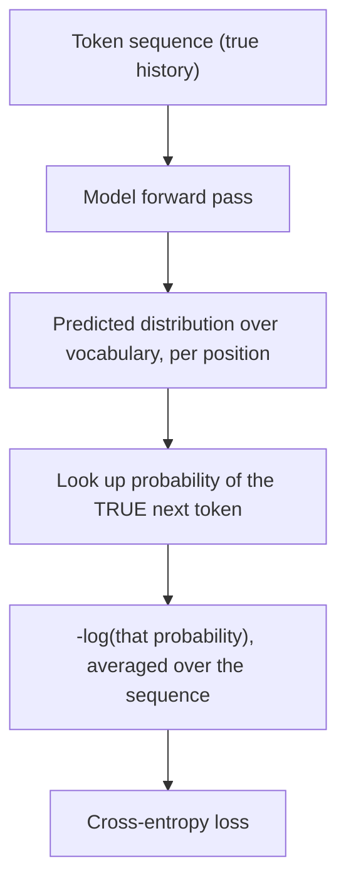

> ***In practice*** *— production numbers this maps to.* Real pretraining runs feed the full context window before moving to the next batch: GPT-4 uses a 4,096-token window, Llama 3 uses 8,192; if a document is shorter, several documents are **packed** into one window separated by a special end-of-text token (mechanism detail in concept 6). The batch size for gradient descent is large — the biggest GPT-3 model trained with a batch size of **3.2 million tokens** at once, not 3.2 million *examples*.

> ***Going deeper*** *— evaluating beyond loss.* Public benchmarks like **MMLU** (Massive Multitask Language Understanding, 15,908 questions across 57 subject areas) test task performance directly rather than raw next-token loss. Their real weakness is **data contamination**: since LLMs train on scraped web text and MMLU itself is on the web, a model may have seen benchmark questions during pretraining, inflating its score. Published mitigations are reporting train/test overlap directly or holding out contamination-checked splits — a genuine, unresolved-in-general problem for any benchmark built from public text.

---

## Part 2 · Pre-training data

### 4. Pretraining corpora and data mixture

**Intuition** — What a model reads during pretraining shapes everything it can later do; "just scrape the web" turns out to need careful curation, weighting, and ordering to actually work well.

**Mechanism — named corpora, as a landscape:**

| Corpus | Size | Composition |
|---|---|---|
| **C4** (Colossal Clean Crawled Corpus) | 156B English tokens | Filtered Common Crawl — deduplicated, non-natural-language/code removed, offensive-word blocklist applied; skews toward patents, Wikipedia, and news |
| **The Pile** | 825 GB | Academic (PubMed, ArXiv, patents), internet text (web + Wikipedia), prose (books), dialogue (movie subtitles, chat), misc. |
| **Dolma** | 3 trillion tokens | Web, academic papers, code, books, encyclopedic text, social media |

**Data mixture** operates at **two levels**: a **global** proportion (how much of the *entire* pretraining run comes from each category) and a **local** proportion (how that mix is re-weighted at different *stages* of training). Llama 3, for example, deliberately **downsamples** categories over-represented on the open web relative to their real-world importance — arts and entertainment content is abundant online but gets deliberately dialed back so it doesn't dominate the mix.

**Data curriculum** is the related idea of *ordering*, not just proportioning: organize pretraining data so easier/general examples come first and harder/specialized examples are introduced progressively. Llama 3's **data annealing** — training on a small, extremely high-quality subset near the *end* of pretraining while decaying the learning rate toward zero — is a curriculum technique in practice: it measurably improved the 8B model, but the improvement on the 405B model was negligible, an explicit scale-dependent result worth remembering (bigger models are less sensitive to this particular trick).

**Worked example** — Llama 3's annealing dataset was 40 billion tokens (0.02% of the total pretraining set), used partly just to *assess* data quality; the actual annealing procedure itself trained on only 40 million tokens (0.1% of that 40B subset) — a tiny sliver of tokens doing a disproportionate amount of late-stage quality work.

**Tradeoff / when NOT to use** — aggressive downsampling or curriculum ordering adds real engineering complexity (you now need per-category quality scores, staged schedules, and monitoring for regressions) for a payoff that shrinks as model size grows, per the Llama 3 8B-vs-405B annealing result above. For a small-scale or research pretraining run without the infrastructure to track category-level provenance, a simpler uniform-sampling approach is a defensible starting point — curriculum tuning is where you spend engineering effort *after* the basics work, not before.

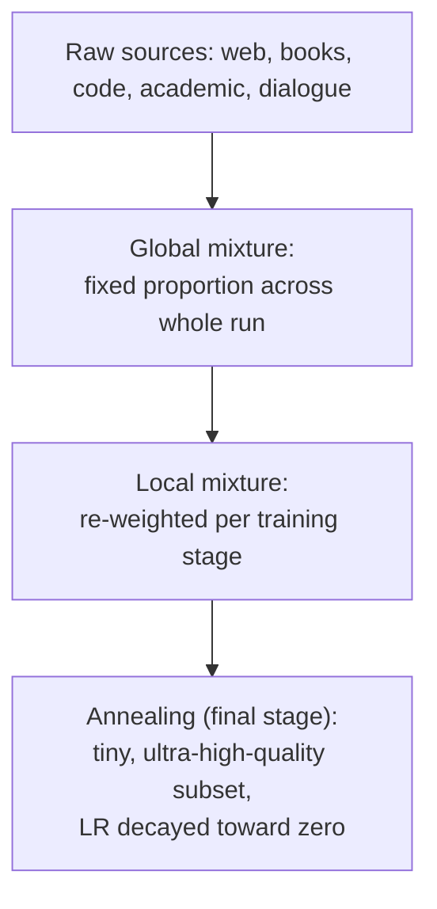

> ***Going deeper*** *— the ethics and legality of web-scraped pretraining data, a live and unresolved area.* Copyright/fair-use status of training on scraped text is legally ambiguous; a rising share of sites now opt out via `robots.txt` or Terms of Service, with unclear retroactive legal status for data already scraped; private information (phone numbers, emails) leaks through despite filtering; and pretraining corpora skew geographically and demographically toward US/developed-country authors, which shapes what "default" model behavior looks like globally. None of this is a solved problem — it's an active area of law and policy, not a settled engineering answer.

---

### 5. Data preprocessing: filtering, deduplication, and packing

**Intuition** — Raw scraped text is not training-ready. Before it reaches the model, it passes through a pipeline that removes duplicates, scores and filters for quality, and packs the surviving text efficiently into fixed-length training windows.

**Mechanism — the pipeline, in order:**

1. **Deduplication** — detect and remove documents (or overlapping n-grams) that repeat across the corpus. This is not just about wasted training compute: duplicate text between the *training* set and later *evaluation* sets causes a genuine measurement problem (dataset contamination), inflating apparent performance.
2. **Quality filtering** — a trained classifier scores each document, favoring text that resembles Wikipedia/books/curated sources and penalizing boilerplate, PII, and adult content. A specific, reproducible instance of this: **perplexity filtering** — score each document with a small reference language model and keep the *middle* band of scores. High perplexity means noisy or broken text; *very low* perplexity means repetitive boilerplate or template text — both extremes get discarded, only the middle survives.
3. **Safety filtering** — toxicity classifiers remove harmful content. This step has a documented failure mode: toxicity classifiers have been shown to mis-flag African-American English as toxic at a disproportionate rate, and training on toxicity-*filtered* data has been shown to make the resulting model *worse* at detecting toxicity itself later — filtering the training signal removed the examples the model needed to learn the distinction from.
4. **Packing** — since real documents rarely fill a model's exact context window, multiple short documents are concatenated into one training sequence, separated by a special end-of-text token (e.g. `<|endoftext|>`), so no training compute is wasted on padding.

**Worked example — packing, concretely.** Four unrelated text snippets — one about a sports team, one a fairy tale, one financial news, one a personal story — are concatenated into a single training sequence as: `[sports text] <|endoftext|> [fairy tale] <|endoftext|> [financial news] <|endoftext|> [personal story]`. The model sees the boundary token and learns that whatever came before it is unrelated to whatever comes after — this is *why* an end-of-text token exists in the vocabulary at all, rather than being an implementation footnote.

**Tradeoff / when NOT to use** — perplexity filtering and quality classifiers reduce noise but are themselves imperfect models trained on someone's notion of "quality" — over-aggressive filtering can systematically remove dialects, informal registers, or minority viewpoints that a narrow reference model scores as "low quality" text, which is exactly the same class of problem as the safety-filter dialect bias above. Packing is close to free (it wastes no real capability), but it does mean a single training sequence can contain multiple unrelated documents — a model must actually learn to *use* the end-of-text boundary correctly and not be misled by adjacency, or it risks bleeding context across unrelated packed documents.

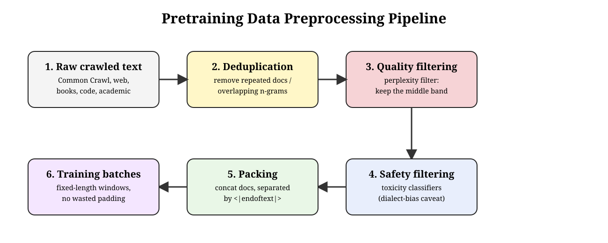

---

## Part 3 · Continued pre-training and domain adaptation

### 6. Continued pre-training vs retraining vs domain-specific pre-training

**Intuition** — Once you have a pretrained model, there are three genuinely different ways to specialize it for a new domain or dataset, and they trade off cost against how much of the original general knowledge survives.

**Mechanism — three paths, compared:**

| Path | What happens | Cost | Keeps general knowledge? |
|---|---|---|---|
| **Regular pretraining** | Random weights, train from scratch on dataset D1 | Full pretraining cost | N/A — this *is* the general model |
| **Continued pretraining (CPT)** | Take the pretrained model from D1, keep training it on new dataset D2 | Much cheaper than from-scratch | Partially — at risk of catastrophic forgetting (concept 7) |
| **Retrain on the combined dataset** | Random weights again, but train on D1 ∪ D2 together from the start | As expensive as regular pretraining | Yes, by construction — but you paid full price again |
| **Domain-specific pretraining (from scratch)** | Random weights, train *only* on the narrow-domain dataset | Full pretraining cost, but on a smaller/narrower corpus | No — never had it |

CPT is the practical middle path used by most real domain-adapted models (FinLLaMA, concept 9): it's dramatically cheaper than retraining from scratch on the combined data, at the cost of a real risk that the model forgets some of what it knew before.

**Worked example** — see concept 9's FinLLaMA/BloombergGPT comparison: FinLLaMA is CPT (starts from Llama 3 8B, continues training on financial text), while BloombergGPT is closer to domain-specific-from-scratch-with-a-general-mixture (trained on a blend of finance and general tokens from the start, not adapted from an existing checkpoint).

**Tradeoff / when NOT to use** — retraining on the combined dataset is strictly safer against forgetting but throws away the entire cost advantage CPT exists to provide — if you can afford a full retrain, and you actually need both domains equally well represented from the start, it's the more robust (if expensive) choice. Domain-specific-from-scratch is the right call only when the target domain is different enough from general text that inherited general capability isn't worth much anyway (a narrow, self-contained technical corpus, for instance) — otherwise you're paying full pretraining cost for a model that has thrown away general reasoning ability it will likely still need.

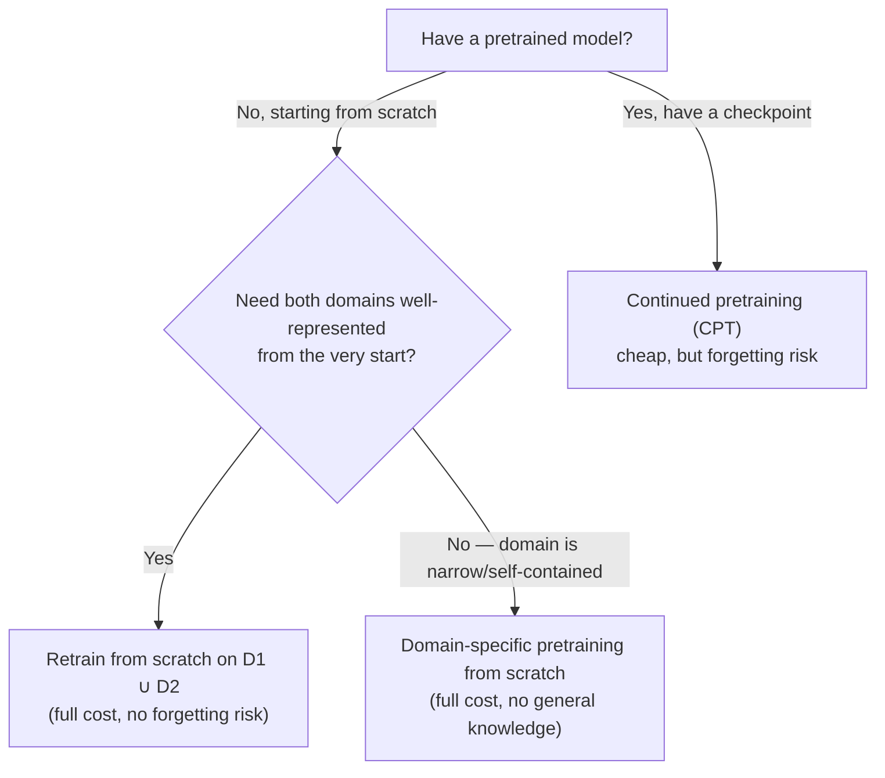

---

### 7. Catastrophic forgetting and how to mitigate it

**Intuition** — When you keep training an already-trained network on new data, it can lose previously learned information — the weight updates that help it learn the new domain can just as easily overwrite what made it good at the old one. This is especially visible when the new training data is narrow or comes from a very different distribution than the original.

**Mechanism — five mitigations, each attacking the problem differently:**

| Mitigation | How it helps |
|---|---|
| **Lower learning rate** | Smaller weight updates disturb existing weights less, so old knowledge is less likely to be overwritten in any single step |
| **LR warmup** | A gradual ramp-up (rather than jumping straight to full learning rate) prevents aggressive overwriting in the earliest, most destructive updates |
| **Data mixing / replay** | Blend a small percentage of the *original* pretraining data back into the CPT batches, so the model keeps seeing (and re-reinforcing) old-domain examples while learning the new domain |
| **EWC** (Elastic Weight Consolidation) | Add a penalty term to the loss that selectively slows learning on weights identified as *critical* to the old task, leaving less-critical weights free to adapt |
| **LoRA / PEFT** | Freeze the base model entirely and train only small added adapter weights — the original weights literally cannot change, so nothing can be overwritten (session 7 covers the mechanism in full) |

**Use case — CPT without replay, in production.** Say a bank takes Llama 3 8B and continues pretraining it purely on internal compliance documents, with none of the original general-domain data mixed back in. After enough steps the model answers compliance questions well but has quietly lost the ability to hold an ordinary conversation or answer general-knowledge questions it used to handle fine — catastrophic forgetting, exactly as this table predicts. Mixing even a modest slice of the original pretraining data back into the CPT batches (data replay) is usually the cheapest fix — this is precisely what FinLLaMA does with its 75/25 financial-to-general split (concept 8).

**Worked example** — Raschka's own small-scale pretraining run makes the failure mode itself visible even without CPT: training a tiny GPT-style model for 10 epochs on a small corpus shows training loss falling smoothly from 9.78 (epoch 1) to 0.39 (epoch 10), while *validation* loss falls only until around epoch 8, then rises back up to 6.45 by epoch 10. Roughly 7–8% of the model's generated text at that point turns out to be **verbatim memorized** from the tiny training set — the model has started overfitting so hard it is reciting training examples rather than generalizing. This is the same underlying pathology catastrophic forgetting represents at larger scale: the network's limited capacity gets consumed by whatever it saw most recently and most repetitively, at the expense of what it should be retaining more broadly.

**Tradeoff / when NOT to use** — every mitigation here costs something. A lower learning rate slows down how quickly the model actually learns the new domain — if the new domain is very different from the old one and you *need* strong adaptation, an overly conservative LR can leave the model under-adapted. Data replay requires keeping (and re-serving) a slice of the original pretraining corpus, which isn't always available or licensed for continued use. EWC requires computing and storing per-weight importance estimates, adding real implementation overhead. LoRA/PEFT is the cheapest and safest against forgetting by construction, but it also means the base model's knowledge is truly frozen — if the *base* knowledge itself needs to change (not just be extended), PEFT alone won't get you there.

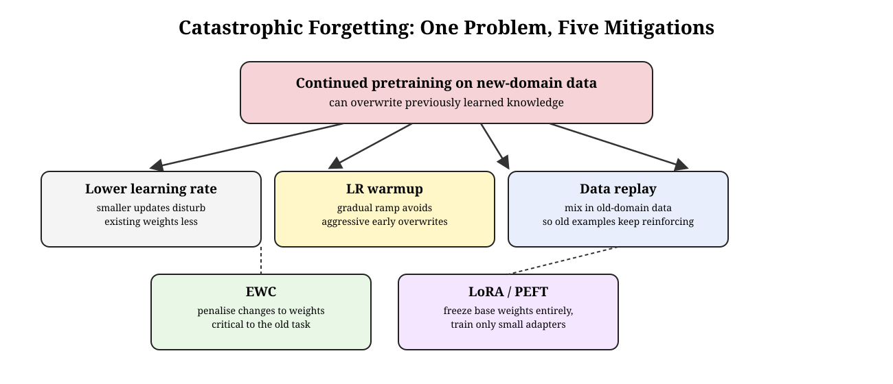

---

### 8. Domain adaptation case studies: FinLLaMA and BloombergGPT

**Intuition** — Two real finance-domain LLMs took different paths through the pretraining choices above, and comparing them makes the tradeoffs concrete.

**Mechanism — side by side:**

| | FinLLaMA | BloombergGPT |
|---|---|---|
| Approach | Continued pretraining (CPT) | Trained from scratch on a mixed corpus |
| Base | Meta Llama 3 (8B) — inherits its general reasoning from the start | No pretrained base — built from scratch |
| Parameters | 8B | 50B |
| Training data | 52B financial tokens, mixed with 18B general-domain tokens (≈75/25 split) | 363B finance tokens + 345B general tokens |
| Forgetting mitigation | Data replay — the 18B general tokens exist specifically to prevent catastrophic forgetting of Llama 3's original capability | N/A in the same sense — general knowledge was built in from the start, not preserved against loss |
| Sizing rationale | Inherited from Llama 3's own design | Sized at 50B using **Chinchilla scaling laws** (concept 11), chosen as the compute-optimal size given the available finance-data volume |

**Worked example** — FinLLaMA's 75/25 financial-to-general token ratio is a direct, numeric instance of the "data mixing / replay" forgetting mitigation from concept 7: roughly one in four training tokens is deliberately *not* finance-specific, purely to keep Llama 3's general capability from eroding while it specializes.

**Tradeoff / when NOT to use** — FinLLaMA's CPT approach is far cheaper (starting from an already-capable 8B checkpoint) but caps out at whatever capability an 8B model can reach; BloombergGPT's from-scratch approach is dramatically more expensive but let its designers choose model size and data mixture freely, using scaling laws to pick a genuinely compute-optimal 50B rather than inheriting someone else's architecture decision. If your organization doesn't have from-scratch-pretraining-scale compute budget (most don't), CPT on an existing capable open-weight model is the realistic choice — BloombergGPT-style from-scratch training is reserved for organizations with both the capital and the proprietary data volume (Bloomberg's decades of financial text) to justify it.

---

## Part 4 · Scaling laws

### 9. Why scaling laws matter

**Intuition** — Scaling laws exist because training a frontier LLM at full scale costs millions of dollars in compute — you cannot afford to guess wrong about model size, data size, or training steps and find out only after the run finishes. Scaling laws let you test cheaply on small models and extrapolate the result to the size you actually intend to train.

**Mechanism** — Given a fixed compute budget, the real question is: what is the best split between **model size** (number of parameters, N), **dataset size** (tokens seen, D), and **training steps** (total compute used, C)? The empirical insight underlying every scaling law is that **loss falls as a power law** in all three factors — predictably, smoothly, and in a way that can be extrapolated from small experiments to large ones. In practice: fit the power-law curve on small proxy models, then use it to lock in the recipe (model size, data mix, token budget) *before* committing to the expensive full-scale run.

**Worked example** — Meta ran scaling-law experiments on small proxy models specifically to choose Llama 3's pretraining data mix, then scaled the winning recipe up to 405 billion parameters — the whole point being that they did not need to guess or run the full 405B experiment multiple times to find a good recipe.

**Tradeoff / when NOT to use** — scaling-law extrapolation assumes the small-scale trend actually continues smoothly to the target scale, which is not guaranteed — this is exactly what the "emergent abilities" debate (concept 12) complicates: some capabilities appear to *not* follow a smooth, predictable curve at all. Scaling laws are also only worth the experimental overhead when you're planning a genuinely large, expensive run; for a small research experiment, running a handful of small-scale configurations and simply picking the best empirically is often more practical than fitting a formal power law first.

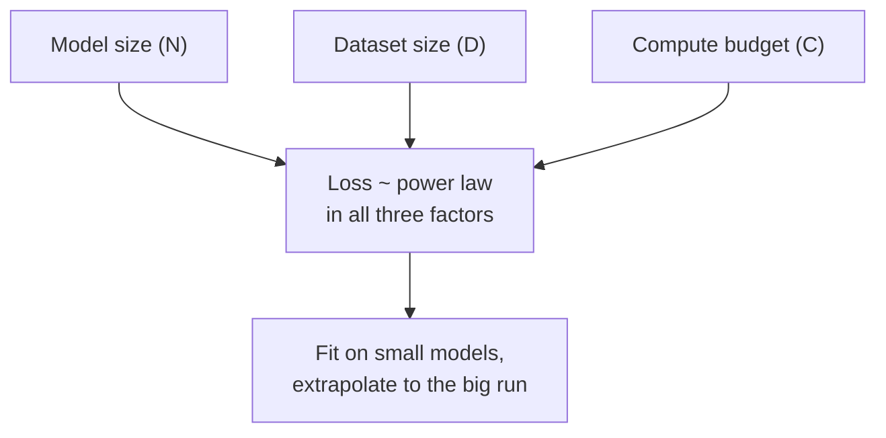

---

### 10. Kaplan scaling laws (2020) — worked by hand

**Intuition** — The first influential scaling law paper (Kaplan et al., 2020) found that loss depends much more strongly on *scale* (how big, overall) than on *shape* (depth vs width, architectural details) — and its practical conclusion at the time was: if your compute budget grows, spend most of the extra budget on a **bigger model**, not more data.

**Mechanism — the power laws themselves:**

```
L(N) = (N_c / N)^αN        αN = 0.076, N_c = 8.8 × 10¹³
L(D) = (D_c / D)^αD        αD = 0.095, D_c = 5.4 × 10¹³
L(C) = (C_c / C)^αC        αC = 0.050, C_c = 3.1 × 10⁸
```

where `N` = number of non-embedding parameters, `D` = dataset size in tokens, `C` = compute budget (petaflop-days), and each `_c` constant is an empirically-fit scaling coefficient. The practical parameter-count formula Kaplan also gives, assuming attention and feedforward dimensions scale together (`d_attn = d_ff / 4 = d`):

```
N ≈ 12 · n_layer · d²
```

**Worked example — reproduce this by hand.** GPT-3 has `n_layer = 96` transformer layers and hidden dimension `d = 12,288`. Plugging in:

```
N ≈ 12 × 96 × 12,288²
  = 1,152 × 150,994,944
  ≈ 174.0 billion parameters
```

— matching GPT-3's well-known ~175B parameter count, from just two architectural numbers.

**Tradeoff / when NOT to use** — Kaplan's own conclusion ("prioritize model size over data size") is precisely what the Chinchilla paper (concept 11) overturned two years later: Kaplan's fitted constants were derived under specific experimental conditions (notably, without re-tuning the learning-rate schedule length to match the training duration) that turned out to systematically favor bigger models. Treat Kaplan's *scaling laws exist and are power laws* insight as durable, but do not treat its specific recommended split (bigger model over more data) as still current practice — it isn't, and the "three eras" table in concept 11 shows exactly how the industry's answer changed.

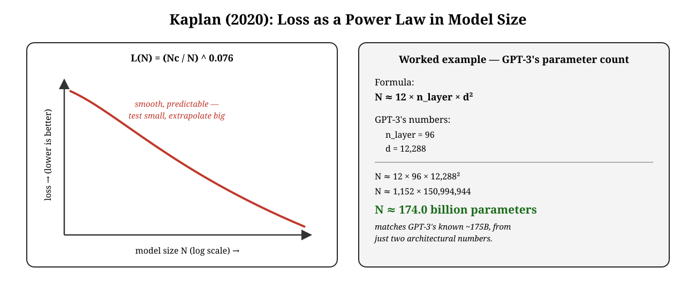

---

### 11. Chinchilla scaling laws (2022) and the three eras of scaling wisdom

**Intuition** — Two years after Kaplan, Hoffmann et al. (2022, the "Chinchilla" paper) re-ran the scaling experiments more carefully and reached the opposite practical conclusion: existing large models were **undertrained** — they had far more parameters than the data volume actually justified, and a *smaller* model trained on *more* data could outperform them at the same compute cost.

**Mechanism** — Where Kaplan's rule of thumb was "with a 10× compute increase, scale model size 5× and data 2×," Chinchilla found you should scale **both at the same rate**: with a 10× compute increase, increase both model size and data size by roughly 3.1×. The practical rule of thumb that follows: **train on at least ~20 tokens per parameter** — a rule Llama 3 8B, for instance, blows past enormously (see the table below), because by the "modern" era the goal shifted again.

**Landscape — three eras, compared:**

| Era | Year | Rule of thumb | Exemplar | Numbers |
|---|---|---|---|---|
| **Kaplan** | 2020 | Scale the model faster than the data | GPT-3 | 175B params · 300B tokens (~1.7 tokens/param) |
| **Chinchilla** | 2022 | ~20 tokens per parameter; existing giants were undertrained | Chinchilla | 70B params · 1.4T tokens (~20 tokens/param) |
| **Modern** | 2024+ | Overtrain a smaller model — inference cost dominates when serving billions of requests | Llama 3 8B | 8B params · 15T tokens (~1,875 tokens/param — ~90× the Chinchilla ratio) |

The "modern" era's logic is different from either predecessor: Chinchilla optimizes for the best model *for a fixed training compute budget*, but once a model is going to be served to billions of users, **inference cost** (which scales with parameter count, paid every single query) starts to dominate total cost far more than training compute (paid once). That's why Llama 3 8B deliberately trains on vastly more data than Chinchilla-optimal for its size — Meta chose to **overtrain a smaller model**, trading extra (one-time) training compute for a permanently cheaper model to run at inference.

A newer axis on top of all three: **test-time compute**. Models like o1 and DeepSeek-R1 spend additional compute *at inference* (long chains of thought) rather than only at training time — modern scaling-law thinking now has to account for both training-time and thinking-time compute together, not training compute alone.

**Worked example** — Llama 3 8B trained on 15T tokens is **~90× the Chinchilla-recommended ratio** (20 tokens/parameter) for an 8B model — a deliberate, enormous overtrain, justified entirely by inference-cost economics rather than training-compute optimality.

**Tradeoff / when NOT to use** — Chinchilla-optimal is the right target when training compute is the dominating cost and the model won't be served at massive scale (a research model trained once, evaluated, and retired). The "modern" overtrain-a-small-model approach is only worth its extra training cost when the model will be served enough times that inference cost swamps the one-time training bill — for a model that's trained once and used lightly, chasing the modern-era ratio wastes compute for no realized benefit.

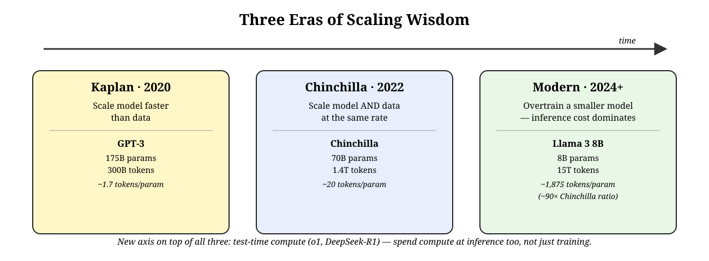

---

### 12. Emergent abilities of LLMs

**Intuition** — Some capabilities don't improve gradually as models get bigger — they appear to snap into existence, seemingly out of nowhere, once a model crosses a certain scale. Whether this is a genuine property of scale or a measurement artifact is itself a live debate (Schaeffer et al., 2023).

**Mechanism** — Formally: *"an ability is emergent if it is not present in smaller models but is present in larger models"* — performance sits at random-guessing level until a certain scale threshold, then rises sharply to well above random. Two properties define it: **sharpness** (the transition looks near-instantaneous rather than gradual) and **unpredictability** (the scale at which it appears cannot be forecast by extrapolating smaller models' performance curves — the opposite of the smooth, predictable power laws in concepts 10–11).

The counter-argument (Schaeffer et al., 2023): many "emergent" abilities evaporate, or turn into smooth curves instead of sharp jumps, once they're measured with a different metric or better statistics. That suggests some apparent emergence is a **mirage created by the choice of metric**, not a fundamental property of scaling itself — an all-or-nothing exact-match score will look "sharp" even if the model's underlying probability of getting the right answer was rising smoothly all along, while a partial-credit metric on the same model can reveal that same smooth curve underneath.

**Worked example** — three concrete abilities commonly cited as emergent: **in-context learning** (formally introduced with GPT-3 — given natural-language instructions and/or a few task demonstrations in the prompt, the model produces the expected output for new instances without any gradient update at all); **instruction following** (finetuning on a mixture of multi-task datasets phrased as natural-language instructions lets a model generalize to *unseen* tasks described the same way, without needing worked examples for that specific task); **step-by-step reasoning** (small models typically fail multi-step problems like math word problems outright, while chain-of-thought prompting lets sufficiently large models solve the same problems by generating intermediate reasoning steps before the final answer).

**Tradeoff / when NOT to use** — treating a capability as a settled, universal "emergent ability" is risky given the Schaeffer et al. critique — before concluding a model "emergently" gained an ability at some scale, check whether the same trend holds under a different, non-binary metric. For planning purposes, don't rely on an unconfirmed emergent ability appearing at a target scale as a load-bearing assumption in a scaling plan; the Kaplan/Chinchilla power laws (concepts 10–11) are the reliably-extrapolatable part of scaling behavior, emergent-ability claims are not.

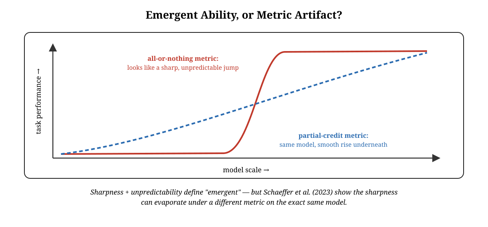

---

## Part 5 · Frontier model pretraining

### 13. Llama 3: three-stage pretraining

**Intuition** — Llama 3's own published pretraining recipe is a concrete, fully worked example of nearly every concept in this session applied together: data mixture, curriculum/annealing, and scaling-law-informed sizing, executed across three distinct stages.

**Mechanism — the three stages:**

1. **Initial pre-training — stability through gradual scaling.** Batch size and sequence length increase in three phases rather than jumping straight to the final configuration: phase 1 uses a 4M-token batch size at 4,096-token sequence length (prioritizing early training stability); phase 2 moves to an 8M-token batch size at 8,192-token sequence length (scaling up); phase 3 reaches a 16M-token batch size, still at 8,192-token sequence length (final throughput). Training uses the standard AdamW optimizer rather than a more aggressive alternative, again favoring stability.
2. **Long-context pre-training.** Context length is increased gradually across **six stages**, starting from the original 8K window and ending at a final 128K-token context window, using approximately 800 billion training tokens dedicated specifically to this extension.
3. **Annealing.** As covered in concept 4: training on a small, ultra-high-quality data subset in the final stage while decaying the learning rate toward zero — improving the 8B model measurably, with negligible effect on the 405B model.

**Worked example** — the batch-size/sequence-length numbers above *are* the worked example: going from 4M tokens/4,096 sequence length to 16M tokens/8,192 sequence length across three phases is a 4× increase in per-step batch size, executed gradually rather than all at once specifically to avoid the training instability a single large jump would risk.

**Tradeoff / when NOT to use** — gradual scaling and a six-stage context extension add real engineering and scheduling complexity compared to simply training at final configuration from step one; it's worth this complexity at frontier scale, where a failed or unstable training run costs enormous sums, but for a smaller research-scale pretraining run, the simpler fixed-configuration approach is often good enough and far easier to implement and debug.

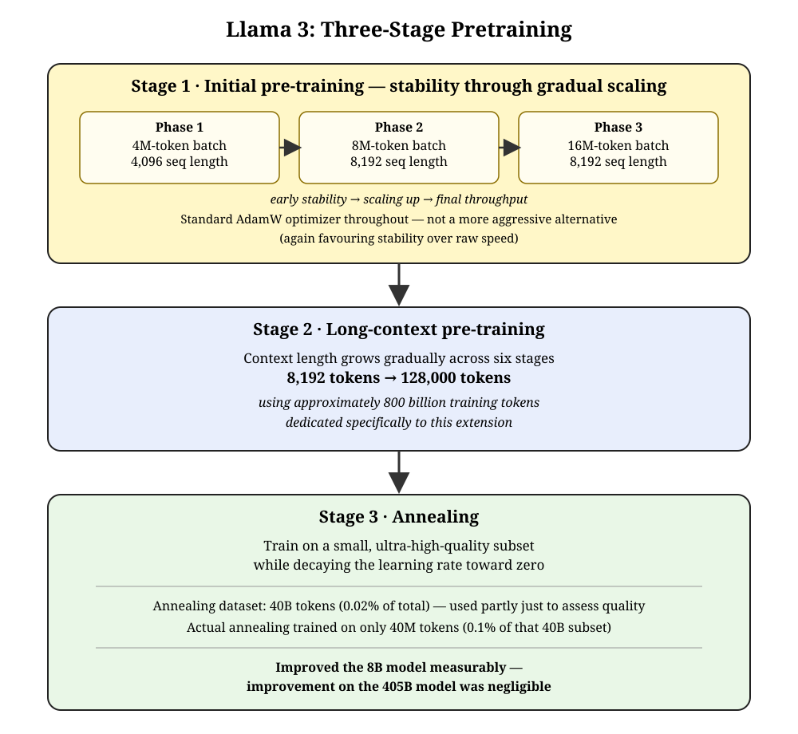

> ***Going deeper*** *— model-as-judge data curation.* Llama 3 used model-based data curation to filter public web data before pretraining even began: heuristic filters, semantic deduplication, and learned text-quality classifiers worked together, including a fast early-pass `fastText`-based classifier trained to recognize text resembling what Wikipedia would cite, stronger RoBERTa-family quality classifiers trained using Llama 2's own outputs as supervision, and a `DistilRoBERTa` model used to assign quality scores efficiently at the scale of the full web crawl. This is a direct, concrete instance of concept 5's "quality filtering" step, at frontier-lab scale.

---

### 14. Qwen and Gemma pretraining strategies

**Intuition — a landscape of alternative frontier recipes**, each making a different tradeoff than Llama 3's.

**Mechanism — compared:**

| Model | Key pretraining idea | Detail |
|---|---|---|
| **Qwen 2** | Self-generated training data | Uses the *previous-generation* Qwen model to synthesize additional pretraining data; trains in two stages (regular pretraining, then long-context training) |
| **Qwen 3** | Long-context-weighted corpus | Three-stage pretraining; final high-quality long-context corpus is 75% text between 16,384–32,768 tokens and 25% text between 4,096–16,384 tokens — context length itself is a data-mixture lever, not just a training-schedule one |
| **Gemma 2** | Knowledge distillation over scale | Explicit position that small models are often *undertrained*, not under-sized; the 27B model trains from scratch, but smaller Gemma 2 models are trained via **knowledge distillation** from the larger model rather than simply scaling down the data recipe |
| **Gemma 4** (2026) | Multimodal, long-context, dual-track release | Released as both pretrained **base** models (massive diverse dataset — web, code, math, images, audio — for further specialized training) and separate **instruction-tuned** models (further trained on human-annotated data for multi-turn conversation, function-calling, and structured JSON output); pretraining corpus spans 140 languages |

**Worked example** — Qwen 3's 75/25 long-context data split is the same *kind* of deliberate data-mixture decision as Llama 3's annealing ratio (concept 4) or FinLLaMA's 75/25 domain split (concept 8) — a recurring pattern across frontier labs: named, specific proportions chosen deliberately rather than left to whatever the raw corpus happens to contain.

**Tradeoff / when NOT to use** — knowledge distillation (Gemma 2's approach for smaller variants) requires already having a larger, capable teacher model to distill from — it isn't available as a strategy for training the *first*, largest model in a family, only for producing smaller siblings afterward. Self-generated training data (Qwen 2's approach) risks a feedback loop where a model's own blind spots get reinforced in the data it generates for its successor, unless carefully filtered — a risk plain human/web-sourced text doesn't carry in the same way.

---

### 15. Going deeper: GPT-1 and T5 — two architecture case studies (not for exam)

> ***Going deeper*** *— the deck marks this material "extra slides, not for exam." Kept here because the numbers are genuinely useful for building intuition about early LLM pretraining, but treat it as background, not examinable scope.*
>
> **GPT-1** — the original decoder-only pretraining recipe. Introduced the two-stage idea that later became standard: unsupervised **generative pretraining** (learning general language representations from a large text corpus) followed by supervised **finetuning** on a specific task. Architecturally: 12 transformer blocks, 768-dimensional hidden states, 12 attention heads (giving 768÷12 = 64 dimensions per head — the same per-head-dimension arithmetic as session 1's multi-head attention section), a 3,072-dimensional feedforward layer (hidden size × 4, again matching session 1's transformer-block ratio), ~117 million total parameters, a 40,000-token BPE vocabulary, and GELU activations. It trained on BooksCorpus (~7,000 books, ~800 million words) with causal language modeling and cross-entropy loss, a 512-token maximum sequence length, Adam optimizer, linear warmup over the first 2,000 updates followed by cosine decay, and 100 epochs — this is the same shape as concept 3's loss mechanism and concept 1's three-stage pipeline, just at the historical starting point of the lineage.
>
> For downstream classification, GPT-1 formats input with special tokens — `<start>`, a delimiter, and `<extract>` — feeds that through the *same* pretrained transformer, and takes only the output vector at the `<extract>` token position as the feature fed into a simple linear classifier layer. Worked example: input `<start> This movie was surprisingly emotional, beautifully acted, and worth watching again. <extract>` → output label "Positive," with the `<extract>`-position vector learning to summarize whatever the classification task needs during finetuning.
>
> ```mermaid
> flowchart TD
>     A["12 transformer blocks\nd=768, 12 heads"] --> B["Causal LM pretraining\non BooksCorpus"]
>     B --> C["Finetune: format with\nstart/delim/extract tokens"]
>     C --> D["Take <extract> token's\noutput vector -> linear classifier"]
> ```
>
> **T5** (Text-to-Text Transfer Transformer) — an encoder-decoder alternative that reframes *every* NLP problem, including classification, as text-to-text: same model, same objective, same training procedure and decoding process regardless of the downstream task. A task-specific text *prefix* tells the model what to do — e.g. `"translate English to German: That is good. target:"` produces `"Das ist gut."` autoregressively; for classification, `"mnli premise: I hate pigeons. hypothesis: My feelings towards pigeons are filled with animosity. target:"` produces the class label `"entailment"` directly as text, rather than through a separate classifier head the way GPT-1's `<extract>`-token approach works. T5 uses a **prefix-LM attention pattern**: fully-visible (bidirectional) attention over the input prefix, but causal masking while generating the target — a genuine third attention pattern alongside concept 2's pure-CLM and pure-MLM. Pretrained on the **Colossal Clean Crawled Corpus (C4)**, English-only, 750 GB, using **learned relative position embeddings** based on the offset between the query and key being compared (rather than GPT-1's absolute learned positions), with a 32,000-wordpiece SentencePiece vocabulary shared across input and output.
>
> ```mermaid
> flowchart TD
>     A["Every task reframed as text-to-text"] --> B["Input: task prefix + content\ne.g. 'translate English to German: ...'"]
>     B --> C["Encoder: fully-visible attention over input"]
>     C --> D["Decoder: causal attention,\ngenerates output text autoregressively"]
> ```
>
> **Side by side:**
>
> | | GPT-1 | T5 |
> |---|---|---|
> | Architecture | Decoder-only | Encoder-decoder |
> | Parameters | ~117 million | Baseline size: two stacks of BERT-base |
> | Objective | Causal language modeling | Text-to-text (every task, same objective) |
> | Pretraining data | BooksCorpus (~7,000 books, ~800M words) | C4 — 750 GB, English-only |
> | Attention pattern | Pure causal | Prefix-LM: fully-visible over input, causal over output |
> | Position encoding | Learned absolute | Learned relative (query–key offset) |
> | Vocabulary | 40,000 tokens (BPE) | 32,000 wordpieces (SentencePiece, shared input/output) |
> | Downstream task handling | `<extract>`-token vector → linear classifier head | Task prefix in the input text itself, output is text |

---

## Self-study / Lab / build

Lab 2 ("Build end-to-end training and fine-tuning pipelines," module M2–M5) is the natural place to reproduce this session's central worked example: the cross-entropy loss calculation in concept 3, extended into a full `train_model_simple()`-style loop — forward pass, loss, backward pass, optimizer step, periodic train/val loss logging — run against a small corpus small enough to watch it overfit on purpose (matching the training log in concept 7: loss falling smoothly on train while validation loss flattens then rises). Reproducing that overfitting curve by hand, once, is worth more than reading about catastrophic forgetting in the abstract.

---

*Exam: this session is in scope for the **closed-book mid-sem** (sessions 1–8). Full evaluation, weights, dates and course logistics live once in [`536-master.md`](../536-master.md) — not repeated per session.*
