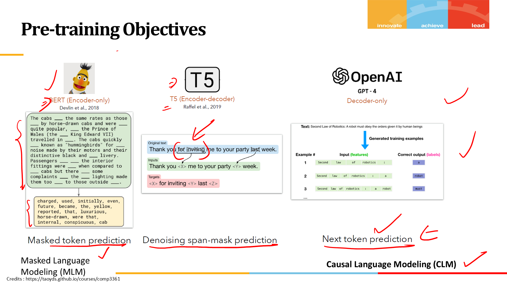
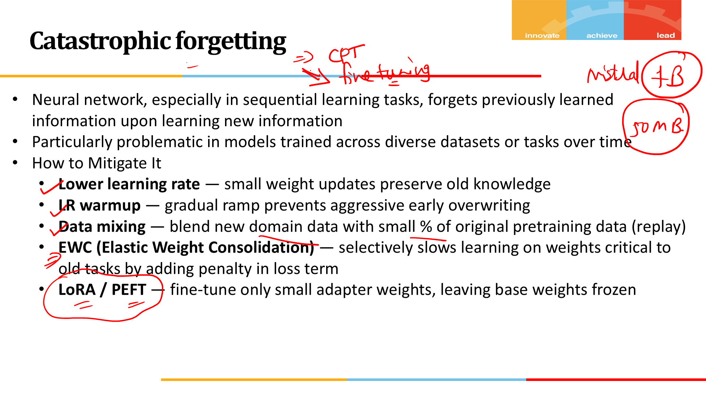
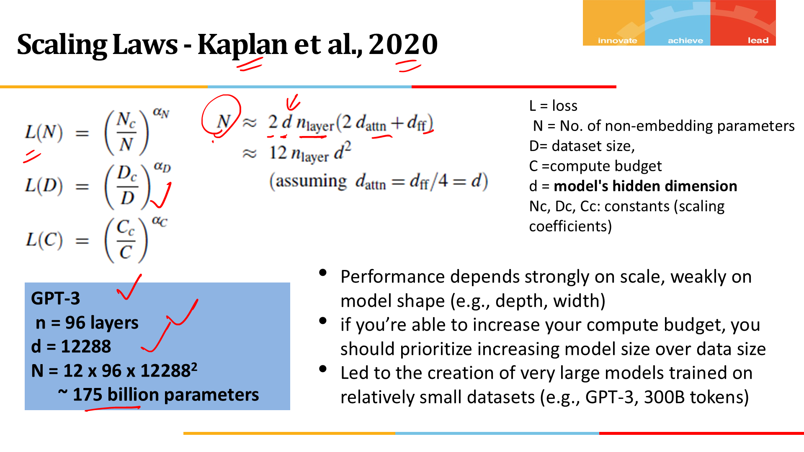
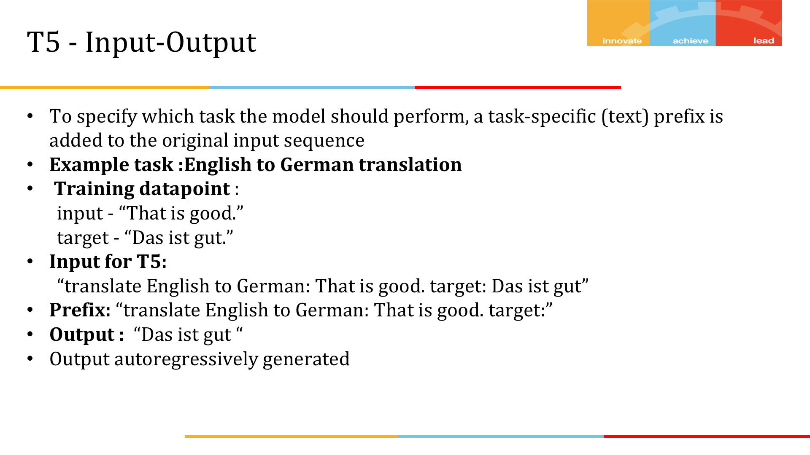

# Large Language Models for Generative AI · Session 02 · LLM Pre-Training

_Deck instructor credit: Dr. Monali Mavani · Course: AIML* ZG536_
_Learned 2 Aug 2026_

> **Source note.** These notes adapt the supplied `CS-2 LLM Training.pptx`, whose material acknowledges books and online contributors and has been modified to fit the course requirements. The source deck's agenda is: LLM pre-training; pre-training objectives; pre-training data; Continuous Pre training (CPT) and domain adaptation; scaling laws; and pretraining of popular frontier models. The original source figure is labelled where it is retained; explanatory diagrams are marked as recreations.

## Why this matters

Pre-training is where an LLM gets its raw capability. Fine-tuning, alignment, and prompting only work because pre-training has already put useful structure into the weights. This session explains how that happens: what objective the model is trained on, what kind of data pipeline feeds it, and how scaling laws guide decisions about model size and token count. Once this picture is clear, frontier model reports stop reading like marketing and start reading like engineering tradeoffs.

**Running example:** four distinct paths a model can take through pretraining — regular pretraining from scratch, continued pretraining (CPT) on top of an existing checkpoint, retraining from scratch on a combined dataset, and domain-specific pretraining from scratch — reused throughout Part 3 via the FinLLaMA / BloombergGPT case studies.

---

## Part 1 · Building a large language model

_This session is easiest to follow if you keep one picture in mind: pretraining is the stage where a model reads huge amounts of text and gradually turns "random next-token guesses" into useful language knowledge. The rest of the note explains where that learning signal comes from, what data feeds it, and how labs decide how big a model and corpus to use._


_Original source figure from slide 4 of `CS-2 LLM Training.pptx`._

### 1. Self-Supervised Learning

**Intuition** — An LLM's raw capability does not come from people hand-labeling millions of examples. It comes from the model reading enormous amounts of text and repeatedly being asked to predict a missing or upcoming piece of it. The text itself provides the answer key. That is why the process is called **self-supervised**: the supervision is already hidden inside the data. These training problems are also called **pretext tasks**.

**Mechanism** — Modern LLM development runs through three distinct stages, each with different data and (often) a different loss:

| Stage                       | What happens                                                       | Data                                        | Loss                                     |
| --------------------------- | ------------------------------------------------------------------ | ------------------------------------------- | ---------------------------------------- |
| 1. Pre-training             | Predict a missing/next token over a huge, unlabeled corpus         | Web text, books, code — trillions of tokens | Cross-entropy over the vocabulary        |
| 2. Instruction tuning / SFT | Same cross-entropy objective, now on instruction→response pairs    | Curated instruction datasets                | Cross-entropy (same form, narrower data) |
| 3. Alignment                | Learn from a human preference signal, not just next-token accuracy | Preference/comparison data                  | RL or preference-based loss              |

Stage 1 is this session's focus; Stage 2 and Stage 3 belong later in the course. The useful mental model is that pretraining is not a different kind of magic. It is the same basic self-supervised idea used in simpler representation-learning systems, just pushed to much larger scale. There is no separate "understanding module" bolted on later. The model gets better because next-token or masked-token prediction is repeated over huge amounts of data.

_Everyday version:_ it's like a student practicing with flashcards where the answer is printed on the back of the very same card — no teacher needs to grade anything, because the material itself already contains the answer key. Cover the next word, guess it, flip and check, repeat millions of times. That is the entire supervision signal in pretraining: the text supplies both the question and the answer, so nobody has to hand-label a thing.

**Worked example** — the concrete numeric example for Stage 1's loss appears in concept 3.

**Tradeoff / when NOT to use** — self-supervised pretraining from scratch is only worth its enormous cost when you have web-scale unlabeled text and need a general-purpose base model. If you have a narrow task and a modest labeled dataset, don't pretrain a new model — fine-tune an existing pretrained one (session 7). Reproducing a GPT-3-scale pretraining run to solve one narrow classification task throws away the entire benefit self-supervision was meant to buy you: paying pretraining's cost without needing its generality.

---

### 2. Pre-training Objectives

**Intuition** — The training objective matters because it shapes what the model becomes good at. If you train a model to predict the next token, it naturally becomes a generator. If you train it to fill in missing tokens using both left and right context, it becomes better at understanding and representation.

**Mechanism** —

|                     | Causal Language Modeling (CLM)                            | Masked Language Modeling (MLM)                          |
| ------------------- | --------------------------------------------------------- | ------------------------------------------------------- |
| Task                | Predict the _next_ token, given only the tokens before it | Predict _masked-out_ tokens, given tokens on both sides |
| Attention direction | Left-to-right only (causal mask)                          | Bidirectional                                           |
| Used by             | GPT, Llama, Claude — decoder-only                         | BERT — encoder-only                                     |
| Good at             | Free-form generation                                      | Understanding / classification (via fine-tuning)       |

CLM is the objective behind the decoder-only LLMs used throughout this subject. MLM is the classic BERT-style objective. The important thing here is not the exact masking procedure. It is the difference in what each objective teaches the model to do. CLM teaches left-to-right generation. MLM teaches context-sensitive understanding.

_Everyday version:_ CLM is like reading a mystery novel one page at a time and guessing what happens next using only what you've read so far — you're never allowed to peek ahead. MLM is like being handed a page with a few words blacked out and figuring out each one using both the sentence before it and the sentence after it, the way you'd solve a crossword clue. The first habit builds someone who's good at continuing a story; the second builds someone who's good at understanding a passage once it's all laid out in front of them.

**Worked example** — the numeric loss calculation in concept 3 is the CLM case, since that is what this subject's LLMs actually train on.

**Tradeoff / when NOT to use** — a CLM model cannot see future context during training or inference, which is precisely why it must generate one token at a time instead of filling gaps in parallel; an MLM does not generate free-form text in its native objective because every position is trained bidirectionally rather than as a next-token continuation. That is why encoder embeddings need a decoder (or a task-specific head) attached to produce output text: the encoder supplies a context-rich representation of the input, but a separate output mechanism is still needed to turn that representation into generated tokens.



---

### 3. LLM Pre-Training

**Intuition** — Training only works if the model gets a score telling it how wrong it was. In language modeling, that score comes from a simple idea: after the model predicts a probability distribution over the vocabulary, check how much probability it gave to the token that really came next. If that probability was low, the model should be penalized. If it was high, the penalty should be small. Cross-entropy is that penalty. Perplexity is the same story rewritten in a more human-readable scale.

**Mechanism** — For an input sequence of `T` context tokens, at each position `t` the model outputs a probability distribution `ŷₜ` over the whole vocabulary and is evaluated against the next-token target `w_{t+1}`. Since the true next token is a single token (one-hot), the general cross-entropy formula collapses to the negative log-probability of just that one correct token:

```
L_CE (one sequence of length T) = (1/T) · Σ_{t=1..T}  −log ŷₜ[w_{t+1}]
```

Why this particular penalty, rather than something simpler like scoring raw accuracy (did the top prediction match)? Accuracy is not differentiable — it gives zero gradient almost everywhere, so there's no signal telling the optimizer which direction to nudge each weight. Squared error between the predicted distribution and a one-hot target is differentiable, but its gradient goes flat once the predicted probability is near either extreme, so it stops correcting a confidently-wrong prediction fast. Negative log-probability avoids both problems: for positive softmax probabilities it is smooth, and its gradient (predicted probability minus the one-hot target) grows sharply the more confidently wrong the model is — exactly the correction signal training needs, and it's also what maximizing likelihood on the data reduces to.

_Everyday version:_ think of a weather forecaster who says "10% chance of rain" and it pours that day. Cross-entropy fines them hard for that — they were confident and wrong. If instead they'd said "40% chance of rain," the same rainy outcome earns a much smaller fine, because they'd hedged more. Just tracking whether the forecaster's top guess ("rain" vs "no rain") was right or wrong would treat both cases the same and never teach them to be appropriately less confident — cross-entropy is the scoring rule that specifically punishes confident wrongness, which is exactly the behavior you want to train out of the model.

Training uses **teacher forcing**: at every position, the model is shown the true previous tokens, not its own guesses from earlier positions. That keeps the learning signal stable. Otherwise one bad guess early in the sequence would distort the loss for the rest of the sequence.

Perplexity restates the same idea in a more intuitive way: roughly, how many plausible choices the model seemed to be choosing among at each step. Lower is better. One caveat matters a lot in practice: perplexity is **tokenizer-dependent**. If two models use different tokenizers, their perplexity numbers are not directly comparable because the unit "token" is not the same.

**Worked example — reproduce this by hand.** Two 3-token sequences pass through a model that has _not yet been trained_:

- `"every effort moves"` → target `"effort moves you"`
- `"I really like"` → target `"really like chocolate"`

The model assigns these probabilities to the _correct_ target token at each of the 6 positions across both sequences:

| Sequence | Position | Probability assigned to the correct token | log(probability) |
| -------- | -------- | ----------------------------------------- | ---------------- |
| 1        | 1        | 2.3466 × 10⁻⁵                             | −10.6600         |
| 1        | 2        | 2.0531 × 10⁻⁵                             | −10.7936         |
| 1        | 3        | 1.1733 × 10⁻⁵                             | −11.3531         |
| 2        | 1        | 4.2794 × 10⁻⁵                             | −10.0591         |
| 2        | 2        | 1.6248 × 10⁻⁵                             | −11.0275         |
| 2        | 3        | 1.1586 × 10⁻⁵                             | −11.3657         |

Average log-probability = −10.8765. **Cross-entropy loss = −(−10.8765) = 10.8765.**

Every probability here is tiny (~10⁻⁵, roughly 1-in-100,000) because the untrained model is guessing almost uniformly across its ~50,000-word vocabulary — it hasn't yet learned to favor the correct token. That's what a loss around 10–11 nats means in plain terms. As training proceeds, this number falls; a well-trained small model on a narrow corpus can reach a loss under 1.0 (concept 8 has a full training-run log showing this fall in practice, alongside what happens when it falls _too_ far).

**Tradeoff / when NOT to use** — cross-entropy on held-out text is the standard way to compare two models trained on the _same_ tokenizer and roughly the same domain; it stops being meaningful the moment tokenizers differ, or the moment the eval text overlaps with training data (a live problem for public benchmarks — see concept 4's MMLU aside). It also does not directly measure whether generated text is _correct_, only whether it was _likely_ under the model's training distribution — a fluent, confident, wrong answer can still carry a good loss.


> **_In practice_** _— production numbers this maps to._ Real pretraining runs feed the full context window before moving to the next batch: GPT-4 uses a 4,096-token window, Llama 3 uses 8,192; if a document is shorter, several documents are **packed** into one window separated by a special end-of-text token (mechanism detail in concept 6). The batch size for gradient descent is large — the biggest GPT-3 model trained with a batch size of **3.2 million tokens** at once, not 3.2 million _examples_.

> **_Going deeper_** _— evaluating beyond loss._ Public benchmarks like **MMLU** (Massive Multitask Language Understanding, 15,908 questions across 57 subject areas) test task performance directly rather than raw next-token loss. Their real weakness is **data contamination**: since LLMs train on scraped web text and MMLU itself is on the web, a model may have seen benchmark questions during pretraining, inflating its score. Published mitigations are reporting train/test overlap directly or holding out contamination-checked splits — a genuine, unresolved-in-general problem for any benchmark built from public text.

---

## Part 2 · Pre-training Data

_If Part 1 explained how the model learns, Part 2 explains what it learns from. This is where the note shifts from objective functions to data engineering: which corpora are used, how they are mixed, and how raw scraped text gets cleaned before it ever reaches the model._

### 4. Data Mixture

**Intuition** — What a model reads during pretraining shapes almost everything it can do later. So "just scrape the web" is not a real recipe. The hard part is deciding what kinds of text deserve more weight, what should be filtered out, and whether the model should see all categories in the same proportion from start to finish.

**Mechanism — named corpora, as a landscape:**

| Corpus                                 | Size                | Composition                                                                                                                                          |
| -------------------------------------- | ------------------- | ---------------------------------------------------------------------------------------------------------------------------------------------------- |
| **C4** (Colossal Clean Crawled Corpus) | 156B English tokens | Filtered Common Crawl — deduplicated, non-natural-language text and code removed, offensive-word blocklist applied; skews toward patents, Wikipedia, and news |
| **The Pile**                           | 825 GB              | Academic (PubMed, arXiv, patents), internet text (web + Wikipedia), prose (books), dialogue (movie subtitles, chat), misc.                           |
| **Dolma**                              | 3 trillion tokens   | Web, academic papers, code, books, encyclopedic text, social media                                                                                   |

**Data mixture** operates at two levels. First, there is the **global mix**: how much of the whole training run comes from web text, books, code, academic text, and so on. Second, there is the **local mix**: whether those proportions change at different stages of training. Llama 3's knowledge cutoff was the end of 2023. Llama 3, for example, deliberately downsampled categories that are over-represented on the public web relative to their real usefulness — **arts and entertainment** is the concrete category the team named, since that kind of content is abundant online but not proportionally valuable for training a general-purpose model.

_Everyday version:_ a chef doesn't dump a dish together using whatever happens to be most abundant in the pantry. They deliberately measure out more of what actually improves the dish and less of what's simply plentiful, even holding back an ingredient they have a huge supply of if it doesn't earn its place. Data mixture is the same deliberate measuring, applied to a training corpus instead of a pantry.

**Data curriculum** is the ordering version of the same idea. Instead of asking only "how much of each kind of data?", it asks "in what order should the model see it?" A simple curriculum may start with easy, general examples and progressively introduce more challenging or specialized ones. Llama 3's **data annealing** is a good example: near the end of training, the model is exposed to a tiny, very high-quality subset while the learning rate is reduced. That helped the 8B model noticeably, but barely moved the 405B model, which is a useful reminder that some tricks matter more at smaller scales.

_Everyday version:_ "annealing" borrows its name from metalworking, where a blacksmith heats metal and then cools it slowly and carefully at the very end to strengthen its structure, rather than just yanking it straight from the furnace into use. Data annealing does the same thing to training: after the bulk of learning happens on the broad mix, the model gets one final, carefully-controlled pass over a small, especially high-quality slice of data while the learning rate cools down — a last refining touch rather than more of the same raw material.

**Worked example** — Llama 3's annealing dataset was 40 billion tokens, labelled as 0.02% of the total pretraining set, and was used partly just to _assess_ data quality; the actual annealing procedure used only 40 million tokens (0.1% of that 40B subset). The 15-trillion-token modern-era figure implies 40B/15T ≈ 0.27%, so the 0.02% label is internally inconsistent; preserve the token counts, not that incompatible percentage. Either way, this is a tiny sliver of tokens doing a disproportionate amount of late-stage quality work.

**Tradeoff / when NOT to use** — aggressive downsampling or curriculum ordering adds real engineering complexity (you now need per-category quality scores, staged schedules, and monitoring for regressions) for a payoff that shrinks as model size grows, per the Llama 3 8B-vs-405B annealing result above. For a small-scale or research pretraining run without the infrastructure to track category-level provenance, a simpler uniform-sampling approach is a defensible starting point — curriculum tuning is where you spend engineering effort _after_ the basics work, not before.


> **_Going deeper_** _— the ethics and legality of web-scraped pretraining data, a live and unresolved area._ Copyright/fair-use status of training on scraped text is legally ambiguous; a rising share of sites now opt out via `robots.txt` or Terms of Service, with unclear retroactive legal status for data already scraped; private information (phone numbers, emails) leaks through despite filtering; and pretraining corpora skew geographically and demographically toward US/developed-country authors, which shapes what "default" model behavior looks like globally. None of this is a solved problem — it's an active area of law and policy, not a settled engineering answer.

---

### 5. Data Preprocessing Pipeline

**Intuition** — Raw web text is messy. It contains duplicates, boilerplate, bad OCR, spam, private information, broken formatting, and many short fragments that would waste training compute if used as-is. So before the text reaches the model, it has to go through a preprocessing pipeline.

**Mechanism — the pipeline, in order:**

1. **De-duplication** — remove repeated documents or repeated spans. Low-quality sentences containing repeated words and phrases are filtered, and word- and n-gram overlap between documents is used to detect duplicated documents. This prevents wasted compute and makes training/evaluation contamination less likely.
2. **Quality filtering** — score documents and keep the ones that look like useful natural text rather than spam, broken markup, or repetitive boilerplate. A common example is **perplexity filtering**, a distributional filter in which a small reference language model scores how well text matches its training distribution: keep the middle band, reject high-perplexity noisy or broken text, and reject very-low-perplexity boilerplate or templates.
3. **Safety filtering** — remove at least some clearly harmful content. This helps, but it is not clean or neutral; it can also reflect the bias of the classifier doing the filtering.
4. **Packing** — combine several short documents into one training window, separated by an end-of-text token, so compute is not wasted on padding.

_Everyday version:_ think of prepping a big batch of meals for the week. Deduplication is tossing out two of the three identical bags of the same vegetable that you accidentally bought. Quality filtering is checking each item and setting aside anything spoiled or unusable before it goes anywhere near the pan. Packing is not leaving half-empty containers in the fridge — fitting several smaller, unrelated leftovers efficiently into one container, with a label between them so nobody reheats Tuesday's fish next to Wednesday's dessert by mistake.

**Worked example — packing, concretely.** Four unrelated text snippets — one about a sports team, one a fairy tale, one financial news, one a personal story — are concatenated into a single training sequence as: `[sports text] <|endoftext|> [fairy tale] <|endoftext|> [financial news] <|endoftext|> [personal story]`. The boundary token marks document ends so the model can distinguish one document from the next and reduce accidental cross-document conditioning; it also serves as a general sequence-termination token, not only as a packing marker.

**Worked example — Llama 3's "Model-as-a-Judge" data curation pipeline.** Rather than filtering with a single classifier, Llama 3 chains several: a fast early-pass **fastText** classifier first identifies text that looks like it would plausibly be referenced by Wikipedia, cheaply cutting the candidate pool down. Meta then trained stronger **RoBERTa-family quality classifiers**, using training labels generated by Llama 2 itself (an earlier model helping curate data for its successor). For scoring the full-size corpus efficiently, Meta used **DistilRoBERTa** — a distilled, cheaper model — to assign quality scores at scale, since running the full RoBERTa-family classifier over the entire web-scale corpus would be too expensive. The pattern worth noticing: cheap-and-fast first pass, progressively more expensive/accurate classifiers applied to a shrinking pool, and a distilled model doing the final large-scale scoring pass — heuristic filters, semantic deduplication, and learned quality classifiers combined rather than any single filter carrying the whole job.

**Tradeoff / when NOT to use** — perplexity filtering and quality classifiers reduce noise but are themselves imperfect models trained on someone's notion of "quality" — over-aggressive filtering can systematically remove dialects, informal registers, or minority viewpoints that a narrow reference model scores as "low quality" text, which is exactly the same class of problem as the safety-filter dialect bias above. Packing usually improves utilization by avoiding padding, but it is not literally free: a single training sequence can contain multiple unrelated documents, so a model must learn to _use_ the end-of-text boundary correctly and not be misled by adjacency, or it risks bleeding context across unrelated packed documents.


---

## Part 3 · Continued Pre-training (CPT) and Domain Adaptation

_Part 3 asks a practical question that comes up in real organizations: once you already have a good pretrained model, how should you adapt it to your own domain? The answer is not always "train from scratch again."_

### 6. Continued Pre-training (CPT)

**Intuition** — Once you already have a pretrained model, there are several ways to adapt it to a new domain. They are not small variations of the same choice. They trade off cost, speed, and how much of the original broad capability survives.

**Mechanism — four paths, compared:**

| Path                                           | What happens                                                          | Cost                                                    | Keeps general knowledge?                                   |
| ---------------------------------------------- | --------------------------------------------------------------------- | ------------------------------------------------------- | ---------------------------------------------------------- |
| **Regular pretraining**                        | Random weights, train from scratch on dataset D1                      | Full pretraining cost                                   | N/A — this _is_ the general model                          |
| **Continued Pre-training (CPT)**                | Take the pretrained model from D1, keep training it on new dataset D2 | Much cheaper than from-scratch                          | Partially — at risk of catastrophic forgetting (concept 7) |
| **Retrain on the combined dataset**            | Random weights again, but train on D1 ∪ D2 together from the start    | As expensive as regular pretraining                     | Yes, by construction — but you paid full price again       |
| **Domain-Specific Pre-training (from scratch)** | Random weights, train _only_ on the narrow-domain dataset             | Full pretraining cost, but on a smaller/narrower corpus | No — never had it                                          |

CPT is the practical middle path in many real systems: much cheaper than full retraining, but still capable of picking up domain knowledge. The price is forgetting risk, which is why the next concept matters.

_Everyday version:_ it's the difference between raising a brand-new baby to eventually become a lawyer, versus taking someone who is already a fluent, well-read adult and sending them to law school. The adult doesn't need to relearn how to read, reason, or hold a conversation — that foundation is already there, so specialising in law is comparatively fast and cheap. Starting from scratch eventually gets you a lawyer too, but you pay for rebuilding basic fluency all over again along the way.

**Worked example** — see concept 9's FinLLaMA/BloombergGPT comparison: FinLLaMA is CPT (starts from Llama 3 8B, continues training on financial text), while BloombergGPT is closer to domain-specific pretraining from scratch with a general-data mixture (trained on a blend of finance and general tokens from the start, not adapted from an existing checkpoint).

**Tradeoff / when NOT to use** — retraining on the combined dataset is generally safer against forgetting but throws away the entire cost advantage CPT exists to provide — if you can afford a full retrain, and you actually need both domains equally well represented from the start, it's the more robust (if expensive) choice. Domain-specific pretraining from scratch is the right call only when the target domain is different enough from general text that inherited general capability isn't worth much anyway (a narrow, self-contained technical corpus, for instance) — otherwise you're paying full pretraining cost for a model that has thrown away general reasoning ability it will likely still need.


---

### 7. Catastrophic Forgetting

**Intuition** — In sequential learning across diverse datasets or tasks over time, you want an already-capable model to learn new information without destroying what it already knew. That balance is hard. The same updates that help it specialize can also overwrite older knowledge. That failure mode is called **catastrophic forgetting**.

_Everyday version:_ think of cramming hard for a French exam the night before — by morning your French is sharp, but you notice you've become shaky on Spanish vocabulary you knew solidly last month. Your brain didn't have a way to protect the old memory while intensively building the new one, so the new learning partly overwrote it. That's catastrophic forgetting: a model aggressively learning a new domain can overwrite the general knowledge it already had, unless something specifically protects it.

**Mechanism — five mitigations, each attacking the problem differently:**

| Mitigation                             | How it helps                                                                                                                                                                                     |
| -------------------------------------- | ------------------------------------------------------------------------------------------------------------------------------------------------------------------------------------------------ |
| **Lower learning rate**                | Smaller weight updates disturb existing weights less, so old knowledge is less likely to be overwritten in any single step                                                                       |
| **LR warmup**                          | Use the exact same learning rate schedule that was used during the initial pre-training stage; its gradual ramp-up (rather than jumping straight to full learning rate) prevents aggressive overwriting in the earliest, most destructive updates |
| **Data mixing / replay**               | Blend a small percentage of the _original_ pretraining data back into the CPT batches, so the model keeps seeing (and re-reinforcing) old-domain examples while learning the new domain          |
| **EWC** (Elastic Weight Consolidation) | Add a penalty term to the loss that selectively slows learning on weights identified as _critical_ to the old task, leaving less-critical weights free to adapt                                  |
| **LoRA / PEFT**                        | Freeze the base model entirely and train only small added adapter weights — the original weights literally cannot change, so nothing can be overwritten (session 7 covers the mechanism in full) |

_Two of these are easiest to picture directly:_ **EWC** is like putting protective tape over the parts of a whiteboard you don't want erased, so you can keep freely writing new notes on the rest of the board without risking the important stuff. **LoRA/PEFT** is like adding sticky notes on top of a textbook instead of rewriting the textbook itself — the original pages stay completely untouched, and only the small notes you've added carry the new material.

**Use case — CPT without replay, in production.** Suppose a bank continues pretraining Llama 3 8B only on internal compliance documents. After enough steps, the model may answer compliance questions better but get noticeably worse at ordinary general-language tasks it previously handled well. That is catastrophic forgetting in action. Mixing some general-domain data back into the batches is often the cheapest way to slow that damage down.

**Worked example** — Raschka's own small-scale pretraining run makes overfitting visible even without CPT: training a tiny GPT-style model for 10 epochs on a small corpus shows training loss falling smoothly from 9.78 (epoch 1) to 0.39 (epoch 10), while _validation_ loss falls only until around epoch 8, then rises back up to 6.45 by epoch 10. Roughly 7–8% of the model's generated text at that point turns out to be **verbatim memorized** from the tiny training set — the model has started overfitting so hard it is reciting training examples rather than generalizing. This is related to, but distinct from, catastrophic forgetting: overfitting memorizes the current training set, whereas catastrophic forgetting loses previously learned knowledge during later updates.

**Tradeoff / when NOT to use** — every mitigation here costs something. A lower learning rate slows down how quickly the model actually learns the new domain — if the new domain is very different from the old one and you _need_ strong adaptation, an overly conservative LR can leave the model under-adapted. Data replay requires keeping (and re-serving) a slice of the original pretraining corpus, which isn't always available or licensed for continued use. EWC requires computing and storing per-weight importance estimates, adding real implementation overhead. LoRA/PEFT is the cheapest and safest against forgetting by construction, but it also means the base model's knowledge is truly frozen — if the _base_ knowledge itself needs to change (not just be extended), PEFT alone won't get you there.



---

### 8. Domain Adaptation

**Intuition** — Two real finance-domain LLMs took different paths through the pretraining choices above, and comparing them makes the tradeoffs concrete.

**Mechanism — side by side:**

|                       | FinLLaMA                                                                                                                    | BloombergGPT                                                                                                                            |
| --------------------- | --------------------------------------------------------------------------------------------------------------------------- | --------------------------------------------------------------------------------------------------------------------------------------- |
| Approach              | Continued pretraining (CPT)                                                                                                 | Trained from scratch on a mixed corpus                                                                                                  |
| Base                  | Meta Llama 3 (8B) — inherits its general reasoning from the start                                                           | No pretrained base — built from scratch                                                                                                 |
| Parameters            | 8B                                                                                                                          | 50B                                                                                                                                     |
| Training data         | 52B financial tokens, mixed with 18B general-domain tokens (≈75/25 split)                                                   | 363B finance tokens + 345B general tokens                                                                                               |
| Forgetting mitigation | Data replay — the 18B general tokens exist specifically to prevent catastrophic forgetting of Llama 3's original capability | N/A in the same sense — general knowledge was built in from the start, not preserved against loss                                       |
| Sizing rationale      | Inherited from Llama 3's own design                                                                                         | Sized at 50B using **Chinchilla scaling laws** (concept 11), chosen as the compute-optimal size given the available finance-data volume |

**Worked example** — FinLLaMA's 75/25 financial-to-general token ratio is a direct, numeric instance of the "data mixing / replay" forgetting mitigation from concept 7: roughly one in four training tokens is deliberately _not_ finance-specific, purely to keep Llama 3's general capability from eroding while it specializes.

**Tradeoff / when NOT to use** — FinLLaMA's CPT approach is far cheaper (starting from an already-capable 8B checkpoint) but caps out at whatever capability an 8B model can reach; BloombergGPT's from-scratch approach is dramatically more expensive but allowed its designers to choose model size and data mixture freely, using scaling laws to pick a genuinely compute-optimal 50B rather than inheriting someone else's architecture decision. If your organization doesn't have the compute budget required for pretraining from scratch (most don't), CPT on an existing capable open-weight model is the realistic choice — BloombergGPT-style from-scratch training is reserved for organizations with both the capital and the proprietary data volume (Bloomberg's decades of financial text) to justify it.

---

## Part 4 · Scaling Laws

_This part answers the planning question. If pretraining is expensive, how do labs decide how large the model should be and how many tokens it should see? Scaling laws are the attempt to answer that before spending the full compute budget._

### 9. Why Scaling Laws?

**Intuition** — Pretraining at frontier scale is too expensive for guesswork. You cannot casually try five different 400B-scale runs and keep the best one. Scaling laws exist because labs need a way to use smaller experiments to predict what larger runs are likely to do.

**Mechanism** — With a fixed compute budget, the real design question is how to choose **model size** (`N`) and **dataset size** (`D`) while setting the number of **training steps**; total training compute is represented by `C`. The core empirical observation is that loss tends to fall as a power law as these quantities grow. That makes extrapolation possible: run smaller proxy experiments, fit the curve, then choose the large-run recipe before paying for the full run.

_Everyday version:_ it's like a bakery testing a new recipe in a handful of small batches before committing an entire warehouse of flour and sugar to it. Baking 10,000 loaves and only then discovering the recipe doesn't work would be an enormous, unrecoverable waste. Baking twenty test loaves first, watching how the recipe scales up with pan size and oven time, and only then committing the full pantry — that's what scaling laws let a lab do with compute instead of flour.

**Worked example** — Meta ran scaling-law experiments on small proxy models specifically to choose Llama 3's pretraining data mix, then scaled the winning recipe up to 405 billion parameters — the whole point being that they did not need to guess or run the full 405B experiment multiple times to find a good recipe.

**Tradeoff / when NOT to use** — scaling-law extrapolation assumes the small-scale trend actually continues smoothly to the target scale, which is not guaranteed — this is exactly what the "emergent abilities" debate (concept 12) complicates: some capabilities appear to _not_ follow a smooth, predictable curve at all. Scaling laws are also only worth the experimental overhead when you're planning a genuinely large, expensive run; for a small research experiment, running a handful of small-scale configurations and simply picking the best empirically is often more practical than fitting a formal power law first.


---

### 10. Kaplan Scaling Laws (2020)

**Intuition** — Kaplan et al. (2020) were influential because they made scaling look smooth and predictable. Their experiments suggested that performance depends strongly on overall scale and only weakly on model shape, such as depth versus width. Their practical takeaway at the time was simple: if you get more compute, put most of it into a bigger model rather than a larger dataset.

**Mechanism — the power laws themselves:**

```
L(N) = (N_c / N)^αN        αN = 0.076, N_c = 8.8 × 10¹³
L(D) = (D_c / D)^αD        αD = 0.095, D_c = 5.4 × 10¹³
L(C) = (C_c / C)^αC        αC = 0.050, C_c = 3.1 × 10⁸
```

where `N` = number of non-embedding parameters, `D` = dataset size in tokens, `C` = compute budget (petaflop-days), and each `_c` constant is an empirically fitted scaling coefficient. The practical parameter-count formula Kaplan also gives, assuming attention and feedforward dimensions scale together (`d_attn = d_ff / 4 = d`):

```
N ≈ 12 · n_layer · d²
```

**Worked example — reproduce this by hand.** GPT-3 has `n_layer = 96` transformer layers and hidden dimension `d = 12,288`. Plugging in:

```
N ≈ 12 × 96 × 12,288²
  = 1,152 × 150,994,944
  ≈ 174.0 billion parameters
```

— matching GPT-3's well-known ~175B parameter count, from just two architectural numbers.

**Tradeoff / when NOT to use** — Kaplan's own conclusion ("prioritize model size over data size") is precisely what the Chinchilla paper (concept 11) overturned two years later: Kaplan's fitted constants were derived under specific experimental conditions (notably, without re-tuning the learning-rate schedule length to match the training duration) that turned out to systematically favor bigger models. Treat Kaplan's _scaling laws exist and are power laws_ insight as durable, but do not treat its specific recommended split (bigger model over more data) as still current practice — it isn't, and the "three eras" table in concept 11 shows exactly how the industry's answer changed.



---

### 11. Chinchilla Scaling Laws (2022) and the Three Eras of Scaling Wisdom

**Intuition** — Chinchilla changed the story. Two years after Kaplan, Hoffmann et al. showed that many large models were not simply small-data-limited or architecture-limited. They were **undertrained** relative to their size. In other words, the industry had often built models that were too big for the amount of data they saw.

_Everyday version:_ picture an exceptionally gifted student handed only a thin ten-page pamphlet to study from — no matter how brilliant they are, their exam score is capped by how little material they were given, not by their intelligence. Chinchilla's finding was that many giant models were exactly that gifted-but-underfed student: plenty of capacity, not enough data to actually use it. Giving a smaller, more modestly sized student proportionally more study material let it match or beat the underfed genius.

**Mechanism** — Where Kaplan's rule of thumb was "with a 10× compute increase, scale model size 5× and data 2×," Chinchilla found you should scale **both at the same rate**: with a 10× compute increase, increase both model size and data size by roughly 3.1×. The practical rule of thumb that follows is **train on at least ~20 tokens per parameter** — a threshold that Llama 3 8B, for instance, exceeds by a wide margin (see the table below), because by the "modern" era the goal shifted again.

**Landscape — three eras, compared:**

| Era            | Year  | Rule of thumb                                                                          | Exemplar   | Numbers                                                                  |
| -------------- | ----- | -------------------------------------------------------------------------------------- | ---------- | ------------------------------------------------------------------------ |
| **Kaplan**     | 2020  | Scale the model faster than the data                                                   | GPT-3      | 175B params · 300B tokens (~1.7 tokens/param)                            |
| **Chinchilla** | 2022  | ~20 tokens per parameter; existing giants were undertrained                            | Chinchilla | 70B params · 1.4T tokens (~20 tokens/param)                              |
| **Modern**     | 2024+ | Overtrain a smaller model — inference cost dominates when serving billions of requests | Llama 3 8B | 8B params · 15T tokens (~1,875 tokens/param — ~90× the Chinchilla ratio) |

Chinchilla's 70B model, trained compute-optimally, beat **GPT-3 (175B)**, **Gopher (280B)**, and **MT-NLG (530B)** — three larger models that were all, by comparison, undertrained. That comparison is the whole argument for the "existing giants were undertrained" row above, made concrete.

The modern frontier logic adds another consideration: **inference cost**. Chinchilla asks for the best model under a fixed training-compute budget. But if the model will be served billions of times, then parameter count matters far beyond training day, because inference is paid again and again. That is why labs may deliberately overtrain a smaller model: they spend more once during training in order to save permanently at serving time.

A newer axis on top of all three: **test-time compute**. Models like o1 and DeepSeek-R1 spend additional compute _at inference_ (long chains of thought) rather than only at training time — modern scaling-law thinking now has to account for both training-time and thinking-time compute together, not training compute alone.

**Worked example** — Llama 3 8B trained on 15T tokens is **~90× the Chinchilla-recommended ratio** (20 tokens/parameter) for an 8B model — a deliberate, enormous overtrain, justified entirely by inference-cost economics rather than training-compute optimality.

**Tradeoff / when NOT to use** — Chinchilla-optimal is the right target when training compute is the dominating cost and the model won't be served at massive scale (a research model trained once, evaluated, and retired). The "modern" overtrain-a-small-model approach is only worth its extra training cost when the model will be served enough times that inference cost swamps the one-time training bill — for a model that's trained once and used lightly, chasing the modern-era ratio wastes compute for no realized benefit.


---

### 12. Emergent Abilities of LLMs

**Intuition** — Some capabilities don't improve gradually as models get bigger — they appear to snap into existence, seemingly out of nowhere, once a model crosses a certain scale. Whether this is a genuine property of scale or a measurement artifact is itself a live debate (Schaeffer et al., 2023).

**Mechanism** — Formally: _"an ability is emergent if it is not present in smaller models but is present in larger models"_ — performance sits at random-guessing level until a certain scale threshold, then rises sharply to well above random. Two properties define it: **sharpness** (the transition looks near-instantaneous rather than gradual) and **unpredictability** (the scale at which it appears cannot be forecast by extrapolating smaller models' performance curves — the opposite of the smooth, predictable power laws in concepts 10–11).

The counter-argument (Schaeffer et al., 2023): many "emergent" abilities evaporate, or turn into smooth curves instead of sharp jumps, once they're measured with a different metric or better statistics. That suggests some apparent emergence is a **mirage created by the choice of metric**, not a fundamental property of scaling itself — an all-or-nothing exact-match score will look "sharp" even if the model's underlying probability of getting the right answer was rising smoothly all along, while a partial-credit metric on the same model can reveal that same smooth curve underneath.

**Worked example** — three concrete abilities commonly cited as emergent: **in-context learning** (formally introduced with GPT-3 — given natural-language instructions and/or a few task demonstrations in the prompt, the model produces the expected output for new instances without any gradient update at all); **instruction following** (fine-tuning on a mixture of multi-task datasets phrased as natural-language instructions lets a model generalize to _unseen_ tasks described the same way, without needing worked examples for that specific task); **step-by-step reasoning** (small models typically fail multi-step problems like math word problems outright, while chain-of-thought prompting lets sufficiently large models solve the same problems by generating intermediate reasoning steps before the final answer).

**Tradeoff / when NOT to use** — treating a capability as a settled, universal "emergent ability" is risky given the Schaeffer et al. critique — before concluding a model "emergently" gained an ability at some scale, check whether the same trend holds under a different, non-binary metric. For planning purposes, don't rely on an unconfirmed emergent ability appearing at a target scale as a load-bearing assumption in a scaling plan; the Kaplan/Chinchilla power laws (concepts 10–11) are the more reliably extrapolated part of scaling behavior, while emergent-ability claims are not.


---

## Part 5 · Pretraining of popular frontier models

### 13. Llama 3: Three-Stage Pretraining

**Intuition** — Llama 3's own published pretraining recipe is a concrete, fully worked example of nearly every concept in this session applied together: data mixture, curriculum/annealing, and scaling-law-informed sizing, executed across three distinct stages.

**Mechanism — the three stages:**

1. **Initial pre-training — stability through gradual scaling.** Batch size and sequence length increase in three phases rather than jumping straight to the final configuration: phase 1 uses a 4M-token batch size at 4,096-token sequence length (prioritizing early training stability); phase 2 moves to an 8M-token batch size at 8,192-token sequence length (scaling up); phase 3 reaches a 16M-token batch size, still at 8,192-token sequence length (final throughput). Training uses the standard AdamW optimizer rather than a more aggressive alternative, again favoring stability.

   _Everyday version:_ it's the same reason a new runner builds up to a marathon with weeks of short, slow jogs before attempting the full distance, rather than sprinting 26 miles on day one and risking an injury that ends training altogether. Ramping batch size, sequence length, and context window up gradually in stages lets training find its footing at each scale before the next jump, instead of risking instability by starting at full scale immediately.
2. **Long-context pre-training.** Context length is increased gradually across **six stages**, starting from the original 8K window and ending at a final 128K-token context window, using approximately 800 billion training tokens dedicated specifically to this extension.
3. **Annealing.** As covered in concept 4: training on a small, ultra-high-quality math-and-code subset in the final stage while decaying the learning rate toward zero — improving the 8B model measurably, with negligible effect on the 405B model.

**Worked example** — the batch-size/sequence-length numbers above _are_ the worked example: going from 4M tokens/4,096 sequence length to 16M tokens/8,192 sequence length across three phases is a 4× increase in per-step batch size, executed gradually rather than all at once specifically to avoid the training instability a single large jump would risk.

**Tradeoff / when NOT to use** — gradual scaling and a six-stage context extension add real engineering and scheduling complexity compared to simply training at final configuration from step one; it's worth this complexity at frontier scale, where a failed or unstable training run costs enormous sums, but for a smaller research-scale pretraining run, the simpler fixed-configuration approach is often good enough and far easier to implement and debug.


> **_Going deeper_** _— model-as-judge data curation._ Llama 3 used model-based data curation to filter public web data before pretraining even began: heuristic filters, semantic deduplication, and learned text-quality classifiers worked together, including a fast early-pass `fastText`-based classifier trained to recognize text resembling what Wikipedia would cite, stronger RoBERTa-family quality classifiers trained using Llama 2's own outputs as supervision, and a `DistilRoBERTa` model used to assign quality scores efficiently at the scale of the full web crawl. This is a direct, concrete instance of concept 5's "quality filtering" step, at frontier-lab scale.

---

### 14. Qwen and Gemma Pretraining Strategies

**Intuition — a landscape of alternative frontier recipes.** Each makes a different tradeoff from Llama 3's.

**Mechanism — compared:**

| Model              | Key pretraining idea                         | Detail                                                                                                                                                                                                                                                                                                                                          |
| ------------------ | -------------------------------------------- | ----------------------------------------------------------------------------------------------------------------------------------------------------------------------------------------------------------------------------------------------------------------------------------------------------------------------------------------------- |
| **Qwen 2**         | Self-generated training data                 | Uses the _previous-generation_ Qwen model to synthesize additional pretraining data and includes multi-task instruction data to improve in-context learning and instruction following; trains in two stages (regular pretraining, then long-context training), growing context length from 4,096 to 32,768 tokens with high-quality lengthy data |
| **Qwen 3**         | Long-context-weighted corpus                 | Three-stage pretraining; final high-quality long-context corpus is 75% text between 16,384–32,768 tokens and 25% text between 4,096–16,384 tokens — context length itself is a data-mixture lever, not just a training-schedule one                                                                                                             |
| **Gemma 2**        | Knowledge distillation over scale            | Explicitly argues that small models are often _undertrained_, not under-sized; the 27B model trains from scratch, but smaller Gemma 2 models are trained via **knowledge distillation** from the larger model rather than simply scaling down the data recipe                                                                                   |
| **Gemma 4** (2026) | Multimodal, long-context, dual-track release | Released as both pretrained **base** models (massive diverse dataset — web, code, math, images, audio — for further specialized training) and separate **instruction-tuned** models (further trained on human-annotated data to follow instructions, support multi-turn conversation and system prompts, and provide native function calling, structured JSON output, and safety filters); pretraining corpus spans 140 languages |

_Two of these ideas map onto familiar teaching patterns:_ Gemma 2's **knowledge distillation** is like a master teacher writing a condensed, expertly-curated study guide for a student, instead of making the student re-read every original source cover to cover — the student learns faster from the teacher's distilled understanding than from redoing all the teacher's own original studying. Qwen 2's **self-generated data**, by contrast, is closer to a retired teacher writing next year's practice exam questions purely from memory of their own teaching — useful and often good, but any blind spot the teacher personally had quietly shows up in the practice questions they hand down.

**Worked example** — Qwen 3's 75/25 long-context data split is the same _kind_ of deliberate data-mixture decision as Llama 3's annealing ratio (concept 4) or FinLLaMA's 75/25 domain split (concept 8) — a recurring pattern across frontier labs: named, specific proportions chosen deliberately rather than left to whatever the raw corpus happens to contain.

**Tradeoff / when NOT to use** — knowledge distillation (Gemma 2's approach for smaller variants) requires already having a larger, capable teacher model to distill from — it isn't available as a strategy for training the _first_, largest model in a family, only for producing smaller siblings afterward. Self-generated training data (Qwen 2's approach) risks a feedback loop where a model's own blind spots get reinforced in the data it generates for its successor, unless carefully filtered — a risk plain human/web-sourced text doesn't carry in the same way.


---

***Going deeper*** — GPT-1 and T5 are useful historical case studies, marked here as beyond-course depth and not examinable — keep them as intuition builders rather than core syllabus.

**GPT-1** — the original decoder-only pretraining recipe. It introduced the two-stage idea that later became standard: unsupervised generative pretraining on a large text corpus followed by supervised fine-tuning on a specific task. Unlike a bidirectional encoder such as BERT, GPT-1 uses **unidirectional context** and attends only to the left context, so it is a causal language model. Architecturally: 12 transformer blocks, 768-dimensional hidden states, 12 attention heads (768/12 = 64 dimensions per head), a 3,072-dimensional feedforward layer, about 117 million parameters, a 40,000-token BPE vocabulary, and GELU (Gaussian Error Linear Unit) activations. Its data preprocessing used `ftfy` to clean BooksCorpus text, standardize punctuation and whitespace, and apply spaCy tokenization; sequences were truncated or padded to a maximum of 512 tokens. It trained with causal language modeling, cross-entropy loss, scaled dot-product self-attention, learned absolute position embeddings, Adam, linear warmup for the first 2,000 updates followed by cosine decay, attention dropout of 0.1, modified L2 regularization, a batch size of 64 sequences, and 100 epochs, with a softmax output layer.

For downstream fine-tuning, GPT-1 retained the unsupervised pretraining hyperparameters, added classifier dropout of 0.1, used a learning rate of `6.25 × 10⁻⁵`, batch size 32, three epochs, linear learning-rate decay with warmup over 0.2% of the updates, and a task-loss weight `λ = 0.5`. For classification, it formats each input with special tokens such as `<start>`, `<delim>`, and `<extract>`, runs the same pretrained decoder-only transformer, and feeds only the output vector at `<extract>` into a small classifier. The model learns this mapping during fine-tuning on labeled task data. Input `<start> This movie was surprisingly emotional, beautifully acted, and worth watching again. <extract>` can then map to the label `Positive`.


**T5** (Text-to-Text Transfer Transformer, Raffel et al., 2020) — an encoder-decoder alternative that reframes every NLP problem, including classification, as text-to-text. A task prefix tells the model what to do, so `"translate English to German: That is good. target:"` yields `"Das ist gut."`, while `"mnli premise: I hate pigeons. hypothesis: My feelings towards pigeons are filled with animosity. target:"` yields `entailment` directly as output text. T5 uses an encoder-decoder attention pattern: the encoder applies bidirectional self-attention to the input, while the decoder uses causal self-attention and cross-attention to the encoder outputs. It otherwise follows the Transformer closely, except that it removes LayerNorm bias and places layer normalization outside the residual path. The same model, objective, training procedure, and decoding process are reused for each downstream task, with the maximum-likelihood objective trained by teacher forcing in both pre-training and fine-tuning. T5's baseline is two stacks with the size of BERT-base. It pretrained on C4 — released as part of TensorFlow Datasets, with English-only filtering via `langdetect` — using learned relative position embeddings based on the offset between the key and query and a shared 32,000-wordpiece SentencePiece vocabulary. Pre-training uses English text, while fine-tuning includes German, French, and Romanian; the source recipe samples this fixed language set at a 10:1:1:1 English:German:French:Romanian ratio. T5's downstream evaluation spans text classification (GLUE, SuperGLUE), abstractive summarization (CNN/Daily Mail), question answering (SQuAD), and translation (WMT English-German/French/Romanian) — one model, one objective, applied unchanged across all of them. For MNLI-style classification, the three possible labels are `entailment`, `contradiction`, and `neutral`; the classifier is integrated into the decoder's output layer rather than added as a separate BERT-style classification head.



|                          | GPT-1                                             | T5                                                      |
| ------------------------ | ------------------------------------------------- | ------------------------------------------------------- |
| Architecture             | Decoder-only                                      | Encoder-decoder                                         |
| Parameters               | ~117 million                                      | Baseline size: two stacks of BERT-base                  |
| Objective                | Causal language modeling                          | Text-to-text (every task, same objective)               |
| Pretraining data         | BooksCorpus (~7,000 books, ~800M words)           | C4 — 750 GB, English-only                               |
| Attention pattern        | Pure causal                                       | Encoder-decoder: bidirectional encoder self-attention; causal decoder self-attention plus cross-attention |
| Position encoding        | Learned absolute                                  | Learned relative (query-key offset)                     |
| Vocabulary               | 40,000 tokens (BPE)                               | 32,000 wordpieces (SentencePiece, shared input/output)  |
| Downstream task handling | `<extract>`-token vector -> linear classifier     | Task prefix in the input text itself, output is text    |

The T5 baseline pre-training setup uses two BERT-base-sized stacks, batch size 128 sequences, sequence length 512, an inverse-square-root learning-rate schedule with `k = 10⁴` warm-up steps, AdaFactor, dropout 0.1, and greedy decoding at test time. Its pre-training size is `2¹⁹` steps × `2¹⁶` tokens per step = `2³⁵` tokens (about 34B), much smaller than BERT's 137B and RoBERTa's 2.2T tokens. The T5 baseline fine-tuning setup uses batch size 128, sequence length 512, a constant learning rate of `0.001`, and 5,000 steps per checkpoint. Its fine-tuning training-size notation is `2¹⁸` steps × `2¹⁶` tokens per step = `2³⁴` tokens in total.

## Source references

The supplied deck names or links the following sources. The explanatory diagrams in this note are recreations unless explicitly labelled as original source figures.

- [Raschka — Self-Supervised Learning](https://sebastianraschka.com/faq/docs/self-supervised.html)
- [Tao Yu — COMP3361 course material](https://taoyds.github.io/courses/comp3361)
- [Raschka — New LLM Pre-Training and Post-Training](https://magazine.sebastianraschka.com/p/new-llm-pre-training-and-post-training)
- [Raschka — Tips for LLM Pretraining and Evaluating RMS](https://magazine.sebastianraschka.com/p/tips-for-llm-pretraining-and-evaluating-rms)
- [AWS — An Introduction to Preparing Your Own Dataset for LLM Training](https://aws.amazon.com/blogs/machine-learning/an-introduction-to-preparing-your-own-dataset-for-llm-training/)
- [Hugging Face — Smol Training Playbook](https://huggingface.co/spaces/HuggingFaceTB/smol-training-playbook#introduction)
- Dan Jurafsky and James H. Martin, _Speech and Language Processing_ (3rd ed. draft), chapters 7–8.
- Sebastian Raschka, _Build a Large Language Model (From Scratch)_, chapters 2 and 5.
- Kaplan et al., _Scaling Laws for Neural Language Models_.
- Hoffmann et al., _Training Compute-Optimal Large Language Models_ (Chinchilla).
- Wei et al., _Emergent Abilities of Large Language Models_.
- Schaeffer et al., _Are Emergent Abilities of Large Language Models a Mirage?_
- _BloombergGPT: A Large Language Model for Finance_.
- _The Llama 3 Herd of Models_.
- _Qwen3 Technical Report_.
- _A Survey of Large Language Models_ ([arXiv PDF](https://arxiv.org/pdf/2303.18223)).

---

## Self-study / Lab / Build

Lab 2 ("Build end-to-end training and fine-tuning pipelines," module M2–M5) is the natural place to reproduce this session's central worked example: the cross-entropy loss calculation in concept 3, extended into a full `train_model_simple()`-style loop — forward pass, loss, backward pass, optimizer step, periodic train/val loss logging — run against a corpus small enough to watch it overfit on purpose (matching the training log in concept 7: loss falling smoothly on train while validation loss flattens then rises). Reproducing that overfitting curve by hand, once, is worth more than reading about catastrophic forgetting in the abstract.

---

_Exam: this session is in scope for the **closed-book mid-sem** (sessions 1–8). Full evaluation, weights, dates, and course logistics are documented in [`536-master.md`](../536-master.md) and are not repeated in each session note._
