# Large Language Models for Generative AI · Session 02 · LLM Pretraining

_Deck instructor credit: Dr. Monali Mavani · Course: AIML ZG536_
_Learned 2 Aug 2026_

> **Scope note.** This note covers LLM pretraining, pretraining objectives, pretraining data, continued pretraining (CPT), domain adaptation, scaling laws, and frontier-model training recipes. Figures and explanatory diagrams are labeled by purpose where relevant.

## Why this matters

Pretraining is where an LLM acquires its broad initial capabilities. Fine-tuning and alignment build on representations learned during pretraining, while prompting relies on the model’s learned language patterns. This session explains how that happens: what objective the model is trained on, what kind of data pipeline feeds it, and how scaling laws guide decisions about model size and token count. These concepts make frontier-model reports easier to read as engineering tradeoffs.

**Running example:** We reuse four distinct paths throughout Part 3 via the FinLLaMA/BloombergGPT case studies: regular pretraining from scratch; continued pretraining (CPT) on top of an existing checkpoint; retraining from scratch on a combined dataset; and domain-specific pretraining from scratch.

---

## Part 1 · Building a large language model

_Pretraining is the foundational stage of a language model’s development. The model processes vast amounts of text and repeatedly predicts the next token in a sequence. It starts with nearly random guesses and gradually improves by adjusting its parameters across billions of training tokens. Over time, it learns statistical patterns in language, including syntax, factual associations, and relationships between concepts. The rest of this note explains where the learning signal comes from, what data feeds it, and how scaling laws guide decisions about model size and corpus size._

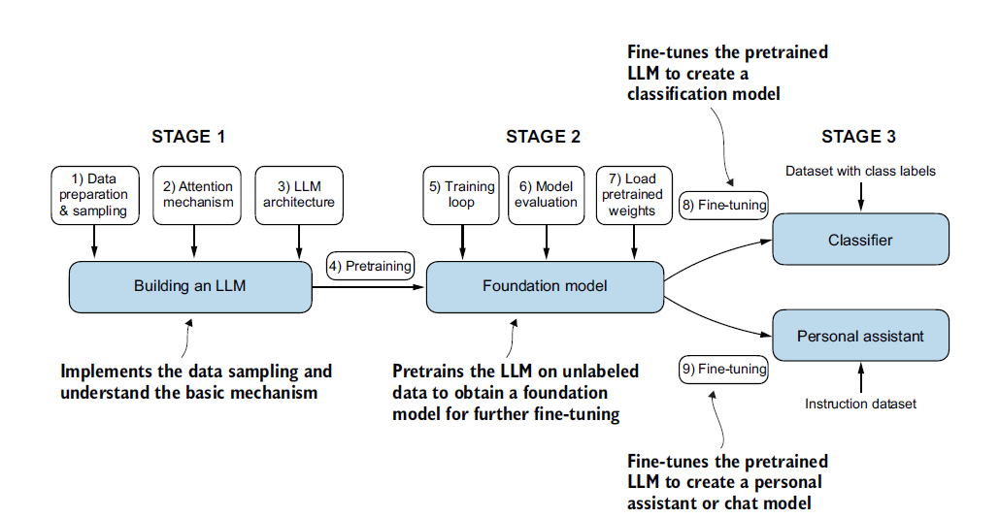

### 1.1 Self-Supervised Learning

**Intuition** — An LLM's raw capability does not come from people hand-labeling millions of examples. It comes from repeatedly asking the model to predict either a masked token or the next token in a sequence. The text itself provides the answer key. That is why the process is called **self-supervised**: the supervision is already hidden inside the data. These training problems are also called **pretext tasks**.

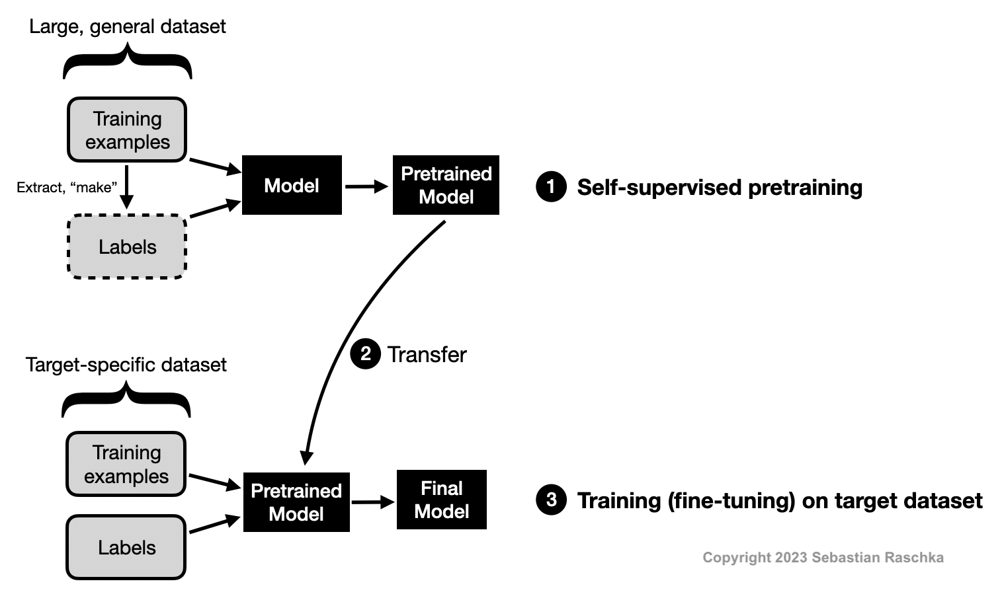

**Mechanism** — Modern LLM development runs through three distinct stages, each with different data and (often) a different loss:

| Stage                       | What happens                                                       | Data                                        | Loss                                     |
| --------------------------- | ------------------------------------------------------------------ | ------------------------------------------- | ---------------------------------------- |
| 1. Pretraining             | Predict the target token specified by the language-modeling objective over a huge, unlabeled corpus | Web text, books, code — trillions of tokens | Cross-entropy over the vocabulary        |
| 2. Supervised fine-tuning, including instruction tuning / supervised fine-tuning (SFT) | Same cross-entropy objective, now on instruction→response pairs | Curated instruction datasets                | Cross-entropy (same form, narrower data) |
| 3. Alignment                | Learn from a human preference signal, not just next-token accuracy | Preference/comparison data                  | Reinforcement learning (RL) or preference-based loss |

Stage 1 is this session's focus; Stage 2 and Stage 3 belong later in the course. Pretraining uses the same self-supervised prediction principle as other representation-learning methods, but at much larger scale. Later stages adapt the pretrained representations and behavior to specific uses rather than adding a separate understanding module. The model develops more useful representations and predictions because next-token or masked-token prediction is repeated over huge amounts of data.

_Everyday version:_ it's like a student practicing with flashcards where the answer is printed on the back of the very same card — no teacher needs to grade anything, because the material itself already contains the answer key. Cover the next word, guess it, flip and check, repeat millions of times. That is the entire supervision signal in pretraining: the text supplies both the question and the answer, so nobody has to hand-label a thing.

**Worked example** — the concrete numeric example for Stage 1's loss appears in Section 1.3, `LLM training`.

**Tradeoff / when NOT to use** — self-supervised pretraining from scratch is usually justified only when you have web-scale unlabeled text and need a general-purpose base model. If you have a narrow task and a modest labeled dataset, don't pretrain a new model—fine-tune an existing pretrained one (session 7). Reproducing a GPT-3-scale pretraining run for one narrow classification task incurs the cost of pretraining without needing the generality it provides.

---

### 1.2 Pretraining Objectives

**Intuition** — The training objective matters because it shapes what the model is directly optimized to do. If trained to predict the next token, a model is directly optimized for left-to-right continuation. If trained to reconstruct masked tokens from both sides, it learns bidirectional contextual representations that are often useful for classification; neither objective alone guarantees “understanding.”

**Mechanism** —

| Objective                              | Model family / example                                      | Attention pattern and typical use |
| -------------------------------------- | ----------------------------------------------------------- | ---------------------------------- |
| CLM / next-token prediction            | GPT-4 and other decoder-only GPT/Llama models; Claude's architecture is not publicly specified | Left-to-right causal attention; free-form generation |
| Masked-token prediction                | BERT — encoder-only                                        | Bidirectional attention; representations and classification after fine-tuning |
| Denoising span-mask prediction         | T5 — encoder-decoder                                       | Corrupt spans are reconstructed using encoder context and an autoregressive decoder |

CLM is the objective behind the decoder-only LLMs used throughout this subject. MLM is the classic BERT-style objective, while T5 uses an encoder-decoder denoising objective that reconstructs masked spans. The important distinction is what each objective trains the model to do: CLM trains left-to-right next-token prediction, whereas MLM trains bidirectional contextual representations by reconstructing masked tokens; the latter is commonly adapted to classification rather than native free-form generation, and span denoising trains an encoder-decoder model to reconstruct missing text.

_Everyday version:_ CLM is like reading a mystery novel one page at a time and guessing what happens next using only what you've read so far — you're never allowed to peek ahead. MLM is like being handed a page with a few words blacked out and figuring out each one using both the sentence before it and the sentence after it, the way you'd solve a crossword clue. The first habit builds someone who's good at continuing a story; the second builds someone who's good at understanding a passage once it's all laid out in front of them.

**Worked example** — the numeric loss calculation in Section 1.3, `LLM training`, is the CLM case, since that is what this subject's LLMs actually train on.

**Tradeoff / when NOT to use** — During training, a CLM uses a causal mask but can evaluate all positions in parallel; during inference, it generates autoregressively because each next-token distribution depends on previously generated tokens. An MLM uses bidirectional context and therefore does not natively generate free-form continuations; classification can attach a task-specific head to the encoder representation, while generation requires an autoregressive decoder or another autoregressive output mechanism.

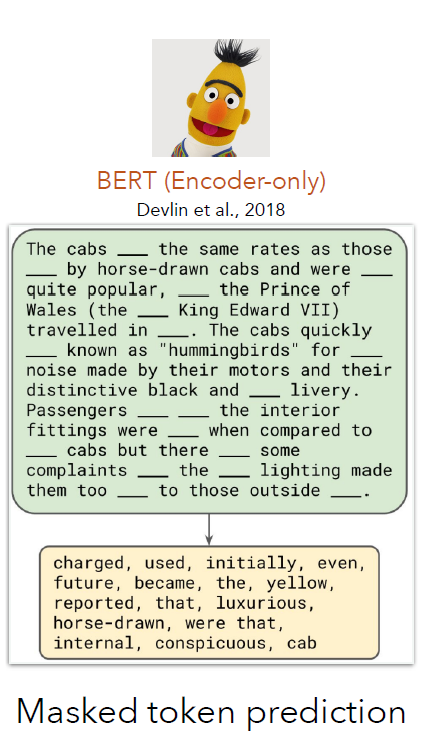

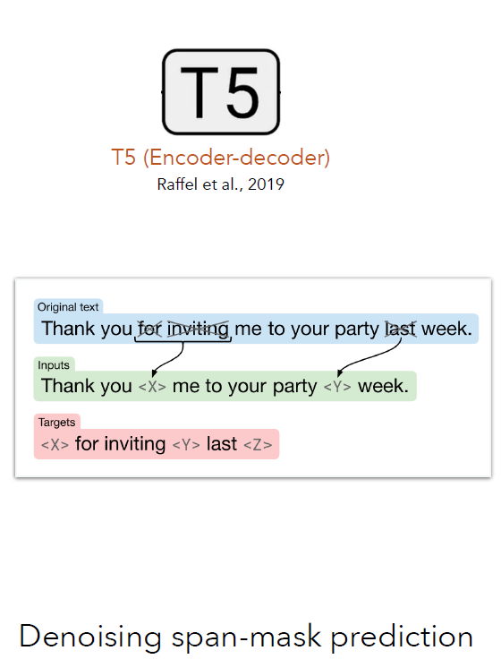

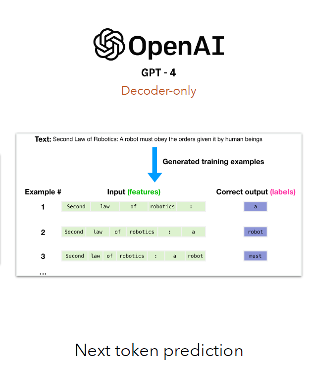

---

### 1.3 LLM training

**Intuition** — Training only works if the model gets a score telling it how wrong it was. In language modeling, that score comes from a simple idea: after the model predicts a probability distribution over the vocabulary, check how much probability it gave to the token that really came next. If that probability was low, the model should be penalized. If it was high, the penalty should be small. Cross-entropy is that penalty. Perplexity is the same story rewritten in a more human-readable scale.

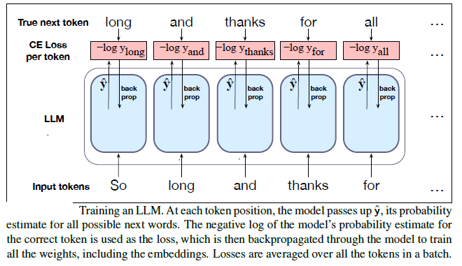

**Mechanism** — For `T` next-token prediction positions, at position `t` the model receives the prefix through `wₜ`, outputs a distribution `ŷₜ` over the vocabulary, and is evaluated against target `w_{t+1}`, for `t = 1,…,T`. Since the true next token is a single token (one-hot), the general cross-entropy formula collapses to the negative log-probability of just that one correct token:

```
L_CE (T next-token targets) = (1/T) · Σ_{t=1..T}  −log ŷₜ[w_{t+1}]
```

Why this particular penalty, rather than something simpler like scoring raw accuracy (did the top prediction match)? Accuracy is not differentiable — it gives zero gradient almost everywhere, so there's no signal telling the optimizer which direction to nudge each weight. Squared error between the predicted distribution and a one-hot target is differentiable, but its gradient goes flat once the predicted probability is near either extreme, so it stops correcting a confidently-wrong prediction fast. Negative log-probability avoids both problems: for positive softmax probabilities it is smooth; its derivative with respect to the correct probability is `−1/p`, so assigning a tiny probability receives a large penalty, while its derivative with respect to a softmax logit is `p − y`. It is also the negative log-likelihood objective.

_Everyday version:_ think of a weather forecaster who says "10% chance of rain" and it pours that day. Cross-entropy fines them hard for that — they were confident and wrong. If instead they'd said "40% chance of rain," the same rainy outcome earns a much smaller fine, because they'd hedged more. Just tracking whether the forecaster's top guess ("rain" vs "no rain") was right or wrong would treat both cases the same and never teach them to be appropriately less confident — cross-entropy is the scoring rule that specifically punishes confident wrongness, which is exactly the behavior you want to train out of the model.

Training uses **teacher forcing**: at every position, the model is shown the true previous tokens, not its own guesses from earlier positions. This avoids feeding an early sampled error into later inputs during training; using model-generated history instead creates an exposure mismatch between training and inference.

Perplexity is `exp(L_CE)` when cross-entropy uses natural logarithms: it is the geometric mean of the inverse probability assigned to the observed tokens, not literally the number of choices considered. Lower is better. One caveat matters a lot in practice: perplexity is **tokenizer-dependent**. If two models use different tokenizers, their perplexity numbers are not directly comparable because the unit "token" is not the same.

**Worked example — reproduce this by hand.** Two 3-token sequences pass through a model that has _not yet been trained_:

- `"every effort moves"` → target `"effort moves you"`
- `"I really like"` → target `"really like chocolate"`

The model assigns these probabilities to the _correct_ target token at each of the 6 positions across both sequences:

| Sequence | Position | Probability assigned to the correct token | log(probability) |
| -------- | -------- | ----------------------------------------- | ---------------- |
| 1        | 1        | 2.3466 × 10⁻⁵                             | −10.6600         |
| 1        | 2        | 2.0531 × 10⁻⁵                             | −10.7936         |
| 1        | 3        | 1.1733 × 10⁻⁵                             | −11.3531         |
| 2        | 1        | 4.2794 × 10⁻⁵                             | −10.0591         |
| 2        | 2        | 1.6248 × 10⁻⁵                             | −11.0275         |
| 2        | 3        | 1.1586 × 10⁻⁵                             | −11.3657         |

Average log-probability = −10.8765. **Cross-entropy loss = −(−10.8765) = 10.8765.**

Every probability here is tiny (~10⁻⁵, roughly 1-in-100,000) because the untrained model is guessing almost uniformly across its ~50,000-token vocabulary — it hasn't yet learned to favor the correct token. That's what a loss around 10–11 nats means in plain terms. As training proceeds, this number falls; a well-trained small model on a narrow corpus can reach a loss under 1.0 (Section 3.2 has a full training-run log showing this fall in practice, alongside what happens when it falls _too_ far).

**Tradeoff / when NOT to use** — cross-entropy on held-out text is useful for comparing models when tokenization, evaluation data, and aggregation conventions are aligned; differing tokenizers make raw perplexity incomparable, while train/evaluation overlap makes the score an unreliable estimate of generalization. See the MMLU discussion above. Cross-entropy also does not directly measure whether generated text is _correct_, only whether it was _likely_ under the model's training distribution — a fluent, confident, wrong answer can still carry a good loss.

#### Modern LLM development and training pipeline

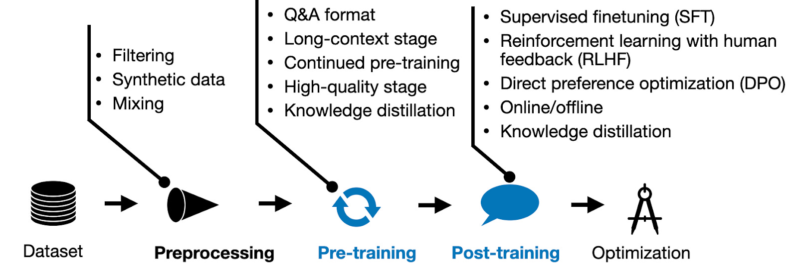

This diagram shows the LLM development pipeline from raw data to a model prepared for use. Read it from left to right. The five blocks are stages in one workflow, not five different model architectures.

**1. Dataset — the starting material**

A dataset is a large collection of material such as books, websites, articles, code, conversations, and documents. The quality and diversity of this material strongly influence what the final model can learn. Raw data may contain duplicates, noise, harmful content, or irrelevant material, so it cannot normally be used directly.

**2. Preprocessing — prepare the training corpus**

Before training, the raw dataset is cleaned and organized:

- **Filtering:** remove or down-weight low-quality, harmful, duplicated, or irrelevant content.
- **Synthetic data:** add generated examples when they are useful and appropriately checked.
- **Mixing:** combine web text, code, Q&A, academic content, books, and other sources in selected proportions.

**Goal:** produce a training-ready corpus. Preprocessing is data engineering; the model has not learned its capabilities yet.

**3. Pretraining — learn broad language patterns**

The model is trained on the prepared corpus, usually with self-supervised **next-token prediction**. It learns statistical patterns, facts represented in the data, coding patterns, and other broad capabilities. The diagram lists several possible parts of a modern pretraining recipe:

- **Q&A format:** represent some data as questions and answers. This can help question-answering behavior, but Q&A formatting alone does not create instruction following; instruction following is mainly developed during post-training.
- **Long-context stage:** train with longer sequences so the model can process longer documents or conversations.
- **Continued pretraining:** continue next-token training from an existing checkpoint, often to adapt it to a domain or new data.
- **High-quality stage:** use a carefully curated subset, sometimes late in training, to refine the model.
- **Knowledge distillation:** train one model to reproduce useful behavior from a stronger teacher model. This is optional and can be used at different points in a model-development recipe.

**Result:** a base model with broad language capabilities. These listed items are recipe choices, not mandatory steps for every LLM.

**4. Post-training — shape useful behavior**

Post-training starts from the pretrained base model and uses narrower instruction or preference data to make its responses more useful, safe, and consistent:

- **Supervised fine-tuning (SFT):** train on human-written or curated instruction–response examples.
- **Reinforcement learning from human feedback (RLHF):** use human preferences or rankings to improve response behavior.
- **Direct preference optimization (DPO):** learn directly from preferred and rejected responses without the same separate reinforcement-learning procedure used in a traditional RLHF pipeline.
- **Online/offline methods:** use either fixed preference data (**offline**) or newly collected/on-policy feedback (**online**). Online does not necessarily mean that the model is updated continuously.
- **Knowledge distillation:** optionally transfer useful behavior from a larger teacher to a smaller model.

**Result:** an instruction-following or aligned model, rather than only a general text predictor. Post-training builds on pretraining; it does not replace it.

**5. Optimization — prepare for efficient use**

The source diagram labels the final block only as **Optimization**. In practice, this may include:

- quantization to reduce model size and memory use;
- pruning or sparsity methods to reduce computation;
- faster inference and batching;
- memory optimization;
- hardware-specific tuning for GPUs, TPUs, or NPUs.

These are common examples, not techniques explicitly specified by the source slide. The goal is to make the model cheaper, faster, and easier to serve.

**Exam-friendly summary**

```text
Dataset
  ↓
Preprocessing
  • Filtering
  • Synthetic data
  • Data mixing
  ↓
Pretraining
  • Next-token prediction
  • Q&A-formatted data
  • Long-context stage
  • Continued pretraining
  • High-quality-data stage
  • Optional knowledge distillation
  ↓
Post-training
  • SFT
  • RLHF
  • DPO
  • Online/offline preference methods
  • Optional knowledge distillation
  ↓
Optimization
  • Quantization
  • Pruning/sparsity
  • Inference and hardware optimization
```

**One-line memory trick:**

> **Collect Data → Clean Data → Learn Language → Align Behavior → Optimize Deployment**

The key distinction is that **pretraining teaches broad patterns**, while **post-training shapes how the model responds to people**. The arrows represent increasing data and model readiness: raw material → clean corpus → base model → aligned model → deployable system.

#### Modern pre-training

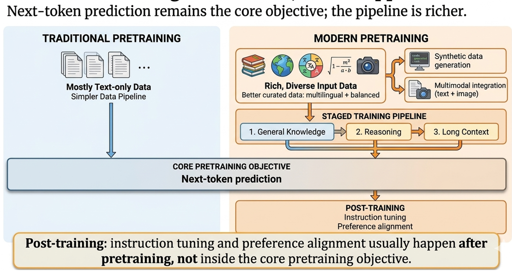

**Central idea:** modern pretraining does not replace the core objective. The model still learns primarily by predicting the next token. What has become richer is the **data**, the **training stages**, and the use of **post-training** after the core pretraining phase.

**Traditional pretraining vs modern pretraining**

| Aspect | Traditional pretraining | Modern pretraining |
| --- | --- | --- |
| Data | Mostly text-only data | Rich, diverse, multilingual, balanced, and sometimes multimodal data |
| Data pipeline | Relatively simpler | More curation, synthetic-data generation, data mixing, and multimodal integration |
| Core objective | Next-token prediction | Still mainly next-token prediction |
| Training recipe | Often treated as one broad training phase | May use staged training for general knowledge, reasoning, and long context |
| After pretraining | Separate fine-tuning may follow | Instruction tuning and preference alignment usually follow as post-training |

**What the modern-pretraining side adds**

1. **Rich and diverse input data** — combine text from multiple languages and domains with better curation and more balanced sampling. Depending on the model, the data may also include code, images, audio, or other modalities.
2. **Synthetic data generation** — create additional training material with another model or a specialized data-generation process. Synthetic data must still be checked for quality, factual errors, and repeated model biases.
3. **Multimodal integration** — train the system to connect text with other modalities, such as an image and its description. The exact architecture and objective vary by model; the diagram's point is that modern training is no longer restricted to text-only input.
4. **Staged training** — the diagram illustrates a possible sequence:
   - **General knowledge:** learn broad language and world-knowledge patterns.
   - **Reasoning:** emphasize data or procedures intended to improve multi-step problem solving.
   - **Long context:** train on longer sequences so the model can use more of a document or conversation at once.

These stages are an illustrative modern recipe, not a universal schedule. Some models combine stages, repeat them, or use different names and ordering.

**Where post-training fits**

The diagram places **instruction tuning** and **preference alignment** after the core pretraining objective. This distinction is important:

- **Pretraining** builds broad representations and capabilities from large-scale data, usually through next-token prediction.
- **Post-training** uses instruction examples and preference signals to make the model follow requests, produce preferred formats, and behave more helpfully and safely.

Therefore, instruction tuning is not the same as the core pretraining objective, even though instruction-formatted data may sometimes be included in a pretraining mixture. The diagram's lower message is the key exam point: **post-training usually happens after pretraining, not inside the core next-token-prediction objective.**

**Exam-friendly summary**

```text
Traditional: mostly text-only data → next-token prediction

Modern: richer and more diverse data
        → synthetic-data generation and multimodal integration
        → staged training: general knowledge → reasoning → long context
        → post-training: instruction tuning → preference alignment

Core objective throughout pretraining: next-token prediction
```

**One-line memory trick:**

> **Same objective, richer recipe: diverse data → staged training → post-training.**

> **_In practice_** _— how this appears in production._ Real pretraining runs choose a configured sequence length and process fixed-length sequences; short documents may be packed into one sequence with end-of-text separators. Context-window sizes are model- and version-specific, so comparisons should identify the exact model variant. The batch size for gradient descent is large — the biggest GPT-3 model trained with a batch size of **3.2 million tokens** at once, not 3.2 million _examples_.

> **_Going deeper_** _— evaluating beyond loss._ Public benchmarks like **MMLU** (Massive Multitask Language Understanding, 15,908 questions across 57 subject areas) test task performance directly rather than raw next-token loss. Their real weakness is **data contamination**: since LLMs train on scraped web text and MMLU itself is on the web, a model may have seen benchmark questions during pretraining, inflating its score. Published mitigations are reporting train/test overlap directly or holding out contamination-checked splits — a genuine problem that remains unresolved in general for any benchmark built from public text.

---

## Part 2 · Pretraining Data

_If Part 1 explained how the model learns, Part 2 explains what it learns from. This is where the note shifts from objective functions to data engineering: which corpora are used, how they are mixed, and how raw scraped text gets cleaned before it ever reaches the model._

### 2.1 Data Mixture

**Intuition** — What a model reads during pretraining shapes almost everything it can do later. So "just scrape the web" is not a real recipe. The hard part is deciding what kinds of text deserve more weight, what should be filtered out, and whether the model should see all categories in the same proportion from start to finish.

**Mechanism — named corpora, as a landscape:**

| Corpus                                 | Size                | Composition                                                                                                                                          |
| -------------------------------------- | ------------------- | ---------------------------------------------------------------------------------------------------------------------------------------------------- |
| **C4** (Colossal Clean Crawled Corpus) | 156B English tokens | Filtered Common Crawl — deduplicated, non-natural-language text and code removed, offensive-word blocklist applied; skews toward patents, Wikipedia, and news |
| **The Pile**                           | 825 GB              | Academic (PubMed, arXiv, patents), internet text (web + Wikipedia), prose (books), dialogue (movie subtitles, chat), misc.                           |
| **Dolma**                              | 3 trillion tokens   | Web, academic papers, code, books, encyclopedic text, social media                                                                                   |
| **Pushshift.io**                       | 2 TB                | Reddit links                                                                                                                                        |
| **ROOTS**                              | 1.6 TB              | Other                                                                                                                                               |


#### Commonly Used Corpora for Pre-training

| Corpus         | Size  | Source        | Latest update |
| -------------- | ----- | ------------- | ------------- |
| BookCorpus     | 5 GB  | Books         | Dec-2015      |
| Gutenberg      | —     | Books         | Dec-2021      |
| C4             | 800 GB| CommonCrawl   | Apr-2019      |
| CC-Stories-R   | 31 GB | CommonCrawl   | Sep-2019      |
| CC-NEWS        | 78 GB | CommonCrawl   | Feb-2019      |
| REALNews       | 120 GB| CommonCrawl   | Apr-2019      |
| OpenWebText    | 38 GB | Reddit links  | Mar-2023      |
| Pushshift.io   | 2 TB  | Reddit links  | Mar-2023      |
| Wikipedia      | 21 GB | Wikipedia     | Mar-2023      |
| BigQuery       | —     | Codes         | Mar-2023      |
| The Pile       | 800 GB| Other         | Dec-2020      |
| ROOTS          | 1.6 TB| Other         | Jun-2022      |

**Data mixture** operates at two levels. First, there is the **global mix**: how much of the whole training run comes from web text, books, code, academic text, and so on. Second, there is the **local mix**: whether those proportions change at different stages of training. Llama 3's knowledge cutoff was the end of 2023; it also deliberately downsampled categories that are over-represented on the public web relative to their real usefulness — **arts and entertainment** is the concrete category the team named, since that kind of content is abundant online but not proportionally valuable for training a general-purpose model.

_Everyday version:_ a chef doesn't dump a dish together using whatever happens to be most abundant in the pantry. They deliberately measure out more of what actually improves the dish and less of what's simply plentiful, even holding back an ingredient they have a huge supply of if it doesn't earn its place. Data mixture is the same deliberate measuring, applied to a training corpus instead of a pantry.

#### Data Curriculum

**Data curriculum** is the ordering version of the same idea. Instead of asking only "how much of each kind of data?", it asks "in what order should the model see it?" A simple curriculum may start with easy, general examples and progressively introduce more challenging or specialized ones. Llama 3's **data annealing** is a good example: near the end of training, the model is exposed to a tiny, very high-quality subset while the learning rate is reduced. That helped the 8B model noticeably, but barely moved the 405B model, which is a useful reminder that some tricks matter more at smaller scales.

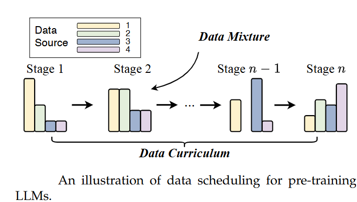

_Everyday version:_ "annealing" borrows its name from metalworking, but it is not a literal shared mechanism. Near the end of training, the learning rate is reduced while a small, high-quality data subset is used to refine the model after broad pretraining — a last refining touch rather than more of the same raw material.

**Worked example** — Llama 3's annealing dataset was 40 billion tokens, labelled as 0.02% of the total pretraining set, and was used partly just to _assess_ data quality; the actual annealing procedure used only 40 million tokens (0.1% of that 40B subset). The 15-trillion-token modern-era figure implies 40B/15T ≈ 0.27%, so the 0.02% label is internally inconsistent; preserve the token counts, not that incompatible percentage. Either way, this is a tiny sliver of tokens doing a disproportionate amount of late-stage quality work.

**Tradeoff / when NOT to use** — aggressive downsampling or curriculum ordering adds real engineering complexity (you now need per-category quality scores, staged schedules, and monitoring for regressions) for a payoff with a reported Llama 3 result showing a larger annealing benefit for 8B than for 405B; this result alone does not establish that curriculum benefits generally shrink with model size. For a small-scale or research pretraining run without the infrastructure to track category-level provenance, a simpler uniform-sampling approach is a defensible starting point — curriculum tuning is where you spend engineering effort _after_ the basics work, not before.

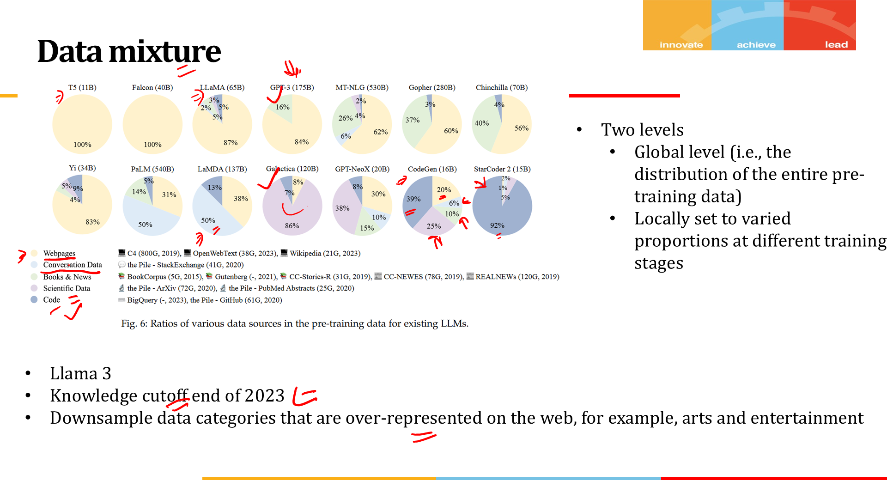

> **_Going deeper_** _— the ethics and legality of web-scraped pretraining data, a live and unresolved area._ Copyright/fair-use status of training on scraped text is legally ambiguous; a rising share of sites now opt out via `robots.txt` or Terms of Service, with unclear retroactive legal status for data already scraped; private information (phone numbers, emails) leaks through despite filtering; and pretraining corpora skew geographically and demographically toward authors in the United States and other developed countries, which shapes what "default" model behavior looks like globally. None of this is a solved problem — it's an active area of law and policy, not a settled engineering answer.


---

### 2.2 Data Preprocessing Pipeline

**Intuition** — Raw web text is messy. It contains duplicates, boilerplate, bad OCR, spam, private information, broken formatting, and many short fragments that would waste training compute if used as-is. So before the text reaches the model, it has to go through a preprocessing pipeline.

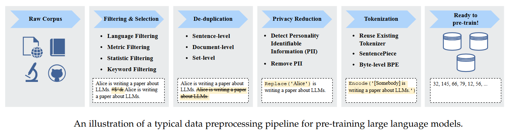

**Mechanism — the pipeline, in order:**

1. **De-duplication** — remove repeated documents or repeated spans. Low-quality sentences containing repeated words and phrases are filtered, and word and n-gram (contiguous sequence of `n` tokens) overlap across documents can flag near-duplicates. This reduces wasted compute; separate train/evaluation decontamination is needed to address benchmark leakage.
#### Data Filtering and Selection

2. **Quality filtering** — score documents and keep the ones that look like useful natural text rather than spam, broken markup, or repetitive boilerplate. A common example is **perplexity filtering**, a distributional filter in which a small reference language model scores how well text matches its training distribution. Depending on the pipeline, a middle band may be retained: high-perplexity text is often noisy or broken, while very-low-perplexity text can be boilerplate or duplicated templates. The thresholds are corpus- and model-dependent, not universal constants.

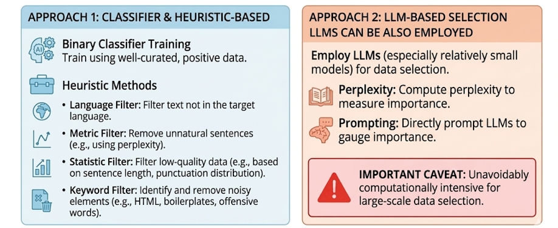
3. **Safety filtering** — remove at least some clearly harmful content. This helps, but it is not clean or neutral; it can also reflect the bias of the classifier doing the filtering.
#### Data Packing

4. **Packing** — combine several short documents into one training window, separated by an end-of-text token, so compute is not wasted on padding.

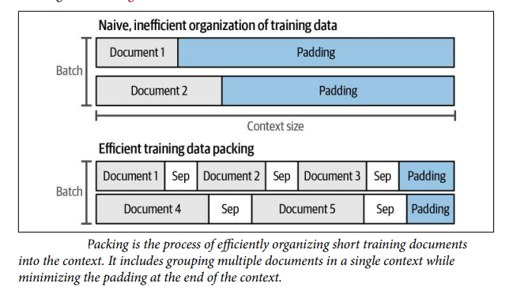

_Everyday version:_ think of prepping a big batch of meals for the week. Deduplication is tossing out two of the three identical bags of the same vegetable that you accidentally bought. Quality filtering is checking each item and setting aside anything spoiled or unusable before it goes anywhere near the pan. Packing is fitting several smaller, unrelated leftovers efficiently into one container with explicit boundaries; the boundaries mark where each item ends but do not by themselves prevent interaction between neighboring items.

**Worked example — packing, concretely.** Four unrelated text snippets — one about a sports team, one a fairy tale, one financial news, one a personal story — are concatenated into a single training sequence as: `[sports text] <|endoftext|> [fairy tale] <|endoftext|> [financial news] <|endoftext|> [personal story]`. The boundary token marks document ends so the model can distinguish one document from the next; by itself, however, it does not prevent cross-document conditioning. It also serves as a general sequence-termination token, not only as a packing marker. An implementation may use attention masks or loss masks when strict document isolation is required.

**Worked example — Llama 3's model-based data curation pipeline.** Llama 3 used several stages:

1. A **fastText** classifier made a cheap first pass, identifying text resembling material that Wikipedia might cite.
2. Stronger **RoBERTa-family quality classifiers** were trained with labels generated by Llama 2.
3. **DistilRoBERTa**, a cheaper distilled model, scored the full corpus at scale.

The broader pipeline also combined heuristic filters and semantic deduplication rather than relying on any single filter.

**Tradeoff / when NOT to use** — perplexity filtering and quality classifiers reduce noise but are themselves imperfect models trained on someone's notion of "quality" — over-aggressive filtering can systematically remove dialects, informal registers, or minority viewpoints that a narrow reference model scores as "low quality" text, which is exactly the same class of problem as the safety-filter dialect bias above. Packing usually improves utilization by avoiding padding, but it is not literally free: a single training sequence can contain multiple unrelated documents, so a model must learn to _use_ the end-of-text boundary correctly and not be misled by adjacency, or it risks bleeding context across unrelated packed documents.

---

## Part 3 · Continued Pretraining (CPT) and Domain Adaptation

_Part 3 asks a practical question that comes up in real organizations: once you already have a good pretrained model, how should you adapt it to your own domain? The answer is not always "train from scratch again."_

### 3.1 Continued Pretraining (CPT)

**Intuition** — Once you have a pretrained model, there are several ways to adapt it to a new domain. They are not small variations of the same choice. They trade off cost, speed, and how much of the original broad capability survives.

**Mechanism — four paths, compared. Let `D1` denote the original/general corpus and `D2` the new domain corpus:**

| Path                                           | What happens                                                          | Cost                                                    | Keeps general knowledge?                                   |
| ---------------------------------------------- | --------------------------------------------------------------------- | ------------------------------------------------------- | ---------------------------------------------------------- |
| **Regular pretraining**                        | Random weights, train from scratch on dataset D1                      | Full pretraining cost                                   | N/A — this _is_ the general model                          |
| **Continued Pretraining (CPT)**                | Take the pretrained model from D1, keep training it on new dataset D2 | Much cheaper than from-scratch                          | Partially — at risk of catastrophic forgetting (Section 3.2) |
| **Retrain on the combined dataset**            | Random weights again, but train on D1 ∪ D2 together from the start    | As expensive as regular pretraining                     | Yes, by construction — but you paid full price again       |
| **Domain-Specific Pretraining (from scratch)** | Random weights, train _only_ on the narrow-domain dataset             | Full pretraining cost, but on a smaller/narrower corpus | No — never had it                                          |

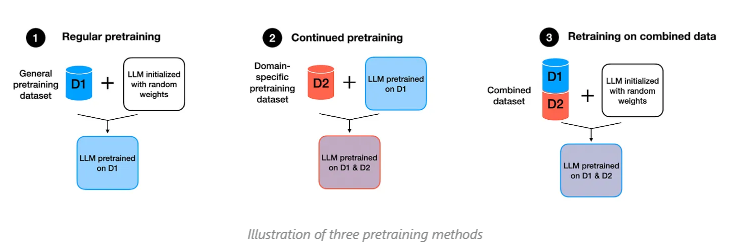

CPT is the practical middle path in many real systems: much cheaper than full retraining, but still capable of picking up domain knowledge. The price is forgetting risk, which is why the next concept matters.

_Everyday version:_ CPT is like giving a fluent, well-read adult specialist training: the existing general foundation is retained while updates on domain text add specialization, although those updates can interfere with earlier capabilities.

**Worked example** — see Section 3.3's FinLLaMA/BloombergGPT comparison: FinLLaMA is CPT (starts from Llama 3 8B, continues training on financial text), while BloombergGPT is closer to domain-specific pretraining from scratch with a general-data mixture (trained on a blend of finance and general tokens from the start, not adapted from an existing checkpoint).

**Tradeoff / when NOT to use** — retraining on the combined dataset is generally safer against forgetting but throws away the entire cost advantage CPT exists to provide — if you can afford a full retrain, and you actually need both domains equally well represented from the start, it's the more robust (if expensive) choice. Domain-specific pretraining from scratch is the right call only when the target domain is different enough from general text that inherited general capability isn't worth much anyway (a narrow, self-contained technical corpus, for instance) — otherwise you're paying full pretraining cost for a model that has thrown away general reasoning ability it will likely still need.

---

### 3.2 Catastrophic Forgetting

**Intuition** — In sequential learning across diverse datasets or tasks over time, you want an already-capable model to learn new information without destroying what it already knew. That balance is hard. The same updates that help it specialize can also overwrite older knowledge. That failure mode is called **catastrophic forgetting**.

_Everyday version:_ think of cramming hard for a French exam the night before — by morning your French is sharp, but you notice you've become shaky on Spanish vocabulary you knew solidly last month. Your brain didn't have a way to protect the old memory while intensively building the new one, so the new learning partly overwrote it. That's catastrophic forgetting: a model aggressively learning a new domain can overwrite the general knowledge it already had, unless something specifically protects it.

**Mechanism — five mitigations, each attacking the problem differently:**

| Mitigation                             | How it helps                                                                                                                                                                                     |
| -------------------------------------- | ------------------------------------------------------------------------------------------------------------------------------------------------------------------------------------------------ |
| **Lower learning rate**                | Smaller weight updates disturb existing weights less, so old knowledge is less likely to be overwritten in any single step                                                                       |
| **Learning-rate (LR) warmup**          | Ramp the learning rate up gradually at the start of CPT rather than jumping straight to its target value; this reduces the risk of large early updates. Reusing the original pretraining schedule is one possible policy, not a universal requirement |
| **Data mixing / replay**               | Blend a small percentage of the _original_ pretraining data back into the CPT batches, so the model keeps seeing (and re-reinforcing) old-domain examples while learning the new domain          |
| **EWC** (Elastic Weight Consolidation) | Add a penalty term to the loss that selectively slows learning on weights identified as _critical_ to the old task, leaving less-critical weights free to adapt                                  |
| **LoRA / parameter-efficient fine-tuning (PEFT)** | In LoRA and many PEFT methods, freeze the base model and train only small adapter parameters; this preserves the base checkpoint, but the active adapter can still change task behavior (session 7 covers the mechanism in full) |

#### LR warmup

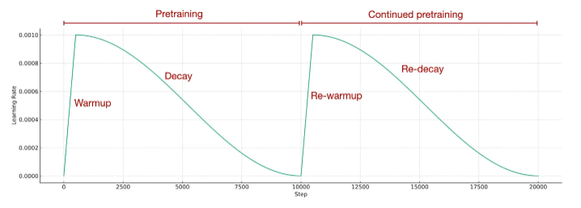

_Two of these are easiest to picture directly:_ **EWC** is like assigning a high cost to changing important whiteboard regions rather than literally preventing changes; **LoRA/PEFT** is like adding a separate layer of notes while leaving the original textbook weights frozen.

**Use case — CPT without replay, in production.** Suppose a bank continues pretraining Llama 3 8B only on internal compliance documents. After enough steps, the model may answer compliance questions better but get noticeably worse at ordinary general-language tasks it previously handled well. That is catastrophic forgetting in action. Mixing some general-domain data back into the batches is often the cheapest way to slow that damage down.

**Worked example** — Raschka's own small-scale pretraining run makes overfitting visible even without CPT: training a tiny GPT-style model for 10 epochs on a small corpus shows training loss falling smoothly from 9.78 (epoch 1) to 0.39 (epoch 10), while _validation_ loss falls only until around epoch 8, then rises back up to 6.45 by epoch 10. Roughly 7–8% of the model's generated text at that point turns out to be **verbatim copied** from the tiny training set — the model has started overfitting so hard it is reciting training examples rather than generalizing. This is related to, but distinct from, catastrophic forgetting: overfitting memorizes the current training set, whereas catastrophic forgetting loses previously learned knowledge during later updates.

**Tradeoff / when NOT to use** — every mitigation here costs something. A lower learning rate slows down how quickly the model actually learns the new domain — if the new domain is very different from the old one and you _need_ strong adaptation, an overly conservative LR can leave the model under-adapted. Data replay requires keeping (and re-serving) a slice of the original pretraining corpus, which isn't always available or licensed for continued use. EWC requires computing and storing per-weight importance estimates, adding real implementation overhead. LoRA/PEFT is the cheapest and safest against forgetting by construction, but it also means the base model's knowledge is truly frozen — if the _base_ knowledge itself needs to change (not just be extended), PEFT alone won't get you there.


---

### 3.3 Domain Adaptation

**Intuition** — Two real finance-domain LLMs took different paths through the pretraining choices above, and comparing them makes the tradeoffs concrete.

**Mechanism — side by side:**

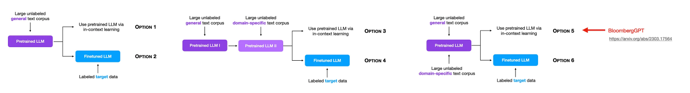

|                       | FinLLaMA                                                                                                                    | BloombergGPT                                                                                                                            |
| --------------------- | --------------------------------------------------------------------------------------------------------------------------- | --------------------------------------------------------------------------------------------------------------------------------------- |
| Approach              | Continued pretraining (CPT)                                                                                                 | Trained from scratch on a mixed corpus                                                                                                  |
| Base                  | Meta Llama 3 (8B) — inherits general pretrained capabilities from the start                                                 | No pretrained base — built from scratch                                                                                                 |
| Parameters            | 8B                                                                                                                          | 50B                                                                                                                                     |
| Training data         | 52B financial tokens, mixed with 18B general-domain tokens (≈75/25 split)                                                   | 363B finance tokens + 345B general tokens                                                                                               |
| Forgetting mitigation | Data replay — the 18B general tokens exist specifically to prevent catastrophic forgetting of Llama 3's original capability | N/A in the same sense — general knowledge was built in from the start, not preserved against loss                                       |
| Sizing rationale      | Inherited from Llama 3's own design                                                                                         | Sized at 50B using **Chinchilla scaling laws** (Section 4.3), chosen as the compute-optimal size given the available finance-data volume |

**Worked example** — FinLLaMA's 75/25 financial-to-general token ratio is a direct, numeric instance of the "data mixing / replay" forgetting mitigation from Section 3.2: roughly one in four training tokens is deliberately _not_ finance-specific, purely to keep Llama 3's general capability from eroding while it specializes.

**Tradeoff / when NOT to use** — FinLLaMA's CPT approach is far cheaper because it starts from an 8B checkpoint, but it retains the 8B architecture and its associated capacity; CPT can improve domain performance but cannot provide the capacity of a larger architecture by itself. BloombergGPT's from-scratch approach is dramatically more expensive but allowed its designers to choose model size and data mixture freely, using scaling laws to pick a genuinely compute-optimal 50B rather than inheriting someone else's architecture decision. If your organization doesn't have the compute budget required for pretraining from scratch (most don't), CPT on an existing capable open-weight model is the realistic choice — BloombergGPT-style from-scratch training is reserved for organizations with both the capital and the proprietary data volume (Bloomberg's decades of financial text) to justify it.

---

## Part 4 · Scaling Laws

_This part answers the planning question. If pretraining is expensive, how do labs decide how large the model should be and how many tokens it should see? Scaling laws are the attempt to answer that before spending the full compute budget._

### 4.1 Why Scaling Laws?

**Intuition** — Pretraining at frontier scale is too expensive for guesswork. You cannot casually try five different 400B-scale runs and keep the best one. Scaling laws exist because labs need a way to use smaller experiments to predict what larger runs are likely to do.

**Mechanism** — With a fixed compute budget, the real design question is how to choose **model size** (`N`) and **dataset size** (`D`) together with the number of **training steps**; total training compute is represented by `C`. The core empirical observation is that loss often follows an approximate power-law trend as these quantities grow within the tested regime. That makes extrapolation possible, but not guaranteed: run smaller proxy experiments, fit the curve, then choose the large-run recipe before paying for the full run.

_Everyday version:_ it's like a bakery testing a new recipe in a handful of small batches before committing an entire warehouse of flour and sugar to it. Baking 10,000 loaves and only then discovering the recipe doesn't work would be an enormous, unrecoverable waste. Baking twenty test loaves first, watching how the recipe scales up with pan size and oven time, and only then committing the full pantry — that's what scaling laws let a lab do with compute instead of flour.

**Worked example** — Meta ran scaling-law experiments on small proxy models specifically to choose Llama 3's pretraining data mix, then scaled the winning recipe up to 405 billion parameters — the whole point being that they did not need to guess or run the full 405B experiment multiple times to find a good recipe.

**Tradeoff / when NOT to use** — scaling-law extrapolation assumes the small-scale trend actually continues smoothly to the target scale, which is not guaranteed — this is exactly what the "emergent abilities" debate (Section 4.4) complicates: some capabilities appear to _not_ follow a smooth, predictable curve at all. Scaling laws are also only worth the experimental overhead when you're planning a genuinely large, expensive run; for a small research experiment, running a handful of small-scale configurations and simply picking the best empirically is often more practical than fitting a formal power law first.

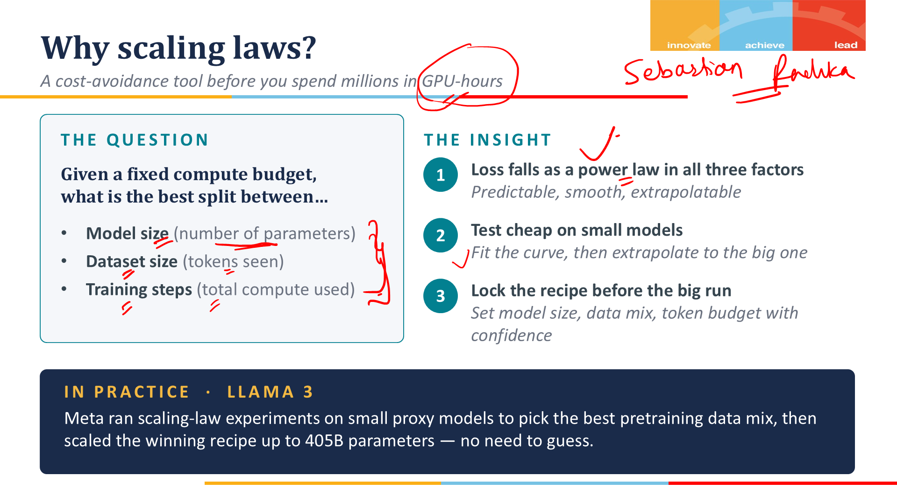

---

### 4.2 Kaplan Scaling Laws (2020)

**Intuition** — Kaplan et al. (2020) were influential because they made scaling look smooth and predictable. Their experiments suggested that performance depends strongly on overall scale and only weakly on model shape, such as depth versus width. Their practical takeaway at the time was simple: if you get more compute, put most of it into a bigger model rather than a larger dataset.

**Mechanism — the power laws themselves:**

```
L(N) = L∞ + (N_c / N)^αN        αN = 0.076, N_c = 8.8 × 10¹³
L(D) = L∞ + (D_c / D)^αD        αD = 0.095, D_c = 5.4 × 10¹³
L(C) = L∞ + (C_c / C)^αC        αC = 0.050, C_c = 3.1 × 10⁸
```

where `N` = number of non-embedding parameters, `D` = dataset size in tokens, `C` = compute budget (petaflop-days), `L∞` = the irreducible loss floor, and each `_c` constant is an empirically fitted scaling coefficient. Here `α` (alpha) is the fitted exponent governing how quickly loss changes with scale. The practical parameter-count formula Kaplan also gives, assuming attention and feedforward dimensions scale together (`d_attn = d_ff / 4 = d`):

```
N ≈ 12 · n_layer · d²
```

**Worked example — reproduce this by hand.** GPT-3 has `n_layer = 96` transformer layers and hidden dimension `d = 12,288`. Plugging in:

```
N ≈ 12 × 96 × 12,288²
  = 1,152 × 150,994,944
  ≈ 174.0 billion parameters
```

— matching GPT-3's well-known ~175B parameter count, from just two architectural numbers.

**Tradeoff / when NOT to use** — Kaplan's own conclusion ("prioritize model size over data size") is precisely what the Chinchilla paper (Section 4.3) overturned two years later: Kaplan's fitted constants were derived under specific experimental conditions (notably, without re-tuning the learning-rate schedule length to match the training duration) that turned out to systematically favor bigger models. Treat Kaplan's _scaling laws exist and are power laws_ insight as durable, but do not treat its specific recommended split (bigger model over more data) as still current practice — it isn't, and the "three eras" table in Section 4.3 shows exactly how the industry's answer changed.

---

### 4.3 Chinchilla Scaling Laws (2022) and the Three Eras of Scaling Wisdom

**Intuition** — Chinchilla changed the story. Two years after Kaplan, Hoffmann et al. showed that many large models were not simply small-data-limited or architecture-limited. They were **undertrained** relative to their size. In other words, the industry had often built models that were too big for the amount of data they saw.

_Everyday version:_ picture an exceptionally gifted student handed only a thin ten-page pamphlet to study from — no matter how brilliant they are, their exam score is capped by how little material they were given, not by their intelligence. Chinchilla's finding was that many giant models were exactly that gifted-but-underfed student: plenty of capacity, not enough data to actually use it. Giving a smaller, more modestly sized student proportionally more study material let it match or beat the underfed genius.

**Mechanism** — Where Kaplan's rule of thumb was "with a 10× compute increase, scale model size 5× and data 2×," Chinchilla found you should scale **both at the same rate**: with a 10× compute increase, increase both model size and data size by roughly 3.1×. The practical compute-optimal rule of thumb was **about 20 training tokens per parameter** under the paper's assumptions — not a universal minimum. Llama 3 8B exceeds that ratio by a wide margin (see the table below), because by the "modern" era the goal shifted again toward lower serving cost.

#### Three eras of scaling wisdom

**Landscape — three eras, compared:**

| Era            | Year  | Rule of thumb                                                                          | Exemplar   | Numbers                                                                  |
| -------------- | ----- | -------------------------------------------------------------------------------------- | ---------- | ------------------------------------------------------------------------ |
| **Kaplan**     | 2020  | Scale the model faster than the data                                                   | GPT-3      | 175B params · 300B tokens (~1.7 tokens/param)                            |
| **Chinchilla** | 2022  | ~20 tokens per parameter; existing giants were undertrained                            | Chinchilla | 70B params · 1.4T tokens (~20 tokens/param)                              |
| **Modern**     | 2024+ | Overtrain a smaller model — inference cost dominates when serving billions of requests | Llama 3 8B | 8B params · 15T tokens (~1,875 tokens/param — ~90× the Chinchilla ratio) |


| Model                    | Size             | Training tokens |
| ------------------------ | ---------------- | --------------- |
| LaMDA (Thoppilan et al., 2022) | 137B         | 168B            |
| GPT-3 (Brown et al., 2020)     | 175B         | 300B            |
| Jurassic (Lieber et al., 2021) | 178B         | 300B            |
| Gopher (Rae et al., 2021)      | 280B         | 300B            |
| MT-NLG 530B (Smith et al., 2022) | 530B      | 270B            |
| Chinchilla                 | 70B            | 1.4T            |

Chinchilla's 70B model, trained compute-optimally, beat **GPT-3 (175B)**, **Gopher (280B)**, and **MT-NLG (530B)** — three larger models that were all, by comparison, undertrained. That comparison is the whole argument for the "existing giants were undertrained" row above, made concrete.

The modern frontier logic adds another consideration: **inference cost**. Chinchilla asks for the best model under a fixed training-compute budget. But if the model will be served billions of times, then parameter count matters far beyond training day, because inference is paid again and again. That is why labs may deliberately overtrain a smaller model: they spend more once during training in order to reduce recurring serving costs when the model is used at sufficient scale.

A newer axis on top of all three: **test-time compute**. Models like o1 and DeepSeek-R1 spend additional compute _at inference_ on generated reasoning steps rather than only at training time — modern scaling-law thinking now has to account for both training-time and inference-time compute together, not training compute alone.

**Worked example** — Llama 3 8B trained on 15T tokens is **~90× the Chinchilla-recommended ratio** (20 tokens/parameter) for an 8B model — a deliberate overtraining relative to the Chinchilla compute-optimal ratio; the choice is consistent with inference-cost-aware training, but the ratio alone does not establish that inference economics was the sole justification.

**Tradeoff / when NOT to use** — Chinchilla-optimal is the right target when training compute is the dominating cost and the model won't be served at massive scale (a research model trained once, evaluated, and retired). The "modern" overtrain-a-small-model approach is only worth its extra training cost when the model will be served enough times that inference cost swamps the one-time training bill — for a model that's trained once and used lightly, chasing the modern-era ratio wastes compute for no realized benefit.

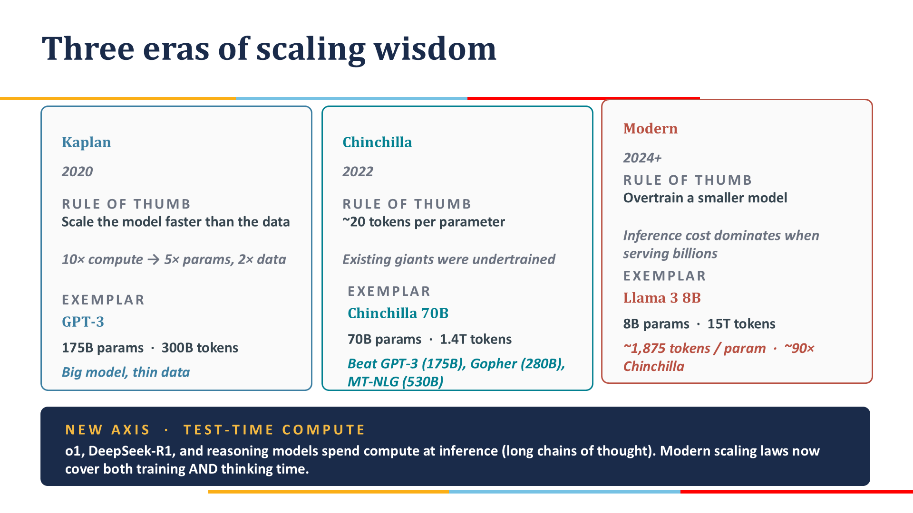

---

### 4.4 Emergent Abilities of LLMs

**Intuition** — Some capabilities don't improve gradually as models get bigger — they appear to snap into existence, seemingly out of nowhere, once a model crosses a certain scale. Whether this is a genuine property of scale or a measurement artifact is itself a live debate (Schaeffer et al., 2023).

**Mechanism** — In this literature, an ability is called emergent when it is absent in smaller models but present in larger ones. Reports sometimes describe emergence as a sharp rise above chance, but chance-level performance, sharpness, and unpredictability are additional operational criteria, not consequences of the minimal definition. The scale at which an ability appears may also be difficult to forecast by extrapolating smaller models' performance curves — unlike the smooth power-law trends often fitted in scaling-law studies.

The counter-argument (Schaeffer et al., 2023): many "emergent" abilities evaporate, or turn into smooth curves instead of sharp jumps, once they're measured with a different metric or better statistics. That suggests some apparent emergence is a **mirage created by the choice of metric**, not a fundamental property of scaling itself — an all-or-nothing exact-match score will look "sharp" even if the model's underlying probability of getting the right answer was rising smoothly all along, while a partial-credit metric on the same model can reveal that same smooth curve underneath.

**Worked example** — These are debated examples rather than three equivalent mechanisms: **in-context learning** is prompt-conditioned behavior without gradient updates; **instruction following** is usually substantially shaped by instruction tuning; and **step-by-step reasoning** may depend on chain-of-thought prompting and the evaluation metric. Treat their apparent scale thresholds as empirical claims to test, not as established emergent abilities.

**Tradeoff / when NOT to use** — treating a capability as a settled, universal "emergent ability" is risky given the Schaeffer et al. critique — before concluding a model "emergently" gained an ability at some scale, check whether the same trend holds under a different, non-binary metric. For planning purposes, don't rely on an unconfirmed emergent ability appearing at a target scale as a load-bearing assumption in a scaling plan; the Kaplan/Chinchilla power laws (concepts 10–11) are the more reliably extrapolated part of scaling behavior, while emergent-ability claims are not.

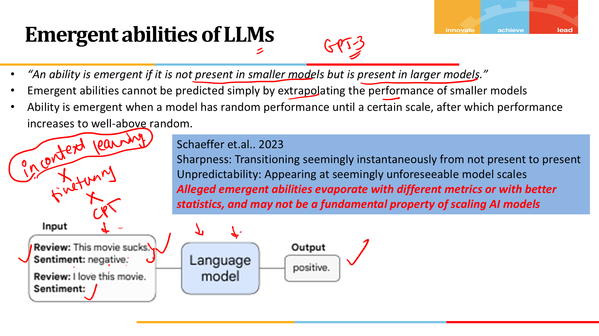

---

## Part 5 · Pretraining of popular frontier models

#### Model case studies

### 5.1 Llama 3: Three-Stage Initial Pretraining

**Intuition** — Llama 3's own published pretraining recipe is a concrete, fully worked example of nearly every concept in this session applied together: data mixture, curriculum/annealing, and scaling-law-informed sizing, executed across three distinct stages.

**Mechanism — the three stages:**

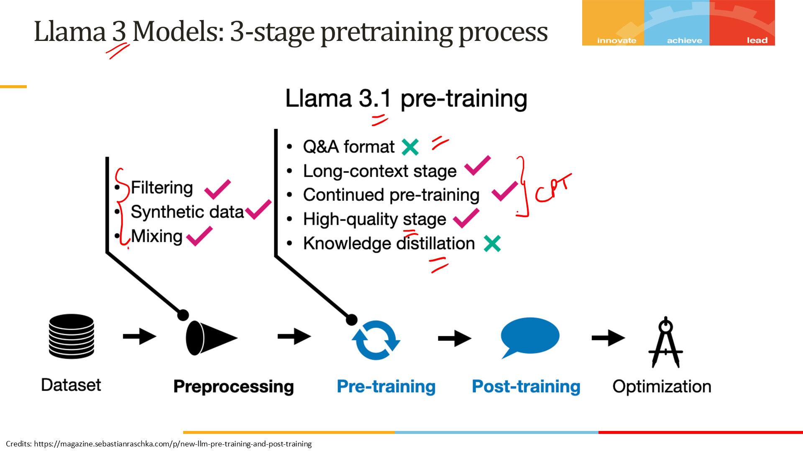

The source recipe also names filtering, synthetic data, and mixing around the pretraining stages. Its pretraining stages include a Q&A format, a long-context stage, a high-quality stage, continued pretraining, and knowledge distillation; the detailed schedule below explains the three Llama 3 stages represented in the figure.

1. **Initial pretraining — stability through gradual scaling.** The **dynamic batch size** and sequence length increase in three phases rather than jumping straight to the final configuration: phase 1 uses a 4M-token batch size at 4,096-token sequence length (prioritizing early training stability); phase 2 moves to an 8M-token batch size at 8,192-token sequence length (scaling up); phase 3 reaches a 16M-token batch size, still at 8,192-token sequence length (final throughput). Training uses the standard AdamW optimizer rather than a more aggressive alternative, again favoring stability.

   _Everyday version:_ it's the same reason a new runner builds up to a marathon with weeks of short, slow jogs before attempting the full distance, rather than sprinting 26 miles on day one and risking an injury that ends training altogether. Ramping batch size, sequence length, and context window up gradually in stages lets training find its footing at each scale before the next jump, instead of risking instability by starting at full scale immediately.
2. **Long-context pretraining.** Context length is increased gradually across **six stages**, starting from the original 8K window and ending at a final 128K-token context window, using approximately **800B** training tokens dedicated specifically to this extension.
3. **Annealing.** As covered in Section 2.1: training on a small, ultra-high-quality math-and-code subset in the final stage while decaying the learning rate toward zero — improving the 8B model measurably, with negligible effect on the 405B model.

**Worked example** — the batch-size/sequence-length numbers above _are_ the worked example: going from 4M tokens/4,096 sequence length to 16M tokens/8,192 sequence length across three phases is a 4× increase in per-step batch size, executed gradually rather than all at once specifically to avoid the training instability a single large jump would risk.

**Tradeoff / when NOT to use** — gradual scaling and a six-stage context extension add real engineering and scheduling complexity compared to simply training at the final configuration from step one; it's worth this complexity at frontier scale, where a failed or unstable training run costs enormous sums, but for a smaller research-scale pretraining run, the simpler fixed-configuration approach is often good enough and far easier to implement and debug.

#### Model-as-a-Judge for data curation (Llama 3)

See Section 2.2, `Data Preprocessing Pipeline`, for the full Llama 3 model-as-a-judge data-curation pipeline; it is the frontier-scale example of the quality-filtering step described there.

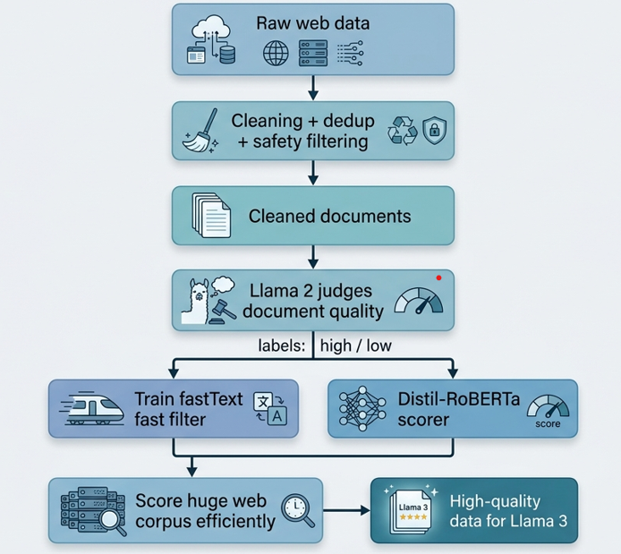

---

### 5.2 Qwen and Gemma Pretraining Strategies

**Intuition — a landscape of alternative frontier recipes.** Each makes a different tradeoff from Llama 3's.

**Mechanism — compared:**

| Model              | Key pretraining idea                         | Detail                                                                                                                                                                                                                                                                                                                                          |
| ------------------ | -------------------------------------------- | ----------------------------------------------------------------------------------------------------------------------------------------------------------------------------------------------------------------------------------------------------------------------------------------------------------------------------------------------- |
| **Qwen 2**         | Self-generated training data                 | Uses the _previous-generation_ Qwen model to synthesize additional pretraining data and includes multi-task instruction data to improve in-context learning and instruction following; trains in two stages (regular pretraining, then long-context training), growing context length from 4,096 to 32,768 tokens with high-quality lengthy data |
| **Qwen 3**         | Long-context-weighted corpus                 | Three-stage pretraining; Qwen3 doubled the corpus from Qwen2.5's 18T to **36T (36 trillion) tokens** and expanded coverage from 29 to 119 languages/dialects. Qwen2.5-VL supported high-quality PDF extraction; Qwen2.5, Qwen2.5-Math, and Qwen2.5-Coder generated synthetic textbooks, Q&A, instruction manuals, and code snippets. More than **30T (30 trillion) labeled tokens** were used for educational value, fields/domains, and safety, with filtering, data combination, and instance-level data-mixture optimization. The final high-quality long-context corpus is 75% text between 16,384–32,768 tokens and 25% text between 4,096–16,384 tokens — context length itself is a data-mixture lever, not just a training-schedule one |
| **Gemma 2**        | Knowledge distillation over scale            | Explicitly argues that small models are often _undertrained_, not under-sized; the 27B model trains from scratch, but smaller Gemma 2 models are trained via **knowledge distillation** from the larger model rather than simply scaling down the data recipe                                                                                   |
| **Gemma 4** (2026) | Multimodal, long-context, dual-track release | Released as both pretrained **base** models (massive, diverse dataset — web, code, math, images, audio — for further specialized training) and separate **instruction-tuned** models (further trained on human-annotated data to follow instructions, support multi-turn conversation and system prompts, and provide native function calling, structured JSON output, and safety filters); pretraining corpus spans 140 languages |

#### Qwen 2 pretraining

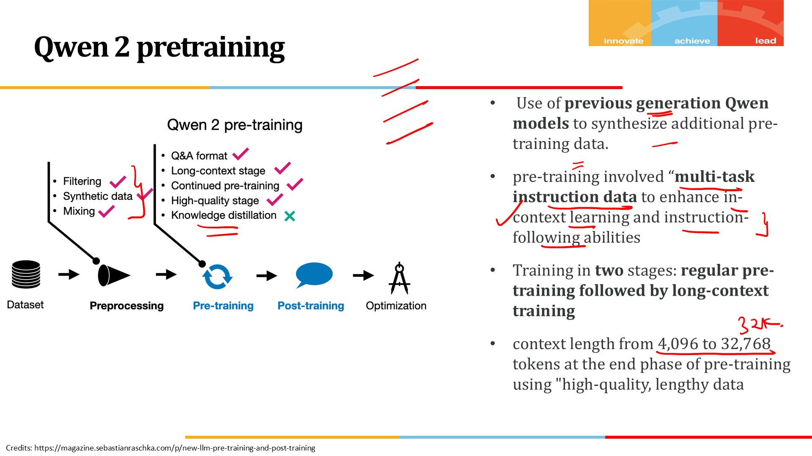

#### Qwen 3 : 3-stage pretraining process

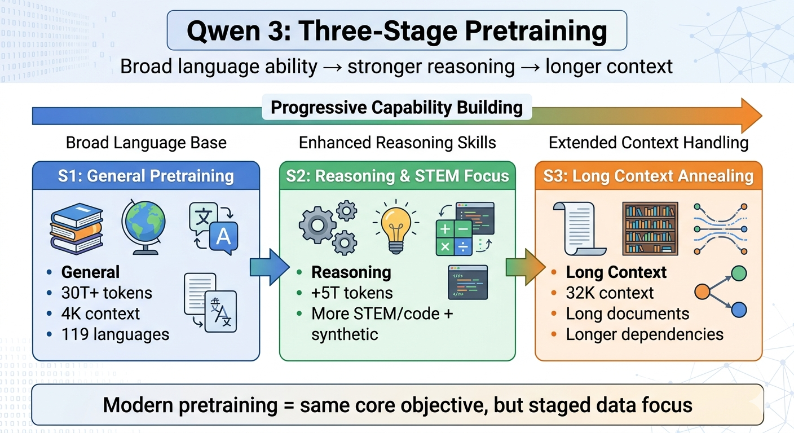

#### Qwen3 Pretraining Data

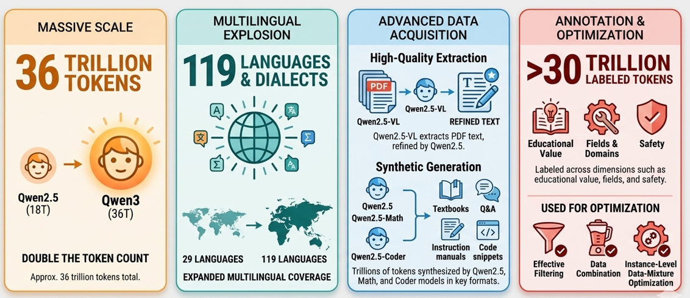

#### Gemma 2 pre training

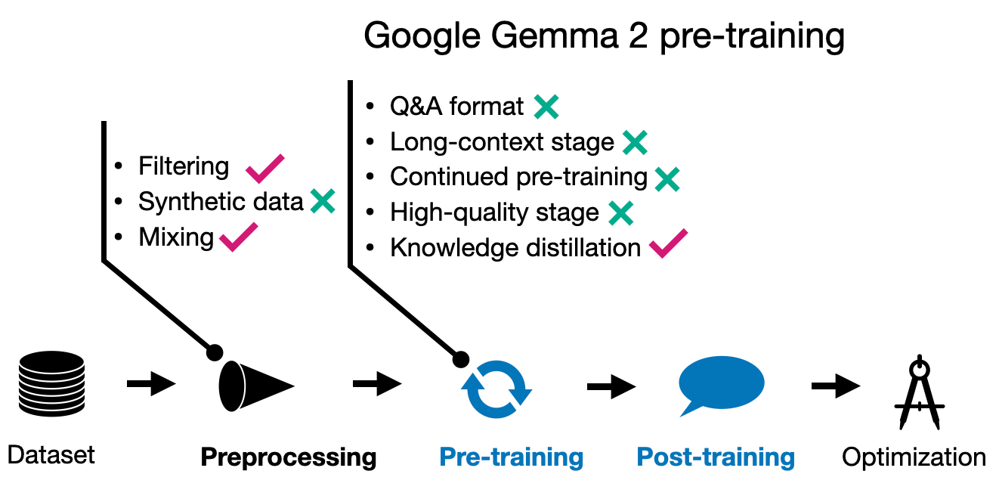

_Two of these ideas map onto familiar teaching patterns:_ Gemma 2's **knowledge distillation** is like a master teacher writing a condensed, expertly-curated study guide for a student, instead of making the student re-read every original source cover to cover — the student learns faster from the teacher's distilled understanding than from redoing all the teacher's own original studying. Qwen 2's **self-generated data**, by contrast, is closer to a retired teacher writing next year's practice exam questions purely from memory of their own teaching — useful and often good, but any blind spot the teacher personally had quietly shows up in the practice questions they hand down.

**Worked example** — Qwen 3's 75/25 split controls the distribution of context lengths; Llama 3's annealing selects a small high-quality subset late in training; and FinLLaMA's 75/25 split mixes domains during CPT. All are explicit sampling decisions, but they operate on different axes.

**Tradeoff / when NOT to use** — knowledge distillation (Gemma 2's approach for smaller variants) requires already having a larger, capable teacher model to distill from — it isn't available as a strategy for training the _first_, largest model in a family, only for producing smaller siblings afterward. Self-generated training data (Qwen 2's approach) risks a feedback loop where a model's own blind spots get reinforced in the data it generates for its successor, unless carefully filtered — a risk plain human/web-sourced text doesn't carry in the same way.

---

## Extra Slides (not for exam)

_GPT-1 and T5 are useful historical case studies—keep them as intuition builders rather than core syllabus._

### 6.1 GPT-1

**GPT-1** — the original decoder-only pretraining recipe. It introduced a two-stage workflow: unsupervised generative pretraining on a large corpus, followed by supervised fine-tuning on a task. GPT-1 uses unidirectional (causal) attention over left context. Its architecture has 12 transformer blocks, 768-dimensional hidden states, 12 heads (64 dimensions per head), a 3,072-dimensional feedforward layer, about 117 million parameters, a 40,000-token byte-pair encoding (BPE) vocabulary, and GELU activations.

#### Input and Sequence Details

Preprocessing used `ftfy` and spaCy on BooksCorpus; sequences were truncated or padded to 512 tokens.

#### Training Setup

Training used causal language modeling with cross-entropy, scaled dot-product attention, learned absolute position embeddings, Adam, 2,000-update linear warmup followed by cosine decay, 0.1 attention dropout, modified L2 regularization, batches of 64 sequences, 100 epochs, and a softmax output layer.

#### Fine tuning

For downstream **fine tuning**, GPT-1 retained the unsupervised pretraining hyperparameters, added classifier dropout of 0.1, used a learning rate of `6.25e-5` (`6.25 × 10⁻⁵`), batch size 32, **3 epochs**, linear learning-rate decay with warmup over 0.2% of the updates, and a task-loss weight `lambda = 0.5` (`λ = 0.5`). For classification, it formats each input with special tokens such as `<start>`, `<delim>`, and `<extract>`, runs the same pretrained decoder-only transformer, and feeds only the output vector at `<extract>` into a small classifier. The model learns this mapping during fine-tuning on labeled task data. The classifier can then map the output representation at `<extract>` to the label `Positive`.

#### LLM downstream tasks: GPT-1

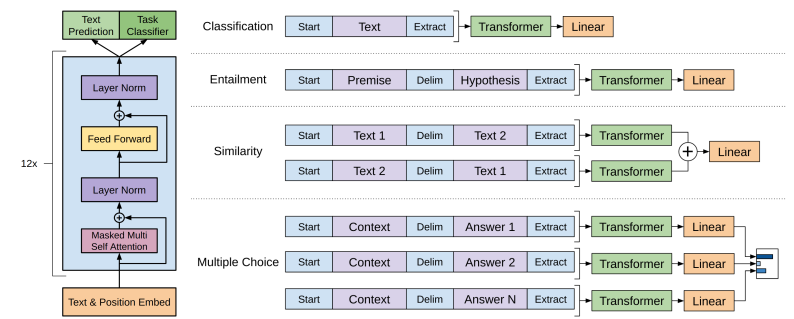

### 6.2 T5 (Text-to-Text Transfer Transformer)

#### T5 - Input-Output

**T5** (Text-to-Text Transfer Transformer; Raffel et al., 2020) is an encoder-decoder model that reformulates Natural Language Processing (NLP) tasks as text-to-text problems. A task prefix specifies the task: `translate English to German: That is good. target:` produces `Das ist gut.`, while an MNLI-formatted prompt produces one of `entailment`, `contradiction`, or `neutral`.

#### T5 Attention – Prefix LM

**Architecture and objective.** The encoder uses bidirectional self-attention; the decoder uses causal self-attention plus cross-attention to encoder outputs. T5 removes LayerNorm bias and places layer normalization outside the residual path. The same encoder-decoder model and maximum-likelihood objective are reused across tasks, with the task prefix and target format changing; teacher forcing is used during pretraining and fine-tuning.

**Data and evaluation.** The baseline uses two BERT-base-sized stacks, C4 with English-only filtering via `langdetect`, learned relative position embeddings based on key-query offsets, and a shared 32,000-wordpiece SentencePiece vocabulary. Pretraining uses English text; fine-tuning samples English, German, French, and Romanian at a 10:1:1:1 ratio. Evaluation covers GLUE/SuperGLUE classification, CNN/Daily Mail summarization, SQuAD question answering, and WMT translation. For MNLI, the labels are emitted through the decoder output rather than a separate BERT-style classification head. A task-specific (text) prefix—here, a task-specific prefix—is added to specify the task, and the Prefix LM discussion distinguishes fully-visible attention from causal masking.

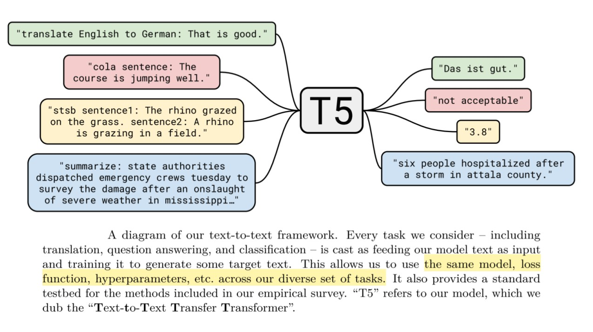

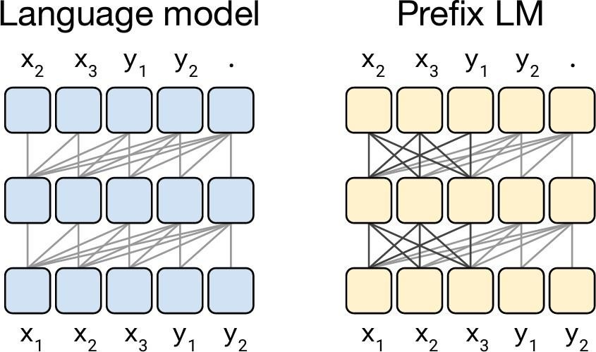

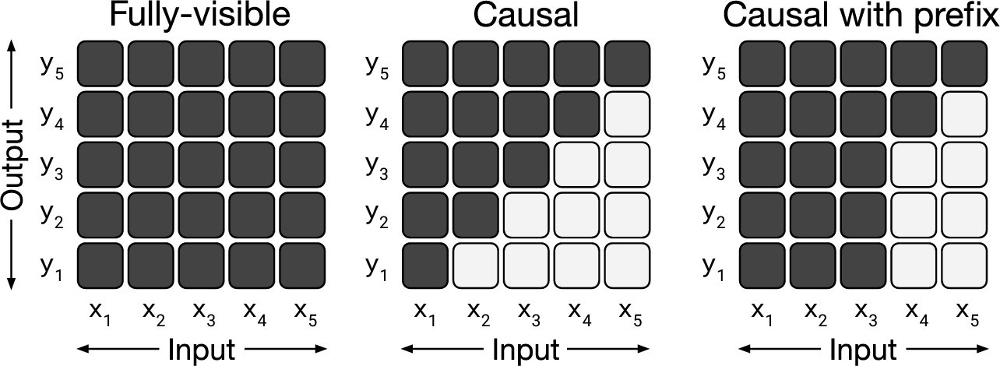

#### T5 - Vocabulary


|                          | GPT-1                                             | T5                                                      |
| ------------------------ | ------------------------------------------------- | ------------------------------------------------------- |
| Architecture             | Decoder-only                                      | Encoder-decoder                                         |
| Parameters               | ~117 million                                      | Baseline size: two stacks of BERT-base                  |
| Objective                | Causal language modeling                          | Text-to-text (every task, same objective)               |
| Pretraining data         | BooksCorpus (~7,000 books, ~800M words)           | C4 — 750 GB, English-only                               |
| Attention pattern        | Pure causal                                       | Encoder-decoder: bidirectional encoder self-attention; causal decoder self-attention plus cross-attention |
| Position encoding        | Learned absolute                                  | Learned relative (query-key offset)                     |
| Vocabulary               | 40,000 tokens (BPE)                               | 32,000 wordpieces (SentencePiece, shared input/output)  |
| Downstream task handling | `<extract>`-token vector -> linear classifier     | Task prefix in the input text itself, output is text    |

#### T5 - Baseline (Pre-training details)

The T5 baseline pretraining setup uses two BERT-base-sized stacks with about **220 million parameters**, batch size 128 sequences, sequence length 512, an inverse-square-root learning-rate schedule with `k = 10⁴` warm-up steps, AdaFactor, dropout 0.1, and greedy decoding at test time. Its pretraining budget is `2¹⁹` steps × `2¹⁶` tokens per step = `2³⁵` tokens (about 34B), much smaller than BERT's 137B and RoBERTa's 2.2T tokens.

#### T5 - Baseline (Fine-tuning Details)

The T5 baseline fine-tuning setup uses batch size 128, sequence length 512, a constant learning rate of `0.001`, and 5,000 steps per checkpoint. Its fine-tuning budget notation is `2¹⁸` steps × `2¹⁶` tokens per step = `2³⁴` tokens in total.

---

## Self-study / Lab / Build

Lab 2 ("Build end-to-end training and fine-tuning pipelines," module M2–M5) is the natural place to reproduce this session's central worked example: the cross-entropy loss calculation in Section 1.3, `LLM training`, extended into a full `train_model_simple()`-style loop — forward pass, loss, backward pass, optimizer step, periodic train/val loss logging — run against a corpus small enough to watch it overfit on purpose (matching the training log in Section 3.2, `Catastrophic Forgetting`: training loss falling smoothly while validation loss flattens then rises). Reproducing that overfitting curve by hand, once, is worth more than reading about catastrophic forgetting in the abstract.

---

_Exam: this session is in scope for the **closed-book mid-sem** (sessions 1–8). Full evaluation, weights, dates, and course logistics are documented in [`536-master.md`](../536-master.md) and are not repeated in each session note._
