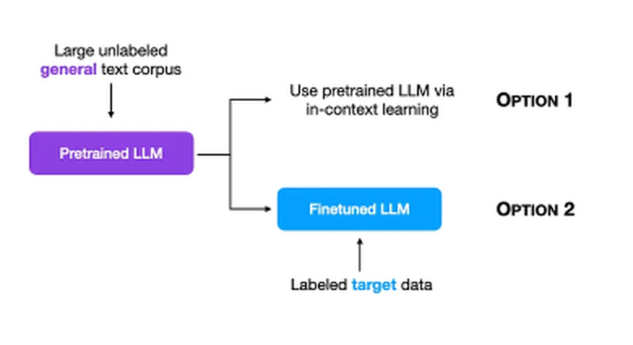
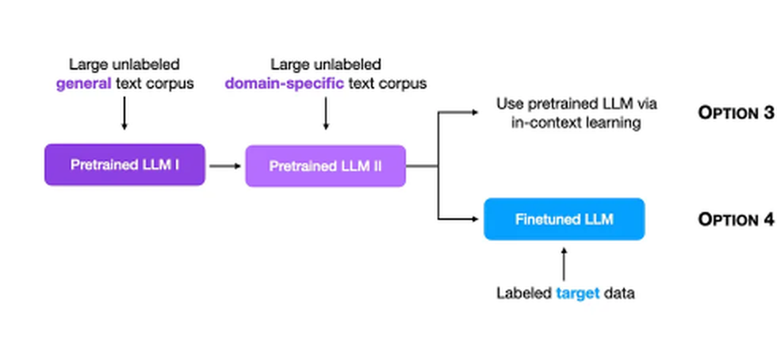
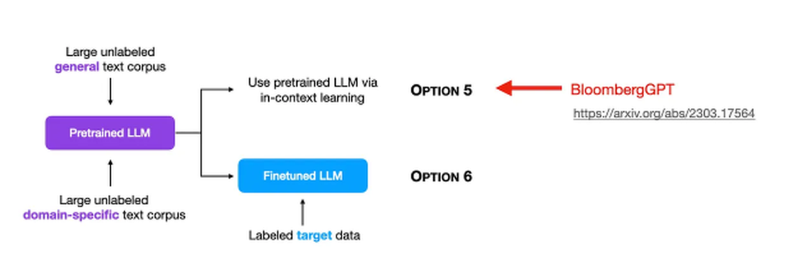

# Large Language Models for Generative AI · Session 02 · LLM Pre-Training

_Deck instructor credit: Dr. Monali Mavani · Course: AIML ZG536_
_Learned 2 Aug 2026_

> **Scope note.** This note covers LLM pretraining, pretraining objectives, pretraining data, continued pretraining (CPT), domain adaptation, scaling laws, and frontier-model training recipes. Figures and explanatory diagrams are labeled by purpose where relevant.

## Why this matters

Pretraining is where an LLM acquires its broad initial capabilities. Fine-tuning and alignment build on representations learned during pretraining, while prompting relies on the model’s learned language patterns. This session explains how that happens: what objective the model is trained on, what kind of data pipeline feeds it, and how scaling laws guide decisions about model size and token count. These concepts make frontier-model reports easier to read as engineering tradeoffs.

**Running example:** The adaptation section compares four distinct paths: regular pretraining from scratch; continued pretraining (CPT) on top of an existing checkpoint; retraining from scratch on a combined dataset; and domain-specific pretraining from scratch. The FinLLaMA/BloombergGPT case study makes two of those paths concrete.

---

## Part 1 · LLM Pre-training

_Pretraining is the foundational stage of a language model’s development. The model processes vast amounts of text and repeatedly predicts the next token in a sequence. It starts with nearly random guesses and gradually improves by adjusting its parameters across billions of training tokens. Over time, it learns statistical patterns in language, including syntax, factual associations, and relationships between concepts. The rest of this note explains where the learning signal comes from, what data feeds it, and how scaling laws guide decisions about model size and corpus size._


### Self-Supervised Learning

**Intuition** — An LLM's raw capability does not come from people hand-labeling millions of examples. It comes from repeatedly asking the model to predict either a masked token or the next token in a sequence. The text itself provides the answer key. That is why the process is called **self-supervised**: the supervision is already hidden inside the data. These training problems are also called **pretext tasks**.


At a high level, the development pipeline has three stages: **Stage 1** builds a large language model, **Stage 2** produces a foundation model, and **Stage 3** fine-tunes downstream models. This section focuses on the self-supervised signal used during the first of those stages. Later instruction-tuning and alignment details belong to the broader development pipeline described below, not to the definition of self-supervised learning.

_Everyday version:_ it's like a student practicing with flashcards where the answer is printed on the back of the very same card — no teacher needs to grade anything, because the material itself already contains the answer key. Cover the next word, guess it, flip and check, repeat millions of times. That is the entire supervision signal in pretraining: the text supplies both the question and the answer, so nobody has to hand-label a thing.

**Worked example — make the target from the text itself.** Given the token sequence `The cat sat`, a next-token task uses `The cat` as input and `sat` as the target. No human needs to label the pair: the next token is already present in the original text. The numeric cross-entropy calculation under **LLM training** shows how that target receives its loss.

**Tradeoff / when NOT to use** — self-supervised pretraining from scratch is usually justified only when you have web-scale unlabeled text and need a general-purpose base model. If you have a narrow task and a modest labeled dataset, do not pretrain a new model; fine-tune an existing pretrained model or add retrieval. Reproducing a GPT-3-scale pretraining run for one narrow classification task incurs the cost of pretraining without needing the generality it provides.

---

### Pre-training Objectives

**Intuition** — The training objective matters because it shapes what the model is directly optimized to do. If trained to predict the next token, a model is directly optimized for left-to-right continuation. If trained to reconstruct masked tokens from both sides, it learns bidirectional contextual representations that are often useful for classification; neither objective alone guarantees “understanding.”

**Mechanism** — The training data supplies the target, and the objective defines which part of the surrounding context the model may use to predict it. Causal language modeling (**CLM**) predicts the next token from the left context; masked language modeling (**MLM**) reconstructs a hidden token using both sides; T5-style span denoising reconstructs missing spans with an encoder–decoder.

| Objective                              | Model family / example                                      | Attention pattern and typical use |
| -------------------------------------- | ----------------------------------------------------------- | ---------------------------------- |
| CLM / next-token prediction            | GPT-4 and other decoder-only GPT/Llama models; Claude's architecture is not publicly specified | Left-to-right causal attention; free-form generation |
| MLM / masked-token prediction          | BERT — encoder-only                                        | Bidirectional attention; representations and classification after fine-tuning |
| Denoising span-mask prediction         | T5 — encoder-decoder                                       | Corrupt spans are reconstructed using encoder context and an autoregressive decoder |

CLM is the objective behind the decoder-only LLMs used throughout this subject. MLM is the classic BERT-style objective, while T5 uses an encoder-decoder denoising objective that reconstructs masked spans. The important distinction is what each objective trains the model to do: CLM trains left-to-right next-token prediction, whereas MLM trains bidirectional contextual representations by reconstructing masked tokens; the latter is commonly adapted to classification rather than native free-form generation, and span denoising trains an encoder-decoder model to reconstruct missing text.

_Everyday version:_ CLM is like reading a mystery novel one page at a time and guessing what happens next using only what you've read so far — you're never allowed to peek ahead. MLM is like being handed a page with a few words blacked out and figuring out each one using both the sentence before it and the sentence after it, the way you'd solve a crossword clue. The first habit builds someone who's good at continuing a story; the second builds someone who's good at understanding a passage once it's all laid out in front of them.

**Worked example — compare the visible context.** For the sequence `The bank approved the loan`, CLM creates targets such as `bank`, `approved`, `the`, and `loan` while hiding each target from the model's right-hand context. MLM might replace the middle word with `[MASK]` and ask an encoder to recover `approved` using both the preceding and following words. The numeric cross-entropy calculation under **LLM training** shows how one CLM prediction receives its loss.

**Tradeoff / when NOT to use** — During training, a CLM uses a causal mask but can evaluate all positions in parallel; during inference, it generates autoregressively because each next-token distribution depends on previously generated tokens. An MLM uses bidirectional context and therefore does not natively generate free-form continuations; classification can attach a task-specific head to the encoder representation, while generation requires an autoregressive decoder or another autoregressive output mechanism.


---

### LLM training

**Intuition** — Training only works if the model gets a score telling it how wrong it was. In language modeling, that score comes from a simple idea: after the model predicts a probability distribution over the vocabulary, check how much probability it gave to the token that really came next. If that probability was low, the model should be penalized. If it was high, the penalty should be small. Cross-entropy is that penalty. Perplexity is the same story rewritten in a more human-readable scale.


**Mechanism** — For `T` next-token prediction positions, at position `t` the model receives the prefix through `wₜ`, outputs a distribution `ŷₜ` over the vocabulary, and is evaluated against target `w_{t+1}`, for `t = 1,…,T`. Since the true next token is a single token (one-hot), the general cross-entropy formula collapses to the negative log-probability of just that one correct token:

```
L_CE (T next-token targets) = (1/T) · Σ_{t=1..T}  −log ŷₜ[w_{t+1}]
```

Why this particular penalty, rather than something simpler like scoring raw accuracy (did the top prediction match)? Accuracy is not differentiable — it gives zero gradient almost everywhere, so there's no signal telling the optimizer which direction to nudge each weight. Squared error between the predicted distribution and a one-hot target is differentiable, but its gradient goes flat once the predicted probability is near either extreme, so it stops correcting a confidently-wrong prediction fast. Negative log-probability avoids both problems: for positive softmax probabilities it is smooth; its derivative with respect to the correct probability is `−1/p`, so assigning a tiny probability receives a large penalty, while its derivative with respect to a softmax logit is `p − y`. It is also the negative log-likelihood objective.

_Everyday version:_ think of a weather forecaster who says "10% chance of rain" and it pours that day. Cross-entropy fines them hard for that — they were confident and wrong. If instead they'd said "40% chance of rain," the same rainy outcome earns a much smaller fine, because they'd hedged more. Just tracking whether the forecaster's top guess ("rain" vs "no rain") was right or wrong would treat both cases the same and never teach them to be appropriately less confident — cross-entropy is the scoring rule that specifically punishes confident wrongness, which is exactly the behavior you want to train out of the model.

Training uses **teacher forcing**: at every position, the model is shown the true previous tokens, not its own guesses from earlier positions. This avoids feeding an early sampled error into later inputs during training; using model-generated history instead creates an exposure mismatch between training and inference.

Perplexity is `exp(L_CE)` when cross-entropy uses natural logarithms: it is the geometric mean of the inverse probability assigned to the observed tokens, not literally the number of choices considered. Lower is better. One caveat matters a lot in practice: perplexity is **tokenizer-dependent**. If two models use different tokenizers, their perplexity numbers are not directly comparable because the unit "token" is not the same.

**Worked example — reproduce this by hand.** Two 3-token sequences pass through a model that has _not yet been trained_:

- `"every effort moves"` → target `"effort moves you"`
- `"I really like"` → target `"really like chocolate"`

The model assigns these probabilities to the _correct_ target token at each of the 6 positions across both sequences:

| Sequence | Position | Probability assigned to the correct token | log(probability) |
| -------- | -------- | ----------------------------------------- | ---------------- |
| 1        | 1        | 2.3466 × 10⁻⁵                             | −10.6600         |
| 1        | 2        | 2.0531 × 10⁻⁵                             | −10.7936         |
| 1        | 3        | 1.1733 × 10⁻⁵                             | −11.3531         |
| 2        | 1        | 4.2794 × 10⁻⁵                             | −10.0591         |
| 2        | 2        | 1.6248 × 10⁻⁵                             | −11.0275         |
| 2        | 3        | 1.1586 × 10⁻⁵                             | −11.3657         |

Average log-probability = −10.8765. **Cross-entropy loss = −(−10.8765) = 10.8765.**

Every probability here is tiny (~10⁻⁵, roughly 1-in-100,000) because the untrained model is guessing almost uniformly across its ~50,000-token vocabulary — it hasn't yet learned to favor the correct token. That's what a loss around 10–11 nats means in plain terms. As training proceeds, this number falls; a well-trained small model on a narrow corpus can reach a loss under 1.0.

**Tradeoff / when NOT to use** — cross-entropy on held-out text is useful for comparing models when tokenization, evaluation data, and aggregation conventions are aligned; differing tokenizers make raw perplexity incomparable, while train/evaluation overlap makes the score an unreliable estimate of generalization. See the MMLU discussion above. Cross-entropy also does not directly measure whether generated text is _correct_, only whether it was _likely_ under the model's training distribution — a fluent, confident, wrong answer can still carry a good loss.

#### Modern LLM development and training pipeline

**Intuition** — A useful way to understand model development is to follow one piece of raw text until it becomes part of a deployable system. At each stage, the material is cleaned, the model learns from it, its behavior is shaped, and the resulting model is made cheaper to run.


This diagram shows the LLM development pipeline from raw data to a model prepared for use. Read it from left to right. The five blocks are stages in one workflow, not five different model architectures.

**Mechanism** — each block changes either the training material, the model's learned behavior, or the cost of using the finished model. The output of one block becomes the input to the next.

**1. Dataset — the starting material**

A dataset is a large collection of material such as books, websites, articles, code, conversations, and documents. The quality and diversity of this material strongly influence what the final model can learn. Raw data may contain duplicates, noise, harmful content, or irrelevant material, so it cannot normally be used directly.

**2. Preprocessing — prepare the training corpus**

Before training, the raw dataset is cleaned and organized:

- **Filtering:** remove or down-weight low-quality, harmful, duplicated, or irrelevant content.
- **Synthetic data:** add generated examples when they are useful and appropriately checked.
- **Mixing:** combine web text, code, Q&A, academic content, books, and other sources in selected proportions.

**Goal:** produce a training-ready corpus. Preprocessing is data engineering; the model has not learned its capabilities yet.

**3. Pretraining — learn broad language patterns**

The model is trained on the prepared corpus, usually with self-supervised **next-token prediction**. It learns statistical patterns, facts represented in the data, coding patterns, and other broad capabilities. The diagram lists several possible parts of a modern pretraining recipe:

- **Q&A format:** represent some data as questions and answers. This can help question-answering behavior, but Q&A formatting alone does not create instruction following; instruction following is mainly developed during post-training.
- **Long-context stage:** train with longer sequences so the model can process longer documents or conversations.
- **Continued pretraining:** continue next-token training from an existing checkpoint, often to adapt it to a domain or new data.
- **High-quality stage:** use a carefully curated subset, sometimes late in training, to refine the model.
- **Knowledge distillation:** train one model to reproduce useful behavior from a stronger teacher model. This is optional and can be used at different points in a model-development recipe.

**Result:** a base model with broad language capabilities. These listed items are recipe choices, not mandatory steps for every LLM.

**4. Post-training — shape useful behavior**

Post-training starts from the pretrained base model and uses narrower instruction or preference data to make its responses more useful, safe, and consistent:

- **Supervised fine-tuning (SFT):** train on human-written or curated instruction–response examples.
- **Reinforcement learning from human feedback (RLHF):** use human preferences or rankings to improve response behavior.
- **Direct preference optimization (DPO):** learn directly from preferred and rejected responses without the same separate reinforcement-learning procedure used in a traditional RLHF pipeline.
- **Online/offline methods:** use either fixed preference data (**offline**) or newly collected/on-policy feedback (**online**). Online does not necessarily mean that the model is updated continuously.
- **Knowledge distillation:** optionally transfer useful behavior from a larger teacher to a smaller model.

**Result:** an instruction-following or aligned model, rather than only a general text predictor. Post-training builds on pretraining; it does not replace it.

**5. Optimization — prepare for efficient use**

The final block is labelled **Optimization**. In practice, this may include:

- quantization to reduce model size and memory use;
- pruning or sparsity methods to reduce computation;
- faster inference and batching;
- memory optimization;
- hardware-specific tuning for GPUs, TPUs, or NPUs.

These are common examples, not techniques specified by the diagram. The goal is to make the model cheaper, faster, and easier to serve.

**Worked example** — A support chatbot may begin with a mixed corpus of product manuals, conversations, and code. Filtering and mixing prepare that corpus, pretraining teaches general language patterns, SFT teaches the desired response format, and quantization reduces the memory needed to serve the resulting model.

**Tradeoff / when NOT to use** — the full pipeline is appropriate when building a reusable model, but it is unnecessary for a narrow application that can use an existing base model plus retrieval or a small fine-tuning run. Each additional stage adds data, compute, evaluation, and failure modes.

**Exam-friendly summary**

```text
Dataset
  ↓
Preprocessing
  • Filtering
  • Synthetic data
  • Data mixing
  ↓
Pretraining
  • Next-token prediction
  • Q&A-formatted data
  • Long-context stage
  • Continued pretraining
  • High-quality-data stage
  • Optional knowledge distillation
  ↓
Post-training
  • SFT
  • RLHF
  • DPO
  • Online/offline preference methods
  • Optional knowledge distillation
  ↓
Optimization
  • Quantization
  • Pruning/sparsity
  • Inference and hardware optimization
```

**One-line memory trick:**

> **Collect Data → Clean Data → Learn Language → Align Behavior → Optimize Deployment**

The key distinction is that **pretraining teaches broad patterns**, while **post-training shapes how the model responds to people**. The arrows represent increasing data and model readiness: raw material → clean corpus → base model → aligned model → deployable system.

#### Modern pre-training


**Intuition** — Modern pretraining keeps the familiar next-token learning signal but improves the material and schedule around it. The practical question is not whether the objective disappeared; it is how a richer recipe changes what the model can learn.

**Mechanism** — broaden and curate the data, optionally integrate other modalities, vary the training stages, and apply post-training after the core pretraining phase. These additions change the training inputs or later behavior while the core pretraining objective remains next-token prediction.

**Central idea:** modern pretraining does not replace the core objective. The model still learns primarily by predicting the next token. What has become richer is the **data**, the **training stages**, and the use of **post-training** after the core pretraining phase.

**Traditional pretraining vs modern pretraining**

| Aspect | Traditional pretraining | Modern pretraining |
| --- | --- | --- |
| Data | Mostly text-only data | Rich, diverse, multilingual, balanced, and sometimes multimodal data |
| Data pipeline | Relatively simpler | More curation, synthetic-data generation, data mixing, and multimodal integration |
| Core objective | Next-token prediction | Still mainly next-token prediction |
| Training recipe | Often treated as one broad training phase | May use staged training for general knowledge, reasoning, and long context |
| After pretraining | Separate fine-tuning may follow | Instruction tuning and preference alignment usually follow as post-training |

**What the modern-pretraining side adds**

1. **Rich and diverse input data** — combine text from multiple languages and domains with better curation and more balanced sampling. Depending on the model, the data may also include code, images, audio, or other modalities.
2. **Synthetic data generation** — create additional training material with another model or a specialized data-generation process. Synthetic data must still be checked for quality, factual errors, and repeated model biases.
3. **Multimodal integration** — train the system to connect text with other modalities, such as an image and its description. The exact architecture and objective vary by model; the diagram's point is that modern training is no longer restricted to text-only input.
4. **Staged training** — the diagram illustrates a possible sequence:
   - **General knowledge:** learn broad language and world-knowledge patterns.
   - **Reasoning:** emphasize data or procedures intended to improve multi-step problem solving.
   - **Long context:** train on longer sequences so the model can use more of a document or conversation at once.

These stages are an illustrative modern recipe, not a universal schedule. Some models combine stages, repeat them, or use different names and ordering.

**Where post-training fits**

The diagram places **instruction tuning** and **preference alignment** after the core pretraining objective. This distinction is important:

- **Pretraining** builds broad representations and capabilities from large-scale data, usually through next-token prediction.
- **Post-training** uses instruction examples and preference signals to make the model follow requests, produce preferred formats, and behave more helpfully and safely.

Therefore, instruction tuning is not the same as the core pretraining objective, even though instruction-formatted data may sometimes be included in a pretraining mixture. The diagram's lower message is the key exam point: **post-training usually happens after pretraining, not inside the core next-token-prediction objective.**

**Worked example** — A general model can first learn language from books and web text, then receive instruction pairs such as “summarize this report” → “summary.” The first stage builds broad language capability; the second shapes how the model responds to requests.

**Tradeoff / when NOT to use** — richer data and staged training can improve capability, but they increase curation and scheduling complexity. For a small domain model, a carefully selected single-stage corpus may be more practical than reproducing a frontier-style multi-stage recipe.

**Exam-friendly summary**

```text
Traditional: mostly text-only data → next-token prediction

Modern: richer and more diverse data
        → synthetic-data generation and multimodal integration
        → staged training: general knowledge → reasoning → long context
        → post-training: instruction tuning → preference alignment

Core objective throughout pretraining: next-token prediction
```

**One-line memory trick:**

> **Same objective, richer recipe: diverse data → staged training → post-training.**

> **_In practice_** _— how this appears in production._ Real pretraining runs choose a configured sequence length and process fixed-length sequences; short documents may be packed into one sequence with end-of-text separators. Context-window sizes are model- and version-specific, so comparisons should identify the exact model variant. The batch size for gradient descent is large — the biggest GPT-3 model trained with a batch size of **3.2 million tokens** at once, not 3.2 million _examples_.

> **_Going deeper_** _— evaluating beyond loss._ Public benchmarks like **MMLU** (Massive Multitask Language Understanding, 15,908 questions across 57 subject areas) test task performance directly rather than raw next-token loss. Their real weakness is **data contamination**: since LLMs train on scraped web text and MMLU itself is on the web, a model may have seen benchmark questions during pretraining, inflating its score. Published mitigations are reporting train/test overlap directly or holding out contamination-checked splits — a genuine problem that remains unresolved in general for any benchmark built from public text.

---

## Part 2 · Pre-training Data

_The first part explained how the model learns; this part explains what it learns from. The focus shifts from objective functions to data engineering: which corpora are used, how they are mixed, and how raw scraped text gets cleaned before it ever reaches the model._

### Data Mixture

**Intuition** — What a model reads during pretraining shapes almost everything it can do later. So "just scrape the web" is not a real recipe. The hard part is deciding what kinds of text deserve more weight, what should be filtered out, and whether the model should see all categories in the same proportion from start to finish.

**Mechanism** — A data mixture has a global composition for the whole run and may also have local compositions that change from one training stage to another. The mixture is a sampling policy: it determines which kinds of examples contribute more often to the training signal.


**Two levels of data mixture**

- **Global level:** the distribution of the entire pretraining dataset.
- **Local level:** the proportions can be varied at different training stages.

**Llama 3** is a concrete example. Its knowledge cutoff was the end of 2023, and it downsampled data categories that were over-represented on the public web — for example, **arts and entertainment** — rather than allowing web frequency alone to determine the mixture.

The detailed corpus statistics are tabulated in **Commonly Used Corpora for Pretraining** below. Keeping that table in its own section avoids mixing the mixture proportions with a separate corpus catalogue whose releases and units may differ.

Data mixture operates at two levels. First, there is the **global mix**: how much of the whole training run comes from web text, books, code, academic text, and so on. Second, there is the **local mix**: whether those proportions change at different stages of training.

_Everyday version:_ a chef doesn't dump a dish together using whatever is most abundant in the pantry. They deliberately measure out more of what actually improves the dish and less of what's simply plentiful, even holding back an ingredient they have a huge supply of if it doesn't earn its place. Data mixture is the same deliberate measuring, applied to a training corpus instead of a pantry.

**Worked example** — In a deliberately simplified mixture, a 100-token batch might contain 60 tokens of general web text, 25 tokens of code, and 15 tokens of medical text. A later stage could change those proportions to emphasize code or medical text. The numbers are illustrative; the point is that sampling proportions are chosen rather than inherited blindly from web frequency.

**Tradeoff / when NOT to use** — a carefully tuned mixture can improve balance and specialization, but it requires reliable category labels and monitoring. If the categories are noisy or the run is small, start with a simpler mixture and tune it only after measuring a real capability gap.

#### Data Curriculum

**Intuition** — Two runs can use the same overall mixture yet produce different learning behavior if the examples arrive in a different order. Curriculum is about controlling that sequence, not merely changing the final percentages.

**Mechanism** — schedule which categories or difficulty levels are sampled at each stage, then measure whether the staged order improves the target capability. A curriculum can be simple progression, repeated phases, or late-stage annealing.

**Data curriculum** is the ordering version of the same idea. Instead of asking only "how much of each kind of data?", it asks "in what order should the model see it?" A simple curriculum may start with easy, general examples and progressively introduce more challenging or specialized ones. **Data annealing** is a late-stage curriculum choice in which training shifts toward a selected, often higher-quality subset rather than keeping the earlier mixture unchanged.


**Llama 3** illustrates the result of **data annealing**: it improved the performance of a pretrained **Llama 3 8B** model, while improvements on the **405B** model were negligible. This is a concrete example of one curriculum/annealing choice; it does not establish that curriculum benefits always shrink with model size.

_Everyday version:_ a curriculum is like teaching from broad fundamentals first and introducing specialized, difficult exercises later. The learner sees a deliberate progression instead of receiving every type of example in a random order.

**Worked example** — If **Stage 1** gives more weight to one data source, **Stage 2** changes the proportions, and later stages continue shifting the mix toward other sources, the model sees a deliberate data schedule rather than a random order. The diagram illustrates this progression through intermediate stages up to **Stage n**; it does not prescribe particular topics for any stage.

**Tradeoff / when NOT to use** — aggressive downsampling or curriculum ordering adds real engineering complexity: you need per-category quality scores, staged schedules, and monitoring for regressions. For a small-scale or research pretraining run without the infrastructure to track category-level provenance, a simpler uniform-sampling approach is a defensible starting point — curriculum tuning is where you spend engineering effort _after_ the basics work, not before.

#### Commonly Used Corpora for Pretraining

| Corpus | Size | Source | Latest update |
| --- | --- | --- | --- |
| BookCorpus | 5 GB | Books | Dec-2015 |
| Gutenberg | — | Books | Dec-2021 |
| C4 | 800 GB | CommonCrawl | Apr-2019 |
| CC-Stories-R | 31 GB | CommonCrawl | Sep-2019 |
| CC-NEWS | 78 GB | CommonCrawl | Feb-2019 |
| REALNews | 120 GB | CommonCrawl | Apr-2019 |
| OpenWebText | 38 GB | Reddit links | Mar-2023 |
| Pushshift.io | 2 TB | Reddit links | Mar-2023 |
| Wikipedia | 21 GB | Wikipedia | Mar-2023 |
| BigQuery | — | Codes | Mar-2023 |
| The Pile | 800 GB | Other | Dec-2020 |
| ROOTS | 1.6 TB | Other | Jun-2022 |

Dataset sizes can differ across releases and may be reported in tokens, bytes, or different filtered versions; do not assume that two entries with the same name refer to exactly the same release.

> **_Going deeper_** _— the ethics and legality of web-scraped pretraining data, a live and unresolved area._ Copyright/fair-use status of training on scraped text is legally ambiguous; a rising share of sites now opt out via `robots.txt` or Terms of Service, with unclear retroactive legal status for data already scraped; private information (phone numbers, emails) leaks through despite filtering; and pretraining corpora skew geographically and demographically toward authors in the United States and other developed countries, which shapes what "default" model behavior looks like globally. None of this is a solved problem — it's an active area of law and policy, not a settled engineering answer.

---

### Data Preprocessing Pipeline

**Intuition** — Raw web text is messy. It contains duplicates, boilerplate, bad OCR, spam, private information, broken formatting, and many short fragments that would waste training compute if used as-is. So before the text reaches the model, it has to go through a preprocessing pipeline.


**Mechanism** — the pipeline turns an untrusted raw corpus into token sequences that can be sampled during training. Filtering and de-duplication address quality and repetition; privacy reduction addresses sensitive content; tokenization turns the retained text into model inputs.

**Overview flow**

1. **Raw corpus** — collect the material to be prepared.
2. **Filtering and selection** — identify text worth retaining.
3. **De-duplication** — remove repeated or near-duplicate content.
4. **Privacy reduction** — detect and remove personally identifiable information (PII).
5. **Tokenization** — convert text into token IDs using a tokenizer such as SentencePiece or byte-level BPE.
6. **Ready to pretrain** — store the prepared token sequences for model training.

The processing flow places filtering before de-duplication. The explanatory sequence expands **Data Filtering and Selection** and then presents **Data Packing** as a separate efficiency technique. Thus, processing order and teaching order are related but not identical.

**Worked example** — A scraped support corpus might start with 1,000 pages, lose 120 pages with broken markup, lose 180 exact or near duplicates, and lose 70 pages containing unresolved private information. The remaining 630 pages are tokenized and stored for training. The counts are illustrative; the important idea is that every stage changes the material available to the model.

**Tradeoff / when NOT to use** — preprocessing improves data quality and reduces wasted compute, but every filter can remove useful variation or encode a policy choice. For a small, trusted corpus, keep the pipeline simple and inspect samples rather than adding expensive model-based filters automatically.

#### De-duplication

**Intuition** — If the same article appears thousands of times, repeating it does not give the model thousands of independent lessons. It consumes compute, increases memorization risk, and can make the corpus look more representative than it really is.

Low-quality sentences that contain repeated words and phrases can be removed. Word and n-gram (contiguous sequence of `n` tokens) overlap between documents can also flag near-duplicates. This reduces wasted compute and helps with dataset contamination, although separate train/evaluation decontamination is still needed to address benchmark leakage.

**Worked example** — If three scraped pages contain the same product manual, exact matching can keep one copy. If two pages share most of their long n-grams but differ in formatting, near-duplicate detection can flag them for review.

**Tradeoff / when NOT to use** — aggressive deduplication saves compute but may remove legitimate repeated explanations, common phrases, or different versions of a document. Use stricter thresholds only when repetition is demonstrably distorting the corpus.

#### Data Filtering and Selection

**Intuition** — Filtering is the corpus equivalent of quality control: before expensive training, remove material that is harmful, unusable, redundant, or badly formatted. The difficulty is that “low quality” is not a perfectly objective label.

Two broad approaches are useful:

1. **Classifier- and heuristic-based selection**
   - **Binary classifier training:** train a classifier using well-curated positive data.
   - **Language filtering:** remove text not written in the target language.
   - **Metric filtering:** remove unnatural sentences, for example using perplexity.
   - **Statistic filtering:** remove low-quality data using sentence length or punctuation distributions.
   - **Keyword filtering:** remove noisy elements such as HTML, boilerplate, or offensive words.
2. **LLM-based selection**
   - Employ language models, especially relatively small models, for data selection.
   - **Perplexity:** compute perplexity to measure how well text matches the reference model's distribution.
   - **Prompting:** directly prompt an LLM to gauge data importance.

LLM-based selection can be computationally intensive at large scale. For perplexity filtering, a pipeline may retain a middle band: high-perplexity text is often noisy or broken, while very-low-perplexity text can be boilerplate or duplicated templates. The thresholds are corpus- and model-dependent, not universal constants.

Safety filtering is a common additional policy stage. It can remove some clearly harmful content, but it is not perfectly clean or neutral and may reflect the biases of the classifier doing the filtering.


**Worked example** — A filtering pipeline might first reject pages with broken markup, then remove exact duplicates, then score the remaining text for language and quality, and finally retain a sample for human or model review. Each filter removes a different kind of problem; no single score is a complete quality judgment.

The concrete Llama 3 model-based curation pipeline is described later under **Model-as-a-Judge for data curation**. It combines heuristic filters, semantic deduplication, and learned quality scoring rather than relying on any single filter.

**Tradeoff / when NOT to use** — perplexity filtering and quality classifiers reduce noise but are themselves imperfect models trained on someone's notion of "quality." Over-aggressive filtering can systematically remove dialects, informal registers, or minority viewpoints that a narrow reference model scores as low-quality text. This is the same class of problem as safety-filter bias.

#### Data Packing

**Intuition** — A batch is a fixed-width container. If each document is short, padding the unused space wastes computation; packing fills that space with other documents while preserving boundaries.

**Mechanism** — **Packing** combines several short documents into one training window, separated by an end-of-text token, so compute is not wasted on padding. It is an efficiency operation rather than simply another quality filter.

**Worked example** — With a context length of 8, documents of lengths 3, 2, and 3 can be packed as `A A A <eos> B B <eos> C C C <eos>` rather than padded into three separate eight-token windows. The end-of-text markers tell the model where one document ends.

**Tradeoff / when NOT to use** — packing is unsafe if the attention mask or loss mask allows tokens from one document to leak into another, or if boundary tokens are omitted. Do not enable it until the implementation has tests proving document isolation.


_Everyday version:_ think of prepping a big batch of meals for the week. Deduplication is tossing out two of the three identical bags of the same vegetable that you accidentally bought. Quality filtering is checking each item and setting aside anything spoiled or unusable before it goes anywhere near the pan. Packing is fitting several smaller, unrelated leftovers efficiently into one container with explicit boundaries; the boundaries mark where each item ends but do not by themselves prevent interaction between neighboring items.

**Worked example — packing, concretely.** Four unrelated text snippets — one about a sports team, one a fairy tale, one financial news, one a personal story — are concatenated into a single training sequence as: `[sports text] <|endoftext|> [fairy tale] <|endoftext|> [financial news] <|endoftext|> [personal story]`. The boundary token marks document ends so the model can distinguish one document from the next; by itself, however, it does not prevent cross-document conditioning. It also serves as a general sequence-termination token, not only as a packing marker. An implementation may use attention masks or loss masks when strict document isolation is required.

**Tradeoff** — packing usually improves utilization by avoiding padding, but it is not literally free: a single training sequence can contain multiple unrelated documents, so a model must learn to use the end-of-text boundary correctly and not be misled by adjacency, or it risks bleeding context across unrelated packed documents.

---

## Part 3 · Continuous Pre training (CPT) and Domain Adaptation

_This part asks a practical question that comes up in real organizations: once you already have a good pretrained model, how should you adapt it to your own domain? The answer is not always "train from scratch again."_

### Continued Pretraining (CPT)

**Intuition** — Once you have a pretrained model, there are several ways to adapt it to a new domain. They are not small variations of the same choice. They trade off cost, speed, and how much of the original broad capability survives.

**Mechanism — the three adaptation paths.** Let `D1` denote the original/general corpus and `D2` the new domain corpus:

| Path | What happens | Cost | Keeps general knowledge? |
| --- | --- | --- | --- |
| **Regular pretraining** | Initialize random weights and pretrain on dataset `D1`. | Full pretraining cost | N/A — this _is_ the general model |
| **Continued pretraining (CPT)** | Take the pretrained model from `D1` and further pretrain it on dataset `D2`. | Much cheaper than starting from scratch | Partially — at risk of catastrophic forgetting (see **Catastrophic Forgetting**) |
| **Retraining on the combined dataset** | Initialize random weights again and train on the union `D1 ∪ D2`. | As expensive as regular pretraining | Yes, by construction — but you pay the full cost again |


CPT is the practical middle path in many real systems: much cheaper than full retraining, but still capable of picking up domain knowledge. The price is forgetting risk, which is why the next concept matters.

_Everyday version:_ CPT is like giving a fluent, well-read adult specialist training: the existing general foundation is retained while updates on domain text add specialization, although those updates can interfere with earlier capabilities.

**Worked example — compare old and new-domain scores.** Suppose a general model scores 82% on a general-language test and 55% on a medical terminology test. After CPT on medical text, it might reach 72% on the medical test but fall to 68% on the general test. Replaying some general data could produce 69% on the medical test and 76% on the general test. These numbers are illustrative; the decision requires measuring both capabilities. **BloombergGPT and FinLLaMA** provide the session's concrete model comparison: FinLLaMA uses CPT, while BloombergGPT is trained from scratch on a mixed finance-and-general corpus.

**Tradeoff / when NOT to use** — retraining on the combined dataset is generally safer against forgetting but removes the cost advantage CPT provides. Domain-specific pretraining from scratch appears under **Domain Adaptation** because it is a separate adaptation route, not one of the three methods compared here.

---

### Catastrophic Forgetting

**Intuition** — In sequential learning across diverse datasets or tasks over time, you want an already-capable model to learn new information without destroying what it already knew. That balance is hard. The same updates that help it specialize can also overwrite older knowledge. That failure mode is called **catastrophic forgetting**.

_Everyday version:_ think of cramming hard for a French exam the night before — by morning your French is sharp, but you notice you've become shaky on Spanish vocabulary you knew solidly last month. Your brain didn't have a way to protect the old memory while intensively building the new one, so the new learning partly overwrote it. That's catastrophic forgetting: a model aggressively learning a new domain can overwrite the general knowledge it already had, unless something specifically protects it.

**Mechanism — five mitigations, each attacking the problem differently:**

| Mitigation | How it helps |
| --- | --- |
| **Lower learning rate** | Smaller weight updates disturb existing weights less, so old knowledge is less likely to be overwritten in any single step |
| **Learning-rate (LR) warmup** | Gradually ramp the learning rate up at the start of CPT rather than jumping straight to its target value |
| **Data mixing / replay** | Blend a small percentage of the _original_ pretraining data back into CPT batches, so the model keeps seeing old-domain examples while learning the new domain |
| **EWC** (Elastic Weight Consolidation) | Add a penalty term that selectively slows learning on weights identified as critical to the old task |
| **LoRA / parameter-efficient fine-tuning (PEFT)** | Freeze the base model and train only small adapter parameters; this preserves the base checkpoint, although the active adapter can still change task behavior |

**Worked example** — Evaluate a general model on both a general-language set and a medical set before CPT. After CPT, an improved medical score paired with a sharply lower general score is evidence of forgetting; replay can be tested as a mitigation by comparing the same two scores after mixing general data back in.

**Tradeoff / when NOT to use** — protecting old capability is not free: replay consumes data and compute, lower learning rates slow specialization, and adapters limit which base parameters can change. Choose the lightest mitigation that preserves the capabilities the application actually needs.

#### LR warmup

Continued pretraining specifically uses the **exact same learning-rate schedule used during the initial pretraining stage**.


_Technical caveat:_ other implementations may adapt the schedule, but that is not what this slide states.

_Two of these are easiest to picture directly:_ **EWC** is like assigning a high cost to changing important whiteboard regions rather than literally preventing changes; **LoRA/PEFT** is like adding a separate layer of notes while leaving the original textbook weights frozen.

**Additional context — overfitting is different from catastrophic forgetting.** Raschka's own small-scale pretraining run makes overfitting visible even without CPT: training a tiny GPT-style model for 10 epochs on a small corpus shows training loss falling smoothly from 9.78 (epoch 1) to 0.39 (epoch 10), while _validation_ loss falls only until around epoch 8, then rises back up to 6.45 by epoch 10. Roughly 7–8% of the model's generated text at that point turns out to be **verbatim copied** from the tiny training set — the model has started overfitting so hard it is reciting training examples rather than generalizing. This is related to, but distinct from, catastrophic forgetting: overfitting memorizes the current training set, whereas catastrophic forgetting loses previously learned knowledge during later updates.

---

### Domain Adaptation

**Intuition — what is domain adaptation?** Domain adaptation means taking a general-purpose LLM and making it perform better in a specific domain such as healthcare, finance, law, insurance, or software engineering. The goal is to transfer the model's broad language knowledge to a specialized area.

#### Why is domain adaptation needed?

A general LLM is trained on broad internet data. When asked domain-specific questions, it may:

- miss specialized terminology;
- lack important domain knowledge;
- produce less accurate answers; or
- fail to follow domain-specific conventions.

The difference is easier to see in examples:

| General-purpose LLM | Domain-adapted LLM |
| --- | --- |
| Knows general health topics | Understands medical terminology and clinical notes |
| Knows programming basics | Understands a company's codebase and engineering practices |
| Knows general finance concepts | Understands financial reports and regulations |

Domain adaptation therefore does not necessarily mean building a new model from zero. It means choosing an adaptation route that adds domain capability while preserving as much useful general capability as possible.

**Mechanism** — choose where the domain data enters the workflow: start with a general model and prompt or fine-tune it, continue pretraining an existing checkpoint, or train a new model on domain data. In each route, in-context learning changes the prompt while fine-tuning changes parameters with labeled examples.

**Worked example** — A general model that explains “heart failure” in broad terms may still mishandle a hospital's abbreviations and documentation style. Domain adaptation chooses a route that adds the hospital's terminology and conventions while checking that general-language performance remains acceptable.

**Tradeoff / when NOT to use** — adaptation can improve domain accuracy but may cost compute, labeled data, or general capability. If the information changes frequently or is mainly retrieval-friendly, retrieval over trusted documents may be safer than changing model weights.

#### Domain-adaptation paths

There are three routes, each with two downstream options.

**Intuition** — The routes differ mainly in where the starting knowledge comes from and who pays the training cost. The correct choice depends on checkpoint availability, domain-data scale, privacy, and the required degree of specialization.

**Worked example** — For a small private glossary, prompting may be enough; for a large stable medical corpus, CPT may be justified; for a domain with no suitable general checkpoint, training from scratch is the remaining route.

**Tradeoff / when NOT to use** — do not choose a from-scratch route merely because it is conceptually clean. Prefer prompting, retrieval, or CPT when an adequate checkpoint exists and the full pretraining cost is not justified.

##### Regular pretraining from scratch



**What and why.** Regular pretraining initializes a general-purpose model from random weights. It is the route to choose when no suitable checkpoint exists and you can afford the full data and compute cost.

**Mechanism and tradeoff.** Train the model on a large unlabeled corpus, then choose between:

- **Option 1 — in-context learning:** use the pretrained LLM through a prompt without changing its weights.
- **Option 2 — fine-tuning:** update the model using labeled target data.

##### Continued pretraining (CPT)



**What and why.** CPT starts with an existing general model and continues its language-model training on domain text. It is useful when the checkpoint already has valuable broad capability and the goal is cheaper specialization.

**Mechanism and tradeoff.** Continue the pretrained LLM on a large domain-specific corpus, then choose between; monitor general-domain evaluation because the updates can cause forgetting:

- **Option 3 — in-context learning:** use the continued-pretraining model through a prompt without changing its weights.
- **Option 4 — fine-tuning:** update the model using labeled target data.

##### Domain-specific pretraining from scratch



**What and why.** Domain-specific pretraining from scratch builds a new model around a narrow corpus. It is appropriate only when the domain data, vocabulary, privacy boundary, or architecture needs justify paying the full training cost.

**Mechanism and tradeoff.** Initialize a new model and train it on a domain-specific corpus, then choose between:

- **Option 5 — in-context learning:** use the domain-specific model through a prompt without changing its weights.
- **Option 6 — fine-tuning:** update the model using labeled target data.

The important distinction is that in-context learning changes the prompt without updating weights, whereas fine-tuning updates the model using labeled target data.

#### BloombergGPT and FinLLaMA

| | FinLLaMA | BloombergGPT |
| --- | --- | --- |
| **Approach** | Continued pretraining (CPT) | Trained from scratch on a mixed corpus |
| **Base** | Meta Llama 3 (8B), inheriting general pretrained capabilities | No pretrained base — built from scratch |
| **Parameters** | 8B | 50B |
| **Training data** | 52B financial tokens mixed with 18B general-domain tokens (roughly 75/25) | 363B finance tokens plus 345B general tokens |
| **Forgetting mitigation** | The 18B general tokens provide replay to help preserve Llama 3's original capability | Not applicable in the same sense: general knowledge was built from the start |
| **Sizing rationale** | Inherited from Llama 3's design | Adopted Chinchilla scaling laws; 50B was considered suitable for the available finance-data volume |

**Worked example** — FinLLaMA's 75/25 financial-to-general token ratio is a direct numerical example of data mixing/replay: roughly one in four training tokens is deliberately not finance-specific, helping preserve general capability while the model specializes.

**Tradeoff / when NOT to use** — FinLLaMA's CPT approach is far cheaper because it starts from an 8B checkpoint, but it retains that architecture and capacity. BloombergGPT's from-scratch approach is more expensive but allows model size and data mixture to be selected for the domain.

---

## Part 4 · Pretraining of popular frontier models

### Model case studies

_This section collects concrete frontier-model recipes in the order used for this session._

### Llama 3 Models: 3-stage pretraining process

**Intuition** — Llama 3's published recipe is a concrete frontier-scale example of how preprocessing, pretraining, post-training, and optimization can appear in one model-development pipeline.

The published recipe includes filtering, synthetic data, a Q&A format, a long-context stage, a high-quality stage, continued pretraining, and knowledge distillation. These are components of one recipe, not a universal mandatory sequence for every LLM.

**Mechanism** — the recipe changes the data and training configuration in stages: remove poor data, add useful generated examples, train on longer sequences, refine on high-quality data, and optionally transfer behavior from a stronger teacher. Each choice targets a different bottleneck.

**Worked example** — A model may first learn broad language patterns, then receive longer documents so it can connect distant parts of a report, and finally see a carefully selected math-and-code subset. The sequence is an illustration of the roles of the stages, not a claim that every model needs all of them.

**Tradeoff / when NOT to use** — a staged frontier recipe can improve capability but increases data curation, scheduling, and evaluation cost. A small project should not copy the full recipe unless measurements show that the added stage solves a real limitation.


### Llama 3 Models: 3-stage pretraining process — schedule details

**Intuition** — A large training run can become unstable or wasteful if every setting is pushed to its final value immediately. The schedule increases batch size and context length gradually so the training system can scale while monitoring behavior.

**Mechanism** — change one or more training settings across phases, measure stability and throughput, then continue with the next configuration. The exact schedule below is a recipe-specific example.

The detailed schedule increases configuration gradually rather than jumping directly to the final setup:

1. **Initial pretraining** — dynamic batch size and sequence length increase across three phases: 4M tokens at 4,096-token sequences; 8M tokens at 8,192-token sequences; then 16M tokens at 8,192-token sequences. The recipe uses AdamW.
2. **Long-context pretraining** — context length grows across six stages from 8K to 128K tokens, using approximately 800B tokens for the extension.
3. **Annealing** — the final stage uses a small, ultra-high-quality math-and-code subset while decaying the learning rate toward zero.

The reported annealing dataset contains **40B tokens**, described as **0.02%** of the total dataset and used to assess data quality. The actual annealing used **40M tokens**, or **0.1%** of that annealing dataset. These percentages use different denominators; retain the token counts without inferring a different total-dataset ratio.

_The recipe's gradual increases are a frontier-scale engineering choice, not a requirement that every model use these exact batch sizes or context stages._

**Worked example** — The per-step batch size increases from 4M to 16M tokens, a 4× increase executed in phases to reduce instability risk.

**Tradeoff / when NOT to use** — gradual scaling and six-stage context extension add scheduling and engineering complexity. They are easier to justify for a very expensive frontier run than for a small research run.

### Model-as-a-Judge for data curation (Llama 3)

**Intuition** — At web scale, humans cannot inspect every document. A model-as-a-judge pipeline uses automated reviewers to estimate whether a document is useful, while still requiring sampling and bias checks.

**Mechanism** — Llama 3's pipeline combines heuristic filters, semantic deduplication, and learned quality classifiers. It uses fastText for an early pass, RoBERTa-family classifiers with supervision generated by Llama 2, and DistilRoBERTa for efficient document scoring.

**Worked example** — A document can first pass a language or format filter, then receive a quality score, then be compared with other documents for semantic duplication. A human audit sample can test whether high-scoring documents are actually useful.

**Tradeoff / when NOT to use** — automated judging is cheaper than full human review but can reproduce the reference models' biases and consumes compute. For a small corpus, direct inspection may be more reliable than building a model-based curation pipeline.


### Qwen 2 pretraining

**Intuition** — A model can improve not only by collecting more raw text but also by generating targeted practice data and extending the length of documents it can process.

**Mechanism** — Qwen 2 uses the previous-generation Qwen model to synthesize additional pretraining data and includes multi-task instruction data. Its two-stage recipe consists of regular pretraining followed by long-context training, growing context length from 4,096 to 32,768 tokens with high-quality lengthy data.

**Worked example** — A long technical report that exceeds a 4,096-token window may be truncated by the first stage but fit within the 32,768-token window after long-context training. The model-generated examples can add targeted practice, but they must be quality-checked.

**Tradeoff / when NOT to use** — synthetic data and long-context training add generation, filtering, memory, and compute cost. Do not add them merely because they are available; use them when evaluation shows a data or context-length limitation.


### Qwen 3: 3-stage pretraining process

**Intuition** — Qwen 3 separates broad language learning, reasoning/STEM emphasis, and long-context learning so that each stage can emphasize a different capability.

**Mechanism** — Qwen 3 uses a three-stage pretraining process:

1. **General pretraining** — broad language ability with **30T+ tokens**, a **4K context**, and **119 languages**.
2. **Reasoning and STEM focus** — reasoning data with **5T+ tokens**, more STEM/code data, and synthetic data.
3. **Long-context annealing** — a **32K context**, long documents, and longer dependencies.

The high-quality long-context corpus is **75%** text between 16,384 and 32,768 tokens and **25%** text between 4,096 and 16,384 tokens.

**Worked example** — In a simplified 100-document batch following that long-context mixture, 75 documents would be in the longer range and 25 in the shorter range. The actual corpus is measured in tokens, not documents; this example only clarifies the proportion.

**Tradeoff / when NOT to use** — emphasizing long documents may improve long-range tasks but can reduce exposure to short, ordinary interactions and increases memory cost. Choose the mixture from the target workload rather than treating 75/25 as universal.

The process diagram is kept separate from the following data-acquisition and labeling section.


### Qwen 3 pretraining data

**Intuition** — The data-acquisition section asks where the training material comes from and how a model family expands its coverage, rather than describing the order of training stages.

**Mechanism** — Qwen 3 doubled Qwen 2.5's corpus from 18T to **36T (36 trillion) tokens** and expanded coverage from 29 to **119 languages/dialects**. Qwen2.5-VL supported high-quality PDF extraction; Qwen2.5, Qwen2.5-Math, and Qwen2.5-Coder generated synthetic textbooks, Q&A, instruction manuals, and code snippets.

More than **30T (30 trillion) labeled tokens** were used for educational value, fields/domains, and safety, with filtering, data combination, and instance-level data-mixture optimization. Context length is therefore also a data-mixture lever, not only a training-schedule setting.

**Worked example** — If a corpus contains both general web documents and extracted textbooks, instance-level mixture optimization can assign them different sampling weights after quality and safety labels are available. The exact weights are recipe-specific.

**Tradeoff / when NOT to use** — broader languages and synthetic sources increase coverage but also increase filtering and evaluation burden. Do not assume that more labeled tokens automatically improve every language or task.


### Gemma 2 pretraining

**Intuition** — A smaller model can be weak because it has seen too little useful training or because it lacks capacity. Gemma 2 presents knowledge distillation as a way to transfer behavior from a larger teacher instead of only increasing the smaller model's data.

**Mechanism** — The 27B model trains from scratch, while smaller Gemma 2 models use **knowledge distillation**: a student model is trained to reproduce useful outputs or behavior from a larger teacher.

**Worked example** — A large teacher produces probability scores for the next token; the smaller student is trained to match those scores in addition to learning from ordinary targets. The student can absorb information that a hard target alone would not show.

**Tradeoff / when NOT to use** — distillation requires a capable teacher and extra generation or scoring work. It cannot replace the initial training of the largest teacher, and it may transfer the teacher's mistakes or biases.


### Gemma 4

**Intuition** — A model family can expose a general base model for further adaptation and a separate instruction-tuned model for direct assistant behavior. Multimodality adds images and audio to the text-and-code training problem.

**Mechanism** — Gemma 4 is a multimodal, long-context, dual-track release. Its pretrained **base** models use web, code, math, images, and audio for further specialized training. Its **instruction-tuned** models are trained further on human-annotated data for instructions, multi-turn conversation, system prompts, function calling, structured JSON output, and safety filters. The pretraining corpus spans **140 languages**.

**Worked example** — The same family can provide a base model for a developer to adapt to a private document task and an instruction-tuned model for a chatbot that must return structured JSON. The choice changes who supplies the final task behavior: the developer or the published instruction-tuning recipe.

**Tradeoff / when NOT to use** — multimodal and long-context capability increase data, memory, and evaluation requirements. Choose a simpler text-only or shorter-context model when the application does not need those inputs.

### Cross-model comparison (synthesis)

**Intuition** — These case studies are not competing recipes with one universally best winner. They show different answers to four design questions: where the starting checkpoint comes from, how data is generated and filtered, how training is staged, and what deployment capability is required.

**Mechanism** — compare each model family along those axes, then connect the choice to a workload. For example, distillation transfers behavior from a teacher, while staged training changes the data or context schedule over time.

| Model | Key pretraining idea | Detail |
| --- | --- | --- |
| **Llama 3** | Staged frontier pretraining and data curation | Three-stage schedule, long-context extension, annealing, filtering, synthetic data, and model-as-a-judge curation |
| **Qwen 2** | Self-generated training data and long-context training | Previous-generation Qwen data synthesis; 4,096 → 32,768 context growth |
| **Qwen 3** | Long-context-weighted corpus and instance-level mixture optimization | Three-stage process, 36T tokens, 119 languages/dialects, labeled data, and 75/25 long-context mixture |
| **Gemma 2** | Knowledge distillation over scale | 27B model from scratch; smaller variants distilled from the larger model |
| **Gemma 4** | Multimodal, long-context, dual-track release | Base and instruction-tuned models, native tool/structured-output features, 140 languages |

_Two ideas map onto familiar teaching patterns:_ Gemma 2's **knowledge distillation** is like a master teacher writing a condensed study guide, while Qwen 2's **self-generated data** is like a teacher writing practice questions from their own memory. The second approach can reproduce the teacher's blind spots unless carefully filtered.

**Worked example** — Qwen 3's 75/25 split controls context-length distribution; Llama 3's annealing selects a small high-quality subset late in training; FinLLaMA's 75/25 split mixes finance and general-domain tokens during CPT. These are explicit sampling decisions on different axes.

**Tradeoff / when NOT to use** — knowledge distillation requires a capable teacher and is not a way to train the first largest model in a family. Self-generated data can reinforce a model's blind spots unless quality-controlled.

---


## Part 5 · Scaling Laws

_This part answers the planning question. If pretraining is expensive, how do labs decide how large the model should be and how many tokens it should see? Scaling laws are the attempt to answer that before spending the full compute budget._

### Why Scaling Laws?

**Intuition** — Pretraining at frontier scale is too expensive for guesswork. You cannot casually try five different 400B-scale runs and keep the best one. Scaling laws exist because labs need a way to use smaller experiments to predict what larger runs are likely to do.

**Mechanism** — With a fixed compute budget, the design question is how to choose **model size** (`N`) and **dataset size** (`D`) together with the number of **training steps**; total training compute is represented by `C`. The core empirical observation is that loss often follows an approximate power-law trend as these quantities grow within the tested regime. That makes extrapolation possible, but not guaranteed: run smaller proxy experiments, fit the curve, then choose the large-run recipe before paying for the full run.

_Everyday version:_ it is like a bakery testing a recipe in a handful of small batches before committing an entire warehouse of flour and sugar to it. Scaling laws let a lab test how a recipe behaves at small scale before committing the full compute budget.

**Worked example** — Meta ran scaling-law experiments on small proxy models to choose Llama 3's pretraining data mix, then scaled the winning recipe up to 405 billion parameters.

**Reproducible toy exercise** — Train two small proxy models with the same optimizer and data, for example a 100M-parameter model and a 200M-parameter model. If the larger proxy reaches lower held-out loss at the same token budget, repeat the comparison with a second data budget and record `(N, D, C, loss)` for each run. Fit or plot the trend before choosing a larger configuration. These numbers and the exercise are illustrative; they do not reproduce Meta's experiment.

**Tradeoff / when NOT to use** — extrapolation assumes the small-scale trend continues to the target scale, which is not guaranteed. It is most useful when the planned run is genuinely large and expensive; for a small experiment, direct comparison of a few configurations may be simpler.


---

### Three Eras of Scaling Wisdom

**Intuition** — The recommended balance between model size, training data, and compute changed as researchers understood training better. These are three historical rules of thumb, not one timeless rule.

**Mechanism** — compare the same compute budget using the ratio of training tokens to parameters, then account for deployment economics. Kaplan favored spending compute on a larger model, Chinchilla emphasized enough data for each parameter, and modern recipes may overtrain a smaller model when inference cost dominates.

**Landscape — three eras, compared:**

| Era | Year | Rule of thumb | Exemplar | Numbers |
| --- | --- | --- | --- | --- |
| **Kaplan** | 2020 | Scale the model faster than the data | GPT-3 | 175B parameters · 300B tokens (~1.7 tokens/parameter) |
| **Chinchilla** | 2022 | About 20 tokens per parameter; existing giants were undertrained | Chinchilla | 70B parameters · 1.4T tokens (~20 tokens/parameter) |
| **Modern** | 2024+ | Overtrain a smaller model when inference cost dominates | Llama 3 8B | 8B parameters · 15T tokens (~1,875 tokens/parameter) |

The comparison shows why the rule changed. Kaplan emphasized using additional compute for a larger model. Chinchilla showed that many large models were **undertrained** relative to their size and that model size and data should grow together under its compute-optimal assumptions. Modern frontier recipes may deliberately train a smaller model on far more data because a model served billions of times incurs recurring inference cost.

The comparison also gives examples of earlier models:

| Model | Size | Training tokens |
| --- | --- | --- |
| LaMDA (Thoppilan et al., 2022) | 137B | 168B |
| GPT-3 (Brown et al., 2020) | 175B | 300B |
| Jurassic (Lieber et al., 2021) | 178B | 300B |
| Gopher (Rae et al., 2021) | 280B | 300B |
| MT-NLG 530B (Smith et al., 2022) | 530B | 270B |
| Chinchilla | 70B | 1.4T |

Chinchilla's 70B model, trained compute-optimally, beat GPT-3 (175B), Gopher (280B), and MT-NLG (530B), illustrating the cost of undertraining a very large model.

A newer axis is **test-time compute**. Models such as o1 and DeepSeek-R1 spend additional compute at inference on generated reasoning steps. Modern scaling discussions therefore consider both training-time and inference-time compute.

**Worked example** — Llama 3 8B trained on 15T tokens is roughly 90 times the Chinchilla-recommended ratio of 20 tokens per parameter for an 8B model. That is consistent with deliberate overtraining, but the ratio alone does not prove that inference economics was the sole reason.

**Tradeoff / when NOT to use** — Chinchilla-style compute optimality is appropriate when training compute dominates. Overtraining a smaller model is attractive only when repeated serving makes inference cost important; for a model trained once and used lightly, the extra training data may not pay back.


_The detailed Kaplan equations and parameter-count derivation are intentionally routed to **Kaplan scaling-law details**, and the detailed Chinchilla law is routed to **Chinchilla-law details** so that the main scaling discussion stays focused on the three-era comparison and emergent abilities._

---

### Emergent Abilities of LLMs

**Intuition** — Some capabilities appear to improve sharply once a model crosses a certain scale instead of following an obviously smooth curve. Whether this is a genuine property of scale or a measurement artifact is an active debate.

**Mechanism.** In this literature, an ability is called emergent when it is absent in smaller models but present in larger ones. Sharpness, chance-level performance, and difficulty of prediction are additional empirical claims, not consequences of the minimal definition. The Schaeffer et al. critique argues that some apparent emergence becomes a smooth curve when measured with a different metric or better statistics.


**Examples.** Three commonly discussed examples are:

1. **In-context learning** — the model adapts its behavior from examples in the prompt without gradient updates.
2. **Instruction following** — behavior usually substantially shaped by instruction tuning rather than pretraining alone.
3. **Step-by-step reasoning** — may depend on prompting, generated intermediate steps, and the evaluation metric.

These are debated examples rather than three identical mechanisms. Treat an apparent scale threshold as an empirical claim to test, not as a guaranteed capability that will appear at a particular parameter count.

**Worked example** — An exact-match benchmark can make a smooth improvement look like a sudden jump, while a partial-credit metric may reveal the underlying gradual improvement.

**Tradeoff / when NOT to use** — do not make an unconfirmed emergent ability a load-bearing assumption in a scaling plan. Check whether the effect survives alternative metrics and statistical analyses.

---

## Extra Slides (not for exam)

_These slides are historical and supplementary. Their order is preserved separately from the examinable sequence: divider → Kaplan/Chinchilla details → GPT-1 → T5._

### Kaplan scaling-law details

**Intuition** — Kaplan scaling laws describe how loss tends to change as a model receives more parameters, data, or compute. They are useful for planning, not guarantees about an unseen training regime.

**Mechanism** — fit an empirical power law to smaller experiments, then use the fitted exponent to estimate the effect of increasing one variable while holding the others in the tested regime.

Kaplan et al. (2020) reported approximate power laws for loss as model size, dataset size, and compute increase:

```
L(N) = L∞ + (N_c / N)^αN        αN = 0.076, N_c = 8.8 × 10¹³
L(D) = L∞ + (D_c / D)^αD        αD = 0.095, D_c = 5.4 × 10¹³
L(C) = L∞ + (C_c / C)^αC        αC = 0.050, C_c = 3.1 × 10⁸
```

Here `N` is the number of non-embedding parameters, `D` is dataset size in tokens, `C` is compute in petaflop-days, `L∞` is the irreducible loss floor, and each `_c` is an empirically fitted scaling coefficient. The exponent `α` (alpha) controls how quickly loss changes with scale.

When attention and feedforward dimensions scale together (`d_attn = d_ff / 4 = d`), a parameter-count approximation is:

```
N ≈ 12 · n_layer · d²
```

For GPT-3, `n_layer = 96` and `d = 12,288`:

```
N ≈ 12 × 96 × 12,288²
  = 1,152 × 150,994,944
  ≈ 174.0 billion parameters
```

**Worked example** — the approximation gives about 174.0 billion parameters for the stated GPT-3 dimensions, close to GPT-3's well-known ~175B parameter count.

**Tradeoff / when NOT to use** — the equations are fitted approximations and can fail when the architecture, data distribution, optimization recipe, or scale changes. Do not use them as a substitute for validation runs at the target regime.

### Chinchilla-law details

**Intuition** — A very large model is not automatically efficient if it sees too little data. Chinchilla's result reframed the question from “how large can the model be?” to “is the model trained on enough tokens for its size?”

**Mechanism** — under the paper's compute-optimal assumptions, balance parameter count and training tokens more evenly; the practical rule of thumb was about **20 training tokens per parameter**, not a universal minimum.

Chinchilla showed that many large models were **undertrained** relative to their size. Where the earlier Kaplan rule of thumb suggested scaling model size faster than data, Chinchilla found that model size and data should grow at roughly the same rate under its compute-optimal assumptions. With a 10× compute increase, both model size and data increase by roughly 3.1×.

The comparison is:

| Model | Size | Training tokens |
| --- | --- | --- |
| LaMDA | 137B | 168B |
| GPT-3 | 175B | 300B |
| Jurassic | 178B | 300B |
| Gopher | 280B | 300B |
| MT-NLG | 530B | 270B |
| Chinchilla | 70B | 1.4T |

Chinchilla's 70B model beat GPT-3 (175B), Gopher (280B), and MT-NLG (530B) despite having fewer parameters, because those larger models were comparatively undertrained. Modern recipes may still exceed the Chinchilla ratio when recurring inference cost makes a smaller, heavily trained model preferable.

**Worked example** — An 8B model at the 20-token-per-parameter rule would receive about 160B training tokens. A recipe using 1.6T tokens is therefore at roughly 200 tokens per parameter, or 10 times that rule of thumb. The ratio describes training allocation; it does not by itself prove that the model is better.

**Tradeoff / when NOT to use** — a compute-optimal training ratio is most relevant when training cost dominates. Extra tokens may be worthwhile for a heavily served model, but wasteful for a lightly used model or a corpus whose quality has already saturated.

### GPT-1 innovations

**Intuition** — GPT-1 demonstrated that one generative pretrained model could transfer useful representations to several downstream tasks instead of training a separate model from scratch for each task.

**Mechanism** — first train a decoder-only transformer with causal next-token prediction, then fine-tune it with task-specific labeled data. GPT-1 uses unidirectional causal attention over left context. Its architecture has 12 transformer blocks, 768-dimensional hidden states, 12 attention heads, a 3,072-dimensional feedforward layer, about 117 million parameters, a 40,000-token byte-pair encoding (BPE) vocabulary, and GELU activations.

**Worked example** — the same pretrained network can continue a text sequence during pretraining and later provide a hidden representation to a classifier during sentiment fine-tuning.

**Tradeoff / when NOT to use** — transfer reduces repeated pretraining work, but the decoder-only representation is not automatically the best choice for every classification or bidirectional-understanding task.

### GPT-1 input and sequence details

**Intuition** — The input pipeline decides how raw text becomes a fixed-size sequence that the transformer can position and process.

**Mechanism** — preprocessing used `ftfy` and spaCy on BooksCorpus; byte-pair encoding (BPE) converted text to tokens; sequences were truncated or padded to 512 tokens; learned positional embeddings represented order; scaled dot-product self-attention used 64-dimensional query, key, and value projections per head (`768 ÷ 12 = 64`).

**Worked example** — a 700-token document is truncated to the 512-token limit, while a 300-token document is padded to the batch length. The two operations make batching possible but can discard or waste information.

**Tradeoff / when NOT to use** — a fixed short context is cheaper but loses long-range content. Increase the context only when the task needs it and the memory cost is acceptable.

### GPT-1 training setup

**Intuition** — The training setup controls how quickly the model learns and how much it overfits or becomes unstable.

**Mechanism** — GPT-1 used causal language modeling with cross-entropy, batches of 64 sequences, sequence length 512, Adam, 2,000-update linear warmup followed by cosine decay, 0.1 attention dropout, modified L2 regularization, 100 epochs, and a softmax output layer.

**Worked example** — warmup begins with small updates and reaches the target learning rate over 2,000 updates; cosine decay then reduces the rate gradually instead of stopping abruptly.

**Tradeoff / when NOT to use** — the exact optimizer, warmup, dropout, and epoch count are recipe-specific. Reusing them unchanged on a different corpus or model size can undertrain or destabilize the run.

### GPT-1 fine tuning

**Intuition** — Fine-tuning changes a pretrained model for a narrower labeled task, so it usually needs smaller updates than broad pretraining.

**Mechanism** — GPT-1 retained the unsupervised pretraining hyperparameters, added classifier dropout of 0.1, used a learning rate of `6.25e-5` (`6.25 × 10⁻⁵`), batch size 32, **3 epochs**, linear learning-rate decay with warmup over 0.2% of updates, and task-loss weight `lambda = 0.5` (`λ = 0.5`).

**Worked example** — labeled examples such as a review paired with `Positive` update the classifier and shared model parameters for the downstream task rather than teaching the model from an unlabeled corpus again.

**Tradeoff / when NOT to use** — full fine-tuning can adapt strongly but costs more memory and can overwrite general behavior; use a parameter-efficient method when preserving the base model or serving multiple task adapters matters.

### LLM downstream tasks: GPT-1

**Intuition** — A generative model can be reused for classification by designating one representation as the summary of the input.

**Mechanism** — the input is formatted with special tokens such as `<start>`, `<delim>`, and `<extract>`. The same pretrained decoder-only transformer is used, and the output vector at `<extract>` is fed into a small classifier. During fine-tuning on labeled task data, the classifier learns to map that representation to a label such as `Positive`.

**Worked example** — `The film was excellent` can be formatted as a sequence ending in `<extract>`; the classifier reads that vector and predicts `Positive`.

**Tradeoff / when NOT to use** — the extra classifier is simple and efficient, but a text-to-text formulation may be preferable when one model must share a common generation interface across many tasks.


### T5 overview

**Intuition** — T5 makes different NLP tasks look like the same kind of problem: read text and generate text. This avoids building a separate output head and interface for every task.

**Mechanism** — T5 (Text-to-Text Transfer Transformer; Raffel et al., 2020) uses an encoder-decoder model. The encoder reads the input with bidirectional context; the decoder generates the target text autoregressively.

**Worked example** — translation can be written as `translate English to German: That is good.` → `Das ist gut.`, while classification can use the same model to generate `entailment` or `neutral`.

**Tradeoff / when NOT to use** — one text interface simplifies multi-task training, but generating labels can be slower or less constrained than a small classifier. Use a dedicated head when low-latency fixed-label prediction matters more than a shared interface.

### T5 input-output formulation

**Intuition** — the task instruction must be visible in the input; otherwise the same output format could mean different things for translation, summarization, or classification.

**Mechanism** — a uniform text-to-text interface lets the same encoder-decoder model receive an instruction plus input text and produce text. The prefix identifies the task, and the decoder's generated sequence is the result.

**Worked example** — a translation task can be represented as an instruction plus a source sentence, while a summarization task uses an instruction plus a document. The same model interface handles both, but the requested transformation differs.

**Tradeoff / when NOT to use** — task prefixes reduce the need for separate heads, but they consume input tokens and rely on consistent prompt formatting. A fixed classifier may be safer when the label set is small and strict.


### T5 attention and Prefix LM

**Intuition** — the encoder needs to understand the whole input, while the decoder must not see future target tokens during generation.

**Mechanism** — the encoder uses bidirectional self-attention; the decoder uses causal self-attention plus cross-attention to encoder outputs. In a Prefix LM, a visible prefix can attend fully within the prefix, while later tokens remain causally masked.

**Worked example** — when generating the third target token, the decoder may attend to all encoder tokens and the first two target tokens, but not the fourth target token.

**Tradeoff / when NOT to use** — bidirectional encoding improves input understanding but adds encoder computation, and fully visible prefixes require careful masking. Use a simpler causal model when the workload is only continuation of one stream.

The Prefix LM discussion distinguishes **fully-visible** attention from causal masking.


### T5 C4 corpus and baseline design

**Intuition** — the corpus and architecture determine what the baseline can learn and how fairly it can be compared with other models.

**Mechanism** — the baseline uses two BERT-base-sized stacks and the English-only C4 corpus, filtered with `langdetect`. T5 removes LayerNorm bias, places layer normalization outside the residual path, and uses learned relative position embeddings based on key-query offsets. Its maximum-likelihood objective with teacher forcing is used during both pretraining and fine-tuning.

**Worked example** — a sentence with a masked span can be converted into an input containing a sentinel and a target sequence containing the missing span; teacher forcing supplies the correct previous target token while predicting the next one.

**Tradeoff / when NOT to use** — aggressive corpus filtering improves consistency but narrows language and domain coverage. The English-only baseline is useful for controlled comparison, not for multilingual deployment.

### T5 task-specific prefix and translation example

**Intuition** — the same input sentence can require different outputs, so a task prefix tells the model which transformation to perform.

**Mechanism** — to specify which task the model should perform, a task-specific text prefix is added to the original input sequence. The decoder then generates the target sequence.

**Worked example** — `translate English to German: That is good. target:` → `Das ist gut.`; changing the prefix to `summarize:` would request a different output.

**Tradeoff / when NOT to use** — prefixes make one model reusable, but a malformed or ambiguous prefix can change the task. Use a dedicated endpoint or head when the task must be enforced independently of prompt text.

### T5 MNLI benchmark example

**Intuition** — a three-way classification task can still use the shared text-generation interface if the output labels are short and fixed.

**Mechanism** — for MNLI, the decoder emits one of the text labels `entailment`, `contradiction`, or `neutral`. This is text-to-text prediction rather than a separate BERT-style classification head.

**Worked example** — given a premise and hypothesis, the target text `neutral` is generated when neither entailment nor contradiction is supported.

**Tradeoff / when NOT to use** — textual labels unify the interface but require exact-label handling at evaluation time. A classifier head may be preferable when calibrated class probabilities or very fast decisions are required.

### T5 vocabulary and multilingual fine-tuning data

**Intuition** — a shared vocabulary lets the encoder and decoder represent the same languages and subword units without separate input/output tokenizers.

**Mechanism** — T5 uses a shared **32,000-wordpiece SentencePiece vocabulary** for input and output. Fine-tuning samples English, German, French, and Romanian at a **10:1:1:1** ratio.

**Worked example** — in 13 sampled examples following that ratio, 10 are English and one is each of German, French, and Romanian. The actual sampling unit and dataset size remain recipe-specific.

**Tradeoff / when NOT to use** — a shared multilingual vocabulary simplifies the model but may allocate less efficient subwords to a low-resource language. Use language-specific tokenization only when its added complexity improves the measured workload.

### T5 baseline pretraining details

**Intuition** — these settings define a reproducible baseline: how much text is seen, how updates are scheduled, and how large each training example is.

**Mechanism** — the T5 baseline uses two BERT-base-sized stacks with about **220 million parameters**, batch size 128 sequences, sequence length 512, an inverse-square-root learning-rate schedule with `k = 10⁴` warm-up steps, AdaFactor, dropout 0.1, and greedy decoding at test time. Its pretraining budget is `2¹⁹` steps × `2¹⁶` tokens per step = `2³⁵` tokens, about 34B, much smaller than BERT's 137B and RoBERTa's 2.2T tokens.

**Worked example** — one update processes `2¹⁶` tokens; repeating it for `2¹⁹` steps gives `2³⁵` token positions in the stated budget.

**Tradeoff / when NOT to use** — matching the baseline improves comparability but does not make the recipe optimal for another corpus or hardware budget. Change one setting at a time when adapting it.

### T5 baseline fine-tuning details

**Intuition** — fine-tuning reuses the pretrained representation while allocating a smaller, task-focused training budget.

**Mechanism** — the baseline fine-tuning setup uses batch size 128, sequence length 512, a constant learning rate of `0.001`, and 5,000 steps per checkpoint. Its fine-tuning budget is `2¹⁸` steps × `2¹⁶` tokens per step = `2³⁴` tokens.

**Worked example** — the same 512-token sequence limit is retained, but the update schedule is task-specific rather than the long pretraining schedule.

**Tradeoff / when NOT to use** — a constant learning rate can be simple and effective for the stated baseline but may overfit a tiny labeled set. Use early stopping or parameter-efficient tuning when labeled data is scarce.

### T5 fine-tuning downstream tasks

**Intuition** — the point of the text-to-text design is reuse: one model can express different task families through prefixes and target text.

**Mechanism** — each task converts its input and desired answer into text sequences, then trains the decoder to generate the target.

**Worked example** — a question-answering example maps a question and context to an answer span, while translation maps a source sentence to a target-language sentence.

**Tradeoff / when NOT to use** — the common interface simplifies orchestration but can obscure task-specific evaluation and output constraints. Use dedicated heads when task outputs need strict calibration or structured validation.

The downstream tasks are:

- **Text classification:** GLUE and SuperGLUE, collections of text-classification tasks testing general language understanding.
- **Abstractive summarization:** CNN/Daily Mail.
- **Question answering:** SQuAD.
- **Translation:** WMT English to German, French, and Romanian.

### GPT-1 and T5 comparison (synthesis)

**Intuition** — GPT-1 and T5 solve transfer learning with different interfaces: GPT-1 keeps a decoder-only causal stream and adds an extraction/classification path, while T5 makes every task text-to-text.

**Mechanism** — the architecture determines what information is visible and how the prediction is consumed: GPT-1 predicts from left context and can feed an `<extract>` vector to a classifier; T5 encodes the full input and decodes a textual answer.

**Worked example** — sentiment can be `The film was excellent` → an extracted vector → `Positive` in GPT-1, or `sentiment: The film was excellent` → `positive` in a T5-style interface.

**Tradeoff / when NOT to use** — T5's shared interface is flexible but generates text for fixed labels; GPT-1's classifier path is direct but less uniform across task types. Choose based on output constraints, latency, and whether one model must serve many task families.

| | GPT-1 | T5 |
| --- | --- | --- |
| Architecture | Decoder-only | Encoder-decoder |
| Parameters | ~117 million | Baseline: two BERT-base-sized stacks; ~220M in the baseline details |
| Objective | Causal language modeling | Text-to-text; every task uses the same text interface |
| Pretraining data | BooksCorpus (~7,000 books, ~800M words) | C4 — 750 GB, English-only |
| Attention pattern | Pure causal | Bidirectional encoder self-attention; causal decoder self-attention plus cross-attention |
| Position encoding | Learned absolute | Learned relative, based on query-key offsets |
| Vocabulary | 40,000 tokens, BPE | 32,000 wordpieces, shared SentencePiece input/output |
| Downstream task handling | `<extract>` vector → linear classifier | Task prefix in input text; output is text |

---

## Self-study / Lab / Build

**Status** — Lab 2 ("Build end-to-end training and fine-tuning pipelines," module M2–M5) is the recommended place to reproduce this session's central worked example. This review did **not** execute the lab, so no training log or overfitting result is being claimed here.

**Suggested build** — extend the cross-entropy calculation under **LLM training** into a `train_model_simple()`-style loop: forward pass, loss, backward pass, optimizer step, and periodic train/validation loss logging. Use a corpus small enough to observe deliberate overfitting: training loss falls while validation loss eventually flattens or rises.

**Learner takeaway** — treat the curve as an experiment to run and inspect, not as a result already obtained from this note review.

---

_Exam: this session is in scope for the **closed-book mid-sem** (sessions 1–8). Full evaluation, weights, dates, and course logistics are documented in [`536-master.md`](../536-master.md) and are not repeated in each session note._
