# AIML ZG536 · Session 03 · Advancements in LLM Architecture

_Learned 11 Aug 2026_

## Why this matters

Session 1 built the standard transformer block; session 2 showed how that block gets pretrained. This session asks a narrower, practical question: which parts of the standard block do modern frontier models actually keep unchanged, and which have been quietly replaced? Four places get upgraded almost universally across current open-weight models — the normalization layer, the positional encoding, the feed-forward activation, and, in many models, the feed-forward layer itself becomes a mixture of experts. After this session you should be able to look at any modern model card and name which normalization, position-encoding, activation, and MoE choices it made, and explain why each of those choices is now close to an industry default rather than a stylistic preference.

**Running example:** the same four-part "places for improvement" frame — normalization, positional encoding, activation, feed-forward — is reused throughout, closing with the one part of the standard block this session does not upgrade in place but replaces outright: attention itself, in emerging architectures.

The standard **Transformer architecture** therefore gives us four places for improvements: **Layer Norm**, **Positional Encoding**, **Feed Forward** computation, and **Attention**. The Parts below keep those source labels visible while explaining the design choices in learner-facing language.

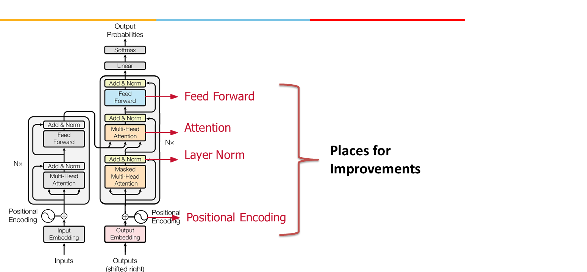

---

## Part 1 · Normalization: LayerNorm, RMSNorm, Norm placement

*Two decisions, not one: which normalization function to use, and where in the block to place it. Both turn out to matter more than they first appear.*

### RMSNorm

**Intuition** — Normalization keeps activations inside a workable numeric range as they flow through many stacked layers, the way a thermostat keeps a room inside a livable temperature band instead of letting it drift to an extreme.

**The problem it solves** — Deep networks stack dozens or hundreds of layers. Without normalization, the scale of activations can drift as they pass through layer after layer, making training unstable and highly sensitive to learning rate. LayerNorm was the standard fix: normalize every token's hidden vector to zero mean and unit variance, then let two learnable parameters (γ, β) rescale and re-shift it.

**The fix, and why it's cheaper** — RMSNorm is a simplified version of LayerNorm with fewer trainable parameters and fewer operations. LayerNorm computes both a mean and a variance and enforces zero-centering; RMSNorm skips the mean-centering step entirely and only rescales by the root-mean-square (RMS) magnitude of the activations. It controls the *size* of the activations without forcing them to be centered around zero. Dropping the mean computation makes RMSNorm roughly **7-15% faster than LayerNorm** with no measurable quality loss — which is why it has **largely displaced LayerNorm in current decoder stacks**: it solves the same optimization problem at a slightly cheaper computation.

**Mechanism** —

```text
LayerNorm(x) = gamma * (x - mean(x)) / sqrt(var(x) + eps) + beta
RMSNorm(x)   = gamma * x / sqrt(mean(x_i^2) + eps)
```

where `gamma` is a learned gain parameter that rescales the standardized (or RMS-normalized) summed inputs, and `x` is the raw summed input to the layer.

### LayerNorm Vs RMSNorm

**Worked example** — A single training example's layer output, before and after each normalization (values from Raschka's worked illustration):

| Stage | Values | Mean | Variance |
|---|---|---:|---:|
| Layer inputs (5 values, one training example) | `[2.09, -9.72, -7.55, 3.24, -1.09]` | — | — |
| Layer outputs (6 values, after a dense projection) | `[5.61, 14.32, 0.00, 34.88, 38.70, 11.29]` | 17.47 | 207.91 |
| After **LayerNorm** | `[-0.82, -0.22, -1.21, 1.21, 1.47, -0.43]` | **0.00** | **1.00** |
| After **RMSNorm** | `[0.25, 0.63, 0.00, 1.54, 1.71, 0.50]` | 0.77 | 0.41 |

LayerNorm forces the output to exactly zero mean and unit variance. RMSNorm doesn't hit those exact targets — mean lands at 0.77, not 0.00 — but it still collapses the variance from 207.91 down to 0.41, which is the part that actually matters for training stability: activations stop blowing up in scale, even without being perfectly centered.

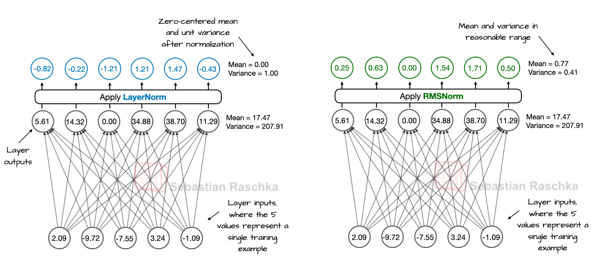


**Tradeoff / when NOT to use** — RMSNorm gives up LayerNorm's zero-centering guarantee. In practice this costs almost nothing in modern deep decoder-only stacks, which is exactly why it displaced LayerNorm there. An architecture that specifically depends on zero-mean activations at every layer (rare in current decoder-only LLM design) would still want LayerNorm.

---

### Pre-Norm vs Post Norm

**Intuition** — It isn't only *which* normalization function to use — *where* it sits relative to the sublayer and the residual connection changes whether gradients get a clean, unmodified shortcut back through a deep network.

**The problem it solves** — In the original "Attention Is All You Need" design (**Post-Norm**), LayerNorm is applied *after* the sublayer and the residual addition: `PostNorm(x) = LayerNorm(x + Sublayer(x))`. This works at the original paper's depth (6 layers), but it means the residual path itself passes through normalization at every layer — there is no untouched shortcut back to early layers. At real depth (100+ layers), this makes training unstable and forces careful learning-rate warmup.

**The fix** — **Pre-Norm** moves normalization *inside* the sublayer branch, keeping the residual addition itself outside it: `PreNorm(x) = x + Sublayer(LayerNorm(x))`. Gradients now have a **direct, unmodified path** back through the residual connection, bypassing both the sublayer and the normalization entirely — a gradient highway. This trains stably even at 100+ layers without warmup tricks, and tolerates larger learning rates.

**An everyday picture for the difference** — Post-Norm is like re-inspecting and re-sealing a delivery truck's *entire cargo hold* at every single stop on its route — the main cargo area itself keeps getting touched and repackaged each time. Pre-Norm is like inspecting only the new items being loaded in at each stop, while the truck's existing cargo drives straight through, untouched, from the first stop to the last. The second design is far more forgiving over a very long route (a very deep stack).

**Worked example — three real architectures, three placements.** The original Transformer decoder uses Post-Norm throughout. **Llama 3 8B** uses Pre-Norm: RMSNorm1 sits before the attention block, RMSNorm2 sits before the feed-forward block, and the residual stream itself is never normalized mid-flow. **OLMo 2 7B** uses a third variant — "Post-Norm but inside the residual": RMSNorm is applied *after* attention/FFN, like Post-Norm, but the placement is arranged so it still sits inside the residual branch rather than wrapping the whole running sum, closer in spirit to Pre-Norm's stability. All three architectures also add a **Final Norm** right before the output projection — because Pre-Norm's untouched residual stream can still grow in scale across many layers, and one last normalization reins that back in before the logits are computed.

A fourth pattern is worth naming separately: **Gemma 3** normalizes **both before and after** each sublayer — a "sandwich" that pays for two normalization passes per sublayer instead of one, in exchange for controlling activation scale on both the way in and the way out. It's neither pure Pre-Norm nor pure Post-Norm; it's evidence that "normalize once, in one place" isn't the only viable design once a lab is willing to spend the extra compute.

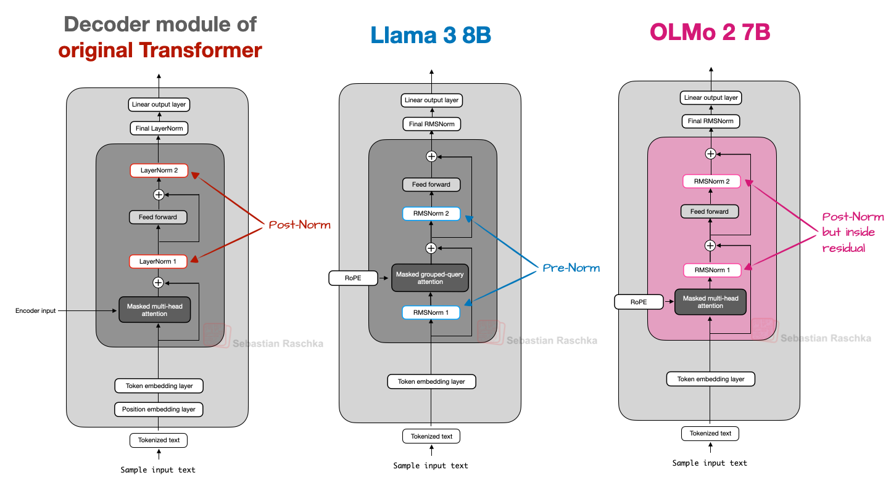


**Worked example — an exam-style question.** *You are designing a decoder-only LLM with more than 100 layers and want stable training with lower computation. Which normalization strategy would you choose, and why?* Answer: **RMSNorm with Pre-Norm placement** — RMSNorm removes the mean-centering pass (cheaper, 7-15% faster, as explained under *RMSNorm*), and Pre-Norm gives gradients a direct highway through the residual stream (stable at depth, tolerates larger learning rates without warmup). This combination is the default for scaling deep LLMs: **Llama, Qwen, DeepSeek, and Mistral all use it.**

**Tradeoff / when NOT to use** — Pre-Norm's stability isn't free: because the residual stream is never itself normalized, activation magnitudes can drift upward across many layers, which is exactly why every Pre-Norm model still needs a Final Norm before the output projection. Post-Norm doesn't have this drift problem, but pays for it with training instability at real depth. OLMo 2's hybrid placement and Gemma 3's sandwich placement are both evidence that the question isn't fully settled — different labs are still making different bets here, not converging on one universally "correct" placement.

---

## Part 2 · Positional Encoding Advances: Relative PE, RoPE, NoPE

*Three ideas in sequence: encode position relatively instead of absolutely, encode that relative position through rotation instead of a lookup table, and — in a few layers of a few models — drop explicit position information entirely.*

### 3. Relative positional encoding — the general idea

**Intuition** — Instead of each token declaring "I am at position 5," relative position encoding makes *pairs* of tokens declare "we are 3 tokens apart" — a signal that stays the same even if the whole sentence shifts.

**The problem it solves** — Absolute positional embeddings (learned or sinusoidal) attach one fixed vector to each position and add it into the token embedding once, at the very bottom of the stack. The model then has to *infer* relative relationships — like "this adjective sits right before its noun" — indirectly, by comparing two absolute-position vectors deep inside many layers of transformation. Worse, the same phrase starting at position 3 in one sentence and position 30 in another isn't guaranteed to end up represented the same way, even though the relationship between its words hasn't changed at all. Many of the dependencies language actually cares about — adjective-noun, pronoun-antecedent, verb-subject — are inherently about *relative* distance, not a fixed slot in the sentence: *"my daughter called her brother last night"* and *"last night, my daughter called her brother"* should produce the same attention behavior between "daughter" and "called," because that relationship is invariant to the shift.

**The fix** — Shaw et al., *"Self-Attention with Relative Position Representations"* (2018), encode the offset between two tokens directly into the attention computation itself, rather than baking absolute position into the embeddings up front. A learned vector `a^K_{ij}` (and a separate `a^V_{ij}`) represents the relative distance `(i - j)` between query position `i` and key position `j`, and is added directly into the attention score and value computation. Crucially, the maximum relative distance is **clipped** to some value `k`, so any pair of tokens more than `k` positions apart shares one representation — giving `2k+1` unique relative-position "buckets" total, rather than one embedding per possible absolute position. This clipping is what lets the model generalize to sequences longer than anything it saw during training: distances beyond `±k` never need a new embedding to be learned. On WMT 2014 English-German and English-French translation, this gave a measured **+1.3 BLEU and +0.3 BLEU** respectively over absolute position representations.

**An everyday picture** — Absolute position is like giving every house on a street its own GPS coordinate, then asking a postal worker to calculate "are these two houses next-door neighbors?" from two far-apart-looking coordinates every single time. Relative position is like just labeling each house "3 doors down from the last one" — the thing that actually matters (adjacency, distance) is stated directly instead of being reconstructed from two absolute numbers.

**Worked example** — Session 2's T5 case study already used a simplified version of this same idea: T5 uses **learned relative position biases**, based on the offset between query and key, bucketed on a log scale (nearby offsets get fine-grained buckets, far-apart offsets share coarse ones) and added directly to the attention logits — the same "encode the offset, not the absolute position" move as Shaw et al., implemented more cheaply.

**Tradeoff / when NOT to use** — Relative position representations solve the "same phrase, different absolute slot" problem, but Shaw et al.'s original formulation adds real compute and memory overhead: a learned embedding lookup per relative distance, computed inside every attention operation, rather than one fixed vector added once per token at the bottom of the stack. That overhead is part of why RoPE — which encodes relative position through rotation instead of a separate learned table — became the more common choice for large decoder-only models.

---

### 4. RoPE (Rotary Positional Embeddings)

**Intuition** — Instead of *adding* a position vector, RoPE *rotates* the query and key vectors by an angle that depends on their position. Rotating two vectors by different amounts changes the angle *between* them in a way that depends only on the *difference* in how much each was rotated — so relative position falls directly out of the geometry, with no separate lookup table required. RoPE was introduced by Su et al. in the RoFormer paper (2021).

**Mechanism** — Basic 2D rotation of a point by angle θ. The **rotation matrix** is the compact way to express this transformation:

```text
x' = x cos(theta) - y sin(theta)
y' = x sin(theta) + y cos(theta)

R(theta) = [ cos(theta)  -sin(theta) ]
           [ sin(theta)   cos(theta) ]
```

RoPE applies a *position-dependent* rotation to the query and key vectors before the attention dot product: `q~_m = R(m*theta) q_m` and `k~_n = R(n*theta) k_n`, where `m` and `n` are the query and key token positions. The attention score becomes:

```text
score_RoPE(m, n) = q~_m^T k~_n = q_m^T R((n - m) * theta) k_n
```

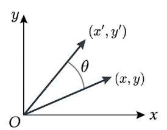

By the algebra of rotations, the combined rotation term depends only on `(n - m)` — the *relative distance* between positions `m` and `n` — never on `m` or `n` individually. The model never explicitly represents "I am at position 512"; it only ever sees relative offsets, baked directly into the same dot product attention was already computing.

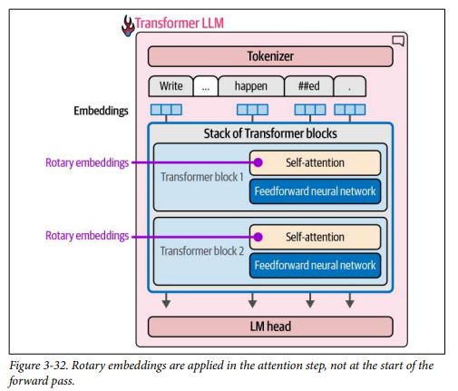


**Worked example** — Two tokens exactly 3 positions apart always rotate *relative to each other* by exactly `3*theta`, regardless of whether they are the 3rd and 6th tokens in a short sentence or the 300th and 303rd tokens in a long document — same relative rotation, same positional contribution to the attention score either way. This is the concrete mechanism behind the relative-position idea: represent "we are k tokens apart" through rotation instead of a lookup table.

**Why models moved to it** — Better handling of relative distances (attention itself becomes position-aware, rather than position being a separate add-on the model has to indirectly recover). Better long-context behavior — it is often easier to extend a RoPE-based model to a larger context window, because rotation is a continuous, extendable function rather than a fixed table capped at whatever length was seen in training. Cleaner integration with attention — position lands exactly where it is used, inside the query-key dot product, instead of being mixed into the input embedding and hoped to survive many layers of transformation intact. **RoPE is the default in Llama, Qwen, GPT-OSS, DeepSeek, GLM-4.5, and Sarvam 30B.**

**Tradeoff / when NOT to use** — RoPE assumes relative position is what matters and encodes nothing else — recovering an *absolute* fact like "this is the very first token" isn't naturally available unless something else in the architecture supplies it (a beginning-of-sequence token, for instance). And even RoPE-equipped models still degrade at context lengths well beyond their training length, just less sharply than absolute encodings do — which is part of what motivates NoPE, next.

---

### 5. NoPE, and mixing RoPE with no positional encoding

**Intuition** — What if some layers used *no* explicit positional encoding at all, relying purely on the causal attention mask itself as the only source of order information?

**The problem it solves** — Even RoPE-equipped models can lose track of information deep in a very long context. Every explicit position scheme discussed so far — learned absolute, sinusoidal, Shaw et al.'s relative embeddings, even RoPE's rotation — introduces some structural bias toward "nearby tokens matter more," because that's what positional encoding is *for*. But a causal mask already guarantees token `i` can only attend to tokens `≤ i`, which is itself a real (if weak) positional signal, with none of that "nearby matters more" bias baked in.

**The fix** — **NoPE** ("No Positional Encoding") layers drop explicit position information entirely and rely purely on the causal mask's inherent left-to-right structure. **Llama 4** and **SmolLM3** interleave a handful of NoPE layers among a stack that is mostly RoPE, rather than going all-NoPE. Empirically this improves long-context retrieval compared to a RoPE-only stack — plausibly because the NoPE layers are freed from any "nearby is more relevant" bias that every explicit position scheme tends to introduce, letting those specific layers attend based purely on content relevance regardless of distance.

**Worked example** — In a mostly-RoPE stack, a few NoPE layers can process a long document using the causal mask as their only order signal. If a distant fact remains retrievable in that mixed stack, the example illustrates why a content-driven layer may complement—but not replace—the position-aware RoPE layers.

**Tradeoff / when NOT to use** — NoPE-only models are not the standard, because most positional structure genuinely does help most of the time — the fact that current designs *interleave* a few NoPE layers into a mostly-RoPE stack, rather than replacing RoPE outright, is itself the evidence that neither extreme wins by itself. Treat NoPE as an ingredient a few frontier models mix in for specific long-context behavior, not a wholesale replacement for RoPE.

**Positional encoding, landscape view** — the whole progression in one table:

| Approach | Where position lives | Generalizes past training length? | Used by |
|---|---|---|---|
| Learned absolute | A trainable vector added per position | Poorly — no vector exists past the trained length | Early Transformers, GPT-1 |
| Sinusoidal | A fixed sine/cosine vector added per position | Modestly | Original Transformer |
| Shaw et al. relative | A learned vector per clipped relative offset, added inside attention | Well, up to the clip distance `k` | T5 (simplified variant) |
| **RoPE** | A rotation applied to Q/K before the dot product | Well — rotation is a continuous, extendable function | Llama, Qwen, DeepSeek, GLM-4.5 |
| **NoPE** (mixed in) | Nothing explicit — the causal mask alone | Used for specific long-context retrieval layers, not standalone | Llama 4, SmolLM3 (interleaved with RoPE) |

---

## Part 3 · Advanced activations: GELU, Swish, Gated Linear Units (GLU), SwiGLU

*Two upgrades to the feed-forward layer: a smoother activation curve, and splitting the layer into a value path plus a gate path.*

### 6. GELU and Swish — smoother activations for deep stacks

**Intuition** — ReLU's hard cutoff at zero (output is *exactly* zero for any negative input) creates a sharp corner that can silently kill a neuron's gradient forever if that neuron's input drifts negative — the "dying ReLU" problem. GELU and Swish replace that hard corner with a smooth curve that still resembles ReLU's overall shape, but never has a completely flat, zero-gradient region for typical inputs.

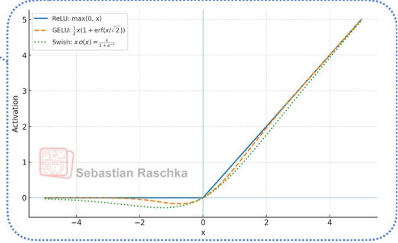

**The problem it solves** — A plain feed-forward layer is `FFN(x) = act(x W1) W2` — linear, then activation, then linear, one path, and the activation is a plain filter. If `act` is ReLU, any input landing on the negative side is truncated to exactly zero and contributes exactly zero gradient during backpropagation. In a very deep stack, enough neurons can get permanently stuck this way that they stop learning entirely, for the rest of training.

**The fix** — **GELU** (Gaussian Error Linear Unit, Hendrycks & Gimpel) weights each input by the probability that a value drawn from a standard normal distribution would be less than that input — in effect, it multiplies `x` by a smooth S-shaped function of `x`, instead of a hard 0/1 gate, so small negative inputs are *down-weighted* rather than zeroed outright. **Swish** (also written SiLU, `x * sigmoid(x)`, from Elfwing et al.'s "Sigmoid-Weighted Linear Units for Neural Network Function Approximation in Reinforcement Learning") does something similar using a sigmoid gate instead of the Gaussian CDF. Both are smooth, both dip slightly negative before rising (unlike ReLU's flat-then-linear shape), and both keep a small gradient flowing even for negative inputs. Representative examples associate **GELU** with BERT, GPT-2/3, and Gemma, and **SiLU/Swish** with Llama, Qwen, DeepSeek, Mistral, GPT-OSS, and Sarvam.

**An everyday picture** — ReLU is a bouncer with one strict cutoff line: below it, absolutely nobody gets in, no matter how close they were. GELU and Swish are more like a bouncer who gradually lets fewer people through as the line looks less promising, rather than drawing one hard line — nobody is flatly zeroed out just for being slightly on the wrong side.

**Worked example** — GPT-1 used GELU as its activation function across its 12 transformer blocks. This shows where a smooth activation sits in a transformer stack; it does not by itself establish a measured comparison with a ReLU version.

**Tradeoff / when NOT to use** — GELU and Swish cost more to compute per activation than ReLU, since they require an exponential or error-function evaluation rather than a single comparison. On modern GPU hardware this extra cost is negligible next to the matrix multiplies surrounding it, which is why GELU/Swish-family activations are now close to universal in transformer feed-forward layers — the training-stability benefit comfortably outweighs the small extra compute.

---

### 7. Gated Linear Units and SwiGLU

**Intuition** — A plain FFN passes every input through one filtering path (linear → activation → linear). A **gated** FFN splits the computation into two parallel paths instead — one path decides *how much* of each feature should pass through, the other path carries *what* that feature actually is — and multiplies the two together.

**The problem it solves** — A regular FFN's activation is one shared filter, applied uniformly. The network can't easily learn "let this dimension through strongly for these tokens, but suppress it for those tokens" without contorting its single pair of weight matrices to do double duty: deciding relevance *and* carrying content through the exact same linear transform.

**The fix** — A **Gated Linear Unit (GLU)** uses three weight matrices instead of two. GLU and its variants (including GEGLU and SwiGLU) come from Shazeer's "GLU Variants Improve Transformer" (2020):

```text
Regular FFN:  FFN(x) = act(x W1) W2                        (2 weight matrices, one path)
Gated FFN:    FFN(x) = ( act(x W) (x) x V ) W2              (3 weight matrices, two paths, "(x)" = elementwise multiply)
```

`x W` goes through the activation to become a **gate** signal — deciding how much of each dimension should pass. `x V` is a separate, un-activated **value/content** path. The two are combined elementwise before the final output projection `W2`. The gate decides "how much"; the value path decides "of what" — content and relevance are computed by two different weight matrices instead of being forced through one.

**Named variants** — **GEGLU** uses GELU as the gate: `FFN_GEGLU(x, W, V, W2) = (GELU(x W) (x) x V) W2`. **SwiGLU** uses Swish (specifically Swish with β=1, sometimes written Swish₁, equivalent to SiLU) as the gate: `FFN_SwiGLU(x, W, V, W2) = (Swish_1(x W) (x) x V) W2`.

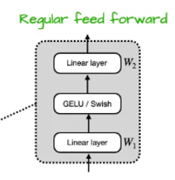
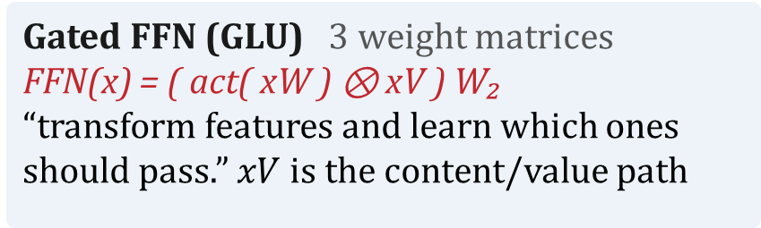

**Worked example** — A concise exam takeaway is: **"Almost every current open model ships a gated FFN — SwiGLU is the default, not the exception."** If a model card says "SwiGLU," it means the FFN uses this three-matrix gated design combining the Swish activation with the gating structure described here — not the older two-matrix plain FFN from the original Transformer paper.

**Tradeoff / when NOT to use** — A gated FFN has roughly **1.5×** the weight matrices of a plain FFN at the same hidden dimension (three matrices — `W`, `V`, `W2` — instead of two), costing more parameters and compute per FFN block. In exchange it gets dynamic, per-dimension control over feature selection and, empirically, smoother gradient flow and better final quality — the same shape of tradeoff as GELU/Swish's extra compute over ReLU, and accepted for the same reason: the quality gain is worth more than the small extra cost.

---

## Part 4 · MoE: Sparse activation and routing

*One FFN per decoder block becomes several. A router decides which ones actually run for a given token — trading total capacity against per-token compute.*

### 8. Dense vs sparse layers — why MoE exists

**Intuition** — A dense FFN uses every one of its parameters on every single token. MoE instead keeps many separate FFNs ("experts") but routes each token through only a handful of them — so the model's total knowledge capacity can grow far larger while the compute spent *per token* stays roughly fixed.

**The problem it solves** — Making a dense model bigger, to give it more capacity, means every additional parameter activates for *every* token, so compute cost scales directly with total parameter count. At some point a dense model becomes too expensive to run per-token, even though most of that added capacity may only be relevant to a small slice of its inputs — numeric reasoning, one specific language, one narrow domain's vocabulary.

**The fix** — A **dense layer** (a traditional Transformer's feed-forward neural network, or **FFNN/FFN**) is one where all parameters — weights and biases — are activated for every input; that's what "dense" means here. A **sparse layer** only activates a portion of its total parameters, and MoE is the standard way to build one: each decoder block's FFN is replaced with **several parallel FFNs ("experts")**, plus a small **router** (itself a small FFN) that looks at each token and decides which one or few experts should actually process it. Only the selected experts run for that token; the rest sit idle for it, even though they remain part of the model's total parameter count. MoE saves FLOPs specifically by activating only a few experts per token rather than the whole layer.

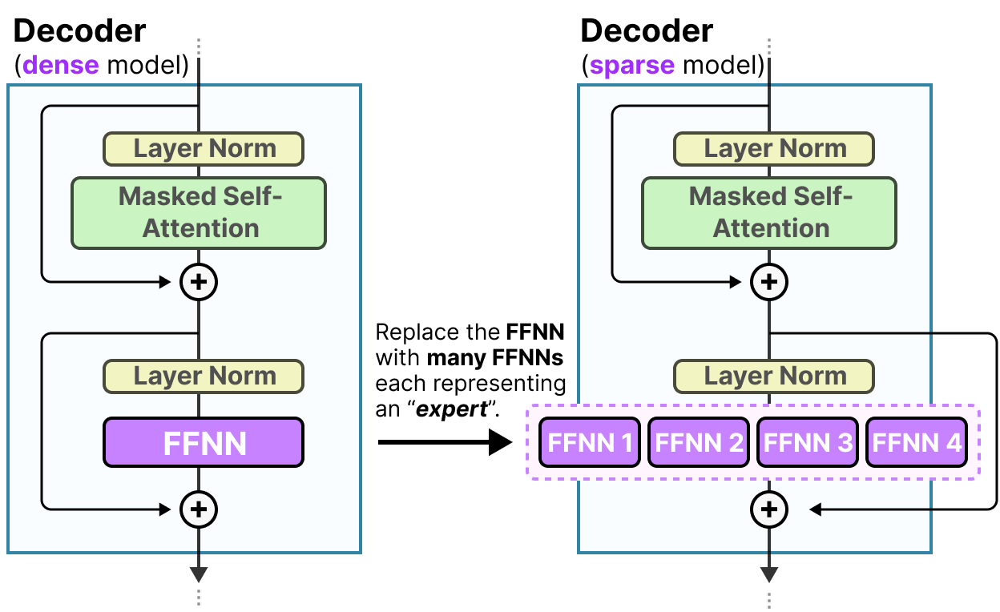
**Worked example — a concrete case.** Input: *"What is 1 + 1 ?"* A sparse MoE layer has four experts, each empirically specialized toward a different kind of token: **Punctuation, Verbs, Conjunctions, Numbers**. For this arithmetic question, only the **Numbers** expert activates — Punctuation, Verbs, and Conjunctions stay dark for this token — and the layer still produces the correct output, **2**. A dense model of equivalent total size would have run all four experts' worth of parameters on this one token, most of it irrelevant to answering an arithmetic question. Most LLMs stack several decoder blocks, so a given piece of text passes through a *different* combination of experts at each block on its way to the final output — **different paths** for different tokens, letting the model hold much higher total capacity while keeping only a smaller active path per token.


#### Architecture of Experts

The expert architecture view makes the capacity argument concrete: the same token can be evaluated by a collection of specialized feed-forward experts, while routing activates only the selected path.

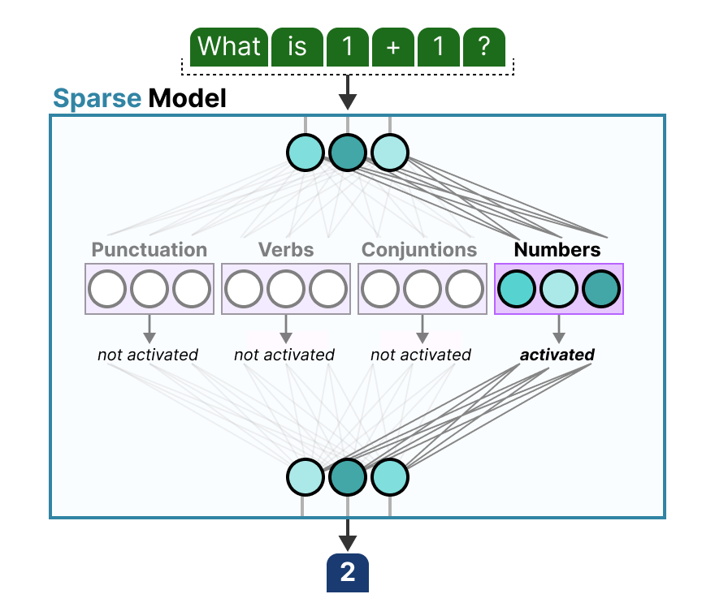
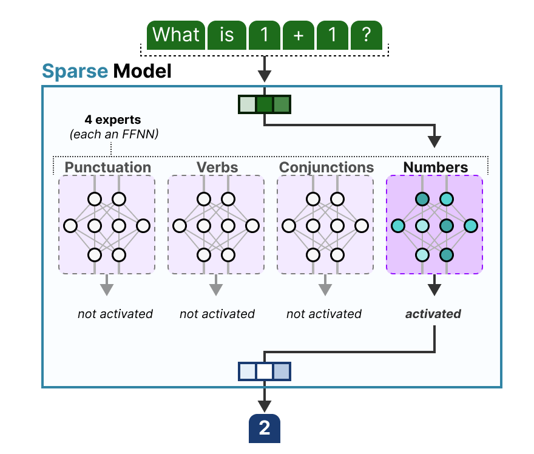

#### Different expert paths

Across decoder blocks, different tokens can follow different expert paths. This is how a sparse model increases total capacity without running every expert for every token.

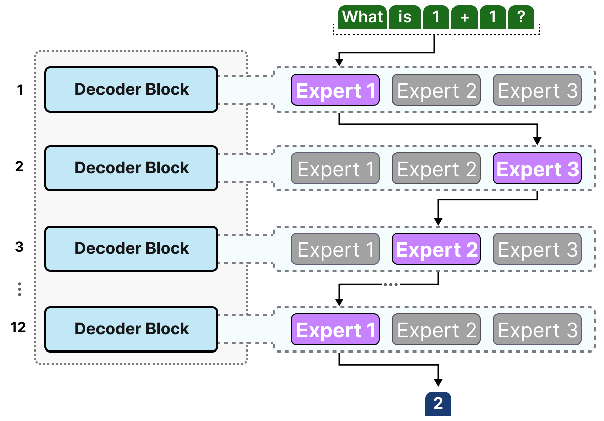
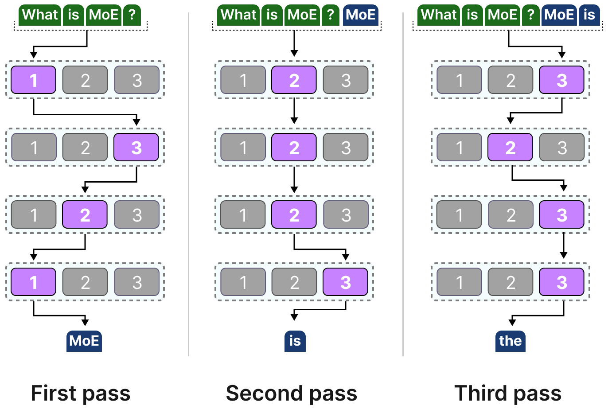

**Tradeoff / when NOT to use** — This is a straight capacity-for-complexity trade. MoE increases representational capacity (total parameters, hence total "knowledge") while keeping active parameters — and therefore per-token compute — much smaller than the total. In exchange, MoE introduces real systems and training challenges: routing overhead, load-balancing problems, training instability, and materially more complicated deployment; the inference discussion below covers the memory consequence directly.

---

### 9. Routing and load balancing

**Intuition** — A router's job is not only "which expert looks closest to correct for this token" — it also has to make sure no single expert becomes so popular that it turns into a bottleneck, and no expert is so ignored that it never learns anything useful.

**Mechanism** — The **router**, also called the **gate network**, outputs probabilities over experts for each token; the expert layer's output is the selected expert's output **multiplied by the router's selection probability** (the "gate value") for that expert, so the router's confidence directly scales how much that expert's answer counts. A token can be routed to exactly one expert (**top-1 routing**) or to several (**top-k routing**), with the selected experts' contributions weighed and integrated. In other words, the **expert contributions** are weighted and integrated into the block output.

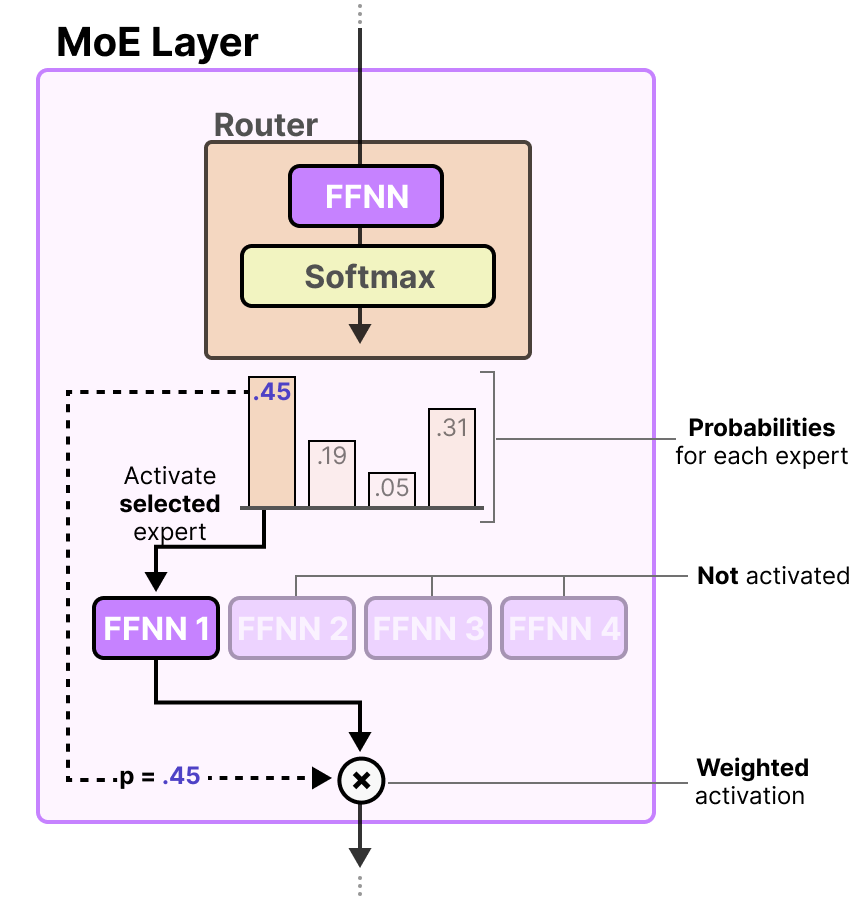

**The load-balancing problem, and its fix** — It isn't just *which* experts are used, it's *how much* each one is used. Left unconstrained, popular experts get overloaded while others are barely trained. **Expert capacity** is the fix: a hard cap on how many tokens a given expert can process per batch. Once an expert reaches capacity, further tokens routed to it are sent to the **next expert** with the next-best routing score instead. **Token overflow** is the failure case this creates: if *all* of a token's assigned top-k experts are simultaneously at capacity, that token is not processed by any expert at all — it bypasses the MoE block entirely and reaches the next layer through the residual connection, unchanged by this block's expert computation.

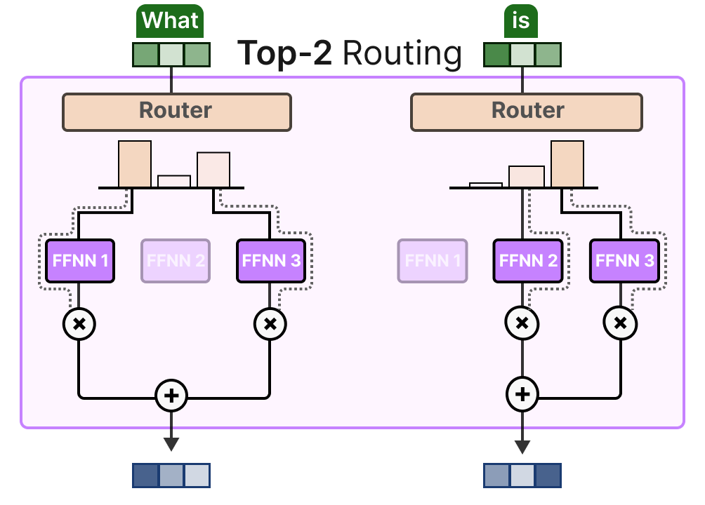
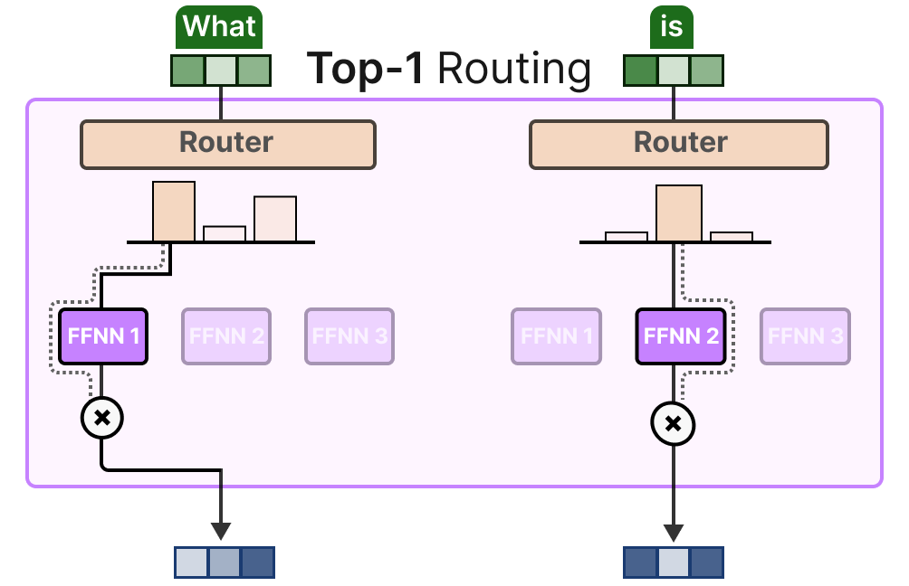
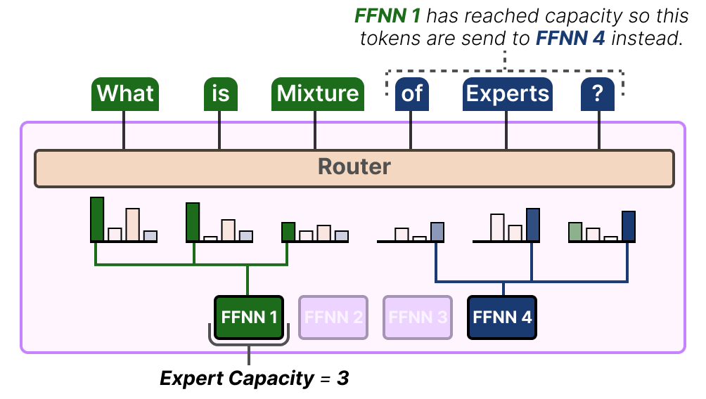
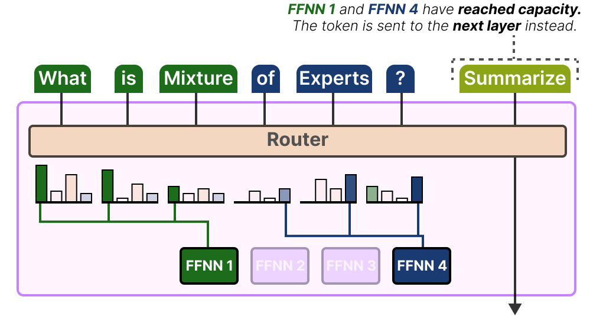

**Worked example — an exam-style question.** *"Explain the concept of 'Expert Capacity' and the consequence of 'Token Overflow.' How do these design choices impact training and inference?"* **Training impact:** capacity keeps the router from collapsing onto a few favourite experts, forcing the model to genuinely use its full parameter count — but dropped (overflowed) tokens add noise to training, so too tight a cap causes excessive drops while too loose a cap allows imbalance to persist unchecked. **Inference impact:** capacity limits are usually relaxed at serving time, since forcing balance matters less once the model is no longer learning — but **total** parameters, not just active ones, must still fit in GPU memory, and uneven expert usage can still slow serving down.

**Tradeoff / when NOT to use** — Tight expert capacity forces balanced expert usage (good training signal) at the cost of dropped tokens (worse quality for that specific batch). Loose capacity avoids drops but risks the router ignoring most experts, wasting the very capacity MoE was built to buy. There is no single capacity setting that avoids both failure modes at once — production systems pick a working middle ground and monitor for both symptoms directly.

---

### 10. Modern MoE design patterns

**Intuition** — Two questions define a modern MoE design: how many experts are *always on* versus selectively routed, and how many total experts are fine-grained specialists versus a few large generalists — different frontier labs have made genuinely different, defensible bets on both.

**Mechanism — shared + routed experts.** Most current designs (**DeepSeek-V3, Qwen3, GLM-4.5, Kimi K2**) split experts into two categories. **Shared experts** are always active for every token — they capture common, general-purpose knowledge and reduce redundancy across the routed experts, since no routed expert then needs to re-learn basic language patterns from scratch. **Routed experts** are selectively activated per token by the router, and modern designs favor many small, fine-grained routed experts over a few large ones. **DeepSeek-V3** uses **256 routed experts plus 1 shared expert, with the top-8 routed experts activated per token** — the bet being that many narrow specialists, combined, cover more ground at the same active-compute budget than a few broad generalists would.

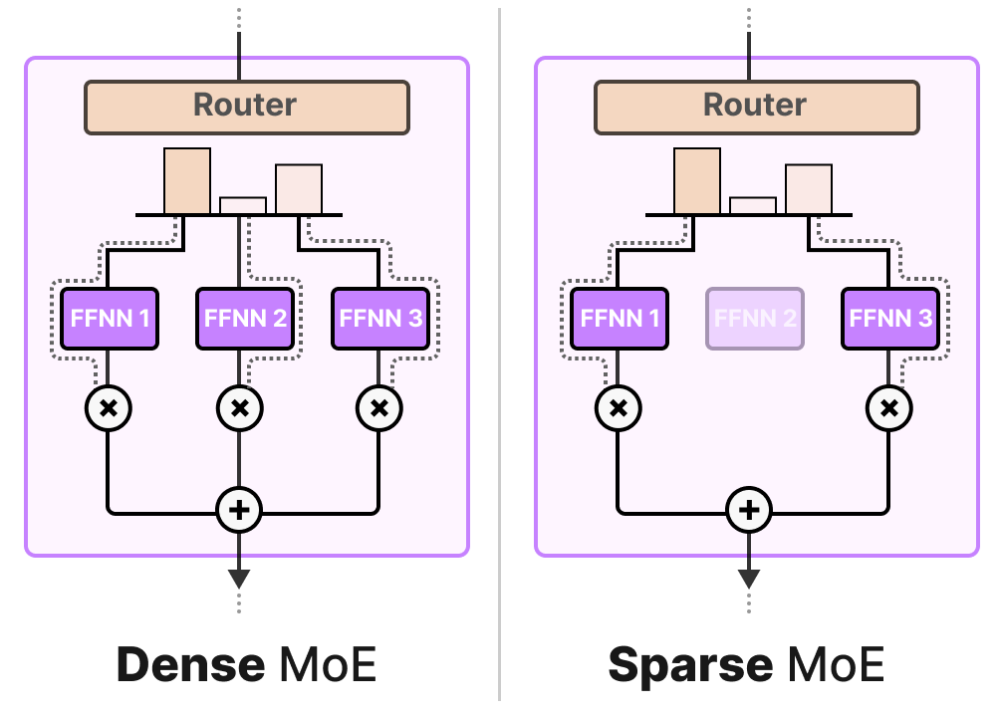
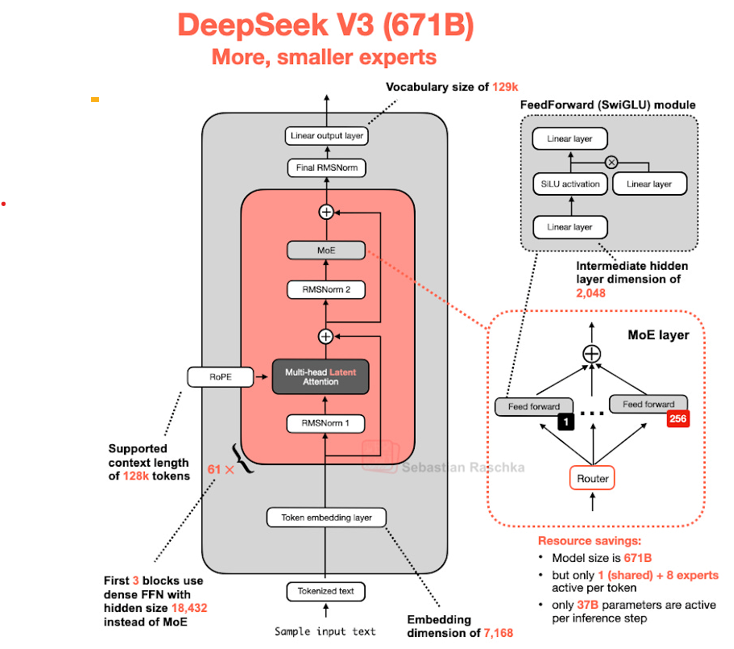

**Worked example — the opposite bet.** Where DeepSeek-V3 bets on many small experts, **Llama 4 Maverick** (400B total parameters, 17B active) bets on fewer, bigger experts: **128 routed experts plus 1 shared, but only top-1 routing** (versus DeepSeek's top-8 of 256), and it **alternates dense and MoE layers** rather than making every FFN an MoE layer. The result is roughly a **4% active-parameter ratio** — small enough that the 400B-parameter model fits for deployment on a single H100 DGX host. Maverick's bet is that sharper routing (fewer, more decisively chosen experts) combined with some plain dense layers beats the many-small-experts approach. The two labs answered the same design question differently, and both ship production models on their respective bets.

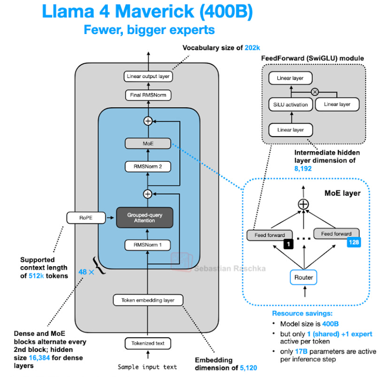

| | DeepSeek-V3 | Llama 4 Maverick |
|---|---|---|
| Total / active params | — | 400B / 17B (~4% active) |
| Routed experts | 256 | 128 |
| Shared experts | 1 | 1 |
| Routing | top-8 of 256 | top-1 |
| Layer pattern | — | alternating dense + MoE layers |
| Design bet | many small specialists | fewer, sharper, bigger experts |

A naming trap worth flagging: "dense" gets reused with two different meanings in this part of the session. In the dense-versus-sparse explanation, a **dense layer** means a plain FFN with no MoE at all — every parameter always active. Inside MoE specifically, a **Sparse MoE** is the hard-routing design covered so far — the router selects only a few experts (top-1 or top-k) and the rest sit fully idle for that token. A **Dense MoE**, by contrast, still runs *every* expert for every token, like a plain dense layer would, but combines their outputs in different proportions (weighted differently per token) rather than selecting a hard subset. A Dense MoE keeps the "many specialized sub-networks, weighted per token" idea without the routing/capacity/overflow machinery described in the routing sections — at the cost of losing the compute savings that make sparse MoE attractive in the first place, since every expert still runs regardless of relevance.

A related pattern is **dynamic sparsity**: newer models like **Qwen3-Next** and **Llama 4** (Maverick/Scout) adjust how many experts activate based on task difficulty — increasing active experts during a reasoning-heavy "thinking mode" (reinforcement-learning-driven extended reasoning) and decreasing them for ordinary chat, effectively behaving like two different models sharing one set of weights.

**MoE at inference — the distinction that trips people up.** **Active** parameters drive *speed* — only the routed experts' weights need to be read and multiplied for a given token. **Total** parameters drive *memory* — every expert's weights must be loaded onto the GPU regardless of whether that expert gets used for this particular token, because the router's choice changes token to token, layer to layer. **Mixtral 8×7B** is the canonical illustration: roughly **47B total parameters** must fit on disk and in memory, even though only about **13B parameters are active** for any single token's forward pass. A team sizing hardware for an MoE model has to budget for the *total* footprint, not the active one — getting this backwards produces a model that runs fast per-token but simply doesn't fit on the available GPUs at all.

**Tradeoff / when NOT to reach for MoE** — MoE is a good bet when the systems complexity it demands — custom routing infrastructure, load-balancing tuning, harder-to-parallelize training — is affordable in exchange for capacity a dense model at the same active-compute budget couldn't reach. This is the central **scaling efficiency** benefit: more representational capacity without activating every parameter for every token. For a small team without dedicated expert-parallel training infrastructure, or for a product where the *total*-parameter memory footprint is the binding constraint (edge deployment, for instance), a smaller dense model is usually the simpler, more reliable choice. MoE trades operational simplicity for capacity-per-compute, and that trade only pays off at a scale where the extra capacity is actually needed.

---

## Part 5 · Emerging Architectures

### 11. Beyond the standard transformer stack

**Intuition** — Everything so far in this session modifies a piece *inside* the standard transformer block — its normalization, its positional encoding, its activation, its feed-forward layer. Emerging architectures ask a more radical question: does every layer even need to be a full attention layer at all?

*Supplementary context — this handout topic is introduced here at a high level because the session provides no dedicated worked architecture slide.*

**The problem it solves** — Self-attention's cost grows **quadratically** with sequence length: every token compares against every other token. Its KV-cache — the stored keys and values needed to avoid recomputing attention over the whole prefix at every generation step — grows **linearly** with sequence length. Both become expensive at very long context lengths. This is the architectural version of the same context-window cost problem seen from the product side elsewhere in this program: can a different core mechanism sidestep the cost entirely, rather than just managing it better?

**The fix — state-space models (SSMs) and Mamba.** Instead of attention's explicit token-to-token comparison, a state-space model compresses everything seen so far into a **fixed-size hidden state** that gets updated as each new token arrives — similar in spirit to how a recurrent neural network carries a hidden state forward, but built on a specific mathematical structure (borrowed from control theory's state-space equations) that allows the update to be computed efficiently in parallel during training, unlike a traditional RNN. **Mamba** (Gu & Dao) is the best-known modern SSM architecture. Because its per-step cost and memory footprint don't grow with sequence length the way attention's do, it offers a genuinely different cost curve for very long sequences.

**An everyday picture** — Attention is like keeping a full written transcript of every conversation you've ever had, and re-reading the entire transcript every time someone asks you a question, so you can point to the exact relevant line. An SSM is like keeping a single running mental summary that you continuously update as the conversation goes — cheap to carry forward, but only as good as what you managed to fold into the summary; anything you didn't compress in is gone.

**Worked example** — A state-space layer processing a 100,000-token document updates one fixed-size hidden state 100,000 times, with constant memory per step. A comparably-sized attention layer over the same document needs to reference (or at minimum cache) information proportional to the *full* 100,000-token history at every generation step — its memory footprint keeps growing as the document does; the SSM's does not.


**Tradeoff / when NOT to use** — Pure SSMs have historically been weaker than attention at tasks requiring precise recall of one specific fact from far back in the context: attention can directly "look up" any earlier token, while a fixed-size state has to have compressed that fact into its running summary and not lost it along the way. This is why current production systems favor **hybrid** architectures — interleaving a minority of attention layers among mostly-SSM layers — rather than replacing attention outright, in the same spirit as mixing a few NoPE layers into a mostly-RoPE stack rather than replacing RoPE. As of this session, hybrid SSM-attention architectures remain an active research and engineering area rather than the settled default that RMSNorm, RoPE, or SwiGLU have already become in the earlier Parts — worth knowing the landscape exists, without expecting one fixed answer to memorise.

---

## Self-study / Lab / build

No dedicated lab notebook has arrived for this session yet; self-study for now means working these exercises by hand and being able to reconstruct each worked example without looking:

1. **Reproduce the RMSNorm worked example by hand.** Given the six layer-output values in the table, compute the mean-square, then `x / RMS(x)`, and check your numbers against the 0.25/0.63/0.00/1.54/1.71/0.50 result.
2. **Normalization-placement question:** *"You are designing a very deep decoder-only LLM with more than 100 layers and want stable training with lower computation. Which normalization strategy would you choose, and why?"* Answer from memory before checking the normalization-placement explanation.
3. **Routing question:** *"In an MoE architecture, explain the concept of 'Expert Capacity' and the consequence of 'Token Overflow.' How do these design choices impact the training and inference of a sparse model?"* Answer from memory before checking the routing and load-balancing explanation.
4. **Spot-the-architecture drill.** Pick any current open-weight model's published card or paper (Llama 3/4, Qwen3, DeepSeek-V3, Gemma 3/4, OLMo 2) and identify its normalization function and placement, positional encoding scheme, FFN activation and gating, and MoE shared/routed split when applicable. This is the practical skill the whole session builds toward.
5. **Implement a tiny RMSNorm + SwiGLU FFN by hand**, in under 30 lines of NumPy: one function for `RMSNorm(x, gamma)`, one for `SwiGLU_FFN(x, W, V, W2)` using `x * sigmoid(x)` as Swish, and confirm the shapes work through a toy 4-dimensional input.

⚠️ This session's Lab material has not been received yet; log any lab notebook or additional slides against this session as they arrive.

---

*Exam: this session is in scope for the **closed-book mid-sem** (S1-S8). Full evaluation, weights, dates and course logistics live once in [`536-master.md`](../536-master.md) — not repeated per session.*
