# AIML ZG536 · Class 04 · LLM Fine-tuning

_Lecture note · 04 Sep 2026_

> **Class 4 scope exception.** The supplied lecture deck teaches **LLM Fine-tuning**, while the handout's standard Session 4 row is **Training and Attention Efficiency**. This note follows the material actually taught in Class 4 and must not be treated as the handout's standard Session 4 note.

## Why this class matters

Pretraining gives a model broad language ability, but a pretrained model is not automatically good at a particular task, instruction style, or deployment constraint. Fine-tuning changes how the model uses what it already knows.

The central choice is how much to update:

- **Full fine-tuning** updates all model weights.
- **Parameter-efficient fine-tuning (PEFT)** updates only a small part of the model.
- **Instruction fine-tuning** changes next-token prediction into behavior that follows user instructions.
- **LoRA and QLoRA** make PEFT practical when the base model is large.
- **Model merging** combines compatible tuned models or adapters into one deployable model.

The recurring before/after contrast is simple:

> **Before:** a general pretrained model predicts likely text.  
> **After:** the adapted model is better at a chosen domain, task, instruction format, or serving constraint.

---

## Part 1 · Fine-tuning

### Fine-tuning

**What it is.** Fine-tuning starts with a pretrained language model and trains it further on a narrower dataset or objective. The starting model already contains general representations, so the new training run specializes rather than relearning language from random weights.

**Why it is needed.** A general model may know facts and language patterns but still fail to produce the format or behavior required by a product. Fine-tuning supplies task-, domain-, or instruction-specific training signals.

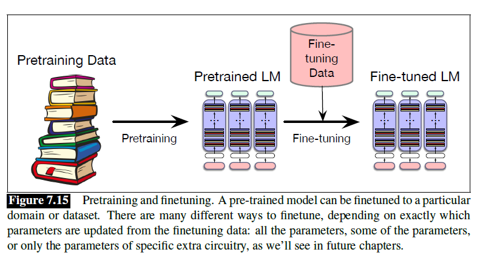

**Mechanism.** Three routes are compared:

- **Continued pretraining:** train the pretrained model on new unlabeled text with the original language-modeling objective. An example is **BioBERT**.
- **Full fine-tuning:** update all model weights. The example is **Qwen/Qwen2.5-0.5B**.
- **PEFT:** fine-tune only a small part of the model, saving compute and memory. The example is a **Llama-family adaptation**.

**Worked example.** A general model can be continued-pretrained on biomedical text, fully fine-tuned on labeled task examples, or adapted with a small set of trainable parameters. The model starts from the same pretrained checkpoint, but each route changes a different amount of its parameters.

**Tradeoff / when not to use.** Full fine-tuning can adapt strongly but requires updating and storing a complete model copy. Continued pretraining needs a large, stable unlabeled corpus. PEFT is cheaper, but the small trainable component may limit how far the behavior can move.

### Fine tuning: SFT, IFT, and MLM fine-tuning

**What it is.** Fine-tuning can use labeled input-output examples, instruction-response examples, or a masked-token objective, depending on the model family and desired behavior.

**Why it is needed.** The same pretrained model can be useful for different outcomes: task prediction, instruction following, or domain adaptation of an encoder-style model.

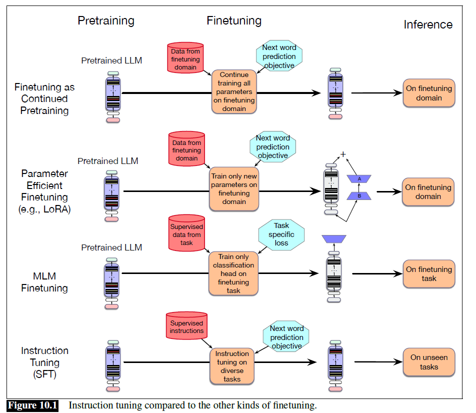

**Mechanism.** The main distinctions are:

- **Supervised fine-tuning (SFT):** train on labeled input-output examples; example: **Llama 2-Chat**.
- **Instruction fine-tuning (IFT):** a type of SFT using instruction-response examples to improve instruction following; example: **Llama 3.1 Instruct**.
- **MLM fine-tuning:** a type of SFT for adapting BERT-style models with masked-language-model training; example: **DistilBERT**.

**Worked example.** The input `Classify this review` with target `positive` is a labeled example. An instruction-response record such as `Summarize this paragraph` → `...` additionally teaches the requested action and response format.

**Tradeoff / when not to use.** IFT is useful when the deployed model must follow natural-language requests, but it depends on consistent, high-quality instruction data. MLM fine-tuning is appropriate for BERT-style encoders, not a direct replacement for decoder-only generation.

### Few shot learning

**What it is.** Few-shot or in-context learning gives a pretrained model examples inside the input prompt instead of updating its weights. **GPT-3** demonstrated that a sufficiently capable model could perform tasks beyond the narrow form of training examples it had seen.

**Why it is needed.** It provides a fast way to try a task without collecting a fine-tuning dataset or running an optimizer. The model uses knowledge learned during pretraining and the examples supplied at inference time.

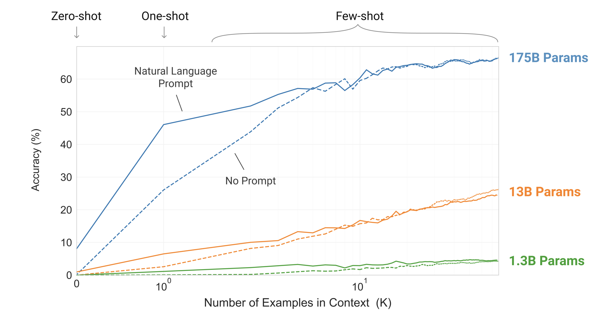
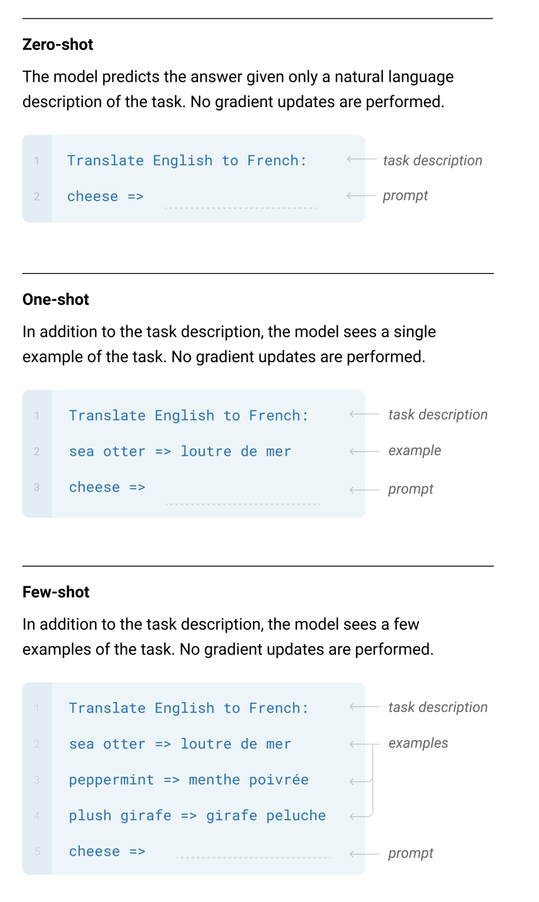

**Mechanism.** The prompt can be:

- **Zero-shot:** task description only;
- **One-shot:** task description plus one example;
- **Few-shot:** task description plus several examples.

No gradient update is performed. The model conditions its next-token predictions on the examples in the context.

**Worked example.** A translation prompt can contain `sea otter → loutre de mer` and then ask the model to translate `cheese`. The example changes the behavior for that request without changing model parameters.

**Tradeoff / when not to use.** Few-shot learning is quick and reversible, but it consumes context-window space, may be sensitive to example order, and does not permanently teach the task. Fine-tune when the behavior must be consistent across many requests and the data justifies changing weights.

---

## Part 2 · Instruction fine tuning

### Instruction fine tuning

**What it is.** Instruction fine-tuning trains a pretrained model on instruction-response pairs so that it learns to interpret a request and produce a task-appropriate answer.

**Why it is needed.** A base language model is optimized for likely continuation, not necessarily for following a human request. The desired change is from **observed behavior: next-word prediction** to **desired behavior: instruction following**.

The observed behavior is **Next word prediction** and the desired behavior is **Instruction Following**.

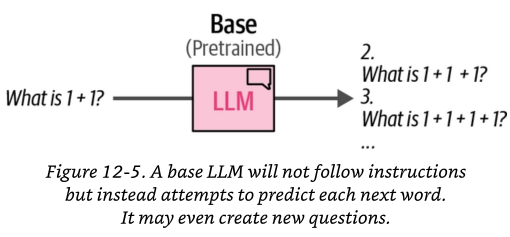
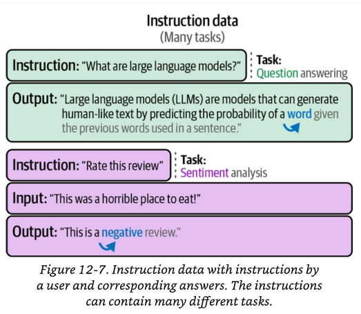
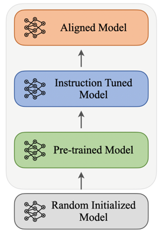

**Mechanism.** An instruction-tuning record contains an instruction, optional input/context, and the desired output. Data can be created through:

- **Human authoring:** experts or annotators write instruction-response pairs from scratch.
- **Template conversion:** existing labeled datasets such as **SQuAD** are rewritten into instruction format.
- **Synthetic generation:** a stronger teacher LLM such as **GPT-4** or **Claude** generates instructions, answers, or both.
- **Hybrid pipeline:** a small gold set is expanded synthetically and then checked in a human-validation loop.

An IFT dataset can be stored as **JSONL (JSON Lines)**, with one training record per line, and loaded with Hugging Face `load_dataset()`.

**Worked example.** A raw question-answer item can be transformed into an instruction such as “Answer using only the context.” The model then learns both the answer and the requested response behavior.

**Tradeoff / when not to use.** Human-written data is expensive but gives direct quality control. Synthetic data scales faster but can inherit a teacher model's errors or biases. Template conversion is efficient but may produce less natural instructions than expert authoring.

### Dataset schema

**What it is.** A dataset schema is a model-agnostic record format that stays stable even when the model-specific prompt template changes.

**Why it is needed.** Keeping raw task information separate from the final chat template lets the same dataset be rendered for different models without rewriting the underlying examples.

**Mechanism.** The Eiffel Tower example separates:

- **Context:** the information available to answer the question;
- **Question:** the task to perform;
- **Answer:** the target response.

A JSONL record adds fields such as:

```json
{
  "instruction": "Answer the question using only the information in the context. If the answer is not present, say 'The answer is not present in the provided context.'",
  "input": "Context: The Eiffel Tower is located in Paris, France. It was constructed between 1887 and 1889. It stands 330 metres tall.\n\nQuestion: When was the Eiffel Tower built?",
  "output": "The Eiffel Tower was built between 1887 and 1889.",
  "task_type": "question_answering",
  "source_dataset": "squad_v2"
}
```

The stored schema is stable; a model-specific renderer such as **Mistral Instruct** can turn it into a format such as Mistral `[INST] ... [/INST]`.

**Worked example.** The same stored record can be rendered with one chat template for a Mistral model and another for a different model, while the context, question, and answer remain unchanged.

**Tradeoff / when not to use.** A stable schema improves reuse and auditing, but every model still needs a correct renderer. If the schema is too generic, important task-specific fields may be lost.

### SELF-INSTRUCT

**What it is.** Self-Instruct is a semi-automated process for instruction-tuning a pretrained language model using instructional signals generated by the model itself.

**Why it is needed.** Manually writing a very large instruction dataset is costly. Self-Instruct uses a smaller set of seed tasks to expand the number and variety of instructions and examples.

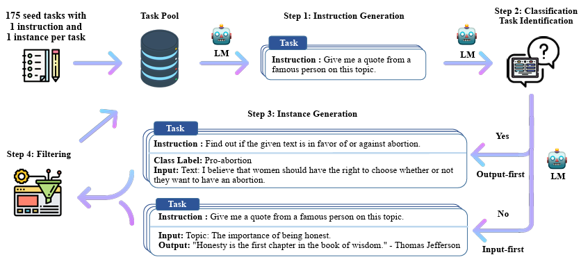

**Mechanism.** The process is:

1. **Base model:** GPT-3.
2. **Seed set:** 175 seed tasks, each with one instruction and one instance.
3. **Instruction generation:** generate new instructions.
4. **Instance generation:** generate examples for each instruction.
5. **Classification:** identify whether a generated instruction is a classification task and apply filtering.

The associated paper is **SELF-INSTRUCT: Aligning Language Models with Self-Generated Instructions**.

**Worked example.** One seed task can lead to several new instructions and input-output examples. Filtering removes unusable or repetitive records before they enter the final IFT dataset.

**Tradeoff / when not to use.** Synthetic expansion reduces authoring cost but can amplify model errors, repetition, and bias. Human validation or strong filtering remains necessary when the data will shape a deployed assistant.

---

## Part 3 · Parameter efficient fine-tuning (PEFT)

### Parameter efficient fine-tuning (PEFT): why?

**What it is.** PEFT adapts a large pretrained model by tuning only a small subset of its parameters rather than updating the full model.

**Why it is needed.** As models grow, full fine-tuning can exceed consumer-hardware memory and compute limits. Storing an independent full-size model for every downstream task also makes deployment expensive.

**Before/after.** Full fine-tuning stores one complete updated model per task. PEFT keeps one shared base model and stores small task-specific trainable components.

**Mechanism.** PEFT can reduce the number of trainable parameters, optimizer states, checkpoint bytes, and task-specific deployment copies. It does not mean that the frozen base model disappears; it remains part of inference.

**Worked example.** One shared 7B base plus three small task adapters can replace three separately stored 7B fine-tuned copies, while each request selects the adapter for its task.

**Tradeoff / when not to use.** PEFT is attractive when hardware, storage, or multi-task serving is constrained. Full fine-tuning may still be preferable when the task is far from the base model's capabilities and the full update is affordable.

### Parameter efficient fine-tuning (PEFT): three categories

**What it is.** PEFT methods can be grouped according to where the trainable change is introduced.

**Why it is needed.** The categories make the engineering choice explicit: add a module, update selected existing weights, or reparameterize the update so fewer values are trained.

**Mechanism.**

- **Addition:** add trainable modules, such as prompt tuning, prefix tuning, and adapters.
- **Selective tuning:** tune selected existing parameters, such as layer freezing, BitFit, and Diff pruning.
- **Reparameterization:** learn an efficient update form, such as LoRA.

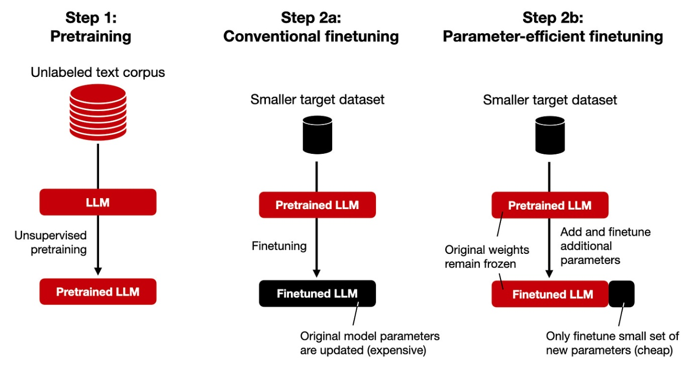
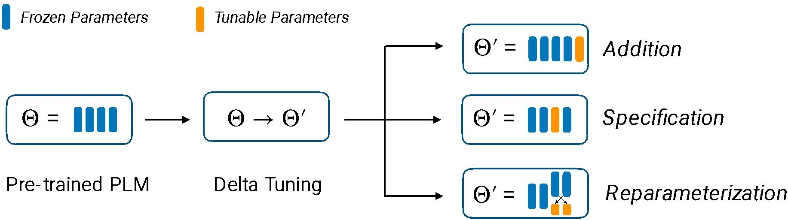

**Worked example.** With layer freezing, most original weights remain fixed and only selected layers train. With an adapter, a small new module is added. With LoRA, a low-rank factorization represents the update rather than storing the full update matrix.

**Tradeoff / when not to use.** Addition methods add modules to the forward pass; selective methods may restrict adaptation to particular layers; reparameterization methods depend on the update being representable efficiently. Choose based on task shift, memory budget, and serving design.

### Adapters

**What it is.** Adapters are lightweight trainable modules inserted into a pretrained transformer while the pretrained backbone remains frozen.

**Why it is needed.** A small bottleneck module can specialize a shared model without creating a full new copy of the backbone for every task.

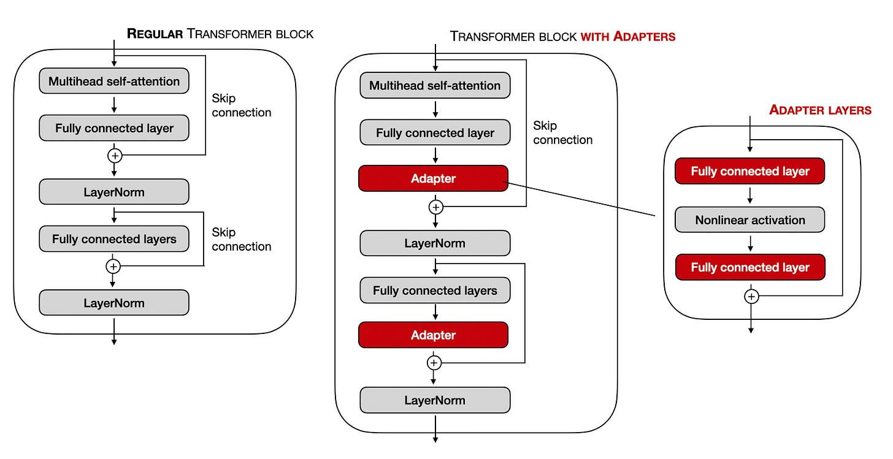

**Mechanism.** A standard bottleneck adapter performs:

1. down-projection from the model hidden size to a smaller bottleneck;
2. a nonlinear activation;
3. up-projection back to the hidden size;
4. a residual connection.

**Worked example.** For hidden size 1024 and bottleneck size 24:

```text
adapter parameters = 1024 × 24 + 24 × 1024
                   = 49,152   (excluding biases)
```

A fully connected 1024-to-1024 layer would have:

```text
1024 × 1024 = 1,048,576 parameters
```

**Tradeoff / when not to use.** Adapters reduce trainable parameters but add module operations and task-specific components to the model. They are useful for many task variants sharing one backbone; a single full fine-tuned model may be simpler when only one task is needed.

---

## Part 4 · LoRA

### Regular Finetuning

**What it is.** Regular or full fine-tuning directly changes the pretrained weight matrix.

**Why it is needed.** Updating all weights gives the model maximum freedom to fit the new task, but the update can be extremely large.

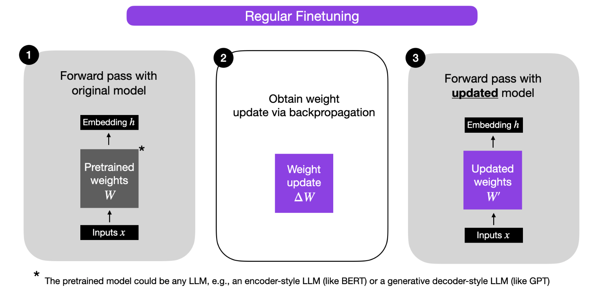
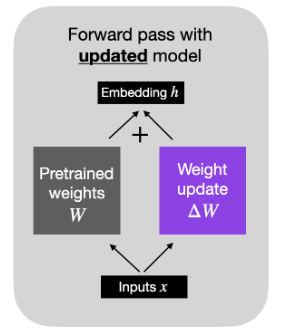

**Mechanism.** If `W` is the pretrained weight matrix and `ΔW` is the learned update:

```text
ΔW = α (−∇_W L)
W′ = W + ΔW
h  = W x + ΔW x
```

**Worked example.** A `4096 × 4096` update contains:

```text
4096 × 4096 = 16,777,216 parameters
```

The larger the weight matrix, the more memory is needed for the update and its optimizer states.

**Tradeoff / when not to use.** Full fine-tuning is expressive but expensive to train, save, and deploy per task. It is reasonable when the model must move substantially and the compute/storage budget supports a complete copy.

### Low-Rank Adaptation

**What it is.** LoRA assumes that a useful adaptation update lies largely in a lower-dimensional subspace. Instead of learning every entry in `ΔW`, it learns two smaller matrices whose product approximates it.

**Why it is needed.** Many entries in a high-dimensional update can be redundant. A low-rank representation can retain the important direction of change with far fewer trainable parameters.

**Mechanism.** Factor the update as `ΔW = W_A W_B`; the small shared inner dimension is the rank `r`.

**Worked example.** Consider:

```text
ΔW = [10 20 30]
     [20 40 60]
     [ 5 10 15]
```

There are 9 stored entries, but row 2 is `2 ×` row 1 and row 3 is `0.5 ×` row 1. Only one row of information is independent, so this matrix has rank 1. LoRA uses this kind of redundancy to represent an update compactly.

The idea is related to **PCA** and **SVD**, which approximate a high-dimensional matrix or dataset with a lower-dimensional representation.

**Tradeoff / when not to use.** A smaller rank reduces trainable parameters but may not capture a task shift that needs many independent update directions. Increasing rank improves capacity but reduces the memory advantage.

### Low Rank Adapters - LoRA

**What it is.** LoRA is a PEFT method that freezes the pretrained matrix and trains a low-rank correction alongside it.

**Why it is needed.** The correction can be much smaller than the original matrix, reducing trainable and stored task-specific parameters.

**Mechanism.** Let the pretrained weight be `W ∈ R^(A×B)`. LoRA freezes `W` and learns:

```text
ΔW = W_A W_B
W_A ∈ R^(A×r)
W_B ∈ R^(r×B)
```

The hidden representation becomes:

```text
h = W x + ΔW x
  = (W + W_A W_B) x
```

The inner dimension `r` is much smaller than `A` and `B`. Some presentations write the two factors in the opposite order; the essential point is the same: two small matrices replace one full update matrix.

**Worked example.** If `A = 10,000`, `B = 20,000`, and rank `r = 8`, the factor matrices contain:

```text
10,000 × 8 + 8 × 20,000 = 240,000 trainable parameters
```

instead of:

```text
10,000 × 20,000 = 200,000,000 parameters
```

That is approximately a **99.88% reduction** for this layer's update.

**Tradeoff / when not to use.** LoRA saves trainable parameters and storage, but its rank limits adaptation capacity. It also leaves the full base model required for inference unless the update is merged into a copy of the weights.

### Example: LoRA parameter reduction

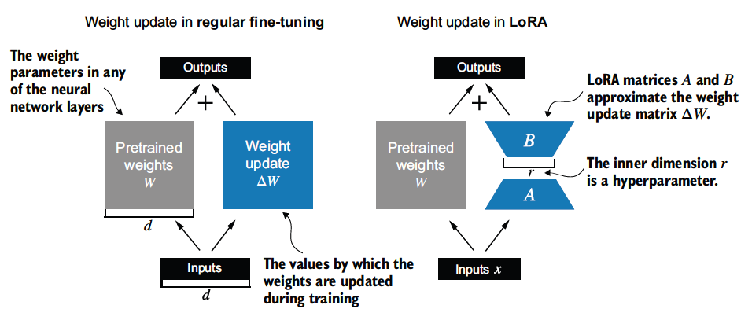

The parameter-count example uses a full update requiring **200,000,000 parameters**, LoRA rank **8**, and **240,000 LoRA parameters**, giving an approximately **99.88% reduction**.

The calculation is reproducible:

```text
full update = 10,000 × 20,000 = 200,000,000
LoRA update = 10,000 × 8 + 8 × 20,000 = 240,000
reduction   = 1 − 240,000 / 200,000,000 ≈ 99.88%
```

### Initialization

**What it is.** LoRA initialization chooses the factor values so that the adapted model initially behaves like the original pretrained model.

**Why it is needed.** Starting with a zero update avoids an abrupt behavior change when the adapter is attached to a pretrained model.

**Mechanism.** Create two small matrices `A` and `B`. Initialize `A` randomly and `B` to zero, so the product is zero at the start:

```text
B A = 0
```

The forward pass combines the frozen base term and the scaled LoRA update:

```text
h = W x + (α / r) B A x
```

Here `r` controls the rank and `α` controls the update scale through `α/r`. During backpropagation, only the LoRA factors are optimized; the pretrained weights remain frozen.

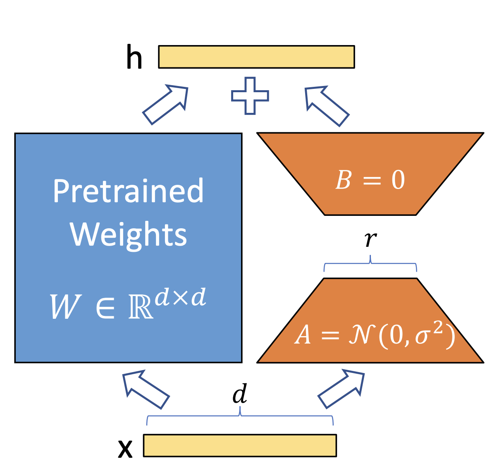

**Worked example.** At initialization, `B = 0`, so the update term contributes zero and the output equals `W x`. After training begins, the factor product gradually adds a task-specific correction.

**Tradeoff / when not to use.** Zero initialization of one factor stabilizes the starting behavior, but rank and scaling still need tuning. A poorly chosen rank can underfit, while an overly large rank reduces the PEFT benefit.

### Multi-tenant serving - LoRA

**What it is.** Multi-tenant LoRA serving uses one shared base model with several task-specific LoRA adapters.

**Why it is needed.** Storing a complete fine-tuned model for every task duplicates the expensive base weights. A shared base plus small adapters reduces storage and can serve multiple tasks through one system.

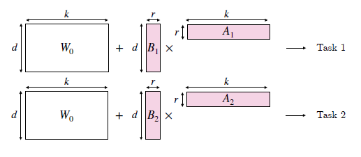

**Mechanism.** For task `i`, the output can be written as:

```text
h = x W₀ + (α/r) x Bᵢ Aᵢ
  = x (W₀ + (α/r) Bᵢ Aᵢ)
```

Store **1 base model + N LoRA adapters**, rather than **N full fine-tuned models**.

**Worked example.** A request for Task 1 loads the shared base with adapter `A₁/B₁`; a request for Task 2 uses the same base with `A₂/B₂`. The base is reused while the adapter changes.

**Tradeoff / when not to use.** Adapter multiplexing saves storage and supports many tenants, but serving infrastructure must manage adapter loading, batching, isolation, and compatibility with the base checkpoint.

---

## Part 5 · Quantization and QLoRA

### Quantization

**What it is.** Quantization reduces the precision used to store or compute model parameters, such as changing 32-bit floating-point values to 8-bit integers.

**Why it is needed.** Fewer bits reduce model storage and can reduce memory bandwidth and latency. The price is approximation error and possible quality loss.

**Mechanism.** The formats include FP32, BF16, FP16, INT8, FP8, NF4, and INT4. Their roles differ:

| Format | Total bits | Type | Typical use |
| --- | ---: | --- | --- |
| FP32 | 32 | Float | Old standard and high-precision reference |
| BF16 | 16 | Float | Stable modern training |
| FP16 | 16 | Float | Mixed-precision training and inference |
| INT8 | 8 | Integer | Fast inference with scaling |
| FP8 | 8 | Float | Newer fast training/inference |
| NF4 | 4 | Float-like | QLoRA base-model storage |
| INT4 | 4 | Integer | Extreme fast-inference compression |

**Worked example.** Replacing 32-bit storage with 8-bit storage reduces the raw storage per parameter from 4 bytes to 1 byte before accounting for scales, metadata, and runtime buffers.

**Tradeoff / when not to use.** Lower precision saves memory but can reduce numerical accuracy. Use higher precision for sensitive training or when the quality loss from compression is unacceptable.

### QLoRA

**What it is.** QLoRA applies PEFT to a quantized model: the pretrained base is loaded in **4-bit precision**, while trainable LoRA adapters remain in a higher precision such as **16-bit**.

**Why it is needed.** The base model may be too large for full-precision fine-tuning on available hardware. QLoRA reduces base-model memory while retaining trainable adapters for task adaptation.

**Mechanism.** Keep the base weights compressed, dequantize them for the matrix operation, and update only the higher-precision LoRA factors.

**Mechanism — three technical tricks.**

- **4-bit NormalFloat (NF4):** designed to be information-theoretically appropriate for normally distributed neural-network weights.
- **Double quantization:** quantize the quantization constants/scales as well as the weights, reducing scale-storage overhead.
- **Paged optimizers:** use CUDA unified memory so optimizer states can move between GPU and CPU memory during memory pressure, helping prevent crashes during spikes.

**Worked example.** A frozen base model can occupy 4-bit storage while the adapter matrices are trained in BF16/FP16. The base is not updated, but its dequantized values participate in the forward computation.

**Tradeoff / when not to use.** QLoRA is memory-efficient but adds dequantization and quantization-management complexity. Use a higher-precision method when the task is highly sensitive to numerical error and the memory budget allows it.

### QLoRA fine-tuning

**What it is.** QLoRA fine-tuning is the execution path that combines a frozen quantized base with trainable higher-precision adapters.

**Why it is needed.** Separating base storage from adapter updates makes large-model adaptation possible under a tighter memory budget.

**Mechanism.** During QLoRA fine-tuning:

1. the pretrained base model is stored in frozen **4-bit NF4** format;
2. small trainable LoRA matrices are added in higher precision, typically **BF16/FP16**;
3. quantized base weights are **dequantized on the fly** to compute precision for matrix operations;
4. gradients flow through the computation, but only the LoRA adapter weights are updated.

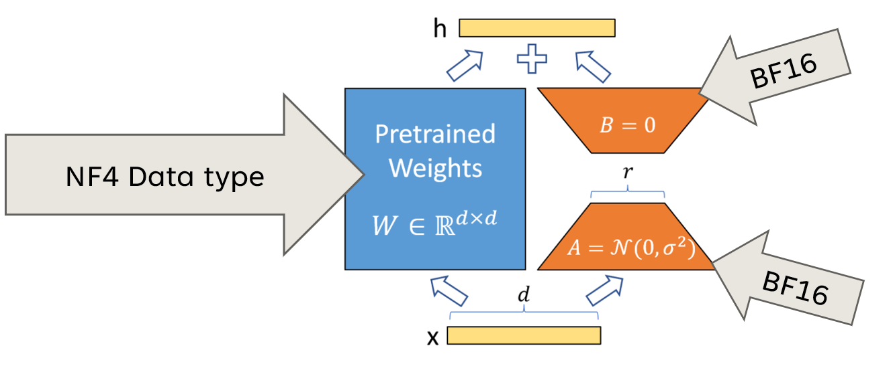

**Worked example.** The same LoRA adapter design can be used with a full-precision or quantized base. QLoRA changes the base storage and compute path; it does not change the basic idea of training low-rank adapter factors.

**Tradeoff / when not to use.** QLoRA can approach higher-precision fine-tuning quality with much lower memory use, but the implementation must handle quantization, dequantization, optimizer paging, and mixed precision correctly.

---

## Part 6 · Model merging

### Model Merging: Combining Fine-Tuned Models

**What it is.** Model merging combines two or more compatible fine-tuned models or adapters into a single model.

**Why it is needed.** If several tuned models share a compatible architecture and base checkpoint, merging can produce one deployable model instead of serving every component model separately.

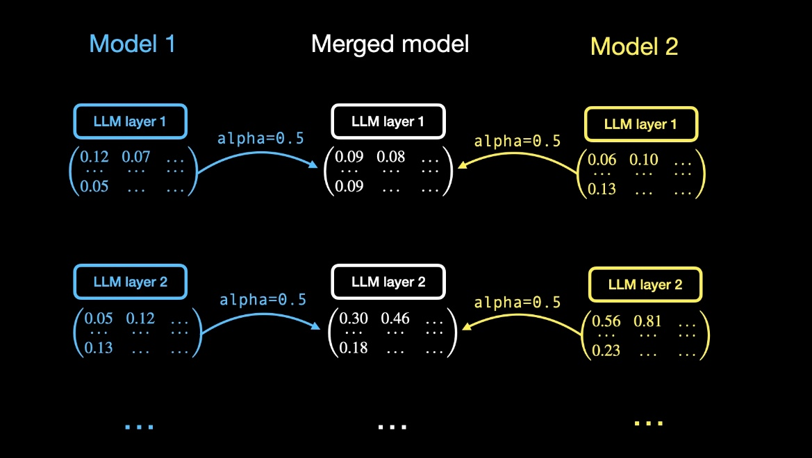
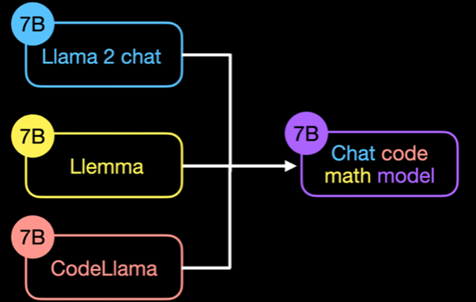

**Mechanism.** A simple method is linear weight averaging: corresponding parameters from multiple fine-tuned models are averaged. The models should generally share the same base architecture and often the same base checkpoint.

**Worked example.** If two compatible models have corresponding weights `W₁` and `W₂`, a simple merged weight is:

```text
W_merged = 0.5 W₁ + 0.5 W₂
```

The result is one model, unlike ensembling, where several models remain separate and inference cost grows with the number of models.

The **Model Soups** paper reported that averaging multiple fine-tuned models can improve accuracy and robustness without increasing inference time.

**Tradeoff / when not to use.** Merging is sensitive to architecture, checkpoint, task interference, and coefficient choice. Do not merge incompatible models simply because their names or task domains look similar; validate the merged model against each target capability.

---

## References

References for this class include:

- **Hands-On Large Language Models: Language Understanding and Generation**, Jay Alammar and Maarten Grootendorst, Chapter 12;
- **Speech and Language Processing**, Daniel Jurafsky and James H. Martin, Chapters 7 and 10;
- Lightning AI tutorials on LoRA and Llama adapters;
- Sebastian Raschka articles on fine-tuning and instruction data;
- **Prefix-Tuning: Optimizing Continuous Prompts for Generation**;
- **Parameter-Efficient Transfer Learning for NLP**;
- **Multitask Prompted Training Enables Zero-shot Task Generalization**;
- **LoRA: Low-Rank Adaptation of Large Language Models**;
- **QLoRA: Efficient Finetuning of Quantized LLMs**;
- **Model soups: averaging weights of multiple fine-tuned models**;
- **SELF-INSTRUCT: Aligning Language Models with Self-Generated Instructions**;
- **Super-NaturalInstructions: Generalization via Declarative Instructions on 1600+ NLP Tasks**.

## Self-study / Lab / Build

No dedicated lab notebook is included with this Class 4 material. A useful self-study sequence is:

1. Convert one raw SQuAD-style example into the stable JSONL schema and render it with a model-specific template.
2. Compare zero-shot, one-shot, and few-shot prompts for the same task without updating weights.
3. Calculate adapter parameters for several bottleneck sizes and compare them with a full 1024×1024 layer.
4. Reproduce the LoRA rank-8 calculation: 200,000,000 full-update parameters versus 240,000 LoRA parameters and approximately 99.88% reduction.
5. Implement a tiny LoRA layer with frozen `W`, trainable `A` and `B`, rank `r`, and scale `α/r`; verify that zero-initialized `B` makes the initial output equal to the base model.
6. Explain why QLoRA stores the base in 4-bit NF4 but keeps adapters in higher precision.

---

*Scope note: this is the lecture-specific Class 4 fine-tuning note. It is not a replacement for the handout's standard Session 4 topic, Training and Attention Efficiency.*
