# AIML ZG536 · Session 05 · LLM Optimization & Serving

*Learned 05 Sep 2026*

> **Session scope:** two-phase inference; autoregressive response generation; decoding and sampling; inference bottlenecks; and KV-cache and memory optimization with MQA, GQA, and MLA.

## Why this matters

An LLM does not produce a complete answer in one indivisible step. It reads a prompt, computes a probability distribution for the next token, chooses one token, adds it to the context, and repeats. Serving quality depends on both the choice of token and the cost of repeating that computation many times.

This session connects the learner-facing behavior of generation to the systems concerns behind it. After reading, you should be able to explain the prefill/decode split, trace an autoregressive generation loop, compare greedy decoding with Top-K, Top-P, and temperature, identify inference bottlenecks, and explain why KV-cache design affects memory and latency.

---

## Two-phase inference process

### Prefill and decode

**Intuition.** Inference has two different workloads. **Prefill** processes the prompt that the user has already supplied. **Decode** generates new tokens one at a time after the prompt has been processed.

**Why it is needed.** Treating both phases as identical hides the main performance tradeoff. Prefill usually has more parallel work over the input sequence; decode repeatedly performs small, latency-sensitive steps while the output grows.

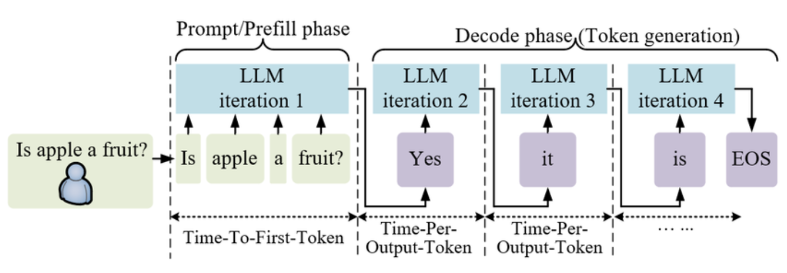

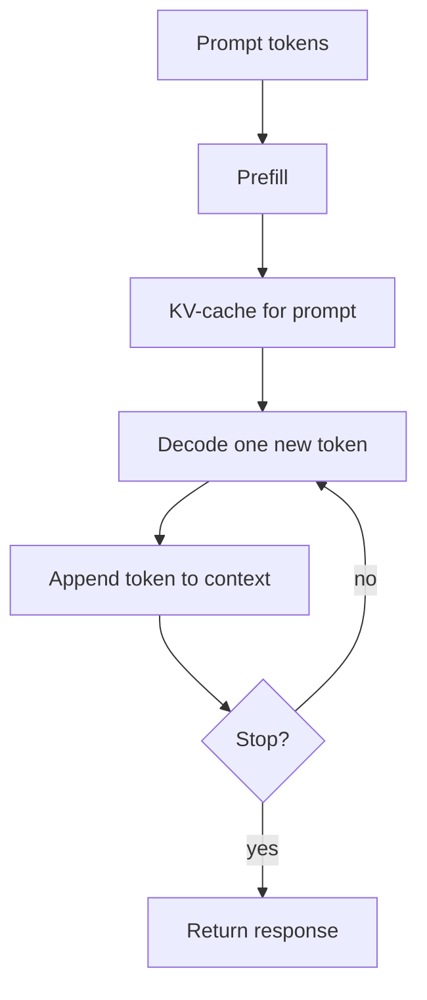

**Mechanism.** During prefill, the model processes the prompt and computes the key/value states needed by later attention. During decode, the model receives the newly selected token and reuses the cached states for earlier tokens instead of recomputing every earlier token from scratch.

A useful latency decomposition is:

$$T_{response} \approx T_{prefill} + N_{new}\,T_{decode}$$

where $N_{new}$ is the number of generated tokens. The approximation omits queueing, batching, network, and stopping overhead, but it makes the two costs visible. The inter-token interval is also called **Time-Per-Output-Token (TPOT)**; it is distinct from **Time-To-First-Token (TTFT)**.

**Worked example.** A 1,000-token prompt followed by a 200-token answer has one prefill phase over the 1,000 input tokens and roughly 200 decode steps. A long prompt mainly increases time-to-first-token; a long answer mainly increases the repeated decode cost.

**Tradeoff / when not to use.** Caching and incremental decoding are valuable when the response is generated token by token. For a single short request, the engineering complexity may dominate the saving. For long prompts, large batches, or interactive serving, the distinction is essential.

### Input tokens and context window

**Intuition.** The context window is the sequence of tokens available to the model for the current computation. It contains the prompt and the tokens generated so far.

**Why it is needed.** The model can condition only on what fits into the available context. As the generated answer grows, it consumes part of the same budget that held the original prompt.

**Mechanism.** If the prompt has $N_{prompt}$ tokens and the response has $N_{new}$ tokens, a simple budget check is:

$$N_{prompt} + N_{new} \leq N_{context}$$

A request can fail or be truncated when the prompt plus the requested maximum output exceeds the model's context limit.

**Worked example.** With a context window of 2,048 tokens (2048 token positions), a 1,600-token prompt leaves at most 448 token positions for the generated response if no truncation or sliding strategy is used.

**Tradeoff / when not to use.** Increasing context can improve access to long documents, but it increases attention and memory pressure. Do not send the maximum possible context by default; retrieve, summarize, or trim irrelevant material when the task does not need it.

### Chat prompt templates

**Intuition.** A chat prompt is structured conversation text, not merely a string containing the latest user sentence. Roles tell the model which message is the system instruction, user request, or assistant response region.

**Why it is needed.** A model is trained with a particular conversation format. If the serving template uses the wrong role markers or special tokens, the model may misunderstand the boundaries even when the visible words look correct.

**Mechanism.** Common logical roles are:

- `system` — the **system prompt**, behavior, and constraints;
- `user` — the request or input;
- `assistant` — the response region being generated.

The exact serialized form differs across model families. A ChatML-like form may use markers such as `<|im_start|>` and `<|im_end|>`. A Llama-style form, including **Llama 3.1**, may use header markers such as `<|start_header_id|>` and `<|end_header_id|>`. These are formatting conventions, not universal tokens shared by every model.

**Worked example.** The same visible conversation can be serialized in two different ways:

```text
system: You are a helpful assistant.
user: Fix this code for me:
def greet(name)
    return "Hello, " + name
assistant:
```

The malformed function header can produce `SyntaxError: expected ':'`. A model-specific template then wraps the roles with the control markers expected during training. The serving stack must select the template expected by the chosen model.

**Tradeoff / when not to use.** A template improves consistency for chat models, but a template copied from another model family can damage instruction following. Do not assume that a visible `system/user/assistant` layout proves the underlying special-token format is compatible.

---

## Autoregressive response generation

### The inference loop

**Intuition.** Autoregressive generation means that each new token becomes part of the context used to predict the next token. New tokens depend on past tokens, so the output is built incrementally rather than selected all at once.

**Why it is needed.** This loop is the basic mechanism behind open-ended text generation. It also explains why output length directly affects serving latency: every additional token creates another prediction step.

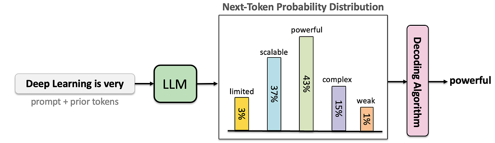

**Mechanism.** The loop is:

1. tokenize the prompt and any prior output;
2. run the model to obtain **next token probabilities**;
3. convert scores into a probability distribution;
4. apply a decoding rule to select one token;
5. append the token to the context;
6. stop at an end token, a length limit, or another stopping condition; otherwise repeat.

The model's raw output is a vector of logits. A probability distribution can be formed with softmax:

$$p_i = \frac{e^{z_i}}{\sum_j e^{z_j}}$$

where $z_i$ is the logit for token $i$ and the denominator normalizes all candidate scores so that the probabilities sum to 1.

**Worked example.** Suppose the next-token distribution assigns 43% to `powerful`, 37% to `scalable`, 15% to `complex`, 3% to `limited`, and 1% to `weak`. Greedy decoding selects `powerful`; a sampling method may select another token according to its configured rule.

**Tradeoff / when not to use.** Autoregressive decoding is flexible, but it is sequential across generated tokens. A request that needs a 500-token response generally requires many more decode iterations than one that needs 20 tokens.

### Stop or continue

**Intuition.** Generation is a loop with a decision point after every selected token. The model does not continue indefinitely because the serving system checks stopping conditions.

**Why it is needed.** Without stopping rules, the model could continue generating irrelevant or repetitive text, consume the entire context window, and waste compute.

**Mechanism.** Common conditions include:

- an end-of-turn or end-of-sequence token, such as `<|im_end|>` (the `im_end token`);
- a maximum number of new tokens;
- a stop string or stop sequence;
- a context-window limit;
- application-specific validation or cancellation.

A concrete serving configuration can record `Output count: 13 tokens`, `Max New Tokens: 14`, and a `Max Context` / `Total Context` limit separately. The output cap, not the current output count, is the upper bound for the decode loop.

**Worked example.** A response may stop immediately after emitting an end-of-turn marker. If the marker is never produced, `max_new_tokens = 128` still bounds the decode loop.

**Tradeoff / when not to use.** A short output cap controls cost but can truncate a valid answer. A generous cap avoids premature truncation but increases worst-case latency and cost. Choose stopping conditions from the task's required output, not from a single universal default.

---

## Decoding strategies and sampling

### Decoding overview

**Intuition.** The model supplies probabilities; decoding decides how those probabilities become one concrete token. Decoding therefore controls the balance between determinism, diversity, coherence, and risk.

**Why it is needed.** The highest-probability token is not always the best continuation for a creative task, while unrestricted random sampling can select implausible tail tokens. Different decoding rules deliberately keep different parts of the distribution.

**Mechanism.** The main choices in this session are:

| Strategy | Selection rule | Typical behavior |
|---|---|---|
| Greedy | Choose the highest-probability token | Deterministic and focused |
| Beam Search | Keep several partial sequences and extend the strongest candidates | Search-oriented, less diverse than sampling |
| Random sampling | Sample from the distribution | Diverse, but can select weak tokens |
| Top-K | Sample only from the K highest-probability tokens | Fixed-size candidate set |
| Top-P / nucleus | Sample from the smallest cumulative-probability set reaching P | Adaptive candidate set |
| Temperature | Reshape probabilities before another decoding rule | Sharper or flatter distribution |

**Worked example.** If the distribution is `[0.43, 0.37, 0.15, 0.03, 0.01]`, greedy always takes the first token. Top-K with $K=3$ keeps the first three. Top-P with $P=0.80$ also keeps the first two here because $0.43 + 0.37 = 0.80$; a different distribution can make the retained set larger or smaller.

**Tradeoff / when not to use.** Decoding parameters are not a substitute for a capable model or a clear prompt. Tune them against the task and evaluation target; do not equate higher randomness with higher quality.

### Beam Search

**Intuition.** Beam Search keeps several partial continuations instead of committing to only one token path. At each step it expands the strongest candidates and retains a fixed number of beams.

**Why it is needed.** Greedy decoding can make a locally good choice that leads to a weaker complete sequence. Keeping multiple candidates gives the search a chance to recover from that early choice.

**Mechanism.** With beam width $B$, maintain up to $B$ partial sequences, score their extensions using accumulated log-probabilities, prune weaker candidates, and return the strongest completed sequence. The beam width is a search budget, not a probability threshold.

**Worked example.** With beam width 3, the decoder can retain three partial continuations after the first token, expand all three at the next step, and prune back to the best three combined paths. It is different from Top-K: Top-K filters candidate tokens at one step, whereas Beam Search tracks multiple whole sequences across steps.

**Tradeoff / when not to use.** Beam Search was central to early sequence-to-sequence machine translation. Modern chat generation often favors sampling for diversity, while search is returning in reasoning systems that need to explore multiple solution paths. Larger beams cost more compute and can still produce bland or repetitive text.

### Greedy decoding

**Intuition.** Greedy decoding chooses the single token with the highest current probability. It is the simplest possible decision rule.

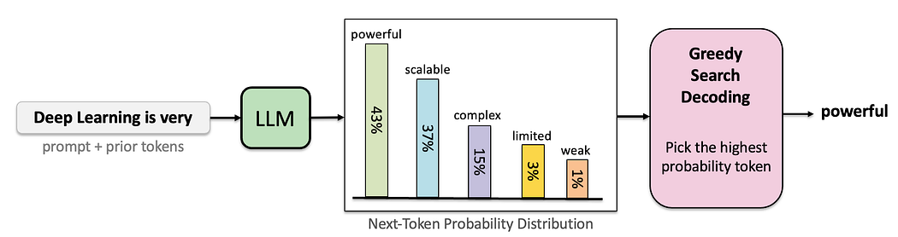

**Why it is needed.** Greedy decoding is a useful baseline because it is deterministic, easy to reproduce, and has no sampling parameter to tune.

**Mechanism.** At each step, greedy selection chooses the token with the highest current probability:

$$\hat{w}_t = \arg\max_w P(w\mid w_1, w_2, \ldots, w_{t-1})$$

The selected token is appended to the context, and the model computes the next distribution. The **Repeat context window** then includes the newly selected token.

**Worked example.** With probabilities `powerful: 0.43`, `scalable: 0.37`, `complex: 0.15`, `limited: 0.03`, and `weak: 0.01`, greedy selects `powerful`.

**Tradeoff / when not to use.** Greedy Search is stable but myopic: a locally highest-probability token is not necessarily globally optimal and can lead to a poor continuation. It may also produce repetitive or low-creativity text. It is a sensible baseline for constrained or factual outputs, but not always the best choice for creative generation.

### Random sampling

**Intuition.** Random sampling treats the model's distribution as a lottery: tokens with higher probability are more likely, but lower-probability tokens can still be selected.

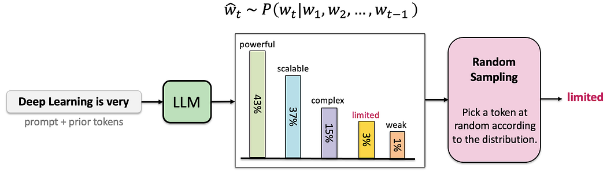

**Why it is needed.** Sampling introduces controlled variation across otherwise identical requests. That is useful when several continuations can be acceptable.

**Mechanism.** Draw one token from the categorical distribution:

$$w_t \sim P(w_t\mid w_1, w_2, \ldots, w_{t-1})$$

All candidate tokens remain eligible unless another rule removes them first.

**Worked example.** A distribution with a long low-probability tail can produce an odd token even when several sensible tokens dominate. Repeating the same prompt with the same model can therefore yield different outputs.

**Tradeoff / when not to use.** Unrestricted sampling can select incoherent tail tokens. Use a constrained sampler such as Top-K or Top-P when diversity is useful but the full tail is too noisy.

### Top-K sampling

**Intuition.** Top-K keeps exactly the K most likely tokens and discards the rest before sampling.

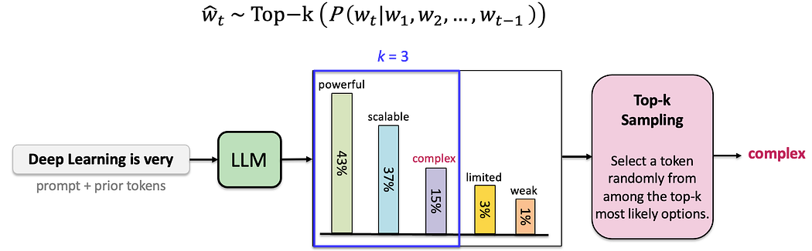

**Why it is needed.** Top-K removes the low-probability tail while retaining more than one candidate. It gives a fixed-size control over the sampling pool.

**Mechanism.** Sort the candidate tokens by probability, retain the first K, set all other probabilities to zero, and renormalize the retained values so they sum to 1. Greedy decoding is the special case **Top K = 1**.

**Worked example.** If the top five probabilities are `0.43, 0.37, 0.15, 0.03, 0.01`, then $K=3$ retains `0.43, 0.37, 0.15`. Their total is:

$$0.43 + 0.37 + 0.15 = 0.95$$

The normalized probabilities become approximately `0.4526, 0.3895, 0.1579`.

**Tradeoff / when not to use.** A small K can remove useful alternatives and reduce diversity. A large K can reintroduce noisy tail tokens. Top-K is less adaptive than Top-P because it always keeps the same number of candidates even when the distribution is sharp or flat.

### Top-P or nucleus sampling

**Intuition.** Top-P keeps the smallest set of highest-probability tokens whose cumulative probability reaches a chosen threshold P.

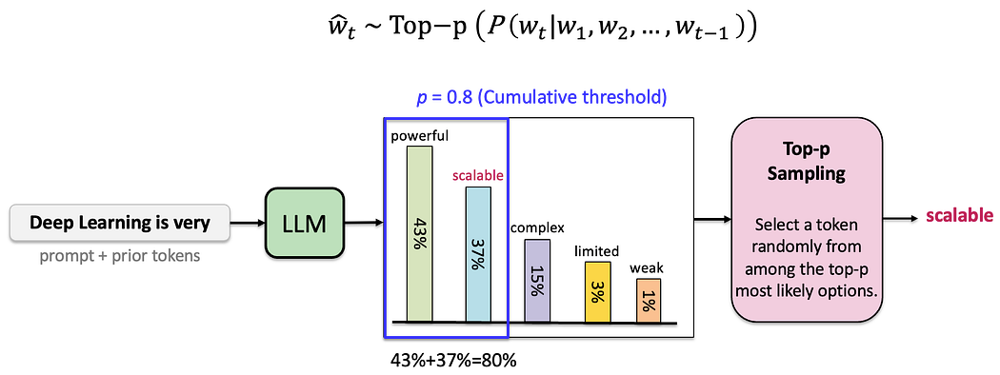

**Why it is needed.** The number of sensible alternatives changes from step to step. Top-P adapts the candidate-set size to the shape of the current distribution instead of always keeping K tokens.

**Mechanism.** Sort tokens from highest to lowest probability, accumulate them until the total reaches P, discard the remaining tail, and renormalize the retained tokens. The threshold is cumulative, not the probability of each individual token.

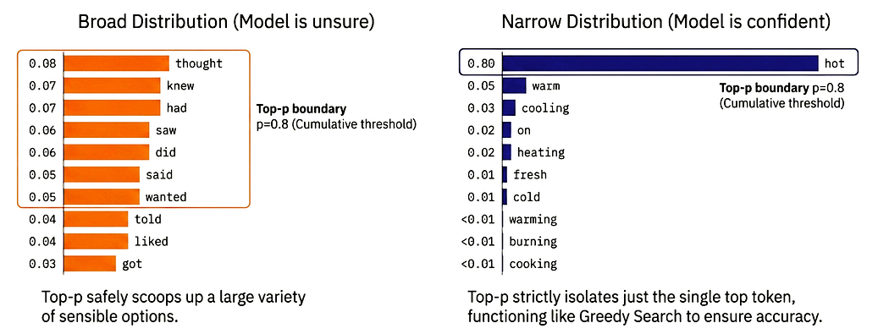

For $P=0.8$, a narrow distribution may retain only the dominant token or a few close alternatives. A broad distribution may retain many tokens before reaching the same cumulative threshold.

**Worked example.** Imagine the prompt: `The hero opened the chest and found...` If `gold` has probability 40%, Greedy Search returns `gold` immediately. Top-K with $K=3$ or Top-P with $P=0.80$ can instead sample among `gold`, `a`, and `treasure`, while excluding lower-ranked candidates such as `magic`. In the numeric comparison, **Top-k = 3** and **Top-p = 0.8** retain the same three tokens because `40% + 25% + 15% = 80%`. After filtering, compute the **renormalized probability** for each retained token so the values sum to 1. In the separate numeric example `0.40, 0.25, 0.17, 0.13, 0.05`, the first three sum to:

$$0.40 + 0.25 + 0.17 = 0.82$$

Therefore Top-P with $P=0.8$ retains those three tokens and renormalizes them by 0.82:

| Token probability before filtering | Probability after renormalization |
|---:|---:|
| 0.40 | $0.40 / 0.82 \approx 0.4878$ |
| 0.25 | $0.25 / 0.82 \approx 0.3049$ |
| 0.17 | $0.17 / 0.82 \approx 0.2073$ |

**Tradeoff / when not to use.** A lower P is more focused and usually more coherent; a higher P is more diverse but can admit weaker candidates. At $P=1$, there is effectively no nucleus truncation. Do not assume that the same P produces the same number of candidates at every step.

### Temperature

**Intuition.** Temperature is a **hyperparameter** that reshapes the probability distribution before a decoding rule samples from it. It does not choose a token by itself.

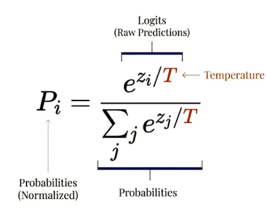

**Why it is needed.** The same model can be made more focused or more exploratory without changing its weights. Temperature is therefore a simple serving-time control for the diversity/coherence tradeoff.

**Mechanism.** Given logits $z_i$ and temperature $T$:

$$p_i(T) = \frac{e^{z_i/T}}{\sum_j e^{z_j/T}}$$

Equivalently, the logits are divided by $T$ before softmax:

- $T = 1$ leaves the original distribution unchanged;
- $T > 1$ flattens the distribution and gives lower-probability tokens more chance;
- $T < 1$ sharpens the distribution and makes high-probability tokens dominate.

Temperature is normally combined with a selection rule such as Top-K, Top-P, or random sampling.

**Worked example.** Compare the same prompt under three temperatures:

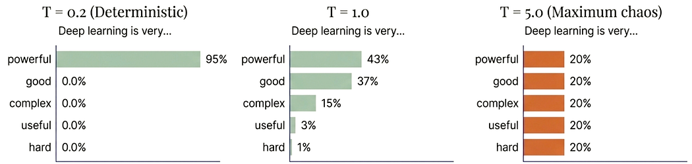

- At $T=0.2$, `powerful` receives 95% and the output is nearly deterministic.
- At $T=1.0$, the distribution is `43%, 37%, 15%, 3%, 1%`.
- At $T=5.0$, the example flattens the five candidates to approximately 20% each, producing maximum variety but very weak control.

A separate calculation uses `gold` with 40% probability and `magic` with 3% probability. Their example logits are 2.5 and `-1.1`. At $T=1.5$, divide the logits by 1.5, giving approximately 1.67 and −0.73, then recompute softmax over the complete candidate set. In the worked result, `gold` falls to about 20% and `magic` rises to about 15%.

**Tradeoff / when not to use.** High temperature can make a response creative but incoherent; low temperature can make it reliable but repetitive. For factual or structured output, begin with a focused setting and validate the result rather than assuming a temperature value is universally safe.

---

## Inference bottlenecks

### Latency and throughput

**Intuition.** A serving system must answer two questions separately: how long one request waits, and how many requests the system can complete over time.

**Why it is needed.** A system can have good average throughput and still feel slow to an interactive user. It can also have low single-request latency but poor throughput under concurrent load.

**Mechanism.** Useful measures include:

- **time to first token (TTFT):** delay before the first generated token;
- **inter-token latency (ITL):** delay between generated tokens;
- **end-to-end latency:** time from request to final token;
- **tokens per second:** generation rate;
- **throughput:** requests or tokens completed per unit time;
- **tail latency:** a high percentile such as P95 or P99, which exposes overloaded cases.

Prefill mainly influences TTFT. Decode repeatedly influences ITL and total generation time. Queueing and batching affect both.

**Worked example.** A chatbot that delivers the first token quickly but pauses 300 ms between later tokens may feel worse than one with a slightly slower first token and a steady 40 ms ITL.

**Tradeoff / when not to use.** Optimizing only tokens per second can hurt TTFT or tail latency. Choose the metric that matches the product: interactive chat, batch summarization, offline evaluation, and long-form generation have different priorities.

### Memory and bandwidth pressure


**Intuition.** Inference is limited not only by arithmetic. Moving model weights and cached attention states through memory can be the dominant cost.

**Why it is needed.** A model may fit in parameter storage but still exceed accelerator memory once weights, activations, KV-cache, batching, and temporary workspaces are included.

**Mechanism.** The main pressure points are:

- model weights;
- **KV cache memory** for every active request;
- activations and temporary buffers;
- batch size and concurrent sequences;
- context length and generated length;
- memory bandwidth between storage and compute units.

GPU architecture determines whether the bottleneck is arithmetic, memory bandwidth, or capacity. A 70B model can move roughly 140 GB of FP16 weights per full forward pass; repeated weight movement makes decode **memory-bandwidth-bound**. These are the three recurring **LLM inference bottlenecks**: limited VRAM, memory bandwidth, and repeated computation.

**Worked example.** If a server doubles the number of active sequences while keeping context length unchanged, the KV-cache requirement roughly doubles. If it doubles both active sequences and context length, the cache pressure can grow by roughly four times before accounting for padding or implementation details.

**Tradeoff / when not to use.** More concurrency can improve utilization but can also trigger out-of-memory failures or tail-latency spikes. Capacity planning must measure realistic sequence lengths instead of using only the model's maximum context.

---

## KV-caching and memory optimization

### KV-cache growth

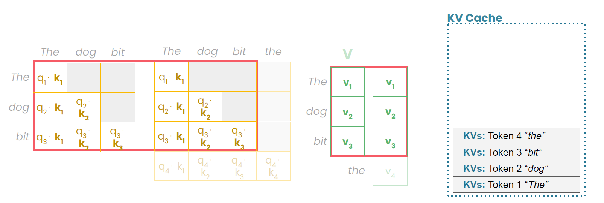

**Intuition.** Attention uses keys and values from previous tokens. During autoregressive decoding, those states do not need to be recomputed for every new token, so the server stores them in a KV-cache.

**Why it is needed.** Without a KV-cache, generating token $t$ would repeatedly redo attention-state work for tokens 1 through $t-1$. The **KV cache** lives in **GPU memory**. Its memory usage grows **linearly** with the number of cached tokens, active sequences, layers, and stored K/V heads. Once the **QKV calculations** produce a key and value, the runtime can **Store K & V** and reuse them. A transformer has **one KV cache per attention layer**. The visual progression separates **Phase 1: Prefill** from **Phase 2: Decode**; past KVs do not change while new query states are computed.

**Mechanism.** A simplified KV-cache memory estimate is:

$$M_{KV} \approx 2 \times B \times L \times T \times H_{KV} \times d_{head} \times s$$

where:

- $2$ accounts for keys and values;
- $B$ is the number of active sequences;
- $L$ is the number of transformer layers;
- $T$ is the cached token count;
- $H_{KV}$ is the number of key/value heads;
- $d_{head}$ is the head dimension;
- $s$ is bytes per cached element.

This estimate ignores allocator overhead, padding, compression, and implementation-specific layouts, but it exposes the main scaling variables.

**Worked example.** If the number of active sequences doubles from 8 to 16 while all other variables stay fixed, the KV-cache estimate doubles. Reducing $H_{KV}$ through an attention design change reduces the cache per token and can make a larger batch fit in memory.

**Tradeoff / when not to use.** KV-caching trades memory for lower decode computation. For very short sequences or one-off computation, the benefit may be small. For long generations and concurrent serving, disabling it usually causes unnecessary recomputation.

### Multi-head, multi-query, and grouped-query attention

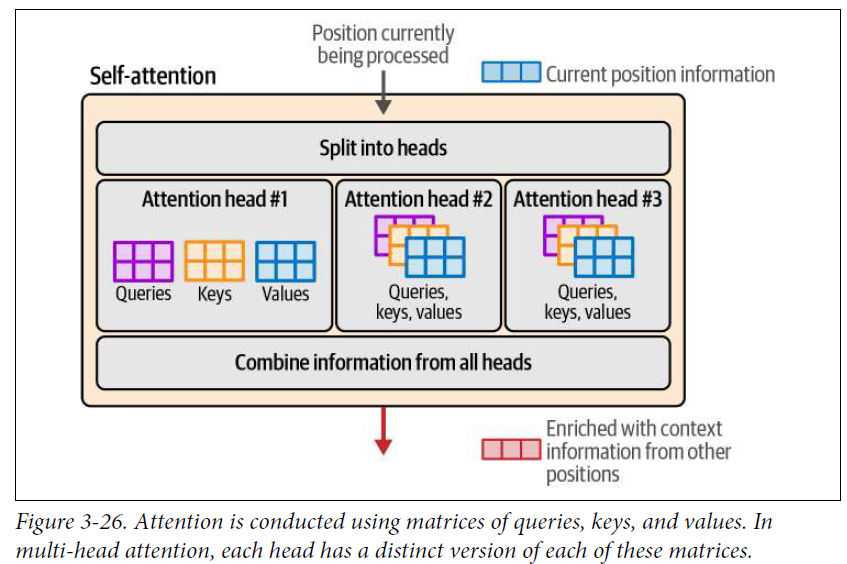

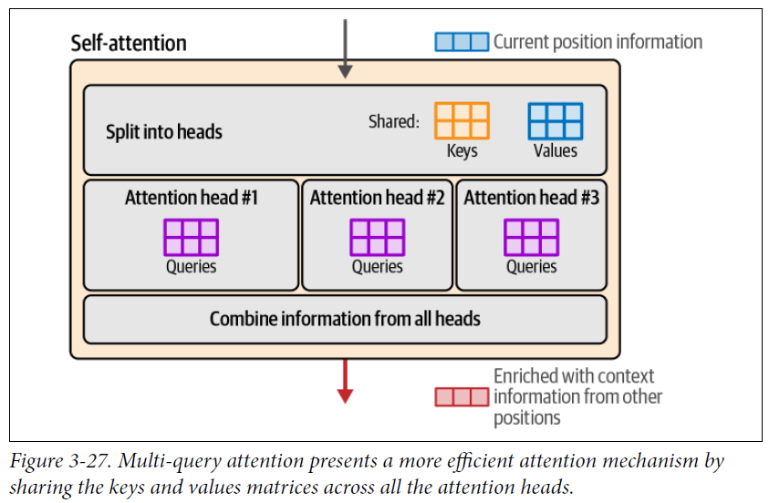

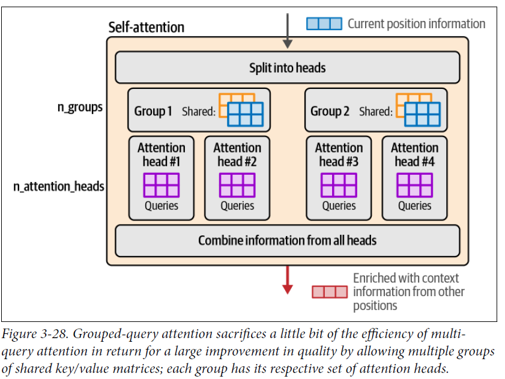

**Intuition.** Query heads determine how many attention views the model can use, while key/value heads determine how many cached K/V copies must be stored. Sharing K/V heads reduces cache size.

**Why it is needed.** Standard multi-head attention can create a large KV-cache because each query head has its own key and value heads. Serving-oriented variants reduce this memory cost while retaining multiple query heads.

**Mechanism.**

- **Multi-head attention (MHA):** each query head has a corresponding key/value head; KV-cache size is largest among these choices.
- **Multi-query attention (MQA):** many query heads share one key head and one value head; KV-cache size is greatly reduced.
- **Grouped-query attention (GQA):** query heads are divided into groups, and each group shares a K/V head; it is a middle point between MHA and MQA.

The cache reduction comes from lowering $H_{KV}$ in the memory estimate, not from removing the model's query heads.

**Worked example.** Suppose a model has 32 query heads. MHA may cache 32 K/V head pairs; MQA caches one pair; GQA might cache 8 pairs shared by groups of four query heads. The exact quality and speed impact depends on the trained model, but the memory relationship is direct.

**Tradeoff / when not to use.** Fewer K/V heads reduce memory traffic but can reduce representational flexibility or quality if the model was not trained for that sharing pattern. The serving system cannot safely change MHA into MQA after training as a free configuration toggle.

### Multi-head latent attention

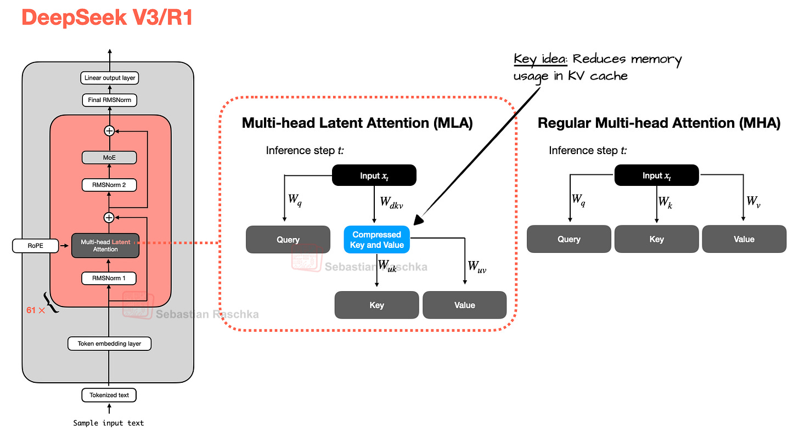

**Intuition.** Multi-head latent attention (MLA) reduces the information stored for future attention by caching a compressed latent representation rather than storing the full K/V state in the ordinary form.

**Why it is needed.** KV-cache memory becomes a major constraint for long context and high concurrency. Compressing the cached representation can allow more active sequences or longer contexts within the same memory budget.

**Mechanism.** The model projects attention information into a lower-dimensional latent space and reconstructs the needed query/key/value information through the trained attention path. The exact implementation is model-specific; the important serving idea is that the cached state is smaller than a full uncompressed K/V copy.

**Worked example.** If two serving designs represent the same history with 1.0 units and 0.25 units of cached state per token, the second design can hold roughly four times as many cached tokens in the same raw cache budget, before overhead and quality effects.

**Tradeoff / when not to use.** MLA is an architectural design that must be supported by the trained model and runtime. It is not a generic post-training compression switch. Use the model's supported implementation and validate quality, latency, and cache memory together.

### Optional MLA detail

In one illustrative configuration, standard MHA stores $2\times128\times128=32,768$ K/V numbers per token per layer, while an MLA latent cache stores 576 numbers—about 55 times fewer before implementation overhead. This is a configuration example, not a universal MLA ratio. The **MLA math** is a **factorization**: compress the hidden state into a latent $c_{KV}$, cache the latent, and reconstruct or algebraically absorb the key/value projections when attention runs.

MLA is associated with architectures such as DeepSeek-V2/V3 and related model families. Other models may choose GQA instead; the trained architecture determines which cache representation is valid.

---

## Self-study / Lab / build

There is no dedicated lab notebook attached to this session. Use the following exercises:

1. Trace a 5-token response by hand: write the context after each selected token and mark the stopping condition.
2. For probabilities `[0.40, 0.25, 0.17, 0.13, 0.05]`, calculate the retained and renormalized probabilities for Top-K with $K=3$ and Top-P with $P=0.8$.
3. Compare the same distribution at $T<1$, $T=1$, and $T>1$ and explain which tokens become more or less likely.
4. Separate TTFT, ITL, and end-to-end latency for a mock chatbot request; identify which phase contributes to each measure.
5. Calculate how a twofold increase in active sequences changes the KV-cache estimate when every other variable is fixed.
6. Explain the memory relationship among MHA, GQA, and MQA without claiming that a trained model can switch between them for free.
7. Implement a small categorical sampler with greedy, Top-K, Top-P, and temperature controls. Log the retained candidate set and normalized probabilities before selecting each token.

---

*Exam: this session is in scope for the **closed-book mid-semester test** (sessions 1–7). Full evaluation, weights, dates, and course logistics live in [`536-master.md`](../536-master.md).*
