# AIML ZG536 · Session 06 · LLM Optimization & Serving

*Learned 05 Sep 2026*

> **Session scope:** model compression; generation acceleration; production serving patterns; and production metrics and economics.

## Why this matters

A useful model can still be too large, too slow, or too expensive to serve. Optimization changes the representation of the model, avoids unnecessary large-model work, or manages shared hardware more effectively. The right choice depends on the quality target, latency target, workload shape, and memory budget.

After this session, you should be able to compare quantization, pruning, and distillation; trace speculative decoding; explain how PagedAttention reduces cache fragmentation; distinguish continuous batching from static batching; and choose serving metrics that expose both user experience and infrastructure cost.

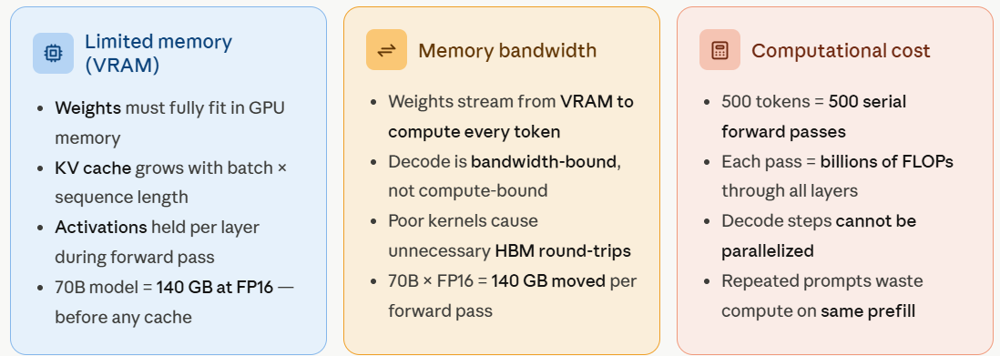

---

## Model compression

### Compression as a systems decision

Compression reduces the amount of data or computation needed to run a model. It can reduce VRAM, memory traffic, compute, or serving latency, but every compression method trades something against accuracy, flexibility, engineering effort, or calibration cost.

| Approach | Main mechanism | Typical benefit | Main risk |
|---|---|---|---|
| Quantization | Represent weights or activations with fewer bits | Smaller weights, lower memory traffic, faster supported kernels | Accuracy loss or hardware constraints at very low precision |
| Pruning | Remove parameters, connections, heads, or blocks | Fewer effective parameters or operations | Unstructured sparsity may not speed up ordinary hardware |
| Distillation | Train a student to reproduce a teacher | Smaller, cheaper, lower-latency model | Teacher-generation and student-training cost; capability loss |
| Weight sharing / factorization | Reuse or factor parameters | Lower storage and sometimes compute | Reduced representational capacity or implementation complexity |

**Tradeoff.** A smaller file is not automatically a faster model. Speed depends on whether the runtime and hardware can exploit the chosen representation.

### Quantization

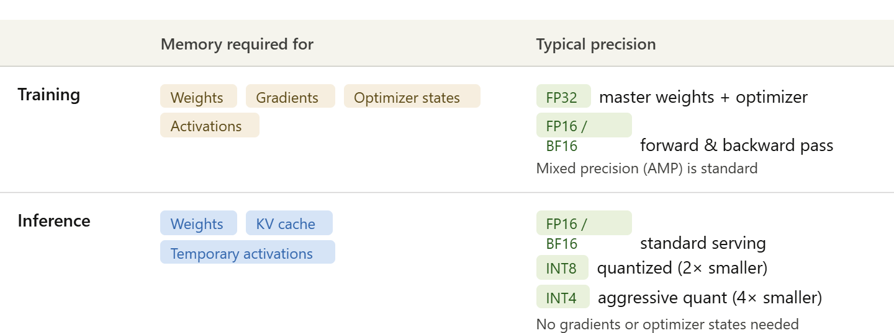

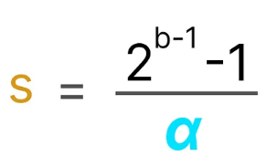

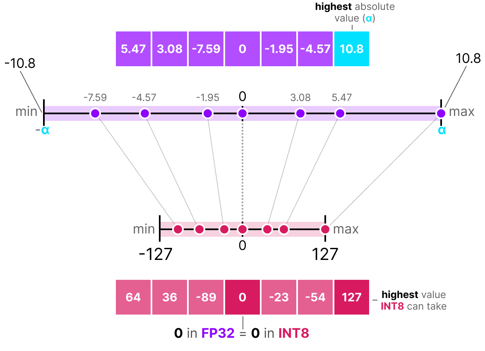

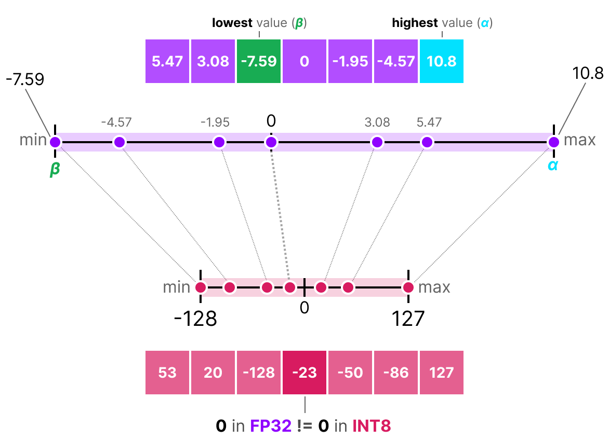

**Intuition.** Quantization maps floating-point values to a smaller set of discrete values. A model stored in INT8 or INT4 uses fewer bytes per parameter than one stored in FP16 or FP32.

**Why it is needed.** Model weights dominate memory for large models. Lowering the representation from FP16 to INT8 can approximately halve weight storage; INT4 can reduce it further, subject to scales, zero-points, packing, kernels, and accuracy effects.

**Mechanism.** A simple affine quantizer maps a floating value $x$ to a quantized value $x_q$ using a scale $s$ and, for asymmetric quantization, a zero-point $z$:

$$x_q = \operatorname{round}(x/s) + z$$

Dequantization approximately reverses the mapping:

$$\hat{x} = s(x_q-z)$$

For symmetric quantization, the range is centered around zero and the zero-point is usually fixed at zero. For asymmetric quantization, the minimum and maximum of the observed range are mapped to the available integer range.

**Calibration.** Activation ranges depend on real inputs, so post-training quantization commonly runs representative calibration sequences through the model. The quantizer records ranges and chooses scales that limit precision loss. Weight-only scales can be computed from the stored weights, while activation scales require observed activation values.

**Two training choices:**

- **Post-training quantization (PTQ):** convert an already trained model with calibration and no full retraining; fast and practical, especially at 8-bit.
- **Quantization-aware training (QAT):** simulate quantization noise during training or fine-tuning so the model adapts to low-bit behavior; more expensive but often stronger at 2–4 bits.

Weight-only W4A16, weight-plus-activation W8A8, and SmoothQuant-style activation handling make different memory, kernel, and accuracy tradeoffs.

**Worked example.** If a weight range is approximately $[-\alpha,\alpha]$ and the target signed integer range is $[-127,127]$, a symmetric scale is approximately $s=\alpha/127$. Quantizing rounds the scaled value; dequantization reconstructs an approximation, not the original exact float.

**Tradeoff / when not to use.** 8-bit quantization often preserves quality well, while 2-bit or 3-bit choices require more careful evaluation. Weight-only formats such as W4A16 reduce storage while keeping activations in higher precision; W8A8 also quantizes activations and can use integer matrix hardware. Common deployment choices include GGUF for llama.cpp and CPU/Apple-Silicon execution, NF4 for QLoRA-style 4-bit weights, FP8 on supported modern GPUs, bitsandbytes for on-the-fly experimentation, and AWQ/GPTQ for offline calibrated GPU serving. Use the format supported by the target runtime rather than assuming every GPU or CPU accelerates every bit width.

### Pruning

**Intuition.** Pruning removes parameters or computation paths that contribute less to the target workload. It may be unstructured, structured by rows or blocks, or applied to attention heads, layers, or experts.

**Why it is needed.** If the remaining structure matches hardware-supported sparse kernels, pruning can reduce memory traffic and computation. If it produces scattered individual zeros that the hardware ignores, the model may become smaller without becoming faster.

**Mechanism.** A pruning workflow selects a saliency rule, removes weights or structures, optionally fine-tunes or retrains to recover quality, and exports a sparse representation. Structured pruning is easier to accelerate because the runtime can skip whole blocks or components.

**Worked example.** Removing 30% of individual weights does not guarantee a 30% speedup. Removing complete blocks that the kernel can skip is more likely to reduce actual execution time, but it may damage quality more.

**Tradeoff / when not to use.** Prune only when the deployment stack can exploit the resulting sparsity and when post-pruning evaluation is available. Do not treat a lower nonzero count as a measured serving improvement.

### Compression pipeline

A practical compression pipeline is:

1. define the quality, memory, latency, and throughput targets;
2. choose a representative calibration and evaluation set;
3. compress the model using quantization, pruning, distillation, or a combination;
4. validate task quality, perplexity or loss, safety behavior, and long-context behavior;
5. benchmark the actual target hardware and runtime;
6. package the representation with its tokenizer, scales, kernels, and configuration;
7. monitor quality and serving metrics after deployment.

The final choice is an engineering tradeoff, not a single “best compression” method.

### Knowledge distillation

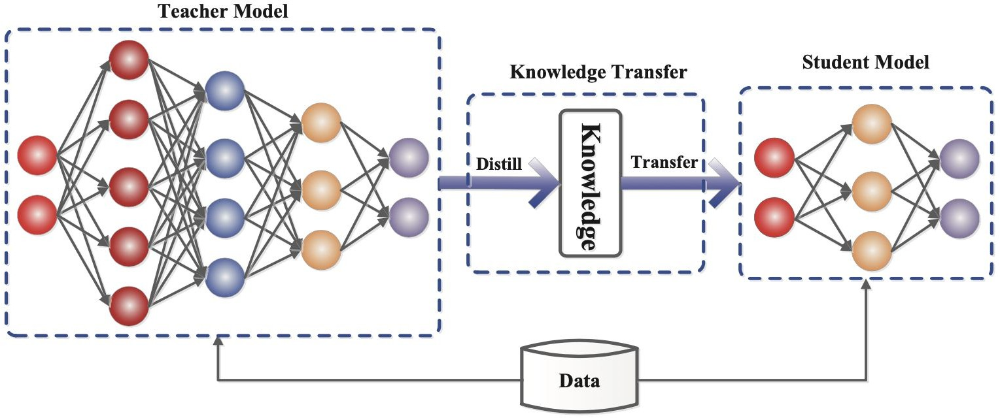

**Intuition.** A large **teacher** model supplies behavior or probability information that a smaller **student** model learns to reproduce. The deployed student can require less VRAM and produce tokens with lower latency.

**Why it is needed.** Quantization changes numerical representation; distillation changes the model that is served. Distillation is useful when the teacher has capabilities or behavior that must be transferred into a smaller task-specific model.

**Mechanism.** Two common forms are:

- **Response distillation:** the teacher generates input–output examples, and the student is trained on those examples with ordinary supervised next-token loss. Teacher logits are not required.
- **Logit distillation:** the student matches the teacher's output distribution, often with a temperature-scaled soft-target loss such as KL divergence. This requires access to teacher logits.

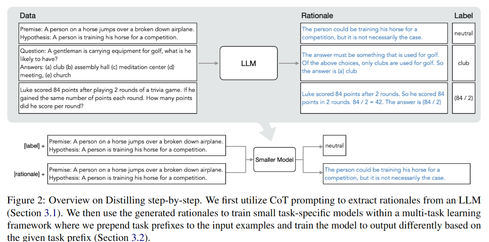

A distillation dataset can contain ordinary labels, teacher responses, rationales, or task-specific **Synthetic Data**. Examples of compact students distilled from larger model families include Llama-3.2 1B/3B variants, DeepSeek-R1-Distill-Qwen/Llama variants, and Gemma-2-2B. The student must still be evaluated on held-out tasks rather than assumed to inherit every teacher capability.

### Distillation compared with alternatives

| Approach | Training cost | Data requirement | Serving effect | Typical use |
|---|---|---|---|---|
| Prompt engineering | No model training | Few-shot examples or instructions | Longer prompts can increase latency | Rapid behavior and format control |
| Retrieval-augmented generation | Retrieval/indexing cost | External domain corpus | Retrieval adds latency and context tokens | Dynamic or private facts |
| Supervised fine-tuning (**SFT**) | Medium to high | Labeled instruction–response pairs | Shorter prompts can reduce latency | Stable task behavior |
| Distillation | Teacher generation plus student training | Teacher responses, sequences, or logits | Compact student lowers latency and VRAM | Compressing a production-proven model |

The deck's **Distilling Step-by-Step** example uses generated rationales as training data. This comparison makes the selection criterion explicit: distillation is expensive before deployment but can produce the lowest serving cost when the compact student is used often enough.

**Tradeoff / when not to use.** Distillation requires teacher generation and student training, and the student may lose rare knowledge, reasoning depth, or robustness. Use it when the resulting smaller model will serve enough traffic or under enough memory pressure to justify the training cost.

---

## Generation acceleration

### Speculative decoding

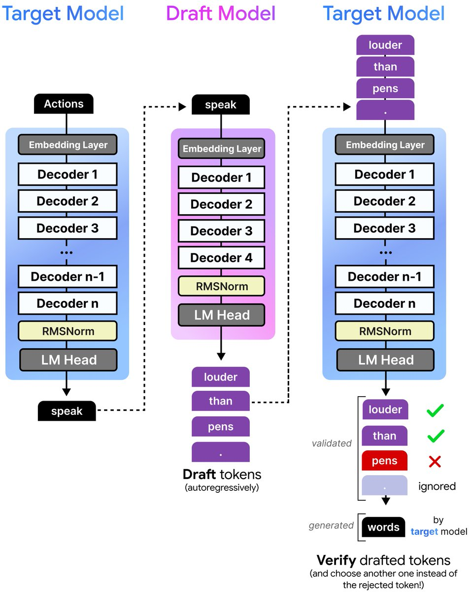

**Intuition.** Speculative decoding uses a small, fast draft model to propose several tokens and a large target model to verify them in one forward pass. Accepted draft tokens avoid separate target-model passes.

**Why it is needed.** Speculative decoding targets the **Memory Bottleneck** in standard LLM inference: the large target model repeatedly moves weights while producing one token at a time. If a cheap draft model predicts several likely tokens, the target can check them together and sometimes emit multiple tokens per target pass.

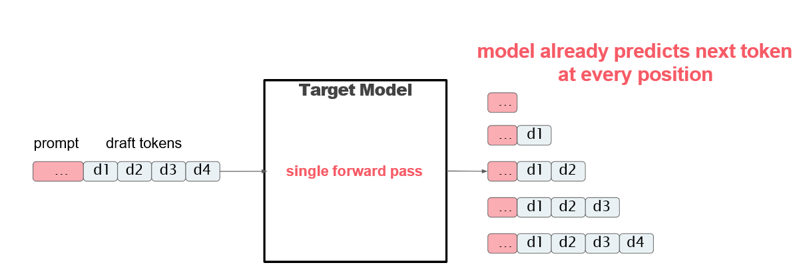

**Mechanism.** The **Token speculation** loop is:

1. The draft model generates $K$ tokens.
2. The target model processes the prompt plus those draft tokens in one parallel verification pass; **Runs in parallel** across positions.
3. The system asks **How do you verify tokens?** by comparing target probabilities $p(x)$ with draft probabilities $q(x)$ from left to right. This is **Rejection sampling**: the target either accepts the draft token or rejects it according to the probability rule.
4. Tokens that the target accepts are emitted.
5. At the first rejection, the system samples a replacement from the adjusted target distribution and discards later draft tokens from that iteration.

The simple acceptance condition is:

$$q(x) \leq p(x) \Rightarrow \text{keep }x$$

When $q(x)>p(x)$, accept the token with probability $p(x)/q(x)$; this is the **p(accept)** rule. Otherwise reject with probability:

$$1-\frac{p(x)}{q(x)}$$

The **Rejected tokens** are not all discarded blindly: the first rejected token may be replaced by resampling, while later draft tokens are discarded.

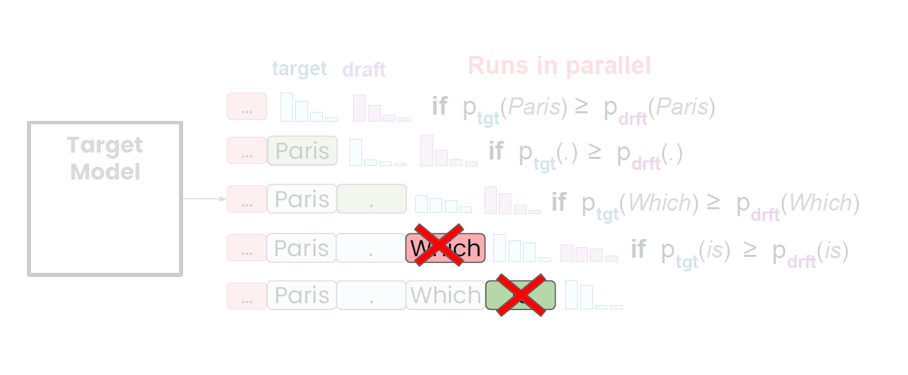

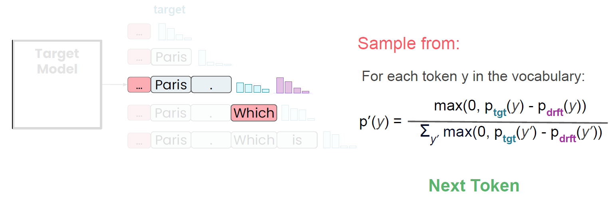

The adjusted resampling distribution is proportional to:

$$p'(y) \propto \max(0,p_{tgt}(y)-p_{drft}(y))$$

**Worked example.** Suppose the draft proposes **K = 3** tokens. For one rejected token with $p=0.30$ and $q=0.50$, the **reject probability** is $1-0.30/0.50=0.40$. A uniform draw of $u=0.25$ rejects it, so the system samples a replacement. The replacement distribution's **Replacement chance** can be `0.857` for `floor` and `0.143` for `lawn` in the small vocabulary example. If the current iteration accepts `the` and then replaces `mat` with `floor`, **Two tokens generated** are emitted from one target forward pass; later draft positions are not reached after the rejection, and the next iteration must **resample** from the new context.

**Tradeoff / when not to use.** Speedup depends on draft quality, target–draft compatibility, proposal length, and verification overhead. A poor draft model causes frequent rejection and little benefit. Speculative decoding preserves the target distribution when implemented with the acceptance/resampling rule; it is not merely “trust the small model.”

---

## Production serving patterns

### PagedAttention

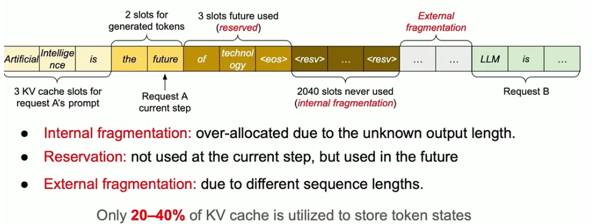

**Intuition.** A serving system handles many requests whose output lengths are unknown. Reserving one large contiguous KV-cache region per request wastes memory and creates internal and external fragmentation.

**Why it is needed.** Only a fraction of a statically reserved cache may hold token states at a given time. PagedAttention stores the **KV cache** in a shared pool and lets each request grow through a block table. This addresses **Static KV Cache Management** and its internal/external fragmentation problem.

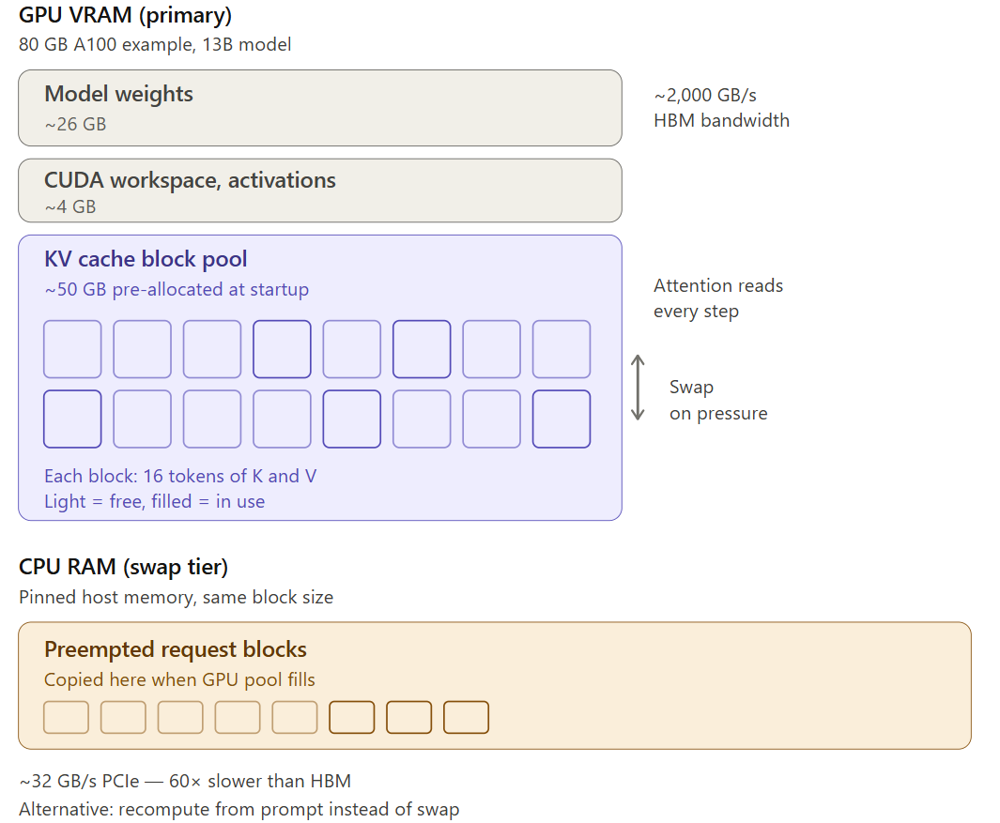

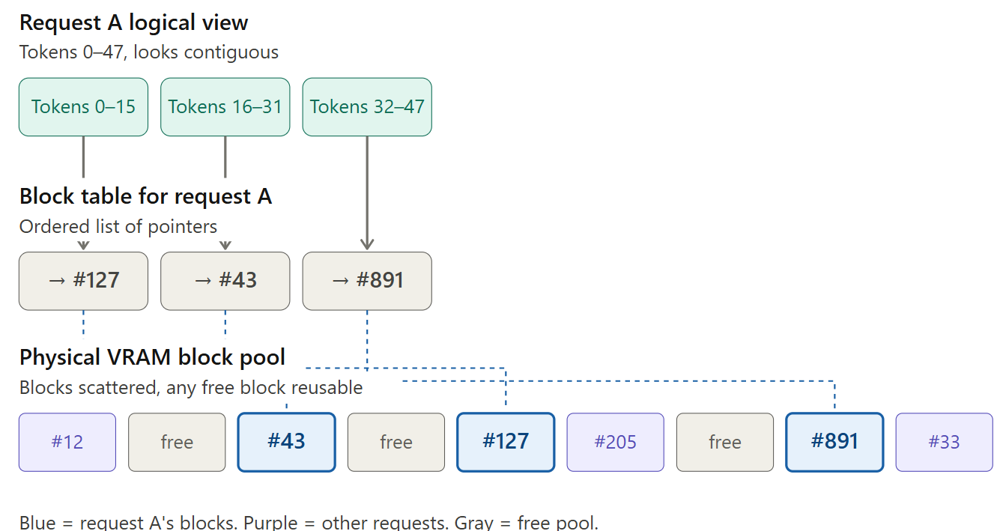

**Mechanism.**

- Divide KV states into fixed-size blocks.
- Store blocks wherever free GPU memory is available.
- Maintain a per-request block table mapping logical token ranges to physical blocks.
- Gather the required blocks during attention, even when they are non-contiguous in physical memory.
- Reuse free blocks as requests finish and new requests arrive.

This is memory management for serving; it does not change the model's attention mathematics.

**Tradeoff / when not to use.** Block tables and paging add runtime complexity. Swapping blocks to CPU memory may avoid an out-of-memory failure but can be much slower than recomputing from the prompt because PCIe transfer is slow. A serving runtime should measure recomputation, swapping, preemption, and tail latency together.

### Continuous and in-flight batching

**Intuition.** Static batching waits for a fixed group of requests and often keeps finished sequences occupying a batch slot. Continuous batching admits new work between decode iterations and removes completed sequences promptly.

**Why it is needed.** Requests have different prompt lengths and output lengths. Scheduling at token or iteration boundaries improves GPU utilization and prevents long requests from forcing short requests to wait for an entire batch.

**Mechanism.** A scheduler repeatedly:

1. admits requests that fit the memory budget;
2. runs prefill or decode work for the current active set;
3. removes completed or cancelled requests;
4. admits waiting requests into newly available capacity;
5. repeats while respecting fairness and latency targets.

Paged KV-cache blocks make this dynamic admission easier because requests do not need one large contiguous allocation.

**Tradeoff / when not to use.** Aggressive batching can improve throughput while worsening TTFT or tail latency. Admission control needs a memory budget, maximum context/output policy, cancellation handling, and fairness rules.

### Additional serving techniques

The serving overview also names several techniques that are useful as a comparison landscape:

| Technique | Role |
|---|---|
| Operator fusion | Combine compatible operations to reduce kernel launches and intermediate memory traffic |
| Custom kernels | Implement a workload-specific GPU path when general kernels leave performance unused |
| Tensor parallelism | Split tensor operations across accelerators |
| Pipeline parallelism | Place different model stages on different accelerators |
| Quantized KV | Store cached keys and values in a lower-precision representation when the model/runtime supports it |
| Prefix caching / KV reuse / shared prompt cache | Reuse the computation or KV state for repeated prompt prefixes |

These are overview-level serving techniques here. Their benefit depends on the runtime, interconnect, cache correctness, and workload repetition pattern.

### Chunked prefill

**Intuition.** A very long prompt can monopolize the GPU during prefill. Chunked prefill divides that prompt into smaller pieces so decode work from interactive requests can be interleaved.

**Why it is needed.** Without chunking, one large prefill can delay already-active requests and cause a poor time-to-first-token or inter-token-latency experience.

**Mechanism.** Split a long prompt into chunks, process a bounded chunk per scheduling step, preserve the intermediate KV state, and allow eligible decode work between chunks. The chunk size controls the balance between prefill efficiency and responsiveness.

**Tradeoff / when not to use.** Very small chunks add scheduling overhead; very large chunks recreate the blocking behavior. Tune chunk size against prompt lengths, active decode load, and TTFT/ITL targets.

---

## Production metrics and economics

### User-facing latency

- **TTFT:** time to first token; strongly affected by queueing and prefill.
- **ITL:** time between generated tokens; strongly affected by decode scheduling and memory bandwidth.
- **End-to-end latency:** request arrival to final token.
- **Tail latency:** P95/P99 latency, which exposes overloaded or unlucky requests.

A service can have high average tokens per second and still feel slow if TTFT or tail latency is poor.

### Capacity and cost

- **Throughput:** tokens or requests completed per unit time.
- **Concurrency:** active sequences occupying weights, workspace, and KV-cache.
- **GPU utilization:** useful only when interpreted with memory bandwidth and latency; high utilization can still violate an interactive SLA.
- **Cost per generated token:** infrastructure cost divided by useful output tokens.
- **Cost per request:** includes prompt processing, generated output, retries, queueing capacity, and idle or reserved hardware.
- **Quality-adjusted cost:** cost for an answer that meets the required quality, not merely cost for any emitted token.

A basic capacity comparison is:

$$\text{cost per output token} \approx \frac{\text{hourly accelerator cost}}{\text{useful output tokens per hour}}$$

This approximation must be measured under a realistic distribution of prompt lengths, output lengths, concurrency, failures, and batch behavior.

### Choosing an optimization

| Constraint | First questions to ask |
|---|---|
| VRAM | Can weights, KV-cache, workspace, and concurrency fit together? |
| TTFT | Is queueing or prefill dominating? Would chunked prefill help? |
| ITL | Is decode memory-bandwidth-bound? Would GQA, quantization, or speculative decoding help? |
| Throughput | Can continuous batching and paged cache management keep the GPU fed? |
| Quality | Does compression or a draft model change task accuracy, safety, or calibration? |
| Cost | Does the measured speedup offset extra engineering, hardware, and evaluation cost? |

---

## Self-study / Lab / build

1. Quantize a small vector with symmetric and asymmetric mappings and calculate the dequantization error.
2. Compare unstructured and structured pruning; explain why the same zero count can produce different speedups.
3. Trace speculative decoding for one accepted token and one rejected token, including the rejection probability and replacement distribution.
4. Draw a static contiguous KV allocation and a paged block-table allocation for two requests with different lengths.
5. Compare static batching with continuous batching for one long request and four short requests.
6. Separate TTFT, ITL, throughput, P95 latency, and cost per output token for a mock serving workload.
7. Benchmark a compressed model only after checking output quality, long-context behavior, and hardware support for its kernels.

---

*Exam: this session is in scope for the **closed-book mid-semester test** (sessions 1–7). Full evaluation, weights, dates, and course logistics live in [`536-master.md`](../536-master.md).*
