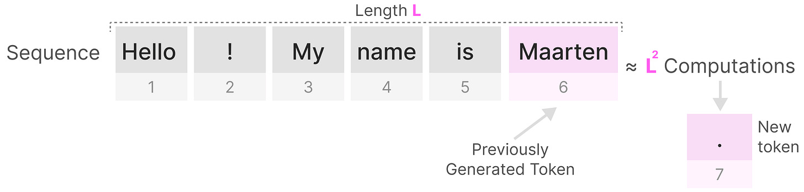
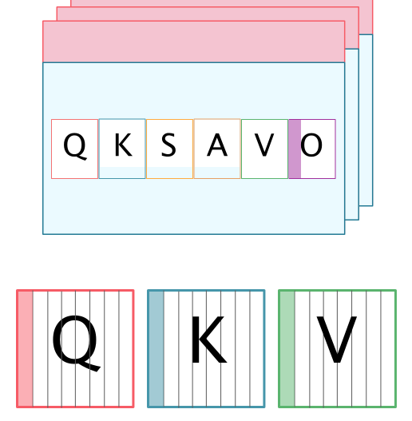

# AIML ZG536 · Session 07 · Training and Attention Efficiency

*Learned 05 Sep 2026*

> **Session scope:** memory bottlenecks; mixed-precision training; IO-aware attention with FlashAttention; long-context training with Ring Attention; and attention-efficiency variants including sliding-window, sparse, and linear attention.

## Why this matters

Attention quality is not the only constraint in a large model. Sequence length increases the amount of data that must be computed, stored, and moved. The same model can be limited by arithmetic during training, by memory traffic during inference, or by GPU memory capacity when the context and batch grow.

This session separates exact optimizations from approximate alternatives. FlashAttention keeps the exact attention result while reducing memory traffic. MQA, GQA, and MLA reduce cached state through architectural choices. Sparse, sliding-window, and linear attention reduce or replace global interactions, so their quality and capability tradeoffs must be evaluated rather than assumed.

---

## Memory Bottlenecks

### Quadratic attention

**Pros.** Full attention provides global context, associative recall, and full parallelism during training. The cost is $O(S^2)$ interaction work and memory; the source notation is **O(S²)**. The **KV cache** grows with conversation length during inference.

**Intuition.** For a sequence of length $n$, ordinary self-attention forms interactions between query positions and key positions. The score matrix therefore has roughly $n^2$ entries.

**Why it is needed.** Every token can use information from every other token, which gives full-context recall but makes long sequences expensive. Doubling sequence length can make the score-matrix work and storage grow by roughly four times.

**Mechanism.** With queries $Q$, keys $K$, and values $V$:

$$S = QK^T/\sqrt{d}$$

$$A = \operatorname{softmax}(S)$$

$$O = AV$$

### Naive attention flow

The unoptimized flow materializes the **attention score** matrix $S$—the individual **attention scores**—and applies **Softmax** to produce the **attention weights** matrix $A$. In the compact slide notation, **A = softmax**$(S)$ and **O = A V** after **S = Q K**. Writing and rereading $S$ and $A$ creates the memory traffic that the tiled algorithm avoids.

The exact attention result is useful as the reference point for every approximate variant. The matrices $S$ and $A$ are $n\times n$; during training, their intermediates and gradients increase memory pressure. During inference, a KV-cache avoids recomputing old key/value states but does not remove the cost of attending over an increasingly long context.

**Tradeoff.** Full attention offers maximum context interaction and is the quality reference point. Efficient attention methods may reduce memory or computation by changing the algorithm, sharing cached states, or approximating the interaction pattern.

### GPU memory and bandwidth

A serving or training step can be limited by:

- model weights;
- activations and saved intermediates;
- gradients and optimizer states during training;
- KV-cache during autoregressive inference;
- temporary matrices such as $S$ and $A$;
- memory bandwidth between HBM/VRAM and compute units.

A 70B model stored in FP16 requires roughly 140 GB for weights alone before activations, workspace, or KV-cache are counted. The exact requirement depends on the parameter count, representation, packing, and runtime overhead.

**Learner check.** Do not use “the model fits” to mean only that the weights fit. A complete capacity estimate includes the active batch, sequence lengths, KV-cache, temporary buffers, and the precision used by each component.

### Mixed-precision training

**Intuition.** Mixed precision uses lower-precision arithmetic for selected forward and backward operations while retaining higher-precision values where numerical stability requires them.

**Why it is needed.** Training in FP32 everywhere is expensive in memory and compute. FP16 or BF16 matrix operations can use specialized hardware more efficiently, while FP32 master weights, reductions, or optimizer states protect the update process.

**Mechanism.** A typical mixed-precision training step may use:

- FP16 or BF16 for many forward and backward matrix operations;
- FP32 master weights or accumulators for stable updates;
- loss scaling when FP16 gradients risk underflow;
- FP32 optimizer states for methods such as Adam;
- automatic mixed precision to select safe kernels and casts.

BF16 has a wider exponent range than FP16 and often reduces loss-scaling difficulty, but hardware and model behavior still need to be checked.

**Worked example.** If an optimizer stores first and second moments in FP32 while the forward pass uses BF16, the optimizer state can dominate memory even though the visible activation computation is lower precision.

**Tradeoff / when not to use.** Lower precision can produce overflow, underflow, or unstable updates. Validate loss curves, gradient statistics, convergence, and final task quality; do not change precision solely because the datatype is smaller.

---

## IO-Aware Attention

### Flash Attention

**Intuition.** **Flash Attention** computes exact softmax attention in tiles that fit into fast on-chip memory instead of materializing the full $n\times n$ score and attention matrices in slow HBM.

**Why it is needed.** Standard attention repeatedly writes and reloads large intermediate matrices. When sequence length is large, memory traffic can dominate even when the arithmetic is unchanged.

**Mechanism.** FlashAttention:

1. partitions $Q$, $K$, and $V$ into blocks;
2. loads a block into fast SRAM or shared memory;
3. computes score, softmax statistics, and weighted values for the block;
4. maintains a **running maximum** and **running sum** for each row so that softmax remains numerically stable;
5. moves to the next block without writing the full $S$ or $A$ matrix to HBM;
6. returns the same mathematical attention result.

A streaming softmax keeps a running maximum $m$ and running normalization term $\ell$ so that rows can be accumulated safely across blocks.

**What Flash Attention changes:** memory access pattern, kernel fusion, and temporary storage. The resulting attention is **Mathematically identical** to standard attention.

**What FlashAttention does not change:** model weights, the exact attention definition, or the linear growth of the KV-cache during autoregressive decoding.

A memory-hierarchy example places SRAM at roughly **13× the speed of HBM** but roughly **2000× smaller** (about 2,000× smaller). FlashAttention uses the smaller fast memory for tiles and avoids repeatedly writing the large intermediate matrices to HBM; this is **IO-awareness**.

The practical win is often a longer context that fits in memory—some implementations target **100K+ tokens**—but FlashAttention does not by itself make the quadratic attention algorithm linear. It produces the **No approximation** exact result while changing the memory path.

**Runtime support.** Common supported paths include Ampere-or-newer NVIDIA GPUs such as A100, RTX 40-series/L40, H100, and newer hardware, subject to the installed kernel and framework. PyTorch scaled-dot-product attention, Hugging Face FlashAttention backends, vLLM, and TensorRT-LLM may select optimized kernels; the startup or runtime configuration should be checked.

**Tradeoff / when not to use.** FlashAttention requires supported GPU kernels and compatible precision/runtime settings. It is an exact IO-aware optimization, not a replacement for sparse or linear attention. Confirm that the selected backend is active rather than assuming the framework chose it.

### Worked decisions

- **Accuracy-critical 2,000-token history:** use exact attention or FlashAttention. Sparse, sliding-window, and linear variants may drop long-range symptom relationships.
- **12k-token prompt with an out-of-memory error from the score matrix:** use FlashAttention to avoid materializing the full $n\times n$ matrix. This fixes the temporary score/attention matrix; it does not eliminate KV-cache growth.

### Exact versus approximate efficiency

| Method | Exact full attention result? | Main target | Main tradeoff |
|---|---|---|---|
| FlashAttention | Yes | HBM traffic and temporary memory | Hardware/kernel support |
| MQA/GQA/MLA | Exact for the trained architecture | KV-cache size and bandwidth | Architecture-level quality/capacity tradeoff |
| Sliding-window attention | No global interaction outside the window | Compute and memory | Distant tokens may be inaccessible |
| Sparse attention | No, unless the sparsity pattern covers the needed interactions | Compute and memory | Pattern may miss useful long-range links |
| Linear attention | Replaces the quadratic interaction with an associative or recurrent state | Long sequences | Different approximation and quality behavior |

---

## Long Context Training

### Ring Attention

**Intuition.** Ring Attention distributes sequence blocks across devices and circulates key/value blocks around a ring. Each device computes attention for its local queries against successive remote key/value blocks.

**Why it is needed.** A single accelerator may not have enough memory for a very long sequence's activations and attention intermediates. Partitioning the sequence allows longer contexts to be trained or processed across multiple devices.

**Mechanism.** Each device holds a query block and a local key/value block, computes a partial attention contribution, passes its key/value block to the next device, and repeats until every query block has seen the required key/value blocks. Partial softmax statistics and outputs are combined without requiring one device to hold the complete sequence.

**Tradeoff / when not to use.** Communication and synchronization become part of the critical path. Ring Attention is useful only when the interconnect and workload justify the coordination cost; it is not a free single-GPU optimization.

### Long-context evaluation

A longer context is useful only when the model can retrieve and use information across that context. Evaluate:

- exact long-range retrieval;
- position sensitivity;
- degradation under distractors;
- memory use and throughput;
- training stability and loss behavior;
- generation quality at the target context length.

Do not equate a larger context limit with reliable long-context reasoning.

---

## Attention Efficiency Variants

### Sliding-window attention

**Intuition.** **Sliding window** attention—also called sliding-window attention—lets each token attend only to a local window of nearby tokens rather than to the entire sequence.

**Why it is needed.** Local attention reduces the number of score entries and limits the working memory needed per token. It is useful when local context carries most of the signal.

**Mechanism.** Choose a window width $w$; for each query position, compute attention over only the permitted neighborhood. Stacking layers can enlarge the effective receptive field as information propagates across windows.

**Tradeoff / when not to use.** A small window can miss a distant definition, instruction, or dependency. Use global tokens, retrieval, dilation, or another long-range mechanism when distant relationships are important.

### Sparse attention

**Intuition.** Sparse attention computes only selected query–key interactions according to a fixed or learned pattern.

**Why it is needed.** If the pattern covers the important relationships, sparse attention can reduce compute and memory relative to a dense $n\times n$ matrix.

**Mechanism.** The pattern may use local blocks, strided links, global tokens, learned routing, or a combination. The pattern determines which information can interact directly.

**Tradeoff / when not to use.** A sparse pattern is an architectural assumption. It can miss a relationship that dense attention would have represented, and irregular sparsity may not map efficiently to hardware. Measure both quality and real kernel performance.

### Linear attention

**Intuition.** Linear attention rearranges or approximates the attention computation so sequence processing scales closer to $O(n)$, often by maintaining a fixed-size recurrent state rather than materializing every pairwise score.

**Why it is needed.** A fixed-size state can make very long streams more manageable than a growing quadratic score matrix or cache.

**Mechanism.** Kernelized or recurrent formulations use an associative accumulation of key/value information. The precise state update depends on the architecture; it is not equivalent to ordinary softmax attention in general.

**Tradeoff / when not to use.** Linear scaling does not guarantee the same retrieval or in-context learning behavior as dense attention. Validate long-range recall, order sensitivity, and task quality instead of selecting it from asymptotic complexity alone.

### Landscape labels beyond the core variants

The architecture overview also names **KDA (Kimi Linear)**, **NSA**, and **DSA** as newer attention-efficiency directions. The optional material refers to **DeepSeek Sparse Attention** in connection with DSA. These labels belong in the landscape comparison, but the supplied slides do not develop their algorithms enough for a full mechanism section here.

---

## Self-study / Lab / build

1. Calculate how the score-matrix size changes when sequence length grows from 2,000 to 4,000.
2. Separate training memory into weights, activations, gradients, and optimizer states; then separate inference memory into weights, KV-cache, and temporary activations.
3. Explain why FlashAttention can be exact while reducing HBM traffic.
4. Trace a tiled softmax row using running maximum and running normalization statistics.
5. Compare full, sliding-window, sparse, and linear attention for a task that requires a fact from the beginning of a long document.
6. Draw a two-device Ring Attention exchange and identify the communication step.
7. Train or evaluate one model with mixed precision and record convergence, memory, throughput, and final quality.

---

*Exam: this session is in scope for the **closed-book mid-semester test** (sessions 1–7). Full evaluation, weights, dates, and course logistics live in [`536-master.md`](../536-master.md).*
