# Software Engineering for Machine Learning · Session 01 · Foundations of ML Systems Engineering

*Learned 26 Jul 2026*

## Why this matters

This is the session that separates people who can *train* a model from people who can *ship* one — the difference that defines an ML **engineer**. Its central claim, which you'll spend a career proving true: **the model is rarely the problem; everything around it is.** Data quality, latency, cost, monitoring, fairness, the handoff between data scientists and engineers — that's where ML products actually live or die. This note gives you the vocabulary (algorithm vs model, parameters vs hyperparameters), the process (SDLC, ML pipeline, MLOps), and the judgment (the risk spectrum, when the general answer is the wrong one) to reason about real systems.

Three angles, one argument: the process history, the failure evidence (**87% of ML projects fail**), and the local-optimisation trap. Read them as one.

**Running example throughout:** **fraud detection**, used in every section — and it's the standard credit-card-fraud teaching example, so everything lines up from the start.

## Part 1 · The argument

*The two ideas the whole course is built on: that shipping a model is an **engineering** problem rather than a modelling one, and the precise sense in which **"the model is never the problem."** Read these first — everything later is a consequence of them.*

### 1. Why this course exists

**Intuition** — You can train a good model and still have no product. The gap between "the model works in my notebook" and "customers pay for this and it doesn't fall over" is the entire subject of this course, and it's an engineering gap, not an ML gap.

**The numbers** — consultants report **87% of ML projects fail**, and **53% never make it from prototype to production**.

**Worked example — the transcription start-up.** Sidney, a data scientist, publishes state-of-the-art domain-specific speech recognition and starts a company selling transcription to researchers and conference organisers. The models are genuinely excellent. The business struggles anyway:

| What went wrong | Which module fixes it |
|---|---|
| Customer audio far noisier than academic benchmarks | Requirements (M2), data quality (M5) |
| Customers want <15 min turnaround; live captioning needs to be instant — turned out **infeasible** without shipping specialised hardware to venues | Quality attributes (M2), architecture (M3) |
| Training and inference costs eat the margin; pricing took a lot of experimentation | Quality attributes, cost (M2–M3) |
| LLM features hit excessive API costs; self-hosting open models was brittle and consumed their few GPUs | Architecture (M3), deployment (M6) |
| Team had to build a website and payments they had no experience with or interest in; UX was an afterthought | From models to systems (M1) |
| Founders and hired front-end engineers **could not communicate effectively** | Interdisciplinary teams (M1) |
| Manual training scripts; nobody updated TensorFlow for a year out of fear; a model update caused a major outage and a long night reverting | Automation, versioning (M6) |
| Medical diagnoses mistranscribed **with high confidence**; African American vernacular barely intelligible | Fairness, responsible ML (M7) |
| No visibility into model performance unless a customer complained | Monitoring (M6), QA (M5) |

**Mechanism — the line to remember** — the framing after that list: *most of these challenges are not surprising and most are not unique to ML.* The model was never the problem. Every failure was an engineering failure **around** a good model.

*The whole course in one picture — the classic "hidden technical debt" point:*

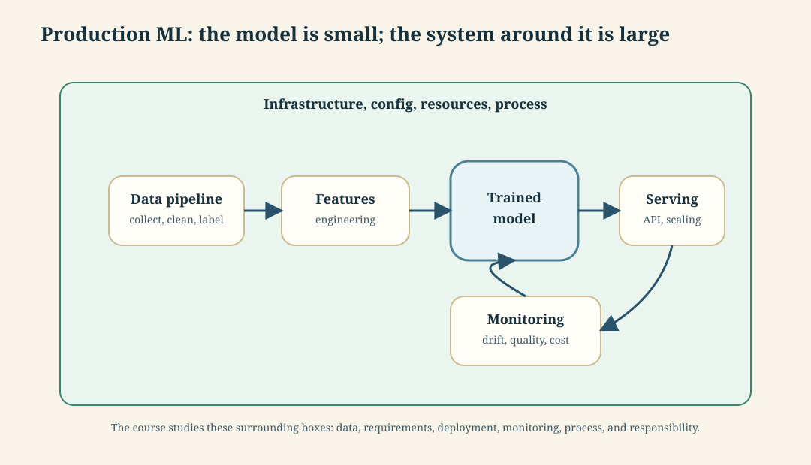

The famous finding: the ML code is a **tiny fraction** of a production ML system. The box you trained sits inside data pipelines, serving, monitoring and infrastructure — and *that* surrounding system is where the effort goes and where the failures happen. Every module of this course is one of the boxes around `ML model`.

*A car makes the proportion vivid:* the trained model is the **engine** — but a car is mostly everything else: chassis, brakes, steering, fuel system, dashboard, airbags. A brilliant engine bolted to no brakes isn't a car; a brilliant model with no data pipeline, no serving layer and no monitoring isn't a product. This course is about building the rest of the car.

**Tradeoff / when NOT to worry about this** — Not every model needs a product around it. A one-off analysis answering a board question is finished when the answer is delivered; building requirements, monitoring and deployment infrastructure for it is waste. The engineering investment is justified by *continued operation*, not by the model's existence.

---

### 2. Machine learning vocabulary

#### 2.1 Algorithm vs model, training vs inference

**Intuition** — Two different things both get called "the ML", and keeping them apart is most of the clarity in this course. The **algorithm** is the procedure that *creates* the function. The **model** is the function that gets *used*. The algorithm runs once, at training. The model runs a billion times, in production.

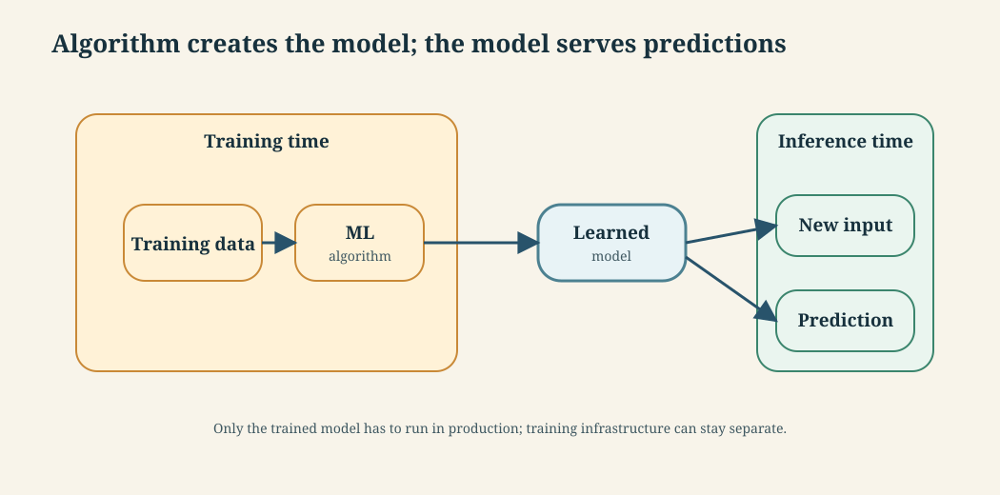

The nesting: **AI ⊃ machine learning ⊃ deep learning**, with **foundation models** a kind of large model typically produced by deep learning. Supervised ML learns from *(data, label)* pairs, where the label is the expected output.

**Mechanism — what "training" actually does.** The algorithm searches for the function that best fits the examples, then freezes it:

| # | Step | Concretely |
|---|---|---|
| 1 | Take a **hypothesis space** — the set of functions this algorithm can express | all decision trees up to depth 2 |
| 2 | Take a **loss** — a number saying how wrong a candidate is on the training data | misclassified transactions |
| 3 | **Search** that space for low loss, by whatever procedure the algorithm defines | greedy split selection · gradient descent |
| 4 | **Freeze** the winner. Its numbers are now **parameters** | the chosen thresholds and branches |

Three consequences follow directly, and each drives a later session:

- **Step 1 bounds what is achievable.** A depth-2 tree cannot express a rule needing three conditions, no matter how much data you supply. Under-fitting is a hypothesis-space problem, not a data problem.
- **Step 2 is where your values enter.** "Best" means whatever the loss says. If the loss counts every error equally, the model will happily trade one missed fraud for one false alarm — a business decision made accidentally, in a line of library code. That is session 4's subject.
- **Step 3 is a search, so it is not deterministic.** Different random seeds, different data order, or different hardware give a different model from identical inputs. This is exactly why you cannot test an ML system by comparing to an expected output, and why session 10's testing is statistical rather than exact.

**Worked example** — `sklearn.tree.DecisionTreeClassifier` is the *algorithm*. `.fit(transactions, is_fraud)` is *training*. The fitted tree — a specific set of if-then-else conditions — is the *model*. `.predict(new_transaction)` is *inference*. Only the model ships to production; sklearn's training code needn't be there at all.

**Tradeoff / when the distinction bites** — Software engineers routinely conflate the two and then reason wrongly about deployment: shipping the whole training environment to production "because we need sklearn", inflating the container and the attack surface. This distinction is what makes model serving a separate architectural concern (S12).

> ***In practice*** *— how "the model ships, not the algorithm" actually works:*
> - The model is **serialized** to a file and loaded by a runtime. Formats you'll meet: **pickle/joblib** (sklearn — convenient but unsafe to load from untrusted sources, and version-brittle), **ONNX** (framework-neutral, for cross-runtime serving), **safetensors** (the safe standard for deep-learning weights). "Which format" is a real deployment decision.
> - Trained models live in a **model registry** (MLflow Model Registry, SageMaker) — versioned, staged (staging → production), and rolled back like any other artifact. The registry is to models what git is to code.
> - Because **training is non-deterministic** (see below), teams log every run — data version, hyperparameters, metrics, the resulting model — with **experiment tracking** (MLflow, Weights & Biases). "Which data + code produced *this* model?" has to be answerable, and that's what S14's provenance section is about.

#### 2.2 Parameters, hyperparameters, and the compiler analogy

**Intuition** — Inside a model there are numbers the algorithm *learned* and numbers you *chose*. Learned → **parameters**. Chosen → **hyperparameters**.

| | Set by | Example | Fixed when |
|---|---|---|---|
| Model architecture | You (counts as a hyperparameter) | 3-layer net; decision tree | Before training |
| **Hyperparameters** | You | Max depth = 2; learning rate; stopping criterion | Before training |
| **Parameters** | The algorithm, from data | Threshold `amount > 500`; matrix weights | During training |

**The analogy to remember**: *where a compiler takes source code to generate an executable function, an ML algorithm takes data to create a function (model). Just like the compiler, the ML algorithm is no longer used at runtime. Hyperparameters correspond to compiler options.*

| Traditional software | Machine learning |
|---|---|
| Source code | Training data |
| Compiler | ML algorithm |
| Compiler options (`-O2`) | **Hyperparameters** |
| Executable | Model |
| Running the executable | Inference |
| Bytecode + JVM | Serialized ("pickled") model + runtime |

**Worked example — fraud detection.** A decision tree for credit-card fraud, trained with a hyperparameter capping nesting at two levels. The learned function is two nested if-then-else statements (the *internal structure*), with specific decision boundaries on `terminalRisk` and `amount` (the *parameters*). You chose "depth ≤ 2"; the data chose the thresholds.

**Two consequences:**

- **Training is often non-deterministic** — retraining on identical data can produce a slightly different model. This breaks the reproducibility assumption engineers carry over from compilers, and is why S14 devotes a section to provenance and reproducibility. Four separate sources of randomness, in plain terms:

  | Source | What it means, plainly |
  |---|---|
  | Random weight initialisation | The model's numbers start at random values before training begins |
  | Mini-batch order (stochastic gradient descent) | Training data is fed in small random-order chunks ("mini-batches"), not all at once — a different order nudges the model slightly differently |
  | Dropout | During training, random neurons are temporarily switched off each pass, on purpose, to stop the model over-relying on any one of them — which random ones get switched off is not repeatable run to run |
  | Floating-point addition on a GPU | Many parallel threads add up partial results in whatever order they each finish, and addition order can shift the last few decimal digits — same data, same code, still a tiny bit-level difference |

  A compiler has none of these, which is why its output is reproducible and a trained model's isn't.
- **Models are stored serialized, not as binaries** — an intermediate format of learned parameters, loaded by a runtime. Directly analogous to Java bytecode plus the JVM. Some infrastructure compiles models to native code for speed.

**Tradeoff / where the analogy breaks** — and this is exam-worthy precisely because it's so nearly right: a compiler is deterministic and its output is *specified*. An ML algorithm is neither. Push the analogy too far and you start expecting a "correct" model the way you expect a correct binary. The precise position: the **model** is a pure, deterministic, side-effect-free function; the **training** that produced it is not.

#### 2.3 Types of ML domains

⚠️ *Types of ML domains is an examinable foundation topic. The practical value is knowing which data, validation, and failure modes the system inherits before you design the pipeline.*

**Intuition** — "ML domain" gets used in two different senses, and each answers a different engineering question: **what kind of supervision does the model learn from, and what kind of data does it operate on?**

**Cut 1 — by what the model learns from.** This decides what *data* you need:

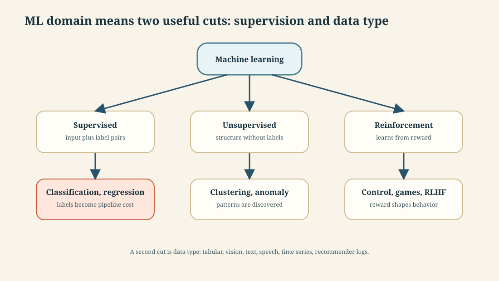

The engineering consequence is the dashed note: **supervised learning makes labelling a first-class cost**, which is why the ML pipeline (section 3) has a *Data labeling* stage that no traditional SDLC has.

**Cut 2 — by what kind of data it acts on.** This decides your *tooling and failure modes*:

| Domain | Typical input | What breaks in production |
|---|---|---|
| **Tabular / structured** | Rows and columns — transactions, records | Schema drift; a column silently changes meaning upstream |
| **Computer vision** | Images, video | Camera changes, lighting, resolution — the model never sees the same distribution twice |
| **NLP / text** | Documents, chat, tickets | Vocabulary drift, new slang, language mix |
| **Speech / audio** | Recordings, streams | Accent and channel mismatch — Sidney's start-up in section 1 |
| **Time series** | Sensor and metric streams | Seasonality, and the leakage trap of shuffling before splitting |
| **Recommender** | Interaction logs | **Feedback loops** — the model shapes the data it is next trained on (section 8.2) |

**Worked example** — fraud detection is **supervised** (labels come from confirmed chargebacks) on **tabular** data (transaction rows) with a **time-series** flavour (order matters, so a random train/test split leaks the future into the past). Naming all three tells you what to build: a labelling pipeline fed by chargebacks, schema validation on the transaction feed, and a **time-based** split rather than a random one.

**Tradeoff / why this taxonomy is worth less than it looks** — a real system usually spans several boxes, and the boxes don't dictate the engineering on their own. The useful move is not to file your project under one heading but to ask **which failure mode from the right-hand column applies to me** — and often more than one does. Foundation models blur it further: one model now serves NLP, vision and speech, which is exactly the shift section 10 is about.

#### 2.4 Terminology traps

This gets its own section, which signals it can be asked.

| Ambiguous word | Say instead |
|---|---|
| model | *machine-learned model* vs *software-architecture model* |
| performance | *prediction accuracy* vs *inference latency* |
| parameter | *model parameter* (learned) vs *hyperparameter* (chosen) |

---

## Part 2 · Process

*What software engineering already knows, and where ML bends it: the development lifecycle, the ML pipeline, and the exact points where the familiar process breaks once a **learned** component enters the system.*

### 3. Two lifecycles: the SDLC and the ML pipeline

**Mechanism — the SDLC wraps the ML pipeline.** The SDLC is the lifecycle of the whole product; the ML pipeline is the lifecycle of the learned component inside that product. Requirements and architecture decide whether a model should exist; the ML pipeline decides how that model is trained, evaluated, deployed and monitored.

#### 3.1 The Software Development Life Cycle

**Intuition** — A structured, repeating process for building software: plan it, understand it, design it, build it, check it, ship it, keep it alive. A cycle, not a line — maintenance feeds back into planning.

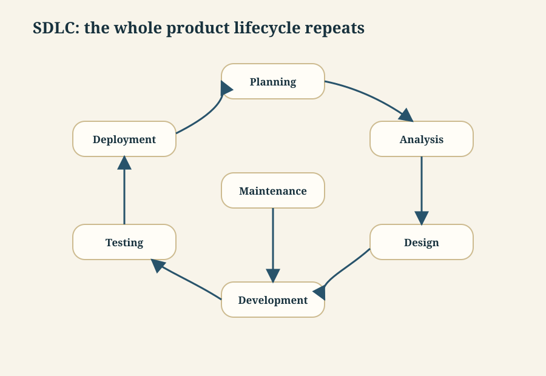

**Shift-left testing** — move testing earlier ("left" on the timeline) rather than treating it as a final gate. Defects found in design cost a fraction of defects found in production. Frequently flagged as exam-worthy.

**Worked example** — Fraud detection. *Planning* — is fraud loss worth a project? *Analysis* — what counts as fraud, what data exists. *Design* — where the scorer sits in the payment flow. *Development* — build it. *Testing* — catches known fraud without blocking good customers. *Deployment* — shadow mode, then live. *Maintenance* — fraud patterns shift, retrain.

**Tradeoff / when the SDLC assumption fails** — The phases are always present; running them **once, in strict order** (Waterfall) only works when requirements are fixed and knowable up front. ML violates that by construction — you cannot specify the accuracy target before seeing whether the data supports it. That is the *lack of specifications* problem, developed in section 8.1.

#### 3.2 The machine-learning pipeline

**Intuition** — Training is one step of many. Everything before it is making data fit to learn from; everything after is deciding whether it's good enough and keeping it alive.

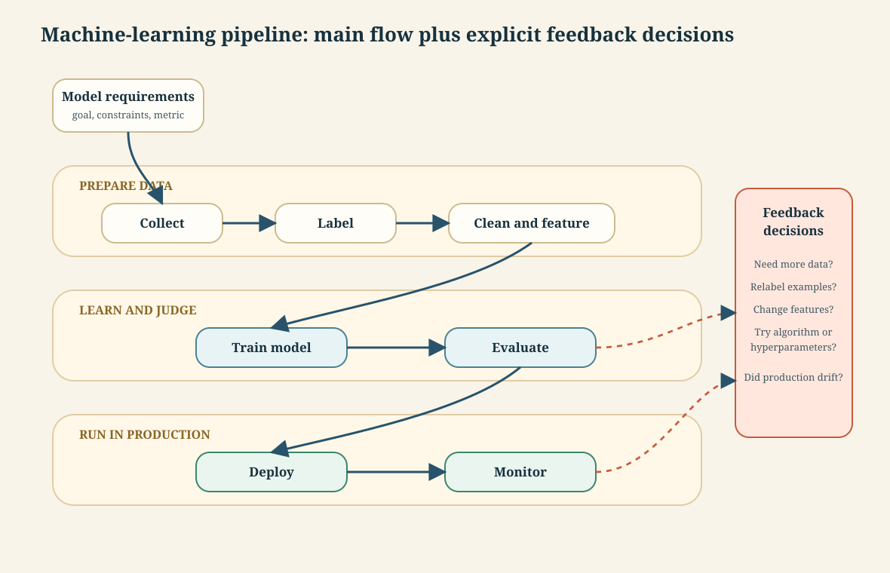

Two engineering-relevant properties:

1. **It is highly iterative.** A bad evaluation sends you back to a different algorithm, different hyperparameters, more data, or different preparation. The dashed arrows are the normal path, not the exception.
2. **Most steps have surprisingly little code.** Preparation is programmed transformations (drop outlier rows, normalise a column). Training is "very few lines calling the library." **Deployment and monitoring are where the substantial infrastructure lives** — which is exactly why this is a software-engineering course.

**Worked example** — Fraud detection. *Requirements* — catch fraud above ₹5,000 within 200ms. *Collection* — 18 months of transactions. *Labeling* — confirmed chargebacks, which arrive 30–90 days late (a real problem, not a footnote). *Cleaning/features* — merchant risk score, velocity in last hour. *Training* — six lines. *Evaluation* — recall at a fixed false-positive rate. *Deployment* — behind the payment API. *Monitoring* — recall against chargebacks as they arrive.

#### 3.3 How the two relate

Worth being able to state, because the exam can ask it either way round:

| | SDLC | ML pipeline |
|---|---|---|
| Scope | The whole system | One component of it |
| Driven by | Requirements | Requirements **and data** |
| Iterates because | Requirements change | Evaluation fails — routinely, by design |
| "Done" means | Meets the specification | Good enough on average; no specification exists |
| Output | Deployable system | A model that becomes *one part* of that system |

The ML pipeline sits **inside** the SDLC, roughly spanning its Design–Development–Testing phases, and adds a monitoring loop the SDLC's Maintenance phase never had to run continuously.

**Tradeoff / when NOT to automate the pipeline** — Full pipeline automation is the goal (S13), but automating *early*, before you know which steps you'll keep changing, builds infrastructure around a design you're about to throw away. Data scientists work notebook-cell-by-cell during exploration for good reason. The engineering judgment is knowing when exploration has stabilised enough to be worth automating.

---

### 4. From Waterfall to ADLC

**Intuition** — Process models climbing a ladder: Waterfall → Iterative → Agile → Scaled Agile → *Scaled Agile with AI infusion*, known as **ADLC** (AI-Driven Development Life Cycle) and named as the desired state. Each rung fixed the previous rung's worst pain and introduced a new one.

**Mechanism — each rung shortens a feedback loop.** Waterfall delays feedback until the end; iterative development brings feedback into repeated cycles; Agile tightens team/customer feedback; Scaled Agile coordinates many teams; ADLC tries to automate artifacts across the lifecycle so requirements, design, code, tests and deployment move together.

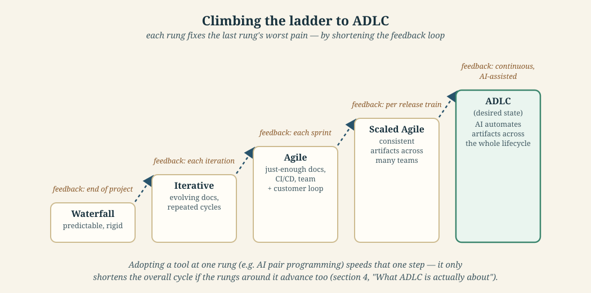

| Stage | Features | Challenges | Impact |
|---|---|---|---|
| **Waterfall** | Predictability, simplicity; works with well-defined requirements | Static docs in monolithic blocks; heavy up-front documentation error-prone; **late defect discovery** | Higher time to market; increased cost; customer dissatisfaction |
| **Iterative** | Evolving documentation; continuous testing for early detection | Document synchronisation; keeping test cases consistent across iterations | Higher operational overhead; inconsistent quality; unpredictable timelines |
| **Agile** | Just-enough documentation; continuous integration, testing, deployment | Balancing detail with agility; robust automation suite is hard; needs experienced team | Depends on human skill; higher initial investment; efficiency/quality tradeoffs |
| **Scaled Agile** | Consistent documentation; systematic integrated approach with continuous delivery pipeline | Consistent artifacts across many teams; cross-team test coordination cumbersome | Impact on time-to-market; high human dependence; reduced cross-team efficiency |
| **ADLC** (desired) | AI-assisted automation of **all** SDLC activities — documents, design, code, test cases, test data, automation scripts, deployment scripts | *(none listed — that absence is itself the finding)* | Faster time-to-market; reduced dependence on human expertise; consistent quality |

**Worked example** — Fraud detector under Waterfall: a 60-page spec, then discovering in UAT that the label definition was wrong, then a six-month delay. Under ADLC: AI drafts the spec, generates test data covering fraud edge cases, writes the deployment scripts — so "the label definition is wrong" → corrected and redeployed takes days.

#### What ADLC is actually about

*The evolution table is only the surface — the real subject is different, and more useful for this course.*

Its opening claim: **"the adoption levels are still far below expectations. Many organizations struggle to realize value by adopting AI in SDLC."** Not because the tools are bad — *"Does this mean these tools lack value? Absolutely not."* — but because **tool adoption is only one step**, and organizations ignore the rest of the ecosystem.

**The example that makes the whole argument, and the one to memorise:**

> A team adopts an **AI Pair Programming** tool. It *will* accelerate the coding phase. But it will **not** reduce overall time-to-market or TCO, **because the overall cycle remains unchanged.**

Concretely: an Agile team on a 4-week iteration adds an AI pair programmer. Developer productivity rises. Nothing else improves — **unless the subsequent testing and deployment activities are also advanced**, shortening the release cycle at the same bandwidth. Only then does cost saving appear.

*This is a local-optimisation trap, and it's the same shape as 546's central theme: improving one component doesn't improve the system. Compare section 1 — Sidney's models were excellent and the business still failed.*

#### The five GenAI capabilities, and where they pay

| Capability | What it does |
|---|---|
| **Generate** | Code, documentation, code explanation, requirements and design documents, test cases, test data |
| **Recommend** | Analyse context and available options, **with reasoning** |
| **Review** | Review human-generated artifacts and code |
| **Summarize** | Consume large documents and code, produce concise artifacts |
| **Knowledge Search** | Contextual search for high-quality matches |

Claimed productivity improvement, by SDLC phase:

| Phase | Up to | Example applications |
|---|---|---|
| **Requirement Analysis** | **20%** | Generate overview/glossary from BRDs; review requirement completeness; find information across documents |
| **Design** | **15%** | Generate design options from BRDs; find similar designs for reuse; generate architecture/class/sequence diagrams |
| **Build** | **30%** | Write code from natural-language instructions; AI-generated comments; faster, more accurate code reviews |
| **Test** | **30%** | Generate test cases (document and code); review coverage against requirements; **generate synthetic test data** |

*Note the shape: **Build and Test gain most (30%), Design least (15%)**. Design is judgment-heavy and hardest to automate — which is precisely why modules 2–3 of this course are about design and not about coding.*

#### Why adoption fails — four categories

| Category | Representative failure |
|---|---|
| **Planning & Execution** | Narrow focus on tool adoption without holistic replanning; no training environment; poor infosec architecture; weak implementation partners |
| **Technology** | Insufficient infrastructure investment; **uncontrolled LLM-on-cloud usage driving subscription costs that erode ROI**; leaders lacking technical depth to evaluate tools |
| **Commercial** | Poor commercial structuring neutralising ROI |
| **Stakeholder Management** | IT leaders fear **next year's budget cuts** because of this year's savings; inter-departmental barriers; **junior employees fear job loss** |

That last row is worth pausing on. It's an *organisational* failure mode, not a technical one — the efficiency gain is real and gets resisted because of what it implies for budgets and jobs. The remedy is to **incentivise leaders for efficiency gains** rather than punish them with reduced budgets.

#### The four-stage adoption journey

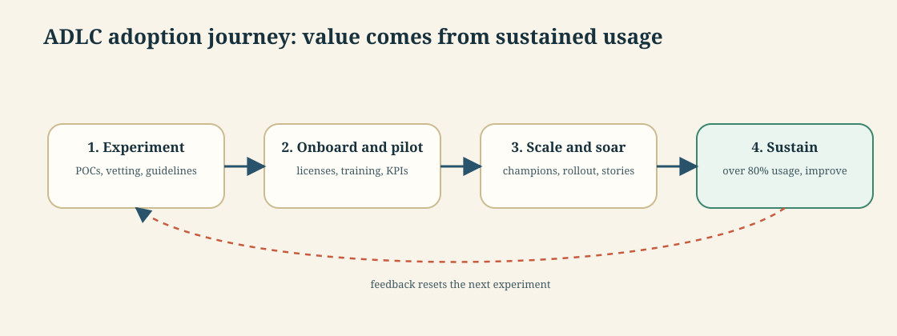

Two specifics worth carrying: **KPIs and a baseline must be established at the pilot stage** — you cannot demonstrate ROI without a before-measurement — and the sustain target is **at least 80% active utilisation**, monitored, with roadblocks actively removed.

**Tradeoff / when NOT to use** — Read the Impact column downward: every stage reduces *human* dependence and increases *tooling* dependence. ADLC's stated benefit — "reduced dependence on human expertise" — is also its risk. Generated code, tests and specs need a human who can tell correct from plausible, and that judgment is exactly what atrophies when generation is automated. No ADLC challenges are catalogued alongside it; read that as *unproven*, not *solved* — the surrounding analysis is, in effect, a long list of the very challenges the table omits.

**The deeper tradeoff, and the one an exam would reward:** the evidence is that **AI in one SDLC phase yields nothing unless the whole cycle is replanned**. So ADLC isn't a tool decision, it's a process-redesign decision. Adopting the tool is cheap; replanning the cycle, retraining staff, restructuring incentives and controlling LLM spend is where the cost and the failure risk actually sit.

---

## Part 3 · Context

*The surrounding landscape: how AI is reshaping the development lifecycle, and where foundation models fit into it. Map-level — know the shape and the tradeoffs, not every cell of every table.*

### 5. How software and data got here

#### 5.1 Evolution of software development

**Intuition** — Four things evolved *together*, not separately: how you develop, how the app is structured, how you ship it, what it runs on. Each era's four choices reinforce each other.

| Era | Development process | Architecture | Deployment & packaging | Infrastructure |
|---|---|---|---|---|
| ~1980–1990 | Waterfall | Monolithic | Physical server | Datacenter |
| ~2000 | Agile | N-tier | Virtual servers | Hosted |
| ~2010 | **DevOps** | **Microservices** | **Containers** | **Cloud** |

```
Cloud Native App = Agile + DevOps + Microservices + Containers + Cloud
```

**Mechanism — the four layers reinforce each other.** Agile shortens planning cycles, DevOps shortens release cycles, microservices reduce deployment coupling, containers make environments repeatable, and cloud supplies elastic infrastructure. Remove one layer and the others lose force: microservices without DevOps become many slow releases; containers without cloud still leave capacity planning manual.

**Worked example** — A fraud-scoring service in a monolith ships only when the whole payment system ships. In a cloud-native setup, the scoring service can be packaged in a container, deployed independently, scaled during sale traffic, and monitored separately from checkout. The architecture change only pays off because process, packaging and infrastructure changed together.

**Tradeoff / when NOT to go cloud-native** — Microservices and containers buy independent deployment and scaling, and cost you distributed-system problems you didn't previously have: network failures between services, distributed tracing, eventual consistency, far more operational surface. A monolith on one server is genuinely right for a small team with modest load. "Cloud native" is not a maturity score.

#### 5.2 Evolution of data

**Intuition** — Sixty years of one pressure: more data than the previous generation's tools could hold, forcing a new layer each time.

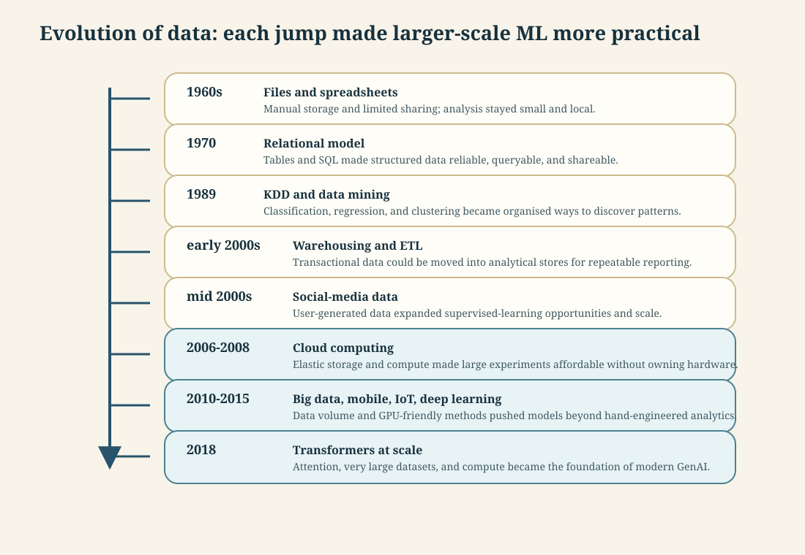

**The through-line** — storage → compute → algorithms → data volume, each unlock enabling the next. Transformers didn't arrive because someone had a clever idea in 2018; they arrived because the 2010–2015 data deluge and cloud compute made them trainable.

---

### 6. What data science is

**Intuition** — The study of data: turning it into a *story* that produces insight, and insight that produces a decision. If no decision changes, it wasn't data science — it was reporting. Scope runs collection → preprocessing → analysis → prediction → visualisation (storytelling) → insight.

**The convergence** — three fields, and each pairwise overlap has its own name:

| Overlap | Produces |
|---|---|
| Math/Statistics ∩ Domain knowledge | **Research** |
| Math/Statistics ∩ CS/IT | **Software development** |
| Domain knowledge ∩ CS/IT | **Machine learning** |
| **All three** | **Data science** |

That third row is a favourite exam question because it's counter-intuitive: ML sits in the *domain + CS* overlap, meaning ML without statistical grounding is still ML — just fragile.

**The hierarchy of needs** — you cannot do the fun layer until the boring layers underneath work. AI sits at the apex of a pyramid whose base is instrumentation and logging.

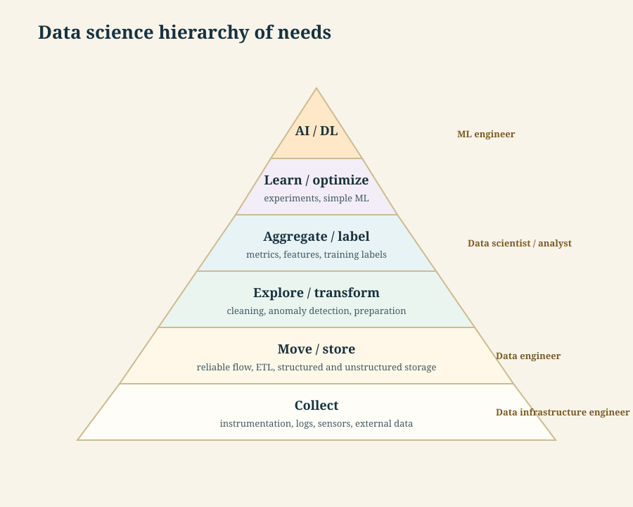

**Worked example** — A team wants an LLM assistant over company documents. Apex layer. But if documents aren't collected in one place (COLLECT), or the sync pipeline is unreliable (MOVE/STORE), or they're full of duplicates and dead links (EXPLORE/TRANSFORM), the assistant produces confident nonsense. It looks like a model problem; it's a base-of-pyramid problem.

**Tradeoff / how NOT to read the pyramid** — It's a *dependency* claim, not a *sequencing mandate*. Read literally it says "spend two years on data infrastructure before touching ML," which kills projects. Honest reading: cut a thin vertical slice through all six layers for one use case, then widen. Note also that simple ML sits *below* deep learning — A/B tests and logistic regression solve a large share of problems pitched as AI.

#### 6.1 The data-science pipeline, explicitly

**Intuition** — The handout names the **data science pipeline** separately from the ML pipeline because they answer different questions. The ML pipeline asks, *"how do we train, evaluate, deploy and monitor a model?"* The data-science pipeline starts earlier and wider: *"how do we turn messy raw data into a decision someone can use?"*

*Shortest memory hook:* the **ML pipeline is model-centric**; the **data-science pipeline is insight-centric**.

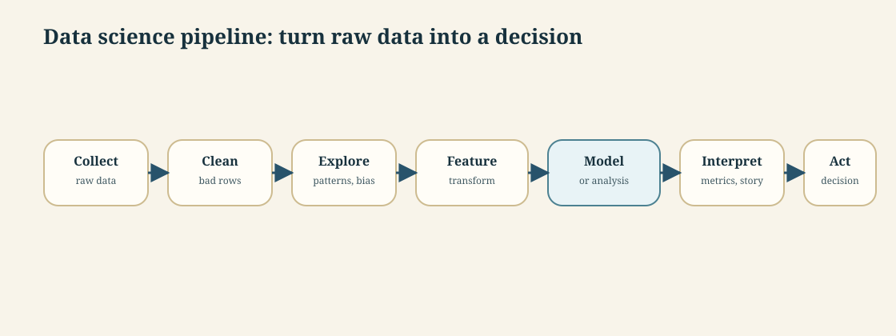

**Mechanism** — each stage removes one kind of ambiguity before the next stage can do useful work:

| Stage | What question it answers |
|---|---|
| **Collect** | Do we have the right data at all? |
| **Clean** | Can we trust the rows and columns? |
| **Explore** | What patterns or traps are in it? |
| **Feature / transform** | In what form should the data be presented? |
| **Model or analysis** | What rule, forecast, or estimate best fits? |
| **Interpret** | Is the result meaningful to a human decision-maker? |
| **Decision / action** | What will the organisation actually do differently? |

**Worked example — fraud detection through the data-science pipeline**

| Stage | Fraud example |
|---|---|
| Collect | Pull card transactions, merchant metadata, customer history |
| Clean | Remove corrupt timestamps, fix currencies, dedupe retries |
| Explore | Find fraud spikes by merchant type, hour, geography |
| Feature / transform | Build `transactions_last_1h`, `merchant_risk`, `country_change` |
| Model or analysis | Train a classifier or compute a rule-based risk score |
| Interpret | Check precision/recall and inspect why false positives happen |
| Decision / action | Block, review, or allow the transaction |

**Tradeoff / where people confuse this with the ML pipeline** — Teams often jump straight to the model because it looks like the "AI part." That is usually the wrong place to begin. If the data-science pipeline is weak, the ML pipeline inherits the weakness and produces a polished bad model. The model is one stage in the pipeline, not the pipeline itself.

---

## Part 4 · People and judgment

*The half of engineering that isn't code: interdisciplinary teams, the risk spectrum, and the judgment calls — above all, **when the expensive general answer is the wrong one** — that separate an ML engineer from someone who only trains models.*

### 7. Who builds these systems

**Intuition** — Roles exist because different failures need different specialists watching for them. In ML systems the roles come from two different traditions that were trained differently and mean different things by "done" — which is where the friction lives.

**Mechanism — roles are handoff points.** Business roles define value and constraints, software roles turn them into a reliable system, data roles turn raw data into models or insight, and ML engineering keeps the learned component operating after handoff. The course cares about the seams because most failures happen when one role assumes another role has handled quality, monitoring, latency, or data meaning.

#### 7.1 Roles in the SDLC

| Role | Responsibility |
|---|---|
| Business Analyst | Translates business needs into technical requirements |
| Project Manager | Plans, coordinates, tracks execution against deadlines |
| Product Owner | Defines vision, prioritises features for value |
| Team Lead | Guides technically, keeps tasks moving |
| Software Architect | Designs system structure and technical strategy |
| Developers | Build and implement functionality |
| QA Team | Validates quality systematically (shift-left testing) |
| Testers | Find defects, verify requirements met |
| Scrum Master | Facilitates Agile, removes impediments |
| UX/UI Designers | Design intuitive interfaces |

#### 7.2 The three data roles

Distinguished by **what they hand over**, and the handovers get progressively harder to engineer.

**Data engineer** — moves and stores data reliably.

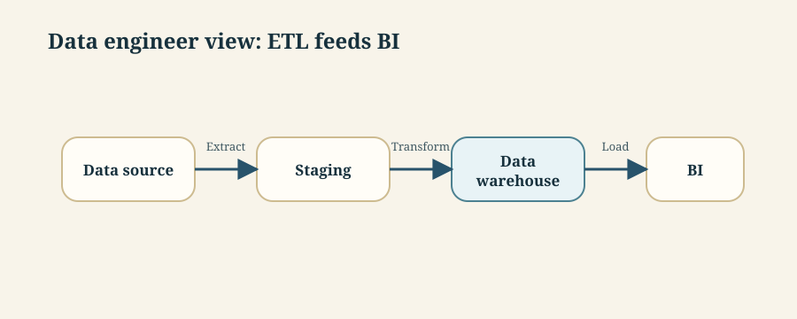

**Data scientist** — produces a model and an answer, typically once.

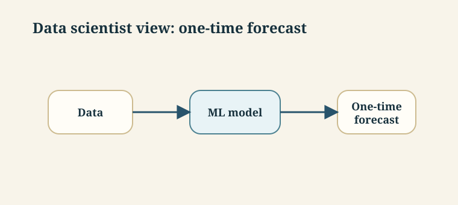

**ML engineer** — runs a model continuously in production, with feedback.

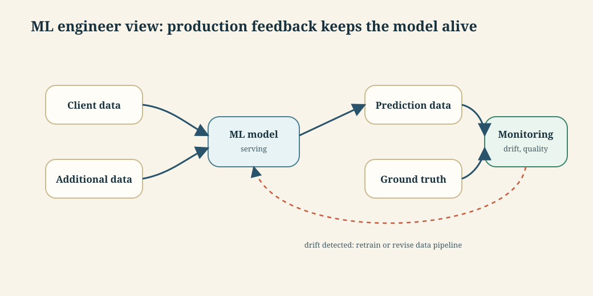

**Worked example** — Fraud detection. The *data engineer* guarantees last night's transactions land in the warehouse by 6am. The *data scientist* shows a model catches 82% of fraud on last year's data. The *ML engineer* runs it on live traffic, compares predictions against confirmed-fraud ground truth as it arrives, notices recall sliding from 82% to 61% as tactics change, and retrains.

**Tradeoff / when the one-time forecast is correct** — The data scientist's diagram genuinely is the right shape for a pricing study, a feasibility check, a board question. Building the full ML-engineer loop for a question asked once is waste. The failure this course targets is the opposite: a one-time-forecast notebook promoted into a production dependency without the ground-truth loop, degrading silently.

#### 7.3 Data scientists vs software engineers — the actual friction

The central theme, stated outright: *how to get data scientists and software engineers to each contribute their distinct expertise while effectively working together.* The friction isn't skill, it's different notions of what "done" means.

| | Data scientists | Software engineers |
|---|---|---|
| Background | Statistics, ML algorithms (often PhD) | Requirements, design, QA, distributed systems, security |
| Prefer | Feature engineering, architecture, hyperparameter tuning; also much data gathering/cleaning | Delivering products meeting user needs, within budget and time |
| Workflow | Science-like, **exploratory**, computational notebooks | Design → implement → test → deploy → maintain |
| Evaluate by | **Accuracy on held-out test data**; maybe fairness, robustness | **Trade-offs** across usability, scalability, maintainability, security, cost, time |
| Rarely focus on | Inference latency, training cost | Feature engineering, testing for generalisation |

**Two terms that get asked:**

- **"Unicorns"** — people deeply skilled in both. Rare, "even considered mythical." Most people specialise. Don't staff a plan on unicorns.
- **T-shaped team members** — deep expertise in one area (the vertical) plus broad understanding of others (the horizontal). The stated goal is not to turn data scientists into engineers, but to give each enough breadth to *understand and appreciate* the other. T-shaped people are what make interdisciplinary teams work.

The evidence on the reverse direction is worth sitting with, since it describes most of this cohort: software engineers who pick up ML without formal training "approach machine learning rather naively with little focus on feature engineering, they rarely test models for generalization, and they think of more data and deep learning as the only next steps when stuck."

**Tradeoff / how NOT to use this contrast** — it's "oversimplified and overgeneralized" by its own admission. As a lens on why a handover failed, useful. As a hiring stereotype, wrong — the point is complementarity, not superiority. And in a small team one person wears four hats, where the risk flips from coordination overhead to blind spots: whoever wrote the code also decides whether it's tested enough.

---

### 8. What ML changes about engineering

**Intuition** — There's an open debate about whether ML fundamentally changes engineering or just demands that we finally apply existing practice rigorously. There are three challenges, and for each the argument is the same: *harder* but *not new*. That two-part shape — challenge, then "but we've seen this before" — is what makes it exam-friendly, and you should reproduce both halves.

**Mechanism — three engineering assumptions weaken.** Traditional software assumes a component can be specified, failures are often detectable, and scale is mostly an operational consequence. ML weakens all three: the learned function is induced from examples, wrong predictions can look normal, and more users can improve the model by producing more data.

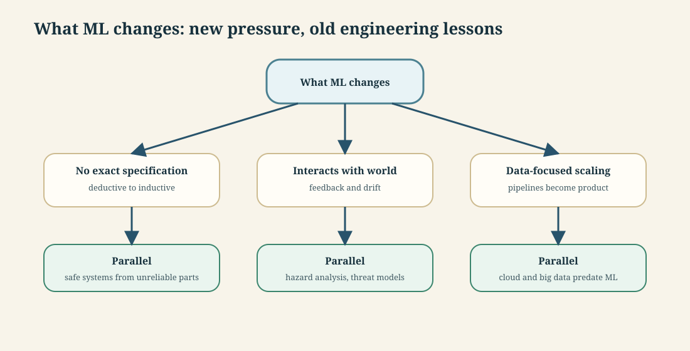

*Every row is a pair — the challenge, then the "we've seen this before". Reproduce both halves; section 8.4 is where the second half stops holding.*

**Worked example** — A fraud model cannot be unit-tested like `compute_tax()`. You can test that the API returns a score, but not that every future fraud case is correctly classified. The engineering response is statistical evaluation, threshold design, human review for uncertain cases, monitoring for drift, and retraining when confirmed fraud patterns change.

#### 8.1 Lack of specifications

Traditional engineering relies on decomposition: specify each component, build and test separately, compose. The contrast:

```python
def compute_deductions(agi, expenses):
    """Compute deductions based on provided adjusted gross income
    and expenses in customer data. See tax code 26 U.S. Code A.1.B, PART VI.
    Adjusted gross income must be a positive value.
    Returns computed deduction value."""
```

```python
def transcribe(audio_file):
    """Return the text spoken within the audio file.
    ????"""
```

The first can be implemented by one developer and relied on by another without either seeing the other's code. The second cannot be specified — *we use ML precisely because we don't know how to specify the function.*

The deep shift: **deductive reasoning** (logic-based, applying rules) → **inductive reasoning** (generalising from observation). *Concretely: deductive reasoning is "all men are mortal; Socrates is a man; therefore Socrates is mortal" — the conclusion is **guaranteed** by the rules. Inductive reasoning is "every swan I've ever seen is white, so swans are white" — a generalisation from examples that holds right up until the first black swan. A trained model reasons the second way, which is exactly why it can be **confidently wrong**: it never had a rule to apply, only a pile of examples to generalise from.* We can no longer ask whether a component is *correct*, only whether it works *well enough on average* on test data or in the system. And since some answers will be wrong, **the rest of the system must tolerate mistakes** — a design constraint, not an afterthought. This is the concrete reason the SDLC's "run the phases once in order" assumption (section 3.1) fails.

*But not new:* software engineering has a long history of building safe systems from unreliable components, and comprehensive formal specifications were always rare. Engineers already cope with vague specs via agile methods, cross-team communication, and lots of testing.

#### 8.2 Interacting with the real world

Models trained on observations of the world, then acting on that world:

- **Bias in, bias out** — skewed observation produces fairness failures (dialects; diseases affecting only women).
- **Feedback loops** — YouTube recommended conspiracy videos heavily because viewers of those videos watch a lot; recommending them more kept people on the platform, which strengthened the signal. **Fixed not with better ML but by hard-coding rules around the model.**
- **Adaptation and gaming** — speakers changing pronunciation to dodge mistranscription; adversarial attacks such as custom glasses defeating face recognition.
- **Drift** — user behaviour shifts, intentionally or naturally.

*But not new:* software has harmed people without ML — radiation overdoses, crashed planes and spacecraft. The established response is requirements engineering, hazard analysis, threat modelling. ML makes it *harder* because more components are poorly understood and the data isn't neutral — so requirements engineering matters *more*, not less.

#### 8.3 Data-focused and scalable

Data that doesn't fit one machine; distributed training and serving; **the ML flywheel** — more users → more data → better models → more users. Large foundation models need expensive hardware even for inference, forcing dedicated machines accessed remotely.

*But not new:* cloud operation and large-scale data management (warehouses, batch, streaming) predate ML by a decade. The demands are simply higher.

#### 8.4 Where the "not new" argument breaks down

**Tradeoff / when this framing misleads** — reproduce both halves of the argument, but don't over-apply the reassuring half. "Harder but not new" is right about the *techniques* and can be wrong about the *consequences*, in three places:

| The argument holds | Where it strains |
|---|---|
| We've always built reliable systems from unreliable parts | Those parts failed **detectably** — a crash, a timeout, a checksum. A model returns a confident wrong answer that looks exactly like a right one. You can retry a failed disk read; you cannot retry a plausible misclassification, because nothing told you to |
| Requirements engineering and hazard analysis already exist | They assume you can *enumerate* the hazards. A model's failure modes are discovered in production, from users, often months later, and often by the group harmed |
| Cloud and big data predate ML | True — but the **flywheel** is new. Scale used to be a consequence of success; with ML it's an input to quality, so competitors with more users get better models and pull further ahead. That's a market dynamic, not an engineering one |

**How to use this:** give the two-part shape — challenge, then "we've seen this before" — and then add the qualifier. *"The techniques transfer; the assumption that failures are detectable does not."* That earns more than reciting the three challenges.

**The concrete risk** — "not new" can license doing nothing differently. Every one of the three challenges needs a *specific* new practice: model-behaviour testing rather than unit tests (session 10), monitoring for drift rather than for crashes (session 11), and documenting intended use rather than trusting an API contract (session 13, model cards). The reassurance is about the *discipline* being available, not about the *work* being already done.

---

### 9. The risk spectrum

**Intuition** — the actual thesis, and the sentence most likely to be quoted at you: it isn't that ML *is* riskier, it's that we *attempt riskier things* with ML.

| Risk | Example | Practice level |
|---|---|---|
| Low | Restaurant website, podcast hosting | Light |
| Medium | Medical records, payment software | Step up: requirements, risk analysis, QA, security |
| High | Aircraft control, nuclear plant control | Heavy, slow, expensive — and we know how |

> **The conjecture:** software products with ML components tend to fall toward the more complex and more risky end of the spectrum, compared to traditional products — calling for more investment in rigorous engineering practices.

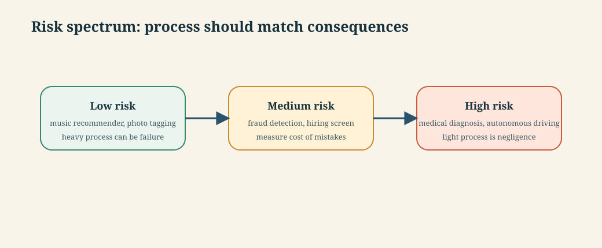

**The thesis in one line:** ML doesn't make projects riskier — *we attempt riskier things with ML*. The judgment being taught is **locating your system on this line first**, then matching practice to position.

**Mechanism — practice follows consequence.** Estimate the harm of a wrong prediction, the detectability of that harm, and the reversibility of the decision. Higher harm, harder detection, or irreversible action moves the system rightward and demands stronger requirements, testing, monitoring and human oversight.

**Worked example** — Fraud detection is not a restaurant website. False negatives cost money; false positives block legitimate customers and can be discriminatory; the system runs on live payment traffic at scale. Mid-to-high on the spectrum, and the practices should match — which is what modules 2–7 supply.

**Tradeoff / the symmetric error** — be careful here: "It is not that machine learning automatically makes projects riskier — and there certainly are also many low-risk systems with machine-learning components." Applying nuclear-grade rigour to a low-stakes recommender is its own failure. The judgment is *locating your system on the spectrum first*, then matching practice to position. That judgment is what 546 teaches.

**The enduring principles** that survive every technology shift — a ready-made exam answer:

1. Understanding customer priorities and tolerance for mistakes
2. Designing safe systems with unreliable components
3. Navigating conflicting qualities — accuracy, operating cost, latency, time to release
4. Planning a responsible testing strategy
5. Designing systems that can be updated rapidly and monitored in production

---

### 10. Foundation models and prompting

**Intuition** — Instead of training a model per task, a few organisations train one enormous general-purpose model and everyone else *instructs* it with a prompt. Customisation moves from training data to prompt text.

**Mechanism** — a toxicity example: rather than training a toxicity classifier on labelled examples, send `Answer only yes or no. Is the following sentence toxic: [input]`.

Two ways to customise:

| Strategy | What it is | Cost |
|---|---|---|
| **Fine-tuning** | Train a copy on custom data (internal email, forum messages) | Expensive; produces a model you must host and version |
| **In-context learning** | Put information or examples in the prompt itself | Cheap; costs context window and per-call tokens |

**Few-shot prompting** is in-context learning with examples:

```
Classify the sentence into toxic or non-toxic.
Text: We need to kill this process.
A: non-toxic
Text: RTFM
A: toxic
[more examples]
Text: [sentence to analyze]
A:
```

Providing *internal data* in the prompt is the case that flags forward to **retrieval-augmented generation** — which is S6. The course's own tool list (LangChain, ChromaDB, OpenAI embeddings and LLM) confirms S6 is hands-on, not conceptual.

*The full customisation ladder, cheapest first:*

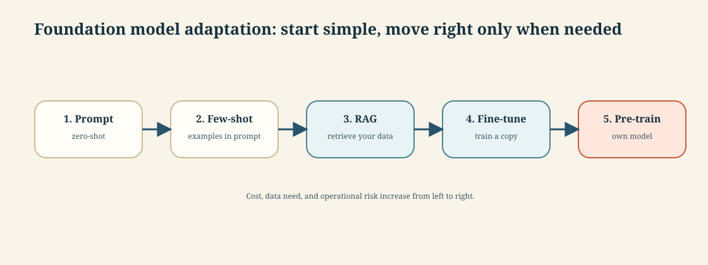

Cost, effort and *how much of the model you change* all rise left → right, and the engineering rule is: **reach for the leftmost rung that works.** Prompt and few-shot change nothing but the text; RAG adds a retrieval system but no training; fine-tuning produces a model you own, host and version; pre-training is for the few orgs building foundation models. The classic mistake is fine-tuning something a better prompt or RAG would have fixed — the expensive rung reached for too early. (RAG's mechanics → S6.)

**Worked example** — Fraud detection with a foundation model: `"Given this transaction and the customer's last 10 transactions, is this likely fraudulent? Answer yes/no with one reason."` No training data needed, works immediately — and costs an API call per transaction, with latency you don't control, for a task a decision tree does in microseconds.

**Tradeoff / when NOT to use** — bluntly: foundation models "do not have access to proprietary or recent information that was not part of the training data," and "model size and inference costs can become a challenge." Use them where the task is language-shaped, varied, and hard to specify. Don't use them for a high-volume, low-latency, narrow, well-specified task with plenty of labelled data — fraud scoring at 10,000 transactions/second being exactly that. **A foundation model is the expensive general answer to a question you might be able to specify cheaply.**

---

### 11. MLOps and responsible ML

**Intuition** — both are *cross-cutting concerns*, not chapters. That framing is itself examinable, because it's the argument against believing a tool can solve either.

**MLOps** — automating ML pipelines so models can be deployed, updated, monitored and operated reliably. Usually discussed as a tool market: Kubeflow (scalable workflows), Great Expectations (data quality testing), MLflow (experiment tracking), Evidently AI (model monitoring), Amazon SageMaker (end-to-end platform). The *fundamentals* run across the whole course, with the closest dedicated treatment in **Planning for Operations** (tooling landscape) and **Interdisciplinary Teams** (the collaboration culture — joint goals, joint vocabulary, joint tools).

That tool list matches your 546 lab stack almost exactly: MLflow, Evidently AI, SageMaker, plus DVC, Prefect, Docker/K8s, FastAPI, PyTest.

**Responsible ML** — bluntly: *there are no magic tools that can make a model secure or ensure fairness.* Responsible engineering requires a holistic view of the system, how the model interacts with other components, and how the system interacts with its environment. Attempted without that grounding, "attempts to tackle safety, security, or fairness are often narrow, naive, and ineffective."

**Mechanism — both concerns attach to every phase.** MLOps asks how the model moves safely from experiment to operation and back again. Responsible ML asks who can be harmed, how harm is detected, and what control exists when the model is wrong. Both questions must be asked at requirements, design, build, test, deploy and operate time.

*Why "cross-cutting" is the whole claim — these aren't phases you can schedule:*

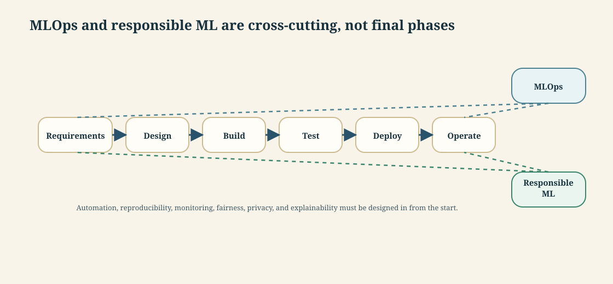

Both touch **every** phase — there is no single point in the timeline where either is "the current task."

**Worked example** — In fraud detection, MLOps versions the training data, records the experiment, deploys the chosen model, monitors recall and triggers retraining. Responsible ML checks whether false positives concentrate on a customer segment, whether a blocked transaction can be appealed, and whether the model should be allowed to auto-decline without human review. Same system, different cross-cutting questions.

**Tradeoff** — the practical implication of "cross-cutting" is that you cannot schedule either as a phase. A team that plans to "do the fairness work in sprint 12" has already lost, because the decisions that determine fairness — what data, what labels, what the system does with a low-confidence prediction — were made in sprints 1 through 11.

> ***In practice*** *— what MLOps actually looks like as a job:*
> MLOps is **CI/CD extended to data and models**. On top of the usual code pipeline (git, tests, containers), an ML pipeline adds three things software CI/CD never had:
> - **Data & model versioning** — DVC or LakeFS version datasets; the model registry versions models. You can reproduce "the model from March" only if both are versioned alongside the code.
> - **Continuous training & evaluation** — a pipeline (Prefect, Airflow, Kubeflow) retrains on new data, evaluates against a held-out set *and* against the current production model, and only promotes if it wins.
> - **Monitoring for drift** — compare live predictions against ground truth as it arrives, alert when recall slides, and trigger retraining. This is the part that has no equivalent in traditional software, and it is where ML engineers and MLOps engineers spend much of their time. Your 546 lab stack (MLflow, DVC, Prefect, Evidently, Docker/K8s, FastAPI) is this pipeline in miniature.

> ***Going deeper*** *— the three ways a model actually serves predictions; picking the wrong one is a classic mistake:*
>
> | Pattern | How | When |
> |---|---|---|
> | **Batch / offline** | Score a whole dataset on a schedule, write results to a table | Predictions can be precomputed — churn scores overnight, recommendations refreshed hourly |
> | **Online / real-time** | A service (FastAPI behind a load balancer) scores one request at a time, low latency | The answer is needed *now* — fraud check at checkout, search ranking |
> | **Streaming** | Score events as they flow through a queue (Kafka) | Continuous event data — clickstreams, IoT, live anomaly detection |
>
> The running example makes the choice concrete: **fraud detection is online** (the score gates a live payment, ~200 ms budget); a monthly churn report is **batch**. Building a heavy real-time service for something a nightly batch job would do — or vice-versa — is the same "match the machinery to the need" judgment as the risk spectrum in section 9.

---

## Lab / build

No lab this session. **546 Lab 1 is at session 3** — end-to-end ML system blueprint, fraud detection.

**Locked in:** fraud detection is the running example for all sixteen sessions — the same credit-card fraud decision tree recurs as the standard worked example throughout, so the theme is consistent from the very first session.

---

*Exam: this session is in scope for the **closed-book mid-sem** (sessions 1–8). Full evaluation, weights, dates and course logistics live once in [`546-master.md`](../546-master.md) — not repeated per session.*
