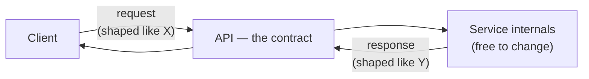
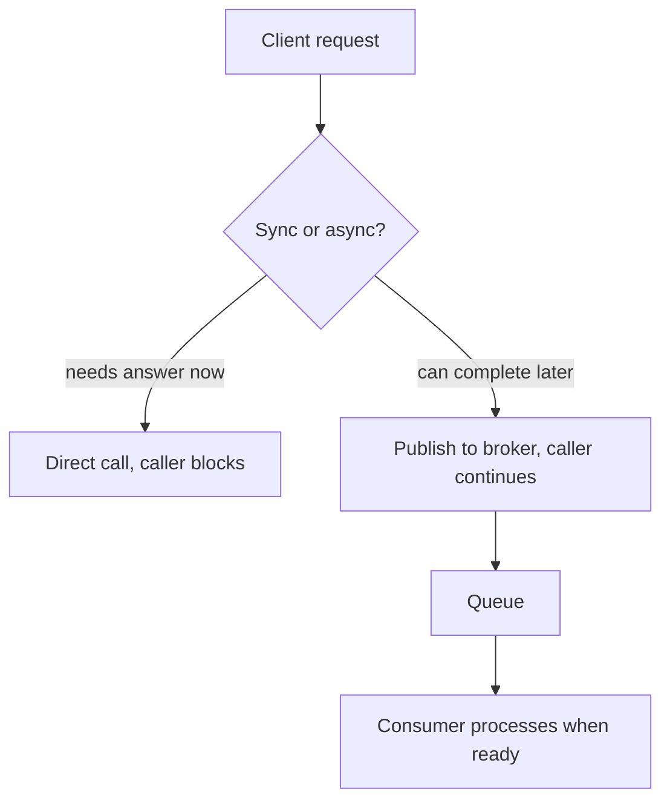
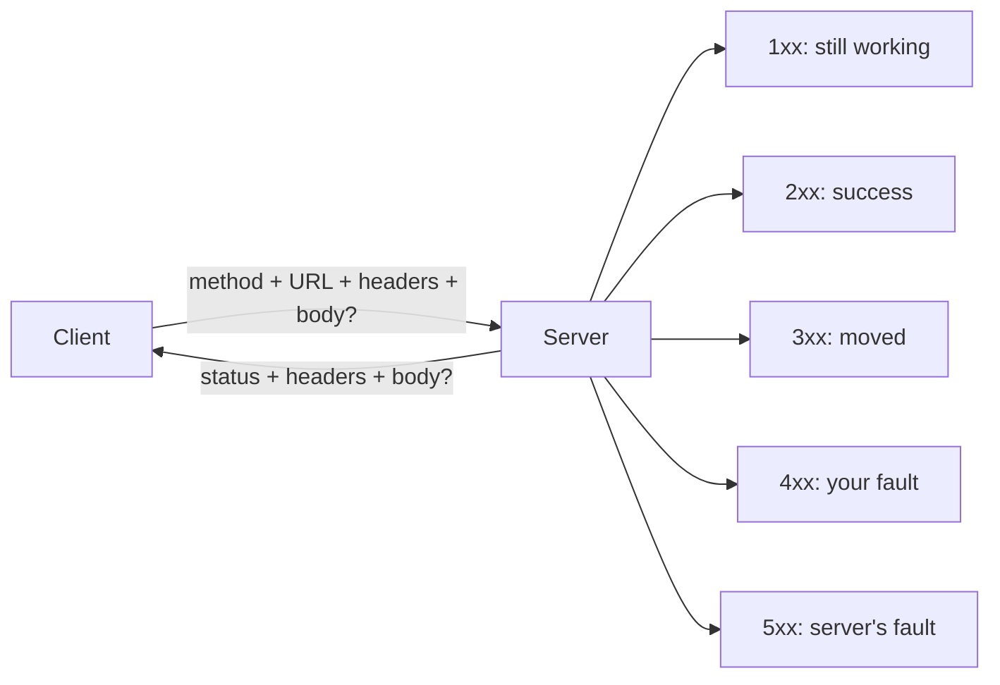
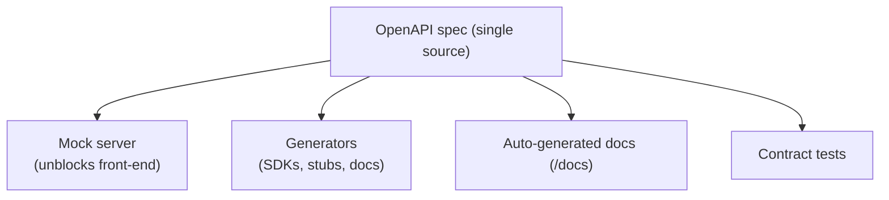
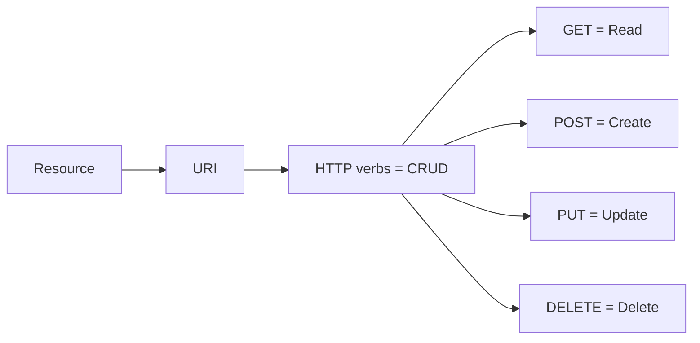
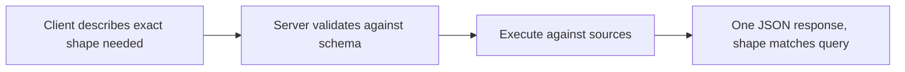
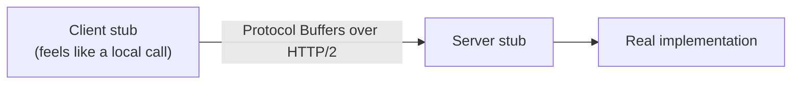
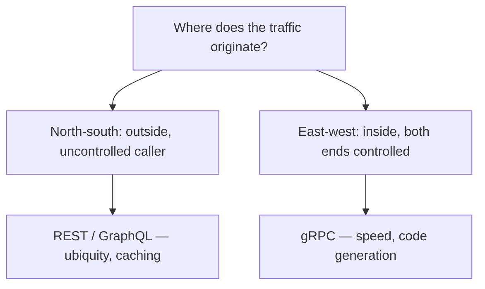
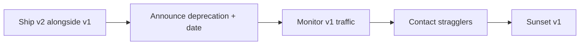

# Shared · API Design — REST, OpenAPI, GraphQL, gRPC

**Status:** ✅ done (target was 9 Aug — closed early, straight off 549 S1)
**Written from:** 549 S1
**Reused by:** 546 S9
**Target date:** 9 Aug 2026

> Write this **once**, the first time any course reaches it. When the next course arrives, revise this file instead of writing a new note — then add a cross-link row below.

## Why this matters

An API is a contract between a service and its clients: send a request shaped like *this*, get a response shaped like *that*, and neither side needs to know how the other is built. Every backend, cloud service, and model deployment this degree touches is reached through an API — Hugging Face, OpenAI, LangChain, Bedrock are all REST. The design calls here — REST vs gRPC, sync vs async, how to version without breaking clients — are ones made on the job, not just in an exam.

## Concepts

- What an API is; sync vs async
- HTTP mechanics — methods, status codes, auth
- OpenAPI — the written contract, mocking, code generation, the API lifecycle
- REST — the Richardson Maturity Model, benefits/drawbacks
- GraphQL — client-shaped queries
- gRPC — RPC, protocol buffers, HTTP/2, streaming
- Choosing between them — north–south vs east–west
- API versioning — schemes, semantic versioning, rollout

---

## 0. What an API is

**Intuition** — a contract between a service and its clients: send a request shaped like this, get a response shaped like that. Neither side needs to know how the other is built. A restaurant analogy carries the whole idea: the **menu** is the API — order dish 12 and you get *that* meal, without knowing anything about the kitchen. The restaurant can swap chefs or suppliers; as long as the menu still delivers dish 12, no client notices. **The menu is the contract; the kitchen is the implementation.**

**Mechanism** — three definitions, increasing in usefulness: (1) "Application Programming Interface" — the acronym, tells you nothing; (2) **a contract between a service and its clients** — the one to remember; (3) a set of rules and protocols for exchanging data and integrating function without the end user understanding the underlying code.

**API-first** — the application is *designed as* a set of APIs from the start, rather than bolting an API on afterward.

**Worked example** — Amazon Bedrock exposes `GET /models` and `POST /models/{model-id}/invoke`. You never see the GPUs or serving stack — only the contract. Hugging Face, LangChain, Prefect are the same.

**Tradeoff / when NOT to use** — publishing an API is a commitment, not a feature: once clients build against it, changing it breaks them (→ versioning, §7). Public APIs (Google Maps, RapidAPI) are fast to integrate but create external dependency, quota, pricing, and outage risk — for a core capability like payments or identity, choose deliberately and design fallbacks.



> ***In practice*** *— what calling an API actually looks like on the job:* you almost never write raw HTTP — you call an SDK (`openai`, `boto3`) that builds the request for you. Real APIs are gated by an API key/token in a header; rate limits return `429 Too Many Requests`, so production code wraps calls in retry-with-backoff.

> **Closed-book card**
> API = **contract between a service and its clients** (menu, not kitchen). API-first = designed as APIs from the start. Publishing an API is a commitment — clients build against it, so changing it breaks them.

---

## 1. Synchronous vs asynchronous

**Intuition** — synchronous means the caller **waits**; asynchronous means it doesn't.

**Mechanism** —

| | Synchronous | Asynchronous |
|---|---|---|
| Caller | Blocked until reply | Non-blocked, continues immediately |
| Examples | REST, gRPC, GraphQL | Message brokers — RabbitMQ, Kafka, SQS |
| Coupling | Caller needs the callee up *now* | Caller only needs the broker up |
| Shape | Request → response | Publish → channel → consume |

**Worked example** — placing an order needs three downstream calls: verify consumer (200ms), check restaurant open (150ms), reserve payment (400ms).

| | Synchronous | Asynchronous |
|---|---|---|
| Wall time the user waits | 750ms | ~5ms (publish only) |
| If payment is down | whole request fails | message queues, processed on recovery |
| If traffic spikes 10× | threads exhaust, cascading failure | queue depth grows, consumers drain at their own rate |

**The trade in one line:** sync buys a truthful *immediate* answer; async buys survival under load and partial failure, at the cost of a client that must handle "not done yet." Real systems are usually both — the user-facing read stays sync, the fulfilment pipeline behind it goes async.

**Tradeoff / when NOT to go async** — async buys availability and decoupling, and charges a broker to operate, eventual consistency, harder debugging, no simple "what did it return?" answer. Use sync when the caller genuinely needs the answer to proceed (payment authorisation); use async for work that can complete later (confirmation email).



> **Closed-book card**
> **Sync** = caller blocked, immediate truthful answer, but every downstream failure fails the whole request. **Async** = caller not blocked, survives partial failure/load spikes, costs a broker + eventual consistency. Real systems mix both: user-facing read sync, fulfilment pipeline async.

---

## 2. HTTP mechanics

**Intuition** — a client sends **method + URL + headers + optional body**; the server replies with **status code + headers + optional body**.

**Mechanism — one exchange, six parts:**

| | Part | Example | Purpose |
|---|---|---|---|
| Request | Method | `GET` | the verb — what you want done |
| | Endpoint | `https://api.x.com/products/101` | the noun — what you want it done to |
| | Headers | `Authorization: Bearer …` | metadata: who you are, what format |
| | Body | `{"name":"Widget"}` | payload, only for POST/PUT/PATCH |
| Response | Status code | `200`, `404`, `500` | did it work, whose fault if not |
| | Headers | `Content-Type: application/json` | how to interpret/cache the body |
| | Body | `{"id":101,...}` | the result |

**Safe vs idempotent** — the property that matters when a network drops a response and the client retries:

| Method | Safe? (no change) | Idempotent? (same result if repeated) |
|---|---|---|
| `GET` | ✅ | ✅ |
| `PUT` | ❌ | ✅ — "set to *this*" lands the same however many times |
| `DELETE` | ❌ | ✅ — deleting twice leaves it deleted |
| `POST` | ❌ | ❌ — "create a new order" twice makes **two orders** |

*Everyday picture:* idempotent = an **elevator call button** — press once or five times, one elevator arrives. `POST` = **adding to a cart** — click twice, two items.

**Status code classes — read the first digit:**

| Class | Meaning | Server is saying |
|---|---|---|
| 1xx | Informational | "Got it, hold on" |
| 2xx | Success | "Here you go" |
| 3xx | Redirection | "It's moved — look there" |
| 4xx | Client error | "You did something wrong" |
| 5xx | Server error | "I broke — not your fault" |

Memory hook: **4xx is your fault, 5xx is the server's.** `401` = we don't know who you are (authentication); `403` = we know who you are and you still can't (authorization).

**Auth schemes:**

| Scheme | How | Where |
|---|---|---|
| API key | secret string in header | OpenAI, most cloud APIs |
| OAuth 2.0 | user authorises without handing over password → short-lived access token | "Sign in with Google" |
| JWT | signed self-contained token, server verifies signature, no DB lookup | stateless microservice auth |

**Worked example** —

```bash
curl -X GET "https://jsonplaceholder.typicode.com/posts"
```

`GET /posts` → `200 OK` with a JSON array. A `POST` that creates a resource returns `201 Created`.

**Tradeoff** — HTTP's ubiquity is its strength and ceiling: text-based, request-per-resource, header overhead on every call. Invisible for a browser fetching a page, very visible for two internal services exchanging millions of messages — the gap gRPC exists to fill (§5).



> **Closed-book card**
> Request = method + endpoint + headers + optional body. Response = status + headers + optional body. **Safe** = no state change (GET). **Idempotent** = repeat-safe (GET/PUT/DELETE, **not POST**). Status classes: **4xx = your fault, 5xx = server's**; `401` = who are you, `403` = not allowed. Auth: **API key** (app identity) · **OAuth2** (user delegates, no password shared) · **JWT** (signed, stateless).

---

## 3. OpenAPI and the API lifecycle

**Intuition** — if an API is a contract, someone has to write it down in a form humans *and* machines can read. OpenAPI (formerly Swagger) is that description standard.

**What a written spec buys** — (1) people understand how the API works and how a sequence of APIs work together, (2) **generate client code**, (3) **create tests**, (4) **apply design standards**.

**Mocking** — once the contract exists, it can be *served* before anyone writes the real implementation. A mock server reads the OpenAPI doc and returns schema-shaped fake data, so the front-end starts before the back-end ships.

```bash
npx @stoplight/prism-cli mock openapi.yaml     # serves on :4010
curl http://localhost:4010/books/1             # → {"id":1,"title":"string","author":"string"}
```

**Tradeoff / where mocking misleads** — a mock is schema-shaped, not *behaviour*-shaped: it returns the right fields, not real latency, pagination limits, rate limiting, partial failures, or awkward real data. Use mocks to unblock; test against something real as early as possible.

**Generators** — one OpenAPI file feeds multiple teams: client SDKs, server stubs, model types, docs, test scaffolds. **Tradeoff** — generated code removes boilerplate, not judgment; a poor contract generates poor code faster.

**The seven-step lifecycle** (Books API example): Requirements → Design (endpoints + data model) → Configure (framework/server/storage) → Publish (auto-generated docs at `/docs`) → Develop → Test (`pytest`) → Deploy (Heroku/AWS/GCP).

| Endpoint | Does |
|---|---|
| `GET /books` | List all |
| `POST /books` | Add |
| `GET /books/{id}` | Retrieve one |
| `PUT /books/{id}` | Update one |
| `DELETE /books/{id}` | Delete one |

Note the pattern: collection endpoint (`/books`) for list/create; item endpoint (`/books/{id}`) for read/update/delete — the standard REST layout, worth reproducing cold.

**Tradeoff / the cost of spec-first** — writing the spec before the code is deliberate friction, wasted if the API is internal, single-consumer, and changing weekly. Value scales with the number of consumers who must agree, and how expensive renegotiating later would be.



> **Closed-book card**
> OpenAPI = machine-and-human-readable API spec. Buys: shared understanding, **code generation**, **tests**, **design standards**. **Mocking** = serve schema-shaped fake responses before the real implementation exists — unblocks parallel work, but doesn't reproduce real latency/failures. Lifecycle: Requirements → Design → Configure → Publish → Develop → Test → Deploy.

---

## 4. REST

**Intuition** — an architectural style (Fielding, 2000), not a technology: treat every piece of content as a **resource**, give it a **URI**, manipulate it with HTTP's existing verbs.

**Mechanism** — each resource has a URI; representations are JSON/XML; HTTP methods map to CRUD (`GET`=Read, `POST`=Create, `PUT`=Update, `DELETE`=Delete). REST is **stateless** — every request carries everything the server needs; the server keeps no memory between calls. That's what lets ten identical servers behind a load balancer just work.

**Richardson Maturity Model — how RESTful an API actually is:**

| Level | Name | What it means |
|---|---|---|
| 0 | — | single URI, no verb conveying intent — RPC over REST protocol |
| 1 | Resources | models resources in the URI (`GET /attendees/1`) |
| 2 | Verbs | multiple resource URIs, different methods, GET guaranteed not to change state |
| 3 | Hypermedia (HATEOAS) | response carries the actions now possible on the returned object |

**Level 3 is rare in practice** — helps flexible UI-style systems but doesn't suit interservice calls (chatty). **Aim for level 2.**

**Benefits and drawbacks:**

| Benefits | Drawbacks |
|---|---|
| Mature, ubiquitous — de facto standard | Reduced availability — every sync dependency can fail |
| Simple to test | Fetching multiple resources needs multiple calls |
| Supports sync request-response | |
| No intermediate broker | |

That "fetching multiple resources" drawback is the setup for GraphQL (§5).

**Worked example** — a student API:

| Method | URI | Operation |
|---|---|---|
| `GET` | `/students` | Fetch all |
| `GET` | `/students/123` | Fetch one |
| `POST` | `/students` | Create |
| `PUT` | `/students/123` | Update |
| `DELETE` | `/students/123` | Delete |

**Tradeoff / when NOT to use REST** — when one screen needs data from many resources, REST's one-resource-per-call shape produces chatty clients and slow mobile screens (→ GraphQL). When two internal services exchange huge volumes and you control both ends, REST's text payloads and HTTP/1.1 overhead are pure waste (→ gRPC).



> ***In practice*** *— a real REST endpoint has:* pagination (`?page=2&limit=50`), filtering/sorting (`?branch=CS&sort=-gpa`), a consistent error envelope, auth on every mutating call. Naming: plural nouns, no verbs in the path, nesting for relationships (`/students/123/courses`).

> **Closed-book card**
> REST = architectural style — resources + URIs + HTTP verbs = CRUD, **stateless**. Richardson Maturity Model: 0 (single URI/RPC) → 1 (resources) → 2 (verbs, **aim here**) → 3 (HATEOAS, rare). Wins on ubiquity/caching/simplicity; loses when a screen needs many resources at once (chatty → GraphQL) or two internal services need raw speed (→ gRPC).

---

## 5. GraphQL

**Intuition** — built by Facebook (2015) specifically to fix REST's multiple-round-trip problem. The **client** describes exactly the data it wants, across multiple sources, in one call.

**Mechanism** — the server defines a schema (SDL) before serving anything; a request is one `HTTP POST` to `/graphql`; the server validates against the schema, executes, returns JSON. Two operation types: `query` (fetch), `mutation` (insert/update/delete).

**Worked example** — fetching a user's profile, posts, and comments:

```
REST — three round trips:
GET /users/{id}
GET /users/{id}/posts
GET /posts/{postId}/comments

GraphQL — one:
query {
  user(id: "123") { id name posts { id title comments { id content } } }
}
```

**Tradeoff / when NOT to use GraphQL** — REST wins on **request caching**: HTTP caching works on URLs, and GraphQL sends everything to one URL by POST, so standard caching layers stop helping. GraphQL also moves cost from round trips to server-side query planning — a badly-shaped client query can be expensive in ways REST's fixed endpoints never allowed. Use it when clients need varied slices of connected data; skip it for simple resource CRUD that caches well.



> **Closed-book card**
> GraphQL = client-shaped queries, one POST to one endpoint, schema-validated, `query`/`mutation`. Fixes REST's multi-round-trip problem for connected data. Loses REST's HTTP caching (everything's a POST to one URL); a badly-shaped query can be server-expensive.

---

## 6. gRPC

**Intuition** — start from RPC (Remote Procedure Call): make a remote call *look like* calling a local function. gRPC is Google's (2015) RPC framework, tuned for speed between services.

**Mechanism** — the **stub** is the trick: client and server each hold a local object hiding the packing/sending/unpacking, so the caller writes an ordinary function call. *(Everyday picture: the stub is a bilingual receptionist — you speak plainly, they handle the wire.)*

**What gRPC changes vs plain HTTP:**

| | Plain HTTP | gRPC |
|---|---|---|
| Data format | JSON | Protocol Buffers |
| Protocol | HTTP | HTTP/2 |
| Contract | OpenAPI spec | `.proto` file |
| Tooling | — | `protoc` compiler |
| Languages | — | 10+ (C#, C++, Go, Java, Python, Ruby...) |

**Worked example — the calculator `.proto`:**

```protobuf
syntax = "proto3";
service Calculator {
  rpc Add (AddRequest) returns (AddResponse) {}
}
message AddRequest { int32 a = 1; int32 b = 2; }
message AddResponse { int32 result = 1; }
```

Run `protoc` and get message classes, parsing code, and both client and server stubs, in whichever language — define once, generate for many.

**The difference that matters most — state:** REST is by definition stateless; with RPC, state depends on the implementation. RPC exchanges can accumulate state, buying high performance at the cost of reliability/routing complexity, and coupling producer and consumer more tightly — not always bad, especially east-west where performance matters most.

**Why HTTP/2 helps** — binary framing lets many requests multiplex over **one** connection (vs 20 new TCP connections for 20 HTTP/1 requests).

**Four call shapes, because gRPC rides HTTP/2 multiplexing:**

| Type | Shape | Example |
|---|---|---|
| Unary | 1 request → 1 response | `Add(a,b) → sum` |
| Server streaming | 1 request → stream of responses | subscribe to stock prices |
| Client streaming | stream of requests → 1 response | upload 10,000 sensor readings |
| Bidirectional | both stream | live chat, real-time translation |

**Tradeoff / when NOT to use gRPC** — gRPC is for service-to-service traffic where you control both ends. It doesn't suit external-facing services (browser/mobile support is still primitive) — the usual architecture is REST/GraphQL at the edge, gRPC behind it.



> **Closed-book card**
> gRPC = RPC framework, Protocol Buffers + HTTP/2, contract = `.proto` file, generates stubs in 10+ languages via `protoc`. Unlike REST (stateless), **RPC state depends on implementation** — faster, more coupled. Four call shapes via HTTP/2 multiplexing: unary, server-streaming, client-streaming, bidirectional. Best for service-to-service (east-west); poor browser/mobile support.

---

## 6b. North–south vs east–west — choosing a style

**Intuition** — which API format is right depends less on the format's features than on **where the traffic comes from.**

**Mechanism** —

| | North–south | East–west |
|---|---|---|
| Origin | outside the ecosystem, over the internet | inside, service-to-service |
| Latency | high, compounding across services | low, controllable |
| Control | you don't control the consumer | you control both ends |
| Implication | prioritise ubiquity, caching, stability | can trade readability for efficiency |

**In a microservices architecture, one north–south request typically triggers multiple east–west exchanges** — so east–west inefficiency cascades back to the user.

**Worked example** — a checkout page makes one public `POST /checkout` (REST/GraphQL, browsers need stability), but the order service then calls pricing, inventory, payment, delivery internally — those four can use gRPC since the same company controls both ends and the latency cost repeats on every checkout.

**Tradeoff / the decision rule** — gRPC beats REST when payload bandwidth is a cumulative concern or the service exchanges large volumes, especially east-west where you own both ends. REST wins north-south where ubiquity, caching, and consumer independence dominate.



> **Closed-book card**
> **North-south** (external, uncontrolled caller) → REST/GraphQL for ubiquity/caching. **East-west** (internal, both ends controlled) → gRPC for speed. One public request often triggers several internal calls, so east-west overhead compounds back to the user.

---

## 7. Choosing between REST, GraphQL and gRPC

**Intuition** — no best style, only a best fit. Ask in order: **who calls it** (uncontrolled browser vs owned service), **what shape is the data** (flat resource vs connected graph), **what does a mistake cost** (slow page vs blown latency budget).

**Mechanism — the comparison table:**

| Feature | Best fit |
|---|---|
| Ubiquitous web standard | REST |
| Data fetch (connected data) | GraphQL |
| Browser support | REST / GraphQL |
| Request caching | REST |
| Code generation | gRPC (native) |
| Payload structure | gRPC — Protocol Buffers; REST/GraphQL — JSON |

**Worked example** — one product catalogue, three consumers: public website → **REST** (cacheable at CDN, uncontrolled caller); mobile app needing product+reviews+stock+related in one screen → **GraphQL** (avoids 4 round trips on 3G); internal pricing service on every page render, 50ms budget → **gRPC** (JSON parsing eats the budget for no benefit).

**Tradeoff / when NOT to choose** — the real cost is rarely the style, it's running more than one: each adds a schema, toolchain, auth integration, monitoring story. **Default to REST until a specific, measured pain justifies moving.**

> **Closed-book card**
> Decision order: **who calls it** → **what shape is the data** → **what does a mistake cost**. REST wins ubiquity/caching, GraphQL wins connected-data-in-one-call, gRPC wins speed/codegen between owned services. Default REST; move only for a measured reason. Running multiple styles is usually costlier than picking imperfectly.

---

## 8. API versioning

**Intuition** — managing change **without disrupting clients**. Version on a **breaking change**: format change, data-type change, resource rename, removal, or **adding a new required field** (the one that catches people).

**Mechanism — where the version lives:**

| Scheme | Looks like | Trade |
|---|---|---|
| URI path | `GET /v2/products/101` | most visible/cacheable; baked into every client URL |
| Query parameter | `?version=2` | easy to default to latest; clutters query string |
| Custom header | `X-API-Version: 2` | clean URLs, versions the representation; invisible/easy to forget |
| Date-based | `Stripe-Version: 2024-06-20` | pins client to behaviour on a date, server maintains shims; most work to run |

**Rollout sequence:** ship v2 alongside v1 → announce deprecation (with a date) → monitor v1 traffic → contact stragglers → sunset v1 only when traffic is near zero. **Step 3 is the one teams skip** — if you can't answer "who's still on v1?", you can never safely turn it off.

**Semantic versioning `X.Y.Z`:**

| Element | Means | Backward compatible? |
|---|---|---|
| Major (X) | incompatible changes | ❌ No |
| Minor (Y) | new functionality / bug fixes | ✅ Yes |
| Patch (Z) | bug fixes only | ✅ Yes |

**Tradeoff / when NOT to version** — every live major version is a codebase to maintain, test, secure. Version too eagerly and you run four APIs; too late and you break consumers. The cheaper move is usually designing the change to be non-breaking (add an *optional* field, not a required one).



> **Closed-book card**
> Version on a **breaking change** (format/type/rename/removal/**new required field**). Schemes: **URI path** (visible, cacheable), **query param**, **header** (clean URL, easy to forget), **date-based** (Stripe-style, most maintenance). Rollout: ship both → deprecate → **monitor v1 traffic** (the skipped step) → contact stragglers → sunset. SemVer `X.Y.Z`: major=breaking, minor/patch=compatible. Cheapest fix is often designing the change to not be breaking at all.

---

## Course-specific angles

| Course | Session | What that course emphasises | Extra detail it adds |
|---|---|---|---|
| 549 Cloud Native | S1 (mid-sem, closed book) | Full API-design foundations: contract, sync/async, HTTP, OpenAPI, REST/GraphQL/gRPC, versioning | The original worked examples above (order-service timing, Books API lifecycle, calculator `.proto`) |
| 546 SE4ML | S9 (mid-sem, closed book — Refactoring, APIs, packaging) | *Not yet written* — expected to be a narrower pass: designing an API around an ML model/service, likely reusing §0, §2, §4 directly | — |

## Exam scope

| Course | Mid-sem (closed) | Comprehensive (open) |
|---|---|---|
| 549 | ✅ in scope — S1 is mid-sem material (S1–S8) | — |
| 546 | expected — S9 is mid-sem material (S1–S8) | — |
