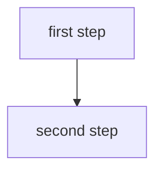

# Shared · RAG — Chunking, Reranking, Contextual, Agentic

**Status:** ☐ not started
**Written from:** 521 L7–8
**Reused by:** 536 S12 · 549 S10–11 · 546 S6
**Target date:** 13 Sep 2026

> Write this **once**, the first time any course reaches it. When the next course arrives, revise this file instead of writing a new note — then add a cross-link row below.

## Concepts

- 

## <Concept>

**Intuition** —

<!-- Every concept gets a diagram. `flowchart TD` unless it is a short linear
     pipeline of <=5 short boxes. Validate: cd tools && npm run check -->

**Mechanism** —

**Worked example** —

**Tradeoff / when NOT to use** —

> **Closed-book card**
> 

---

## Course-specific angles

| Course | Session | What that course emphasises | Extra detail it adds |
|---|---|---|---|
|  |  |  |  |

## Exam scope

| Course | Mid-sem (closed) | Comprehensive (open) |
|---|---|---|
|  |  |  |
