# Shared · Retrieval — Embeddings, ANN, BM25, Hybrid

**Status:** ✅ done (26 Jul deadline was 9 Aug — closed early, straight off 521 S2)
**Written from:** 521 L2
**Reused by:** 549 S10–11 · 536 S12
**Target date:** 9 Aug 2026

> Write this **once**, the first time any course reaches it. When the next course arrives, revise this file instead of writing a new note — then add a cross-link row below.

## Why this matters

Retrieval is what lets a model answer from current, private, or domain-specific knowledge instead of relying only on what it memorised in training. This note is the full path in one place: turn text into embeddings, compare vectors, index them fast enough for production, and combine semantic retrieval with keyword search when either alone is brittle. Every course that touches RAG — 521's agent memory, 549's data pipelines, 536's retrieval-based models — is a variation on this same pipeline, so it only needs building once.

## Concepts

- Embeddings — what they are, how they're produced, how they're trained
- Encoder / decoder / encoder-decoder — which architecture fits which retrieval role
- Similarity metrics — cosine, Euclidean, dot product
- The scaling wall — linear scan, then ANN (HNSW, IVF, PQ)
- Keyword retrieval — BM25 — and why dense alone isn't enough
- Hybrid retrieval — Dense Passage Retrieval, Reciprocal Rank Fusion, vector DB architecture

---

## 0. What an embedding is

**Intuition** — An embedding is a list of numbers that places a word, sentence, document, image, or query in a meaning space. Nearby vectors mean similar things, even when the surface words differ. An everyday analogy: a library map where books sit by *meaning*, not alphabet — "credit cards," "bank accounts" and "loans" cluster together; "river bank erosion" sits far away despite sharing the word "bank."

**Mechanism** — an embedding model maps text to a fixed-length vector. For retrieval, both stored documents and incoming queries are embedded into the *same* space, and search becomes nearest-neighbor search.

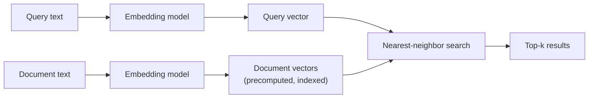

**Worked example** — query `"reset my password"` against three stored snippets:

| Text | Meaning match | Why |
|---|---:|---|
| `"change forgotten password"` | high | different words, same intent |
| `"delete account"` | medium | account-related, different action |
| `"weather in Hyderabad"` | low | unrelated |

Keyword search may miss the first if it expects the literal word "reset." Embeddings retrieve it because the semantic intent is close.

**Tradeoff / when NOT to use** — embeddings are weak for exact identifiers, codes, invoice numbers, legal clauses, rare proper nouns. A search for `"INC-48291"` or `"Section 14.2(b)"` needs keyword or metadata filtering to lead; semantic similarity follows.

> **Closed-book card**
> Embedding = fixed-length vector placing text in a meaning space; nearby vectors ≈ similar meaning. Retrieval = embed query + documents into the **same space**, then nearest-neighbor search. Weak on exact identifiers/codes/legal clauses — keyword/metadata should lead there.

---

## 1. Encoder models and contextual embeddings

**Intuition** — encoder models make good embedding machines because they read the *entire* input at once (bidirectional self-attention). That gives **contextual** embeddings — the vector for "bank" changes depending on whether the sentence is about a river or an account.

**Mechanism** — every token attends to every other token in the input:

```
Q = X W_Q,  K = X W_K,  V = X W_V
Attention(Q,K,V) = softmax(QKᵀ / √d_k) V
```

Plain language: `QKᵀ` asks "which other tokens matter to this token?", softmax turns those scores into weights, multiplying by `V` blends in the relevant information.

**Worked example** — in *"the bank was closed because the river overflowed,"* self-attention pulls "bank" toward geography via "river"/"overflowed." In *"the bank account was closed,"* it pulls toward finance via "account."

**Tradeoff / when NOT to use** — encoder embeddings are built for understanding and search, not open-ended generation. If the task is "write the answer token by token," decoder-only models are the standard choice.

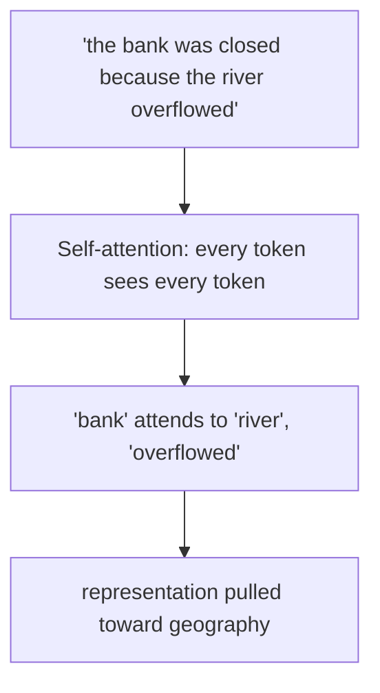

> **Closed-book card**
> Encoders read the whole input bidirectionally → **contextual** embeddings (same word, different vector by context). Good for search/classification/NER; not the natural fit for open-ended generation.

---

## 2. Encoder vs decoder vs encoder-decoder

**Intuition** — architecture decides what task feels natural: encoders understand, decoders generate, encoder-decoders transform one sequence into another.

**Mechanism** — the masking pattern is the difference:

| Architecture | Context view | Best at | Weak at |
|---|---|---|---|
| Encoder-only | Bidirectional — sees the whole input | embeddings, classification, NER, semantic search | free-form generation |
| Decoder-only | Causal — sees previous tokens only | chat, code, instruction following | pure embedding quality unless specially trained |
| Encoder-decoder | encoder sees source; decoder generates target | translation, summarisation | heavier architecture when one side would do |

**Worked example** — sentiment analysis on *"The food was slow but excellent"*: an encoder sees both "slow" and "excellent" before deciding. A decoder predicts one token at a time toward a label. Translation: encoder reads the source sentence, decoder writes the target while attending back to the encoded source.

**Tradeoff / when NOT to use** — don't force one architecture onto every problem. A decoder-only chat model *can* serve as an embedding model if specially trained for it, but a purpose-built encoder embedding model is usually cheaper, faster, and easier to index.

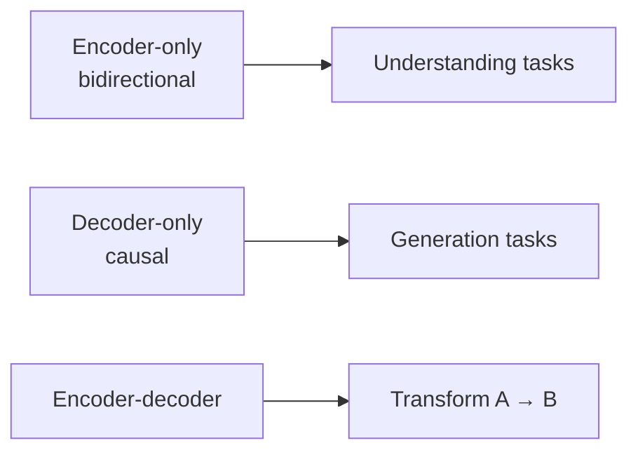

> **Closed-book card**
> **Encoder-only** = bidirectional, best for embeddings/classification/search. **Decoder-only** = causal, best for generation. **Encoder-decoder** = source→target transform (translation, summarisation). Pick by task shape, not by habit.

---

## 3. BERT-style embedding pipeline

**Intuition** — a sentence embedding isn't produced in one step. It's built through tokenization, lookup, positional addition, transformer layers, and pooling.

**Mechanism** — for `"Machine learning is fascinating"` in a BERT-like encoder:

| Step | What happens |
|---|---|
| 1 | Add `[CLS]` at the start, `[SEP]` at the end → 6 tokens |
| 2 | Convert tokens to IDs |
| 3 | Look up token embeddings — 6 vectors, each 768-dim |
| 4 | Add positional embeddings — same shape, elementwise sum |
| 5 | Run 12 transformer layers → 6 contextual vectors |
| 6 | Pool token vectors → 1 sentence vector |

Token embeddings are static at lookup (same ID → same row); context only appears after self-attention rewrites the vectors.

**Worked example** — position addition is elementwise:

```
token embedding      [0.23, -0.15, 0.89]
position embedding   [0.02,  0.03, 0.01]
input embedding      [0.25, -0.12, 0.90]
```

**Tradeoff / when NOT to use** — BERT-style encoders are excellent for medium-length text but have a bounded context window. If a document exceeds it, chunk carefully rather than truncate silently.

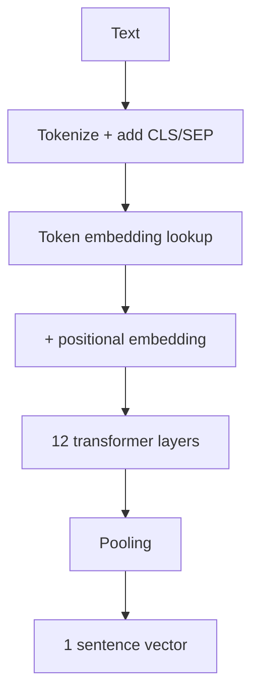

> **Closed-book card**
> Pipeline: tokenize (+CLS/SEP) → ID lookup → **+ positional embedding (elementwise)** → N transformer layers → **pool** → one vector. Token embeddings are static at lookup; context only appears after attention.

---

## 4. Pooling strategies

**Intuition** — the encoder outputs one vector per token; search needs one vector per chunk. Pooling compresses many vectors into one.

**Mechanism** —

| Pooling | Formula | Best fit |
|---|---|---|
| CLS pooling | `v = h_[CLS]` | classification, sentiment, NLI |
| Mean pooling | `v = (1/n) Σ h_i` | semantic similarity, search, RAG |
| Max pooling | `v_j = max(h_1j,...,h_nj)` | some retrieval/classification setups |

**Worked example** — three 2D token vectors `h1=[1,4], h2=[3,2], h3=[5,0]`:

```
mean pooling = [(1+3+5)/3, (4+2+0)/3] = [3, 2]
max pooling  = [max(1,3,5), max(4,2,0)] = [5, 4]
```

**Tradeoff / when NOT to use** — CLS pooling is convenient but not automatically best for retrieval. For sentence search and RAG, mean pooling often wins because it uses every token's output instead of trusting one summary token.

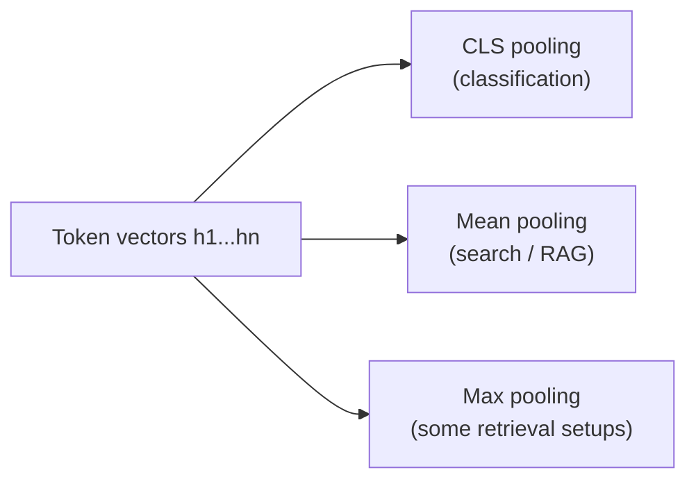

> **Closed-book card**
> **CLS** = one summary token, good for classification. **Mean** = average of all tokens, usually best for search/RAG. **Max** = elementwise max, occasional retrieval use. Default to mean pooling for retrieval unless told otherwise.

---

## 5. Embedding model selection

**Intuition** — an embedding model is a production component, not a generic utility. Dimension, context window, language coverage, cost and latency decide whether search actually works.

**Mechanism** —

| Factor | Why it matters |
|---|---|
| Dimension | Larger vectors carry more signal but cost storage, RAM, compute |
| Context window | Long documents need long-context embedding models or careful chunking |
| Training objective | Contrastive/retrieval training beats generic language modelling for search |
| Deployment type | API is simpler; open model gives control, privacy, batch economics |
| Domain/language | General English models underperform on legal, medical, code, multilingual corpora |

**Worked example** — a small internal FAQ is fine with a 768–1024-dim open model. Long policy documents with 1000+-token sections need a longer-context model or heading-based chunking. Sensitive customer data may justify local/open deployment even if an API model scores marginally higher.

**Tradeoff / when NOT to use** — don't chase the largest dimension blindly. A 4096-dim vector may improve quality, but if it doubles RAM and slows HNSW traversal without a measurable recall gain on your data, the smaller model wins.

> **Closed-book card**
> Choose an embedding model on: **dimension** (storage/compute cost), **context window** (long docs), **training objective** (contrastive beats generic LM for search), **deployment** (API vs open/local), **domain fit** (general models weak on legal/medical/code/multilingual). Bigger dimension ≠ automatically better — measure recall gain against the cost.

---

## 6. How embedding models are trained

**Intuition** — embedding quality comes from the training objective: related texts must end up close, unrelated texts far.

**Mechanism** —

| Objective | Core idea | Strength | Main risk |
|---|---|---|---|
| Contrastive learning | pull positive pairs close, push negatives far | directly trains semantic similarity | needs good negatives |
| Masked language modeling | hide tokens, predict from context | strong bidirectional understanding | not optimised for retrieval by itself |
| RetroMAE | reconstruct heavily-masked input via encoder/decoder | compact retrieval-oriented representations | more complex training |

Contrastive loss for anchor `a`, positive `p`, negatives `n`:

```
loss = -log( exp(sim(a,p)) / Σ exp(sim(a,n_i)) )
```

Plain language: reward the positive pair for scoring high, punish it if negatives score nearly as high.

**Worked example** — anchor `"The cat sat on the mat"`, positive `"A feline rested on the rug"`, negative `"How to bake chocolate cookies"`. A good model makes anchor–positive similarity high and anchor–negative similarity low.

**Tradeoff / when NOT to use** — contrastive training is sensitive to negative sampling. If the "negative" is actually relevant, the model learns the wrong boundary — which is why retrieval datasets need careful construction and hard-negative mining needs checking, not blind trust.

> **Closed-book card**
> Embedding models are trained so related text ends up close, unrelated text far. **Contrastive learning** (pull positive close / push negatives far) is the direct approach; **MLM** gives bidirectional understanding but isn't retrieval-optimised by itself; **RetroMAE** reconstructs masked input for compact retrieval representations. Risk: bad negatives teach the wrong boundary.

---

## 7. Vector similarity metrics

**Intuition** — similarity metrics define what "near" means. Cosine cares about direction, Euclidean about physical distance, dot product about direction *and* magnitude unless vectors are normalized.

**Mechanism** —

| Metric | Formula | High value means |
|---|---|---|
| Cosine similarity | `cos(A,B) = (A·B)/(‖A‖‖B‖)` | more similar direction |
| Euclidean distance | `d(A,B) = √Σ(A_i - B_i)²` | more *different* (larger = farther) |
| Dot product | `A·B = Σ A_i B_i` | stronger alignment and/or larger magnitude |

If `‖A‖ = ‖B‖ = 1` (normalized), dot product **equals** cosine similarity.

**Worked example** — `A=[3,4], B=[4,3], C=[-4,3]`:

```
A·B = 24, ‖A‖=‖B‖=5 → cos(A,B) = 24/25 = 0.96
L2(A,B) = √((3-4)²+(4-3)²) = √2 = 1.414

A·C = 0 → cos(A,C) = 0   (orthogonal)
L2(A,C) = √((3+4)²+(4-3)²) = √50 = 7.071
```

`B` is very close to `A`; `C` is far and orthogonal.

**Tradeoff / when NOT to use** — cosine is usually safer for text since it ignores vector length. Dot product is fast and common in vector DBs, but behaves like cosine only if embeddings are normalized or the model was trained for dot-product scoring.

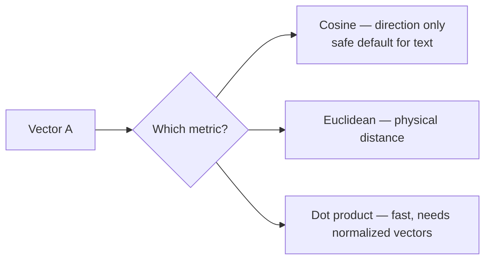

> **Closed-book card**
> **Cosine** = direction only, safe default for text. **Euclidean (L2)** = physical distance, larger = farther. **Dot product** = fast, equals cosine only if vectors are normalized. Worked numbers: A=[3,4], B=[4,3] → cos=0.96, L2=1.414 (close); A vs C=[-4,3] → cos=0, L2=7.07 (far, orthogonal).

---

## 8. Linear scan and the computational wall

**Intuition** — exact nearest-neighbor search is simple: compare the query against every stored vector. It becomes impossible at production scale.

**Mechanism** — cost = `number_of_vectors × vector_dimension`. For 10M vectors of dimension 768:

```
10,000,000 × 768 = 7,680,000,000 multiply-adds
```

At 1 billion ops/sec, ≈7.68 seconds **per query**, one core.

**Worked example** — serving 100 simultaneous queries/sec at that rate needs:

```
7.68 s/query × 100 queries/s = 768 cores
```

— before network overhead, filters, reranking, or the LLM call.

**Tradeoff / when NOT to use** — linear scan is fine for tiny collections, offline evaluation, verifying ANN recall. It is not the serving strategy for millions of vectors unless hardware is specialised and the workload justifies brute force.

> **Closed-book card**
> Linear scan cost = **vectors × dimension** per query. 10M × 768-dim ≈ 7.68 GFLOP/query ≈ 7.68s on one core → 768 cores needed for 100 QPS. Fine for tiny collections / offline eval; not a production serving strategy at scale.

---

## 9. ANN and vector indexing

**Intuition** — Approximate Nearest Neighbor search skips checking every vector, accepting "close enough" top-k in exchange for large speedups.

**Mechanism** — three common strategies:

| Strategy | Example | How | Strength | Weakness |
|---|---|---|---|---|
| Graph-based | HNSW | connect nearby vectors in a navigable graph | high recall, fast, no training | memory-heavy |
| Partition-based | IVF | cluster vectors, search selected clusters | scalable, tunable | needs training; sensitive to cluster count |
| Compression-based | PQ | compress vectors into compact codes | huge memory savings | lower recall, more approximation |

**Worked example** — a 10M-chunk RAG FAQ: exact scan takes seconds; HNSW returns a high-quality approximate top-10 in milliseconds by walking graph links instead of scoring all 10M vectors.

**Tradeoff / when NOT to use** — ANN trades latency against recall. If the collection is small, or top-1 must be mathematically exact, brute force may be safer. In RAG, 95–99% approximate recall is usually fine because the LLM answer is already probabilistic and a reranker can clean up the candidate set.

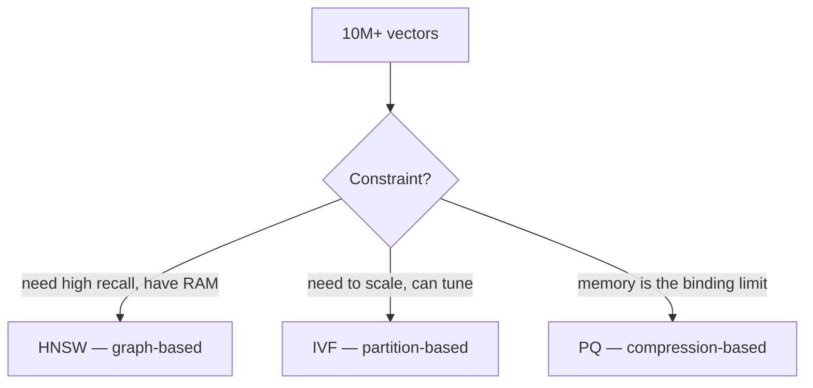

> **Closed-book card**
> ANN = approximate top-k instead of exact scan, for speed. **HNSW** (graph, high recall, memory-heavy) · **IVF** (clusters, scalable/tunable, needs training) · **PQ** (compressed codes, huge memory savings, lower recall). RAG tolerates 95–99% recall since a reranker/LLM absorbs the rest.

---

## 10. HNSW — Hierarchical Navigable Small World

**Intuition** — a multi-level road network for vectors. Top layers are highways with long jumps; the bottom layer is local streets containing every point.

**Mechanism** — vectors are graph nodes, edges connect nearby nodes. Search starts at a sparse high layer, greedily moves closer to the query, then descends layer by layer to the dense base layer.

| Parameter | Meaning | Raising it does |
|---|---|---|
| `M` | max connections per node/layer | improves recall, increases memory + insert cost |
| `ef_construction` | candidate list during build | better index quality, slower build |
| `ef_search` | candidate list during query | better recall, slower query |

**Worked example** — 768-dim float32 vectors, `M=16`:

```
raw vector bytes ≈ 768 × 4 = 3,072 bytes
connection bytes ≈ 16 × 4 = 64 bytes (per layer-like average)
rough per-vector storage ≈ 3,136 bytes before graph overhead

At 1M vectors: raw vectors alone ≈ 3.07 GB.
Production HNSW often needs ~1.5–2.0× raw vector memory once
graph overhead and metadata are included.
```

**Tradeoff / when NOT to use** — HNSW is a strong default up to large-but-memory-manageable datasets. If memory is the binding constraint at hundreds of millions to billions of vectors, IVF+PQ (or another compressed/partitioned setup) may beat HNSW even at lower recall.

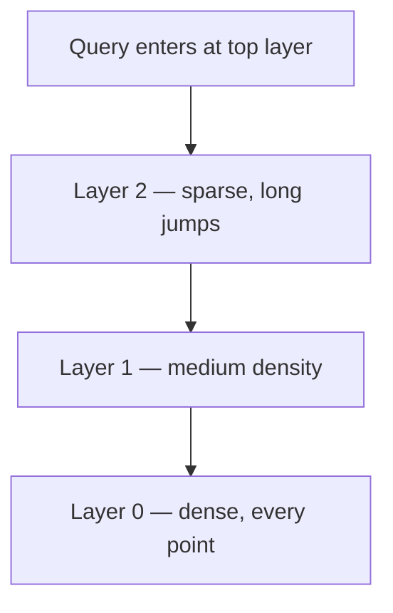

> **Closed-book card**
> HNSW = multi-layer graph, top layers sparse/long-jump, bottom layer dense/complete. Search descends layer by layer toward the query. Knobs: **M** (connections/node — recall vs memory), **ef_construction** (build quality), **ef_search** (query recall vs speed). ~1.5–2.0× raw vector memory in production. Strong default until memory becomes the binding constraint (then IVF+PQ).

---

## 11. Semantic search vs keyword search

**Intuition** — semantic search answers "what means the same thing?"; keyword search answers "what contains these words?" They fail differently — hence hybrid retrieval.

**Mechanism** —

| Retrieval type | Representation | Best for | Failure mode |
|---|---|---|---|
| Keyword / sparse | term counts, BM25-style weighting | names, IDs, exact phrases, rare terms | misses paraphrases |
| Dense / semantic | neural embeddings | synonyms, concepts, natural-language questions | can blur exact facts |
| Hybrid | sparse + dense + fusion | production RAG | more moving parts |

**Worked example** — query `"laptop reimbursement policy"`:

| Document | Keyword result | Dense result |
|---|---|---|
| `"employee device expense rules"` | may miss (no matching words) | likely match |
| `"laptop serial number inventory"` | may match (keyword "laptop") | likely demote |
| `"reimbursement form LAP-2026"` | likely match (exact code) | likely match if context enough |

**Tradeoff / when NOT to use** — dense-only search is risky for compliance/support systems where exact product names, ticket IDs, SKUs or policy clauses matter. Keyword-only is risky when users describe the idea in different words from the document.

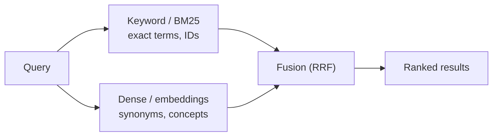

> **Closed-book card**
> **Keyword/sparse**: exact terms, IDs, rare words — misses paraphrase. **Dense/semantic**: synonyms and concepts — can blur exact facts. **Hybrid**: combine both, more moving parts, the production default.

---

## 12. BM25

**Intuition** — the strong classical baseline for keyword search. Rewards documents containing query terms — especially rare terms — without unlimited reward for repetition.

**Mechanism** — combines:

| Component | Plain meaning |
|---|---|
| term frequency | a term appearing more often helps, but saturates |
| inverse document frequency | rare terms matter more than common ones |
| length normalization | long documents shouldn't win just by containing more words |

**Worked example** — query `"HNSW ef_search"`: BM25 strongly rewards a document containing the exact rare term `"ef_search"`. A dense retriever may understand the general HNSW-tuning topic but miss the exact parameter name — exact-match evidence matters here.

**Tradeoff / when NOT to use** — BM25 struggles with vocabulary mismatch. `"how do I make vector lookup faster?"` may need a document titled `"ANN indexing and HNSW tuning"` — semantic retrieval is more likely to bridge that gap.

> **Closed-book card**
> BM25 = term frequency (saturating) × inverse document frequency (rare terms matter more) × length normalization. Strong on exact rare terms/parameter names; weak on vocabulary mismatch (paraphrase).

---

## 13. Dense Passage Retrieval (DPR)

**Intuition** — two encoders, one for questions and one for passages. Retrieval is maximum similarity between the query vector and precomputed passage vectors.

**Mechanism** — dual-encoder architecture:

```
q = Encoder_question(question)
p = Encoder_passage(passage)
score(question, passage) = q · p
```

Passage vectors are precomputed and indexed; only the question is embedded at query time.

**Worked example** — question `"Who wrote Pride and Prejudice?"`. Positive passage: *"...a novel by Jane Austen..."*. Negative: *"...a 2005 romantic drama film..."*. Training pushes the question vector toward the answer-bearing passage, away from negatives.

**Tradeoff / when NOT to use** — DPR-style dense retrieval excels at semantic QA but can underperform on exact lexical constraints and fresh domain terminology unless the embedding model is adapted for that domain. Hybrid retrieval is the safer production default.

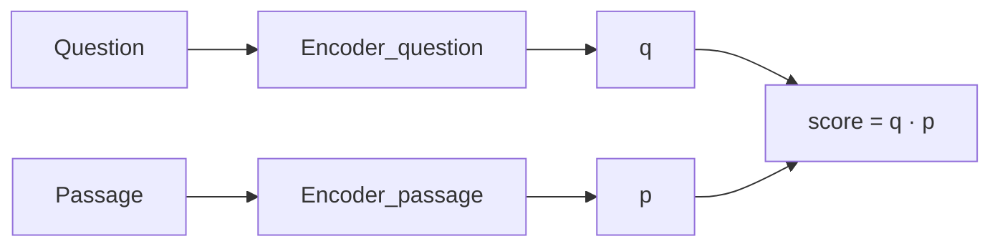

> **Closed-book card**
> DPR = dual encoder — separate question and passage encoders, score = dot product. Passage vectors precomputed/indexed; only the question embedded at query time. Strong for semantic QA; weaker on exact lexical/fresh terminology unless domain-adapted.

---

## 14. Reciprocal Rank Fusion (RRF)

**Intuition** — combines *rankings*, not raw scores — because BM25 and dense-similarity scores live on different, incomparable scales.

**Mechanism** —

```
RRF(doc) = Σ_over_rankers  1 / (k + rank(doc))
```

`k` (often ≈60) softens the effect of rank position; a document ranked reasonably high in *both* lists often beats one ranked high in only one.

**Worked example** — `k=60`:

| Document | BM25 rank | Dense rank | RRF score |
|---|---:|---:|---:|
| A | 1 | 10 | 1/61 + 1/70 = 0.0307 |
| B | 5 | 3 | 1/65 + 1/63 = 0.0313 |
| C | 2 | not in top list | 1/62 = 0.0161 |

Document B wins — strong in both systems, even though A ranked #1 in one.

**Tradeoff / when NOT to use** — RRF is robust and simple but ignores score margins. If a dense retriever is overwhelmingly confident and BM25 only weakly matches, rank-only fusion can over-promote the keyword result. Production systems often follow hybrid retrieval with a reranker.

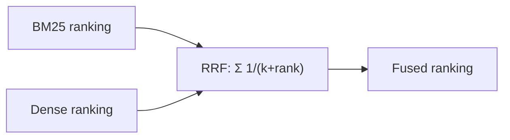

> **Closed-book card**
> RRF fuses **rankings** (not scores): `Σ 1/(k+rank)`, k≈60. Doc strong in both lists beats doc that's #1 in only one. Worked: BM25 rank1+dense rank10 (0.0307) loses to BM25 rank5+dense rank3 (0.0313). Weakness: ignores score margins/confidence.

---

## 15. Vector database architecture

**Intuition** — a vector database is a retrieval *system*, not just a table with vectors: embeddings, indexes, metadata filters, update pipelines, and observability all around the core index.

**Mechanism** — a production retrieval layer usually includes:

| Component | Job |
|---|---|
| chunker | splits documents into retrievable passages |
| embedding service | converts chunks and queries to vectors |
| vector index | serves fast ANN search |
| metadata filters | restrict by tenant, date, access control, document type |
| sparse index | BM25/keyword retrieval |
| fusion/reranker | combines and improves candidate ordering |
| monitoring | tracks recall, latency, cost, freshness, failed searches |

**Worked example** — an HR assistant query `"Can I claim a monitor for work from home?"` should search only documents the employee may see, retrieve semantically related policy chunks, preserve exact policy-code matches, and pass the top chunks to the LLM with citations/source IDs.

**Tradeoff / when NOT to use** — a vector database doesn't automatically fix bad retrieval. If chunks are too large, metadata is missing, embeddings are mismatched, or access filters are bolted on after search, the system returns plausible but unsafe context. For small, stable FAQ data, a simple keyword index plus curated answers may be easier to audit.

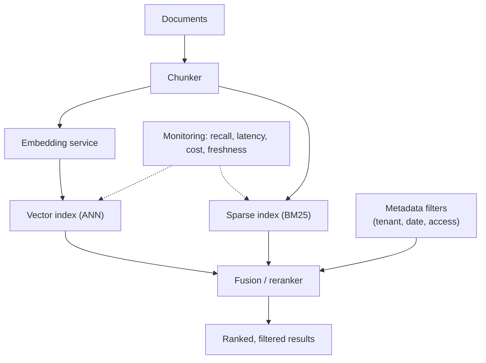

> **Closed-book card**
> Production retrieval = chunker → embedding service → **vector index (ANN)** + **sparse index (BM25)** → metadata filters → fusion/reranker → monitoring. A vector DB alone doesn't fix bad retrieval — bad chunking, missing metadata, or bolted-on access control still produce plausible-but-unsafe answers.

---

## Course-specific angles

| Course | Session | What that course emphasises | Extra detail it adds |
|---|---|---|---|
| 521 Conversational AI | L2 (mid-sem, closed book) | Full pipeline: embeddings → similarity → ANN → hybrid, as the knowledge-access layer of a RAG chatbot | The original worked examples above (cosine/L2 by hand, RRF by hand, HNSW memory estimate) |
| 549 Cloud Native | S10–11 (comprehensive, open book) | *Not yet written* — expected to be a lighter, infrastructure-facing pass: vector DB as a deployed service, API surface for retrieval, RAG metrics | — |
| 536 LLMs | S12 (comprehensive, open book) | *Not yet written* — expected to connect back to *Semantic search vs keyword search* and to RAG as the fix for hallucination/"lost in the middle" | — |

## Exam scope

| Course | Mid-sem (closed) | Comprehensive (open) |
|---|---|---|
| 521 | ✅ in scope — L2 is mid-sem material (S1–S8) | — |
| 549 | not yet reached | expected S10–11 |
| 536 | not yet reached | expected S12 |
