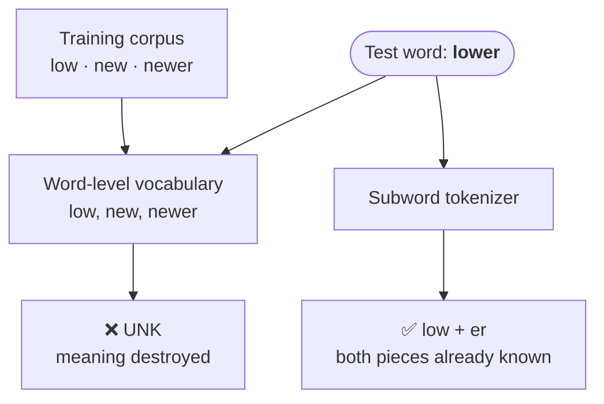
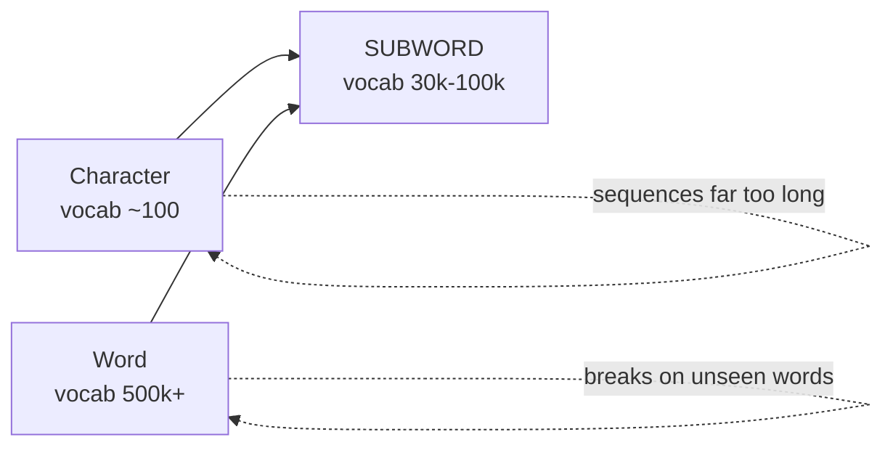
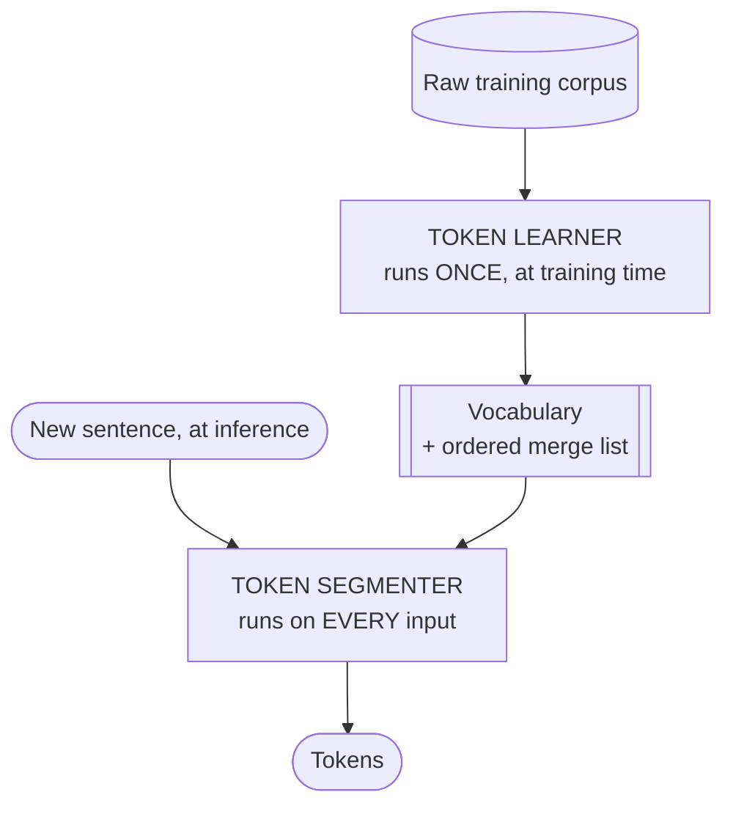
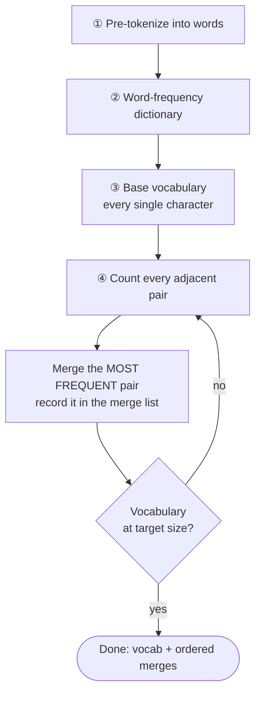
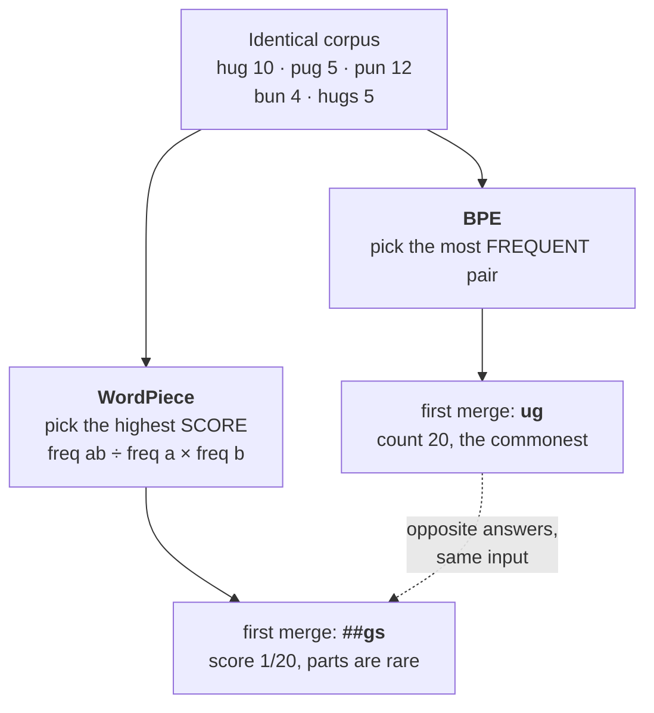
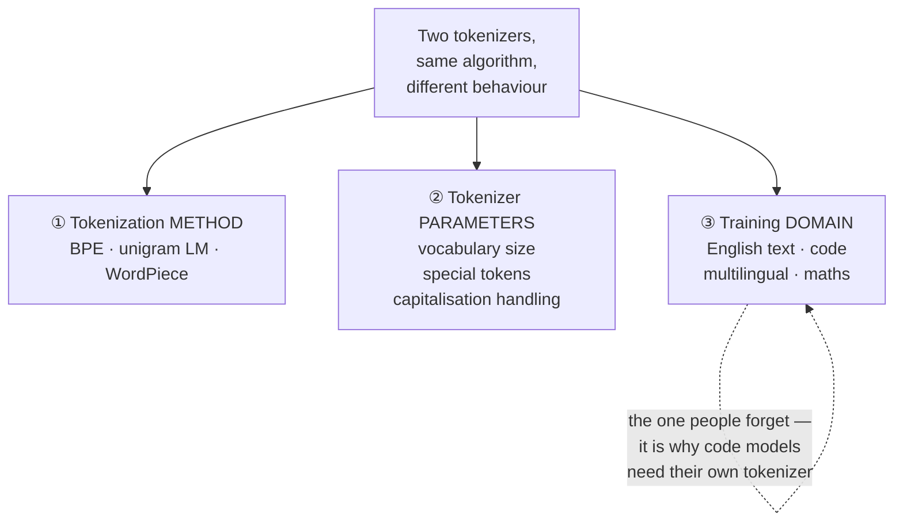
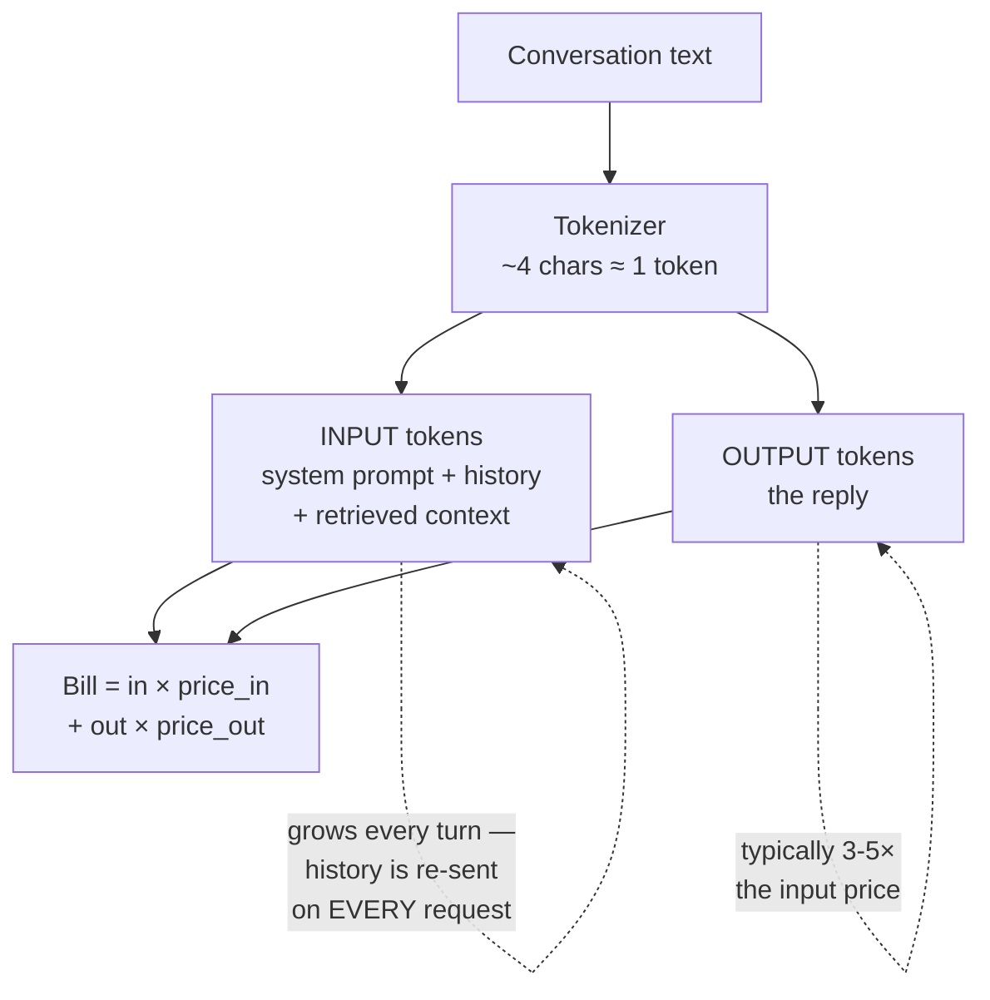

# Shared · Tokenization & BPE

**Status:** ✅ written 26 Jul 2026
**Written from:** 521 S1 deck · 536 S1 deck · HuggingFace LLM course ch6.5 (the source both decks copied) · **T1 Jurafsky & Martin ch2 section 2.4** · **T2 Alammar ch2**
**Reused by:** 521 S11 (cost optimisation) · 536 S6 (serving economics)

> 🔴 **Closed-book scope in BOTH subjects** — 521 mid-sem (L1–L8) and 536 mid-sem (S1–8). You must reproduce BPE by hand for two different exams, one day apart. Highest-value shared note of the semester.

> **Both decks copied the same source.** 521 and 536 independently reproduce HuggingFace LLM course ch6.5 — identical corpus (`hug/pug/pun/bun/hugs`), identical merges, identical `mug`/`thug`/`unhug` exercises. Learn it once, here.

## Why this matters

Tokenization sits under everything else in the degree. Context limits are counted in tokens, API bills are priced in tokens, prompt-injection tricks exploit token boundaries, and when a model "can't count the r's in strawberry" the tokenizer is why. It is the least glamorous topic here and the one that explains the most surprising behaviour — which is why it's worth this much space.

**Assembled from five sources.** 521 and 536 both taught it in session 1 from the same origin (HuggingFace ch6.5), so rather than two half-notes there is one, with J&M and Alammar filling the gaps both decks leave.

**Two worked corpora, deliberately.** The HuggingFace one (section 4) is what both decks use. The J&M one (section 4, second pass) is the more instructive: BPE independently discovers the English prefix `re-` from raw frequency counts, with nobody telling it that prefixes exist. That is the point of the algorithm in one example.

🔴 **A doing note, not a reading note.** The test is: given `hug, pug, pun, bun, hugs` with counts, can you produce the merge list in order from a blank page? If not, you have read section 4 but you do not have it.

## Sections

0. **Why tokenize at all** — replicability, and the unknown-word problem stated precisely
1. **What a subword is** — the middle ground between characters and words
2. **Token types** — whole words, subwords, characters, special tokens, and byte fallback
3. **The three algorithms** — BPE (worked twice), WordPiece, Unigram
4. **WordPiece** — ⚠️ marked out of scope for both handouts; read only if time is free
5. **SentencePiece and tiktoken** — what production systems actually ship
6. **Tokenizer design choices** — vocabulary size, casing, whitespace, and what each costs
7. **Token economics** — how a tokenizer decision shows up on an invoice

---

## 0. Why tokenize at all

*Source: J&M ch2 §2.4 — the framing neither deck gives*

**Intuition** — Tokenization is *"the first stage of natural language processing: segmenting the running input text into tokens."* But why impose a fixed unit at all?

**Two reasons, both examinable:**

1. **Agreement and replicability.** A deterministic fixed set of units means different algorithms and systems can answer simple questions the same way — *How long is this text?* Is *don't* one token or two? Is *New York*? J&M: *"Standardizing is thus essential for replicability in NLP experiments,"* and **perplexity assumes a fixed tokenization** — you cannot compare perplexity across models with different tokenizers.
2. **Eliminating unknown words.** Tokenizations that include sub-word units remove the OOV problem.



**The unknown-word problem, stated precisely** — J&M's example is cleaner than "mug":

> Training corpus contains **low**, **new**, **newer** — but not **lower**.
> **lower** appears in the test corpus. A word-level system has no idea what it is.

A subword tokenizer splits `lower` into pieces it has seen, and the model can still work with it.

**Three candidates for the token unit, and why two fail:**

| Unit | Problem |
|---|---|
| **Words** | Approximately the right level — consistent meanings — but **challenging to define formally** (*don't*? *New York*?) |
| **Morphemes** | Also about the right level, same definitional difficulty |
| **Characters** | **Clear to define, but too small** a unit |

Hence the practical answer: a **data-driven** approach producing units *"about the size of morphemes or words, but occasionally as small as characters."*

> **Closed-book card**
> **Tokenization** = first stage of NLP; segmenting running text into tokens. Why: **(1) agreement/replicability** — fixed units let systems agree on "how long is this text", "is *don't* one token or two"; **perplexity assumes a fixed tokenization**. **(2) eliminates unknown words** — training has low/new/newer but not *lower*; word-level fails, subword doesn't.
> Three candidate units: **words** (right level, hard to define formally) · **morphemes** (same) · **characters** (clear but too small). Answer: **data-driven** units ≈ morpheme/word size, occasionally down to characters.

## 1. Why subwords exist

**Intuition** — BPE sits in the **"Goldilocks" zone** between two failing extremes.



*Going left to right across the middle: vocabulary grows, sequence length shrinks. Subword is where that trade is least bad.*

| Approach | Failure |
|---|---|
| **Character-based** | Sequences too long, little meaning per token |
| **Word-based** | Huge vocabulary, and **fails on any word unseen in training** |
| **Subword** | Common words get their own token; rare words split into known pieces |

Worst case, a word splits into as many subwords as it has characters.

```
hat, learn          →  common words, one token each
taa##aaa##sty       →  variations
la##ern##           →  misspellings
Transformer##ify    →  novel items
```

Word tokens fail two ways: they cannot handle words entering after the tokenizer was trained, and they waste vocabulary on near-duplicates — *apology, apologize, apologetic, apologist* become four unrelated entries.

> **Closed-book card**
> Subword tokenization = **Goldilocks zone**. Character-based → sequences too long, little meaning. Word-based → huge vocab, fails on unseen words, wastes entries on near-duplicates (apology/apologize/apologetic/apologist). Subword → frequent words own token, rare words split; worst case one token per character.

---

## 2. Three token types

| Type | Vocabulary | New words? | Sequence length | Used by |
|---|---|---|---|---|
| **Word** (word2vec) | One entry per word | ❌ | Shortest | Legacy |
| **Subword** | Learned pieces | ✅ splits them | Middle | Everything modern |
| **Byte** | **256 UTF-8 bytes**, 1 token = 1 byte | ✅ never any OOV | Longest | **ByT5, CANINE** (tokenizer-free) |

Byte example: `"Apple"` → `[65][112][112][108][101]` = **5 tokens**.

> **Closed-book card**
> **Word**: one per word, can't handle new words, near-duplicate waste. **Subword**: splits unknowns into known pieces — the standard. **Byte**: vocab = **256 UTF-8 bytes**, 1 token = 1 byte, **no OOV ever**, very long sequences ("Apple" = 5 tokens). Tokenizer-free: **ByT5, CANINE**.

---

## 3. The three subword algorithms

All three share the same two-part structure — **definitional and examinable**:

1. **Token learner** — corpus → vocabulary
2. **Token segmenter** — sentence → tokens, using that vocabulary



⚠️ **The trap this diagram prevents:** the segmenter replays the learner's merges **in the order they were learned**. Frequencies in the *test* data play no part whatsoever — only training frequencies ever mattered.

| Algorithm | Origin | Merge criterion |
|---|---|---|
| **BPE** | Sennrich et al., 2016 | **Most frequent** adjacent pair |
| **Unigram LM** | Kudo, 2018 | Probabilistic — Viterbi over candidate segmentations |
| **WordPiece** | Schuster & Nakajima, 2012 | **Highest score** = pair freq ÷ (freq a × freq b) |

Vocabulary is built **dynamically**: frequent words get their own tokens, rare words get split.

---

## 4. BPE — the worked example, reproducible by hand

**Algorithm:** ① pre-tokenize into words ② build a **word-frequency dictionary** ③ start from a **uni-character** vocabulary ④ repeatedly **merge the most frequent adjacent pair** until target size.



**Corpus:** `("hug", 10), ("pug", 5), ("pun", 12), ("bun", 4), ("hugs", 5)`
**Base vocabulary:** `["b", "g", "h", "n", "p", "s", "u"]`
**Initial split:** `("h","u","g",10) ("p","u","g",5) ("p","u","n",12) ("b","u","n",4) ("h","u","g","s",5)`

### Merge 1 — count every adjacent pair

| Pair | Appears in | Total |
|---|---|---|
| **("u","g")** | hug 10 + pug 5 + hugs 5 | **20** ✅ |
| ("p","u") | pug 5 + pun 12 | **17** ← *the runner-up; watch it at merge 2* |
| ("u","n") | pun 12 + bun 4 | 16 |
| ("h","u") | hug 10 + hugs 5 | 15 |
| ("g","s") | hugs 5 | 5 |
| ("b","u") | bun 4 | 4 |

*All six pairs, not just the top three — if you work this by hand you will find `("p","u") = 17`, and a table that omits it looks like you made an arithmetic error.*

Rule: **`("u","g") → "ug"`**
Vocabulary: `[b, g, h, n, p, s, u, ug]`
Corpus: `("h","ug",10) ("p","ug",5) ("p","u","n",12) ("b","u","n",4) ("h","ug","s",5)`

### Merge 2 — the trap

`("h","ug")` has just become available at **15** and looks like the obvious next merge. It isn't — **`("u","n")` is at 16** and wins.

Rule: **`("u","n") → "un"`**
Vocabulary: `[b, g, h, n, p, s, u, ug, un]`
Corpus: `("h","ug",10) ("p","ug",5) ("p","un",12) ("b","un",4) ("h","ug","s",5)`

**The complete recount, which is where the real lesson is:**

| Pair | Total | vs before merge 1 |
|---|---|---|
| ("u","n") | **16** ✅ | 16 — unchanged |
| ("h","ug") | 15 | *newly available* |
| **("p","u")** | **12** | **was 17 — collapsed** |
| ("p","ug") | 5 | newly available |
| ("ug","s") | 5 | newly available |
| ("b","u") | 4 | 4 — unchanged |

⚠️ **Look at `("p","u")`.** Before merge 1 it was the **second-highest pair at 17**. Merging `u+g` consumed the `p·u` inside `pug`, turning it into `p·ug` — so `("p","u")` now survives only in `pun`, and drops to 12. **It didn't lose a ranking contest; it was silently eaten by an unrelated merge.**

That is the actual reason you must recount from scratch at every step: a merge doesn't just add one token, it **destroys every overlapping pair**. Carrying merge 1's ranking forward gives the wrong answer, and the pair it misleads you about isn't even the one you merged.

### Merge 3

Now `("h","ug")` is most frequent. Rule: **`("h","ug") → "hug"`** — first three-letter token.
Vocabulary: `[b, g, h, n, p, s, u, ug, un, hug]`
Corpus: `("hug",10) ("p","ug",5) ("p","un",12) ("b","un",4) ("hug","s",5)`

### A second worked example — where BPE discovers a morpheme

*J&M ch2. Worth doing because it shows what BPE is actually learning, which the hug/pug example doesn't.*

Corpus (spaces shown as `_`, and **whitespace is attached to the start of a word**):

```
2  _n e w
2  _r e n e w
1  _s e t
1  _r e s e t
```
Vocabulary: `_, e, n, r, s, t, w`

| Merge | Pair | Count | New token |
|---|---|---|---|
| 1 | `n e` | 4 — in `_new` (2) + `_renew` (2) | `ne` |
| 2 | `ne w` | 4 | `new` |
| 3 | `_ r` | 3 | `_r` |
| 4 | `_r e` | 3 | **`_re`** |

> After merge 4 the system has **essentially induced that there is a word-initial prefix `re-`.**

That's the point. Nobody told it about morphology; it fell out of counting. Continuing gives `_new`, `_renew`, `se`, `set`.

**Why this matters:** those merges *"created knowledge of morphemes like the `re-` prefix, that might appear in perhaps unseen combinations like **revisit** or **rearrange**"*, and of `new` **without** an initial space — word-internal — which lets it handle unseen words like **anew**.

### The algorithm as pseudocode

```
function BYTE-PAIR-ENCODING(strings C, number of merges k) returns vocab V
    V ← all unique characters in C          # initial tokens are characters
    for i = 1 to k do                       # merge k times
        t_L, t_R ← most frequent pair of adjacent tokens in C
        t_NEW   ← t_L + t_R                 # concatenate
        V       ← V + t_NEW                 # update vocabulary
        replace each occurrence of t_L, t_R in C with t_NEW
    return V
```

**`k` is a parameter of the algorithm.** Final vocabulary = the original characters **plus k new symbols**. That's how you get to a target vocabulary size.

### Merges never cross word boundaries

The one practical complication J&M flags. The corpus is first separated at **whitespace and punctuation**, giving one string per word plus its count. **Counts come from the corpus, but merges are only allowed within a word.** And *"the white space is usually attached to the start of the word"* — which is exactly why GPT-2 tokenizes `sun` as `" sun"` with the space glued on (section 6).

### Segmenting new words

**Normalize → pre-tokenize → split into characters → apply merge rules *in learned order*.**

J&M states the encoder rule precisely, and it's a common exam trap: the encoder *"runs on the test data the merges we learned from the training data. It runs them **greedily, in the order we learned them**."* — so **frequencies in the test data play no role whatsoever**. Only training frequencies ever mattered.

| Word | Result | Why |
|---|---|---|
| `bug` | `["b", "ug"]` | both in vocabulary |
| `mug` | **`["[UNK]", "ug"]`** | **"m" was never in the base vocabulary** |
| `thug` | `["[UNK]", "hug"]` | "t" not in base vocab; then u+g, then h+ug |
| `unhug` | **`["un", "hug"]`** | `u n h u g` → ug → `u n h ug` → un → `un h ug` → hug → **`un hug`**. All chars in base vocab, no `[UNK]` |

*(`unhug` is the exercise both decks set and neither answers.)*

**Advantages** — efficient handling of rare words; reduced vocabulary size; better generalisation.
**Limitations** — **fragments morphologically complex languages**; **may not capture semantic meaning** as well as other methods.

**Tradeoff / where BPE fails** — the `mug` case is the whole limitation: **character-level BPE has no fallback**. Any character missing from the base vocabulary becomes `[UNK]` and its meaning is destroyed. HuggingFace notes this is precisely why many NLP models handle emoji badly. Byte-level BPE (section 6) fixes it.

> **Closed-book card**
> **BPE** (Sennrich et al. 2016; earlier Gage 1994): **two parts — a trainer and an encoder.** Trainer: pre-tokenize → word-freq dict → uni-character vocab → **merge most frequent adjacent pair** → repeat **k** times. Final vocab = characters **+ k new symbols**; **k is the parameter**.
> **Merges never cross word boundaries** — corpus split at whitespace/punctuation first; **whitespace attached to the start of the word** (why GPT-2 emits `" sun"`).
> **Encoder runs the learned merges greedily, in the order learned — test-data frequencies are irrelevant.**
> J&M's example: `_new ×2, _renew ×2, _set, _reset` → merges `ne` → `new` → `_r` → **`_re`**, i.e. **BPE induces the `re-` prefix** and can then handle unseen *revisit*, *rearrange*, *anew*.
> hug10/pug5/pun12/bun4/hugs5: **merge 1 = ("u","g") @20** (runners-up: **("p","u") 17**, ("u","n") 16, ("h","u") 15) → **merge 2 = ("u","n") @16** — and `("p","u")` has *collapsed 17 → 12*, because `pug`'s `p+u` became `p+ug`. **Merging one pair silently re-counts every pair that overlapped it.** → **merge 3 = ("h","ug") @15**, the first 3-letter token.
> Segmenting: normalize → pre-tokenize → chars → merges **in order**. `bug`→[b,ug] · `mug`→**[UNK],ug** · `thug`→[UNK],hug · `unhug`→**[un,hug]**.
> **+** rare words, smaller vocab, generalisation. **−** fragments complex morphology, weak semantics, **no fallback ⇒ [UNK] destroys meaning** (why models fail on emoji).

---

## 5. WordPiece — the contrast that sharpens BPE

*⚠️ 536 marks this **"Extra slides (Not for exams)"**; 521 doesn't teach it. **Out of exam scope for both** — kept for Lab 1, and because the contrast makes BPE's criterion concrete.*

Google's tokenizer, built to pretrain **BERT**. Same training shape as BPE; **tokenization differs**.

**Prefix:** non-initial pieces get `##` — `word` → `w ##o ##r ##d`.



**Merge criterion — score, not raw frequency:**

```
score(a, b) = freq(a, b) / (freq(a) × freq(b))
```

This **favours pairs whose individual parts are rare**. Same corpus, initial vocabulary `[b, h, p, ##g, ##n, ##s, ##u]`:

| Pair | Score | Value |
|---|---|---|
| `("##u","##g")` | 20 / (36 × 20) | **1/36** |
| `("##g","##s")` | 5 / (20 × 5) | **1/20** ✅ |

**First merge is `##gs`, not `##ug` — the opposite of BPE on the identical corpus.** That's the point of the example.

**Segmenter:** longest subword from the start of the word, split, repeat. With final vocabulary `[b, h, p, ##g, ##n, ##s, ##u, ##gs, hu, hug]`, `hugs` → **`["hug", "##s"]`**.

> **Reference card (out of scope)**
> **WordPiece** (Schuster & Nakajima 2012, BERT). `##` on non-initial pieces. Merges by **score = freq(a,b)/(freq(a)×freq(b))** — likelihood-based, favours rare parts, vs BPE's raw frequency. Same corpus → first merge **`##gs`** (1/20) beats `##ug` (1/36), **opposite of BPE**. Segmenter: longest-subword-first. `hugs` → `["hug","##s"]`.

---

## 6. SentencePiece, byte-level BPE, tiktoken

*⚠️ Byte-level BPE sits in 536's "not for exams" section. **SentencePiece and tiktoken are in 521's main deck and ARE examinable for 521.***

### SentencePiece

**Language-independent** — learns from **raw Unicode text**, fixed vocabulary size, **no whitespace pre-tokenizer required**. That's what makes it language-independent: it doesn't assume spaces separate words.

- Supports **BPE and unigram LM** as its two practical algorithms
- **Preserves whitespace with `▁`** → detokenization is **lossless**: join pieces, replace `▁` with a space
- **Byte fallback** — anything outside the vocabulary becomes raw UTF-8 bytes, so **no true OOV**; emoji and rare scripts work

`Tokenization matters` → `▁Tokenization▁matters` → pieces.

**Unigram** enumerates candidate segmentations and runs **Viterbi** for the most probable:

```
"lowering"   chosen:    [lower, ing]
             alternate: [low, er, ing]
```

### Byte-level BPE (GPT-2)

UTF-8 encodes each character as **1–4 bytes**, so text is modelled as a **sequence of bytes rather than characters**. Starts with **256** byte tokens, learns to glue them into words. **Zero unknown words** — always falls back to individual bytes.

**GPT-2 vocabulary = 50,257 = 256 byte tokens + 50,000 merges + 1 end-of-text token.** That's where the odd number comes from.

`"Café 🚀"`:

| Tokenizer | Result |
|---|---|
| Byte tokens (no merging) | 10 tokens — `é` is 2 bytes, 🚀 is 4 |
| Character BPE | **3 tokens, one is `[UNK]`** — the failure |
| Byte-level BPE | **2 tokens** |

`The sun is ☀️` under GPT-2: `The`→464 · ` sun`→6035 (**space glued to the word**) · ` is`→374 · ` `→220 · `☀️`→99321 (**one token** — common emoji, all bytes merged).

### SentencePiece vs tiktoken

They differ in **what unit they merge over** (characters vs bytes) and **whether they pre-split** (no vs regex-yes).

```
SentencePiece BPE (Llama-2):
  ▁Hello,▁world!  →  [▁Hello, ,, ▁world, !]

tiktoken BPE (Llama-3):
  regex chunks: [Hello, ,,  world, !]
  tokens:       [Hello, ,, ' world', !]     ← space inside " world"
```

**tiktoken's byte-level + regex-pretokenized design gives better compression, no OOV, and byte-exact reversibility — which is why every frontier model after Llama-2 uses it or something like it.**

| Tokenizer | Vocab | Models |
|---|---|---|
| SentencePiece unigram | 32K–250K | T5, mT5 |
| SentencePiece BPE | 32K | Llama-2, Mistral-7B |
| SentencePiece BPE | 256K | Gemma-2, Gemma-3 |
| **tiktoken BPE** | 128K | Llama-3, Llama-4 |
| tiktoken (o200k) | ~200K | GPT-4o, GPT-5 |

⚠️ **Llama-3 switched SentencePiece → tiktoken** for a better compression ratio — fewer tokens per byte of English and code.

> **Closed-book card**
> **SentencePiece**: language-independent, raw Unicode, **no whitespace pre-tokenizer**, `▁` marks spaces, **lossless** detokenization, **byte fallback = no OOV**. Algorithms: BPE and **unigram** (**Viterbi** over segmentations — "lowering" → [lower, ing]).
> **Byte-level BPE (GPT-2)**: bytes not characters, starts at 256, **zero unknown words**. **Vocab 50,257 = 256 + 50,000 merges + 1.** Space glued to the following word.
> **tiktoken vs SentencePiece**: merges over **bytes**, **regex pre-split** → better compression, no OOV, byte-exact reversibility. **Llama-3 switched SP→tiktoken.**

---

## 6b. What determines a tokenizer's behaviour — three design choices

*Source: T2 Alammar ch2, "Tokenizer Properties" — the design-level framing no other source gives*

**Intuition** — sections 3–6 covered *algorithms*. But two tokenizers using the same algorithm still behave differently. Alammar names **three groups of design choices** that determine the result:



**① Tokenization method** — BPE, unigram LM, WordPiece (section 3). The algorithm for choosing which tokens represent a dataset.

**② Tokenizer parameters** — what the designer decides after picking a method:

| Parameter | The decision |
|---|---|
| **Vocabulary size** | How many tokens to keep. **30K and 50K are common; increasingly 100K+** |
| **Special tokens** | Which markers the model tracks: **beginning-of-text (`<s>`), end-of-text, padding, unknown, CLS, masking** — plus domain-specific ones (Galactica adds `<work>`, `[START_REF]`) |
| **Capitalization** | Lowercase everything, or not? *"Name capitalization often carries useful information, but do we want to waste token vocabulary space on all-caps versions of words?"* |

**③ The domain of the training data** — *"Even if we select the same method and parameters, tokenizer behavior will be different based on the dataset it was trained on."* The methods optimise a vocabulary **to represent a specific dataset**, so a tokenizer trained on prose behaves differently on code and on multilingual text.

**Worked example — why code models need their own tokenizer.** A text-focused tokenizer splits indentation into separate space tokens:

```
def add_numbers(a, b):
...."""Add the two numbers `a` and `b`."""
....return a + b
```

Every run of four spaces becomes multiple tokens, wasting context and forcing the model to learn that "four spaces" is one meaningful unit. **Code-focused models make different choices** — treating an indentation run as a single token — which *"makes the model's job easier and thus its performance has a higher probability of improving."*

*This is the mechanism behind the Llama-3 switch in section 6: it's not that tiktoken is a better algorithm, it's that byte-level plus regex pre-splitting produces a better compression ratio on **English and code specifically** — a domain choice.*

**Tradeoff / the design decision in one line** — every parameter trades **vocabulary space against sequence length**. Keeping all-caps variants costs vocabulary entries; dropping them loses information that names carry. Adding domain-specific special tokens costs entries but saves many tokens per document in that domain. **There's no universally correct tokenizer — only one fitted to a corpus and a use case.**

> **Closed-book card**
> Three design choices determine tokenizer behaviour: **① method** (BPE / unigram / WordPiece) · **② parameters** — **vocabulary size** (30K, 50K common; 100K+ increasingly), **special tokens** (begin `<s>`, end-of-text, padding, unknown, CLS, masking, + domain-specific), **capitalization** (lowercase everything? costs vocab space vs loses name information) · **③ domain of the training data** — same method + parameters, different corpus, different behaviour.
> Example: text tokenizers split code indentation into many space tokens; **code-focused models tokenize an indentation run as one token**. No universally correct tokenizer — only one fitted to a corpus.

---

## 7. Token economics — 521's angle

Why tokenization is a *conversational AI* topic, not just an NLP one:

| | Consequence |
|---|---|
| 💰 **Cost** | API pricing is **per token** — tokenization sets conversation economics |
| 🪟 **Context window** | Limits conversation length (200K tokens ≈ 150K words) |
| ⚡ **Latency** | More tokens = slower response |
| 🎯 **Quality** | Affects understanding of domain-specific terms |

Counts are unintuitive — measure, don't assume:

| Text | Tokens | Count |
|---|---|---|
| "Hello World" | Hello · World | 2 |
| "artificial intelligence" | art · ificial · intelligence | 3 |
| **"GPT-4"** | **G · PT · - · 4** | **4** |
| "Book a flight to NYC" | Book · a · flight · to · NYC | 5 |



**The two dashed notes are where the money goes.** History is resent in full on every turn, so a 20-turn conversation pays for turn 1 twenty times — which is what prompt caching (521 S11) exists to fix.

**Worked example — a support conversation:**

```
40–60 turns × 15–25 tokens/turn  ≈  800–1,200 tokens per conversation
GPT-4o:        ~$0.01–0.03 per conversation
GPT-3.5 Turbo: ~$0.002–0.005 per conversation
10,000 conversations/day on GPT-4o:  $100–300/day
```

> **Model selection and prompt optimisation can cut token costs by 10–20×.**

**Tradeoff — the vocabulary-size dial, which ties the whole note together:** a bigger vocabulary means fewer tokens per document → shorter sequences → cheaper O(n²) attention *and* lower API cost. But it also means a bigger embedding matrix (`|V| × d` parameters) and more rare tokens with undertrained embeddings. Hence real vocabularies cluster between 32K and 256K rather than at either extreme, and **compression ratio (tokens per byte)** is the metric actually optimised.

> **Closed-book card**
> Matters for ConvAI via **cost** (per-token pricing), **context window** (200K ≈ 150K words), **latency**, **quality**. "GPT-4" = **4 tokens**. Support conversation ≈ **800–1,200 tokens**; GPT-4o ~$0.01–0.03; 10K/day ≈ **$100–300/day**. **Model selection + prompt optimisation cuts cost 10–20×.**
> Vocab-size tradeoff: bigger vocab → fewer tokens → cheaper attention and API, but bigger `|V|×d` matrix and undertrained rare tokens. Hence 32K–256K; optimise **compression ratio**.

---

## Course-specific angles

| Course | Session | Emphasis | What it adds |
|---|---|---|---|
| **521** | L1 | **Economics** — tokens price the conversation; context window caps dialogue | `[UNK]` failure case; `unhug` exercise; per-conversation cost model; SentencePiece vs tiktoken |
| **536** | S1 | **Mechanism** — vocabulary size vs sequence length; tokenizer choice per model | Byte tokens vs BPE on `"Café 🚀"`; byte-level BPE and the 50,257 arithmetic; WordPiece scoring *(both not-for-exams)* |

## Exam scope

| Course | Mid-sem (closed) | Comprehensive (open) | Excluded |
|---|---|---|---|
| **521** | ✅ L1 | ✅ | — |
| **536** | ✅ S1 | ✅ | **WordPiece · byte-level BPE · byte-vs-BPE** — "Extra slides (Not for exams)" |

## Lab

**536 Lab 1 and 521 Lab 1 are both tokenization, both at session 1.** One sitting:

```python
from transformers import AutoTokenizer

for name in ["gpt2", "meta-llama/Llama-2-7b-hf", "meta-llama/Meta-Llama-3-8B"]:
    tok = AutoTokenizer.from_pretrained(name)
    for text in ["Tokenization matters", "Café 🚀", "Transformerify",
                 "The sun is ☀️", "GPT-4", "Book a flight to NYC"]:
        ids = tok.encode(text)
        print(f"{name:35} {text:22} {len(ids):3} tokens  {tok.convert_ids_to_tokens(ids)}")
```

Then add 521's cost layer: multiply token counts by current per-token pricing and reproduce the $100–300/day figure.

## Sources

**T2 Alammar ch2** (PDF p59–79) — tokenizer design choices, tokenizer comparison, token types.
**T1 Jurafsky & Martin ch2 section 2.4** (PDF p21–25) — the definitional treatment: why tokenize, the trainer/encoder split, pseudocode, the `re-` morpheme example, the greedy-encoder rule.
HuggingFace LLM course ch6.5 — https://huggingface.co/learn/llm-course/en/chapter6/5
Cited directly on 536's reference slide 60; 521 uses the same corpus and exercises without citing it.
