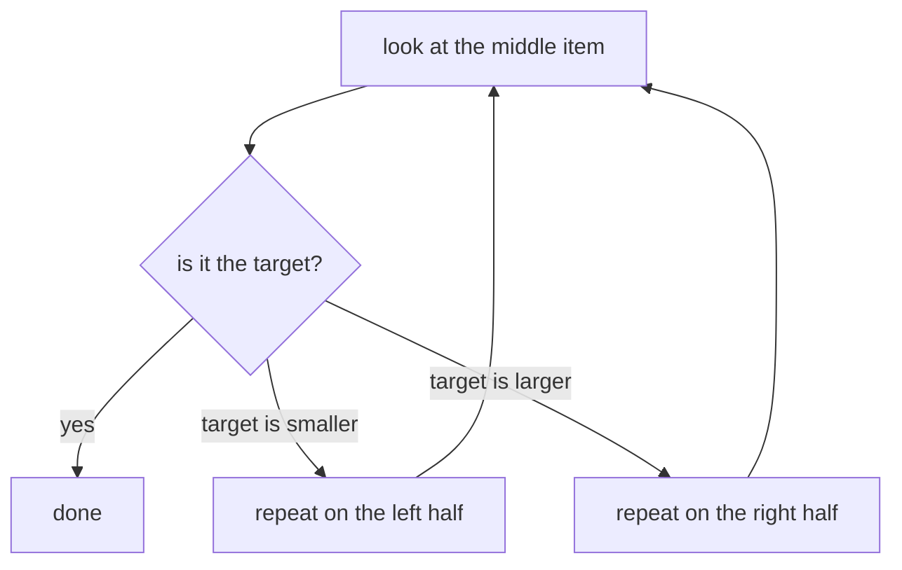

# <Subject Name> · Session <NN> · <Topic Title>

*Learned ____*

<!-- ── QUICK RULES (reminder only — the full rules live in AGENTS.md) ──────────
     • Subject knowledge only. No admin, navigation, or "how to use this note".
     • Headings are plain topics, NO numbers ("## Chatbots to Agentic Systems").
     • Refer to other sections by name; never point to future classes
       ("session 11", "L7"); don't name-drop slides/textbooks; no links to
       other subjects.
     • Every concept has: Intuition → Mechanism → Worked example → Tradeoff,
       plus at least one diagram (placed where it best illustrates).
     • The EXAMPLE section below shows the target shape. Copy its shape, then
       delete it.
     ──────────────────────────────────────────────────────────────────────── -->

## Why this matters

<2–4 sentences: what this is and why it's worth knowing *for your career* — what you'll be able to do once you have it.>

**Running example (if any):** <the concrete thread reused throughout the note>.

---

## <Part title — a topic, no number>

<!-- ▼▼▼ EXAMPLE — this is what a good section looks like. Delete it, then write your own. ▼▼▼ -->

### Binary search

**Intuition** — Looking for a name in a sorted phone book, you don't read every page. You open the middle, see whether you've gone too far or not far enough, and throw away half the book. Binary search is exactly that: halve what's left with every guess.

**Mechanism** — On a **sorted** list: look at the middle item. If it's your target, stop. If your target is smaller, repeat on the left half; if larger, repeat on the right half. Each step drops half the items, so it finds anything in about log₂(n) steps.

**Worked example** — Find **7** in `[1, 3, 5, 7, 9, 11]`:
- middle → **5**. 7 is bigger → keep the right half `[7, 9, 11]`.
- middle → **9**. 7 is smaller → keep the left half `[7]`.
- middle → **7**. Found it — in 3 checks instead of up to 6.

**Tradeoff / when NOT to use** — It only works if the list is already **sorted**, and sorting takes time. For a small list, or one you search just once, plain start-to-end scanning is simpler and just as fast. Binary search pays off when the list is big and searched many times.

<!-- ▲▲▲ END EXAMPLE — delete from "### Binary search" down to here. ▲▲▲ -->

---

### <Your first concept>

**Intuition** — <the mental model: a picture, analogy, or plain reframe. Not "this is important", not a bare definition.>

**Mechanism** — <how it works: the steps, or the formula with each symbol named.>

**Worked example** — <one concrete instance, by hand or in ≤30 lines. Keep the **Worked example** label even if the heading mirrors a slide title.>

**Tradeoff / when NOT to use** — <the cost, the failure mode, the case where a simpler option wins. Never blank, never "it depends".>

<diagram — where it best illustrates.>

<!-- New part = a new "## <title>" divider. Optional depth blocks at the end of a
     concept, marked beyond-course:
     > ***In practice*** — how it's used on the job.
     > ***Going deeper*** — deeper mechanism or an adjacent concept the course skips. -->

---

## Self-study / Lab / build

<what ran, what broke, link to the lab code.>

---

*Exam: this session is in scope for the **<closed-book mid-sem | open-book comprehensive>** (<scope>). Full evaluation, weights, dates and course logistics live once in [`<code>-master.md`](../<code>-master.md) — not repeated per session.*
