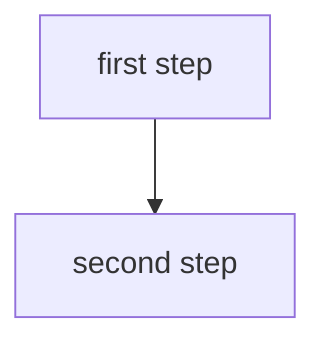

# <Subject Name> · Session <NN> · <Topic Title>

*Learned ____*

<!-- ═══════════════════════════════════════════════════════════════════════
     HOW TO FILL THIS IN  —  delete this block in the real note.

     WHAT GOES HERE   Subject knowledge only. No navigation, admin, logistics,
                      or "how to use this note". Add your own clarity and
                      diagrams freely (mark beyond-course).
     HEADINGS         Topic-only, NO numbers:  "## Chatbots to Agentic Systems",
                      "### The six components"  —  never "## Part 1 ·" / "### 4.".
                      No hand-written "## Topics" index (headings are the outline).
     REFERENCES       Point to other sections by NAME ("see *Production concerns*"),
                      never by number. Never point forward to future course
                      sessions ("session 11", "L7–L8", "Module 2"). No source
                      citations ("the deck", T1/R2). No cross-subject links.
     EVERY CONCEPT    Has all five, in order:
                      Intuition → Mechanism → Worked example → Tradeoff → Diagram.
     ═══════════════════════════════════════════════════════════════════════ -->

## Why this matters

<2–4 sentences: what this is and why it's worth knowing *for a career* — the real-world payoff, what you can do once you have it.>

**Running example (if any):** <the concrete thread reused throughout>.

---

## <Part title — a topic, no number>

### <Concept name — a topic, no number>

**Intuition** — a concrete mental model of what it *is* and why it works: a reframe, an analogy, or a walk-through the reader can picture and hold. NOT (a) meta-commentary ("learn this cold"), (b) a bare definition, (c) a list of terms with no mapping, or (d) a section summary. A definition or importance note may *follow* the model — never replace it.

**Mechanism** — how it works: the step-by-step, or the formula with every symbol named.

**Worked example** — one concrete instance, by hand or in ≤30 lines of code. Keep the **Worked example** label even when the heading mirrors a slide title. If you can't produce it without looking, you don't have the concept yet.

**Tradeoff / when NOT to use** — the cost, the failure mode, the specific case where a simpler option wins. *(Mandatory — never blank, never "depends on the use case".)*

<!-- Every concept gets ≥1 diagram. PLACEMENT is content-driven, not fixed last:
     put it where it best illustrates — right after the Intuition (a visual
     overview) or right after the Mechanism (when it depicts the parts). Prefer
     the deck's figure (look at the IMAGE, not just slide text); else a textbook
     figure; else your own, marked "(my own)". Use `flowchart TD` unless it's a
     short linear ≤5-box pipeline (`LR`). Validate: cd tools && npm run check -->

<!-- OPTIONAL depth blocks — add where the concept has real-world weight; marked beyond-course: -->

> ***In practice*** *— how this is used on the job: tools, auth/cost/latency realities, what production adds.*

> ***Going deeper*** *— deeper mechanism, or a useful adjacent concept the course skips.*

---

### <Next concept>

…repeat the Intuition → Mechanism → Worked example → Tradeoff → Diagram block.

<!-- Start each new part with its own `## <title>` divider (topic-only), then its `### ` concepts. -->

---

## Self-study / Lab / build

<career-useful pointers: what ran, what broke, link to the lab code.>

---

*Exam: this session is in scope for the **<closed-book mid-sem | open-book comprehensive>** (<scope>). Full evaluation, weights, dates and course logistics live once in [`<code>-master.md`](../<code>-master.md) — not repeated per session.*
