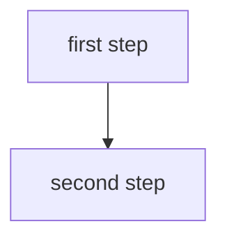

# <Subject Name> · Session <NN> · <Topic Title>

<!-- Title leads with the subject NAME (e.g. "Conversational AI"), not the code. -->

*Learned ____*

<!-- A session file is about the SUBJECT'S KNOWLEDGE — nothing else. No "how to use
     this note" navigation, no admin, no logistics. Add your own knowledge and
     diagrams freely (marked as beyond-course) to build real understanding. -->

## Why this matters

<2–4 sentences: what this is and why it's worth knowing *for a career*. Name the real-world payoff — what you can do once you have this.>

**Running example (if any):** <the concrete thread used throughout>.

<!-- NO "## Topics" index. The `## Part N ·` and `### N.` headings below already
     form an outline that GitHub, Obsidian and VS Code render as a navigable table
     of contents — always in sync, zero maintenance. A hand-written index duplicates
     that and drifts from it. This was built with one-line summaries and a Depth
     column, then removed: 19 of 19 "mechanism" concepts turned out to be exactly
     the ones with a Mechanism block and a worked example, so the column restated
     what the section already showed. -->

---

## Part 1 · <part title>

### 1. <Concept name>

*Reference: <durable source — spec / official docs / textbook chapter / canonical article / link>. Where only the deck exists, say so: "deck only; no durable source behind this."*

**Intuition** — what it actually is, in one or two plain sentences. No jargon that isn't defined here.

**Mechanism / formula** — how it works. The step-by-step, or the equation with each symbol named.

**Worked example** — one concrete instance, done by hand or in ≤30 lines of code. If you can't produce this without looking, you don't have the concept yet.

**Tradeoff / when NOT to use** — the cost, the failure mode, the situation where a simpler option wins. *(Mandatory — never blank.)*

<!-- DIAGRAM: every concept gets at least one. Convert the deck's figure if there
     is one (look at the extracted images, not just the slide text), else a
     textbook figure, else draw your own and mark it "(my own)".
     Direction: `flowchart TD` unless it is a short linear pipeline of <=5 short
     boxes, in which case `flowchart LR`. Wide LR diagrams scroll off the page and
     are cut off in print. Validate with `cd tools && npm run check`. -->

<!-- OPTIONAL depth blocks — add where the concept has real-world weight. Marked as beyond-course. -->

> ***In practice*** *(beyond the deck — how this is used on the job):*
> The tools, the auth/cost/latency realities, the conventions, what production adds that the slide omits.

> ***Going deeper*** *(beyond the deck — deeper mechanism or a useful adjacent concept the course skips):*
> Marked clearly, kept out of the examinable body.

Cross-link: → `_shared/<topic>.md` · <other subjects/sessions>

---

### 2. <Next concept>

...

<!-- start each new Part with its own `## Part N · <title>` divider, then `### ` concepts -->

---

## Self-study / Lab / build

<career-useful pointers, what ran, what broke, link to the code — stays in the body>

---

*Exam: this session is in scope for the **<closed-book mid-sem | open-book comprehensive>** (<scope>). Full evaluation, weights, dates and course logistics live once in [`<code>-master.md`](../<code>-master.md) — not repeated per session.*

<!-- Course logistics belong ONLY in the master index. This footer is a one-liner.
     Optionally add ONE short line for genuinely session-specific loose ends (a to-do
     about this deck), e.g.:
     *Loose ends for this deck: <thing to check>.* -->

